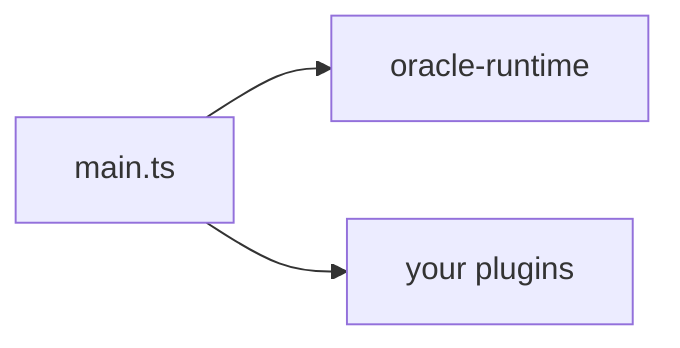

# CLAUDE.md

This file provides guidance to Claude Code (claude.ai/code) when working with code in this repository.

## Project overview

QiForge — a plugin-based framework for building Agentic Oracles on the IXO network. The runtime ships as `@ixo/oracle-runtime`; oracles are thin apps that call `createOracleApp({ config, plugins, nestModules })`.

Active codebase:

- `packages/oracle-runtime/` — the framework (bootstrap, registries, graph, modules, 14 bundled plugins).
- `apps/qiforge-example/` — reference oracle wiring the bundled plugin set + a custom Weather plugin. Use as the canonical "how a fork is built".

`apps/app/` is legacy and being removed (TASK-32). Do not touch prompts, tools, or middlewares there. Scope edits to the runtime package and the example app.

## Build & development commands

```bash
# From root - workspace operations
pnpm install          # Install all dependencies
pnpm build            # Build all packages (turbo)
pnpm test             # Run unit tests across packages
pnpm lint             # Lint (must pass before commit)
pnpm format           # Prettier format
pnpm format:check     # CI uses this — checks without writing

# From apps/qiforge-example - oracle dev workflow
pnpm dev                  # tsx watch src/main.ts
pnpm start                # node dist/main.js
pnpm test:integration     # vitest --mode int

# Run tests for a single package
pnpm test --filter @ixo/oracle-runtime
```

### Pre-commit checklist

```bash
pnpm lint
pnpm format
```

CI runs `pnpm lint` and `pnpm format:check` — both must pass.

## Architecture

### Monorepo structure

- **`packages/oracle-runtime/`** — `@ixo/oracle-runtime`, the framework. Bootstrap (`createOracleApp`), agent build, graph, modules (Sessions, Messages, WS, Secrets, UCAN, Auth, Subscription, Throttler, Health, Matrix checkpointer), 14 bundled plugins.
- **`apps/qiforge-example/`** — reference oracle.
- **`apps/app/`** — legacy monolith, being removed.
- **`packages/`** — other shared packages (`@ixo/events`, `@ixo/matrix`, `@ixo/sqlite-saver`, `@ixo/oracles-chain-client`, `@ixo/oracles-client-sdk`, etc.).

### How the runtime works

A fork's `main.ts` calls `createOracleApp(opts)`. The runtime:

1. Resolves the plugin set (bundled + user plugins, with `features` toggles and `autoDetect`).
2. Topologically sorts by `dependsOn`.
3. Validates every plugin manifest.
4. Composes the env schema from base + every plugin's `configSchema`; validates `process.env`.
5. Populates six registries (tools, sub-agents, middlewares, manifests, configSchema, sharedState).
6. Builds `RuntimeAppModule` with the runtime's always-on modules + plugin Nest modules + user Nest modules.
7. Bootstraps NestJS.
8. Schedules Matrix init in the background.
9. Returns an `OracleApp` whose `listen()` starts HTTP.

Per request:

- `AuthHeaderMiddleware` validates the UCAN delegation.
- `MessagesController` builds a per-request `RuntimeContext` and calls `createMainAgent`.
- `createMainAgent` reads cached registries plus runs request-time hooks (`getRequestTools`, `getRequestSubAgents`), composes the prompt, wraps tools/sub-agents, and returns a compiled LangChain agent.
- LangGraph runs the turn; the checkpointer persists state per user.

Single new state field: `loadedPlugins` — populated by the `load_capability` meta-tool, monotonic per thread.

### Spec and tasks

- `specs/ORA-219-plugin-based-runtime.md` — the design.
- `specs/tasks/README.md` — task index with status table and dependency graph.
- `docs/spec-and-roadmap/` — pointers + follow-ups (the logger replacement, the tasks plugin rebuild, the calls plugin).

## Key file paths

| What | Path |
| --- | --- |
| `createOracleApp` | `packages/oracle-runtime/src/bootstrap/create-oracle-app.ts` |
| Plugin loader | `packages/oracle-runtime/src/bootstrap/plugin-loader.ts` |
| Schema composer | `packages/oracle-runtime/src/bootstrap/schema-composer.ts` |
| Base env schema | `packages/oracle-runtime/src/config/base-env-schema.ts` |
| `OraclePlugin` class | `packages/oracle-runtime/src/plugin-api/oracle-plugin.ts` |
| Public types | `packages/oracle-runtime/src/plugin-api/types.ts` |
| Meta-tools | `packages/oracle-runtime/src/meta-tools/` (load-capability, list-capabilities) |
| Always-on middlewares | `packages/oracle-runtime/src/graph/middlewares/` |
| Six registries | `packages/oracle-runtime/src/registries/` |
| Bundled plugins | `packages/oracle-runtime/src/plugins/` (14 dirs) |
| Bundled plugin index | `packages/oracle-runtime/src/plugins/index.ts` (`BUNDLED_PLUGINS`) |
| Always-on Nest modules | `packages/oracle-runtime/src/modules/` (sessions, messages, ws, secrets, ucan, auth, subscription, throttler, health) |
| Matrix checkpointer | `packages/oracle-runtime/src/matrix/checkpointer/` |
| Test harness | `packages/oracle-runtime/src/testing/create-test-runtime.ts` |
| Reference oracle | `apps/qiforge-example/src/main.ts` |
| Reference plugin | `apps/qiforge-example/src/plugins/weather/weather.plugin.ts` |
| Weather walkthrough | `apps/qiforge-example/WEATHER-PLUGIN.md` |

## Documentation

Two doc surfaces. Don't duplicate between them — link.

### Public docs (developers building oracles)

Lives in `/Users/yousef/ixo-docs/build-an-oracle/` (Mintlify). Audience: oracle developers using `@ixo/oracle-runtime`. Covers concepts, the plugin API, the bundled plugin catalog, env vars, CLI, testing, deployment.

When you change the public API surface (anything in `packages/oracle-runtime/src/plugin-api/`, `bootstrap/`, the manifest schema, env vars), update the relevant page in `build-an-oracle/`.

### Internal docs (framework maintainers)

Lives in `docs/` in this repo. Audience: people growing the framework. Covers runtime architecture (loader, composer, registries, modules, Matrix/checkpointer), how to add bundled plugins / modules / state fields / meta-tools, code conventions, testing strategy, CI.

When you change runtime internals (bootstrap flow, modules, the graph builder, meta-tools), update the relevant page under `docs/architecture/` or `docs/contributing/`.

## Diagrams

Mermaid only. GitHub renders natively — no images, no exports.



Supported types: `graph LR` / `graph TD`, `sequenceDiagram`, `stateDiagram-v2`.

## Answering user questions about oracles / this repo

When a user asks "how do I …?" or anything about building, deploying, configuring, or using oracles:

1. **Check the public docs first** — `/Users/yousef/ixo-docs/build-an-oracle/`. That's the single source of truth for developer-facing guidance.
2. **Check the example app** — `apps/qiforge-example/` (`main.ts`, the weather plugin, `WEATHER-PLUGIN.md`) is the canonical reference implementation.
3. **Check internal docs** — `docs/` covers framework internals if the question goes deeper than the public docs.
4. **Then check the code** — `packages/oracle-runtime/src/` is the authoritative behaviour.
5. **Be autonomous** — when you can do the work (edit files, run commands), do it rather than just telling the user how.

## Memory rules (binding)

These rules apply to every contribution. They're documented in detail in the persistent memory layer.

- **No type assertions to silence the compiler.** No `as any`, no `as unknown as X`. Find the actual mismatch.
- **No co-author / "Generated with Claude" lines** in commits or PRs. Commit as the user's git identity, no attribution.
- **No skip-real-services flags in integration tests.** No `skipMatrixInit`, `skipGracefulShutdown` for speed.
- **No task/spec metadata in source.** Don't write `TASK-XX`, `§N.Y` in source comments. Comments are for runtime/architecture, not project tracking.
- **No upstream MCP tool description overrides.** Pass through verbatim; put guidance in the manifest.
- **No loosening test assertions to mask failures.** Two test-side retry attempts max per failing test; then stop and ask. Don't edit plugin code to make tests pass — plugin source is presumed-working production code.
- **Don't reinvent standard tools.** Use `test.skipIf` / `setupFiles: ['dotenv/config']` / `langchainMatchers` directly — no wrappers.
- **Integration tests must throw on missing env, not skip silently.** No `describe.skipIf(skipReason)` for env gates.
- **Active codebase scope.** `packages/oracle-runtime/` and `apps/qiforge-example/`. Don't edit prompts/tools/middlewares in legacy `apps/app/`.
- **Share one Tier B session across tests** in a `describe`; mint per-test only when isolation is the test's whole point.
- **Stop-and-report between subagent waves.** When delegating multi-task plans, halt after each wave for review; verify subagent claims about external APIs before accepting.
- **Self-check while coding.** Every task does a redundancy / dead-code / bad-practice sweep before reporting done. Quantity of tests ≠ quality of code.

## Linear project tracking

This repo is tracked under the **Oracles App (Base)** project in Linear.

| Field | Value |
| --- | --- |
| Project name | Oracles App (Base) |
| Project ID | `ba41a5cd-1a73-4790-ac80-bab98efaa362` |
| Project URL | https://linear.app/ixo-world/project/oracles-app-base-0ffadb464768 |
| Team | Oracles (`ORA`) + IXO World (`IXO`) |
| Team ID (Oracles) | `a0dbdaaf-2c77-4f93-b933-39766e75c8f1` |
| Team ID (IXO World) | `195237bd-9887-4f87-a276-26735e2b2dad` |
| Lead | youssef.hany@ixo.earth (`f2904c18-18a2-4424-b7c0-19f845379ca7`) |
| Status | In Progress |

### Related Linear projects

| Project | ID | Purpose |
| --- | --- | --- |
| AI Sandbox & Agent Skills | `2005a412-635e-467f-b38a-063ce7dd5669` | AI Sandbox + skills registry |
| @ixo/oracles-client-sdk | `1b88ce1a-f1f6-418a-9c1d-5699d7275c5c` | React client SDK |
| Oracles CLI | `4b40d76e-e7cc-4573-bfc1-45687e6bcd1a` | CLI tool (qiforge-cli) |
| Memory Engine | `20813dd4-ffe5-47fc-be1f-b98e1d68848d` | Graph-based memory system |
| Subscriptions API | `12bb4b13-ac18-47bd-af1e-766e1a517951` | Subscription/billing service |
| Companion Oracle as CoPilot | `f50ca2b5-a3b9-4b42-b0a3-e040b67766d2` | Agent for AG-UI in Portal |
| Domain Indexer | `059688b7-d156-4a47-9363-db51445c60ca` | Domain indexing with MCP |

### Posting updates

When pushing a release or significant milestone, post a project status update:

- Use `save_status_update` with `type: "project"` and `project: "Oracles App (Base)"`.
- Set `health` to `onTrack`, `atRisk`, or `offTrack`.
- Write the body in markdown — readable by both tech and non-tech audiences.

## Related repos

- Skills registry: `https://github.com/ixoworld/ai-skills`
- AI Sandbox: `/Users/yousef/ai-sandbox/` (read `ARCHITECTURE.md` for context, but don't lift internals into our docs)
- CLI: `qiforge-cli` (separate repo). Documented in the public docs at `ixo-docs/build-an-oracle/reference/cli.mdx`.
- Public docs: `/Users/yousef/ixo-docs/` (Mintlify; the QiForge section lives at `build-an-oracle/`).
