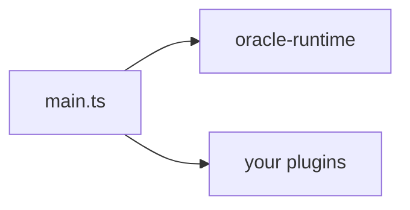

# CLAUDE.md

This file provides guidance to Claude Code (claude.ai/code) when working with code in this repository.

## Project overview

QiForge — a plugin-based framework for building Agentic Oracles on the IXO network. The runtime ships as `@ixo/oracle-runtime` (currently `1.4.0`); oracles are thin apps that call `createOracleApp({ config, plugins, nestModules })`.

Active codebase:

- `packages/oracle-runtime/` — the framework (bootstrap, registries, graph, Nest modules, 16 plugin dirs).
- `apps/qiforge-example/` — reference oracle wiring the bundled plugin set + a custom Weather plugin. Use as the canonical "how a fork is built".

`apps/app/` is legacy and being removed (TASK-32, still open). Do not touch prompts, tools, or middlewares there. Scope edits to the runtime package and the example app. Note that root `pnpm build` already excludes it (`turbo build --filter=!app`) and root `pnpm lint` only lints `packages` + `apps/qiforge-example`.

Toolchain: Node ≥ 22 (`.nvmrc`), pnpm 11.5.1, turbo, TypeScript 5.9, ESM throughout (`"type": "module"` — relative imports need the `.js` extension), Vitest, Changesets for versioning.

## Build & development commands

```bash
# From root — workspace operations
pnpm install          # Install all dependencies
pnpm build            # turbo build --filter=!app
pnpm dev              # turbo dev --filter=qiforge-example
pnpm test             # turbo test (unit tests across packages)
pnpm lint             # eslint packages && eslint apps/qiforge-example
pnpm lint:fix         # same, with --fix
pnpm format           # Prettier write
pnpm format:check     # CI uses this — checks without writing
pnpm infra:up         # docker compose up redis + redis-insight
pnpm infra:down       # tear the infra down

# From apps/qiforge-example — oracle dev workflow
pnpm dev                  # tsx watch src/main.ts
pnpm start                # node dist/main.js
pnpm build                # tsc -p tsconfig.build.json
pnpm test:integration     # vitest run --mode int

# From packages/oracle-runtime
pnpm test                 # vitest run
pnpm test:integration     # vitest run --mode int
pnpm test:cov             # vitest run --coverage
pnpm typecheck            # tsc --noEmit

# Scope a turbo task to one package
pnpm test --filter @ixo/oracle-runtime
```

### Pre-commit checklist

```bash
pnpm lint
pnpm format
```

CI (`.github/workflows/ci.yml`, on every PR) runs `pnpm install --frozen-lockfile`, `pnpm build`, `pnpm lint`, `pnpm format:check` — all four must pass. Publishing is a manual `workflow_dispatch` (`.github/workflows/npm-package-publish.yaml`).

## Architecture

### Monorepo structure

- **`packages/oracle-runtime/`** — `@ixo/oracle-runtime`, the framework. Bootstrap (`createOracleApp`), agent build, graph, always-on Nest modules, bundled plugins. Three public entry points: `.`, `./testing`, `./testing/integration`.
- **`apps/qiforge-example/`** — reference oracle. Boots the bundled set + `WeatherPlugin`, demos `nestModules`, `authExcludedRoutes`, `manifestOverrides`, and a dev-only BullMQ dashboard.
- **`apps/app/`** — legacy monolith, being removed.
- **`packages/`** — shared packages: `@ixo/common`, `@ixo/logger`, `@ixo/matrix`, `@ixo/oracles-events` (`packages/events`), `@ixo/slack`, `@ixo/sqlite-saver`, `@ixo/ucan`, `@ixo/oracles-chain-client`, `@ixo/oracles-client-sdk`, plus the shared configs `@ixo/eslint-config`, `@ixo/typescript-config`, `@ixo/vitest-config`.

### How the runtime works

A fork's `main.ts` calls `createOracleApp(opts)`. `packages/oracle-runtime/src/bootstrap/create-oracle-app.ts` then, in order:

1. Validates `opts.config` (`name` required).
2. Resolves the plugin set — bundled + user plugins, deduped by name (user instances win), gated by `features` toggles and each plugin's `autoDetect(env)`.
3. Topologically sorts by `dependsOn` (order drives middleware fire order and tool emission order).
4. Merges `manifestOverrides` onto each plugin's manifest, then validates every effective manifest.
5. Composes the env schema from `base-env-schema.ts` + every loaded plugin's `configSchema`; validates `process.env`.
6. Cross-checks the LLM provider key (`LLM_PROVIDER` ⇒ the matching `*_API_KEY`) — Zod can't express that.
7. Builds `OracleIdentity` from `config` + `ORACLE_ENTITY_DID`.
8. Populates six registries (tools, sub-agents, middlewares, manifests, configSchema, sharedState).
9. Builds `RuntimeAppModule` with the runtime's always-on modules + plugin Nest modules + user `nestModules`, and bootstraps NestJS.
10. Constructs `AmbientServices` once DI exists, warms the registry boot caches, and publishes the `OracleRuntimeBundle`.
11. Schedules Matrix init in the background (fire-and-forget).
12. Returns an `OracleApp` — `listen()` starts HTTP; `plugins.status()`, `onPluginStatusChange()`, `onError()` expose boot state.

Per request:

- `AuthHeaderMiddleware` validates the UCAN delegation (routes in `authExcludedRoutes` — runtime-, plugin-, and host-declared — are skipped).
- `MessagesController` builds a per-request `RuntimeContext` and calls the agent builder.
- `createMainAgent` reads cached registries plus runs request-time hooks (`getRequestTools`, `getRequestSubAgents`) in parallel, composes the prompt, wraps tools/sub-agents, and returns a compiled LangChain agent.
- LangGraph runs the turn; the Matrix/SQLite checkpointer persists state per user.

### Plugin API surface

`OraclePlugin` (`plugin-api/oracle-plugin.ts`) — everything except `name`, `version`, and `manifest` is optional:

`dependsOn`, `softDependsOn`, `configSchema`, `autoDetect(env)`, `autoDetectHint`, `getTools(ctx)`, `getSubAgents(ctx)`, `getRequestTools(rtCtx)`, `getRequestSubAgents(rtCtx)`, `getMiddlewares(ctx)`, `getSharedState()`, `getNestModules(ctx)`, `getAuthExcludedRoutes()`.

### Graph state

`packages/oracle-runtime/src/graph/state.ts` defines `MainAgentGraphState`: `config`, `client` (`portal | matrix | slack`), `messages`, `editorRoomId`, `spaceId`, `currentEntityDid`, `browserTools`, `agActions`, `userContext`, `userPreferences`, and `loadedPlugins` — the last populated by the `load_capability` meta-tool with a set-union reducer, so it is monotonic per thread. Adding a field is a documented procedure: `docs/contributing/adding-a-state-field.md`.

### Always-on graph middlewares

`packages/oracle-runtime/src/graph/middlewares/`: capability gate, page context, safety guardrail, summarization, tool repetition guard, tool validation.

### Plugins

`packages/oracle-runtime/src/plugins/` holds 16 implemented plugin dirs: `agui`, `composio`, `credits`, `domain-indexer`, `editor`, `firecrawl`, `flows`, `matrix-group-chats`, `memory`, `portal`, `sandbox`, `skills`, `slack`, `tasks`, `user-preferences`, `vfs`.

`BUNDLED_PLUGINS` in `plugins/index.ts` is the default set `createOracleApp` uses: 15 of those plus a `calls` stub (`TASK-18`, deferred). **`flows` is deliberately not bundled** — it's opt-in and a fork constructs it explicitly (`new FlowsPlugin({ matrixClient })`), though the class is still exported from the public barrel. When you add or remove a bundled plugin, update `BUNDLED_PLUGINS`, `docs/contributing/adding-a-bundled-plugin.md`'s catalog references, and the public plugin catalog page.

### Nest modules

Always-on, wired in `bootstrap/runtime-app-module.ts`: `ThrottlerModule`, `UcanModule`, `BlobStoreModule`, `AuthModule`, `SubscriptionModule`, `SessionsModule`, `MessagesModule`, `ModelsModule`, `WsModule`, `HealthModule` — plus global `ConfigModule` (fed the validated env), `CacheModule`, and `ScheduleModule`. `modules/secrets/` is a service reached through `AmbientServices`, not a Nest module.

### LLM and model selection

`packages/oracle-runtime/src/llm/` owns the provider wiring (`llm-provider.ts`), the model catalog (`model-catalog.ts`), and OpenRouter pricing (`openrouter-pricing.ts`). `ModelsModule` exposes `GET /models`. Behaviour is documented in `docs/architecture/model-selection.md`. Providers: OpenRouter and Nebius (`LLM_PROVIDER`, `DEFAULT_MODEL`, `MODEL_PRICE_MARKUP`, `MAIN_REASONING_EFFORT`).

### Tracing

LangSmith is wired per request in `modules/messages/langsmith-tracing.ts`. `LANGSMITH_TRACING=true` traces everyone; `LANGSMITH_TRACED_DIDS` is a comma-separated DID allowlist (`*` = all). The two are mutually exclusive and the allowlist requires `LANGSMITH_API_KEY` — both misconfigurations fail the boot rather than silently uploading nothing.

### Env vars

The base (Tier-0) schema lives in `packages/oracle-runtime/src/config/base-env-schema.ts`; each plugin contributes its own keys via `configSchema` and the composer merges them. Never read `process.env` directly in plugin code — declare the key in `configSchema` and read it off the context. `turbo.json`'s `globalEnv` list must also carry any new key that affects build/test caching.

### Spec and tasks

- `specs/ORA-219-plugin-based-runtime.md` — the design.
- `specs/tasks/README.md` — task index, status table, dependency graph (28 of 30 in-scope tasks done; TASK-32/33/34 still open).
- `docs/spec-and-roadmap/` — pointers + follow-ups (logger replacement, tasks plugin rebuild, calls plugin).
- `specs/` also holds older/adjacent specs (matrix chat parity, playbooks, VFS, integration testing). Treat ORA-219 as the live one.

## Key file paths

| What                      | Path                                                                                                                                      |
| ------------------------- | ----------------------------------------------------------------------------------------------------------------------------------------- |
| `createOracleApp`         | `packages/oracle-runtime/src/bootstrap/create-oracle-app.ts`                                                                              |
| Plugin loader             | `packages/oracle-runtime/src/bootstrap/plugin-loader.ts`                                                                                  |
| Schema composer           | `packages/oracle-runtime/src/bootstrap/schema-composer.ts`                                                                                |
| Nest app module           | `packages/oracle-runtime/src/bootstrap/runtime-app-module.ts`                                                                             |
| Base env schema           | `packages/oracle-runtime/src/config/base-env-schema.ts`                                                                                   |
| `OraclePlugin` class      | `packages/oracle-runtime/src/plugin-api/oracle-plugin.ts`                                                                                 |
| Public types              | `packages/oracle-runtime/src/plugin-api/types.ts`                                                                                         |
| Agent build               | `packages/oracle-runtime/src/graph/main-agent.ts`, `modules/messages/agent-builder.ts`                                                    |
| Graph state               | `packages/oracle-runtime/src/graph/state.ts`                                                                                              |
| Meta-tools                | `packages/oracle-runtime/src/meta-tools/` (load-capability, list-capabilities)                                                            |
| Always-on middlewares     | `packages/oracle-runtime/src/graph/middlewares/` (6)                                                                                      |
| Six registries            | `packages/oracle-runtime/src/registries/`                                                                                                 |
| Runtime/plugin contexts   | `packages/oracle-runtime/src/runtime-context/`                                                                                            |
| Plugins                   | `packages/oracle-runtime/src/plugins/` (16 dirs)                                                                                          |
| Bundled plugin index      | `packages/oracle-runtime/src/plugins/index.ts` (`BUNDLED_PLUGINS`)                                                                        |
| Always-on Nest modules    | `packages/oracle-runtime/src/modules/` (auth, blob-store, health, messages, models, secrets, sessions, subscription, throttler, ucan, ws) |
| LLM + model catalog       | `packages/oracle-runtime/src/llm/`                                                                                                        |
| Matrix checkpointer       | `packages/oracle-runtime/src/matrix/checkpointer/`                                                                                        |
| Unit test harness         | `packages/oracle-runtime/src/testing/create-test-runtime.ts`                                                                              |
| Integration harness       | `packages/oracle-runtime/src/testing/integration/`                                                                                        |
| Reference oracle          | `apps/qiforge-example/src/main.ts`                                                                                                        |
| Reference plugin          | `apps/qiforge-example/src/plugins/weather/weather.plugin.ts`                                                                              |
| Weather walkthrough       | `apps/qiforge-example/WEATHER-PLUGIN.md`                                                                                                  |
| Example integration tests | `apps/qiforge-example/test/integration/`                                                                                                  |

## Testing

- **Unit tests** live next to the source (`*.test.ts`) and run with `pnpm test` (Vitest, config shared via `@ixo/vitest-config`, workspace defined in `vitest.workspace.ts`).
- **Integration tests** are `*.int.test.ts` and only run under `--mode int`. They hit real services. Build them on `createTestRuntime` (`@ixo/oracle-runtime/testing`) and the integration harness (`@ixo/oracle-runtime/testing/integration` — chat client, UCAN, SSE parser, Matrix wait helpers).
- Integration tests **throw on missing env**, never skip silently. No skip-real-services flags.
- Strategy and CI details: `docs/testing/overview.md`, `docs/testing/test-harness.md`, `docs/testing/integration-tests.md`, `docs/testing/ci.md`.

## Documentation

Two doc surfaces. Don't duplicate between them — link.

### Public docs (developers building oracles)

Lives in the separate `ixo-docs` repo under `build-an-oracle/` (Mintlify) — locally at `/Users/yousef/ixo-docs/build-an-oracle/` on the maintainer's machine; it is **not** part of this workspace, so it won't be present in a fresh clone or a remote session. Audience: oracle developers using `@ixo/oracle-runtime`. Covers concepts, the plugin API, the bundled plugin catalog, env vars, CLI, testing, deployment.

When you change the public API surface (anything in `packages/oracle-runtime/src/plugin-api/`, `bootstrap/`, the manifest schema, env vars), update the relevant page in `build-an-oracle/`. If that repo isn't available, say so and flag the page that needs updating.

### Internal docs (framework maintainers)

Lives in `docs/` in this repo. Audience: people growing the framework.

- `docs/architecture/` — `overview`, `boot-sequence`, `plugin-lifecycle`, `runtime-context`, `graph-and-state`, `modules`, `meta-tools-and-discovery`, `matrix-and-checkpointer`, `model-selection`.
- `docs/contributing/` — `adding-a-bundled-plugin`, `adding-a-module`, `adding-a-state-field`, `adding-a-meta-tool`, `adding-an-always-on-middleware`, `code-conventions`.
- `docs/testing/` — `overview`, `test-harness`, `integration-tests`, `ci`.
- `docs/spec-and-roadmap/` — spec pointer, task index, follow-ups.

`docs/README.md` maps "touched X ⇒ update Y". Follow it. When you change runtime internals (bootstrap flow, modules, the graph builder, meta-tools), update the matching page in the same PR.

## Diagrams

Mermaid only. GitHub renders natively — no images, no exports.



Supported types: `graph LR` / `graph TD`, `sequenceDiagram`, `stateDiagram-v2`.

## Answering user questions about oracles / this repo

When a user asks "how do I …?" or anything about building, deploying, configuring, or using oracles:

1. **Check the public docs first** — `ixo-docs/build-an-oracle/`. That's the single source of truth for developer-facing guidance (see the caveat above about availability).
2. **Check the example app** — `apps/qiforge-example/` (`main.ts`, the weather plugin, `WEATHER-PLUGIN.md`) is the canonical reference implementation.
3. **Check internal docs** — `docs/` covers framework internals if the question goes deeper than the public docs.
4. **Then check the code** — `packages/oracle-runtime/src/` is the authoritative behaviour.
5. **Be autonomous** — when you can do the work (edit files, run commands), do it rather than just telling the user how.

## Memory rules (binding)

These rules apply to every contribution. They're documented in detail in the persistent memory layer.

- **No type assertions to silence the compiler.** No `as any`, no `as unknown as X`. Find the actual mismatch.
- **No co-author / "Generated with Claude" lines** in commits or PRs. Commit as the user's git identity, no attribution.
- **No skip-real-services flags in integration tests.** No `skipMatrixInit`, `skipGracefulShutdown` for speed.
- **No task/spec metadata in source.** Don't write `TASK-XX`, `§N.Y` in source comments. Comments are for runtime/architecture, not project tracking.
- **No upstream MCP tool description overrides.** Pass through verbatim; put guidance in the manifest.
- **No loosening test assertions to mask failures.** Two test-side retry attempts max per failing test; then stop and ask. Don't edit plugin code to make tests pass — plugin source is presumed-working production code.
- **Don't reinvent standard tools.** Use `test.skipIf` / `setupFiles: ['dotenv/config']` / `langchainMatchers` directly — no wrappers.
- **Integration tests must throw on missing env, not skip silently.** No `describe.skipIf(skipReason)` for env gates.
- **Active codebase scope.** `packages/oracle-runtime/` and `apps/qiforge-example/`. Don't edit prompts/tools/middlewares in legacy `apps/app/`.
- **Share one Tier B session across tests** in a `describe`; mint per-test only when isolation is the test's whole point.
- **Stop-and-report between subagent waves.** When delegating multi-task plans, halt after each wave for review; verify subagent claims about external APIs before accepting.
- **Self-check while coding.** Every task does a redundancy / dead-code / bad-practice sweep before reporting done. Quantity of tests ≠ quality of code.

## Linear project tracking

This repo is tracked under the **Oracles App (Base)** project in Linear.

| Field               | Value                                                              |
| ------------------- | ------------------------------------------------------------------ |
| Project name        | Oracles App (Base)                                                 |
| Project ID          | `ba41a5cd-1a73-4790-ac80-bab98efaa362`                             |
| Project URL         | https://linear.app/ixo-world/project/oracles-app-base-0ffadb464768 |
| Team                | Oracles (`ORA`) + IXO World (`IXO`)                                |
| Team ID (Oracles)   | `a0dbdaaf-2c77-4f93-b933-39766e75c8f1`                             |
| Team ID (IXO World) | `195237bd-9887-4f87-a276-26735e2b2dad`                             |
| Lead                | youssef.hany@ixo.earth (`f2904c18-18a2-4424-b7c0-19f845379ca7`)    |
| Status              | In Progress                                                        |

### Related Linear projects

| Project                     | ID                                     | Purpose                      |
| --------------------------- | -------------------------------------- | ---------------------------- |
| AI Sandbox & Agent Skills   | `2005a412-635e-467f-b38a-063ce7dd5669` | AI Sandbox + skills registry |
| @ixo/oracles-client-sdk     | `1b88ce1a-f1f6-418a-9c1d-5699d7275c5c` | React client SDK             |
| Oracles CLI                 | `4b40d76e-e7cc-4573-bfc1-45687e6bcd1a` | CLI tool (qiforge-cli)       |
| Memory Engine               | `20813dd4-ffe5-47fc-be1f-b98e1d68848d` | Graph-based memory system    |
| Subscriptions API           | `12bb4b13-ac18-47bd-af1e-766e1a517951` | Subscription/billing service |
| Companion Oracle as CoPilot | `f50ca2b5-a3b9-4b42-b0a3-e040b67766d2` | Agent for AG-UI in Portal    |
| Domain Indexer              | `059688b7-d156-4a47-9363-db51445c60ca` | Domain indexing with MCP     |

### Posting updates

When pushing a release or significant milestone, post a project status update:

- Use `save_status_update` with `type: "project"` and `project: "Oracles App (Base)"`.
- Set `health` to `onTrack`, `atRisk`, or `offTrack`.
- Write the body in markdown — readable by both tech and non-tech audiences.

## Related repos

- Skills registry: `https://github.com/ixoworld/ai-skills`
- AI Sandbox: `/Users/yousef/ai-sandbox/` (read `ARCHITECTURE.md` for context, but don't lift internals into our docs)
- CLI: `qiforge-cli` (separate repo). Documented in the public docs at `ixo-docs/build-an-oracle/reference/cli.mdx`.
- Public docs: `ixo-docs` (Mintlify; the QiForge section lives at `build-an-oracle/`).
