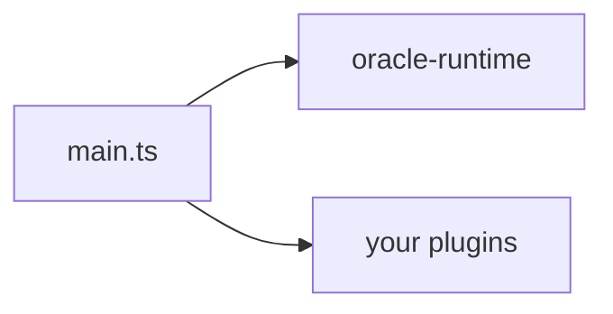

# CLAUDE.md

This file provides guidance to Claude Code (claude.ai/code) when working with code in this repository.

## Project overview

QiForge — a plugin-based framework for building Agentic Oracles on the IXO network. The runtime ships as `@ixo/oracle-runtime-workers` and runs on Cloudflare Workers; an oracle is a thin Worker that calls `createOracleWorker({ config, plugins })` and exports the two Durable Object classes.

**Active codebase (the only place new work goes):**

- `packages/oracle-runtime-workers/` — the runtime: Hono shell, `UserOracleDO` (one per user DID: SQLite in WASM over DO storage, the LangGraph turn, durable runs, tasks, owner-copy persistence), `MatrixGatewayDO` (E2EE Matrix ingress on `@ixo/matrix-bot-workers-sdk`), the plugin API and the bundled plugins.
- `apps/qiforge-workers-example/` — the reference Worker and every local/devnet test drill. Use as the canonical "how an oracle is built".
- `packages/common/` (`@ixo/common`; the runtime imports its subpaths `@ixo/common/ai/decisions` — bounded semantic Decisions —, `@ixo/common/ai/frontend-bridge` and `@ixo/common/work`), `packages/ucan/` (`@ixo/ucan`), `packages/oracles-client-sdk/` (React SDK), `packages/ixo-transaction/` (`@ixo/ixo-transaction`: IXO message catalog and validation for `IxoTransactionPlugin`, plus the Portal signing hook at `@ixo/ixo-transaction/react`).

### ⚠️ The Node runtime is DEPRECATED — do not work on it

`packages/oracle-runtime/` (`@ixo/oracle-runtime`, NestJS), `apps/qiforge-example/` and `packages/sqlite-saver/` are **no longer developed**. Nobody deploys them; every companion and oracle runs the Workers runtime. They stay in the repo only so the published package keeps building for old forks.

- Do not add features, "Node parity", refactors or tests there. A PR that touches both runtimes only needs its Workers half; drop or leave the Node half untouched.
- Do not read the Node code to learn how the runtime works — read `packages/oracle-runtime-workers/docs/` and the Workers source. `packages/oracle-runtime-workers/docs/node-parity.md` records the behaviours that intentionally differ.
- Only touch it when a security advisory forces a dependency bump or when `pnpm build` / `pnpm lint` on main would otherwise break.

## Build & development commands

```bash
# From root - workspace operations
pnpm install          # Install all dependencies
pnpm build            # Build all packages (turbo)
pnpm test             # Run unit tests across packages
pnpm lint             # Lint (must pass before commit)
pnpm format           # Prettier format
pnpm format:check     # CI uses this — checks without writing

# Workers runtime — what the "Workers harness" CI job runs
pnpm --filter @ixo/ucan --filter "@ixo/common..." --filter "@ixo/ixo-transaction..." build   # the runtime resolves these through dist
pnpm --filter @ixo/oracle-runtime-workers typecheck
pnpm --filter @ixo/oracle-runtime-workers test:core        # plain-Node suites (vitest.core.config.ts)
pnpm --filter @ixo/oracle-runtime-workers test             # inside workerd (@cloudflare/vitest-pool-workers)
pnpm --filter @ixo/oracles-client-sdk exec vitest run src/utils/sse-parser.test.ts

# Shared packages (plain vitest)
pnpm --filter @ixo/common test
pnpm --filter @ixo/ixo-transaction test

# From apps/qiforge-workers-example — against the local ixo testing harness
# (~/dev/ixo/testing-harness, Synapse ixo.test :34008, Blocksync :34582) and a real LLM
pnpm dev                  # wrangler dev
pnpm test:e2e             # auth, streaming, tools, owner copy, E2EE Matrix, resets, tasks
pnpm test:e2e:durable     # durable runs
pnpm test:e2e:context     # context budgets
pnpm test:e2e:threads     # Matrix threads as sessions
pnpm test:e2e:group       # Matrix group rooms
pnpm test:e2e:transcript  # transcript paging
pnpm test:e2e:vfs         # owner copy in the VFS
pnpm test:e2e:legacy-large  # import of a large legacy Matrix copy
pnpm test:e2e:tier        # R2 page tier
pnpm test:e2e:mcp         # the MCP plugin path (memory)
pnpm test:e2e:feedback    # anonymous response feedback
pnpm test:e2e:pod         # POD Creator
pnpm test:e2e:channels --help   # IXO Channels acceptance (live gateway, operator checkpoints; docs/testing/channels-acceptance.md)
pnpm test:stress          # concurrent users
pnpm exec tsx test/e2e-migration.ts   # Node → Workers owner-copy migration (no package script; also boots the Node oracle)
STEP_FILTER='^regex' pnpm test:e2e:durable   # one step or a group while iterating (durable, context, threads, group, transcript, feedback, pod)
```

Run the targeted layer while iterating and the full matrix once at the end — `packages/oracle-runtime-workers/docs/testing.md` lists every suite and what it proves. `wrangler dev` does not forward the worker's `console.log` to the parent process; e2e assertions use the debug routes, never log lines.

### Pre-commit checklist

```bash
pnpm lint
pnpm format
```

CI runs `pnpm build`, `pnpm lint` and `pnpm format:check` ("Build and Lint") plus the Workers harness job above — all must pass.

## Architecture

### Monorepo structure

- **`packages/oracle-runtime-workers/`** — `@ixo/oracle-runtime-workers`, the runtime. `src/shell` (Hono app + UCAN auth), `src/do` (`UserOracleDO`, run coordinator, owner-copy flush, idle eviction), `src/matrix` (`MatrixGatewayDO`, ingest, inbox, group chats), `src/core` (main agent, middlewares, meta-tools, context budgets, capability router, request admission, `ctx.kv`), `src/plugin-api` (incl. tool planes), `src/plugins`, `src/tasks` (scheduler, Topic deliverables), `src/channels` (IXO Channels ingress), `src/delivery` (chat delivery profiles, Reply Plans), `src/artifacts` (artefact store, viewer, R2 sweep), `src/feedback` (anonymous response feedback), `src/sqlite`, `src/owner-store`, `src/llm` (BYO providers), `src/realtime` (socket.io, frontend bridge), `src/attachments`, `src/secrets`.
- **`apps/qiforge-workers-example/`** — reference Worker; `wrangler.jsonc` (single script, local harness), `wrangler.devnet.jsonc` + `wrangler.gateway.devnet.jsonc` (two scripts), `test/` (harness e2e drills, `devnet-features.ts`, load tests).
- **`packages/`** — shared packages (`@ixo/common`, `@ixo/ucan`, `@ixo/ixo-transaction`, `@ixo/matrix`, `@ixo/oracles-chain-client`, `@ixo/oracles-client-sdk`, etc.).
- **Deprecated:** `packages/oracle-runtime/`, `apps/qiforge-example/`, `packages/sqlite-saver/`, `packages/events/` (Node runtime — see above).

### How the runtime works

One Worker deployment = one oracle (optionally split into an oracle script and a gateway script, see `packages/oracle-runtime-workers/docs/architecture.md#two-worker-scripts-the-gateway-split`).

- The Hono shell authenticates every request with a UCAN invocation proved by the user's delegation to the oracle (`src/shell/auth.ts`) and forwards it to the `UserOracleDO` of the proven DID.
- `UserOracleDO` holds the user's SQLite database (LangGraph checkpoints, sessions, transcript) in DO storage through wa-sqlite, builds the turn (`src/core/main-agent.ts`: cached registries + request-time hooks, prompt composer, capability gate, always-on middlewares), runs it as a durable run (`src/do/run-coordinator.ts`: restart-safe, re-joinable with a cursor, tool effect marks) and streams SSE straight from the object.
- `MatrixGatewayDO` syncs the oracle's Matrix account (E2EE via `@ixo/matrix-bot-workers-sdk`), debounces room messages into turns (`src/matrix/ingest.ts`, durable inbox) and dispatches them to user objects; a thread root is a session id.
- The user's database is exported as an encrypted owner copy to the user's VFS (or Matrix media on the legacy path) on a daily deadline, re-imported on a cold start; idle objects are evicted after the flush.
- Besides the Portal's HTTP/SSE and Matrix rooms, a turn can arrive from the IXO Channels gateway (`POST /channels/turn`, `src/channels/`) or the Topic deliverable API (`/topic-deliverables/*`, off unless `TOPIC_DELIVERABLES_ENABLED`). Chat surfaces get a chat delivery profile and a Reply Plan; long replies become artefacts behind `/a/:id` (`packages/oracle-runtime-workers/docs/chat-delivery.md`, `channels.md`).
- Plugins are the same `OraclePlugin` classes as before: tools, sub-agents, middlewares, manifest, `configSchema`; on-demand plugins are hidden by the capability gate until `load_capability` (or the capability router) admits them. A tool is on the `orchestration` plane unless it declares `plane: 'admin'`, which needs an `admin-tool/invoke` grant in the user's delegation. Plugins keep durable per-user state in `ctx.kv`. `BUNDLED_WORKERS_PLUGINS` (`src/plugins/index.ts`) is memory, sandbox, firecrawl, domain-indexer, composio, vfs, tasks, editor, user-preferences, portal, agui, attachments, matrix-group-chats and pod-creator; `FlowsPlugin`, `IxoTransactionPlugin`, `WeatherPlugin` and `SkillsPlugin` are exported but opt-in.

### Specs and plans

- `packages/oracle-runtime-workers/docs/` — architecture, configuration, operations, testing, load tests, node-parity, channels, chat-delivery, frontend-bridge, ixo-transaction, pod-creator.
- `docs/plans/` — design notes for the larger Workers changes (durable runs, context budgets, transcript paging, workers-harness-hardening).
- Root `docs/` pages still maintained for Workers work: `docs/architecture/decisions.md` (the shared Decision module), `docs/architecture/request-admission.md`, `docs/testing/channels-acceptance.md`. The rest of `docs/` is Node-era and frozen.
- `specs/` — `chat-native-delivery.md`, `pod-creator-plugin.md`, `ixo-transaction-signing-plugin.md` (design records of shipped Workers features), `open-decisions-trustworthy-action.md` (draft normative profile the Decision module follows); `ORA-219-plugin-based-runtime.md` is the original plugin-runtime design (Node era; the plugin model still applies).

## Key file paths

| What                                | Path                                                                                                                 |
| ----------------------------------- | -------------------------------------------------------------------------------------------------------------------- |
| `createOracleWorker`                | `packages/oracle-runtime-workers/src/index.ts`                                                                       |
| Gateway entry                       | `packages/oracle-runtime-workers/src/gateway-worker.ts`                                                              |
| HTTP shell + routes                 | `packages/oracle-runtime-workers/src/shell/app.ts`                                                                   |
| UCAN authentication                 | `packages/oracle-runtime-workers/src/shell/auth.ts`                                                                  |
| `UserOracleDO`                      | `packages/oracle-runtime-workers/src/do/user-oracle-do.ts`                                                           |
| Durable runs                        | `packages/oracle-runtime-workers/src/do/run-coordinator.ts`, `run-store.ts`                                          |
| `MatrixGatewayDO` + ingest          | `packages/oracle-runtime-workers/src/matrix/gateway-do.ts`, `ingest.ts`                                              |
| Main agent build                    | `packages/oracle-runtime-workers/src/core/main-agent.ts`                                                             |
| Always-on middlewares               | `packages/oracle-runtime-workers/src/core/middlewares/`                                                              |
| Meta-tools                          | `packages/oracle-runtime-workers/src/core/meta-tools.ts`                                                             |
| Env schema                          | `packages/oracle-runtime-workers/src/core/env.ts`                                                                    |
| `OraclePlugin` + types              | `packages/oracle-runtime-workers/src/plugin-api/oracle-plugin.ts`, `types.ts`                                        |
| Tool planes (admin tools)           | `packages/oracle-runtime-workers/src/plugin-api/tool-plane.ts`                                                       |
| Request admission                   | `packages/oracle-runtime-workers/src/core/request-admission.ts`, `plugin-api/request-admission.ts`                   |
| `ctx.kv` (plugin state)             | `packages/oracle-runtime-workers/src/sqlite/user-kv-store.ts`, `src/core/user-kv.ts` (in-memory)                     |
| Bundled plugins                     | `packages/oracle-runtime-workers/src/plugins/` (`index.ts` lists them)                                               |
| Tasks scheduler                     | `packages/oracle-runtime-workers/src/tasks/scheduler.ts`                                                             |
| Topic deliverables                  | `packages/oracle-runtime-workers/src/tasks/topic-deliverables.ts`                                                    |
| Channels ingress                    | `packages/oracle-runtime-workers/src/channels/`                                                                      |
| Chat delivery                       | `packages/oracle-runtime-workers/src/delivery/`                                                                      |
| Artefacts (store, viewer, R2 sweep) | `packages/oracle-runtime-workers/src/artifacts/`                                                                     |
| Anonymous feedback                  | `packages/oracle-runtime-workers/src/feedback/`                                                                      |
| Frontend bridge                     | `packages/oracle-runtime-workers/src/realtime/frontend-call-registry.ts`, `packages/common/src/ai/frontend-bridge/`  |
| Decision module                     | `packages/common/src/ai/decisions/` (runtime wiring: `packages/oracle-runtime-workers/src/core/index.ts`)            |
| Portable work / AgentWake           | `packages/common/src/work/`                                                                                          |
| IXO transaction signing             | `packages/ixo-transaction/` (catalog, `/react` hook), `packages/oracle-runtime-workers/src/plugins/ixo-transaction/` |
| POD Creator                         | `packages/oracle-runtime-workers/src/plugins/pod-creator/`                                                           |
| SQLite over DO storage              | `packages/oracle-runtime-workers/src/sqlite/`                                                                        |
| Owner copy (VFS / Matrix)           | `packages/oracle-runtime-workers/src/owner-store/`                                                                   |
| Unit test bindings                  | `packages/oracle-runtime-workers/test/wrangler.test.jsonc`, `test/worker.ts`                                         |
| Reference Worker                    | `apps/qiforge-workers-example/src/index.ts`                                                                          |
| Harness e2e + drills                | `apps/qiforge-workers-example/test/` (`lib/oracle.ts` boots `wrangler dev`, `lib/harness.ts`)                        |
| Devnet feature matrix               | `apps/qiforge-workers-example/test/devnet-features.ts`                                                               |
| Example plugin                      | `packages/oracle-runtime-workers/src/core/plugins/weather/weather.plugin.ts` (`WeatherPlugin`)                       |
| Plugin walkthrough                  | `apps/qiforge-example/WEATHER-PLUGIN.md` (Node-era text; the plugin class is runtime-independent)                    |

## Documentation

Two doc surfaces. Don't duplicate between them — link.

### Public docs (developers building oracles)

Lives in `/Users/yousef/ixo-docs/build-an-oracle/` (Mintlify). Audience: oracle developers. Covers concepts, the plugin API, the bundled plugin catalog, env vars, CLI, testing, deployment.

When you change the public API surface (anything in `packages/oracle-runtime-workers/src/plugin-api/`, the manifest schema, env vars, HTTP routes), update the relevant page in `build-an-oracle/`.

### Internal docs (framework maintainers)

Lives in `packages/oracle-runtime-workers/docs/`. When you change runtime internals, update the matching page there in the same PR (`configuration.md` for env vars and bindings, `operations.md` for behaviour operators see, `testing.md` for new suites, `node-parity.md` for an intentional divergence from the Node runtime, and the feature pages `channels.md`, `chat-delivery.md`, `frontend-bridge.md`, `ixo-transaction.md`, `pod-creator.md`). The older `docs/` tree at the repo root describes the deprecated Node runtime and is frozen, except `docs/architecture/decisions.md` and `docs/architecture/request-admission.md` (update them with the Decision module and request admission) and `docs/testing/channels-acceptance.md`.

## Diagrams

Mermaid only. GitHub renders natively — no images, no exports.


```mermaid
graph LR
    Fork[main.ts] --> Runtime[oracle-runtime]
    Fork --> Plugins[your plugins]
```

Supported types: `graph LR` / `graph TD`, `sequenceDiagram`, `stateDiagram-v2`.

## Answering user questions about oracles / this repo

When a user asks "how do I …?" or anything about building, deploying, configuring, or using oracles:

1. **Check the public docs first** — `/Users/yousef/ixo-docs/build-an-oracle/`. That's the single source of truth for developer-facing guidance.
2. **Check the example Worker** — `apps/qiforge-workers-example/` (`src/index.ts`, the wrangler configs, `test/`) is the canonical reference implementation.
3. **Check the runtime docs** — `packages/oracle-runtime-workers/docs/` covers the internals if the question goes deeper than the public docs.
4. **Then check the code** — `packages/oracle-runtime-workers/src/` is the authoritative behaviour.
5. **Be autonomous** — when you can do the work (edit files, run commands), do it rather than just telling the user how.

## Memory rules (binding)

These rules apply to every contribution. They're documented in detail in the persistent memory layer.

- **No type assertions to silence the compiler.** No `as any`, no `as unknown as X`. Find the actual mismatch.
- **No co-author / "Generated with Claude" lines** in commits or PRs. Commit as the user's git identity, no attribution.
- **No skip-real-services flags in integration tests.** No `skipMatrixInit`, `skipGracefulShutdown` for speed.
- **No task/spec metadata in source.** Don't write `TASK-XX`, `§N.Y` in source comments. Comments are for runtime/architecture, not project tracking.
- **No upstream MCP tool description overrides.** Pass through verbatim; put guidance in the manifest.
- **No loosening test assertions to mask failures.** Two test-side retry attempts max per failing test; then stop and ask. Don't edit plugin code to make tests pass — plugin source is presumed-working production code.
- **Don't reinvent standard tools.** Use `test.skipIf` / `setupFiles: ['dotenv/config']` / `langchainMatchers` directly — no wrappers.
- **Integration tests must throw on missing env, not skip silently.** No `describe.skipIf(skipReason)` for env gates.
- **Active codebase scope.** `packages/oracle-runtime-workers/` and `apps/qiforge-workers-example/`. The Node runtime (`packages/oracle-runtime/`, `apps/qiforge-example/`) is deprecated — don't edit it.
- **Share one Tier B session across tests** in a `describe`; mint per-test only when isolation is the test's whole point.
- **Stop-and-report between subagent waves.** When delegating multi-task plans, halt after each wave for review; verify subagent claims about external APIs before accepting.
- **Self-check while coding.** Every task does a redundancy / dead-code / bad-practice sweep before reporting done. Quantity of tests ≠ quality of code.

## Linear project tracking

This repo is tracked under the **Oracles App (Base)** project in Linear.

| Field               | Value                                                              |
| ------------------- | ------------------------------------------------------------------ |
| Project name        | Oracles App (Base)                                                 |
| Project ID          | `ba41a5cd-1a73-4790-ac80-bab98efaa362`                             |
| Project URL         | https://linear.app/ixo-world/project/oracles-app-base-0ffadb464768 |
| Team                | Oracles (`ORA`) + IXO World (`IXO`)                                |
| Team ID (Oracles)   | `a0dbdaaf-2c77-4f93-b933-39766e75c8f1`                             |
| Team ID (IXO World) | `195237bd-9887-4f87-a276-26735e2b2dad`                             |
| Lead                | youssef.hany@ixo.earth (`f2904c18-18a2-4424-b7c0-19f845379ca7`)    |
| Status              | In Progress                                                        |

### Related Linear projects

| Project                     | ID                                     | Purpose                      |
| --------------------------- | -------------------------------------- | ---------------------------- |
| AI Sandbox & Agent Skills   | `2005a412-635e-467f-b38a-063ce7dd5669` | AI Sandbox + skills registry |
| @ixo/oracles-client-sdk     | `1b88ce1a-f1f6-418a-9c1d-5699d7275c5c` | React client SDK             |
| Oracles CLI                 | `4b40d76e-e7cc-4573-bfc1-45687e6bcd1a` | CLI tool (qiforge-cli)       |
| Memory Engine               | `20813dd4-ffe5-47fc-be1f-b98e1d68848d` | Graph-based memory system    |
| Subscriptions API           | `12bb4b13-ac18-47bd-af1e-766e1a517951` | Subscription/billing service |
| Companion Oracle as CoPilot | `f50ca2b5-a3b9-4b42-b0a3-e040b67766d2` | Agent for AG-UI in Portal    |
| Domain Indexer              | `059688b7-d156-4a47-9363-db51445c60ca` | Domain indexing with MCP     |

### Posting updates

When pushing a release or significant milestone, post a project status update:

- Use `save_status_update` with `type: "project"` and `project: "Oracles App (Base)"`.
- Set `health` to `onTrack`, `atRisk`, or `offTrack`.
- Write the body in markdown — readable by both tech and non-tech audiences.

## Related repos

- Skills registry: `https://github.com/ixoworld/ai-skills`
- AI Sandbox: `/Users/yousef/ai-sandbox/` (read `ARCHITECTURE.md` for context, but don't lift internals into our docs)
- CLI: `qiforge-cli` (separate repo). Documented in the public docs at `ixo-docs/build-an-oracle/reference/cli.mdx`.
- Public docs: `/Users/yousef/ixo-docs/` (Mintlify; the QiForge section lives at `build-an-oracle/`).
