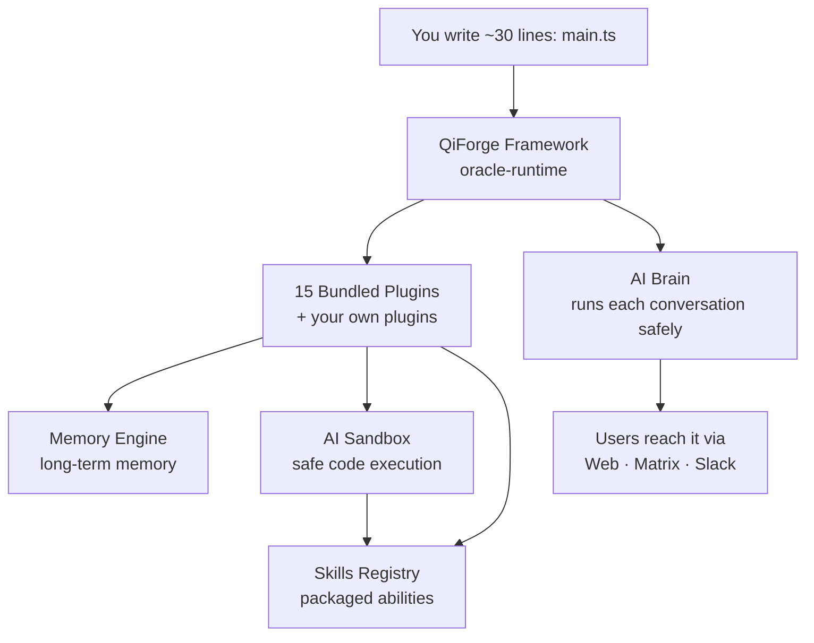

# QiForge


**Build verified AI agents with blockchain identity, encrypted communication, and a growing library of skills — your oracle is a `main.ts` plus the plugins you want.**

QiForge is a plugin-based framework for building **Agentic Oracles** on the [IXO network](https://www.ixo.world/). Each oracle is an autonomous AI agent with a verified on-chain identity, private encrypted storage for every user, and the ability to discover and execute new skills at runtime — without redeployment. The runtime ships as **`@ixo/oracle-runtime`**; you ship the thin app on top.

[](./LICENSE.txt)

---

## Why QiForge?

Most AI frameworks give you a chatbot. QiForge gives you a **verified, autonomous agent** that can reason, remember, learn new skills, charge for its work, and prove its identity — out of the box.

|                          | QiForge                                                                | Typical AI Framework |
| ------------------------ | ---------------------------------------------------------------------- | -------------------- |
| **Verified identity**    | Blockchain DID — users can verify who your agent is                    | None                 |
| **Encrypted comms**      | Per-user encrypted Matrix rooms, synced and self-healing               | Plain text / logs    |
| **Plugins**              | 16 bundled capability packs — toggle with one switch                   | Hardcoded wiring     |
| **Skills at runtime**    | Discovered from a shared registry, executed in a sandbox — no redeploy | Hardcoded tools      |
| **Capability discovery** | The agent equips its own tools mid-conversation                        | Static toolset       |
| **Multi-LLM**            | OpenRouter + Nebius, per-role models, automatic failover               | Vendor lock-in       |
| **Built-in billing**     | Per-user budgets, metering, on-chain settlement                        | DIY                  |
| **Multi-client**         | Portal, CLI, Matrix, Slack — one oracle, every interface               | Single client        |
| **Persistent memory**    | Graph-based, time-aware memory with knowledge scopes                   | External DB required |
| **Secrets safety**       | The AI uses credentials it can never see, print, or leak               | Keys in the prompt   |

---

## An Oracle in ~30 Lines

```ts
import { createOracleApp } from '@ixo/oracle-runtime';
import { WeatherPlugin } from './plugins/weather/index.js';
import { config } from './config.js';

const app = await createOracleApp({
  config, // name, org, personality, features
  plugins: [new WeatherPlugin()], // your plugins, next to 16 bundled ones
});

await app.listen();
```

That's a working oracle. The runtime hands you, for free:

- A fully wired NestJS app — HTTP + WebSocket, validation, CORS, rate limiting, graceful shutdown, Swagger at `/docs`
- UCAN auth on every request and an on-chain identity for the oracle
- Encrypted per-user storage with Matrix sync and corruption recovery
- A LangGraph agent rebuilt per request — dynamic tool loading and always-on safety middlewares (validation, retry, loop-breaking, summarization)
- 16 bundled plugins behind simple `features` toggles
- A typed plugin API for everything custom

---

## Get Started in Minutes

```bash
# Install the CLI
npm install -g qiforge-cli

# Scaffold a new oracle project (sign-in, on-chain identity, Matrix — handled)
qiforge new my-oracle

# Install and run
pnpm install && pnpm dev

# Chat with your oracle from the terminal — watch every tool call live
qiforge chat
```

> **Full developer docs:** [docs.ixo.world](https://docs.ixo.world) — quickstart, plugin recipes, env vars, CLI reference, deployment.
>
> **Canonical reference:** [`apps/qiforge-example/`](./apps/qiforge-example/) — a complete oracle wiring the full bundled plugin set, plus a custom Weather plugin that exercises **every** plugin hook. Walkthrough: [`WEATHER-PLUGIN.md`](./apps/qiforge-example/WEATHER-PLUGIN.md)

---

## How It Works



Plugins give the agent its powers — including three major services: a **Memory Engine** that never forgets, a **Sandbox** that safely runs real code, and a **Skills registry** of packaged abilities. Users talk to the finished oracle from the web, Matrix, or Slack.

---

## Bundled Plugins

| Plugin                 | What it adds                                                         | Status         |
| ---------------------- | -------------------------------------------------------------------- | -------------- |
| **memory**             | Durable cross-conversation memory per user                           | ✅             |
| **user-preferences**   | Tone, language, names, free-form standing instructions               | ✅             |
| **matrix-group-chats** | Group-room manners (reply only when mentioned) + per-room memory     | ✅ beta        |
| **sandbox**            | A private Linux box per user — run code, produce files               | ✅             |
| **skills**             | Discover skill capsules — private first, then the public registry    | ✅             |
| **composio**           | Gmail, GitHub, Linear, Slack, Calendar, Notion… on the user's behalf | ✅             |
| **editor**             | Edit live workspace documents — blocks, forms, executable flows      | ✅             |
| **firecrawl**          | Web search + page reading                                            | ✅             |
| **domain-indexer**     | Search IXO entities — orgs, projects, DAOs, events, geo filters      | ✅             |
| **evals**              | Claim evaluation via the IXO Evals Engine — signed verdicts (UDIDs)  | ✅ beta        |
| **portal**             | Drive the user's web app (frontend-declared actions)                 | ✅             |
| **agui**               | Render tables, charts, and forms in the user's browser               | ✅             |
| **slack**              | Run the oracle as a Slack bot                                        | ✅             |
| **credits**            | Budgets, metering, on-chain settlement                               | ✅             |
| **vfs**                | The user's persistent, governed virtual filesystem                   | ✅             |
| **tasks**              | Background jobs                                                      | ⚠️ placeholder |
| **calls**              | Voice/video calls                                                    | ⚠️ placeholder |

Unconfigured plugins exclude themselves quietly. Two plugins claiming the same tool name stop the boot with a named conflict. A missing env var fails startup with the exact setting, the plugin that needs it, and the one-line fix.

---

## The Agent Grows Into the Task

The agent doesn't carry every tool at once. It **discovers and equips capabilities mid-conversation**: `list_capabilities` browses the catalog, `load_capability` activates one and reads its manifest, and `search_skills` checks the registry — discovery is _enforced_ before the agent improvises. Loaded capabilities persist for the rest of the conversation, even across restarts.

```
User: "Create a slide deck about renewable energy"
→ Oracle searches the skills registry, finds the pptx skill
→ Loads it into the user's sandbox, executes it
→ Returns preview + download links
```

Publish a new skill to the registry and every oracle can use it immediately — no code changes, no redeploy. Skills can be **private** (owner-locked, UCAN-gated) or public. Build your own with the `capsule-creator` skill at [ai-skills](https://github.com/ixoworld/ai-skills).

---

## Repository Layout

```
packages/oracle-runtime/    → the framework (@ixo/oracle-runtime): bootstrap,
                              plugin API, registries, graph, modules, 15 plugins
apps/qiforge-example/       → reference oracle — copy this to start
apps/app/                   → legacy monolith (being removed)
packages/
  @ixo/matrix               → Matrix client, encrypted room management
  @ixo/events               → SSE/WebSocket event streaming
  @ixo/oracles-chain-client → blockchain ops, claims, payments
  @ixo/oracles-client-sdk   → React SDK (useChat() hook)
  @ixo/sqlite-saver         → per-user conversation persistence
```

Internal architecture docs live in [`docs/`](./docs/); the design spec is [`specs/ORA-219-plugin-based-runtime.md`](./specs/ORA-219-plugin-based-runtime.md).

---

## Development

```bash
pnpm install          # Install all dependencies
pnpm build            # Build all packages
pnpm test             # Run unit tests
pnpm lint             # Lint (must pass before commit)
pnpm format           # Format code

# In apps/qiforge-example
pnpm dev              # Run the reference oracle in watch mode
pnpm test:integration # Integration tests (real services)
```

**Prerequisites:** Node.js 22+, pnpm 10+, [IXO Mobile App](https://apps.apple.com/app/ixo/id1560307060), [OpenRouter API key](https://openrouter.ai/keys)

Testing comes in three tiers: unit tests against a faked runtime (`createTestRuntime` — no servers, no LLM), integration tests against real upstreams, and full end-to-end tests booting the real app.

---

## Deployment

Anywhere Node 22+ runs, an oracle runs. The included `Dockerfile` and `fly.toml` work out of the box:

```bash
# Fly.io
flyctl launch && flyctl deploy

# Docker
docker build -t my-oracle . && docker compose up -d
```

Requirements: a reachable Matrix homeserver, a persistent volume for encrypted storage, and Redis only if you enable the credits plugin. Graceful shutdown syncs state to Matrix before restart.

---

## Roadmap

- **Tasks plugin** — background jobs (placeholder today; clean rebuild planned)
- **Calls plugin** — voice/video (placeholder, deferred)
- **1.0 hardening** — production-grade logger, CLI polish, docs refresh, retiring `apps/app/`
- **Growing skill registry** — publish yours at [ai-skills](https://github.com/ixoworld/ai-skills)

---

## Contributing

1. Fork the repository
2. Create a feature branch (`git checkout -b feature/amazing-feature`)
3. Run `pnpm lint && pnpm format` before committing
4. Push and open a Pull Request

**Publish a skill:** fork [ai-skills](https://github.com/ixoworld/ai-skills), add your skill folder, open a PR. Every oracle benefits immediately.

---

## Support

- [Documentation](https://docs.ixo.world)
- [GitHub Issues](https://github.com/ixoworld/qiforge/issues)
- [GitHub Discussions](https://github.com/ixoworld/qiforge/discussions)

## License

Apache License 2.0 — see [LICENSE](./LICENSE.txt)
