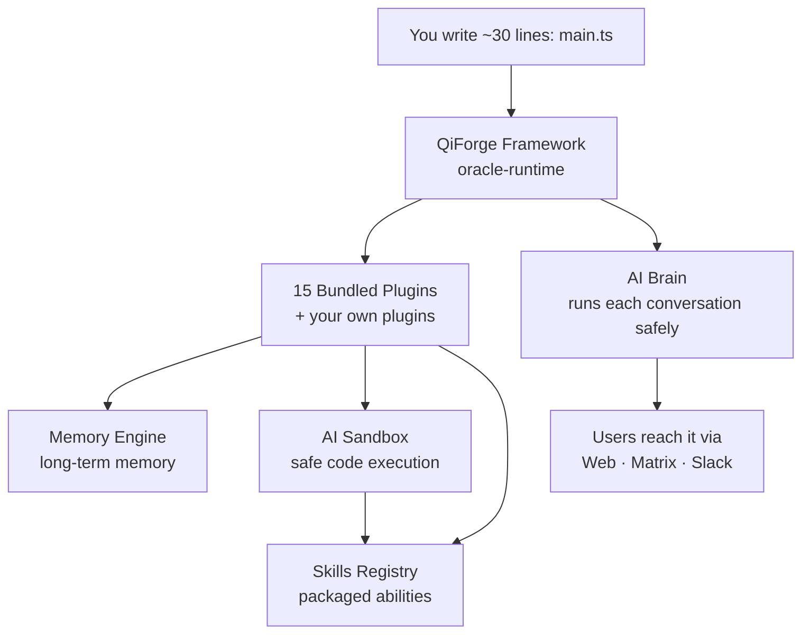

# QiForge


**Build verified AI agents with blockchain identity, encrypted communication, and a growing library of skills — your oracle is a `main.ts` plus the plugins you want.**

QiForge is a plugin-based framework for building **Agentic Oracles** on the [IXO network](https://www.ixo.world/). Each oracle is an autonomous AI agent with a verified on-chain identity, private encrypted storage for every user, and the ability to discover and execute new skills at runtime — without redeployment. The runtime ships as **`@ixo/oracle-runtime-workers`** (Cloudflare Workers); you ship the thin Worker on top.

[](./LICENSE.txt)

---

> # ⚠️ The Node runtime is DEPRECATED
>
> **All QiForge development and every deployed oracle use the Cloudflare Workers runtime:**
>
> - **Runtime:** [`packages/oracle-runtime-workers`](./packages/oracle-runtime-workers) — `@ixo/oracle-runtime-workers`
> - **Reference app and test suites:** [`apps/qiforge-workers-example`](./apps/qiforge-workers-example)
> - **Maintainer docs:** [`packages/oracle-runtime-workers/docs/`](./packages/oracle-runtime-workers/docs/)
>
> The Node runtime — [`packages/oracle-runtime`](./packages/oracle-runtime) (`@ixo/oracle-runtime`, NestJS) and its reference app [`apps/qiforge-example`](./apps/qiforge-example) — is **no longer developed**. It stays in the repository only so existing forks keep building. Do not add features, parity work or fixes there; port them to the Workers runtime instead. The Node-centric sections below are kept for those forks.

---

## Why QiForge?

Most AI frameworks give you a chatbot. QiForge gives you a **verified, autonomous agent** that can reason, remember, learn new skills, charge for its work, and prove its identity — out of the box.

|                          | QiForge                                                                | Typical AI Framework |
| ------------------------ | ---------------------------------------------------------------------- | -------------------- |
| **Verified identity**    | Blockchain DID — users can verify who your agent is                    | None                 |
| **Encrypted comms**      | Per-user encrypted Matrix rooms, synced and self-healing               | Plain text / logs    |
| **Plugins**              | 15 bundled capability packs — toggle with one switch                   | Hardcoded wiring     |
| **Skills at runtime**    | Discovered from a shared registry, executed in a sandbox — no redeploy | Hardcoded tools      |
| **Capability discovery** | The agent equips its own tools mid-conversation                        | Static toolset       |
| **Multi-LLM**            | OpenRouter + Nebius, per-role models, automatic failover               | Vendor lock-in       |
| **Built-in billing**     | Per-user budgets, metering, on-chain settlement                        | DIY                  |
| **Multi-client**         | Portal, CLI, Matrix, Slack — one oracle, every interface               | Single client        |
| **Persistent memory**    | Graph-based, time-aware memory with knowledge scopes                   | External DB required |
| **Secrets safety**       | The AI uses credentials it can never see, print, or leak               | Keys in the prompt   |

---

## An Oracle in ~30 Lines

```ts
import { createOracleApp } from '@ixo/oracle-runtime';
import { WeatherPlugin } from './plugins/weather/index.js';
import { config } from './config.js';

const app = await createOracleApp({
  config, // name, org, personality, features
  plugins: [new WeatherPlugin()], // your plugins, next to 15 bundled ones
});

await app.listen();
```

That's a working oracle. The runtime hands you, for free:

- A fully wired NestJS app — HTTP + WebSocket, validation, CORS, rate limiting, graceful shutdown, Swagger at `/docs`
- UCAN auth on every request and an on-chain identity for the oracle
- Encrypted per-user storage with Matrix sync and corruption recovery
- A LangGraph agent rebuilt per request — dynamic tool loading and always-on safety middlewares (validation, retry, loop-breaking, summarization)
- 15 bundled plugins behind simple `features` toggles
- A typed plugin API for everything custom

---

## Get Started in Minutes

```bash
# Install the CLI
npm install -g qiforge-cli

# Scaffold a new oracle project (sign-in, on-chain identity, Matrix — handled)
qiforge new my-oracle

# Install and run
pnpm install && pnpm dev

# Chat with your oracle from the terminal — watch every tool call live
qiforge chat
```

> **Full developer docs:** [docs.ixo.world](https://docs.ixo.world) — quickstart, plugin recipes, env vars, CLI reference, deployment.
>
> **Canonical reference:** [`apps/qiforge-example/`](./apps/qiforge-example/) — a complete oracle wiring the full bundled plugin set, plus a custom Weather plugin that exercises **every** plugin hook. Walkthrough: [`WEATHER-PLUGIN.md`](./apps/qiforge-example/WEATHER-PLUGIN.md)

---

## How It Works


```mermaid
graph TD
    Dev[You write ~30 lines: main.ts] --> Framework[QiForge Framework<br/>oracle-runtime]
    Framework --> Plugins[15 Bundled Plugins<br/>+ your own plugins]
    Framework --> Brain[AI Brain<br/>runs each conversation safely]
    Plugins --> Memory[Memory Engine<br/>long-term memory]
    Plugins --> Sandbox[AI Sandbox<br/>safe code execution]
    Plugins --> Skills[Skills Registry<br/>packaged abilities]
    Sandbox --> Skills
    Brain --> Channels[Users reach it via<br/>Web · Matrix · Slack]
```

Plugins give the agent its powers — including three major services: a **Memory Engine** that never forgets, a **Sandbox** that safely runs real code, and a **Skills registry** of packaged abilities. Users talk to the finished oracle from the web, Matrix, or Slack.

---

## Bundled Plugins

| Plugin                 | What it adds                                                         | Status         |
| ---------------------- | -------------------------------------------------------------------- | -------------- |
| **memory**             | Durable cross-conversation memory per user                           | ✅             |
| **user-preferences**   | Tone, language, names, free-form standing instructions               | ✅             |
| **matrix-group-chats** | Group-room manners (reply only when mentioned) + per-room memory     | ✅ beta        |
| **sandbox**            | A private Linux box per user — run code, produce files               | ✅             |
| **skills**             | Discover skill capsules — private first, then the public registry    | ✅             |
| **composio**           | Gmail, GitHub, Linear, Slack, Calendar, Notion… on the user's behalf | ✅             |
| **editor**             | Edit live workspace documents — blocks, forms, executable flows      | ✅             |
| **firecrawl**          | Web search + page reading                                            | ✅             |
| **domain-indexer**     | Search IXO entities — orgs, projects, DAOs, events, geo filters      | ✅             |
| **portal**             | Drive the user's web app (frontend-declared actions)                 | ✅             |
| **agui**               | Render tables, charts, and forms in the user's browser               | ✅             |
| **slack**              | Run the oracle as a Slack bot                                        | ✅             |
| **credits**            | Budgets, metering, on-chain settlement                               | ✅             |
| **tasks**              | Background jobs                                                      | ⚠️ placeholder |
| **calls**              | Voice/video calls                                                    | ⚠️ placeholder |

Unconfigured plugins exclude themselves quietly. Two plugins claiming the same tool name stop the boot with a named conflict. A missing env var fails startup with the exact setting, the plugin that needs it, and the one-line fix.

---

## The Agent Grows Into the Task

The agent doesn't carry every tool at once. It **discovers and equips capabilities mid-conversation**: `list_capabilities` browses the catalog, `load_capability` activates one and reads its manifest, and `search_skills` checks the registry — discovery is _enforced_ before the agent improvises. Loaded capabilities persist for the rest of the conversation, even across restarts.

```
User: "Create a slide deck about renewable energy"
→ Oracle searches the skills registry, finds the pptx skill
→ Loads it into the user's sandbox, executes it
→ Returns preview + download links
```

Publish a new skill to the registry and every oracle can use it immediately — no code changes, no redeploy. Skills can be **private** (owner-locked, UCAN-gated) or public. Build your own with the `capsule-creator` skill at [ai-skills](https://github.com/ixoworld/ai-skills).

---

## Repository Layout

```
packages/oracle-runtime-workers/ → THE runtime (@ixo/oracle-runtime-workers):
                                   Hono shell + UserOracleDO + MatrixGatewayDO,
                                   plugin API, bundled plugins, docs/
apps/qiforge-workers-example/    → reference Worker — copy this to start; the
                                   harness e2e, durable-run, context and Matrix
                                   drills live in its test/
packages/
  @ixo/common               → shared contracts (bounded semantic Decisions, …)
  @ixo/ucan                 → UCAN delegations, invocations, validation
  @ixo/oracles-chain-client → blockchain ops, claims, payments
  @ixo/oracles-client-sdk   → React SDK (useChat() hook)
  @ixo/matrix               → Matrix client, encrypted room management

DEPRECATED (kept building, no longer developed):
packages/oracle-runtime/    → the Node runtime (@ixo/oracle-runtime, NestJS)
apps/qiforge-example/       → its reference oracle
packages/sqlite-saver, @ixo/events → Node-runtime persistence and streaming
```

Workers runtime docs live in [`packages/oracle-runtime-workers/docs/`](./packages/oracle-runtime-workers/docs/) (architecture, configuration, operations, testing, Node parity). The older [`docs/`](./docs/) tree and [`specs/ORA-219-plugin-based-runtime.md`](./specs/ORA-219-plugin-based-runtime.md) describe the deprecated Node runtime.

---

## Development

```bash
pnpm install          # Install all dependencies
pnpm build            # Build all packages
pnpm test             # Run unit tests
pnpm lint             # Lint (must pass before commit)
pnpm format           # Format code

# Workers runtime (packages/oracle-runtime-workers)
pnpm --filter @ixo/oracle-runtime-workers typecheck
pnpm --filter @ixo/oracle-runtime-workers test:core   # plain-Node suites
pnpm --filter @ixo/oracle-runtime-workers test        # inside workerd

# In apps/qiforge-workers-example
pnpm dev              # wrangler dev
pnpm test:e2e         # against the local ixo testing harness + a real LLM
```

**Prerequisites:** Node.js 22+, pnpm 11+, [OpenRouter API key](https://openrouter.ai/keys), and for the e2e suites the [ixo testing harness](https://github.com/ixoworld/ixo-testing-harness).

Testing layers are described in [`packages/oracle-runtime-workers/docs/testing.md`](./packages/oracle-runtime-workers/docs/testing.md): unit tests (plain Node and inside workerd), harness end-to-end drills, the devnet feature matrix and load tests.

---

## Deployment

An oracle is one Worker deployment with two Durable Object bindings and a handful of secrets:

```bash
cd apps/qiforge-workers-example
cp .dev.vars.example .dev.vars   # fill in identity, Matrix and LLM secrets
pnpm exec wrangler deploy
```

See [`packages/oracle-runtime-workers/docs/configuration.md`](./packages/oracle-runtime-workers/docs/configuration.md) and [`operations.md`](./packages/oracle-runtime-workers/docs/operations.md). The `Dockerfile` and `fly.toml` at the repository root belong to the deprecated Node runtime.

---

## Artefact link policy

When an oracle on the Workers runtime replies in a chat app (WhatsApp, Matrix, Telegram, Slack), it sends anything too long for chat as a document. The user opens the document in a browser from a link in the chat.

**Decision: artefact links are "anyone with the link", with expiry.** Whoever holds a link can open the document without signing in until the link expires. Links expire 30 days after creation by default (`ARTIFACT_LINK_TTL_DAYS`, at most 365).

What protects the document:

- The decryption key is in the link's fragment (`#k=…`). Browsers never send the fragment to a server, so link previews, proxies and server logs never see it.
- The oracle's bucket holds only ciphertext. The readable copy lives in the user's own database.
- The link expires. The user can revoke it (`DELETE /artifacts/:id`). Deleting the conversation deletes its documents.

What it does not protect against: anyone the link is forwarded to, or who sees it, can read the document until it expires or is revoked. The operator holds the key: it is generated in the oracle and stored with the user's data, in the chat history the model provider receives, and in the response to the channel gateway, so it is shielded from R2 and the viewer host, not from the oracle operator or the chat provider. Revoking a channel binding does not revoke links already sent.

Why we chose this: chat users open links on their phones, often in an in-app browser where they are not signed in to Qi.Space. Requiring a sign-in would break the main use.

**We recommend reviewing this policy** before chat channels leave pilot, and again whenever a new surface or a new kind of sensitive content is added. The review should cover:

- whether some content (health, finance, legal, other people's data) should need a signed-in viewer on Qi.Space instead of a bearer link;
- whether 30 days is the right default;
- whether users should choose the policy themselves, per document or as a preference.

The implementation is described in [`packages/oracle-runtime-workers/docs/chat-delivery.md`](packages/oracle-runtime-workers/docs/chat-delivery.md).

---

## Roadmap

- **Tasks plugin** — background jobs (placeholder today; clean rebuild planned)
- **Calls plugin** — voice/video (placeholder, deferred)
- **1.0 hardening** — production-grade logger, CLI polish, docs refresh, retiring the deprecated Node runtime
- **Growing skill registry** — publish yours at [ai-skills](https://github.com/ixoworld/ai-skills)

---

## Contributing

1. Fork the repository
2. Create a feature branch (`git checkout -b feature/amazing-feature`)
3. Run `pnpm lint && pnpm format` before committing
4. Push and open a Pull Request

**Publish a skill:** fork [ai-skills](https://github.com/ixoworld/ai-skills), add your skill folder, open a PR. Every oracle benefits immediately.

---

## Support

- [Documentation](https://docs.ixo.world)
- [GitHub Issues](https://github.com/ixoworld/qiforge/issues)
- [GitHub Discussions](https://github.com/ixoworld/qiforge/discussions)

## License

Apache License 2.0 — see [LICENSE](./LICENSE.txt)
