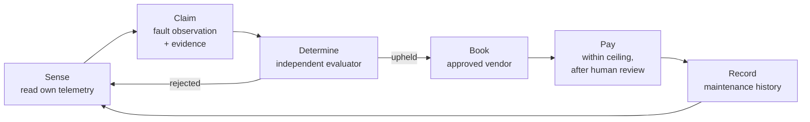

# Building an agentic asset

A walkthrough of `apps/agentic-asset-example` — the twin of a delivery vehicle that diagnoses its own faults and procures its own service.

The reference oracle in `apps/qiforge-example` shows the runtime serving users. This one shows the runtime being an entity. Nothing in the framework changes between them.

## The point

The usual arrangement is an application that manages an asset. A fleet system holds the vehicle's data, decides what its telemetry means, and spends money on its behalf. The vehicle is passive; the software is where the agency lives, and it belongs to whoever wrote it.

Invert that and the vehicle holds its own identity, its own memory, and its own law. It selects a reasoning model the way it selects a workshop — as a supplier, hired for a job, replaceable. The model proposes; the constitution disposes. What survives a model swap is everything that mattered: who the vehicle is, what it has done, and what it is permitted to do.

That is the entire difference this example is built to show.

## What DV-114 does



Four action classes in a fixed order, each with a different bound.

## Files

| Path                        | What it is                                                    |
| --------------------------- | ------------------------------------------------------------- |
| `domain.md`                 | The vehicle's constitution. The centre of the example.        |
| `src/main.ts`               | `createOracleApp` — the same call the reference oracle makes. |
| `src/plugins/vehicle/`      | The vehicle's capabilities, each declaring its `effect`.      |
| `test/constitution.test.ts` | Runs the shipped constitution through the real evaluator.     |

## The constitution is the app

`main.ts` is twenty lines and passes `bundledPlugins: []`. A vehicle has no use for a web scraper or a Slack bridge, and an entity should be given the capabilities its purpose needs rather than every capability the framework ships.

Everything that makes DV-114 a _vehicle_ rather than an oracle is in `domain.md`: `domain.type: asset`, a purpose about roadworthiness, grants shaped around telemetry and vendors. The runtime never branches on any of it. `DomainContext.entityType` is carried so a decision record can say what was governed, and read nowhere else.

## Declaring what a tool does

The gate can only classify a call if the tool says what it does:

```ts
effect: {
  type: 'pay',
  action: 'settle_service_invoice',
  object: (args) => invoiceSchema.parse(args).vendor,
  value: (args) => {
    const { amountMinor, denom } = invoiceSchema.parse(args);
    return { amount: amountMinor, denom };
  },
}
```

Two decisions worth copying.

**The object is the vendor**, not a generic `payments` resource. That is what makes the approved-vendor allowlist enforceable by _scope_: an unlisted vendor matches no grant, so the refusal does not depend on any check the model could be argued out of.

**Only the paying tool declares a value.** It is the one action that moves money, so it is the one the ceiling and the account's spending policy apply to.

## The rule the whole document rests on

The vehicle may not determine its own faults. Written as an explicit `deny`:

```yaml
- id: 'right:dv114:no-self-determination'
  type: 'evaluate_claim'
  effect: 'deny'
```

An asset that both reports a fault and rules on the report can authorise its own spending by inventing a fault. Every downstream control — the vendor allowlist, the ceiling, the `determination_upheld` condition — assumes a determination that came from somewhere the vehicle does not control.

It is a `deny` rather than an omission because omission is only a default. A later revision adding a broad `evaluate` grant would quietly acquire self-determination as a side effect; a deny grant survives that, since deny wins over allow regardless of ordering or specificity. There is a test for exactly that.

The general form — generation and evaluation must not share a principal — is not special to vehicles.

## Where the tool set comes from

There is no self-diagnosis tool and no budget tool. Neither is an oversight: self-determination is denied and the budget is not the vehicle's to set, so both would be permanently refused. Shipping a capability the constitution always refuses puts it in front of the model and invites it to keep trying.

Let the constitution shape the tool set, not the other way round.

## What a compromised model cannot do

Assume the model is fully compromised — prompt-injected by a message from a workshop, or simply wrong — and proposes settling a 5,000 USDC invoice with an unlisted vendor on a fault nobody evaluated. Five clauses fail independently:

- `pay` is in the baseline, so it needs a matching grant.
- The only payment grant is scoped to `ixo:vendor:approved/*`.
- `flow_state: determination_upheld` does not hold.
- 5,000 USDC exceeds the 250 USDC ceiling.
- `payment_release` is a review trigger, so even a well-formed payment escalates.

No single clause is load-bearing. That is deliberate.

## Two things the tests caught

Both were bugs in the constitution, found by running it through the evaluator rather than by reading it.

**A capability disabled and granted at once.** The first draft set `move_value: false` in `agent_default_mode.overrides` _and_ wrote a payment grant. The override wins, so the grant was dead — the document promised in prose what its machine layer forbade. An asset whose purpose includes paying keeps the capability and bounds its exercise instead.

**A valid payment does not execute.** The test expected `permit` for a well-formed invoice and got `manual_review_required`, because `payment_release` is a declared review trigger. The evaluator was right. Autonomy here means the vehicle assembles the whole case by itself — senses, claims, waits for determination, finds the vendor, prepares the invoice — not that it releases the money by itself.

A constitution is executable, so test it like code.

## Running it

```bash
pnpm test --filter agentic-asset-example   # constitution against the evaluator
pnpm --filter agentic-asset-example dev     # needs the runtime's env vars
```

`DOMAIN_MD_PATH` must point at this app's `domain.md`. It ships as `authoring_draft`, so it needs `DOMAIN_ENFORCEMENT=permissive`; a deployed twin anchors the document to the vehicle's IID and runs strict.

## What is stubbed

`TwinState` is in-memory. A deployed twin reads telemetry from the physical vehicle and determinations from the claims collection on chain.

One thing is not a stub: nothing in this app writes a determination. `receiveDetermination` exists for the host to wire to whatever transport delivers verdicts, and is deliberately not a tool. The vehicle can read a verdict about itself. It cannot produce one.
