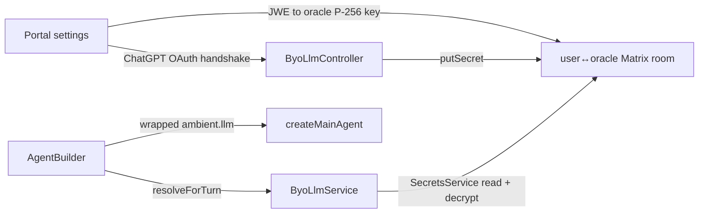

# BYO-LLM: bring-your-own-credential inference

Users of an oracle with `BYO_LLM_ENABLED=true` (the personal companion) can
connect their own ChatGPT subscription (OAuth) or provider API keys
(OpenAI / Anthropic / Gemini / DeepSeek) and run their turns on their own
account. Off by default; on every other oracle the module is inert — routes
404 and per-turn resolution returns null.

## Data flow

## Pieces

| What                                                   | Where                                       |
| ------------------------------------------------------ | ------------------------------------------- |
| Provider/model/secret-name catalog (pure)              | `src/llm/byo-catalog.ts`                    |
| Chat-model construction per credential                 | `src/llm/byo-client.ts`                     |
| Request-scoped `LlmAdapter` wrapper                    | `src/llm/byo-adapter.ts`                    |
| Credential resolution, caching, token refresh          | `src/modules/byo-llm/byo-llm.service.ts`    |
| Connect endpoints (`/byo-llm/*`)                       | `src/modules/byo-llm/byo-llm.controller.ts` |
| ChatGPT OAuth wire client (device flow, PKCE, refresh) | `src/modules/byo-llm/chatgpt-oauth.ts`      |

## Design decisions

- **Storage** is the canonical user↔oracle room's secrets (`ixo.room.secret` +
  `ixo.room.secret.index`), the same mechanism the portal's agent-secrets flow
  ships. Both credential kinds are written **server-side** via the new
  `SecretsService.putSecret` (the encrypt counterpart of the existing decrypt
  path — `encryptJWE` in `@ixo/oracles-chain-client`): the ChatGPT OAuth blob
  after the token exchange, and API keys via `PUT /byo-llm/credentials/:provider`.
  API keys were originally written client-side through the agent-secrets flow,
  but that depends on Matrix room-key sharing from the user's browser device
  to the oracle's device (across federated homeservers) — when the to-device
  key share goes missing, the oracle stores ciphertext it can never read
  ("Can't find the room key to decrypt the event"). Server-side writes are
  readable by construction, and the oracle decrypts the key every BYO turn
  anyway, so posting it over TLS adds no exposure. Room resolution
  deliberately targets the canonical room (not the per-session room), making
  credentials account-level for the oracle.
- **Model ids** are namespaced `byo:<provider>/<native-id>` so they can't
  collide with OpenRouter slugs, and are allow-listed by the curated
  per-provider catalog exactly like the platform catalog gates its ids.
  `GET /models` stays platform-only; the connect UI merges BYO entries from
  `GET /byo-llm/status`.
- **Turn activation**: a `byo:` model on the request activates that provider;
  an explicit platform model keeps the turn platform-paid and skips the
  lookup entirely; no model at all (Matrix/Slack ingress) auto-prefers the
  subscription, then the first connected key — so a connected user's room
  chats run on their account too.
- **Blast radius**: on a BYO turn `AgentBuilder` swaps a request-scoped
  `LlmAdapter` into ambient, so the main model, sub-agents and plugin
  `rtCtx.llm` consumers all follow the user's provider via the role
  translation table. Roles a provider can't serve fall through to the
  platform adapter: `embedding` everywhere, `vision` on DeepSeek. The safety
  guardrail's `hooks.safetyModel` is boot-scoped and stays platform-paid.
- **Billing**: the credits middleware skips both the balance gate and the
  deduction when `context.byo.active` is set (uniform across ingresses —
  it's the only enforcement point Matrix turns pass through). The
  subscription middleware keeps the active-subscription check but bypasses
  the 10-credit floor for users with a connected credential (checked through
  the 60s credential cache, only on floor-failing requests, so a disconnect
  closes the bypass within a minute). The `/byo-llm/*` connect routes are
  exempt from the subscription gate — connecting a credential is exactly how
  a zero-credit user becomes able to chat again.
- **Write/read races**: a per-user in-process credential epoch (alongside the
  refresh single-flight) prevents two failure modes — a Matrix read that
  overlapped a token write refuses to poison the cache with the superseded
  (already-consumed) refresh token, and a refresh that lost a race with a
  disconnect refuses to write the credential back.
- **Secrets never enter the graph**: the request context carries only
  `{ provider, active }`; the credential lives in the adapter closure.
- **ChatGPT specifics**: Responses API only, `stream: true` + `store: false`
  mandatory, `ChatGPT-Account-ID` header from the id-token claim, tokens
  refreshed single-flight ~5 min before expiry and re-encrypted into the
  room. Refresh tokens rotate; `refresh_token_expired|reused|invalidated`
  require a reconnect. Because rotation makes a fresh token the ONLY valid
  copy, a refresh (or connect) whose Matrix write-back fails holds the
  tokens in an in-process shadow map — substituted over the stale
  room-stored credential on every read and re-persisted in the background —
  instead of discarding them, which would brick the connection over a
  Matrix blip. All auth-endpoint calls carry a 15s timeout so a stalled
  upstream can't wedge a turn or a disconnect. Known risk: Cloudflare TLS fingerprinting can 403
  non-browser clients calling `chatgpt.com` from datacenter IPs — if this
  bites in production, inject an impersonating `fetch` via the client
  `configuration` in `byo-client.ts`.
- **Cross-provider history**: a thread that ran platform (OpenRouter) turns
  carries assistant messages whose `additional_kwargs.reasoning` is in a
  foreign shape; the `@langchain/openai` Responses input converter crashes on
  those (`reasoning.summary.length`). Two defenses: the ChatGPT model is
  built with `zdrEnabled: true` (matches the mandatory `store: false`; only
  reasoning with `encrypted_content` is replayed, and raw
  `responseMetadata.output` items are never echoed to the stateless
  backend), and `ByoHistorySanitizerMiddleware` (first in the main-agent
  stack) rewrites the outbound copy of history — on ChatGPT turns foreign
  reasoning kwargs are dropped and `encrypted_content` items without a
  `summary` array get `summary: []` so reasoning still round-trips; on every
  turn, `{ type: 'reasoning' }` content blocks (display residue from
  ChatGPT's summary stream) are stripped so switching providers mid-thread
  is safe in both directions.
- **Thinking stream**: the ChatGPT model requests
  `reasoning: { summary: 'auto' }` (as the Codex clients do), and
  `SseStreamRunner.handleChatStream` understands both stream shapes — the
  completions raw delta (`choices[0].delta.reasoning`, platform path) and
  Responses-mode content-block arrays (`{ type: 'reasoning', reasoning }`
  → `ReasoningEvent`, `{ type: 'text', text }` → message chunks). The batch
  (Matrix) path flattens array content via `message.text`.

## Env

| Var                     | Meaning                                       |
| ----------------------- | --------------------------------------------- |
| `BYO_LLM_ENABLED`       | `'true'` enables the module (companion only). |
| `BYO_CHATGPT_CLIENT_ID` | Override the OAuth client id (testing only).  |
