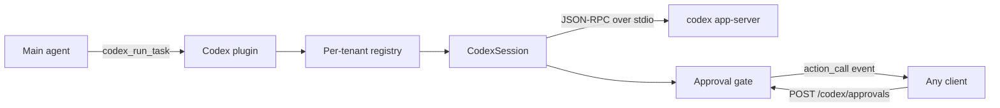
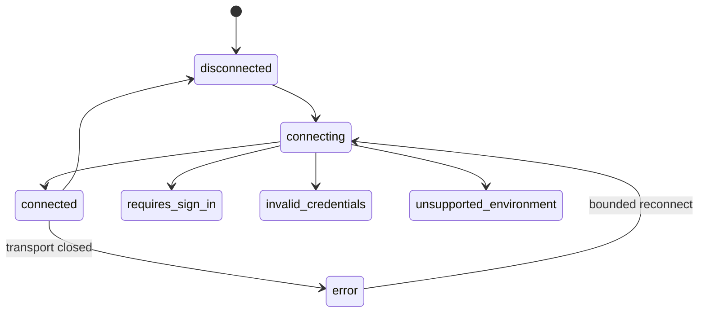

# Codex provider

How QiForge integrates OpenAI Codex, why the App Server is the integration boundary, and what the two auth modes actually buy.

Code lives in `packages/oracle-runtime/src/plugins/codex/`.

## Why a plugin, not an `LLMProvider`

`src/llm/llm-provider.ts` maps a role to a `BaseChatModel` — a stateless chat-completions call. Codex is not that. The Codex App Server is an **agentic runtime**: long-lived threads, multi-step turns, streamed work items, and approval gates that block execution until a human answers.

Squeezing it behind `getProviderChatModel` would throw away threads, approvals and diffs — the parts that make Codex worth integrating. So Codex is a plugin, and `openrouter` / `nebius` are untouched.

## Why the App Server

The App Server is the bidirectional JSON-RPC surface Codex's own clients drive — the same boundary first-party and third-party surfaces share. Targeting it means:

- No UI automation, no scraping, no reuse of browser session internals.
- Approvals, streaming and thread resumption come from the protocol rather than being reconstructed.
- A remote-runtime / local-client split works: the runtime lives wherever the oracle runs, and any client can drive it over the HTTP control plane.

Frames are newline-delimited JSON and omit the `jsonrpc` version field. Method names are centralized in `app-server/protocol.ts` because Codex has renamed them across releases — an upgrade edits that table, not the adapter.

## The two auth modes

|                         | `chatgpt_subscription`          | `api_key`      |
| ----------------------- | ------------------------------- | -------------- |
| How the user signs in   | ChatGPT sign-in (`codex login`) | OpenAI API key |
| Billing                 | Covered by the plan             | Per token      |
| `directModelApi`        | **false**                       | true           |
| Per-turn model override | No — the plan decides           | Yes            |

**A subscription does not grant raw OpenAI API access.** It authorizes the Codex runtime. `resolveCodexCapabilities` encodes this as `directModelApi: false`; any code that needs the raw API must check that flag rather than infer entitlement from the presence of credentials.

The mode is **never inferred**. `CODEX_AUTH_MODE` is required with no default, and `preflight` rejects a requested mode that disagrees with the configured one. Switching modes goes through `setAuthMode`, which drops the connection, declines outstanding approvals, and records an `auth_mode_changed` transition.

### Where credentials come from

The App Server protocol has **no login method** — authentication is established upstream, and `account/read` reports the result. So:

- **Subscription**: `codex login` writes `auth.json` into the tenant's `CODEX_HOME`. The harness never touches the OAuth tokens; it checks for the artefact, then lets the App Server read it. Missing → `requires_sign_in`.
- **API key**: read from the room's JWE-encrypted secret store (`ctx.secrets`), injected into the child process env as `OPENAI_API_KEY`. Missing → `requires_sign_in`.

Either way the App Server is the authority: `assertAuthenticated` calls `account/read` after the handshake and transitions to `invalid_credentials` if there is no account. A credential file that exists but does not work is caught here, not at the first turn.

## Connection lifecycle

Every transition is validated against a table in `auth/connection-state.ts` and appended to a bounded audit trail (`GET /codex/transitions`). An illegal edge throws rather than corrupting the record.

Reconnect is bounded by `CODEX_MAX_RECONNECT_ATTEMPTS`. The budget resets only when a turn **runs to completion** — not merely when the handshake succeeds — so a binary that starts fine and dies every turn still exhausts it instead of looping forever.

## Approvals

Codex blocks its turn on a server→client request. `CodexApprovalGate` parks that request, emits an `action_call` event so any connected client can render the prompt, and settles when a decision arrives.

Nothing auto-approves:

- An unanswered approval expires to `decline`.
- A malformed approval request is declined.
- An approval that arrives with no turn in flight is declined (nobody is listening).
- `gate.resolve` is tenant-scoped; a mismatch is a miss, not a grant.

Decisions can arrive two ways, both landing on the same gate: `POST /codex/approvals` (for a client UI) or the `codex_resolve_approval` tool (for a decision the user gave in chat).

## Tenancy

`CodexTenantScope` is `{ userDid, oracleEntityDid }`, flattened to a filesystem-safe key. It scopes:

- the `CodexSession` (one App Server process per tenant),
- the `CODEX_HOME` directory, created `0700`,
- the thread id,
- approval ownership.

Sessions are only ever created through `CodexRuntimeRegistry.for(scope)` — nothing hands one out by raw key.

## Validation gates

`preflight` runs before any runtime start and is the only producer of a `CodexRuntimePlan`:

1. Config schema (`normalizeCodexConfig`).
2. Auth-mode agreement.
3. Capability resolution.
4. Tool policy — `dangerFullAccess` + `approvalPolicy: never` is rejected, because that combination removes every guardrail at once.

The plugin builds its registry from a plan on first use, so a misconfigured deployment fails at boot rather than mid-conversation.

## Security notes

- Credential values never reach logs, events, HTTP responses or the audit trail. `redactCredentialEnv` masks `OPENAI_API_KEY` before the process env is logged.
- Every `/codex/*` route is UCAN-authenticated (`getAuthExcludedRoutes` returns `[]`) and derives its tenant from the authenticated DID, so a caller cannot address another tenant's runtime.
- The transport spawns a child process. `CODEX_SANDBOX_MODE` and `CODEX_APPROVAL_POLICY` are what constrain it; the tool-policy gate stops the two from being relaxed together.

## Testing

`session/codex-session.test.ts` drives a **real child process** — `__test-fixtures__/fake-app-server.mjs` speaks the same newline-delimited JSON-RPC framing as `codex app-server`. The stdio transport, id correlation, streaming notifications, the approval round-trip, thread resumption and crash/reconnect all run for real; only the Codex binary is substituted.

**Manual verification remains:** running against a genuine `codex app-server` build to confirm the method names and payload shapes in `protocol.ts` match the installed Codex version. That table is the single place an upstream rename needs to be applied.

## Read next

- [Adding a bundled plugin](../contributing/adding-a-bundled-plugin.md)
- [Model selection](model-selection.md) — the unrelated `BaseChatModel` path
