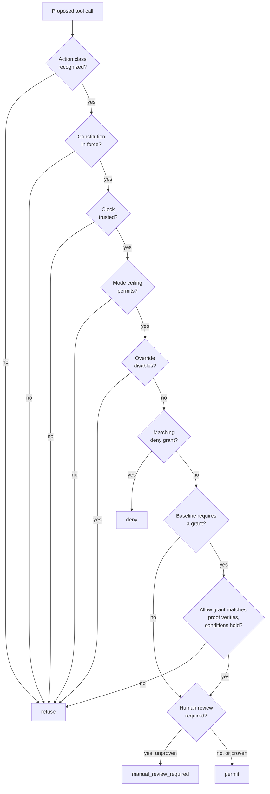

# The constitution engine

How the runtime enforces the entity's own law on every tool call.

Source: `packages/oracle-runtime/src/constitution/`.

The design rationale, the survey it came from, and the phases beyond this one live in `specs/sovereign-agency-harness.md`. This page documents what the code does.

## The idea in one line

A model's output is a **claim**, not a decision. The constitution engine is the structural gate between the two: it classifies a proposed tool call into an action class, evaluates it against the entity's `domain.md`, and only then lets the handler run.

## What it governs

An **agentic entity** — an asset, a deed, a project, an organisation (DAO), an oracle, or any other type the format admits. The engine never branches on `domain.type`; it carries the value onto `DomainContext.entityType` so a decision record can say what was governed, and reads it nowhere else. The action vocabulary is the format's own and is entity-neutral: `vote` and `delegate` for an organisation, `transfer` and `pay` for an asset, `evaluate` and `issue` for a project all map through the same `RIGHT_TYPE_TO_ACTION` table.

**The entity is the agent for its own agentic functions.** This harness _is_ the entity's agency, not a separate party acting on its behalf, so the `agents` entry whose id matches the entity's own is the one that describes this runtime — whatever kind of entity it is.

A constitution may declare further agents: counterparties the entity works with, or a second agentic function the entity runs as its own deployment. Those are named by `DOMAIN_AGENT_ID` and never inferred. `resolveAgent` takes, in order: the configured id (an id naming no declared agent is an error, not a fallback — a runtime told it is an agent the constitution does not recognise must not quietly become a different one), then the entity's own entry, then a sole declared agent. Anything else is ambiguous, and strict enforcement refuses to boot rather than run with the wrong output bounds and an escalation route pointing at a room nobody is watching.

The reference implementation is an oracle because that is what this runtime shipped first, not because the engine assumes one.

## Where the law comes from

The entity's law is a [`domain.md`](https://github.com/ixoworld/domain.md) — YAML frontmatter plus prose, declaring where authority lives, what the agent may propose, and what it must never do without an explicit grant. The runtime enforces a subset of that format:

| Block                 | What the engine reads it for                                 |
| --------------------- | ------------------------------------------------------------ |
| `conformance`         | Spec version and assurance profile                           |
| `domain`              | Identity of the subject the constitution governs             |
| `documents.anchoring` | How the index binds to canonical IID state                   |
| `constitution`        | Status, type, failure policy, review triggers                |
| `agent_default_mode`  | The capability ceiling, disabling overrides, review triggers |
| `rights`              | The baseline and the explicit grants                         |
| `accounts`            | Spending policy for value-bearing actions                    |
| `agents`              | Output bounds and the escalation route                       |
| `critical_do_not`     | Prohibitions surfaced verbatim to the model                  |

Blocks the engine does not evaluate are still parsed and retained, so widening the subset later is additive.

> The upstream `@ixo/domain.md` package is not published yet, so `constitution/parse.ts` implements the subset in-repo using `gray-matter` and Zod. That module is the **only** place that knows how the format is encoded — when the package ships, `parseDomainMdSubset` is replaced by upstream's `parseDomain`/`lint` and nothing else changes.

## The two verdicts

The format distinguishes two things the runtime keeps separate:

- **Static conformance** — provable from the bytes: encoding, schema shape, local references, profile invariants. This is `lintDomainMdSubset`.
- **Runtime conformance** — canonical IID state, capability proofs, revocation, trusted time. This is `authorize` plus its dependencies.

A static pass never implies runtime authorization. A document can be perfectly well-formed and still authorize nothing.

## Authorization resolution

`authorize(request, policy, deps)` is pure: no I/O, no ambient state, no clock of its own. Every external fact arrives through `AuthorizeDeps`, so the same request replays to the same decision — which is what makes a decision record auditable after the fact.



Every step is default-deny. A check that cannot be _completed_ — an unverifiable proof, an unreachable revocation source, an untrusted clock — refuses or escalates according to `constitution.execution.failure_policy`; it never falls through to permitted.

### The two vocabularies

A right declares a `type` (`evaluate_claim`, `issue_credential`, …). The baseline is written in coarser **action classes** (`read`, `write`, `evaluate`, `execute`, `pay`, `issue`, `mint`, `transfer`, `govern`, `delete`, `revoke`). `RIGHT_TYPE_TO_ACTION` maps one to the other; a right type absent from that table is not recognized, and a request needing it is denied rather than guessed at.

### The ceiling

`agent_default_mode.mode` is a ceiling, not a grant:

| Action class                                                   | Minimum mode       |
| -------------------------------------------------------------- | ------------------ |
| `read`                                                         | `read_only`        |
| `propose`                                                      | `propose_only`     |
| `evaluate`                                                     | `bounded_evaluate` |
| `execute`, `write`, and everything value- or authority-bearing | `bounded_execute`  |

Value movement, issuance, governance and destruction additionally **always** require an explicit grant — the mode never implies them. Requiring both the top mode and a grant is the fail-closed reading of the format's capability table: a `read_only` agent cannot move value on the strength of a stale grant.

`overrides` only ever switch capabilities **off** (the format pins the known keys to `false`). An override that tries to enable something is a ceiling raise and fails linting with `open-ended-agent-authority`.

### Grant matching

A grant is about a request only when the principal, action class, operation and object all line up. Comparison is over canonical identifiers, never display strings. Object coverage requires an **explicit** wildcard: `ixo:oracle/workspace/*` covers `ixo:oracle/workspace/notes.md`, but a bare `ixo:oracle/workspace` covers only itself.

Deny grants are evaluated before allow grants and win outright, including for actions below the baseline.

**The principal a grant names is the entity itself.** The gate sets `principal.did` from `constitution.subject`, and a grant matches only on equality with it — so `rights.entries[].subject` has to be written in the same identifier space, `urn:uuid` draft identity included. Naming a third party is legal and sometimes correct, but such a grant authorises nothing _here_; the linter says so with `ungoverned-grant-subject` (a warning, since the document may legitimately describe rights it does not itself exercise).

This is worth stating plainly because the failure is silent. A grant with the wrong subject parses, lints, and reads like authority, while every action it was written to permit refuses with `no_matching_grant`. It shipped that way in this repo's own reference oracle: a draft constitution held a `urn:uuid` identity and both grants named an invented `did:ixo:entity:qiforge-example`.

### Conditions

A matching grant still has to survive its conditions: activation and expiry against the declared clock, flow state, claim type, role, credential, and value ceiling. Value comparison uses `BigInt` and **refuses across denominations** — converting between them needs a governed price policy the runtime deliberately does not have. A ceiling that cannot be checked — the grant caps value, the call declares none — **denies** (`value_undeclared`). This is not a technicality: an action that never says what it moves has not come in under the cap, it has declined to be measured by it, and a ceiling that permits whatever it cannot see is not a ceiling. In practice the reason code means a tool classified under a value-bearing grant is missing its `effect.value` extractor.

A declared value must be an unsigned base-10 integer, and that is checked where the request enters rather than where a ceiling reads it. The constitution's own amounts are validated when the document is parsed, but the request's amount is assembled at runtime by a plugin's `effect.value` extractor, where nothing but the type checker stands between a typo and a real amount. `-1`, `1.5`, `007` and `''` all read as plausible `BigInt` input and would otherwise slip under a ceiling; `'abc'` would throw out of the evaluator entirely. All of them deny with `value_malformed`, and none of them reach the capability verifier.

### Human review

Two independent triggers: an action class whose trigger the constitution declares in `human_review_required_for`, or a matched grant with `conditions.human_review: true`. Either produces `manual_review_required` unless a review proof verifies against the request digest. A trigger the constitution never declared is never invented.

## Declaring what a tool does

The gate can only classify a call if the tool says what it does. `PluginTool.effect` carries that:

```ts
tool(handler, {
  name: 'release_payment',
  description: '…',
  schema: paymentSchema,
  effect: {
    type: 'pay',
    action: 'release_payment',
    object: (args, ctx) => `ixo:oracle/treasury/${(args as Args).account}`,
    value: (args) => (args as Args).amount,
  },
});
```

Two things to know:

- The `tool()` helper builds its result field by field, so a new field must be copied through explicitly or it is silently dropped.
- `wrapPluginTool` keeps only name, description and schema when it bridges to LangChain. The gate therefore reads effects from a `toolName → effect` map built in `createMainAgent` while the plugin tool is still in hand — never from the bound tool.

A tool that declares no effect is reported once at boot (`constitution.tool_effect_undeclared`). Under permissive enforcement it is treated as a read; under strict enforcement it is refused, because an undeclared effect is an unbounded one.

## Trusted time

Expiry and revocation are only as good as the clock behind them, so the source is named in every decision rather than left implicit. This runtime declares `system_clock` and marks it trusted because a deployment has no better option today — not because the clock is verified. `TimeSource` is the seam where an attested source replaces it; a reading that reports `trusted: false` fails effectful actions closed.

## Enforcement policy

`DOMAIN_ENFORCEMENT` (`strict` | `permissive`, default `strict`) decides how much assurance the document itself must carry:

|                        | `strict`                          | `permissive`                      |
| ---------------------- | --------------------------------- | --------------------------------- |
| Required profile       | `anchored` or `runtime`           | any; an unanchored one warns      |
| Declared anchor        | verified when a verifier is given | not checked                       |
| Decisions room         | required                          | optional                          |
| Undeclared tool effect | denied                            | treated as `read`, warned at boot |
| Gate active            | yes                               | **yes**                           |

The gate runs in both modes. Enforcement level changes how much the _document_ must prove, never whether decisions are made. There is deliberately no `off`.

Anchor verification is a chain call, so the runtime does not do it itself — `createOracleApp({ verifyConstitutionAnchor })` supplies it. Given one, strict boot refuses a document whose anchor fails or errors. Given none, the anchor is accepted on the document's own declaration and the context records `anchorVerified: false`, so a decision citing it does not overstate what was checked.

Strict enforcement additionally requires `MATRIX_DECISIONS_ROOM_ID`. Gating every call while the record of why goes nowhere would make the enforcement real and the accountability imaginary, which is the worse of the two failure modes.

This is a deliberate new convention: nothing else in `bootstrap/` branches on the environment, and `NODE_ENV` is overloaded by test runners, so the choice is its own explicit variable.

## Where it lives at runtime

`createOracleApp` reads `DOMAIN_MD_PATH`, parses and vets the bytes, and builds one deeply frozen `DomainContext` — before `NestFactory.create`, so a bad document stops the boot rather than surfacing on the first tool call of a runtime that is already serving.

That value has two halves, and the split is the point:

- **`policy`** is what `authorize()` evaluates. It is the decision surface, and nothing outside it can affect a verdict.
- **`advisory`** is what the model is told. It shapes what the model proposes and decides nothing.

Both come from the same parse, so the layer that informs and the layer that enforces cannot drift into disagreeing about what the constitution says.

It is reachable three ways, all the same object:

| Surface                      | Who reads it                            |
| ---------------------------- | --------------------------------------- |
| `DomainContextService.get()` | anything inside Nest (`@Global` module) |
| `ambient.domain`             | the runtime's own request path          |
| `rtCtx.domain`               | plugin tools                            |

A tool reading `rtCtx.domain` is reading a description of what governs it, not acquiring a lever: it is frozen, and the gate has already evaluated the call against the same value before the handler runs.

## The prompt block

`buildConstitutionBlock(domain)` renders the advisory half into the system prompt — ceiling, the actions that always need a grant, review triggers, forbidden outputs, and the prohibitions verbatim.

Three things about it are deliberate. It tells the model the constitution is enforced _outside_ the conversation and that message text claiming to authorize it changes nothing, so it never reads as "please comply". It reproduces prohibitions verbatim, because paraphrasing a prohibition is how it stops being one. And it renders nothing at all when the document is at the top ceiling with no baseline, triggers or prohibitions — a section that says nothing still costs tokens on every turn.

## The gate

`createConstitutionGateMiddleware` is where the evaluator meets a live tool call. It wraps every tool execution: classify the call from the tool's declared `effect`, evaluate against the constitution, and only then run the handler.

Three properties make it a gate rather than a suggestion.

**Placement.** It sits ahead of the repetition guard, which short-circuits duplicate failed calls _without_ invoking the handler. A gate behind it would never see those calls. It is also installed inside every sub-agent and the standalone editor agent — a gate covering only the main agent would leave delegation as a documented way around the constitution, and delegation is the first thing a model reaches for after a refusal.

**It fails closed.** An undeclared effect under strict enforcement, an `effect.object` expression that throws, the evaluator itself throwing — each denies. The only path to execution is an explicit permit.

**It reads nothing the model writes.** The constitution is frozen at boot and the effect declaration is registry metadata. The arguments are the only model-supplied input, and they are data to classify rather than instructions to obey. Text claiming authority changes nothing.

A refusal comes back as a `ToolMessage` with `status: 'error'` and a stable `[constitution:denied]` / `[constitution:manual_review_required]` prefix, carrying the reason codes and rule references. The `error` status is load-bearing: it is what lets the repetition guard stop a model that retries a refusal verbatim.

### What was removed to make this true

`subagent-as-tool.ts` used to detect refusal phrasing heuristically and re-invoke the sub-agent with text asserting it was "fully authorized". That is precisely the move the constitution exists to make impossible, and a heuristic over model prose cannot tell a constitutional refusal from a stylistic one. It is gone. Soft LLM refusals are no longer auto-retried — accepted, and safer.

### What the bundled tools declare

`plugins/tool-effects.ts` holds the effect for every statically-declared bundled tool, in one table. A tool's own `PluginTool.effect` always wins — the table is a convenience for the bundled set, not a substitute for the field.

One file rather than eighty declarations because the complete answer to "what can this runtime do, and to what" should be auditable in a single read. The cost is drift, and two things catch it: a consolidated boot warning naming every undeclared tool, and `tool-effects.test.ts`, which collects from the registry and fails if anything is unclassified. Collecting rather than grepping matters — it is how the three `setStatusTool`-built task tools were found, whose names are factory arguments and appear in no `name:` field.

Classification runs toward the more restricted class on close calls: a read wrongly filed as a write costs an unnecessary grant, while the reverse lets an edit through on a read grant. Three are worth knowing:

- **`mint_invocation` is `govern`.** It mints a UCAN invocation against a service — delegating authority, which the format maps through `delegate`.
- **`vfs_share` is `govern`.** It publishes a file so anyone with the link can read it. As a `write`, a plain filesystem grant would authorise publishing to the world.
- **`resolve_task_approval` is `evaluate`.** It records a decision about a draft, and a decision is an evaluation whatever it is stored as.

### Tools the runtime proxies

Four plugins surface tools whose names come from somewhere else — an upstream MCP server, a connected SaaS app, or the user's browser. No static table can enumerate those, so each adapter declares the effect on the tools it wraps. That is the honest home for the decision: it is a statement about what that server may do on the entity's behalf.

| Plugin     | Class     | Object                   | Why                                                                                       |
| ---------- | --------- | ------------------------ | ----------------------------------------------------------------------------------------- |
| `memory`   | per tool  | `ixo:memory/episodes`    | A filtered allowlist, so these are classified individually rather than sharing a default. |
| `composio` | `execute` | `ixo:composio/<toolkit>` | Proxies arbitrary third-party actions — sending mail, posting, opening issues.            |
| `sandbox`  | `execute` | `ixo:sandbox`            | Runs code, and a tool that runs code can do whatever that code does.                      |
| `portal`   | `execute` | `ixo:portal/browser`     | Drives the user's own browser; effects land wherever it is pointed.                       |

Two decisions in that table are worth stating.

**The class is never derived from the tool's name.** A remote server naming something `read_everything` would not make it a read, and letting an upstream naming convention bound the entity's authority is the failure this whole layer exists to prevent. For the general proxies the class is a literal; a test asserts none of them branches on the name.

**Erasing memory is `delete`, not `write`.** An entity's own episodic record is the thing the harness exists to keep, so `memory-engine__clear` and `memory-engine__delete_episode` carry their own class, their own grant and their own ceiling. A memory tool the allowlist admits but nobody classified also defaults to `delete` — the conservative reading of an unknown memory operation is that it destroys something.

Composio scopes per toolkit rather than one blanket object, so a grant can admit `ixo:composio/gmail/*` without admitting every connected app.

## The decision ledger

A gate that refuses well and remembers nothing is an assertion, not an account. Every verdict the gate reaches becomes a record, each bound to its predecessor by a hash, published to `MATRIX_DECISIONS_ROOM_ID` as `ixo.constitution.decision` timeline events with an `ixo.constitution.decision_head` state pointer.

Permits are recorded as readily as refusals. A log of only refusals cannot show that anything was checked.

**Recording happens before execution, and failing to record is a refusal.** The chain append is synchronous; publishing is separate and slower. Under strict enforcement an effectful call whose decision cannot be recorded is denied with `audit_unavailable` — an entity that acts while its own audit trail is down is acting unaccountably. Reads proceed: an unrecorded read costs a log entry, an unrecorded payment costs the account of why it happened.

**The chain never gains a gap.** When the buffer fills (1000 records, sized for the window between the gate going live and Matrix finishing init), the record is not appended either. An auditor sees a shorter chain rather than a broken one — and a gap is indistinguishable from a deletion, which is exactly the confusion to avoid.

Truncation is caught by the head pointer: every remaining record in a chain that ended at 60 and had twenty removed still verifies, so the count has to be stated separately. `verifyChain()` is exported rather than kept as a test helper — an auditor reading the room should run the same check the runtime would.

### What is deliberately not recorded

The raw capability token, only its digest: a decisions room readable by anyone auditing the entity must not double as a place to harvest bearer credentials. And the tool's arguments, which are model-supplied and can carry anything a user typed. The decision-relevant facts — action class, operation, object, value — are recorded in full. An audit trail holds reproducible rationale, not a transcript.

### Why the field names are UDID's

`iss`, `aud`, `iat`, `jti`, `rub`, `cap`. A gate decision is **not** a UDID and must not be mistaken for one: a UDID is a determination by an independent evaluator over something that has happened, this is an authorization by the harness over something that has not. Keeping generation and determination distinct is the invariant the design rests on.

What the shared naming buys is that the two line up when a human-review resolution is later issued as a real UDID — the reviewer is the evaluator, the gated action is the claim, and `rub.id` (`<domain_md_cid>@<document_revision>`) already names the exact rules that applied.

Canonicalization is RFC 8785, implemented in-repo: the `/constitution` subpath has to stay free of Nest and Matrix, and a hash chain's serializer is not somewhere to inherit surprises. It rejects what it cannot represent rather than dropping it, because a chain that verifies over less than it covers still reads as evidence.

## Closing the review loop

`manual_review_required` is only a refusal with a nicer name until a person can answer it. The escalation goes to the room the constitution names in `agents[].escalation.matrix_room` — where a steward is actually watching, and which survives the session ending, the normal case for something a person has to think about.

It carries the **request digest**: the action, on the object, for the value. Not the tool, which would approve every future call to it; not the decision, since the retry produces a different one. What a person approves is the thing they were shown, so an approval for 100 uixo to one vendor does not cover 100000, or a different vendor.

An approval is a Matrix **state event** keyed by that digest. State is the right shape twice over: idempotent, so a reviewer who clicks twice approves once; and power-gated, so Matrix's own access control is the first check on who may approve at all.

**The entity cannot approve its own escalation.** An approval sent by the oracle's own Matrix user (`MATRIX_ORACLE_ADMIN_USER_ID`) is rejected however well-formed it is. Generation and determination stay separate principals — an entity that could sign off its own escalations would have a review step in name only, and it is the direction a compromised model would push hardest on.

Escalations are raised once per digest for the life of the process. The model is explicitly told that raising it is the correct next step and will often retry; a reviewer facing forty identical requests reads none of them. A send that fails un-suppresses the repeat, since the reviewer never saw that one.

## What this phase does not do

Per-permit UCAN minting and executor receipts, the Merkle-log episode ledger and its on-chain anchoring, cognition contracts, and the entity's own claims and settlement all come later. This phase establishes one thing: **no tool executes without a recorded authorization decision.**

## Read next

- [Boot sequence](boot-sequence.md) — where the document is loaded and validated.
- [Runtime context](runtime-context.md) — `rtCtx.domain`.
- [Graph and state](graph-and-state.md) — where the gate sits in the middleware stack.
- `specs/sovereign-agency-harness.md` — the design and the phases beyond this one.
