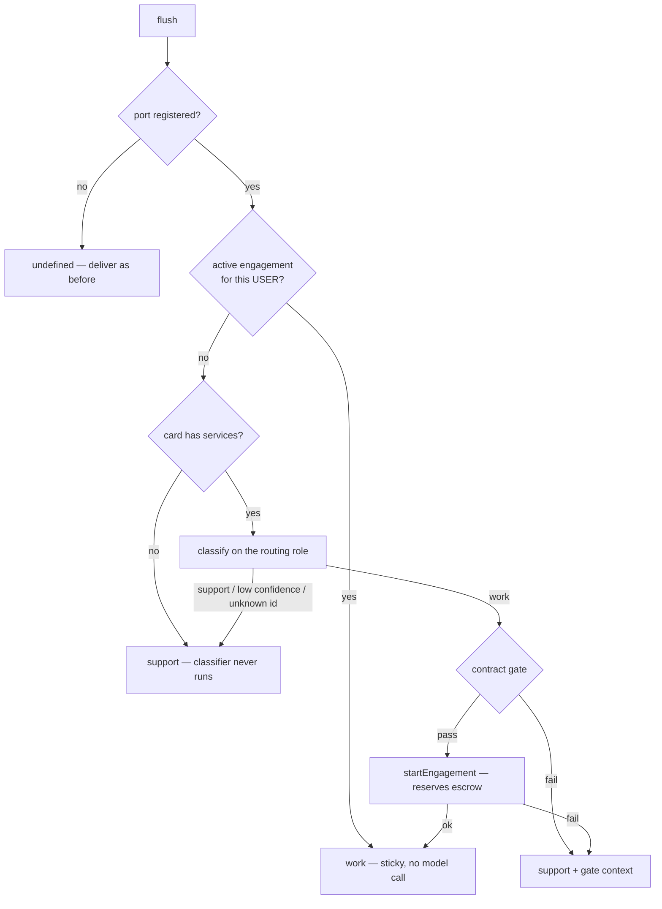

# Matrix commerce — the core seam

The `oracle-payments` plugin turns a Matrix DM room into a commerce surface. Most of it lives in the plugin (`packages/oracle-runtime/src/plugins/oracle-payments/`), but a handful of pieces **cannot** be plugin-owned: the router runs before the graph, the abort registry owns live `AbortController` objects, and the prompt overlay is composed inside `createMainAgent`. Those are what this page covers.

Design: `specs/matrix-agent-commerce.md`. Product-facing behaviour: `ixo-docs/build-an-oracle/reference/bundled-plugins/oracle-payments.mdx`. Neither is restated here.

Everything below is Matrix-only. HTTP turns never route, never carry `ctx.commerce`, and never post component events.

## The `CommerceRouterPort` slot

`modules/messages/commerce-router-port.ts`.

Core owns a router; the plugin owns the knowledge the router needs (agent-card services, thread engagements, the contract gate, the chain write that starts an engagement). Rather than have core import the plugin, the plugin pushes an implementation into a **single module-level slot**:

```ts
setCommerceRouterPort(port); // plugin's OnModuleInit
clearCommerceRouterPort(); // plugin's OnModuleDestroy
getCommerceRouterPort(); // core, per turn — null when unregistered
```

Same shape as the bridge's existing `setDeliverHandler` / `setRoomSessionResolver`. One commerce plugin per process, by construction.

`CommerceRouterPort` (see the file for the full interface) exposes `getServices`, `findActiveEngagement`, `checkContractGate`, `startEngagement`, plus an optional `routerModel` override. `findActiveEngagement` is keyed by the SENDER, not by the room or thread — it returns the user's one live engagement together with the room and thread its durable record lives in. The chain write stays behind `startEngagement` — the router only ever learns pass or fail.

Registered from `plugins/oracle-payments/commerce-port.registrar.ts`. **Unregistered is the default and must stay a no-op:** `MessageRouterService.route` returns `undefined` when the slot is empty, the bridge skips status-card setup because `router.isActive()` is false, and a Matrix turn behaves exactly as it did before the feature.

## Per-turn routing

`modules/messages/message-router.service.ts`, called from `matrix-listener-bridge.ts`'s `flush()` immediately before `deliverHandler`.



Two rules the code enforces and reviews should protect:

- **Fail open to support.** Every failure lane — a thrown classifier, a timeout, sub-threshold confidence, a serviceId the card doesn't have, a gate refusal, a failed chain write — resolves to support mode. Nothing routes into billable work by accident.
- **No model call when there's nothing to classify against.** An oracle with no agent card never pays for a routing call.

The classifier's timeout and confidence floor are constants at the top of the file. `routerModel` from the port overrides the `routing` role model.

## How the decision reaches the agent

`ctx.commerce` (`plugin-api/types.ts`) carries `{ mode, engagement?, gate? }`. It is threaded through the request as data, never written into graph state:

```
matrix-listener-bridge (router result)
  → MatrixIncomingMessage.commerce
  → SendMessageRequest.commerce            (modules/messages/messages.service.ts)
  → MainAgentRequestContext.commerce       (modules/messages/agent-builder.ts)
  → runConfig.context.commerce             (graph/main-agent.ts)
  → RuntimeContext.commerce                (runtime-context/build-runtime.ts)
```

This is deliberate. A middleware returning a state channel breaks checkpointer thread continuity (see the binding rule in `CLAUDE.md`), so the mode is request metadata the whole way down. `graph/main-agent-types.ts` types the field as an opaque passthrough — it is bridge-to-runtime, never client input.

Three consumers read it:

| Consumer       | Where                                                                                                                                                                               |
| -------------- | ----------------------------------------------------------------------------------------------------------------------------------------------------------------------------------- |
| Prompt overlay | `graph/commerce-overlay.ts`, composed in `graph/main-agent.ts`, rendered through the `COMMERCE_OVERLAY` slot in `graph/prompt-composer.ts`. Gated on `session.client === 'matrix'`. |
| Tool surface   | `OraclePaymentsPlugin.getRequestTools` — work mode swaps the support tools for `deliver_work` / `cancel_work`.                                                                      |
| Billing filter | `graph/main-agent.ts`, immediately after `registries.tools.collect(...)`.                                                                                                           |

### `PluginTool.billing: 'contracted'`

A fork marks its own work tools `billing: 'contracted'` and the runtime drops them from collection unless the turn is in work mode. Applied at collection so no later stage — visibility selection, wrapping, capability-gate maps — ever sees a gated tool. It is a hard code gate on top of the prompt overlay, not a replacement for it.

## The in-flight turn registry (double-text abort)

A private `Map<sessionId, InFlightTurn>` inside `modules/messages/matrix-listener-bridge.ts` — not a separate service, because the entry holds a live `AbortController` that has to stay in process memory anyway, and the Matrix sync loop is single-instance per oracle.

On flush for a session that already has an in-flight turn, the bridge:

1. drops the map entry, then `controller.abort()`;
2. waits on the prior turn's `settled` promise, bounded by a drain timeout;
3. flips the prior turn's status card to `superseded`;
4. **prepends the prior turn's coalesced text to the new message** so nothing the user said is lost. Because the stored `userText` is the already-concatenated text, a third rapid message accumulates everything still unanswered.

The signal's path to the graph: `MatrixIncomingMessage.abortController` → `SendMessageRequest` → `BatchInvoker` → `AgentBuilder.build` → `langGraphConfig.signal` → `RuntimeContext.abortSignal`. `onModuleDestroy` aborts every live turn.

The delivery lane defends itself: `WorkClaimService` wraps signing and submission so an abort cannot land between "claim signed" and "claim submitted".

## `work_status` — the liveness card

`matrix/work-status-producer.ts`, a process-wide singleton.

One card per user message, anchored on `props.forEventId`. The first emission creates the event; every later phase posts the full new content with an `m.replace` relation, so clients collapse to the latest. Posts are serialized per turn so the anchor always lands before its replacements, and posting failures are logged, never thrown.

| Phase                  | Emitted from                                                 |
| ---------------------- | ------------------------------------------------------------ |
| register (`beginTurn`) | `matrix-listener-bridge.ts` — only when `router.isActive()`  |
| `routing`              | `message-router.service.ts`, just before the classifier call |
| `working`              | `graph/wrap-plugin-tool.ts`, on every plugin tool invocation |
| `delivering`           | the bridge before the final send; also `WorkClaimService`    |
| `done` / `superseded`  | the bridge                                                   |

Only `routing` and `working` may _create_ a card — the closing phases update an existing one, so a turn that never showed progress posts nothing instead of a lone "done". Emissions for an unregistered `requestId` are silent no-ops, which is what disables the card on HTTP turns and on oracles without the plugin.

Adding a new producer means calling `workStatusProducer.emit(requestId, phase, label?)`; do not post `work_status` events by hand.

## The component event protocol

`matrix/oracle-component-event.ts` owns `ixo.oracle.component`: the `OracleComponentName` union, the content shape, and `buildOracleComponentContent` (thread relation, or `m.replace` when replacing an anchor — never both). `postOracleComponent` accepts anything with `postEvent`, so it works from ambient services and from `ctx.matrix` alike.

`ctx.matrix.postEvent(roomId, type, content)` was added for this feature (`runtime-context/ambient.ts`, `bootstrap/ambient-factory.ts`, `runtime-context/build-runtime.ts`) because `postToRoom` hardcodes `m.room.message`. Test doubles in `registries/test-fixtures.ts`, `testing/mocks.ts`, and `testing/integration/harness.ts` stub it.

Adding a component name means extending the union here **and** shipping the matching portal renderer; unknown names fall back to `content.body`.

## Engagement state (plugin-owned, worth knowing)

`EngagementService` stores engagements in Matrix room state under `ixo.room.state`, one state event per thread (`work_engagement.<threadRootEventId>`), with a per-process cache in front. Two index events make the set queryable: `work_engagement.active` points at the room's one live engagement, and `work_engagement.pending_claims` — written in the oracle's own `MATRIX_ACCOUNT_ROOM_ID` — is the cross-room list the claim-status cron walks.

Lookup, though, is **per user**: `findActiveForUser` answers from a replica of the user's active engagement — Redis when the oracle has `REDIS_URL`, an in-process map with the same interface when it does not — keyed by the user's DID and carrying the room + thread of the durable record. That replica is what decides "work or support?" per turn without a Matrix read, and what keeps a user in work mode when their next message lands in another thread (a bare main-timeline message is its own thread root) or another room. It is a cache, never the truth: every write goes to room state first, a miss falls back to the per-room index and repopulates it, an entry that no longer reads `active` is dropped, and a Redis failure is logged and treated as a miss.

`listStateEvents` is not an enumeration seam: it paginates the whole room timeline and returns payloads _without_ their state keys. Hence the explicit index events. A pointer left by a crashed write resolves to a non-active engagement and reads as "none", so the index self-heals; treat it as an optimisation over the chain's own refusal, never as authority.

## The chain lane

`plugins/oracle-payments/claim-lane.ts` isolates every chain and claim-bot call behind narrow interfaces (`IntentChainClient`, `ClaimChainClient`, `ClaimBotUploader`, `EvaluationChainClient`) with default implementations built on `@ixo/oracles-chain-client`. Unit tests inject stubs; nothing else in the plugin touches the chain directly.

Signing reuses `UcanService.getSigningMnemonic()` exactly like the credits settlement cron — **no new signing plumbing**. `WorkClaimWiring` hands the key to the delivery lane at boot.

Two invariants the tests pin, and any change here must keep:

- **Persist before the chain call.** The signed claim's cid is written onto the engagement before `submitClaim` runs, so a retry resumes at submit and never signs or uploads twice.
- **A cancellation is a claim.** There is no cancel-intent message on chain; the only way to hand an escrowed reservation back is to claim against it honestly. Submitting frees the intent immediately; the evaluator's rejection is what returns the funds.

## Shared shape with other Matrix work

`matrix/room-file.ts` (file send + thread-scoped attachment listing) and `modules/messages/attachment-archive.ts` (`SANDBOX_OUTPUT_PREFIX`, filename sanitisation, archived-path derivation) were extracted so the plugin and `FileProcessingService` cannot drift on where an attachment lands. Anything that reports an archive path must import from there rather than rebuild it.

## When you change this

- Touching the router, the port, or the bridge's turn lifecycle → update this page.
- Adding a component name or a `work_status` phase → update this page **and** `specs/matrix-agent-commerce.md`'s protocol table, and check the portal renderer.
- Changing env vars, tools, or user-visible behaviour → that is the public page, `ixo-docs/build-an-oracle/reference/bundled-plugins/oracle-payments.mdx`.
