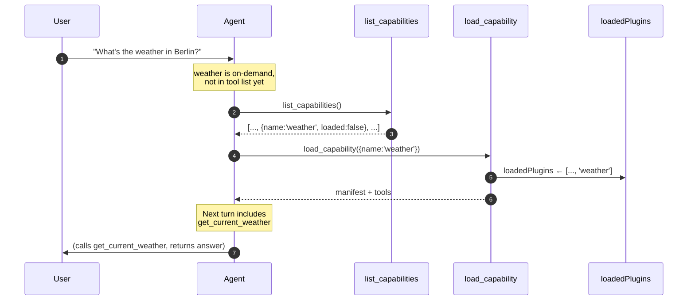
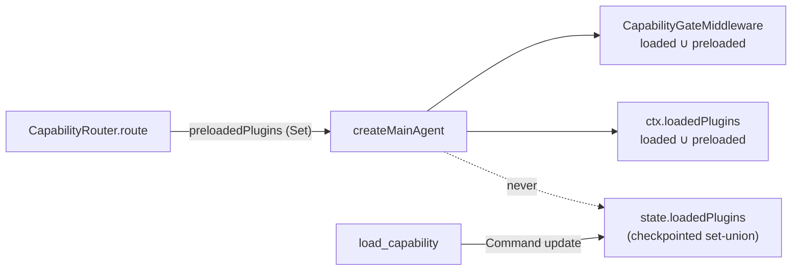

# Meta-tools and discovery

The two built-in tools every agent has, regardless of which plugins are loaded.

Source: `packages/oracle-runtime/src/meta-tools/`.

## Why two, not four

The original spec called for four meta-tools: `find_capability`, `load_capability`, `list_capabilities`, `list_capability_details`. The implementation collapsed to two because `load_capability` proved sufficient for discovery + load in one call (it returns the full manifest plus tool list), and `list_capability_details` was redundant with that.

Final shipping set: `load_capability` and `list_capabilities`.

```ts
export function buildMetaTools(opts: BuildMetaToolsOptions): PluginTool[] {
  return [
    buildLoadCapabilityTool(opts.manifestRegistry, opts.toolRegistry),
    buildListCapabilitiesTool(opts.manifestRegistry),
  ];
}
```

These tools are internal: registered by the runtime in `createMainAgent`, never exported on the public package surface, and not authorable by plugins.

## load_capability

`packages/oracle-runtime/src/meta-tools/load-capability.ts`.

```ts
const loadCapabilitySchema = z.object({ name: z.string() });
```

Behaviour:

1. Look up the manifest in `ManifestRegistry` by plugin name.
2. If not found → throw with hint to call `list_capabilities` first.
3. If `visibility: 'silent'` → throw (silent plugins are internal, not agent-loadable).
4. If already loaded (`ctx.loadedPlugins.has(name)`) or `visibility: 'always'` → return the manifest + tool list with `alreadyAvailable: true`. No state change.
5. Otherwise → return a LangGraph `Command` that updates `loadedPlugins` by appending `name`, AND appends a `ToolMessage` carrying the JSON-encoded result. The tool message has a matching `tool_call_id` from `ctx.toolCallId`.

The `Command` form is what lets the agent see the manifest content in conversation history on the same turn — without it, the agent would just see "ok loaded" and have to call again to learn the plugin's tools.

If `ctx.toolCallId` isn't set (direct/test invocation), the implementation skips the message and relies on the return value alone. See the source's comment on this branch.

### Return shape

```ts
interface LoadCapabilityResult extends PluginManifest {
  alreadyAvailable: boolean;
  tools: Array<{ name: string; description: string }>;
}
```

The full `PluginManifest` (so the agent sees `whenToUse`, `whenNotToUse`, `examples`, etc.) plus a per-tool description list.

## list_capabilities

`packages/oracle-runtime/src/meta-tools/list-capabilities.ts`.

```ts
const listCapabilitiesSchema = z.object({
  includeOnDemand: z.boolean().default(true),
  includeSilent: z.boolean().default(false),
});
```

Iterates `manifestRegistry.collect()`, filters by visibility (skip `silent` unless `includeSilent`, skip `on-demand` unless `includeOnDemand` — but `includeOnDemand` defaults `true` so the common case includes them), returns:

```ts
interface CapabilityListing {
  name: string;
  summary: string;
  visibility: 'always' | 'on-demand' | 'silent';
  loaded: boolean;
  category?: PluginManifest['category'];
  tags: string[];
}
```

`loaded` is `true` when `visibility === 'always'` OR the plugin name is in `ctx.loadedPlugins`.

The result is JSON-stringified before return. The source comment explains why: LangChain's `tool()` helper mis-handles a raw array return (the `[content, artifact]` heuristic can drop the content), so the explicit `JSON.stringify` keeps the contract unambiguous. Tests parse the result.

## How the agent uses them



In practice the agent often skips `list_capabilities` and goes straight to `load_capability` when the user's intent is unambiguous. The runtime allows this — `load_capability` works with any known plugin name; the throw only happens for unknown plugins.

## Capability router

`packages/oracle-runtime/src/modules/messages/capability-router.ts`, invoked from `AgentBuilder.build()`.

The discovery flow above costs one model round trip whenever the answer needs an on-demand plugin: the model has to call `load_capability` before it can call the plugin's tools. The capability router removes that round trip for the common case by predicting, before the first model call, which unloaded on-demand plugin the message needs, and exposing that plugin's tools for the turn.

The prediction is the shared `runtime.route-capabilities` Decision (`@ixo/common/ai/decisions/capability-router.ts`, also consumed by the Workers runtime): a boolean "does this message need a listed capability" plus a choice over the candidates with a synthetic "none" option. `decideCapabilityRoute` turns the two answers into a verdict deterministically; the 0.7 confidence floor (`CAPABILITY_ROUTE_MIN_CONFIDENCE`) lives there, in `@ixo/common`, not in the runtime, so both runtimes preload on the same line. The runtime side owns the mode, the candidate set, the fail-open and the log lines.

### Modes

`CAPABILITY_ROUTER` is a base env var (`capabilityRouterEnvShape`, spread into `base-env-schema.ts`).

| Mode            | Evaluated | Awaited by the turn | Preloads |
| --------------- | --------- | ------------------- | -------- |
| `off` (default) | never     | —                   | no       |
| `shadow`        | yes       | never               | no       |
| `on`            | yes       | yes                 | yes      |

`shadow` exists to measure accuracy before switching on: the verdict and its raw probabilities are logged, nothing else changes. `on` awaits the Decision, whose own `timeoutMs` (2 s) bounds the wait; the Decision receives the turn's abort signal in both modes.

### Candidates and skips

Candidates are the manifests whose effective visibility is `on-demand` (the default) and whose plugin is not already in the turn's `loadedPlugins` — including the editor seed the builder adds for an open editor session. `always` plugins are already bound and `silent` ones are not agent-loadable, so neither is offered. `toRoutableCapabilities` reduces each manifest to `{ name, title, summary }`.

The router is skipped entirely, in every mode, when there are no candidates, when the message is blank, or when the turn is a Matrix **support** turn: support mode binds an allowlist and no meta-tools, so a preload there would contradict the mode.

The Decision input is `{ text, recentTurns: [], capabilities }`. Prior turns are deliberately not supplied: the builder reads the checkpoint without its messages (`getTupleWithoutMessages`) to keep the pre-model path cheap, so the router sees the current message only.

### One turn, never state



A preload is passed to `createMainAgent` as `MainAgentArgs.preloadedPlugins` and goes exactly two places: the capability gate (`preloadedPlugins` option — a tool passes when its plugin is loaded **or** preloaded) and the `RuntimeStateInput.loadedPlugins` set that tool handlers see as `ctx.loadedPlugins`. It is never written to `buildTimeState`, to `stateInput`, or to any graph state. `loadedPlugins` is a checkpointed set-union channel: anything written there is loaded for the rest of the thread, and a probabilistic prediction must not have that reach. Only `load_capability` grows the channel. (The editor seed in `agent-builder.ts` is the deliberate exception — an open editor session is a fact about the thread, not a guess.)

Two consequences follow:

- Prompt composition keeps reading the persisted set only. A preloaded `flows` exposes the flows tools but does not render the Flow Builder operating guide; a prediction exposes tools, it does not buy prompt tokens on a turn where it may be wrong.
- `list_capabilities` reports a preloaded plugin as `loaded: true` and `load_capability` answers `alreadyAvailable: true` for it, both without a state update — the preload lasts this turn and the router is expected to route the plugin again on the next one. Nothing pins it.

### Fail-open

Anything that stops the Decision from answering — no evaluator on the ambient runtime, no `DECISION_PROVIDER` configured, a timeout, an abort, a provider error, a malformed answer — preloads nothing, and the turn proceeds as if the router were off. The two boot-time reasons (`missing-evaluator`, `DecisionProviderUnavailableError`) warn once per process, mirroring `MessageRouterService`; every other failure warns on the turn it happens.

### Log lines

Lines carry plugin names, probabilities and error type names. The message text never reaches a line, nor does a provider's message (it can echo the Decision state, which includes the text).

```text
[capability-router] request=… mode=on status=ok preloaded=[weather] candidates=3 needsCapability=0.91 capability=weather capabilityConfidence=0.84 reason=preload latencyMs=310 provider=… model=…
[capability-router] request=… mode=on status=fallback reason=<error type>
[capability-router-shadow] request=… status=ok needsCapability=… capability=… capabilityConfidence=… reason=… wouldPreload=[…] candidates=… latencyMs=… provider=… model=…
[capability-router-shadow] request=… status=failed errorType=<error type>
[capability-router-shadow] request=… wouldPreload=[…] loadedDuringTurn=[…] agree=<bool>
```

The last line is the shadow comparison: after the run, what the model actually loaded (final `loadedPlugins` minus the turn's starting set) against what the router would have preloaded. `agree` is `true` for an empty prediction on a turn that loaded nothing, or for a prediction whose every plugin the model went on to load. Only the batch path (`batch-invoker.ts`) emits it, because only `agent.invoke` returns the final state; the SSE path streams events and never sees it, and re-reading the checkpoint for a log line was not worth the cost. Shadow accuracy is therefore measured on non-streaming turns.

## Registration in createMainAgent

`buildMetaTools(...)` is called inside the agent builder and the returned tools are concatenated into the bound tool list ahead of plugin tools and sub-agents. This ordering means meta-tools always appear at the top of the agent's available tools — useful for prompt-stability and for the agent to "know" the meta-tools exist.

## TF-IDF / embeddings

The spec mentions TF-IDF search behind `find_capability`. Since `find_capability` was merged into `load_capability`, the search index isn't directly invoked by an agent-facing tool today. The TF-IDF infrastructure remains in `manifest/` and could be re-exposed if a future `find_capability` is reinstated (e.g. for a "browse all plugins" flow).

Embeddings-based ranking is an explicit deferred decision — see `spec-and-roadmap/follow-ups.md`.

## Read next

- [Graph and state](graph-and-state.md) — how `loadedPlugins` participates in agent build.
- [Plugin lifecycle](plugin-lifecycle.md) — what makes a plugin discoverable.
