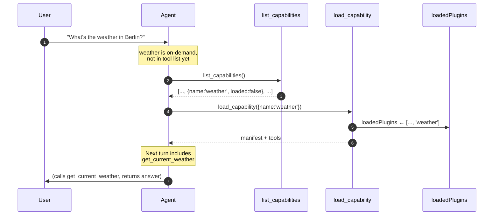

# Meta-tools and discovery

The two built-in tools every agent has, regardless of which plugins are loaded.

Source: `packages/oracle-runtime/src/meta-tools/`.

## Why two, not four

The original spec called for four meta-tools: `find_capability`, `load_capability`, `list_capabilities`, `list_capability_details`. The implementation collapsed to two because `load_capability` proved sufficient for discovery + load in one call (it returns the full manifest plus tool list), and `list_capability_details` was redundant with that.

Final shipping set: `load_capability` and `list_capabilities`.

```ts
export function buildMetaTools(opts: BuildMetaToolsOptions): PluginTool[] {
  return [
    buildLoadCapabilityTool(opts.manifestRegistry, opts.toolRegistry),
    buildListCapabilitiesTool(opts.manifestRegistry),
  ];
}
```

These tools are internal: registered by the runtime in `createMainAgent`, never exported on the public package surface, and not authorable by plugins.

## load_capability

`packages/oracle-runtime/src/meta-tools/load-capability.ts`.

```ts
const loadCapabilitySchema = z.object({ name: z.string() });
```

Behaviour:

1. Look up the manifest in `ManifestRegistry` by plugin name.
2. If not found → throw with hint to call `list_capabilities` first.
3. If `visibility: 'silent'` → throw (silent plugins are internal, not agent-loadable).
4. If already loaded (`ctx.loadedPlugins.has(name)`) or `visibility: 'always'` → return the manifest + tool list with `alreadyAvailable: true`. No state change.
5. Otherwise → return a LangGraph `Command` that updates `loadedPlugins` by appending `name`, AND appends a `ToolMessage` carrying the JSON-encoded result. The tool message has a matching `tool_call_id` from `ctx.toolCallId`.

The `Command` form is what lets the agent see the manifest content in conversation history on the same turn — without it, the agent would just see "ok loaded" and have to call again to learn the plugin's tools.

If `ctx.toolCallId` isn't set (direct/test invocation), the implementation skips the message and relies on the return value alone. See the source's comment on this branch.

### Return shape

```ts
interface LoadCapabilityResult extends PluginManifest {
  alreadyAvailable: boolean;
  tools: Array<{ name: string; description: string }>;
}
```

The full `PluginManifest` (so the agent sees `whenToUse`, `whenNotToUse`, `examples`, etc.) plus a per-tool description list.

## list_capabilities

`packages/oracle-runtime/src/meta-tools/list-capabilities.ts`.

```ts
const listCapabilitiesSchema = z.object({
  includeOnDemand: z.boolean().default(true),
  includeSilent: z.boolean().default(false),
});
```

Iterates `manifestRegistry.collect()`, filters by visibility (skip `silent` unless `includeSilent`, skip `on-demand` unless `includeOnDemand` — but `includeOnDemand` defaults `true` so the common case includes them), returns:

```ts
interface CapabilityListing {
  name: string;
  summary: string;
  visibility: 'always' | 'on-demand' | 'silent';
  loaded: boolean;
  category?: PluginManifest['category'];
  tags: string[];
}
```

`loaded` is `true` when `visibility === 'always'` OR the plugin name is in `ctx.loadedPlugins`.

The result is JSON-stringified before return. The source comment explains why: LangChain's `tool()` helper mis-handles a raw array return (the `[content, artifact]` heuristic can drop the content), so the explicit `JSON.stringify` keeps the contract unambiguous. Tests parse the result.

## How the agent uses them



In practice the agent often skips `list_capabilities` and goes straight to `load_capability` when the user's intent is unambiguous. The runtime allows this — `load_capability` works with any known plugin name; the throw only happens for unknown plugins.

## Registration in createMainAgent

`buildMetaTools(...)` is called inside the agent builder and the returned tools are concatenated into the bound tool list ahead of plugin tools and sub-agents. This ordering means meta-tools always appear at the top of the agent's available tools — useful for prompt-stability and for the agent to "know" the meta-tools exist.

## TF-IDF / embeddings

The spec mentions TF-IDF search behind `find_capability`. Since `find_capability` was merged into `load_capability`, the search index isn't directly invoked by an agent-facing tool today. The TF-IDF infrastructure remains in `manifest/` and could be re-exposed if a future `find_capability` is reinstated (e.g. for a "browse all plugins" flow).

Embeddings-based ranking is an explicit deferred decision — see `spec-and-roadmap/follow-ups.md`.

## Read next

- [Graph and state](graph-and-state.md) — how `loadedPlugins` participates in agent build.
- [Plugin lifecycle](plugin-lifecycle.md) — what makes a plugin discoverable.
