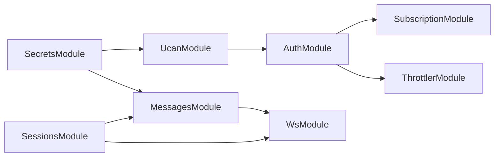

# Modules

The always-on NestJS modules that ship with the runtime. Plugins extend the app via `getNestModules`; these are the modules the runtime itself owns.

Source: `packages/oracle-runtime/src/modules/`.

## Layout

```
modules/
├── auth/
├── health/
├── messages/
├── secrets/
├── sessions/
├── subscription/
├── throttler/
├── ucan/
└── ws/
```

Each subdirectory holds the module, controller(s), service(s), DTOs, and tests.

## Always-on

These are imported by `RuntimeAppModule` on every boot regardless of plugin set:

| Module                | Purpose                                                                                            | Public-facing routes |
| --------------------- | -------------------------------------------------------------------------------------------------- | -------------------- |
| `SessionsModule`      | Chat session lifecycle (per-user, per-thread).                                                     | `/sessions`          |
| `MessagesModule`      | Send + stream messages; per-request agent build.                                                   | `/messages`          |
| `ModelsModule`        | Model catalog with cost tiers ([model selection](./model-selection.md)). Auth-excluded (public).   | `/models`            |
| `WsModule`            | WebSocket gateway for typed events.                                                                | WebSocket            |
| `SecretsModule`       | Per-room JWE-encrypted secrets with 24h cache.                                                     | (no public routes)   |
| `DomainContextModule` | Serves the entity's constitution, loaded and vetted at boot. `@Global`.                            | (no public routes)   |
| `UcanModule`          | UCAN delegation + invocation signing.                                                              | (no public routes)   |
| `AuthModule`          | `AuthHeaderMiddleware` validates UCAN + DID on every protected route.                              | (middleware)         |
| `SubscriptionModule`  | Subscription enforcement middleware. Wired conditionally — active when `credits` plugin is loaded. | (middleware)         |
| `ThrottlerModule`     | Per-user rate limiting.                                                                            | (middleware)         |
| `HealthModule`        | `/health` liveness probe.                                                                          | `/health`            |

## Plugin modules

Plugins contribute modules via `getNestModules(ctx?)`. The boot flow:

1. `createOracleApp` calls `plugin.getNestModules?.(ctx)` for every loaded plugin (boot phase 9).
2. Returned modules are spread into `RuntimeAppModule.imports` via `RuntimeAppModule.register({ pluginNestModules, ... })`.
3. Host code's `nestModules` array is spread the same way (`userNestModules`).

Both lists merge into the same imports array; Nest doesn't distinguish them at the DI level.

## RuntimeAppModule

`bootstrap/runtime-app-module.ts` exports a class with a `register` static returning a `DynamicModule`. The dynamic module:

- Imports every always-on module.
- Imports `pluginNestModules` and `userNestModules`.
- Wires `AuthHeaderMiddleware` via `MiddlewareConsumer` and applies `MiddlewareConsumer.exclude(...)` for the framework's built-in exclusions (`/health`, `/docs`, `/docs/(.*)`) plus everything in `pluginAuthExclusions` (plugin + host).
- Conditionally wires `SubscriptionMiddleware` when `enableSubscriptionMiddleware` is set (i.e. when `credits` plugin is loaded).

## Module dependency graph



The order matters at module-construction time — Nest's DI resolves leaf-to-root, so any module that injects another must come after it.

## Bootstrap pattern: OracleRuntimeBundleHolder

There's a chicken-and-egg between Nest's DI lifecycle and `createOracleApp`:

1. `createOracleApp` calls `NestFactory.create(RuntimeAppModule)` — Nest constructs every `@Injectable()` here, including `MessagesService`.
2. Right after, `createOracleApp` builds `AmbientServices` (UcanAdapter, MatrixAdapter, …) using `nestApp.get(UcanService)` etc. — ambient services can't exist until AFTER Nest boots.
3. But `MessagesService` (constructed in step 1) needs `ambient` + `registries` + `identity` to call `createMainAgent` per request.

The Holder is the workaround:

```ts
@Injectable()
class OracleRuntimeBundleHolder {
  private bundle = null;
  populate(b) {
    this.bundle = b;
  } // called by createOracleApp post-bootstrap
  get() {
    return this.bundle;
  } // called by MessagesService per request
}
```

Nest constructs the holder empty in step 1; `createOracleApp` populates it in step 2; `MessagesService` reads from it per request via DI in step 3+.

Alternatives considered and rejected:

- `useFactory` providers — chicken-egg between ambient and DI.
- Passing through `RuntimeAppModule.register({...})` — can't satisfy ambient's `UcanService` dependency.
- Module-level singletons — hides global state, breaks test isolation.

The holder is the simplest workable shape.

Source: `modules/messages/oracle-runtime-bundle.ts`.

## SubscriptionMiddleware activation

The credits plugin's presence flips a flag on `RuntimeAppModule.register({ enableSubscriptionMiddleware: ... })`. When `true`, the module wires `SubscriptionMiddleware` ahead of the message handler. When `false`, the middleware is omitted.

`SubscriptionMiddleware` lives in `modules/subscription/` (always present in the codebase). Whether it's _applied_ depends on whether the credits plugin is loaded.

## Read next

- [Boot sequence](boot-sequence.md) — phase 11 (Nest bootstrap) in detail.
- [Matrix and checkpointer](matrix-and-checkpointer.md) — Secrets and UCAN flows.
- [Plugin lifecycle](plugin-lifecycle.md) — when `getNestModules` fires.
