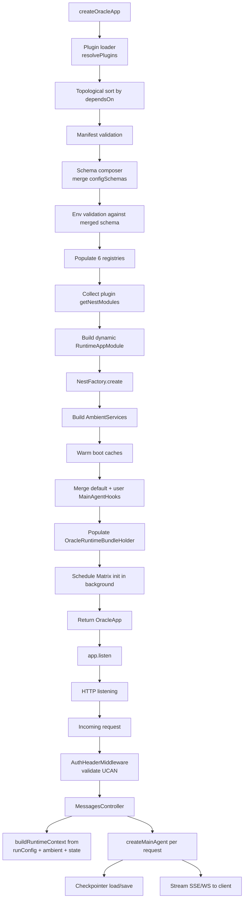

# Architecture overview

The runtime ships as `@ixo/oracle-runtime`. Forks consume it via `createOracleApp({ config, plugins, nestModules })` from a ~30-line `main.ts`. Everything between that call and the listening HTTP server is what this directory documents.

## Package layout

```
packages/oracle-runtime/src/
├── bootstrap/            # createOracleApp, loader, composer, inspect, graceful shutdown
├── config/               # base env schema, LLM provider config, model-for-role
├── events/               # scoped emitter
├── graph/                # createMainAgent, agent builder, prompt composer, 4 always-on middlewares
├── llm/                  # provider abstractions
├── manifest/             # PluginManifest schema, validator, tier-1 renderer
├── matrix/               # Matrix adapter + checkpointer (UserMatrixSqliteSyncService)
├── meta-tools/           # load_capability, list_capabilities
├── modules/              # always-on NestJS modules (Sessions, Messages, WS, Secrets, UCAN, Auth, Subscription, Throttler, Health)
├── plugin-api/           # OraclePlugin, defineOraclePlugin, tool(), types
├── plugins/              # 17 bundled plugins
├── registries/           # 6 internal registries
├── runtime-context/      # buildPluginContext, buildRuntimeContext, ambient services
├── testing/              # createTestRuntime + mocks + integration harness
└── utils/
```

## Bootstrap → request flow



## The three lines that make the runtime

1. **Plugins contribute to registries.** Every hook on every plugin populates one of six registries (`tools`, `subAgents`, `middlewares`, `manifests`, `configSchema`, `sharedState`).
2. **`createMainAgent` reads registries and composes an agent per request.** Tools, sub-agents, middlewares, the prompt — all assembled fresh per turn from the cached boot snapshot plus any request-time hooks.
3. **The graph state is unchanged from the legacy runtime, except for one field.** The plugin runtime added `loadedPlugins` (for dynamic capability loading). Every other state field is identical — same reducers, same lifetime, same checkpointer.

## What's different from the legacy `apps/app`

| Aspect                     | Legacy `apps/app`                                                        | Plugin runtime                                                             |
| -------------------------- | ------------------------------------------------------------------------ | -------------------------------------------------------------------------- | ---------------------------- |
| Adding functionality       | Edit `main-agent.ts` (1052 lines) to inline tools/sub-agents/middlewares | Author a plugin class; the runtime collects via registries                 |
| Toggling features          | Edit the agent                                                           | `features: { name: boolean                                                 | 'auto' }`on`createOracleApp` |
| Env vars                   | One monolithic schema                                                    | Composed: base + per-plugin schemas                                        |
| Sub-agent init failures    | `Promise.allSettled` directly in `main-agent.ts`                         | Same semantics, in `collectSubAgentsWithFallback`                          |
| Apps-vs-framework boundary | Blurred — `apps/app` was the whole oracle                                | Clear — framework is `packages/oracle-runtime/`, fork is `apps/<your-app>` |

## Read next

- [Boot sequence](boot-sequence.md) — every phase of `createOracleApp` in order.
- [Plugin lifecycle](plugin-lifecycle.md) — when each plugin hook fires and what context it sees.
- [Modules](modules.md) — the always-on NestJS modules and their dependency graph.
- [Graph and state](graph-and-state.md) — `MainAgentGraphState`, reducers, and how plugin contributions reach the agent.
- [Meta-tools and discovery](meta-tools-and-discovery.md) — `list_capabilities` and `load_capability`.
- [Matrix and checkpointer](matrix-and-checkpointer.md) — the persistence layer.
- [Runtime context](runtime-context.md) — how `RuntimeContext` is built per request.
