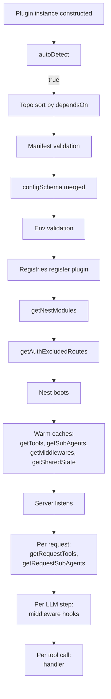

# Plugin lifecycle

When each hook on `OraclePlugin` fires, what context it gets, and how errors propagate.

Source: `packages/oracle-runtime/src/plugin-api/oracle-plugin.ts`, `bootstrap/plugin-loader.ts`, `bootstrap/create-oracle-app.ts`, `graph/agent-builder.ts`.

## Boot-time hooks

These run once during `createOracleApp` and their outputs are cached for the lifetime of the process.

| Hook                      | When                                    | Context             | Failure mode                                       |
| ------------------------- | --------------------------------------- | ------------------- | -------------------------------------------------- |
| `autoDetect(env)`         | Plugin loader resolution (boot phase 2) | `NodeJS.ProcessEnv` | Throwing → resolver error → boot fails             |
| `getNestModules(ctx)`     | Boot phase 9                            | `PluginContext`     | Throwing → boot fails (no Promise.allSettled here) |
| `getAuthExcludedRoutes()` | Boot phase 10                           | None                | Throwing → boot fails                              |

These run during the warm pass (boot phase 15) once with a synthetic `pluginName: '__runtime__'` PluginContext:

| Hook                               | What's cached                                         |
| ---------------------------------- | ----------------------------------------------------- |
| `getTools(ctx)`                    | The tool list — re-used on every request build        |
| `getSubAgents(ctx)`                | The sub-agent list — re-used on every request build   |
| `getMiddlewares(ctx)`              | The middleware list — re-used on every request build  |
| `getSharedState()`                 | The accessor map — wired into the SharedStateRegistry |
| `configSchema` (field, not a hook) | Merged into the env schema at boot phase 5            |

The cache key is the plugin name; only one cache entry exists per plugin per process.

## Per-request hooks

These run on every agent build (per HTTP request that triggers a turn).

| Hook                         | Context          | Notes                                           |
| ---------------------------- | ---------------- | ----------------------------------------------- |
| `getRequestTools(rtCtx)`     | `RuntimeContext` | Output merges with cached `getTools` result     |
| `getRequestSubAgents(rtCtx)` | `RuntimeContext` | Output merges with cached `getSubAgents` result |

Implemented in `graph/agent-builder.ts` — the agent builder reads the cached boot snapshot plus runs these two hooks fresh.

## Tool handler

Every `PluginTool.handler` fires when the LLM calls the tool. Receives `(args, rtCtx: RuntimeContext)`. Errors propagate to the LangChain tool retry middleware — one retry on validation failure, then to the agent (which usually apologises).

`ctx.toolCallId` is set when the handler was triggered by a real tool call (used when returning a LangGraph `Command` that needs a matching `ToolMessage`).

## Sub-agent handler

Sub-agents are auto-wrapped as tools by `graph/createSubagentAsTool`. The wrapper:

1. Builds a sub-graph using LangChain's `createAgent` with the sub-agent's `systemPrompt`, `tools`, optional `middlewares`, and the model resolved via `ambient.llm.get(role)`.
2. Invokes the sub-agent with the main-agent's tool call args.
3. If `forwardTools` is truthy, the wrapper inspects the sub-agent's tool calls and emits matching events into the parent run so the UI surfaces them.
4. Calls `onComplete(result, rtCtx)` if defined.
5. Returns the sub-agent's final text.

If sub-agent init throws (e.g. an MCP client fails to construct), `collectSubAgentsWithFallback` in `graph/agent-builder.ts` catches via `Promise.allSettled`, logs with the plugin name, and skips that sub-agent's contribution for the request. The agent build continues without it. This matches the legacy semantics from `apps/app/src/graph/agents/main-agent.ts:621`.

## Middleware hooks

Middlewares run on every LLM step. Hooks come from LangChain's `AgentMiddleware`:

| Hook                    | When                      | Receives        |
| ----------------------- | ------------------------- | --------------- |
| `beforeModel(state)`    | Before the LLM is invoked | LangGraph state |
| `afterModel(state)`     | After the LLM returns     | LangGraph state |
| `onError(error, state)` | LLM call throws           | error + state   |

Plugin middlewares run **after** the four always-on middlewares (tool validation, retry, page context, safety guardrail) in topological dependency order across plugins.

## Order across the boot

## Plugin context vs runtime context

`PluginContext` (boot-time) holds only what's known at boot: `config`, `identity`, `availablePlugins`, `logger`. No user, no session.

`RuntimeContext` (per-request) holds the full per-request bag: `user`, `session`, `history`, `secrets`, `matrix`, `ucan`, `llm`, `emit`, `logger`, `abortSignal`, `shared`, `toolCallId`.

Tool handlers receive `RuntimeContext` even if their plugin only implements `getTools` (the boot-time hook). The boot/runtime split is about _registration_, not _execution_.

See [runtime-context.md](runtime-context.md) for how `buildRuntimeContext` synthesises it.

## Error semantics summary

| Where the error occurs                       | Effect                                                                                           |
| -------------------------------------------- | ------------------------------------------------------------------------------------------------ |
| `autoDetect` throws                          | Boot fails (resolver error).                                                                     |
| `getNestModules` throws                      | Boot fails.                                                                                      |
| `getAuthExcludedRoutes` throws               | Boot fails.                                                                                      |
| `configSchema` validation fails              | Boot fails with `[boot-error] Plugin '<name>' env validation failed for '<field>'`.              |
| `manifest` validation fails                  | Boot fails with `Plugin manifest validation failed (N issues)`.                                  |
| `getTools`, `getRequestTools` throws         | Logged with plugin name, plugin's contribution skipped for the request; rest of build continues. |
| `getSubAgents`, `getRequestSubAgents` throws | Same — Promise.allSettled in `collectSubAgentsWithFallback`.                                     |
| `getMiddlewares` throws                      | Same.                                                                                            |
| Tool handler throws                          | Tool error propagates to the agent loop; LangChain's tool retry handles one retry.               |
| Middleware hook throws                       | Propagates to the agent loop; surfaces as a turn error.                                          |

## Read next

- [Runtime context](runtime-context.md) — how `RuntimeContext` is built per request.
- [Graph and state](graph-and-state.md) — the agent builder and how plugin contributions reach the agent.
- [Modules](modules.md) — when `getNestModules` outputs are wired into NestJS.
