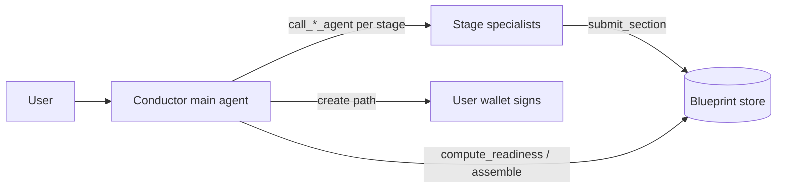
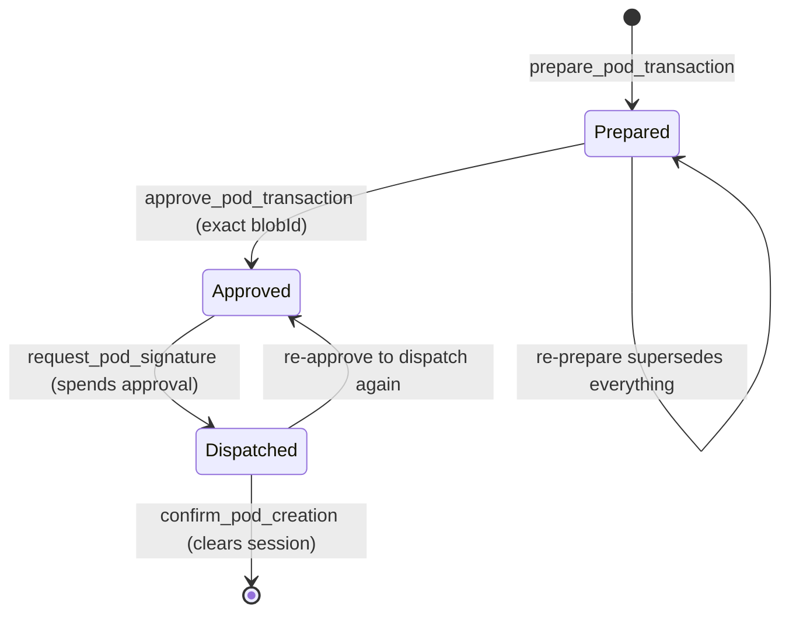

# POD-creator plugin

`packages/oracle-runtime/src/plugins/pod-creator/` — bundled, `visibility: on-demand`
(hidden until `load_capability('pod-creator')`), `stability: experimental`.

Designs an IXO Programmable Organisational Domain (POD) end to end — qualify →
architect → build → evaluate → package → gate — then walks the user through an
on-chain creation the **user's wallet signs**. The oracle never holds a signing
key for creation.

## Roles and flow

The main agent is the **conductor**: it owns the blueprint lifecycle through the
orchestration tools (`start_pod_design`, `get_blueprint`, `compute_readiness`,
`assemble_blueprint`). Twelve **specialist sub-agents** (one per
`design-pod-*` capsule, defined in `design-pod-roles.ts`) do the actual design
work. `getRequestSubAgents` exposes only the current stage's specialists, so the
pipeline order is enforced by construction.

Sections enter the blueprint **only** through a specialist's `submit_section`.
The conductor has no write path — it cannot self-certify `pass` verdicts and
skip the specialists to unlock creation. Gate-bearing roles (evaluate + gate)
only satisfy readiness with an explicit `verdict: 'pass'`.

Specialist prompts come from the ai-skills capsule registry via
`CapsuleContentClient` (UCAN `ixo:skills` auth, `X-IXO-Network` header,
per-thread cache). With no fetcher configured — the bundled default — every
specialist falls back to a built-in prompt carrying its stage duties, and the
degradation is logged per role.

## State and bounds

All plugin state is process-local, held on the plugin singleton, and bounded by
`BoundedMap` (LRU + idle TTL — see `bounded-map.ts`):

| Store                        | Contents                                 | Bound      |
| ---------------------------- | ---------------------------------------- | ---------- |
| `InMemoryBlueprintStore`     | one blueprint per thread                 | 500 / 24 h |
| `InMemoryCreateSessionStore` | propose→approve state per (user, thread) | 1000 / 1 h |
| `CapsuleContentClient` cache | SKILL.md per (thread, capsule)           | 1000 / 6 h |

Nothing survives a process restart. A durable `BlueprintStore` backend is a
swappable implementation of the interface; the idiomatic substrate is Matrix
room state (the user-preferences pattern) or the per-user SQLite the
checkpointer syncs.

## The create path

A propose → approve → commit handoff (`create-tools.ts` +
`create-session-store.ts`). The unsigned transaction bytes never enter model
context: `prepare` stashes them in `ctx.blobStore` (per-user, 1 h TTL) and the
LLM only ever sees a short `blobId`.

Safety properties, in order of enforcement:

1. **Launch gate** — `prepare` refuses until `computeReadiness` is complete.
2. **Mainnet opt-in** — `prepare` and `request_pod_signature` both refuse on
   mainnet unless `POD_CREATOR_ALLOW_MAINNET=true`.
3. **Exact-batch approval** — `approve` binds to the blobId prepared for this
   (user, thread); a batch prepared elsewhere cannot be approved here.
4. **Single-use approval** — `request_pod_signature` consumes the approval
   before dispatching, so a sign request can never be replayed; every dispatch
   needs a fresh human go-ahead.
5. **Wallet signature** — the binding gate. The oracle only ever produces
   unsigned bytes.

Every step writes an audit line via `ctx.logger`
(`[pod-creator] prepared/approved/signed/confirmed …` with user DID, thread,
blobId, network, txHash).

### The `sign_transaction` round-trip

`request_pod_signature` uses `callAgAction` from `@ixo/common` — the same
blocking client round-trip the agui plugin uses — with a 120 s deadline:

- **Action name:** `sign_transaction` (exported as `SIGN_TRANSACTION_ACTION`).
- **Args to the client:** `{ blobId, unsignedTx, network }` — the bytes ride
  the WS channel, not model context.
- **Expected result:** `{ txHash }` (64-hex) after the wallet signs and
  broadcasts.
- **Timeout / unsupported client:** the tool returns a graceful message; the
  approval stays spent, so retrying requires a fresh approve.

The Portal must register the action client-side (`useAgAction('sign_transaction', …)`)
for the round-trip to complete; until it does, the tool reports the wallet
didn't respond.

## Wiring for production

Two injectable seams on `PodCreatorPluginOptions` (the class is exported from
the package root, so forks can construct their own instance and pass it via
`plugins: [...]`):

- **`chainGateway`** — builds the unsigned POD batch and resolves a broadcast
  tx. The planned binding calls the IXO MCP server (Cloudflare) over the
  runtime's remote-MCP pattern: resolve the server's `did:web`, mint a per-user
  `ixo:*` UCAN invocation via `ctx.ucan`, send as the `Authorization` header
  (see the sandbox plugin's auth builder). The bundled default reports on-chain
  creation as unavailable — it never throws into the retry loop.
- **`capsuleContentFetcher`** — retrieves a capsule's `SKILL.md`. The registry
  list/search payloads carry no content field, so the concrete retrieval
  (content endpoint vs sandbox `load_skill` extraction) is still to be
  confirmed against ai-skills.

Config: `POD_CREATOR_ALLOW_MAINNET` (plugin-owned, default `false`); `NETWORK`
and `SKILLS_CAPSULES_BASE_URL` are read as siblings (owned by the base schema /
skills plugin). Every pod-creator surface defaults to `testnet`.
