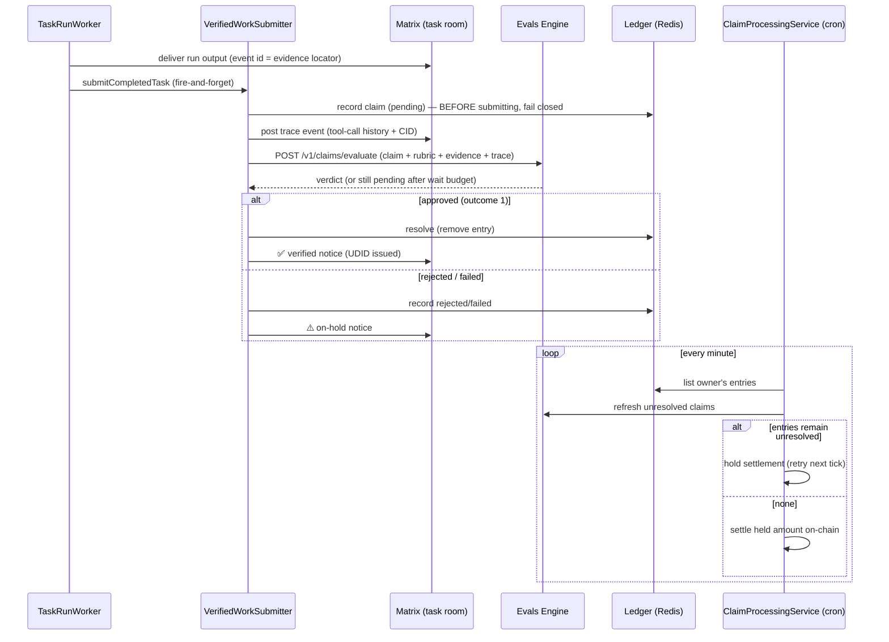

# The verified-work loop

Oracles as claimants, not just clients. When a background task run completes,
the oracle submits a claim about its own work to the IXO Evals Engine, and the
credits plugin gates on-chain settlement on the verdict — an approved,
UDID-backed claim is what releases payment. Unverifiable work is unpaid work.

Everything lives in `packages/oracle-runtime/src/plugins/evals/verified-work.ts`;
the tasks and credits plugins wire it in via optional Nest providers that are
`null` unless the loop is enabled.

## The pieces

| Piece                   | Where it runs                                                                                    | What it does                                                                                                                                                                                                                                                 |
| ----------------------- | ------------------------------------------------------------------------------------------------ | ------------------------------------------------------------------------------------------------------------------------------------------------------------------------------------------------------------------------------------------------------------ |
| `VerifiedWorkSubmitter` | `TaskRunWorker.process()` seam, after delivery + `finishRun`                                     | Packages claim + evidence packet (delivery event URI, content-CID of the output) + execution trace (the run's thread, read from the checkpointer before session teardown), submits, waits `EVALS_VERIFIED_WORK_WAIT_SECONDS`, posts the verdict to the room. |
| `VerifiedWorkLedger`    | Redis (`evals:verified-work:v1:<ownerDid>`)                                                      | Per-owner index of claims not yet resolved to approved. Approved entries are deleted — the engine stays the source of truth for verdicts; the ledger only remembers what to ask about.                                                                       |
| `VerifiedWorkGate`      | `ClaimProcessingService.processHeldAmount()`, as one more skip-precondition in the per-user loop | Refreshes each entry against the engine (adjudications that flip a rejection clear on the spot) and holds the user's settlement while anything is unresolved. Engine unreachable ⇒ hold, not wave through.                                                   |

## Honesty and failure semantics

- The ledger entry is written **before** the submission: any failure after
  that point holds settlement instead of silently paying unverified work.
- Only **delivered** runs make claims. A `before-action` run produced a draft
  awaiting user approval — that is not completed work.
- Evidence facts default to `provenanceClass: client_assisted` (the builders
  in `evals-evidence.ts` enforce the honest default); the output digest and
  the trace CID are recomputable by any auditor from the Matrix events.
- The submitter is non-throwing by contract: a verification hiccup never
  turns a delivered run into a failed one.

## Configuration

All optional; the loop is off unless `EVALS_VERIFIED_WORK=true`. Enabled but
incoherent config fails the boot (a misconfigured payment gate must not
silently no-op).

| Env var                               | Meaning                                                                                                                                                                             |
| ------------------------------------- | ----------------------------------------------------------------------------------------------------------------------------------------------------------------------------------- |
| `EVALS_VERIFIED_WORK`                 | `true` enables the loop (submitter in the tasks module, gate in the credits module).                                                                                                |
| `EVALS_TASK_RUBRIC_ID`                | Required when enabled. A rubric version stored in the engine; its full governed config is fetched from `GET /v1/rubrics/{id}` and cached. Its `patchAllowlist` must admit `status`. |
| `EVALS_ENGINE_URL` / `..._AUTH_TOKEN` | The engine's oracle-api (same vars the evals plugin uses).                                                                                                                          |
| `EVALS_TASK_CLAIM_TYPE`               | Maturity-ladder claim type. Default `oracle.task_completion`.                                                                                                                       |
| `EVALS_TASK_CLAIM_CAP`                | Capability URN asserted on the claim. Default `urn:ixo:oracle:cap:task-completion`.                                                                                                 |
| `EVALS_VERIFIED_WORK_WAIT_SECONDS`    | Verdict wait budget per submission (0–300, default 45). Slower verdicts hand off to the gate.                                                                                       |

The loop does not require the evals _plugin_ to be in the resolved set — the
factories read env directly, so the agent-facing sub-agent and the
payment-grade loop enable independently.

## Wiring points

- Hook: `packages/oracle-runtime/src/plugins/tasks/internal/run.worker.ts`
  (fire-and-forget after `finishRun`; thread captured by
  `AgentInvoker.runOnce` via `MessagesService.getThreadMessages` before the
  throwaway session is deleted).
- Providers: `tasks/internal/tasks.module.ts` (`VERIFIED_WORK_SUBMITTER`) and
  `credits/claim-processing.module.ts` (`VERIFIED_WORK_GATE`), both
  env-driven factories returning `null` when disabled.
- Gate call: `credits/claim-processing.service.ts`, alongside the
  subscription / collection / credits skip-preconditions.
