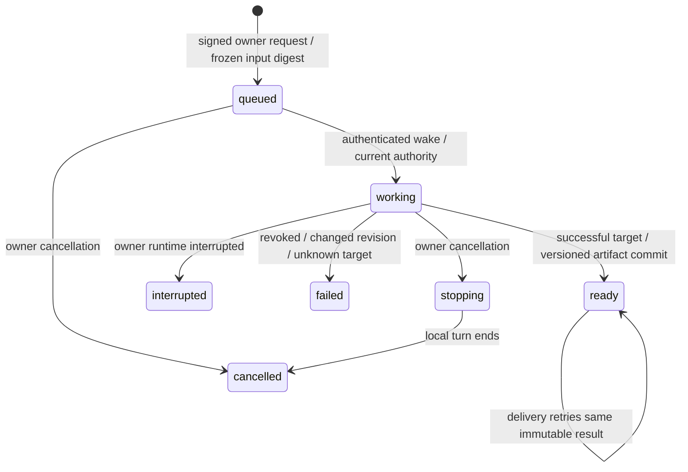

# Workers shared workspaces

The workspace is a projection of existing Topic work and immutable VFS artifacts. It is not a new authority domain. The Workers owner Durable Object continues to own the model loop, scheduler, task rows and run ledger. The existing supplied-context Markdown journey keeps its no-tools behavior.

## Contracts and adapters

`@ixo/common/work` exports strict version-1 schemas and inferred types for `SkillManifest`, `WakeSubscription`, `ExecutionTargetDescriptor`, `ExecutionRequest`, `ExecutionReceipt`, `ActionRequest`, `ConsequenceDecision`, `WorkspaceBinding`, `WorkspaceRevision` and `ArtifactRef`. Digests are bare lowercase SHA-256. Credential names are requirements metadata, never credentials or authority. Unknown schema fields fail validation.

`@ixo/oracle-runtime-workers/work` exports `ExecutionTargetProvider`, `WorkspaceAdapter`, `ConsequenceGuard`, `SandboxExecutionTarget`, `VfsWorkspaceAdapter`, `WakeSubscriptionStore`, `ExecutionReceiptStore`, the research request schema/digest helper, and the research host/tool/report APIs. The root entrypoint also exports these APIs.

- The registry loader validates `metadata.qiforgeManifest` only for the selected authenticated capsule. Ordinary listing/search remains compatible with missing or malformed sidecars. The operator activation pins capsule CID, version, entrypoint digest and publisher DID. Metadata alone cannot activate a skill.
- Schedule occurrences and authenticated Topic research requests persist wake dedupe/cursors in the owner SQLite database and reuse the existing alarm and task run ledger. Current state is reread; duplicate events cannot open a second operation. Revoked subscriptions stay revoked after registration retries.
- The sandbox adapter loads the pinned capsule, checks preparation success, writes selected inputs, hashes the entrypoint before execution, checks fresh authority and abort immediately before submission, and requires the upstream success/zero-exit envelope. Prepared request and complete target descriptor are fenced, including on completed replay. Cancellation closes transport and reports `requested`; it does not confirm a remote process stopped.
- Execution receipts bind the complete prepared request and target. A reset with an incomplete target attempt is persisted as unknown and cannot automatically resubmit it. The owner inspects provider state before starting a separate operation. Ordinary unknown external writes continue through the authenticated reconciliation API; recording evidence pointers does not itself verify provider state.
- VFS artifacts carry resource, file ID, numeric retained version, CID, hash, path, name, media type and byte count. Workspace restoration reads exact retained versions and verifies their bytes. Content-addressed write recovery uses a short paginated `/files?path=/.workspaces` prefix, as the owner-store adapter does for its own root; it exact-matches paths and fails at the scan ceiling. It does not broaden ordinary glob lookups.

## Research lifecycle

`PUT /topic-research/:operationId` starts or recovers the exact operation. `GET` reads it; `POST /topic-research/:operationId/cancel` requires the exact original request. Conflicts return 409, live task limits 429, malformed requests 400. Concurrent identical start/cancel operations recover one binding. Cancellation before creation leaves a tombstone. Input digests hash the recursively key-sorted JSON of the parsed request, preserving array order and the optional `sha256:` prefix in the requested skill digest. `requesterDid` comes only from the owner object; it is not accepted in the request.

Research requires `TOPIC_RESEARCH_ENABLED=true`, a configured `UCAN_STORE_URL`, and `hooks.topicResearch`. The operator resolver must reread canonical Topic revision, Matrix membership and current action authority and return the exact current revision and authorized filesystem resource. It fails closed if absent. Fresh delegation signature, proof-chain revocation, active operation, abort, Topic revision and frozen resource are checked at execution and every VFS mutation, including after awaits and before accepting artifacts. A file already committed when authority changes may remain immutable, but no later mutation, ready result or delivery is accepted.

When `UCAN_STORE_URL` is configured, shell invocation/delegation authentication bypasses positive token-verdict cache reuse and uses the existing fail-closed batched revocation checker with no negative cache. In-flight verification remains coalesced per token and authentication policy. DID verification-key resolution retains the existing one-minute resolver cache. Queued research independently revalidates its stored delegation.

Research builds only `run_topic_research` into the model graph. It excludes ordinary tools, Composio, subagents, memory/history, frontend actions, room context, attachments and private tracing. The bounded host adapter receives selected inputs and approved credential names; raw credential values and private checkpoints do not enter the workspace receipt. Selected raw credential values, including short values, are locally redacted from sandbox result/failure before storing or returning them. This does not detect transformed secrets or fix upstream raw execution logs.

## Authority and isolation limits

The current sandbox is **principal-isolated, persistent**. It is not an execution-isolated filesystem or network boundary. A skill can potentially read prior `/workspace/data` and use selected credentials for network effects. Only operator-reviewed trusted read-only pinned skills may be activated in this slice. `consequence:none` is a host policy assertion, not kernel enforcement. Running untrusted skills or claiming selected-file-only confinement requires a provider with verified execution isolation. The framework does not grant research publishing, determination or settlement authority.

The owner status/result API remains private. Sharing occurs through the Portal's immutable Matrix delivery artifact packet. Reviewers fetch exact VFS versions under their own current UCAN/Matrix authority; execution does not grant inherited authority. Canonical publication still passes through the existing Topic review/publication boundary. VFS OwnerStore SQLite copies contain private checkpoints and never become workspace artifacts.

Composio's installed SDK retries internally and exposes no verified no-retry configuration through its core wrapper. Consequently, ordinary Composio consequential and unknown-effect handlers fail before SDK invocation. Only the verified discovery/schema meta-tools remain callable. A write-ahead claim cannot prevent an SDK's internal duplicate external effects.

## Evidence and open scope

The local conformance lane runs in real workerd with real DO SQLite, signed UCAN crypto and deterministic service transports. It exercises concurrency, cancellation, revocation, recovery, exact versions, target binding, credential redaction and unknown outcomes. Registry/sandbox/VFS compatibility is source-verified. This is not live multi-person Matrix/sandbox/VFS acceptance evidence.

Release still requires configured real services and two separately authorized people exercising the complete journey, including revocation and sandbox replacement. Node parity, recurring research, additional wake sources, execution-isolated computer providers, voice/channel routing and learned-skill publication remain open. No CopilotKit or Intelligence dependency/configuration is introduced.

Operator activation: [Workers example guide](../../apps/qiforge-workers-example/TOPIC-RESEARCH.md). Public developer guidance remains in the separate ixo-docs repository.
