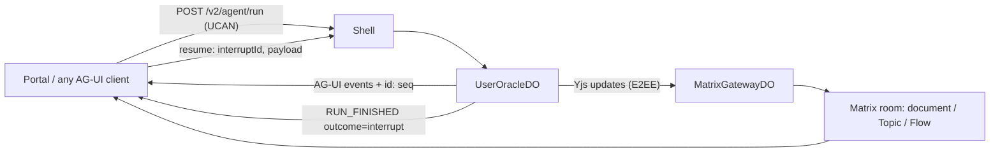

# Qi agent surfaces: AG-UI wire, one surface, E2EE shared state

**Status.** Agreed on 2026-10-05; Phase 0 is done. The Portal side is
recorded in `ixo-portal/docs/adr/0008-qi-agent-surfaces-ag-ui.md`.

**Goal.** Bring the Qi experience up to OpenAI's Dots (always-on agents
announced 2026-09-29):

- each agent has its own computer;
- it can be reached from web, mobile, chat apps and voice;
- named characters;
- it learns from feedback and works in the background;
- Custom Rules (allow / ask / block);
- an Activity view.

We keep what only IXO has:

- Matrix E2EE with Yjs;
- DID identity;
- UCAN authority;
- Topics, Flows and UDID.

**Principle.** Subtract before adding. Most of what Dots offers already
exists here as separate pieces. What is missing is one coherent protocol and
one coherent surface. Capabilities come after that.

## What we build on from OpenDots

[CopilotKit/OpenDots](https://github.com/CopilotKit/OpenDots) is an
MIT-licensed alpha template of Dots.

**Why it is not a foundation.**

- It has a single owner.
- Its threads live in CopilotKit's hosted Intelligence service, which it
  requires.
- It runs TanStack AI, not LangGraph.
- It has no shared state; the client polls REST every 3 s.

**What we take.**

- **The AG-UI protocol** it speaks.
- **Six patterns:**

| OpenDots pattern                                                  | Where it lands here                                                                   |
| ----------------------------------------------------------------- | ------------------------------------------------------------------------------------- |
| Wildcard tool renderer (`useRenderTool('*')`)                     | One tool-name → component registry in the Portal, used by chat and Matrix timelines   |
| Approval receipt keyed by (thread, tool call)                     | Interrupt store: one receipt per (session, interrupt id); a duplicate resume re-joins |
| Revision-checked page edits                                       | Not needed for documents: Yjs merges. Kept for VFS writes                             |
| Abort a run when permissions change mid-run                       | Replacing or revoking a UCAN delegation aborts its live runs (`PERMISSIONS_CHANGED`)  |
| Headless turns into an existing thread                            | Already here: tasks, `AgentWake`, Topic deliverables                                  |
| Voice "split-brain" (a speech model delegates on the same thread) | A LiveKit voice agent with one `ask_oracle` tool on the session, then a call receipt  |

## Where we start

| Dots capability   | Exists here                                               | Gap                                                 |
| ----------------- | --------------------------------------------------------- | --------------------------------------------------- |
| Chat with tool UI | SSE frames, Portal `uiComponents`, Matrix cards           | One standard wire, one renderer registry            |
| Approvals, rules  | UCAN delegations, tool `effect` / `plane`, task approvals | One interrupt primitive; rules as UCAN caveats      |
| Shared workspace  | BlockNote, Flows and Topics as Yjs over Matrix            | Agent writes into **encrypted** rooms               |
| Background work   | DO-alarm tasks, `AgentWake`, Topic deliverables           | Activity view; parallel conversations in the Portal |
| Many surfaces     | Portal, any Matrix client, WhatsApp via IXO Channels      | Voice                                               |
| Own computer      | AI sandbox (`sandbox/*` capability)                       | Live-view tool card; take-over as an interrupt      |
| Characters        | Oracle entities (DID), Pods, marketplace                  | Specialist UX                                       |
| Learning          | Memory engine, skills registry                            | Feedback into memory and skills                     |

**Defects found in review.** Phase 0 fixes the first; Phase 1 removes the
second.

1. **A browser action ran three times.** The stream copied every
   `action_call` frame to the session's sockets, both `isRunning` and
   `done`. On top of that, the call itself emitted its own frame through the
   router, which also landed on the SSE stream as a card that never
   finished. The SDK runs its handler on every `action_call` it receives.
2. **A human approval dies at 15 s.**
   - The runtime caps every browser tool at 15 s (`plugins/portal`).
   - The pending call lives only in memory, so an object reset loses it.
   - The Portal's `ask_user_question` waits 600 s, so the card is still
     open after the server has already given up.

## Design rules

1. **One wire: AG-UI.**
   - The runtime emits AG-UI events natively into the existing run buffer.
     Durable runs, cursor rejoin (`id: <seq>`) and recovery are unchanged.
   - No CopilotKit runtime, React package or hosted Intelligence. Threads
     stay in the user's SQLite and the encrypted owner copy.
   - Custom events are namespaced `ixo.*`.
2. **Frontend tools and approvals are interrupts.**
   - The tool raises a LangGraph `interrupt()`, and the run ends with
     `RUN_FINISHED.outcome = interrupt`.
   - The client answers by starting a new run with
     `resume: [{ interruptId, status, payload }]`.
   - There is no socket, no in-memory pending registry and no timeout
     shorter than the human.
3. **Shared state is Yjs over Matrix**, not `STATE_SNAPSHOT` /
   `STATE_DELTA`. It is durable, multiplayer and auditable, and encrypted
   once Phase 3 lands. Chat links to the document; the document is the
   state.
4. **One renderer registry, two transports.** The same components render a
   tool call in the Portal stream and an oracle event in a Matrix timeline.
5. **Mixed versions.**
   - Every oracle is its own Worker, upgraded on its own schedule.
   - The SDK detects AG-UI support and falls back to the legacy route.
   - Client code that exists only for old runtimes is deleted after the
     fleet has moved.

## Phases

### Phase 0 — Subtract (done)

**Runtime:**

- Turn frames are no longer copied to the sockets. Deleted:
  - the `mirror` input and `MIRRORED_EVENTS` (`src/do/sse-stream.ts`);
  - the mirror wiring in `UserOracleDO`;
  - `SessionEventRouter.emitToTaps`.
- A frontend call goes to the socket only, once.
- A second tab still sees a running turn: the SDK re-joins it through
  `GET /sessions/:id/run`.

**Tests:**

- A workerd test proves an AG-UI action reaches the socket exactly once and
  never the turn stream. It fails on the previous code.
- The harness drills assert one delivery and one browser execution.

**SDK:**

- Deleted two orphan index files that pointed at missing modules.
- Deleted the docs for a `present_files` action that does not exist, and
  the links to missing guides.

**Out of scope here:**

- Portal-side dead surfaces are removed in the Portal (its ADR 0008).
- The Node companion repository is legacy: Qi runs on the Workers runtime.

### Phase 1 — One protocol

**Translator.** `src/do/agui-stream.ts` replaces `runTurnFrames` and writes
into the same run buffer.

| Today                      | AG-UI                                                       |
| -------------------------- | ----------------------------------------------------------- |
| `run` / `done` / `error`   | `RUN_STARTED` / `RUN_FINISHED{outcome}` / `RUN_ERROR{code}` |
| `message`                  | `TEXT_MESSAGE_START/CONTENT/END` (message id = stored id)   |
| `tool_call`                | `TOOL_CALL_START/ARGS/END`, `TOOL_CALL_RESULT`              |
| `reasoning`                | `REASONING_*`                                               |
| sub-agent tools            | `SUBAGENT_STARTED/FINISHED`                                 |
| resumed attempt, BYO notes | `CUSTOM ixo.*`                                              |
| `router.update`            | dropped                                                     |

**Routes.**

- `POST /v2/agent/run`: AG-UI input, where the thread id is the session id;
  `forwardedProps` carries model, attachments and multitask.
- `GET /v2/runs/:runId?after=<seq>`.
- The server dedupes incoming messages by id, because AG-UI clients send the
  whole history with every run.

**Interrupts.** `src/core/frontend-tools.ts` turns client-declared tools into
interrupts. It replaces `plugins/portal`, `plugins/agui` (including the
`call_ag-ui_agent` sub-agent) and `src/realtime/*`. Preconditions, each
proven in a workerd test first:

- the tool-retry `onFailure` rethrows `GraphInterrupt`;
- tool marks gain a `paused` status, and runs a terminal `paused` status;
- sub-agents cannot interrupt their parent, because their own checkpointer
  swallows it — so frontend tools must be main-agent tools;
- `interrupt()` works under `nodejs_compat` AsyncLocalStorage;
- several interrupts in one step are handled.

**Interrupt store.** `src/do/interrupt-store.ts` keeps a receipt per
(session, interrupt id) with `expiresAt`. An expired or abandoned interrupt
is cancelled into the graph state (`updateState(…, asNode: 'tools')`).

**Pending interrupts and new input** (open product decision). AG-UI says a
pending interrupt blocks new input. We propose that a new user message
cancels the pending interrupts instead, as `multitask: interrupt` does today.

**SDK 2.0.**

- `IxoOracleAgent extends AbstractAgent` from `@ag-ui/client`. It sends the
  UCAN headers and keeps the cursor rejoin of `run-stream.ts`.
- Hooks: `useOracleAgent`, `useFrontendTool`, `useInterrupts`.
- Dropped: `socket.io-client`, `eventsource`, `@ixo/oracles-events`,
  `use-ag-action` and `resolve-ui-component`.

**Moved off the socket.** Memory-engine indexing ("last socket closed")
moves to session switch or idle eviction.

**Retire.** After the Portal cuts over, delete the legacy `/messages`
stream, `src/realtime/*` and the deprecated `packages/events`.

**Tests.**

- `test:core`: event order validated against `@ag-ui/core`.
- workerd: interrupt, then object reset, then resume.
- A new `test:e2e:agui` drill with a stock `HttpAgent`: text, server tools,
  a frontend-tool interrupt, a duplicate resume, cursor rejoin, and new
  input while an interrupt is pending.

### Phase 2 — One surface (Portal)

See the Portal ADR:

- one renderer registry;
- one approval card bound to the server interrupt, replacing six approval
  stores and the 600 s promise;
- one artifact canvas;
- one sessions hook;
- one agent per session, which gives parallel conversations
  (Portal ADR 0002).

The Matrix `ixo.flow.work.input.request` protocol maps onto resume. The
gateway turns a `.response` into the resume of the matching interrupt.

### Phase 3 — Encrypted shared state

- **Gateway.** A call that returns a decrypted page of room history (check
  `@ixo/matrix-bot-workers-sdk`). `sendEvent` and decrypted sync already
  exist.
- **Transport.** `@ixo/matrix-crdt` gets a pluggable transport. The editor
  and flows plugins then write Yjs through the gateway's E2EE client in
  batched flushes, within the room send budget.
- **Delete** the crypto-less plugin device (`identity:bot-client`) and
  `editor-mx.ts`.
- **Portal.** New document rooms are created encrypted (behind a flag). The
  existing plaintext history stays plaintext; say so in the UI.
- **Chat link.** Chat receives `CUSTOM ixo.doc.changed` events that link to
  the document.

### Phase 4 — The Dots gaps

- **Custom Rules.**
  - A delegation caveat `nb.rules: [{ match: tool | capability | plugin,
effect: allow | ask | block }]`.
  - Today the runtime ignores caveats (`runtime-context.ts`).
  - A rules middleware runs inside the tool marks: `ask` raises a
    `confirmation` interrupt; `block` returns an error result, and the
    capability gate hides the tool.
  - Rules are signed by the user, revocable and auditable: the advantage
    over a server-side settings page. Wire the `@ixo/ucan` revocation store
    into authentication.
- **Activity view.** `GET /v2/activity` over recent runs, tool marks, task
  runs, pending interrupts and the Matrix action log.
- **Own computer.** Sandbox browser and desktop tools behind `sandbox/*`, a
  live-view tool card, and human take-over as an `input_required`
  interrupt.
- **Voice.** A LiveKit agent (the SDK already ships `useLiveAgent`) speaks.
  It delegates through one `ask_oracle` tool on the same session and writes
  a call receipt into the thread.
- **Characters and specialists.** Oracle entities and Pods. **Learning.**
  Feedback goes into the memory engine and skills; a learned rule is
  proposed back to the user as an interrupt.

## Risks

- **AG-UI churn.** Interrupt support in AG-UI is recent. Pin `@ag-ui/core`,
  and keep it to one translator and one SDK agent.
- **Latency.** Each frontend tool costs one finished run and one new run.
  Mitigations: cache the built agent per session for a short window, and
  move read-only browser "tools" into `context`.
- **Encrypted Yjs throughput** through the gateway's paced outbox, and the
  unchecked history API in the bot SDK.
- **Unanswered interrupts.** An interrupt with no browser present can sit
  forever, so give it an `expiresAt` and auto-cancel.
