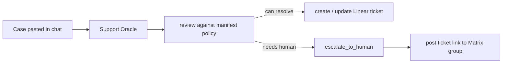

# Building a Customer Support Oracle — Session Prep

A run-of-show + cheat sheet for the live QiForge session. Audience: technical
people who've never built an oracle. Goal: by the end they understand that an
oracle is thin, a plugin is three things, and an agent can make a real judgment
call in front of them.

**Duration:** ~25–30 min + Q&A
**Format:** live demo, two support cases, one real escalation to Matrix

---

## The one big idea

> Don't sell "I built a plugin." Sell **"watch an agent make a judgment call."**

The memorable moment is NOT creating a Linear ticket. It's the oracle looking at
two cases and *choosing differently*:

- **Case A** (password reset) → it resolves, files the ticket, replies. Done.
- **Case B** (angry refund demand) → it files the ticket, then **decides this
  needs a human**, and a message lands in your Matrix group with the link —
  live, on the screen behind you.

Same oracle, same tools, different decision. That's the "oh, it's actually
reasoning" beat. Everything else in this doc serves that one moment.

---

## Why custom tools (not Composio) for this talk

Both work. For a *session*, custom tools win:

| | Custom tools (this talk) | Composio (mention only) |
|---|---|---|
| What the audience sees | Your `create_ticket` / `escalate_to_human` — readable on a slide | Generic `SEARCH_TOOLS` → `MULTI_EXECUTE` meta-tool plumbing |
| On stage | Deterministic, rehearsable | Less predictable, discovery latency |
| Teaches | "How **I** add a capability" | "How to reach any SaaS" |

Deliver the Composio insight as a one-sentence aside, not a detour:

> "If this were an *internal copilot* for a human support agent, I'd skip all
> this and use the bundled Composio plugin — Linear's already in there. I'm
> writing custom tools because this oracle is **client-facing**: I want narrow,
> deterministic, audited actions."

That single line is your "who-talks-to-the-oracle decides the architecture"
point. It makes you sound like you've shipped this, not just built a demo.

---

## Architecture (one slide)



Three things to say over this diagram:

1. The oracle is **thin** — your fork's `main.ts` just lists plugins.
2. The "review / decide" box is **prompt, not code** — the agent reasons over
   the plugin's manifest policy.
3. Escalation is **already free** — every tool gets `ctx.matrix.postToRoom`.

---

## What a plugin actually is (the conceptual core)

Spend most of your time here. A QiForge plugin is **three things**:

### 1. Tools — the hands

```ts
// support-tools.ts (illustrative)
export function buildCreateTicketTool(): PluginTool {
  return tool(
    async (rawArgs, ctx) => {
      const { title, body, priority } = z.object({
        title: z.string(),
        body: z.string(),
        priority: z.enum(['low', 'normal', 'high', 'urgent']),
      }).parse(rawArgs);
      const ticket = await createLinearIssue({ title, body, priority });
      return JSON.stringify({ id: ticket.identifier, url: ticket.url });
    },
    { name: 'create_ticket', description: 'File a support ticket in Linear.', schema: /* … */ },
  );
}

export function buildEscalateTool(roomId: string): PluginTool {
  return tool(
    async (rawArgs, ctx) => {
      const { ticketUrl, reason, summary } = z.object({
        ticketUrl: z.string(),
        reason: z.string(),
        summary: z.string(),
      }).parse(rawArgs);
      // This is the whole escalation. Matrix is already in every tool's context.
      await ctx.matrix.postToRoom(roomId, {
        msgtype: 'm.text',
        body: `🚨 Escalation: ${reason}\n${summary}\nTicket: ${ticketUrl}`,
      });
      return 'Escalated to the human support team.';
    },
    { name: 'escalate_to_human', description: 'Hand a hard case to a human via Matrix.', schema: /* … */ },
  );
}
```

> **The "wait, that's it?" reveal:** `escalate_to_human` is ~5 lines. Matrix is
> already on `ctx` for every tool — no wiring, no client setup. Land this hard.

### 2. The manifest — the judgment, in plain English

The review→handle→escalate branching is **not** an if-statement. It's the agent
reasoning over the manifest's `whenToUse` / `whenNotToUse` plus the oracle's
prompt. You write the escalation policy in English; the LLM routes.

```ts
const manifest: PluginManifest = {
  title: 'Customer Support',
  summary: 'Triage incoming support cases: resolve what you can, file every case in Linear, escalate the hard ones to a human.',
  whenToUse: [
    'A customer describes a problem, complaint, or request — always file a Linear ticket.',
    'You can fully resolve the issue from known information — resolve it, then reply.',
  ],
  whenNotToUse: [
    'Refunds, chargebacks, billing disputes — escalate, never decide these yourself.',
    'Legal threats, account access / security, or a visibly angry / repeat-unhappy customer — escalate.',
    "Anything you're unsure about — escalate. Never guess on a customer's behalf.",
  ],
  category: 'communication',
  visibility: 'always',
};
```

### 3. The config schema — boot-time safety

```ts
const configSchema = z.object({
  LINEAR_API_KEY: z.string().min(1),
  LINEAR_TEAM_ID: z.string().min(1),
  SUPPORT_ESCALATION_ROOM_ID: z.string().min(1),
});
```

A missing/invalid value fails boot with an error naming the `support` plugin —
which is your "break it on purpose" demo (below).

### Wiring it in — the "one line" moment

```ts
// main.ts
const app = await createOracleApp({
  config,
  plugins: [
    new EditorPlugin({ matrixClient }),
    new SupportPlugin(),   // ← "I'm adding one line."
  ],
});
```

---

## Run of show

| Time | Beat | What you do |
|---|---|---|
| 0:00 | Hook | "By the end of this, you'll watch an AI agent decide a case is too hard and pull in a human — live." |
| 2:00 | Oracle is thin | Open `main.ts`, point at the plugin list, add `new SupportPlugin()`. |
| 5:00 | Plugin = 3 things | Tools / manifest policy / config. Walk the snippets above. |
| 12:00 | Escalation reveal | Show `escalate_to_human` is ~5 lines; Matrix is already on `ctx`. |
| 14:00 | **Case A** | Paste the password-reset case. It resolves + files a ticket. |
| 18:00 | **Case B** | Paste the refund case. It files + **escalates** → Matrix room lights up. |
| 23:00 | Break it | Delete `SUPPORT_ESCALATION_ROOM_ID`, boot, watch it fail fast. |
| 25:00 | Composio aside + Q&A | One sentence on the internal-copilot alternative, then questions. |

---

## Demo scripts (copy-paste, rehearse these verbatim)

Have the Matrix escalation room projected next to the chat so Case B's
escalation appears in real time.

### Case A — resolves (no escalation)

> Hi, I can't log into my account. I keep getting "incorrect password" but I'm
> sure it's right. Can you help me reset it? My email is jane@example.com.

**Expected:** agent calls `create_ticket` (priority normal), explains the reset
steps, replies to the customer. **No** `escalate_to_human` call. Point out: it
*chose* not to escalate.

### Case B — escalates (the money shot)

> This is the THIRD time I've contacted you. Your product charged me twice for
> my annual plan — $240 — and nobody has fixed it. I want a full refund today or
> I'm disputing it with my bank and leaving a review.

**Expected:** agent calls `create_ticket` (priority urgent), then
`escalate_to_human` with the ticket URL → message appears in the Matrix room.
Pause. Let the room update land. "It decided that one needed a person."

> Tip: rehearse both at least twice before the talk. LLM phrasing varies; the
> *routing* (resolve vs escalate) should be stable because the policy is in the
> manifest. If Case B ever fails to escalate, your `whenNotToUse` isn't strong
> enough — tighten it, don't add code.

---

## Pre-session checklist

- [ ] **Linear:** API key created, `LINEAR_TEAM_ID` grabbed, a throwaway team/project to file demo tickets into.
- [ ] **Matrix:** an escalation room created; oracle admin user is a member; `SUPPORT_ESCALATION_ROOM_ID` copied.
- [ ] **Env vars set:** `LINEAR_API_KEY`, `LINEAR_TEAM_ID`, `SUPPORT_ESCALATION_ROOM_ID`, plus the example's existing `MATRIX_BASE_URL`, `MATRIX_ORACLE_ADMIN_USER_ID`, `MATRIX_ORACLE_ADMIN_ACCESS_TOKEN`, `ORACLE_ENTITY_DID`, and an LLM key.
- [ ] **Dry run:** boot the oracle, run Case A and Case B end-to-end, confirm a ticket appears in Linear and a message in Matrix.
- [ ] **Screen layout:** chat + Matrix room side by side, font large enough for the back row.
- [ ] **Fallback ready** (see below).

---

## Anticipated questions (have answers ready)

- **"How does it decide what's 'hard'?"** It's the manifest policy + the system
  prompt — plain-English rules, not code. Show `whenNotToUse`. You tune behavior
  by editing English, then re-running the case.
- **"What if escalation should route to different teams?"** Today: one room id
  in config. Productionizing: pass a `severity` or `team` arg to
  `escalate_to_human` and map it to room ids. Good audience discussion prompt.
- **"Could a customer's case ever trigger something dangerous?"** Tools are
  narrow and explicit — the agent can only do what you gave it (`create_ticket`,
  `update_ticket`, `escalate`). That's the whole argument for custom tools over
  generic SaaS access on a client-facing oracle.
- **"How does a case get in without a human pasting it?"** Out of scope for this
  demo (we use chat), but a plugin can expose an HTTP webhook via
  `getNestModules()` + `getAuthExcludedRoutes()` — the Weather plugin's
  `/weather/now` is the template. One-slide "next step."
- **"Why not just Composio for everything?"** Internal copilot → yes. Client-
  facing → no: you want determinism, a small audited action surface, and no
  per-turn tool discovery in front of a customer.

---

## If the live demo fails (fallback)

- Keep a **recorded screen capture** of a successful Case A + Case B run. If the
  network/LLM misbehaves, narrate over the recording — the teaching points are
  identical.
- Keep screenshots of (a) a filed Linear ticket and (b) the Matrix escalation
  message as static backups.
- If only escalation flakes, you can still make the point from the code: "here's
  the five lines that fire; here's the policy that triggers them."

---

## The three soundbites to land

1. **"An oracle is thin — I added one line to a list of plugins."**
2. **"A plugin is three things: tools, a policy in plain English, and config."**
3. **"Escalation is five lines, because Matrix is already in every tool's hands."**

If the audience leaves remembering those three, the session worked.
