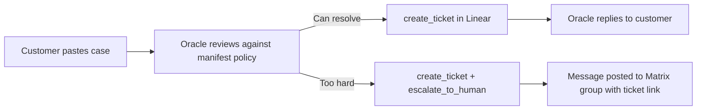

# Building a Customer Support Oracle on QiForge

A team reference for the live session. Read this before the call.

---

## The one big idea

An oracle is not an AI chatbot bolted onto a support queue. It is a **bounded agent** — it knows exactly what it can do, what it cannot touch, and when to call a human. The whole architecture follows from that constraint.

By the end of this session you will have built an oracle that:

- Receives a customer case
- Reviews it against a policy you wrote in plain English
- Files a Linear ticket automatically
- Escalates to a Matrix group if the case is too hard — with the ticket link, live

---

## 1. How QiForge works (the 60-second version)

A QiForge oracle is a thin app. It has an identity, a prompt, and a list of plugins. The runtime does everything else.

```
main.ts
  └── createOracleApp({
        config,          ← who the oracle is + how it behaves
        plugins: [       ← what it can do
          new EditorPlugin(),
          new SupportPlugin(),   ← this is what we are building
        ],
      })
```

A **plugin** is three things:

| Thing | What it is | Where it lives |
|---|---|---|
| Tools | The actions the agent can take | `support-tools.ts` |
| Manifest | The policy — when to act, when not to, when to escalate | inside the plugin class |
| Config schema | Env vars the plugin needs, validated at boot | `z.object({ LINEAR_API_KEY, ... })` |

That is the full mental model. Everything in this session is a variation of those three things.

---

## 2. The support flow



Two paths, same starting point. The routing happens inside the agent's reasoning — not in an if-statement in code. You write the escalation policy in the manifest; the agent decides.

---

## 3. The three tools

### `create_ticket`
Files a new issue in Linear. Takes a title, description, and priority. Returns the ticket ID and URL.

Used on every case — whether it resolves or escalates, a ticket always gets filed.

### `update_ticket`
Updates an existing ticket status or adds a comment. Used when a case continues across turns.

### `escalate_to_human`
Posts a message to a Matrix room with the ticket link and reason. This is the whole implementation:

```ts
await ctx.matrix.postToRoom(roomId, {
  msgtype: 'm.text',
  body: `🚨 Escalation: ${reason}\n${summary}\nTicket: ${ticketUrl}`,
});
```

`ctx.matrix.postToRoom` is already on every tool's context — no wiring, no Matrix client setup. That is the "wait, that's it?" moment of the session.

---

## 4. The manifest policy

The routing logic — handle vs escalate — is written here, in plain English, not in code:

```ts
whenNotToUse: [
  'Refunds, chargebacks, billing disputes — escalate, never decide these yourself.',
  'Legal threats or account security issues — escalate.',
  'Visibly angry or repeat-unhappy customers — escalate.',
  "Anything you are unsure about — escalate. Never guess on a customer's behalf.",
]
```

This is intentional. The agent reasons over these rules. You tune the oracle's judgment by editing English, then re-running the case — not by changing code.

---

## 5. Config the plugin needs

Three env vars, validated at boot:

| Var | What it is |
|---|---|
| `LINEAR_API_KEY` | Linear API token |
| `LINEAR_TEAM_ID` | The Linear team to file tickets into |
| `SUPPORT_ESCALATION_ROOM_ID` | Matrix room ID for escalations |

If any of these are missing or wrong, the oracle **refuses to boot** with a clear error naming the `support` plugin. This is by design — fail fast, fail loud.

---

## 6. Why custom tools (not Composio)

QiForge ships a Composio plugin that already includes Linear. We are not using it here, and the reason is architectural:

**Composio is for an internal copilot.** A human support agent using the oracle to manage tickets — the agent discovers tools each turn, the human is in the loop. Latency and tool-discovery overhead are fine.

**Custom tools are for a client-facing oracle.** A customer talks to the oracle directly. You want narrow, deterministic, audited actions — not a general-purpose SaaS gateway. The trust boundary is different, so the implementation is different.

Same goal. Different architecture. The choice follows from who is on the other end of the conversation.

---

## 7. The two demo cases

### Case A — resolves
> Hi, I cannot log into my account. I keep getting "incorrect password" but I am sure it is right. Can you help me reset it? My email is jane@example.com.

**Expected:** oracle calls `create_ticket` (priority: normal), explains the reset steps, replies to the customer. No escalation.

### Case B — escalates
> This is the third time I have contacted you. Your product charged me twice — £240 — and nobody has fixed it. I want a full refund today or I am disputing it with my bank.

**Expected:** oracle calls `create_ticket` (priority: urgent), then `escalate_to_human` → message appears in the Matrix room with the ticket link.

The gap between those two outcomes is the manifest policy. Nothing else changed.

---

## 8. File structure

```
apps/support-oracle/
└── src/
    ├── main.ts                      ← createOracleApp wiring
    ├── config.ts                    ← oracle identity + prompt
    └── plugins/
        └── support/
            ├── support.plugin.ts    ← manifest, config schema, getTools()
            ├── support-tools.ts     ← create_ticket, update_ticket, escalate_to_human
            ├── linear-client.ts     ← thin Linear API wrapper
            └── index.ts             ← re-export
```

Five files. The reference is `apps/qiforge-example/src/plugins/weather/` — the support plugin follows the same structure.

---

## 9. Before the session

- [ ] Linear API key created, `LINEAR_TEAM_ID` copied from the team settings URL
- [ ] A throwaway Linear project to file demo tickets into (so the real board stays clean)
- [ ] A Matrix room created for escalations; oracle admin user is a member
- [ ] `SUPPORT_ESCALATION_ROOM_ID` copied from the room settings
- [ ] Screen layout: chat window + Matrix room side by side, font size legible from the back row

---

## 10. Key things to understand coming in

**An oracle's judgment comes from its manifest, not its code.**
The tools are the hands. The manifest is the brain. Changing behavior means editing the manifest policy, not adding conditional logic to tools.

**Escalation is not a fallback. It is a design decision.**
A well-designed support oracle escalates confidently and early on anything ambiguous. Silence or guessing on a customer case is worse than routing to a human.

**The trust boundary is explicit.**
The oracle can file and update tickets. It cannot issue refunds, access account security settings, or make financial decisions. Those boundaries are enforced by what tools exist — not by prompting the agent to "be careful."

**The plugin fails loudly if the config is wrong.**
Missing `SUPPORT_ESCALATION_ROOM_ID` at boot → error, not a silent degraded state. Design your oracles to fail fast.
