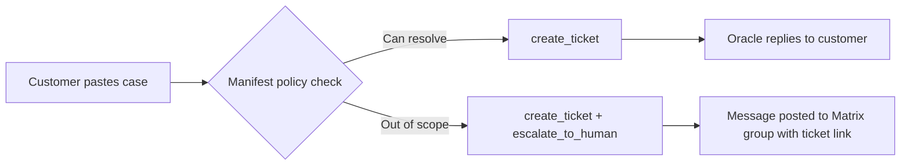
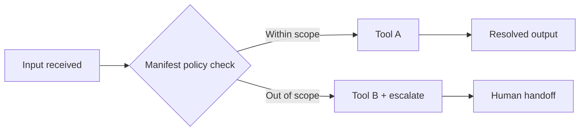

# Unblock 11: Building Agentic Oracles with QiForge

## Introduction

You have spent the last ten Unblocks building the conceptual foundations: digital identity, systems thinking, privacy and trust, claims and credentials, AI agent principles, cognitive digital twins, coordination state, claim registries, semantic graph modelling, and — in Unblock 10 — the dMRV loop that turns a raw field event into a verified state on the ledger.

Unblock 11 is where you build the system that runs those evaluations.

In Unblock 10 you traced the Agentic Oracle as a step in the verification pipeline. You understood it as a concept. In this Unblock you build one.

QiForge is IXO's framework for constructing Agentic Oracles. An oracle built on QiForge is not a general-purpose AI assistant. It is a **bounded agent** — it has a declared identity, an explicit set of capabilities, and a written policy governing every decision it makes. The trust model you studied in Unblocks 3 and 5 is enforced at the code level: the oracle can only do what you gave it, it fails loudly when configuration is wrong, and it escalates rather than guesses when a case exceeds its authority.

This Unblock uses a **Customer Support Oracle** as its worked example — an agent that receives a support case, reviews it against a policy you define, files a Linear ticket automatically, and escalates hard cases to a human via a Matrix group message.

By the end of this Unblock you will be able to show:

- the difference between an oracle, a plugin, a tool, a manifest, and a config schema
- how an oracle's judgment comes from its manifest policy — not from code
- where the trust boundary sits and how QiForge enforces it structurally
- why a bounded oracle produces more auditable outputs than a general-purpose AI

---

## 1. What an Agentic Oracle is

| Term | Plain-language | Technical |
|---|---|---|
| **Agentic Oracle** | A specialised agent that makes bounded, accountable decisions on behalf of a system. | A QiForge application with a declared identity, a plugin set, and a system prompt. Runs LangGraph; state is persisted per user via a Matrix checkpointer. |
| **Plugin** | A self-contained capability the oracle can use. | An `OraclePlugin` subclass that contributes tools, a manifest policy, and a config schema. |
| **Tool** | A single action the oracle can take. | A typed function with a Zod input schema and a handler. The LLM calls it during a turn. |
| **Manifest** | The oracle's written policy — when to act, when not to, when to escalate. | A `PluginManifest` object compiled into the agent's system prompt at boot. The LLM reasons over it. |
| **Config schema** | The env vars a plugin requires, declared and validated. | A Zod object merged into the runtime schema at boot. Missing values fail the boot with a named error. |
| **Trust boundary** | The line between what the oracle decides autonomously and what a human must handle. | Enforced structurally: the oracle can only invoke tools that exist. Judgment about *which* tool comes from the manifest. |

> **The core lesson.** An Agentic Oracle is not an AI that reasons freely and acts on its conclusions. Its value comes from its bounds being explicit, auditable, and honest — not from the model being powerful.

---

## 2. The QiForge architecture

A QiForge oracle is a thin application. It has an identity, a prompt, and a list of plugins. The framework does everything else.

```
main.ts
  └── createOracleApp({
        config,          ← who the oracle is and how it behaves
        plugins: [       ← what it can do
          new LinearPlugin(),    ← connects the oracle to Linear
          new SupportPlugin(),   ← your policy, tools, and escalation logic
        ],
      })
```

**A plugin is three things — learn this as one unit:**

| Part | What it is |
|---|---|
| **Tools** | The actions the oracle can take. Called by the agent during a turn. |
| **Manifest** | The policy. When to act, when not to, when to escalate. Compiled into the system prompt. |
| **Config schema** | Env vars the plugin owns, validated at boot. A missing var = boot failure with a clear error. |

That is the full model. An oracle with an identity, one plugin, and three tools is a complete, deployable system.

---

## 3. Roles in an oracle-mediated workflow

Different roles exist because different kinds of judgment are needed. The system degrades when they are blurred together — the same principle you applied to dMRV evaluator roles in Unblock 10.

| Role | What it does | Support oracle example |
|---|---|---|
| **Data source** | Submits unverified input. | A customer typing a support message. |
| **Oracle** | Reviews input against its manifest policy and takes a bounded action. | The Support Oracle triaging the case. |
| **Tool** | A single, typed, auditable action the oracle executes. | `create_ticket` — files one issue in Linear with a declared schema. |
| **Manifest policy** | The written rules governing when the oracle acts autonomously and when it defers. | "Escalate all refund and billing disputes — never decide these yourself." |
| **Human reviewer** | Handles cases the policy routes out of automated resolution. | A support manager receiving the escalation in a Matrix room. |
| **Downstream system** | Acts on the oracle's verified output. | Linear (tickets) or Matrix (escalations). |

> **Blurring these roles produces predictable failures.** An oracle that guesses on a refund case does not have a trust boundary — it has a liability. An oracle that silently swallows an error does not have auditability — it has hidden state.

---

## 4. Worked example: the Customer Support Oracle

Trace one support case from submission to resolution or escalation:

**1. The case arrives.**
A customer pastes a support message into the chat. The oracle receives it as a turn in the agent.

**2. The manifest review.**
The agent reads the case against the manifest's policy. This is not a code branch — it is the LLM reasoning over written rules. The policy is the design.

**3. The ticket is filed.**
For every case — whether it resolves or escalates — the oracle calls `create_ticket`. Nothing is lost.

**4. The routing decision.**
If the case is a password reset or a clearly answerable question, the oracle resolves it and replies.
If the case involves a refund, billing dispute, legal language, or a visibly frustrated repeat customer, the manifest policy routes it to `escalate_to_human`.

**5. The escalation fires.**
`escalate_to_human` posts a message to the team's Matrix room with the reason, a summary, and the Linear ticket link. The oracle has handed off — it does not continue trying to resolve the case.

**6. The human takes over.**
A support manager picks up the Linear ticket from the escalation message. The oracle's work is done and auditable: the ticket exists, the reason is recorded, the Matrix message is timestamped.



Two paths. Same oracle. The routing is the manifest.

---

## 5. The three tools

**`create_ticket`**
Files a new issue in Linear via the Linear plugin. Takes a title, description, and priority. Returns the ticket identifier and URL. Called on every case — a ticket is always created before any other action.

**`update_ticket`**
Updates an existing ticket status or appends a comment. Used when a case continues across multiple turns.

**`escalate_to_human`**
Posts a structured message to a Matrix room. The full escalation logic is five lines — because `ctx.matrix.postToRoom` is already available on every tool's context, provided by the framework. No Matrix client setup. No credentials in the plugin code.

> **The reveal moment.** The escalation is not infrastructure you build. Matrix is already in every tool's hands. You write the policy that decides when to call it.

---

## 6. The manifest policy

The routing logic — resolve vs escalate — is written here, in plain English, not in an if-statement:

```
whenNotToUse:
  - Refunds, chargebacks, billing disputes — escalate, never decide these yourself.
  - Legal threats or account security issues — escalate.
  - Visibly angry or repeat-unhappy customers — escalate.
  - Anything you are unsure about — escalate. Never guess on a customer's behalf.
```

The agent reasons over these rules. You tune the oracle's judgment by editing this policy and re-running the case — not by changing code.

> **This is intentional.** Putting judgment in the manifest keeps the tools dumb and auditable. A tool that contains routing logic is harder to audit, harder to update, and harder to explain to a funder or regulator.

---

## 7. The config schema

Three env vars, validated at boot:

| Var | What it is |
|---|---|
| `LINEAR_API_KEY` | Linear API token (provided by the LinearPlugin) |
| `LINEAR_TEAM_ID` | The Linear team to file tickets into |
| `SUPPORT_ESCALATION_ROOM_ID` | Matrix room ID for escalations |

If any of these are missing or wrong, the oracle **refuses to boot** with a clear error naming the `support` plugin. This is by design — fail fast, fail loud, never silently degrade.

---

## 8. Required readings

**QiForge — read first**

- Oracle overview — what `createOracleApp` provides and what you are responsible for: https://docs.ixo.world/build-an-oracle
- The plugin API — tools, manifest, config schema, Nest modules: https://docs.ixo.world/build-an-oracle/plugin-api
- The Weather plugin walkthrough — the reference implementation. Read this before writing your own: `apps/qiforge-example/WEATHER-PLUGIN.md`

**Agentic Oracles in the IXO stack**

- Agentic Oracles — the design pattern and accountability model: https://docs.ixo.world/core-concepts#agentic-oracle
- The claim evaluation protocol — the same six-step pipeline your Support Oracle runs, applied to impact measurement: https://docs.ixo.world/articles/claim-evaluation-protocol

**Go deeper (optional)**

- LangGraph concepts — how QiForge compiles each oracle turn as a graph: https://langchain-ai.github.io/langgraphjs/concepts

---

## 9. Learning outcomes

By the end of this Unblock you will be able to:

**Understand**
- Articulate the difference between an oracle, a plugin, a tool, a manifest, and a config schema — in plain language and in code.
- Explain why an oracle's judgment comes from its manifest policy, not from conditional logic in its tools.
- Describe the trust boundary in an oracle design and how QiForge enforces it structurally.

**Analyse**
- Read a plugin manifest and predict the routing decisions the oracle will make for a given input.
- Identify where a system has blurred evaluator roles — and name the failure mode that results.
- Evaluate whether a given integration pattern is appropriate for a specific trust model.

**Apply**
- Wire a plugin into a fork's `main.ts` using `createOracleApp`.
- Write a manifest policy that produces deterministic routing between at least two outcome paths.
- Confirm that a missing config var fails the boot loudly and names the plugin.
- *(Mastery track)* Add a `getRequestTools` hook that returns a tool conditionally based on live session context.

**Translate**
- Explain to a non-technical stakeholder why the oracle escalates certain cases, using the manifest policy as evidence — not a description of the model's capabilities.
- Explain to a funder why a bounded oracle produces more auditable outputs than a general-purpose AI assistant.

---

## 10. Weekly work plan

| Day | Format | What you do |
|---|---|---|
| **Monday** | Live (1 hr) | Oracle architecture walkthrough. In-session task: produce a Mermaid diagram of the Support Oracle flow, marking tools, the manifest decision point, and both outcome paths. |
| **Tuesday** | Async (4 hrs) | Read the Weather plugin walkthrough. Design your own oracle for your design partner programme: name three candidate tools and draft a manifest policy. Produce a Mermaid diagram of your oracle's decision flow. |
| **Wednesday** | Async (4 hrs) | Scaffold your plugin: plugin class, tools file, config schema. Wire into a fork of `apps/qiforge-example`. Boot the oracle. Intentionally omit one config var — verify the error names your plugin. |
| **Thursday** | Async/pair (6 hrs) | Run two cases through your oracle that produce different routing outcomes. Write your partner overview and engineering reflection. Mastery track: add a `getRequestTools` hook. |
| **Friday** | Live (1.5 hrs) | Demo and peer review. Present your two Mermaid diagrams. Run a live case through your oracle. Evaluate against the rubric to secure the credential. |

---

## 11. Assessment standard

| Result | Standard |
|---|---|
| **Pass** | Produces a Mermaid diagram of the Support Oracle flow with tools, manifest decision point, and both paths clearly marked. Produces a second diagram for their design partner oracle. Wires a plugin into `main.ts`. Demonstrates a missing config var failing at boot. Writes an accurate, non-speculative partner overview. |
| **Strong (Mastery)** | Meets Pass, and additionally: implements a `getRequestTools` hook using live session context. Partner overview ties manifest policy entries directly to trust-boundary risks. Reflection names at least one failure mode from blurred evaluator roles. |
| **Try Again** | Puts routing logic in tool handlers rather than the manifest. Cannot demonstrate two different routing outcomes. Cannot demonstrate a config validation failure. Partner overview uses speculative language about what the agent "knows" or "understands." |

---

## 12. Required outputs

### Output 1: Oracle flow diagrams

**In-session (Monday):** Map the Customer Support Oracle — from case received to resolution or escalation. Mark: each tool, the manifest decision point, the trust boundary, and both outcome paths. Escalation must show the Matrix message as a distinct step.

**Take-home (due Friday):** A second Mermaid diagram for your design partner oracle. Show: what triggers the oracle, what the manifest checks, which tools fire on each path, where the trust boundary sits, and what the oracle produces. Name your design partner's outcome unit as the end-state.

Starter pattern:



### Output 2: Working plugin *(mastery track)*

A working QiForge plugin for your design partner domain:

- At least two tools with declared input schemas
- A manifest with at least four `whenToUse` and three `whenNotToUse` entries
- A config schema with at least two required env vars
- Wired into a fork of `apps/qiforge-example` and confirmed to boot
- Two different routing outcomes from two different inputs
- Missing config var produces a boot error naming the plugin

*Extension:* add a `getRequestTools` hook returning a third tool conditionally based on session context.

### Output 3: Partner oracle overview

A one-page Markdown document for a non-technical ecosystem manager or funder:

- What the oracle is authorised to do — and what it is not
- Which parameters trigger automatic resolution versus human escalation, written as plain policy
- In non-speculative terms: why the oracle's outputs are trustworthy — not because an AI decided, but because the policy is written down, the tools are bounded, and every action is logged

### Output 4: Engineering reflection

Up to 250 words. Where does the trust boundary in your oracle design actually sit? What can the oracle determine with full confidence, and what still depends on the quality of the manifest policy you wrote and the human judgment behind the escalation path? What goes wrong when an oracle is given too broad a tool surface — or when its manifest policy is too vague?

---

## 13. Where this leads

A verified state produced by a dMRV loop is only valuable if something can act on it. An Agentic Oracle is only valuable if its actions are trusted. These are the same problem: both require a declared policy, a bounded action surface, and an auditable trail.

In the coming Unblocks you will wire verified oracle outputs into automated milestone delivery and credential-linked payouts. The Support Oracle is a simple domain — but the architecture is identical to the impact oracle in Unblock 10. An input arrives, a policy is consulted, a bounded action fires, and the result is recorded. Whether that result is a support ticket or a Verified Emission Reduction credential, the pattern is the same.

Build honest oracles now. The coordination layer that depends on them is what you build next.
