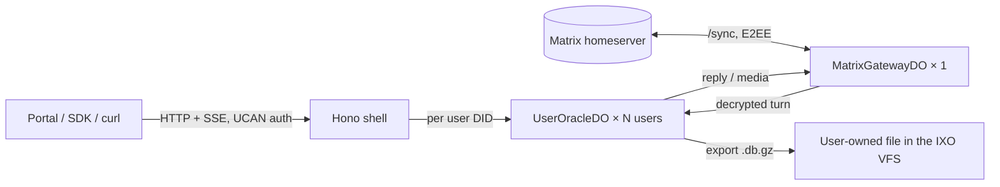

# @ixo/oracle-runtime-workers

Run a QiForge oracle on **Cloudflare Workers** — no server, no disk, no Redis.
The same plugin API, wire protocol and UCAN auth as `@ixo/oracle-runtime`,
re-hosted on Durable Objects.

```ts
// src/index.ts of your oracle Worker
import { createOracleWorker, WeatherPlugin } from '@ixo/oracle-runtime-workers';

const oracle = createOracleWorker({
  config: { name: 'My Oracle', org: 'IXO', description: '…' },
  plugins: [new WeatherPlugin()],
  // Optional, as on Node: retune a loaded plugin's manifest without forking it.
  manifestOverrides: { weather: { visibility: 'always' } },
});

export const { UserOracleDO, MatrixGatewayDO } = oracle;
export default oracle; // { fetch, scheduled }
```

Deploying is `wrangler deploy` with two Durable Object bindings and a
handful of secrets. [`apps/qiforge-workers-example`](../../apps/qiforge-workers-example)
is the complete, runnable reference: the single-script `wrangler.jsonc` for
local development, the two-script devnet configs, `.dev.vars.example`, and
the test suites.

## How it works

One Worker deployment = one oracle.



- **`UserOracleDO`** — one per user DID. The user's SQLite database
  (checkpoints, sessions, transcript) lives in Durable Object storage behind
  wa-sqlite; the object runs the agent turn and streams SSE itself.
- **`MatrixGatewayDO`** — one per oracle. A subclass of `MatrixBotDO` from
  [`@ixo/matrix-bot-workers-sdk`](https://www.npmjs.com/package/@ixo/matrix-bot-workers-sdk),
  which owns the bot identity, E2EE, the sync loop, paced durable sends,
  catch-up after a restart and device rotation. The subclass adds the
  oracle parts: room messages → user turns, room ↔ user routing, snapshot
  media, the account-room secrets key, the plugins' second device.
- **The user owns the file.** The object holds a working copy; the durable
  file is `/.oracles/<oracleDid>/state.db.gz` in the user's IXO VFS,
  exported on a debounced alarm and re-imported on a cold boot. The oracle
  reaches it with the one delegation the user deposits for it
  (`POST /delegation`), which must carry `ixo:filesystem/.oracles` next to
  the plugin grants — see [architecture](docs/architecture.md#self-sovereign-storage).
- **Two scripts in production.** The gateway runs in its own Worker script
  so its memory footprint never competes with user objects; the scripts
  talk over cross-script Durable Object bindings.

## Deploy in five steps

1. Copy the example's `wrangler.gateway.<env>.jsonc` and
   `wrangler.<env>.jsonc`; set the names, `ORACLE_DID`, `ORACLE_ENTITY_DID`,
   `MATRIX_*` vars and the plugin URLs.
2. Deploy the gateway script, then its secrets
   (`MATRIX_ORACLE_ADMIN_PASSWORD`, `MATRIX_RECOVERY_PHRASE`,
   `MATRIX_VALUE_PIN`).
3. Deploy the oracle script with its secrets (`OPEN_ROUTER_API_KEY`, the
   same Matrix secrets, and `ORACLE_SIGNING_MNEMONIC` unless the account
   room already holds the mnemonic the Node runtime or the CLI provisioned —
   then the runtime reads it from there).
4. `POST /matrix/start`, then `GET /matrix/status` until `running` and
   `cryptoReady` are true.
5. Run the feature matrix against it (see [testing](docs/testing.md)).

Every variable, binding and migration is explained in
[configuration](docs/configuration.md).

## Operate

| Route                                                 | Purpose                                               |
| ----------------------------------------------------- | ----------------------------------------------------- |
| `GET /health`, `GET /health/matrix`                   | Liveness; the gateway's health (503 when not running) |
| `GET /matrix/status`, `POST /matrix/start`            | Gateway status and start                              |
| `POST/GET /sessions`, `POST/GET /messages/:id`        | The chat API                                          |
| `/delegation`, `/models`, `/socket.io/`, `/byo-llm/*` | Delegation, models, realtime channel, BYO LLM         |
| `/debug/*` (with `ORACLE_DEBUG_ROUTES=true`)          | Storage, tasks, sockets, outbox, gateway restart      |

The status fields, the runbook and the behaviour of both objects over their
lifetime are in [operations](docs/operations.md).

## Documentation

| Page                                   | What it covers                                                                           |
| -------------------------------------- | ---------------------------------------------------------------------------------------- |
| [architecture](docs/architecture.md)   | The objects, the gateway split, self-sovereign storage, cost model, the rules of workerd |
| [node-parity](docs/node-parity.md)     | What is identical to the Node runtime, what is ported differently, what is not ported    |
| [configuration](docs/configuration.md) | Wrangler config, migrations, every env var, first-time setup, the bot's send rate        |
| [operations](docs/operations.md)       | Routes, status fields, gateway and user-object lifecycle, the ChatGPT proxy, the runbook |
| [testing](docs/testing.md)             | Unit, harness e2e, the devnet feature matrix, stress                                     |
| [load-tests](docs/load-tests.md)       | Measurements and the findings that shaped the gateway                                    |

## Status (September 2026)

- Deployed on devnet as `mike-devnet-oracle` + `mike-devnet-oracle-gateway`
  and exercised by the full feature matrix and the 18-user stress run after
  the move to `@ixo/matrix-bot-workers-sdk`; 0.1.3 is the first release fit
  for production (0.1.0–0.1.2 could send plaintext into an encrypted room
  after a lazy-member sync delta, and queued session markers behind
  background replays — both fixed in 0.1.3 and re-measured, see
  [load-tests](docs/load-tests.md#session-creation-is-the-one-funnel));
  0.3.1 brings the streamed media calls the legacy-copy import and the
  attachments now use (a 50 MB Node-era checkpoint no longer resets the
  user object's isolate) and the crypto-snapshot flush before every keys
  upload.
- Open: the memory engine's recall ranking on accounts with a long history;
  the storage cost of task-holding users at scale (R2 page tier, see
  [architecture](docs/architecture.md#storage-cost-planning)).
- Not ported on purpose: the Slack transport, the commerce lane and Matrix
  group chats — see [node-parity](docs/node-parity.md#not-ported).
