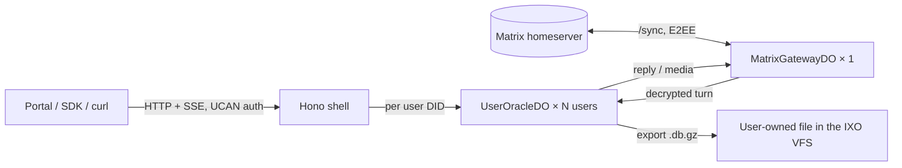

# Architecture

One Worker deployment = one oracle. Two Durable Object classes do all the
work; the Worker itself is a thin Hono shell that authenticates a request and
forwards it to the right object.

## The objects

### `UserOracleDO` — one per user DID

Holds the user's SQLite database (LangGraph checkpoints, sessions, the full
transcript) in Durable Object storage, opened through wa-sqlite (WASM). The
file is bounded by DO storage (10 GB), not by isolate memory: SQLite sees
4 KB pages, storage packs them into 64 KB chunk rows (16 pages per row)
because DO SQLite bills per row regardless of size — a checkpointer turn
writes about 5 chunk rows instead of 30–80 page rows.

The object runs the agent turn (LangChain `createAgent`) and streams SSE
straight from the object. It is single-threaded, which replaces the Node
runtime's per-user ref-counting, busy-timeouts and cron locks outright.

### `MatrixGatewayDO` — one per oracle

A subclass of `MatrixBotDO` from
[`@ixo/matrix-bot-workers-sdk`](https://www.npmjs.com/package/@ixo/matrix-bot-workers-sdk)
(`src/matrix/gateway-do.ts`). The SDK owns everything generic about running
an E2EE Matrix bot on Workers:

- password login and the device identity (the same device survives eviction
  and restart; a device rotation is the recovery path);
- E2EE through `@matrix-org/matrix-sdk-crypto-wasm`, with the crypto store
  persisted into DO storage;
- its own `/sync` loop under an alarm-driven keep-alive (no initial sync,
  ever: the first start of an account bootstraps from `/joined_rooms`, later
  starts resume from the persisted sync token);
- paced, durable sends: one FIFO per room, a token bucket that mirrors the
  homeserver's per-sender limit, `interactive` before `background`, an
  outbox that survives restarts, poison-row eviction after three hung
  attempts;
- resumable catch-up of rooms that had events while the bot was down;
- invite handling, room upgrades, hot-room memory bounds, the idle recycle
  and the one-time-key conflict detector.

The subclass adds only what is specific to the oracle:

- inbound room messages → user-object turns (`src/matrix/ingest.ts` debounces
  per session for 500 ms and builds one turn per burst, with attachments and
  the thread or quote-reply chain resolved);
- a durable turn inbox (`src/matrix/inbox-store.ts`): every accepted room
  message is written to the gateway's SQLite before anything waits on the
  network and deleted when its turn has ended, so a gateway reset during the
  LLM turn re-dispatches the message on the next start instead of losing the
  reply; replies carry a transaction id derived from the event id, and the
  user object's turn ledger (`src/do/matrix-turn-ledger.ts`) guarantees a
  turn never runs twice for one event;
- user ↔ oracle room resolution from DIDs (alias on the user's own
  homeserver, see [operations](operations.md#rooms-and-aliases));
- dedicated `[Task] <title>` rooms;
- user SQLite snapshots as encrypted room media (`m.ixo.media_upload` +
  `m.ixo.media_state`, wire-identical to the Node runtime — read-only legacy
  today);
- the oracle's P-256 secrets key from its account room;
- a second, crypto-less password device for plugins that drive a raw
  matrix-js-sdk client (editor, flows).

### Two Worker scripts: the gateway split

Every Durable Object of one script shares that script's isolate on a given
server, and an isolate has a 128 MB heap. With the gateway (matrix-js-sdk,
the crypto WASM, room state) in the same heap as every user object, a user's
flush or import spike could reset the bot and the bot's footprint counted
against the user objects' budget. The runtime therefore ships as two
scripts:

| Script                     | Entry                                                         | Holds                                   | Bundle (devnet)       |
| -------------------------- | ------------------------------------------------------------- | --------------------------------------- | --------------------- |
| oracle (`<name>`)          | `createOracleWorker` (`src/index.ts`)                         | Hono shell + `UserOracleDO` × N         | 24 MiB / 5.4 MiB gz   |
| gateway (`<name>-gateway`) | `createGatewayWorker` (`@ixo/oracle-runtime-workers/gateway`) | `MatrixGatewayDO` × 1 + keep-alive cron | 10.6 MiB / 2.7 MiB gz |

The gateway entry imports nothing from `core/` or `plugins/`, so its bundle
carries no LangChain, MCP or editor code. The two scripts talk over
cross-script Durable Object bindings (`script_name`): the oracle's
`MATRIX_GATEWAY` binding points at the gateway script's class, the gateway's
`USER_ORACLE` binding points back. RPC is identical either way, so nothing
inside the objects depends on the layout; the single-script layout
(`wrangler.jsonc`, used by the local harness) stays supported and
`createOracleWorker` keeps exporting `MatrixGatewayDO` for it. How to
migrate a deployment between layouts is in
[configuration](configuration.md#two-scripts-and-migrations).

## Self-sovereign storage

The Durable Object only ever holds a **working copy**. The durable file the
user owns is `/.oracles/<oracleDid>/state.db.gz` in the user's IXO VFS — the
system of record.

- **One delegation, no other grant channel.** Every VFS request is a
  single-use invocation minted from the delegation the user deposited for
  this oracle (`POST /delegation`, the `ucan_delegation` room state — the
  same delegation Matrix turns and every plugin mint from). It must carry
  `{ can: '*', with: 'ixo:filesystem/.oracles', nb: { hidden: ['/.oracles'] } }`
  (the whole personal library, `ixo:filesystem`, also qualifies; nothing
  narrower does, because the store lists `/.oracles`). A delegation without
  it means the user is "not on VFS": an existing legacy copy still boots
  from Matrix media and stays in the object until the user re-authorizes,
  a user with nothing else is refused with 403 `NO_VFS_DELEGATION`.
  `GET /delegation` reports the stored delegation's `capabilities` so a
  client can detect an older delegation and re-mint. The UCAN store worker
  plays no part in the owner copy (the vfs plugin's file tools still read
  their library-wide grant from it).
- The user's Matrix room media (`m.ixo.media_upload` + `m.ixo.media_state`)
  is a **read-only legacy source**: checked once when the VFS has no file
  yet, migrated into the VFS on first touch, never written again. The
  migration is streamed end to end: the gateway hands the media across the
  object boundary as stored (ciphertext plus its `EncryptedFile` fields),
  the user object decrypts, gunzips and header-checks it chunk by chunk into
  its working copy, then flushes that copy to the VFS from a snapshot like
  every other flush — so a Node-era history of any size costs a few chunks
  of memory (a 50 MB checkpoint used to be materialised three times over in
  the object and reset its 128 MB isolate on the first Portal open after
  cutover). Once the VFS is confirmed to hold the file (the first verified
  flush, or the first boot that loads it from the VFS), the old Matrix copy
  is redacted so no second copy of the history lingers. `OWNER_STORE=matrix` forces legacy
  room-media storage for environments without a VFS worker (the local
  harness only).
- There is no Matrix fallback for writes: a failed VFS flush keeps the
  working copy dirty in DO storage (durable, replicated) and retries.
- Export runs on a debounced alarm after every turn (24 h); a cold object
  re-imports the file; deleting the file upstream deletes the working copy
  only when it holds no turns. The exact rules are in
  [operations → user objects](operations.md#user-objects-and-the-owner-copy).
- Blobs are gzipped per row (`sqlite/blob-codec.ts`; gzip magic detected on
  read, so uncompressed legacy rows coexist) and a background compactor
  rewrites and `VACUUM`s files imported from the Node runtime. Nothing is
  pruned or summarised. A Node-written `.db` loads here; a compressed file
  is no longer readable by the Node runtime.

### What fills a user's file

Measured on a devnet user after ~350 sessions / 2,500 messages (26 MB
working copy, 16.5 MB gzipped in the VFS): LangGraph `writes` 35 %,
`messages` 27 %, `checkpoints` 21 %, indexes 13 %. Inside `messages`, tool
outputs are ~90 % of the text, and every message is stored twice (the
plain-text column the Node schema declares, plus the gzipped blob that is
the only copy anything reads). Checkpoints are kept at 10 per thread
(`DEFAULT_MAX_CHECKPOINTS_PER_THREAD`).

Candidates deliberately not done yet, in order of payoff: cap or
de-duplicate large tool outputs; a full-text index (our wa-sqlite build has
no FTS5); native DO SQLite instead of the in-isolate WASM engine (removes
the ~16 MB per-object heap, loses raw-file export); a resume of the turn
after an isolate reset (the checkpointer already saves every step, but a
tool mid-flight at the reset would run twice).

## Object lifetime and cost

An object costs by how long it is **loaded**, how much it **stores**, and how
many rows it **reads and writes**. Cloudflare's SQLite-backed Durable Object
prices (paid plan, beyond the included quotas): duration $12.50 per million
GB-s with every loaded object charged at 128 MB; requests $0.15 per million;
storage $0.20 per GB-month; rows read $0.001 per million; rows written or
deleted $1.00 per million.

- **Loaded time is the expensive meter.** An object is loaded from the first
  request until ~10 s after the last one, then unloaded (storage untouched;
  the next request boots it again, 200–400 chunk rows read). A 5 s turn plus
  the idle tail is ≈ 2.5 GB-s; a user with 100 turns a day costs ≈ $0.10 a
  month; an object kept loaded around the clock ≈ $4.15 a month. The gateway
  is the one intentionally always-loaded object. Anything that keeps a user
  object awake between messages — a timer, an un-hibernated WebSocket, an
  open MCP stream — turns a per-turn cost into a per-tab-open cost; see the
  workerd rules below.
- **Storage is cheap; wiping is not free.** For a 28 MB working copy,
  keeping it costs $0.0056 a month; wiping and re-importing it costs ≈
  $0.0009 per cycle, about five days of storage. Hence `IDLE_EVICT_MS` is
  five days: a daily user is never wiped, a lapsed one costs nothing after
  the fifth day.
- **Concurrency, not sessions, is the memory limit.** Only loaded objects
  occupy the isolate: with the 4 MiB chunk cache and streamed flush/import a
  turn holds roughly 10–20 MB, so several turns run concurrently per server.

### Storage cost planning

Resident DO storage is the dominant cost at scale. Idle users cost nothing
after the idle wipe, **but scheduled tasks count as activity**: a user with
a recurring task keeps their working copy resident indefinitely. Worked
example: 10,000 task-holding users × 1 GB resident ≈ $2,000/month; with the
blob compression the same history is realistically 100–300 MB, ≈
$200–600/month. Evicting task users between runs does not help — re-import
costs more in row writes than the storage it saves.

The structural fix is an **R2 page tier**: hot pages in the DO as a cache,
the file backed by R2 ($0.015/GB-month, ~13× cheaper; the example drops to
≈ $150/month; the 10 GB per-user cap disappears). It is a swap of the
wa-sqlite page-storage layer only — the user's VFS file stays the system of
record — so it can ship later with no data migration. The Slack watermark
alerts (`SLACK_ALERT_WEBHOOK_URL`, one alert per whole GB from 1 GB) are the
tripwire to build it with runway.

### Running cost at scale

What one oracle costs on Cloudflare per month, excluding model tokens and the
services it calls (Matrix, memory engine, sandbox, VFS). Estimated
2026-09-12 from the meters above and the measured checkpointer write rate
(5.2 rows per turn, `chunk-billing.test.ts`), at Workers Paid list prices
with the plan's included allowances subtracted (10 M Worker requests, 30 M
CPU-ms, 1 M DO requests, 400 k GB-s, 50 M rows written, 25 B rows read, 5 GB
SQL storage, 20 M log events).

Assumptions per daily user: 10 turns a day; an object loaded ~40 s per turn
(the model wait plus the 10 s idle tail); ~12 rows written and ~500 read per
turn; ~15 shell requests and ~40 console lines per turn; a 100 MB average
resident working copy.

| Monthly cost line            | What it pays for                                    | 100 users | 1,000    | 10,000    | 100,000     |
| ---------------------------- | --------------------------------------------------- | --------- | -------- | --------- | ----------- |
| Workers Paid base            | the account plan                                    | $5        | $5       | $5        | $5          |
| DO loaded time, gateway      | one bot object resident around the clock (fixed)    | $0        | $4       | $4        | $4          |
| DO loaded time, user objects | the turn itself: model wait, tools, after-turn work | $1        | $14      | $187      | $1,915      |
| DO requests                  | shell→object calls, gateway RPCs, alarms, pings     | $0        | $0.4     | $5        | $54         |
| SQLite rows written          | checkpoints, sessions, tasks, meta                  | $0        | $0       | $0        | $310        |
| SQLite rows read             | object boots and turn reads                         | $0        | $0       | $0        | $0          |
| SQLite storage               | resident working copies (100 MB average)            | $1        | $19      | $199      | $1,999      |
| Worker requests + CPU        | the HTTP shell, auth, rate limiting                 | $0        | $0       | $13       | $158        |
| Workers Logs                 | observability events from console output            | $0        | $0       | $60       | $708        |
| **Total**                    |                                                     | **~$7**   | **~$42** | **~$470** | **~$5,150** |
| Per user per month           |                                                     | $0.07     | $0.04    | $0.05     | $0.05       |

How to read it:

- **Loaded time and storage carry the bill.** Both scale linearly with
  users; everything else stays inside the allowances until roughly 10,000
  daily users. Storage is the swing line: at a 1 GB average instead of
  100 MB the 100,000-user storage line is $20,000.
- **The gateway is a throughput limit before it is a cost.** Its loaded time
  is fixed at ≈ $4 whatever the user count, but one object with a
  3-messages-per-second Matrix send budget cannot mirror the traffic of
  10,000-plus daily users.
- **Logs are the avoidable line.** At the current verbosity they are the
  third-largest cost at scale.

Future improvements, in the order they pay off:

1. **Log volume.** Lower the default `LOG_LEVEL`, keep per-turn diagnostics
   behind `debug`, and set a `head_sampling_rate` in the observability
   config. Removes most of the Workers Logs line with no runtime change.
2. **R2 page tier** (above). Cuts the storage line ~13× and lifts the 10 GB
   per-user cap; the user's VFS file stays the system of record, so no data
   migration.
3. **Gateway sharding.** Split the always-loaded gateway per user cohort (or
   raise `MATRIX_SEND_RATE_PER_SECOND` with the homeserver's consent) before
   the mirror traffic of ~10,000 daily users saturates one object.
4. **Shorter loaded time per turn.** The model wait is billed as loaded
   time. Long tool chains belong in sub-agents, after-turn work (titles,
   history indexing) should not extend the tail, and a cheaper routing model
   for the summariser keeps that call short.
5. **Resident task holders.** A recurring task keeps its user's working copy
   resident; once task users are a large share of storage, a lighter
   representation for idle-but-scheduled users (the R2 tier again, or a
   task-only object) is the fix.
6. **Row writes at scale.** They only surface past ~50,000 daily users; the
   chunked page store already batches 16 pages per row, so the next step is
   a larger chunk or fewer checkpoints per turn.

### Compared with the Node runtime on Vultr

The same oracle on the Node runtime (`@ixo/oracle-runtime` on a Vultr
Kubernetes cluster), same assumptions, at Vultr list prices (2026-09):
Optimized Cloud General Purpose nodes, 8 vCPU / 32 GB at $240 a month
(smaller sizes at the low end); NVMe block storage $0.10 per GB-month; load
balancer $10; managed Redis $15–60 (the Node runtime needs it for tasks and
throttling); VKE control plane free. Sizing: 150 MB of RAM per in-flight
turn plus the process baseline, peak concurrency 4× the daily average, one
spare node for HA. Disk: the Node saver stores pages raw, so a user's file
is ~5× the Workers working copy — 500 MB average. Model tokens and shared
services are excluded on both sides.

| Monthly cost                                     | 100 users     | 1,000         | 10,000        | 100,000       |
| ------------------------------------------------ | ------------- | ------------- | ------------- | ------------- |
| **Cloudflare total** (table above)               | **~$7**       | **~$42**      | **~$470**     | **~$5,150**   |
| Vultr nodes (RAM for in-flight turns + HA spare) | $120          | $240          | $720          | $2,640        |
| Vultr block storage (user SQLite files, NVMe)    | $5            | $50           | $500          | $5,000        |
| Redis + load balancer                            | $25           | $25           | $70           | $70           |
| **Vultr total**                                  | **~$150**     | **~$315**     | **~$1,290**   | **~$7,700**   |
| Per user per month (Cloudflare / Vultr)          | $0.07 / $1.50 | $0.04 / $0.32 | $0.05 / $0.13 | $0.05 / $0.08 |

Cloudflare is cheaper at every scale, and the gap is widest where it
matters most for a new oracle:

- **Small scale.** Workers meter per second and per GB, so 100 users cost
  pocket change. A Node deployment pays for two nodes, a balancer and Redis
  whether or not anyone chats — unless it rides on spare capacity in a
  cluster that already exists, which is what the devnet Node companion did.
- **Large scale.** Both converge on the same two lines. Storage is $2,000
  against $5,000 because the Workers saver gzips pages and Node stores them
  raw; compute is $1,900 of loaded time against $2,600 of nodes. HDD block
  storage at $0.04 per GB would pull the Vultr total to about $4,700, at
  the cost of slower page reads.
- **Node needs a redesign before ~10,000 users.** Each user's database lives
  on one pod's volume, so several pods mean pinning users to pods behind a
  sharding layer, a 10 TB per-volume ceiling on Vultr, and a Matrix upload
  cron that scales with users. None of that is in the table; it is the
  reason the Workers port exists.
- **Only the Cloudflare number still has cheap moves left.** The R2 page
  tier takes its storage line from $2,000 to about $150 at 100,000 users
  and log sampling removes most of the $700 log line. There is no
  equivalent on the Node side.

Every figure is ±50%; the Vultr numbers in particular depend on how much
headroom a cluster runs with.

## Rules of the road on workerd

These came out of production incidents and are enforced in code; break one
and an object stops hibernating or a request dies with an opaque error.

- **No timer may outlive a request.** A pending `setTimeout`/`setInterval`
  keeps a Durable Object resident and blocks WebSocket hibernation.
  `@ixo/ucan`'s invocation store used to start an hourly sweep interval per
  validator; `shell/auth.ts` shares one store per isolate with auto-cleanup
  off. Tools register cleanups with `RuntimeContext.onTurnEnd`. With debug
  routes on, `GET /debug/realtime` → `pendingTimers` lists every live timer
  with its creation stack.
- **No MCP client may outlive a call.** A streamable-HTTP MCP client keeps a
  server→client stream open for as long as it exists, which counts as
  in-flight I/O: the object never hibernates and is billed around the
  clock. Clients connect, call and close per invocation (memory and sandbox
  at turn end, firecrawl per call). Never hand the MCP SDK a tool timeout
  either — its per-request timer pins the object for the whole window;
  every upstream call races our own always-cleared timer
  (`src/plugins/mcp-call-timeout.ts`).
- **Never store the global `fetch`.** workerd rejects `fetch` called with a
  foreign `this` ("Illegal invocation"). Wrap it:
  `(input, init) => globalThis.fetch(input, init)`. matrix-js-sdk clients
  and the BYO reachability probe both went through this.
- **No code generation from strings.** The MCP SDK's default Ajv validator
  compiles schemas to code, which workerd forbids; the repo patches
  `@langchain/mcp-adapters` (`patches/`) to use the cfworker validator.
  jsdom needs `node:vm`, so the editor plugin aliases it to a linkedom shim.
- **Typed errors do not cross the DO RPC boundary.** The caller gets a plain
  `Error` with only the message, so owner-copy failures travel as a JSON
  envelope in the message (`toRpcError` / `parseOwnerCopyFailure`) and the
  shell maps them to 403 / 503.
- **A stub is one incarnation.** After the gateway restarts, calls on a stub
  created earlier fail with `Network connection lost`; the user object's
  `gateway` getter is a self-refreshing proxy (`src/do/fresh-stub.ts`) and
  waited sends retry with the same transaction id (`src/do/gateway-retry.ts`).
- **DO SQL** allows at most 100 bound parameters per statement and dislikes
  `LIKE` patterns; wa-sqlite's heap never shrinks (~16 MiB steady state).
