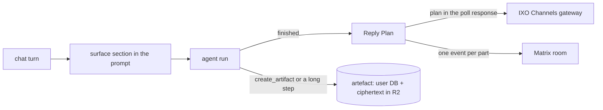

# Chat delivery

Portal turns stream Markdown into a rich view, unchanged. Turns that arrive from a chat app get a chat reply instead:

- turns from IXO Channels (`client: 'channel'`: WhatsApp now, Telegram and Slack later);
- turns from Matrix rooms (`client: 'matrix'`), which includes third-party oracles used from the Portal's rooms.

A chat reply is a few short messages. Anything long becomes a document the user opens in a browser (an **artefact**), linked from the messages. The design and its reasoning are in [`specs/chat-native-delivery.md`](../../../specs/chat-native-delivery.md). This page covers what the runtime does.



## Delivery profiles

`resolveDeliveryProfile` (`src/delivery/profile.ts`) picks a profile for each turn:

| Turn                        | Profile                                                                         |
| --------------------------- | ------------------------------------------------------------------------------- |
| Portal HTTP                 | `stream`: no surface section, no plan                                           |
| `POST /channels/turn`       | `chat` for `channel.provider` (`whatsapp`, `telegram`, `slack`), else `generic` |
| Matrix room, direct         | `chat` `matrix`                                                                 |
| Matrix room, group          | `chat` `matrix`, at most 2 messages per step and 3 parts per reply              |
| Matrix, `matrixChat: false` | `stream`: the whole reply as one formatted message                              |

The limits are character counts, set well below each provider's hard limit. The gateways enforce the hard limits again:

| Limit            | Meaning                                                            | generic, whatsapp | telegram | slack | matrix |
| ---------------- | ------------------------------------------------------------------ | ----------------- | -------- | ----- | ------ |
| `bubbleTarget`   | Preferred size of one message                                      | 600               | 800      | 1,200 | 1,200  |
| `bubbleMax`      | Hard size of one message before a sentence split                   | 1,500             | 2,000    | 3,000 | 4,000  |
| `minBubble`      | Shorter fragments merge into the next message                      | 60                | 60       | 60    | 60     |
| `maxBubbles`     | Messages per model step before the step becomes an artefact        | 3 (WhatsApp 4)    | 4        | 3     | 3      |
| `maxPartsPerRun` | Parts in the whole reply                                           | 5 (WhatsApp 6)    | 6        | 5     | 5      |
| `spillChars`     | A step's text longer than this becomes an artefact                 | 1,800             | 2,400    | 3,500 | 4,000  |
| `maxListItems`   | A longer list becomes an artefact with a preview                   | 7                 | 7        | 7     | 7      |
| `previewItems`   | List items kept in the message that links to the artefact          | 3                 | 3        | 3     | 3      |
| `maxCodeLines`   | A longer code block becomes an artefact                            | 12                | 12       | 12    | 12     |
| `tables`         | Whether a table may stay inline (otherwise it becomes an artefact) | no                | no       | no    | no     |

An oracle tunes delivery in its config:

```ts
createOracleWorker({
  config: {
    name: 'My Oracle',
    // …
    delivery: {
      // Matrix rooms reply like the Portal: one message per turn.
      matrixChat: false,
      // Per-surface overrides of the limits above.
      limits: { whatsapp: { maxBubbles: 3 } },
    },
  },
});
```

Plugins see the profile as `ctx.session.surface`: `{ kind: 'stream' }` or `{ kind: 'chat', surface, label }`. A plugin can use it to return compact output on chat.

## The surface section

On a chat turn the prompt composer fills the `{{#SURFACE_BLOCK}}` slot, after the communication style, with a section rendered by `renderSurfaceSection` (`src/delivery/prompt.ts`). It tells the model where it is replying and how to write there:

- lead with the answer;
- write one to three short messages;
- use no headings or tables;
- put anything long in `create_artifact`;
- don't narrate steps, because the user sees a typing indicator.

The section is empty on the Portal. When artefact storage is not configured, the section asks the model to send the short version and offer the rest instead.

## Reply Plans

A chat turn's reply is a **Reply Plan**: an ordered list of parts.

```ts
type ReplyPlan = { v: 1; parts: ReplyPart[] };
type ReplyPart =
  | { partId: string; kind: 'text'; text: string }
  | { partId: string; kind: 'artifact'; artifact: ArtifactRef };
```

The plan is built once, when the run finishes, from the turn's AI messages (`src/delivery/plan.ts`). The checkpoint keeps what the model wrote; only the delivery changes.

1. **Narration is dropped.** Text of 200 characters or less that precedes a tool call ("Checking your calendar.") says nothing once the answer arrives. Longer text before a tool call is content and is kept.
2. **`create_artifact` becomes three parts:** its message, the artefact, and its optional follow-up question.
3. **Every other step goes through the shaper** (`src/delivery/shaper.ts`):
   - It splits the text into messages on paragraph, line and sentence boundaries, and keeps each message under `bubbleMax`.
   - It turns headings into bold lines, strips HTML, and keeps a lead-in ending in `:` together with the list that follows it.
   - A step that is too long, holds a table, long code or a long list, or needs more than `maxBubbles` messages is **spilled**: the full text becomes an artefact. The step's messages become a lead (a list preview, or the first paragraph), the link, and the step's closing question, if it had one.
4. **The plan is capped** at `maxPartsPerRun` by merging the shortest adjacent pair of text parts.

Part ids are `p1`…`pn`. The plan is stored in `turn_run_plans` with the run, and pruned with it after the seven-day run retention. A re-poll, a replayed Matrix event or a recovered run therefore gets the same plan and the same artefact links. If an artefact can't be stored, its step is sent as plain messages and the run still finishes.

The turn's `text` is the plan rendered as one Markdown message, with artefacts as links (`planText`). It serves gateways that predate plans, the Matrix mirror of a channel turn, and task deliveries.

## Artefacts

### Creation

- **`create_artifact`** (`src/artifacts/tool.ts`) is bound only on chat turns, and only when storage is configured. It takes `title`, `content` (Markdown, up to 200,000 characters), `message` and an optional `followUp`.
  - It is a **return-direct** tool: the run ends after it, with no second model call.
  - LangChain ends a step only when the step's _last_ tool call is return-direct. When the model calls it together with other tools, an `afterModel` hook (`src/core/middlewares/return-direct-first.ts`) moves it first, so the run continues and the model sees every result.
- **Spills** are artefacts the shaper creates from a long step.

Ids are deterministic: the first 128 bits of `sha256("artifact\0" + runId + "\0" + source)`. The source is the tool call id, or the step key for a spill. Creation is idempotent per id, so a recovered run gets the same document and the same link.

### Storage

| Copy      | Where                                      | Notes                                                                                                                 |
| --------- | ------------------------------------------ | --------------------------------------------------------------------------------------------------------------------- |
| Canonical | `artifacts` table in the user's SQLite     | Exported with the rest of the working copy to the user's VFS file, so the user owns it.                               |
| Share     | R2 `art/<artifactId>` in `ARTIFACT_BUCKET` | AES-256-GCM ciphertext of `{v, title, mime, content, createdAt}`, 12-byte IV first. Custom metadata `expiresAt` only. |

The key is 256 random bits. It is stored in the user's row and travels only in the link's fragment. The operator's bucket never holds plaintext.

### Links and the viewer

```
https://<oracle>/a/<artifactId>#k=<key>                          built-in page
https://<viewer>#a=<encoded https://<oracle>/a/<artifactId>>&k=<key>   ARTIFACT_VIEWER_URL (Qi.Space)
```

- **`GET /a/:id`** serves one static page for every artefact (`src/artifacts/viewer-page.ts`). The page:
  - reads the key from the fragment and decrypts with WebCrypto;
  - renders the Markdown through DOM APIs only, with no `innerHTML`, only `http(s)` and `mailto` links, and images as links;
  - offers Copy and Download `.md`.
  - Its CSP allows only its own hashed script and style, and `connect-src 'self'`. The response also sets `X-Robots-Tag: noindex, nofollow`, `Referrer-Policy: no-referrer` and `nosniff`.
- **`GET /a/:id/data`** returns the ciphertext.
  - It answers any origin (`Access-Control-Allow-Origin: *`), so a shared viewer on another host can fetch it.
  - It is cached `private, max-age=60`, so a revocation takes effect within a minute.
  - It is rate-limited per client IP through `RATE_LIMIT` (key `artifact:<ip>`).
  - An expired object answers `410` and is deleted.
- Both routes sit ahead of CORS and auth. Without the key they serve nothing readable.
- With **`ARTIFACT_VIEWER_URL`** set, links open a shared viewer instead: the Portal's `/artifact` page on Qi.Space.
  - It receives the source and the key in the fragment, so its server learns neither.
  - It fetches only `/a/<id>` paths on allowlisted hosts, and its analytics and error reporting drop the fragment.
  - Without it, the built-in page works on its own.

Link unfurlers (WhatsApp, Telegram, Slack, Matrix URL previews) fetch the path, never the fragment. They get the generic page and nothing else.

### Expiry, revocation, deletion

- Links expire after `ARTIFACT_LINK_TTL_DAYS` (default 30). The data route refuses an expired object. Add an R2 lifecycle rule on `art/` to remove share copies nobody opened, as described in [configuration](configuration.md#chat-delivery-and-artefacts).
- `DELETE /artifacts/:id` (authenticated, the owner only) deletes the share copy. The canonical copy stays. `GET /artifacts/:id` returns the canonical copy, with `url` only while the link works.
- Deleting a session deletes its artefacts: the share copies first, then the rows. If the R2 delete fails, the rows stay, and the links still expire on schedule.

### Link policy

A link is **a bearer link: anyone who has it can open the document until it expires** (30 days by default). This choice, and the recommendation to review it, is recorded in the [repository README](../../../README.md#artefact-link-policy).

## Delivery by surface

- **IXO Channels.** A finished `/channels/turn` response carries `plan` next to `text` ([channels](channels.md#reply-plans)). The gateway renders each part in provider syntax, paces the parts, and delivers each one exactly once, keyed by `(userDid, bindingId, requestId, partId)`.
- **Matrix rooms.** The gateway posts one `m.text` event per part in the thread, rendered to HTML like the room replays (`src/matrix/reply-parts.ts`). An artefact is its title and an "Open document" link. Each part has its own transaction id (`reply-<eventId>-<partId>`), so a replay posts nothing twice. The typing indicator shows liveness while the run works. A `stream` reply, where `matrixChat` is `false`, is one message, now with `formattedBody`.
- **Portal.** Unchanged: SSE frames, no plan.
