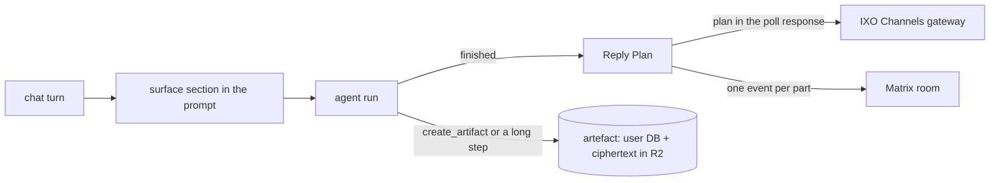

# Chat delivery

Portal turns stream Markdown into a rich view, unchanged. Turns that arrive from a chat app get a chat reply instead:

- turns from IXO Channels (`client: 'channel'`: WhatsApp now, Telegram and Slack later);
- turns from Matrix rooms (`client: 'matrix'`), which includes third-party oracles used from the Portal's rooms, when the chat style is turned on for rooms (`MATRIX_CHAT_DELIVERY=true` or `delivery.matrixChat: true`; off by default).

Scheduled task runs never get a chat reply, whichever room they report to: their result is stored and read later, so it keeps the model's whole text.

A chat reply is a few short messages. Anything long becomes a document the user opens in a browser (an **artefact**), linked from the messages. The design and its reasoning are in [`specs/chat-native-delivery.md`](../../../specs/chat-native-delivery.md). This page covers what the runtime does.


```mermaid
graph LR
    Turn[chat turn] --> Prompt[surface section in the prompt]
    Prompt --> Run[agent run]
    Run -->|finished| Plan[Reply Plan]
    Plan -->|plan in the poll response| Channels[IXO Channels gateway]
    Plan -->|one event per part| Matrix[Matrix room]
    Run -->|create_artifact or a long step| Art[(artefact: user DB + ciphertext in R2)]
```

## Delivery profiles

`resolveDeliveryProfile` (`src/delivery/profile.ts`) picks a profile for each turn:

| Turn                                                       | Profile                                                                         |
| ---------------------------------------------------------- | ------------------------------------------------------------------------------- |
| Portal HTTP                                                | `stream`: no surface section, no plan                                           |
| Scheduled task run (`taskRunId` set, or a `task:` session) | `stream`, on every surface                                                      |
| `POST /channels/turn`                                      | `chat` for `channel.provider` (`whatsapp`, `telegram`, `slack`), else `generic` |
| Matrix room (default)                                      | `stream`: the whole reply as one plain message, as before chat delivery         |
| Matrix room, direct, chat style on                         | `chat` `matrix`                                                                 |
| Matrix room, group, chat style on                          | `chat` `matrix`, at most 2 messages per step and 3 parts per reply              |

The chat style for Matrix rooms is off unless `MATRIX_CHAT_DELIVERY=true` (per deployment, on the script that runs `UserOracleDO`) or `delivery.matrixChat: true` (in code). The variable wins when it is set, so `MATRIX_CHAT_DELIVERY=false` turns it off again for one deployment.

The limits are character counts, set well below each provider's hard limit. The gateways enforce the hard limits again:

| Limit            | Meaning                                                            | generic, whatsapp | telegram | slack | matrix |
| ---------------- | ------------------------------------------------------------------ | ----------------- | -------- | ----- | ------ |
| `bubbleTarget`   | Preferred size of one message                                      | 600               | 800      | 1,200 | 1,200  |
| `bubbleMax`      | Hard size of one message before a sentence split                   | 1,500             | 2,000    | 3,000 | 4,000  |
| `minBubble`      | Shorter fragments merge into the next message                      | 60                | 60       | 60    | 60     |
| `maxBubbles`     | Messages per model step before the step becomes an artefact        | 3 (WhatsApp 4)    | 4        | 3     | 3      |
| `maxPartsPerRun` | Parts in the whole reply                                           | 5 (WhatsApp 6)    | 6        | 5     | 5      |
| `spillChars`     | A step's text longer than this becomes an artefact                 | 1,800             | 2,400    | 3,500 | 4,000  |
| `maxListItems`   | A longer list becomes an artefact with a preview                   | 7                 | 7        | 7     | 7      |
| `previewItems`   | List items kept in the message that links to the artefact          | 3                 | 3        | 3     | 3      |
| `maxCodeLines`   | A longer code block becomes an artefact                            | 12                | 12       | 12    | 12     |
| `tables`         | Whether a table may stay inline (otherwise it becomes an artefact) | no                | no       | no    | no     |

An oracle tunes delivery in its config:

```ts
createOracleWorker({
  config: {
    name: 'My Oracle',
    // …
    delivery: {
      // Matrix rooms reply in chat style too (off by default).
      matrixChat: true,
      // Per-surface overrides of the limits above.
      limits: { whatsapp: { maxBubbles: 3 } },
    },
  },
});
```

A count override must be a whole number of at least 1, and `tables` a boolean; any other value keeps the default. `bubbleTarget` and `minBubble` are held at or below `bubbleMax`.

Plugins see the profile as `ctx.session.surface`: `{ kind: 'stream' }` or `{ kind: 'chat', surface, label }`. A plugin can use it to return compact output on chat.

## The surface section

On a chat turn the prompt composer fills the `{{#SURFACE_BLOCK}}` slot, after the communication style, with a section rendered by `renderSurfaceSection` (`src/delivery/prompt.ts`). It tells the model where it is replying and how to write there:

- lead with the answer;
- write one to three short messages;
- use no headings or tables;
- put anything long in `create_artifact`;
- don't narrate steps, because the user sees a typing indicator.

The section is empty on the Portal. When artefact storage is not configured, the section asks the model to send the short version and offer the rest instead.

## Reply Plans

A chat turn's reply is a **Reply Plan**: an ordered list of parts.

```ts
type ReplyPlan = { v: 1; parts: ReplyPart[] };
type ReplyPart =
  | { partId: string; kind: 'text'; text: string }
  | { partId: string; kind: 'artifact'; artifact: ArtifactRef };
```

The plan is built once, when the run finishes, from the turn's AI messages (`src/delivery/plan.ts`). The checkpoint keeps what the model wrote; only the delivery changes.

1. **Narration is dropped.** Text of 200 characters or less written with a tool call ("Checking your calendar.") says nothing once the answer arrives, so it goes when a later step has text or a `create_artifact` call follows. When nothing follows it ("Your flight is 9:40, gate B12." with a `memory_save`), it is the answer and is kept. Longer text before a tool call is always content.
2. **`create_artifact` becomes three parts:** its message, the artefact, and its optional follow-up question.
3. **Every other step goes through the shaper** (`src/delivery/shaper.ts`):
   - It splits the text into messages on paragraph, line and sentence boundaries, and keeps each message under `bubbleMax`.
   - It turns headings into bold lines and keeps a lead-in ending in `:` together with the list that follows it.
   - It reduces raw HTML the lexer found (HTML elements and comments; `<br>` becomes a line break) to its text. Inline code and code blocks stay verbatim, and angle brackets that are not HTML elements (`Promise<string>`) stay.
   - It writes reference links (`[guide][1]`) inline, because their definitions are not delivered.
   - A part that is only whitespace or zero-width characters is never sent.
   - A step that is too long, holds a table, long code or a long list, or needs more than `maxBubbles` messages is **spilled**: the full text becomes an artefact. The step's messages become a lead (a list preview, or the first paragraph), the link, and the step's closing question, if it had one.
4. **The plan is capped** at `maxPartsPerRun`. The shortest adjacent pair of text parts merges, as long as the result fits `bubbleMax`. If that is not enough, a spill's lead and closing question go, since its artefact holds both; the reply's last part stays as long as possible. Text found nowhere else is never dropped, so a reply with several documents, or a long reply without artefact storage, can stay over the cap.
5. **A resumed run** puts back the text it had streamed before the reset, minus the steps the checkpoint kept, in front of the first step after them, or after the last step when the checkpoint kept every step. A resumed run with no step of its own delivers that text alone.

Part ids are `p1`…`pn`. The plan is stored in `turn_run_plans` with the run, and pruned with it after the seven-day run retention. A re-poll, a replayed Matrix event or a recovered run therefore gets the same plan and the same artefact links. If an artefact can't be stored, its step is sent as plain messages and the run still finishes.

The turn's `text` (the run record, `TurnResult.text`, the Matrix turn ledger's `reply_text`) is always the model's own text, on every surface; the plan sits next to it (`plan`, `reply_plan`). The plan rendered as one Markdown message, with artefacts as links (`planText`), is what the Companion room mirror of a channel turn shows (once per run, recorded in the channel receipt) and what a finished `/channels/turn` response carries as `text` for gateways that predate plans.

## Artefacts

### Creation

- **`create_artifact`** (`src/artifacts/tool.ts`) is bound only on chat turns, and only when storage and a public origin are configured. It takes `title`, `content` (Markdown, up to 200,000 characters), `message` and an optional `followUp`.
  - It is a **return-direct** tool: the run ends after it, with no second model call.
  - LangChain ends a step only when the step's _last_ tool call is return-direct. When the model calls it together with other tools, an `afterModel` hook (`src/core/middlewares/return-direct-first.ts`) moves it first, so the run continues and the model sees every result.
- **Spills** are artefacts the shaper creates from a long step.

Ids are deterministic: the first 128 bits of `sha256("artifact\0" + runId + "\0" + source)`. The source is the tool call id, or the step key for a spill. Creation is idempotent per id, so a recovered run gets the same document and the same link.

### Storage

| Copy      | Where                                      | Notes                                                                                                                 |
| --------- | ------------------------------------------ | --------------------------------------------------------------------------------------------------------------------- |
| Canonical | `artifacts` table in the user's SQLite     | Exported with the rest of the working copy to the user's VFS file, so the user owns it.                               |
| Share     | R2 `art/<artifactId>` in `ARTIFACT_BUCKET` | AES-256-GCM ciphertext of `{v, title, mime, content, createdAt}`, 12-byte IV first. Custom metadata `expiresAt` only. |

The key is 256 random bits, generated in the user's Durable Object. R2 holds only ciphertext, and a viewer host (the built-in page's or a shared one) receives the key only in the fragment, which browsers do not send. The **operator holds the key**: it sits in plaintext in the user's database and so in everything derived from it:

- the `artifacts.share_key` column and the link in the run's stored plan (`turn_run_plans`), the Matrix turn ledger (`matrix_turns.reply_plan`) and the Matrix events posted to the room;
- the `create_artifact` tool result (a `ToolMessage` in the checkpoint), which is sent to the model provider on later turns of the session;
- the `/channels/turn` response, so the IXO Channels gateway and the chat provider (WhatsApp, …) see the link.

Anyone who can read the user's database, the model provider's request logs or the chat can open the document until its link expires or is revoked.

### Links and the viewer

```
https://<oracle>/a/<artifactId>#k=<key>                          built-in page
https://<viewer>#a=<encoded https://<oracle>/a/<artifactId>>&k=<key>   ARTIFACT_VIEWER_URL (Qi.Space)
```

- **`GET /a/:id`** serves one static page for every artefact (`src/artifacts/viewer-page.ts`). The page:
  - reads the key from the fragment and decrypts with WebCrypto;
  - renders the Markdown through DOM APIs only, with no `innerHTML`, only `http(s)` and `mailto` links, and images as links;
  - offers Copy and Download `.md`.
  - Its CSP allows only its own hashed script and style, and `connect-src 'self'`. The response also sets `X-Robots-Tag: noindex, nofollow`, `Referrer-Policy: no-referrer` and `nosniff`.
- **`GET /a/:id/data`** returns the ciphertext.
  - It answers any origin (`Access-Control-Allow-Origin: *`), so a shared viewer on another host can fetch it.
  - It is cached `private, max-age=60`, so a revocation takes effect within a minute.
  - It is rate-limited per client IP through `RATE_LIMIT` (key `artifact:<ip>`).
  - An expired object answers `410` and is deleted.
- Both routes sit ahead of CORS and auth. Without the key they serve nothing readable.
- With **`ARTIFACT_VIEWER_URL`** set, links open a shared viewer instead: the Portal's `/artifact` page on Qi.Space.
  - It receives the source and the key in the fragment, so its server learns neither.
  - It fetches only `/a/<id>` paths on allowlisted hosts, and its analytics and error reporting drop the fragment.
  - Without it, the built-in page works on its own.

Link unfurlers (WhatsApp, Telegram, Slack, Matrix URL previews) fetch the path, never the fragment. They get the generic page and nothing else.

### Expiry, revocation, deletion

- Links expire after `ARTIFACT_LINK_TTL_DAYS` (default 30). The data route refuses an expired object and deletes it. Copies nobody opens again are deleted by the cron sweep (`src/artifacts/sweep.ts`): every `ARTIFACT_SWEEP_INTERVAL_HOURS` (default 24) it lists `art/` with each object's `expiresAt` and deletes the expired ones, so the bucket needs no lifecycle rule. It runs on the script that binds `ARTIFACT_BUCKET` and needs a cron trigger there; see [configuration](configuration.md#chat-delivery-and-artefacts) and [operations](operations.md#artefact-sweep).
- `DELETE /artifacts/:id` (authenticated, the owner only) deletes the share copy. The canonical copy stays. `GET /artifacts/:id` returns the canonical copy, with `url` only while the link works.
- Deleting a session deletes its artefacts: the share copies first, then the rows. If the R2 delete fails, the rows stay, and the links still expire on schedule.
- Revoking or deleting a channel binding does **not** revoke the artefact links already sent through it. Revoke them one by one with `DELETE /artifacts/:id`, or delete the session.
- Owner reads, revocation and the session cleanup need only the bucket binding. Removing `ORACLE_PUBLIC_URL` stops new artefacts (and `GET /artifacts/:id` returns no `url`), but the stored ones stay readable, revocable and deleted with their session. Removing the `ARTIFACT_BUCKET` binding itself also stops the sweep: the R2 copies stay in the bucket until an operator's lifecycle rule (if any) removes them, and the links stop working at once, because nothing serves `/a/:id/data` without the binding.

### Link policy

A link is **a bearer link: anyone who has it can open the document until it expires** (30 days by default). This choice, and the recommendation to review it, is recorded in the [repository README](../../../README.md#artefact-link-policy).

## Delivery by surface

- **IXO Channels.** A finished `/channels/turn` response carries `plan` next to `text` ([channels](channels.md#reply-plans)). The gateway renders each part in provider syntax, paces the parts, and delivers each one exactly once, keyed by `(userDid, bindingId, requestId, partId)`.
- **Matrix rooms, chat style on.** The gateway posts one `m.text` event per part in the thread (`src/matrix/reply-parts.ts`). A text part's `formatted_body` is its Markdown rendered to HTML with any raw HTML from the model escaped, never passed through. An artefact is its title and an "Open document" link. Each part has its own transaction id (`reply-<eventId>-<partId>`), so a replay posts nothing twice. The typing indicator shows liveness while the run works.
- **Matrix rooms, chat style off (the default).** One plain `m.text` with the reply text and no `formatted_body`, byte for byte what the runtime sent before chat delivery.
- **Portal.** Unchanged: SSE frames, no plan.

## Tests

All in `pnpm test` (workerd), listed with what they prove in
[testing](testing.md#unit-tests-seconds): the plan, profile and shaper
(`src/delivery/*.test.ts`), the Matrix reply parts, the return-direct
ordering hook, the artefact store, sweep and routes, and the channel turn
that returns a finished run as its Reply Plan (`src/channels/turns.test.ts`).
