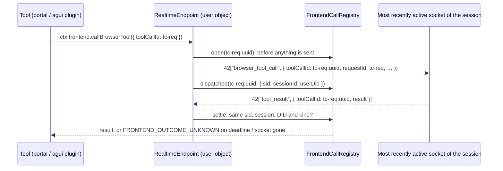

# Frontend bridge

How the runtime asks the user's browser to do something: a **browser tool**
(the Portal's `tools[]`, run through the Portal plugin) or an **AG-UI
action** (`agActions[]`, run through the AG-UI sub-agent). Both travel over
the realtime channel (`src/realtime/`, socket.io on the user object) and
share one contract, version 2, which the Portal's Topic conversation
commands depend on. The wire contract itself lives in
`@ixo/common/ai/frontend-bridge`, shared with the Node caller in
`@ixo/common`.

This page describes the Workers behaviour. It does not enable Topic writes
and does not change Topic Protocol 1.x persistence; the Portal keeps writes
disabled until its own gates pass (see "Rollout checks").

## The contract



- **One id per invocation.** The bridge, not the caller, makes the id
  unique: `<caller id>:<uuid>` (`frontendInvocationId`). The caller id stays
  readable as the prefix and is sent as `requestId`. An id is issued once;
  the registry refuses to open an id it holds as pending or remembers as
  finished.
- **Registered before it is sent.** The call is in the registry before the
  frame leaves, so an immediate answer cannot be missed.
- **Ownership is checked at CONNECT.** A socket serves a session only after
  its CONNECT packet's UCAN proved the DID the shell routed it for and the
  session exists in that user's own database. The user object is per DID
  and per oracle deployment, so the session belongs to this user and this
  oracle by construction. A failing ownership lookup refuses the socket
  (`Unauthorized: session check failed`) instead of leaving it half-open.
  `@ixo/oracles-client-sdk` renews its credentials (a fresh invocation,
  then a fresh delegation and invocation) only for a refusal of the
  credentials themselves; a failed session check, a failed auth check and
  a token of another user are final.
- **One socket per invocation.** The call goes to one authenticated socket
  of its session only, never to every tab: the one with the most recent
  client-originated socket.io event (a result, `ping`, `status`, …;
  `lastActiveAt` on the socket attachment, so it survives hibernation).
  With no such event on any tab, the one that connected last runs it. A
  tab that connected last is often a background tab that reconnected after
  a laptop woke, so activity wins over connection order. engine.io pongs do
  not count: background tabs answer them too. Nothing advertises whether a
  tab can run the tool or is in the foreground, so this is a heuristic. If
  no socket is connected, the call is refused at once with
  `<label> <tool> was not sent: no browser is connected to session <id>`. It
  was never sent, so this is a definite failure, not an unknown outcome.
- **Results are bound to the socket.** A `tool_result` / `action_call_result`
  settles the invocation only when it arrives on the socket it was sent to:
  the same engine.io sid, session and authenticated DID, and the same kind.
  Each of these is rejected and logged, and the call keeps waiting:
  - a result from another tab of the same session;
  - a result from a reconnected tab, which has a new sid;
  - a result from another session's socket;
  - a payload `sessionId` naming a different session (a session override);
  - a browser-tool result for an AG-UI invocation, or the reverse.
- **One result per invocation.** A finished invocation is remembered. A
  duplicate, replayed or late result is rejected as `already settled`, and
  an id never issued as `not issued`. The records are bounded to 1,024 and
  30 minutes (`MAX_COMPLETED_FRONTEND_CALLS`,
  `COMPLETED_FRONTEND_CALL_TTL_MS`). Pending calls are never evicted to make
  room. Past 256 calls in flight per user (`MAX_PENDING_FRONTEND_CALLS`), a
  new call is refused instead.
- **Unknown, not failed.** When the answer cannot arrive, the call resolves
  with the result below and is never sent again. This happens when the
  deadline passes, at once when the executing socket goes (closed, errored,
  dropped by the heartbeat, or a send to it failed), since only that socket
  could have answered, and at once when the turn aborts (Stop, the turn
  deadline). The plugins pass `ctx.abortSignal` as `FrontendCallParams.signal`.
  A turn aborted before the call was sent rejects it as `… was not sent:
the turn was aborted`.

  ```json
  {
    "success": false,
    "code": "FRONTEND_OUTCOME_UNKNOWN",
    "outcome": "unknown",
    "invocationId": "tc-req:…",
    "message": "The frontend result did not arrive. The operation may still complete. Read command status using the original command ID before retrying; do not issue a replacement mutation."
  }
  ```

  The model receives it as the tool result. The Portal recovers the
  original command from its own journal by command id instead of issuing a
  replacement. A client that cannot tell whether its own write landed may
  answer `{ success: false, outcome: 'unknown' }`. That answer is also
  returned, not turned into an AG-UI rejection. On the SSE stream an AG-UI
  action with an unknown outcome ends as `action_call` `status: 'done'`,
  with the unknown result as its `output` and no `error`. A client that
  offers a retry on `status: 'error'` therefore does not offer one for an
  action that may have run. A browser tool's unknown result already ends as
  a `tool_call` `done`.

- **Explicit failures keep their contract.** A result with `error` rejects.
  An AG-UI `{ success: false, error }` rejects with that error. A browser
  tool's `{ success: false }` is its result.
- **Topic writes get a longer window.** `mutate_topic` waits 120 s
  (`TOPIC_MUTATION_TIMEOUT_MS`). Other browser tools wait 15 s and AG-UI
  actions 15 s.
- **Frontend call frames reach a socket only as invocations.** The router
  tap that mirrors turn events to sockets skips `browser_tool_call` and
  `action_call`. The SSE stream's own `action_call` frames (the AG-UI
  sub-agent's `isRunning` / `done`) and a plugin's one-way
  `ctx.emit.browserToolCall` / `actionCall` still reach the SSE stream, but
  no socket. A browser that executed them would act again. A browser tool
  invocation frame is also emitted to the session's SSE stream. An AG-UI
  invocation frame is not. The SSE stream already reports the action under
  the model's call id and closes it when the tool ends. A second frame
  under the invocation id would never be closed, and the client would show
  a card that spins forever.
- **Diagnostic logs carry identifiers only.** The `ixo.action.log` room
  event (`logFrontendAction`) records `args: {}` and a result of
  `{ invocationId, commandId?, outcome? }`. `commandId` is kept only when
  it is a 64-character hex digest; a free-form value could be user content.
  The realtime warnings name invocation ids, socket sids and sessions,
  never a payload.
- **Client-declared tools cannot shadow server tools.** A request-time tool
  whose name another tool of the turn already has is dropped for that turn,
  with one `[tool-registry] request tool "<name>" of plugin "<plugin>"
dropped …` warning. The server tool, or the first request tool of that
  name, stays, and the turn runs. Otherwise the model could call one tool
  while the runtime ran the other. Failing the turn instead would break
  every turn of a client release that declares a clashing name. The Portal
  and AG-UI plugins also keep only the first descriptor of a name declared
  twice in `tools[]` / `agActions[]`.
- **`/health` advertises the version.** It returns
  `frontendTools: { protocolVersion: 2, execution: 'single-socket', timeoutOutcome: 'unknown' }`
  (`FRONTEND_BRIDGE`). The Portal enables conversational writes only on
  exactly these values. The value is static: it signals the version and is
  not proof that a deployment behaves.

## On Workers: restarts and hibernation

- **Pending calls are in memory, which is exact here.** A pending call
  holds a timer, so its object cannot hibernate before the call ends.
- **An object restart kills the turn that made the call.** If a durable run
  resumes that turn, the tool marks keep a write that had started from
  running again: the model is told the outcome is unknown (`tool-marks.ts`).
  Read-named browser tools (`read_…`, `get_…`) do run again, as reads.
  Across a restart nothing is redispatched automatically either.
- **A late result after a restart is rejected.** The registry is empty
  then, so the result is rejected as `not issued`.
- **Finished-call records are lost when the object hibernates.** A replay
  of an old id after a wake is rejected as `not issued` instead of
  `already settled`. The outcome is the same.
- **The executing socket is identified by its engine.io sid.** The sid is
  stored on the socket attachment, so it survives hibernation. A reconnect
  gets a new sid.
- **An unknown outcome keeps the write claim.** The write-claim ledger
  (`tool-execution.ts`) treats a result whose `outcome` is `'unknown'` as an
  unknown outcome and keeps the claim. An identical write later in the run
  is not executed. The model is told to verify with a read first.
- **Several isolates cannot split a user's calls.** The registry is
  per user object, and one object is a single instance. Node's
  process-local registry needed sticky routing across instances; here no
  routing caveat applies.

## Client SDK

`useWebSocketEvents` (`@ixo/oracles-client-sdk`) always listens for
`browser_tool_call`. It reads the current tool registry only at dispatch,
so tools registered after the socket connected still run. It runs a call
only when all of these hold:

- the call names the hook's current `sessionId`;
- the connection is still current, so a late call to the socket of a
  previous session or lifecycle is dropped;
- for `action_call`, the status is `isRunning`, so a replayed `done` frame
  is not a new call.

The source change does not reach clients until the SDK is published. The
Portal pins SDK 1.4.0.

## Rollout checks

- Deploy the runtime, then prove the contract against the Portal's pinned
  SDK. The `/health` advertisement is not acceptance evidence.
- Exercise two Topic sessions next to HomeChat, account and session
  switches, reconnects, delayed and lost results, and AG-UI actions.
- Verify executor choice when several tabs share a session. The tab with
  the latest client event, else the one that connected last, runs the call
  whether or not it registered the tool. The call is not re-sent to another
  tab when that tab cannot run it; it answers `Tool … not found`, which is
  a definite failure.
- Keep Portal writes disabled until its identity, recovery, adapter-coverage
  and signed-in acceptance gates also pass.

## Known limits

- **The executor choice is a heuristic.** No tab advertises whether it is
  in the foreground or has the tool registered.
- **A dropped socket never counts as a drained session.** When the hub
  itself drops a socket (heartbeat timeout, a send that throws), its
  frontend calls end as unknown, but `onSessionDrained` is not called. If
  that was the session's last socket, the session-history indexing that a
  close would schedule is skipped. This predates the bridge and is not
  changed here.

## Tests

- `src/realtime/realtime-endpoint.test.ts` (workerd, real WebSockets) proves
  each invariant end to end: ownership fails closed; single dispatch with
  distinct ids; no relay of non-invocation call frames; refusal with no
  socket; wrong socket, session override and duplicate rejected; no
  redispatch after a disconnect and immediate unknown; unknown after a
  heartbeat drop; unknown at the deadline with a scrubbed log; the most
  recently active tab executes; an abort before dispatch rejects and an
  abort after it resolves unknown; only browser-tool invocations reach the
  SSE sinks.
- `src/realtime/frontend-call-registry.test.ts` covers settlement rules,
  binding, abort before and after dispatch, replay records, capacity and
  eviction bounds. `src/realtime/session-socket-hub.test.ts` covers
  executor choice by activity and drop reporting.
- `src/do/sse-stream.test.ts` checks that an AG-UI unknown outcome ends as
  `done` and a refused action as `error`.
- `src/shell/health-route.test.ts` covers the `/health` advertisement.
- `src/plugins/portal/frontend-calls.test.ts` (core) covers caller ids, the
  turn's abort signal, duplicate descriptors, the Topic window, the unknown
  result reaching the model, and the scrubbed action log.
- `src/core/middlewares/tool-execution.test.ts` checks that an unknown
  outcome keeps the write claim. `src/core/registries.test.ts` covers a
  shadowing or duplicate request tool being dropped with one warning.
- `@ixo/common`: `src/ai/frontend-bridge/frontend-bridge.test.ts` and
  `src/ai/tools/frontend-tool-caller.test.ts` (the Node caller).
- `@ixo/oracles-client-sdk`:
  `src/hooks/use-websocket-events/use-websocket-events.test.ts`.
- Devnet matrix, step `realtime: a browser tool call runs on exactly one of
two tabs of the session, and /health advertises the frontend bridge`.
