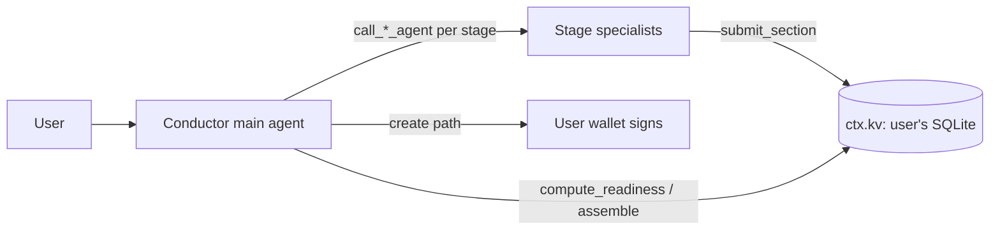
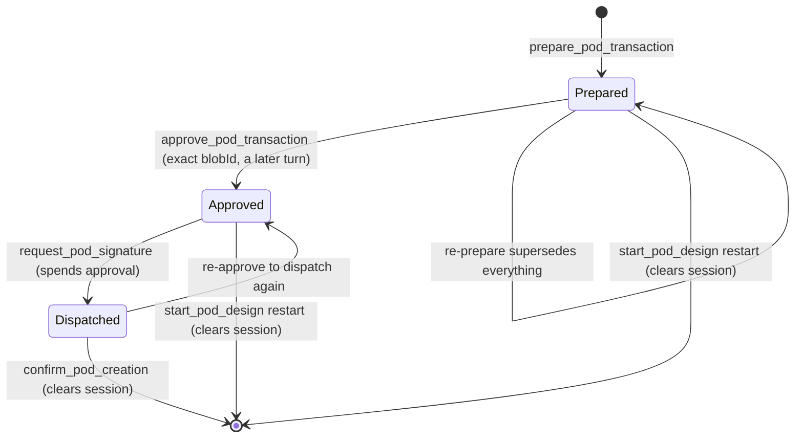

# POD Creator plugin

`src/plugins/pod-creator/` — bundled (`BUNDLED_WORKERS_PLUGINS`),
`visibility: on-demand` (hidden by the capability gate until
`load_capability('pod-creator')` or the capability router admits it),
`stability: experimental`. Design: `specs/pod-creator-plugin.md`.

Designs an IXO Programmable Organisational Domain (POD) end to end — qualify →
architect → build → evaluate → package → gate — then walks the user through an
on-chain creation the **user's wallet signs**. The oracle never holds a signing
key for creation.

## Roles and flow

The main agent is the **conductor**: it owns the blueprint lifecycle through the
orchestration tools (`start_pod_design`, `get_blueprint`, `compute_readiness`,
`assemble_blueprint`). Twelve **specialist sub-agents** (one per
`design-pod-*` capsule, defined in `design-pod-roles.ts`) do the design work.
`getRequestSubAgents` exposes only the current stage's specialists, so the
pipeline order is enforced by construction; the runtime wraps each as
`call_<role>_agent` (`core/subagent-as-tool.ts`).

The runtime calls every plugin's `getRequestSubAgents` on every turn of every
user, whether or not the capability is loaded. So until `start_pod_design` has
opened a blueprint in the thread the hook returns nothing after one local
`ctx.kv` read — no registry request, no UCAN mint, no log line. The qualify
specialist appears on the turn after `start_pod_design`.

Sections enter the blueprint **only** through a specialist's `submit_section`.
The conductor has no write path (there is no `record_blueprint_section` tool,
although the original spec listed one) — it cannot self-certify `pass`
verdicts and skip the specialists to unlock creation. Gate-bearing roles
(evaluate + gate) only satisfy readiness with an explicit `verdict: 'pass'`;
a `fail` re-opens the stage.

With no fetcher configured — the bundled default — every specialist runs on a
built-in prompt carrying its stage duties; the client answers at once, without
a request, a mint or a log line. A fork opts into the registry with
`new PodCreatorPlugin({ capsuleContentFetcher:
createRegistryInstructionsFetcher() })`, which calls
`GET {SKILLS_CAPSULES_BASE_URL}/skills/{name}/instructions` (10 s deadline,
the turn's abort signal, a 64 KB body cap — a larger body is refused) with an
`ixo:skills` invocation claiming `skills/*` and the `X-IXO-Network` header.
That endpoint serves the latest **public, mainnet** version of a skill only,
so the text is the same for every user: it is cached on the plugin instance
by capsule name (6 h). A failed fetch is remembered for 5 minutes and logged
once per capsule per window; within it the built-in prompt is used without
another request.

**Known limit — the registry names are unclaimed.** On 2026-10-05 all twelve
`design-pod-*` names answered 404 on the instructions endpoint. Whoever
publishes a public skill under one of those names controls that specialist's
system prompt — including the evaluate and gate roles whose verdicts unlock
the create path. The registry fetcher must therefore stay opt-in until the
names are owned by IXO; until then the built-in prompts are the trusted
ones.

## State and bounds

Per-thread design state is **durable**: it lives in the user's own SQLite
file through the host's `ctx.kv` surface (`UserKvSurface`, implemented by
`sqlite/user-kv-store.ts`, table `user_kv`). It survives the user object being
evicted and restored from the owner copy, and leaves with the file when the
user exports or deletes it. Every mutation is one transaction-serialised
read-modify-write, so specialists submitting sections in parallel never lose
one another's. A stored row that no longer matches the schema is reported
(blueprint) or treated as no session (create session — the safe direction for
an approval gate).

| Store                        | Where                                     | Contents                                 | Bound (per user)         |
| ---------------------------- | ----------------------------------------- | ---------------------------------------- | ------------------------ |
| `KvBlueprintStore`           | `ctx.kv` `pod-creator/blueprints`         | one blueprint per thread                 | 500 entries / 24 h idle  |
| `KvCreateSessionStore`       | `ctx.kv` `pod-creator/create-sessions`    | propose→approve state per (user, thread) | 1000 entries / 1 h idle  |
| unsigned tx bytes            | `ctx.blobStore` (object storage, not SQL) | the prepared batch                       | 1 h TTL                  |
| `CapsuleContentClient` cache | plugin instance (isolate memory)          | SKILL.md per capsule name (public text)  | 64 / 6 h; failures 5 min |

On a host without `ctx.kv` every tool fails with a clear error rather than
keeping a design silently in memory; the per-turn sub-agent hook contributes
nothing.

## The create path

A propose → approve → commit handoff (`create-tools.ts` +
`create-session-store.ts`). The unsigned transaction bytes never enter model
context: `prepare` stashes them in `ctx.blobStore` (per-user, 1 h TTL) and the
model only ever sees a short `blobId`.

Safety properties, in order of enforcement:

1. **Launch gate** — `prepare` refuses until `computeReadiness` is complete.
2. **Mainnet opt-in** — `prepare` and `request_pod_signature` both refuse on
   mainnet unless `POD_CREATOR_ALLOW_MAINNET=true`. The base env schema
   defaults `NETWORK` to `mainnet`, so an oracle that sets neither gets a
   refusal, never a mainnet batch.
3. **Exact-batch approval** — `approve` binds to the blobId prepared for this
   (user, thread); a batch prepared elsewhere cannot be approved here.
4. **Approval in a later turn** — the create session records the request
   that prepared the batch, and `approve` refuses within that request. One
   model turn therefore cannot run prepare → approve → sign by itself (for
   instance steered by injected text in the brief or a section); the user has
   to send another message after the summary was shown. This is not proof
   that a human said yes: `approve_pod_transaction` is still a tool the model
   calls, and a later turn can be steered too.
5. **Gate re-checked at signing** — `request_pod_signature` re-runs
   `computeReadiness` before spending the approval and refuses when the
   design no longer passes (restarted, expired, or a gate re-opened since the
   batch was prepared). `start_pod_design({ restart: true })` also clears the
   create session, so nothing prepared from a discarded design stays approvable.
6. **Single-use approval** — `request_pod_signature` consumes the approval
   before dispatching, so a sign request can never be replayed; every dispatch
   needs a fresh approval (also across an object reset: the approval state is
   durable).
7. **Wallet signature** — the real human gate. The user reviews and signs the
   batch in their own wallet; nothing reaches the chain without it. The oracle
   only ever produces unsigned bytes and hands the wallet exactly the bytes the
   gateway built (`create-tools.test.ts` › "the oracle never signs a POD
   creation" — auth minting by the gateway is allowed, signing or
   broadcasting is not).

Every step writes an audit line via `ctx.logger`
(`[pod-creator] prepared/approved/signed/confirmed …` with user DID, thread,
blobId, network, txHash).

Tool effects for durable runs (`core/middlewares/tool-marks.ts`): the pure
reads (`get_blueprint`, `compute_readiness`, `assemble_blueprint`,
`read_blueprint`) are `effect: 'read'` and may re-run after a reset; every
other tool is a write and is never repeated — in particular a
`request_pod_signature` cut off by a reset is reported as "outcome unknown",
not dispatched to the wallet a second time.

### The `sign_transaction` round-trip

`request_pod_signature` uses `ctx.frontend.callAgAction` — the realtime
(socket.io) bridge the agui plugin uses — with a 120 s deadline:

- **Action name:** `sign_transaction` (exported as `SIGN_TRANSACTION_ACTION`).
- **Args to the client:** `{ blobId, unsignedTx, network }` — the bytes ride
  the realtime channel, not model context.
- **Expected result:** `{ txHash }` (64-hex) after the wallet signs and
  broadcasts.
- **Timeout, rejection, no connected browser, or a host without a realtime
  channel:** the tool returns a graceful message; the approval stays spent, so
  retrying requires a fresh approve.

The Portal must register the action client-side
(`useAgAction('sign_transaction', …)`) and hold the realtime channel open for
the session; until it does, the tool reports the wallet didn't respond.

## Wiring for production

Two injectable seams on `PodCreatorPluginOptions` (the class is exported from
the package root, so a fork constructs its own instance and passes it in
`plugins: [...]` in place of the bundled singleton):

- **`chainGateway`** — builds the unsigned POD batch and resolves a broadcast
  tx. The planned binding calls the IXO MCP server over the runtime's
  remote-MCP pattern: resolve the server's `did:web`, mint a per-user `ixo:*`
  UCAN invocation via `ctx.ucan`, send it as the `Authorization` header (see
  the sandbox plugin). The bundled default reports on-chain creation as
  unavailable — it never throws into the retry loop. The plugin itself has no
  chain dependency (no `@ixo/oracles-chain-client`, no cosmjs): a gateway
  implementation that needs one should import it lazily inside its methods so
  the published runtime does not carry it.
- **`capsuleContentFetcher`** — see above.

Config: `POD_CREATOR_ALLOW_MAINNET` (plugin-owned, default `false`; the
string `'true'` from a Worker var is accepted); `NETWORK` and
`SKILLS_CAPSULES_BASE_URL` are read as siblings (owned by the base schema /
skills plugin). The create path uses `NETWORK`; the capsule client falls back
to `testnet` only when the config is unreadable.

## Differences from the Node implementation (pull request 210)

| Node                                                                          | Workers                                                           | Why                                                                                                                                          |
| ----------------------------------------------------------------------------- | ----------------------------------------------------------------- | -------------------------------------------------------------------------------------------------------------------------------------------- |
| `InMemoryBlueprintStore`, `InMemoryCreateSessionStore` on the plugin instance | `KvBlueprintStore`, `KvCreateSessionStore` over `ctx.kv`          | The user object is evicted and restored from its owner copy; process memory would lose the design. Same LRU / idle-TTL limits, now per user. |
| Stores passed to the tool factories                                           | Store **resolvers** `(ctx) => store`                              | The store is per user (per Durable Object), so it is resolved from each call's context, never from the context that built the tools.         |
| In-place read-modify-write                                                    | Atomic `ctx.kv.update` (SQLite transaction)                       | SQLite access is async; without it, parallel `submit_section` calls lose sections (proven by `user-kv-store.test.ts`).                       |
| `callAgAction` from `@ixo/common` (WS gateway)                                | `ctx.frontend.callAgAction` (realtime channel), `hasClient` check | The Workers runtime's AG-UI bridge.                                                                                                          |
| `node:crypto` `randomUUID`                                                    | global `crypto.randomUUID`                                        | workerd.                                                                                                                                     |
| `ixo:skills` mint without an ability                                          | mint claiming `skills/*`                                          | On Workers an unqualified mint claims `'*'`, which only a `'*'` grant covers (same as the Workers skills plugin).                            |
| Capsule cache keyed by thread, failures never cached                          | keyed by capsule name; failures remembered 5 min, logged once     | The endpoint serves public content only; a per-turn retry of an unpublished capsule would cost a request and a log line on every turn.       |
| Default fetcher that throws (UCAN mint + warn on every build)                 | no fetcher → built-in prompt at once, no mint, no log             | The sub-agent hook runs on every turn of every user.                                                                                         |
| Qualify specialist offered before any design exists                           | no specialists until `start_pod_design`                           | Same reason: no per-turn work for users who never asked for a POD.                                                                           |
| Approval accepted in the turn that prepared the batch                         | refused in that turn                                              | One model turn must not reach the wallet prompt on its own.                                                                                  |
| Signature requested on any approved batch                                     | launch gate re-checked; restart clears the session                | A batch from a discarded or re-opened design must not reach the wallet.                                                                      |
| Default fetcher only                                                          | + opt-in `createRegistryInstructionsFetcher()` (64 KB cap)        | The registry content endpoint was confirmed (`/skills/{name}/instructions`); the bundled default is unchanged.                               |
| Undeclared tool effects                                                       | `effect: 'read'` on the four pure reads                           | Durable runs re-run reads after a reset and never repeat writes.                                                                             |
| Bundled in `BUNDLED_PLUGINS`                                                  | Bundled in `BUNDLED_WORKERS_PLUGINS`                              | Same; on-demand, so inert until loaded.                                                                                                      |

## Tests

- `pnpm test:core` — `src/plugins/pod-creator/*.test.ts` (bounded map,
  blueprint store, create-session store, capsule client + registry fetcher,
  stage, orchestration tools, sub-agents, create tools, plugin boot through
  `createRuntimeCore`) and `src/core/user-kv.test.ts`.
- `pnpm test` (workerd) — `src/sqlite/user-kv-store.test.ts`: `ctx.kv` over
  real DO SQLite (TTL, LRU, atomic updates, eviction) and the plugin driven
  through its own tools and sub-agents across an eviction and across an
  owner-copy wipe + re-import.
- `pnpm test:e2e:pod` (example app, real model, local harness) — capability
  load, `start_pod_design`, the qualify specialist as a sub-agent, the
  blueprint after `/debug/object/abort` and after `/debug/storage/reset`, and
  the launch gate refusing `prepare_pod_transaction`.
