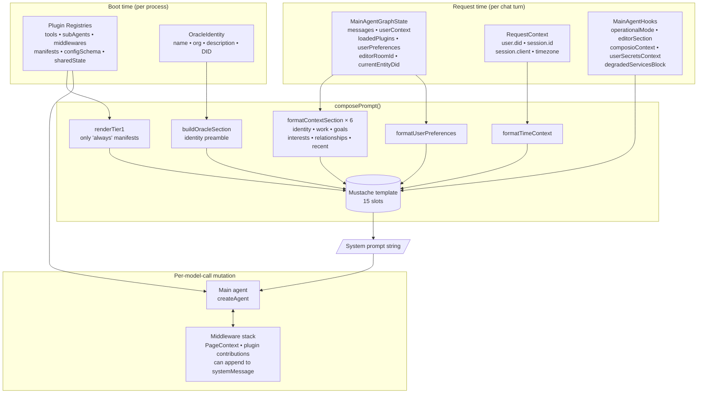
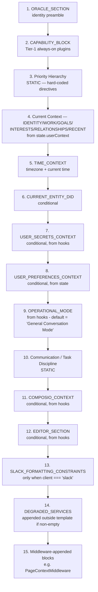
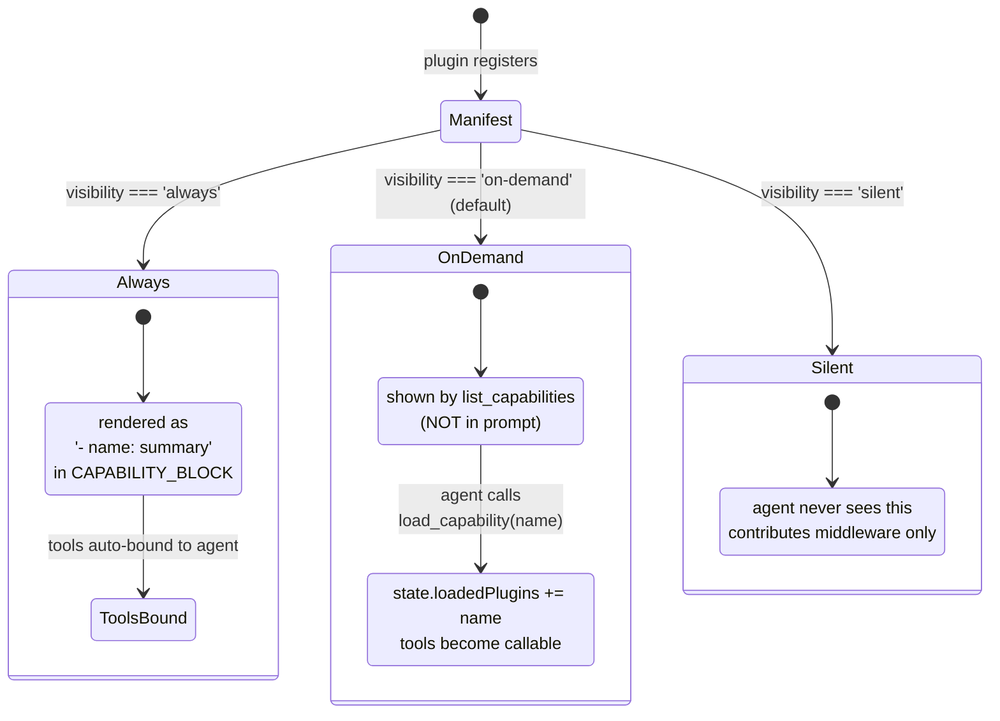
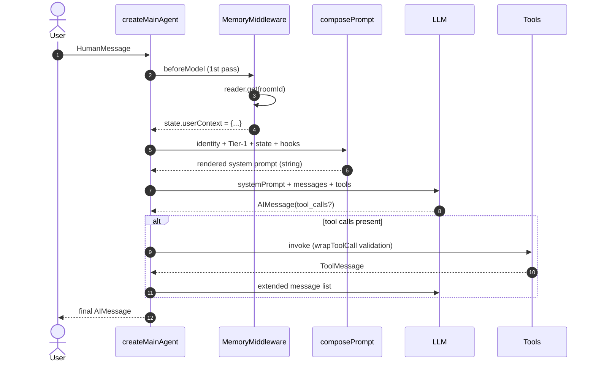
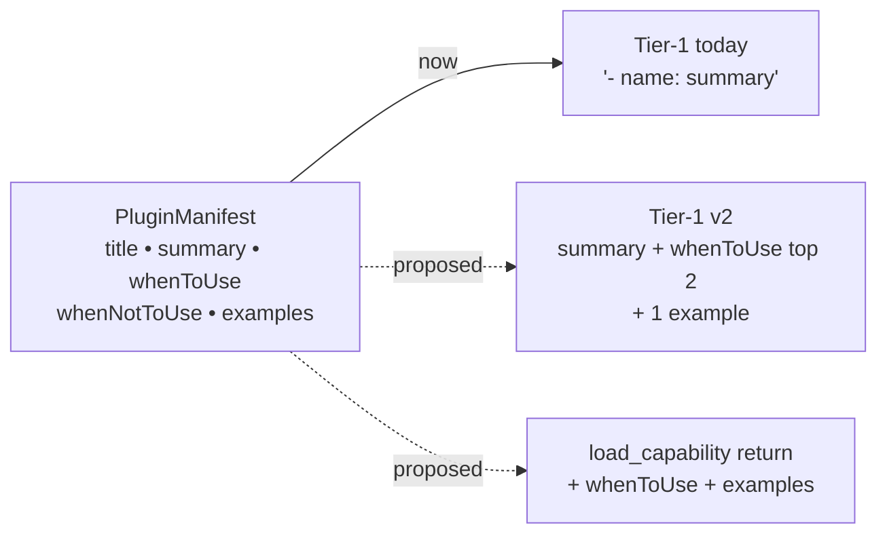
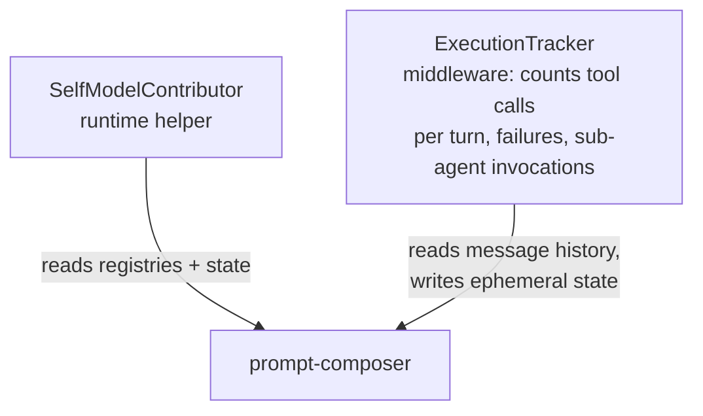
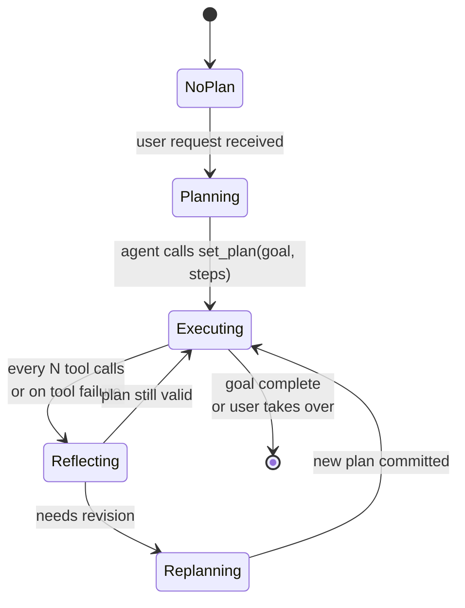
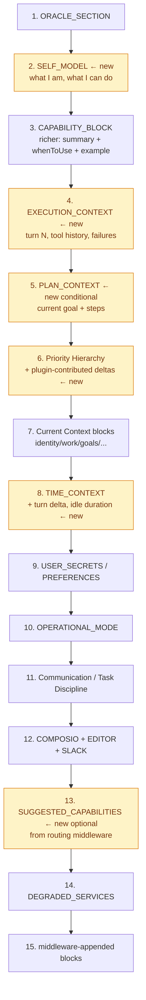

# System Prompt Architecture

How `@ixo/oracle-runtime` assembles the main-agent system prompt, what each
piece controls, and where to add agentic self-awareness without breaking the
existing contract.

This doc is a reference for the runtime package only — it does **not** cover
sub-agent prompts (those live in their owning plugin).

---

## TL;DR

- The prompt is a single Mustache template owned by
  [`graph/prompt-composer.ts`](../src/graph/prompt-composer.ts) with **15
  named slots**.
- Slots are filled by the **runtime** (identity, time, user context, Tier-1
  capabilities) and by **plugins via hooks** (operational mode, editor
  section, composio guidance, secrets, degraded-service notices).
- After composition, **middlewares can append to the system message** at each
  model call (`wrapModelCall.systemMessage.concat(...)`) — used today by
  `PageContextMiddleware` and the editor plugin.
- The agent only learns about **on-demand** plugins by calling
  `list_capabilities` and `load_capability`. Their manifest text never lands
  in the prompt directly.

---

## 1. End-to-end pipeline



---

## 2. The template — slot by slot

The template is a Mustache string with **15 input variables**, rendered in
this fixed order:



### Source of each slot

| Slot                              | Source                                                                                                            | Type                |
| --------------------------------- | ----------------------------------------------------------------------------------------------------------------- | ------------------- |
| `ORACLE_SECTION`                  | `buildOracleSection(identity)` — `prompt-composer.ts:103`                                                         | **boot**            |
| `CAPABILITY_BLOCK`                | `renderTier1(manifests where visibility==='always')` — `manifest/tier1-renderer.ts`                               | **boot**            |
| Priority hierarchy                | Hard-coded in `TEMPLATE` — `prompt-composer.ts:121`                                                               | **static**          |
| `IDENTITY_CONTEXT` …`RECENT_CONTEXT` | `formatContextSection(state.userContext.<key>)` — populated by **memory plugin middleware** before first model call | **request + plugin** |
| `TIME_CONTEXT`                    | `formatTimeContext(requestCtx.user.timezone, currentTime)`                                                        | **request**         |
| `CURRENT_ENTITY_DID`              | `state.currentEntityDid`                                                                                          | **request**         |
| `USER_SECRETS_CONTEXT`            | `hooks.userSecretsContext` (per-request, plugin-provided)                                                          | **plugin hook**     |
| `USER_PREFERENCES_CONTEXT`        | `formatUserPreferences(state.userPreferences)` — written by `user-preferences` plugin                              | **plugin state**    |
| `OPERATIONAL_MODE`                | `hooks.operationalMode ?? DEFAULT_OPERATIONAL_MODE` (editor plugin overrides this)                                | **plugin hook**     |
| Communication / Task Discipline   | Hard-coded                                                                                                        | **static**          |
| `COMPOSIO_CONTEXT`                | `hooks.composioContext` (composio plugin)                                                                         | **plugin hook**     |
| `EDITOR_SECTION`                  | `hooks.editorSection` (editor plugin — `STANDALONE_EDITOR_PROMPTS` / `EDITOR_MODE_PROMPTS`)                       | **plugin hook**     |
| `SLACK_FORMATTING_CONSTRAINTS`    | Set when `requestCtx.session.client === 'slack'`                                                                  | **request**         |
| Degraded services                 | Appended outside the template when `hooks.degradedServicesBlock` is non-empty                                     | **runtime + plugin** |
| Middleware-appended blocks        | Each plugin middleware can `request.systemMessage.concat(...)` per model call (see `PageContextMiddleware`)        | **runtime**         |

---

## 3. Capability discovery: Tier-1 vs. on-demand vs. silent



### Meta-tools the agent always has

| Tool                       | Purpose                                                                                       |
| -------------------------- | --------------------------------------------------------------------------------------------- |
| `load_capability(name)`    | Mark plugin as loaded for this thread. Returns `Command{ update: { loadedPlugins: [name] } }`. |
| `list_capabilities`        | List every visible plugin with a `loaded` flag.                                               |
| `list_capability_details(name)` | Full manifest + per-tool input shape summary.                                           |

Manifests carry **more than is currently rendered** — `whenToUse`,
`whenNotToUse`, `examples`, `tags`, `category`, `stability`. Today only
`summary` reaches the Tier-1 prompt. The rest is reachable via meta-tools but
never injected proactively.

---

## 4. What the agent sees end-to-end (current state)



The prompt is rebuilt **once per `createMainAgent` call** (= per request).
Middlewares can append to the system message **per model call** (each loop
iteration), but the base body is fixed for the request.

---

## 5. Pain points for agentic / self-aware behaviour

What's missing today — concrete, with the file each issue lives in.

| #  | Gap                                                                                                                                                  | Where                                                                |
| -- | ---------------------------------------------------------------------------------------------------------------------------------------------------- | -------------------------------------------------------------------- |
| 1  | **Tier-1 capability block only renders `summary`** — `whenToUse`, `whenNotToUse`, `examples` defined in `PluginManifest` are ignored at prompt time. | `manifest/tier1-renderer.ts:39` (`formatLine`)                       |
| 2  | **No "self-model" block** — agent never reads a description of *itself*: how many tools it has, which plugins are loaded, that it can load more.    | `prompt-composer.ts` template — no `SELF_MODEL` slot                 |
| 3  | **No execution state in prompt** — agent has no synthesized view of "tools called this turn", "failures so far", "active sub-agents".                | No tracker; agent has to infer from message history.                 |
| 4  | **No first-class plan / scratchpad** — `MainAgentGraphState` tracks `loadedPlugins` but not goals, steps, or completion.                              | `graph/state.ts`                                                     |
| 5  | **Hard-coded identity preamble** — every oracle is forced to introduce itself as "a skills-native AI companion".                                     | `prompt-composer.ts:110` (`buildOracleSection`)                      |
| 6  | **Manifest `examples` are unused** — few-shot data is defined in the type but never rendered in any prompt path.                                     | `plugin-api/types.ts:135` (`ManifestExample`)                        |
| 7  | **No proactive capability routing** — agent must call `list_capabilities` reactively. No "Likely capabilities for this turn" pre-suggestion.          | No router middleware                                                 |
| 8  | **No conversation-stage awareness** — no turn number, no idle delta, no topic-shift signal in the prompt.                                            | `prompt-composer.ts` time block is just `now + tz`                  |
| 9  | **No failure / retry budget surfaced to agent** — middleware retries silently, but agent never reads "you've retried tool X 3 times this turn".      | `tool-retry` and `tool-validation` middlewares                       |
| 10 | **Priority hierarchy is monolithic** — plugins can override `operationalMode` but not the top-level priority directives.                              | `prompt-composer.ts:121` (template) — no priority delta slot         |
| 11 | **No "reflect before acting" hook** — sub-agent prompts already say *"if unclear, stop and ask"* but the main agent has no automated reflect node.   | `graph/main-agent.ts` middleware stack                               |
| 12 | **`load_capability` return is minimal** — returns tool summaries only, not the manifest's `whenToUse`/`examples`, so the agent loses guidance after loading. | `meta-tools/load-capability.ts:60`                              |
| 13 | **Memory write nudge missing** — agent reads `userContext` but isn't reminded "you've learned X — consider writing it back to memory".               | No `afterAgent` hook around memory writes                            |
| 14 | **Static priority text becomes background noise** — long lists of "ALWAYS / NEVER" rules erode after many turns; no rotation / re-injection logic.   | `prompt-composer.ts:121`                                             |

---

## 6. Recommended evolution

A staged, non-breaking path to a more self-aware agent. Each change is
additive — existing plugins keep working.

### Stage A — surface what manifests already have



- Extend `formatLine` in `tier1-renderer.ts` to optionally include 1–2
  `whenToUse` bullets and the first `example`. Gate behind `tokenBudget` —
  drop optional fields first when over budget.
- Have `buildLoadCapabilityTool` return `whenToUse` + `examples` so the agent
  re-reads guidance immediately after loading.

**Cost:** zero new types. Just changes to two files. Token-budget logic is
already in `renderTier1`.

### Stage B — add a runtime "Self-Model" + "Execution Context" block

A new slot the runtime fills before each model call:

```
## 🧠 Self-Model
- You are running on the IXO oracle runtime (LangGraph + plugin registry).
- Plugins loaded this thread: memory, skills, editor.
- Capabilities available on-demand: 7 (call list_capabilities to see them).
- Sub-agents you can delegate to: Memory Agent, Editor Agent, Portal Agent.
- Your reasoning is private; only final replies + tool calls are visible to the user.

## 📊 Execution Context (this turn)
- Turn: 4 of conversation; 18s since user's last message.
- Tools called this turn: read_block (×2, both ok), edit_block (×1, failed).
- Last failure: edit_block — schema mismatch on `status`.
- Active sub-agent: Editor Agent (1 outstanding call).
```

Implementation sketch:



- Add `selfModelBlock: string` and `executionContextBlock: string` to
  `ComposePromptInput`.
- Drop them between `CAPABILITY_BLOCK` and `Priority Hierarchy`.
- The execution tracker is a thin middleware reading message history; no new
  persisted state required.

### Stage C — first-class plan/scratchpad in graph state



- Add `plan?: { goal: string; steps: PlanStep[] }` to `MainAgentGraphState`.
- Add three meta-tools: `set_plan`, `update_step`, `clear_plan`.
- Inject the active plan into the prompt as a `PLAN_CONTEXT` slot.
- This mirrors what Claude Code does with `TaskCreate` / `TaskUpdate` — the
  visible plan is itself a forcing function for staying on task.

### Stage D — proactive capability routing (optional)

A `silent` plugin contributing a middleware that, on every user turn:

1. Embeds the user message.
2. Ranks the top 3 `on-demand` manifests by intent similarity.
3. Either auto-loads them (`update.loadedPlugins`) **or** appends a
   `SUGGESTED_CAPABILITIES` block to the system message.

This means the agent doesn't always need to call `list_capabilities` —
discovery becomes ambient.

### Stage E — failure budgets surfaced as prompt signals

The existing `toolRetryMiddleware` swallows retries silently. Wrap it with a
counter:

- After N retries on the same tool → inject:
  `⚠️ Tool 'X' has failed 3 times this turn. Stop, summarise the issue to the user, and ask how to proceed.`
- After M total schema errors → inject:
  `⚠️ Multiple schema mismatches detected. Call list_capability_details before retrying.`

This converts silent infrastructure into agent-visible feedback.

### Stage F — make the identity preamble configurable

Tiny but high-impact. In `buildOracleSection`:

```ts
const parts: string[] = [
  identity.tagline ??
    `You are a skills-native AI companion powered by ${oracleName}. ...`,
];
```

Add `tagline?: string` to `OracleIdentity`. Each oracle fork can now own its
voice without subclassing the runtime.

---

## 7. Suggested new template structure



Five new slots, two enriched slots, no removed slots. Existing plugins keep
working untouched.

---

## 8. Files to touch (when implementing)

| Stage | Files                                                                                            |
| ----- | ------------------------------------------------------------------------------------------------ |
| A     | `manifest/tier1-renderer.ts`, `meta-tools/load-capability.ts`                                    |
| B     | `graph/prompt-composer.ts` (slots), new `graph/middlewares/execution-tracker-middleware.ts`     |
| C     | `graph/state.ts` (`plan` annotation), new `meta-tools/plan-*.ts` (3 tools), `graph/prompt-composer.ts` |
| D     | New plugin `plugins/capability-router/` (silent), `graph/middlewares/` if always-on              |
| E     | Wrap existing `toolRetryMiddleware` in `graph/main-agent.ts` with a counter                      |
| F     | `plugin-api/types.ts` (`OracleIdentity.tagline?`), `graph/prompt-composer.ts:103`               |

---

## 9. References

- Template + composer: [`graph/prompt-composer.ts`](../src/graph/prompt-composer.ts)
- Assembly: [`graph/main-agent.ts`](../src/graph/main-agent.ts)
- Tier-1 renderer: [`manifest/tier1-renderer.ts`](../src/manifest/tier1-renderer.ts)
- Meta-tools: [`meta-tools/`](../src/meta-tools/)
- Manifest type: [`plugin-api/types.ts`](../src/plugin-api/types.ts) (`PluginManifest`, `ManifestExample`)
- State annotation: [`graph/state.ts`](../src/graph/state.ts)
- Hooks contract: [`graph/main-agent-types.ts`](../src/graph/main-agent-types.ts) (`MainAgentHooks`)
- Built-in middlewares: [`graph/middlewares/`](../src/graph/middlewares/)
- Editor prompt (largest hook consumer): [`plugins/editor/prompts.ts`](../src/plugins/editor/prompts.ts)
- Memory injection: [`plugins/memory/memory-middleware.ts`](../src/plugins/memory/memory-middleware.ts)
