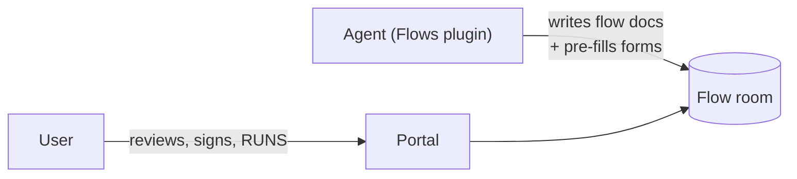
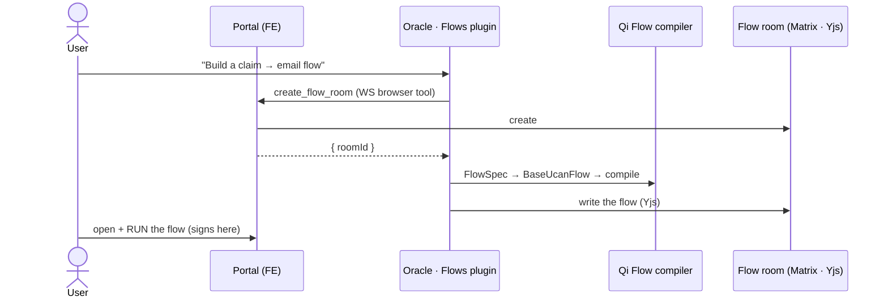
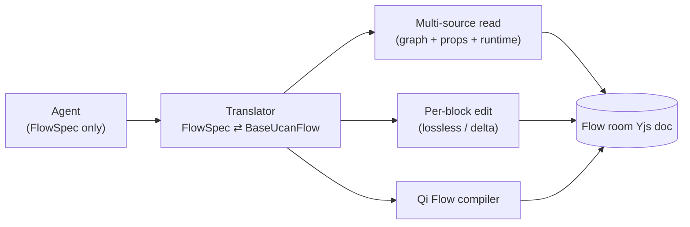

# Flows — the agentic flow builder

**A flagship paid product for QiForge oracles.**
Build multi-step action flows by chatting. The agent designs and wires the flow; the user runs it in the portal.

> Spec: `packages/oracle-runtime/src/plugins/editor/spec.md` · Plugin: `packages/oracle-runtime/src/plugins/flows/`

---

## The one-liner

A user describes an automation in plain language —

> *"When a claim is submitted, email the applicant a confirmation and notify the team."*

— and the agent **builds it as a real, runnable flow**: adds the steps, wires outputs into inputs, sets conditions / schedules / assignees, pre-fills forms, and explains what it built. The user opens it in the portal and runs it.

Built on top of the `@ixo/editor` **Qi Flow** engine — the same flows the portal already runs.

---

## The product promise

| | |
|---|---|
| **Conversational** | No flow-builder UI gymnastics — describe it, the agent assembles it. |
| **Real flows** | It writes actual Qi Flow documents the portal runs natively. Not a toy. |
| **Honest** | The agent reads the *true* live state and reports errors — it never fabricates status. |
| **Safe by construction** | The agent is a **builder, not a runner**. No keys, no signing, no execution. |

---

## Builder, not runner — the safety story



- The agent **authors** flow documents and **reads** their state. That's its entire capability.
- **No execution, no signing, no UCAN minting, no keys.** All running / PIN / consent stays in the portal, driven by the user.
- Worst case of a bug = a malformed flow doc in a room the user already owns — visible and discardable before they run it.

There is no auth model to get wrong, because there is nothing to authorize.

---

## Live demo — build a flow

Paste into a chat with the oracle (plain language — the agent discovers the actions itself):

> **"Build me an automation: when someone submits a claim to my collection, email the applicant a confirmation and notify my team. Wire the claim's id into the email. Make the email due within 2 days and assign it to `did:ixo:abc123`. Validate it first, create it, then show me the flow and walk me through each step."**

Watch the tool calls in the logs — one message drives ~12 tools:
`list_actions` → `describe_action` → `list_referenceable_fields` / `connect_steps` → `set_step_schedule` + `set_step_assignment` → `validate_flow` → **`create_flow`** → `read_flow` + `explain_step`.

---

## Live demo — edit in place

> **"Read the current flow, then add a step that emails me after the last one, and change the first step's title to 'Intake'."**

Drives `read_flow` → `add_step` → `update_step` — **all on the open flow, no new room**. Per-block edits never disturb the other steps' data or run state.

> **"Why did step 2 fail?"** → `flow_status` reads the live run state from the shared doc and reports the exact error.

And with no flow open at all:

> **"What actions can I use? Give me a starter template."** → `list_actions` / `get_flow_template` (work instantly, no room needed).

---

## How it works



The oracle never holds room-creation rights — it asks the **user's browser** to make the room (the FE already does this for the portal's own flows).

---

## The key design idea: a leak-proof model

The agent operates **only** on a friendly `FlowSpec` — steps, actions, inputs, conditions, schedules, forms. It never sees a block, Y.Doc, `can`/`with`, CAR, CID, or delegation.



One translator module owns the projection, with exhaustive round-trip tests. A leak-guard test asserts no tool's schema or output ever exposes an editor primitive.

---

## 27 tools

| Group | Tools |
|---|---|
| **Discover** | `list_actions` · `describe_action` · `list_referenceable_fields` · `get_flow_template` |
| **Inspect** | `read_flow` · `get_step` · `flow_status` · `explain_step` |
| **Author** | `validate_flow` · `create_flow` · `add_step` · `remove_step` · `reorder_step` · `update_flow_meta` · `connect_steps` · `update_step` |
| **Tune a step** | `set_step_inputs` · `set_step_conditions` · `set_step_schedule` · `set_step_assignment` · `set_step_confirmation` · `set_step_trigger` |
| **Forms** | `describe_form` · `fill_form` |
| **Linkage** | `check_link` · `compatible_actions` · `requirements` |

All loaded on-demand (the agent pulls in the `flows` capability when you ask to build something).

---

## Hard problems we solved

- **Conditions that actually fire.** The compiler writes operators (`eq`/`neq`) the FE evaluator can't read (`equals`/`not_equals`). We author `props.conditions` directly in the evaluator's vocabulary — so a condition the agent sets really gates the step.
- **Per-block isolation.** Edits are deltas — changing one step never rewrites or drops another step's inputs, conditions, or run state. Proven by test.
- **Lossless read.** Per-block props live only in the document fragment; the graph map drops them. `read_flow` gathers from *all three* sources so the agent sees the true flow.
- **Two yjs versions.** The editor bundles a different yjs than the runtime, so the plugin does all doc work in its own yjs and lets the editor's compiler sync via version-agnostic binary updates.
- **Room access.** The FE creates the room, **grants the oracle power 50**, and invites it — so the oracle can author but the user stays the owner.

---

## Status

- **27 tools** across **6 capability groups**, **60 unit tests** — all green.
- Wired into the **`qiforge-example`** oracle and exported from `@ixo/oracle-runtime`.
- Portal side: `create_flow_room` browser tool added (`impacts-x-web/lib/companion-tools/`).
- `@ixo/editor` bumped to `5.31.0` (the Qi Flow compiler API).

---

## What's next

- **Event triggers** (`set_step_event`) + `set_step_hooks` / `set_step_skills` — need the editor's edge-recompute / a couple of prop-shape confirmations.
- **`explain_step` diff** — show the before/after a step would produce (the editor's diff resolvers).
- **Integration tests** for `create_flow` / `add_step` against a live room.
- **Richer action metadata** (typed ports + prerequisites) to sharpen `check_link` / `compatible_actions`.
- Starter **template library**.

---

## Try it

```bash
# unit tests (no infra)
pnpm --filter @ixo/oracle-runtime exec vitest run src/plugins/flows

# run the reference oracle
cd apps/qiforge-example && pnpm dev
```

Then chat: *"Build me a flow that …"* — and watch it assemble.

**Questions?**
