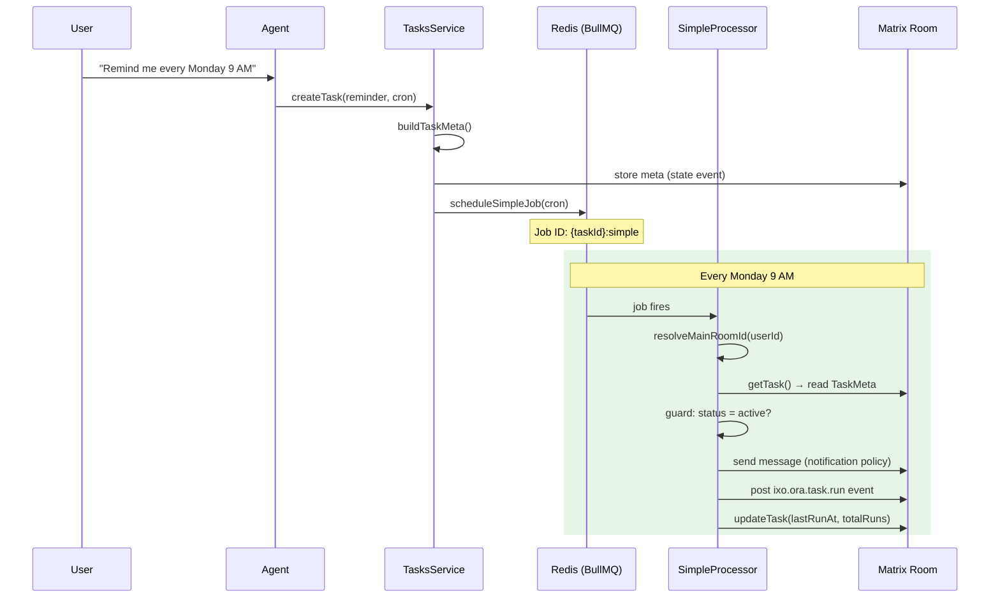
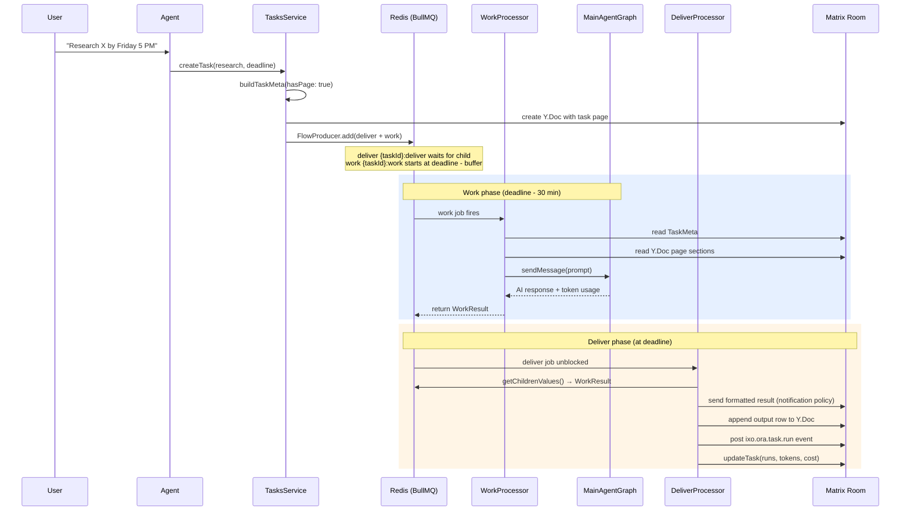
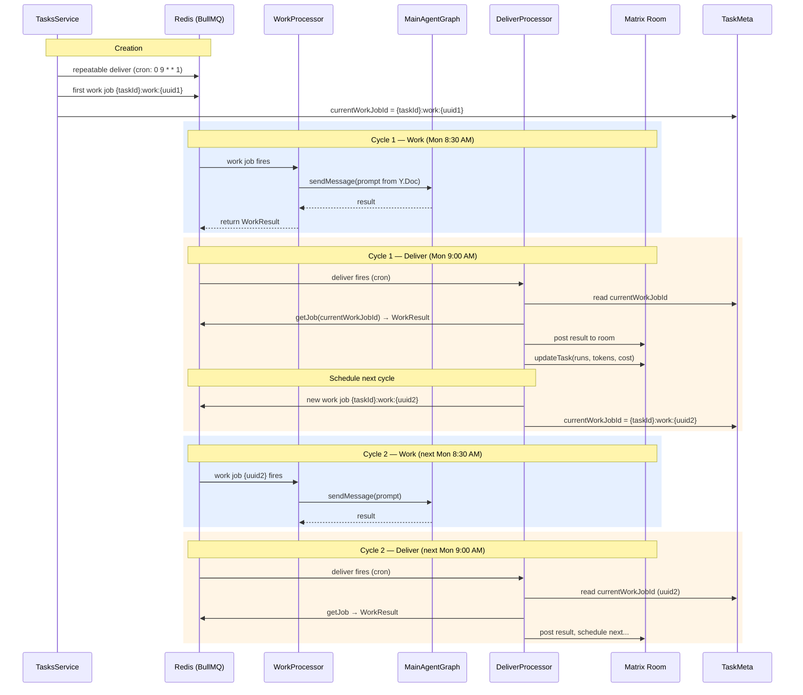

# ORA Scheduled Tasks System — Technical Specification

> **SUPERSEDED by `specs/tasks-async-system.md` (2026-06-08).**
> Kept for historical context. The active design is a clean-sheet rebuild; the six task types, Y.Doc task pages, chunked state-event index, and 700-line task-manager prompt described below are retired.

**Version:** 3.0  
**Author:** Yousef / QiForge  
**Date:** 2026-03-16  
**Stack:** NestJS · BullMQ (Redis) · Matrix SDK · Y.Doc · Graphiti · LangGraph  
**Linear:** ORA-165

---

## Table of Contents

1. [Executive Summary](#1-executive-summary)
2. [Design Principles](#2-design-principles)
3. [Job Patterns](#3-job-patterns)
4. [Task Types → Job Pattern Mapping](#4-task-types)
5. [The Task Page](#5-task-page)
6. [Task Metadata — Y.Map Sidecar](#6-task-metadata)
7. [Channel & Notification System](#7-channels)
8. [Task List State Event on Main Channel](#8-task-list-state-event)
9. [Agent Architecture — Sub-Agent](#9-agent-architecture)
10. [BullMQ Job Design](#10-bullmq-job-design)
11. [Task Page Mutation Handling](#11-mutation-handling)
12. [Task Dependencies — Chaining](#12-task-dependencies)
13. [Cost Tracking & Token Budgets](#13-cost-tracking)
14. [Approval Gates](#14-approval-gates)
15. [Task Templates](#15-task-templates)
16. [Result Tracking & Output Links](#16-result-tracking)
17. [Timezone Handling](#17-timezone)
18. [Dry Run / Preview Mode](#18-dry-run)
19. [Model Selection Per Task](#19-model-selection)
20. [Rate Limiting](#20-rate-limiting)
21. [Execution Logs as Room Events](#21-execution-logs)
22. [Error Handling & Resilience](#22-error-handling)
23. [Security & Permissions](#23-security)
24. [Observability & Monitoring](#24-observability)
25. [Agent Negotiation Protocol](#25-negotiation)
26. [NestJS Service Architecture](#26-service-architecture)
27. [Implementation Phases](#27-implementation-phases)

---

## 1. Executive Summary

The Scheduled Tasks system (ORA-165) lets users delegate time-bound work to the AI Oracle through conversation. The user says what they want and when; the agent handles scheduling, execution, delivery, and follow-up.

The system uses exactly **two job patterns**: a **Simple Job** (standard BullMQ job) for reminders and lightweight sends, and a **Flow Job** (BullMQ FlowProducer) for anything that needs a work phase before delivery.

When a task needs ongoing updates, the agent asks the user if they want a **custom channel** — if yes, the task room (prefixed `[Task]`) doubles as both the Y.Doc page host and the notification channel. A **state event on the main channel** maintains a live index of all active tasks and their channels for quick navigation.

Not all tasks need a task page — simple reminders don't. The agent decides whether a page would be useful and asks the user if they want one, keeping their workspace clean.

---

## 2. Design Principles

### 2.1 Two Job Patterns

Two patterns cover every scheduling scenario. A Simple Job for anything trivial, a Flow (work → deliver) for anything that needs preparation. No custom schedulers, no cron engines — BullMQ handles recurrence natively.

### 2.2 Task Pages Are Optional and Human-Friendly

Not every task deserves a page. A "remind me at 5pm" doesn't need a document. When a page exists, it's clean Markdown — no YAML frontmatter, no technical IDs. All machine data lives in a Y.Map sidecar within the Y.Doc.

### 2.3 Let BullMQ Do Its Job

BullMQ handles delays, repeats, retries, backoff, and flow dependencies. We store mutable task state in Y.Map and let Redis/BullMQ own the scheduling. No SQLite for task management — Y.Map is the primary store, with a lightweight Redis hash as a cross-user index.

### 2.4 Custom Channel = Task Room

When a user opts for a custom channel, the task's Matrix room serves double duty — it hosts the Y.Doc (task page) and is the notification channel. Room name is prefixed with `[Task]` (e.g., `[Task] Oil Price Monitor`) so it's visually distinct in the room list.

### 2.5 Sub-Agent for Task Management

The main Oracle already delegates to sub-agents for specialized work. Task lifecycle management (create, schedule, pause, cancel, manage rooms) lives in a **TaskManager sub-agent** — keeping the main agent's tool surface clean and the task logic testable in isolation.

### 2.6 Logs Are Room Events, Not Page Content

Execution logs are posted as custom Matrix events (`ixo.ora.task.run`) in the task room. The task page stays compact with just a "Recent Output" table linking to channel messages.

---

## 3. Job Patterns

### 3.1 Pattern A: Simple Job

A single BullMQ job that fires at the scheduled time and sends a message. No work phase.

**Use for:** Reminders, timed notifications, trivial lookups (< 5 seconds).

**How it works:**

```
User: "Remind me to submit the report at 5pm"
    → Agent creates a delayed BullMQ job (delay = ms until 5pm)
    → At 5pm, job fires → sends "🔔 Reminder: Submit the report" to channel
```

**For recurring:** Use BullMQ's `repeat` option on the same job. "Remind me to take vitamins every day at 8am" → `repeat: { pattern: '0 8 * * *', tz: 'Africa/Cairo' }`.

**Job structure:**

```typescript
{
  name: 'task_simple',
  data: {
    taskId: 'task_abc123',
    userId: '@yousef:ixo.world',
    roomId: '!taskRoom:ixo.world',
    message: '🔔 Reminder: Submit the report',
  },
  opts: {
    delay: msUntilDeliveryTime,       // One-shot
    // OR
    repeat: { pattern: '0 8 * * *', tz: 'Africa/Cairo' },  // Recurring
    jobId: 'task_abc123-simple',
  }
}
```

The message content is known at scheduling time, so it's stored in job data. The processor just sends it — no LLM call, no Y.Doc read.

---

### 3.2 Pattern B: Flow Job (Work → Deliver)

A BullMQ FlowProducer flow with two linked jobs: a **Work** child that fires early to do computation, and a **Deliver** parent that fires at the deadline to post the result.

**Use for:** Research, reports, monitoring, any task where the agent needs to think, search, or generate.

**How it works:**

```
User: "Every Monday at 9am, give me an AI news digest"
    → Agent estimates: Medium complexity, 30 min buffer
    → FlowProducer creates:
        Parent (task_deliver) — fires at 9:00 AM
          └─ Child (task_work) — fires at 8:30 AM

    → 8:30 AM: Work child fires
        → Reads task prompt from Y.Doc
        → Invokes Oracle agent (web search, summarize, etc.)
        → Saves result in job return value
        → Work child completes

    → 9:00 AM: Deliver parent fires (waited for child)
        → Reads work result from child's return value
        → Posts formatted result to channel
        → Updates output table on task page
```

**Why FlowProducer?**

- The deliver parent automatically waits for the work child to finish
- If work fails after all retries, the deliver job still fires and can send a failure notification instead of silence
- Clear separation: work = agent thinking, deliver = channel posting

**For recurring Flow Jobs:** BullMQ's `repeat` doesn't support FlowProducer directly. So for recurring tasks, the deliver job is a **repeatable job** that checks for pre-computed results:

1. A repeatable deliver job fires on schedule (e.g., every Monday 9:00 AM)
2. A **companion one-shot work job** is scheduled `buffer_minutes` before each delivery
3. When the work job completes, it stores the result (keyed by taskId + next delivery timestamp)
4. When the deliver job fires, it reads the pre-computed result and posts it
5. After delivering, the deliver processor schedules the **next** one-shot work job for the next cycle

This keeps the scheduling within BullMQ — no custom scheduler. The repeatable deliver job handles recurrence; the one-shot work jobs handle the preparation.

```typescript
// Recurring Flow: the repeatable deliver job
{
  name: 'task_deliver',
  data: { taskId, userId, roomId },
  opts: {
    repeat: { pattern: '0 9 * * 1', tz: 'Africa/Cairo' },
    jobId: 'task_abc123-deliver',
  }
}

// One-shot work job for the next delivery (created by the deliver processor after each run)
{
  name: 'task_work',
  data: { taskId, userId, roomId, forDeliveryAt: '2026-03-23T09:00:00+02:00' },
  opts: {
    delay: msUntilWorkStart,  // delivery time - buffer
    jobId: 'task_abc123-work:2026-03-23',
  }
}
```

**For one-shot Flow Jobs** (e.g., "research X by Friday"): Use FlowProducer directly — parent deliver + child work — single execution, clean dependency.

**Summary:**

| Pattern           | BullMQ Mechanism                                                            | Recurring?                             |
| ----------------- | --------------------------------------------------------------------------- | -------------------------------------- |
| **A: Simple Job** | Single job (delayed or repeatable)                                          | `repeat` on the same job               |
| **B: Flow Job**   | FlowProducer for one-shot; repeatable deliver + one-shot work for recurring | Repeatable deliver schedules next work |

---

## 4. Task Types → Job Pattern Mapping

The agent classifies the task during negotiation. The user never sees the type — it drives pattern selection, model tier, and defaults.

| Task Type            | Pattern    | Model Tier     | Example                                   |
| -------------------- | ---------- | -------------- | ----------------------------------------- |
| **Reminder**         | A (Simple) | Low            | "Remind me to call Ahmed at 3pm"          |
| **Quick Lookup**     | A (Simple) | Low            | "What's BTC price at market close?"       |
| **Research**         | B (Flow)   | High (Kimi K2) | "Research oil market trends by Friday"    |
| **Report**           | B (Flow)   | High (Kimi K2) | "Weekly AI news digest every Monday 9am"  |
| **Monitor**          | B (Flow)   | Medium         | "Alert me when AAPL drops below $150"     |
| **Scheduled Action** | B (Flow)   | Depends        | "Summarize meeting notes and post at 6pm" |

---

## 5. The Task Page

### 5.1 When to Create a Task Page

Not every task needs a page. A simple reminder shouldn't clutter the user's workspace.

**Agent logic:**

- **Reminders / Quick lookups:** No page by default. The task metadata lives only in Y.Map + BullMQ.
- **Research / Reports / Monitors / Actions:** Agent suggests creating a page so the user can see and edit the prompt. But always asks: "Want me to create a task page for this so you can edit the instructions later?"
- **User can always request:** "Create a page for this" → agent creates one regardless of task type.

### 5.2 Page Template (When Created)

```markdown
# Oil Price Monitor

**Schedule:** Every 30 minutes during London market hours (weekdays)  
**Channel:** [Task] Oil Price Monitor  
**Status:** ✅ Active

---

## What to Do

Monitor Brent crude oil prices and alert me when:

- Price crosses $85/barrel (up or down)
- Daily change exceeds 3%
- OPEC makes any production announcements

## How to Report

Short summary (2-3 sentences), current price with daily change, and a source link.

## Constraints

- Use Reuters or Bloomberg when possible
- Skip weekends and pre-market hours
- Only alert when a threshold is crossed; don't send "all clear" messages

---

## Recent Output

| When            | Summary                         | Link                  |
| --------------- | ------------------------------- | --------------------- |
| Mar 16, 2:30 PM | Brent $86.10 (+4.5%) — Alert ⚠️ | [View](#msg-eventId1) |
| Mar 16, 2:00 PM | Brent $82.40 — No alert         | [View](#msg-eventId2) |
| Mar 16, 1:30 PM | Brent $82.65 — No alert         | [View](#msg-eventId3) |
```

**Key points:**

- Schedule, Channel, Status are in **plain English** — not cron syntax
- "What to Do" = the task prompt the agent reads at execution time
- "How to Report" = output format the agent follows
- "Recent Output" table = last 5 runs with links to channel messages, **rendered from `recentOutput` in taskMeta** (Y.Map). Storing rows in metadata means user edits to the page can never corrupt the output history. The deliver processor calls `appendOutputRow()` after each run, then re-renders the table into the page.
- If user edits the schedule in plain English, the agent parses their intent and updates the cron in Y.Map

### 5.3 What the User Can Edit

| Section       | Editable? | On Edit                            |
| ------------- | --------- | ---------------------------------- |
| Title         | ✅        | Cosmetic                           |
| Schedule      | ✅        | Agent re-parses → reschedules jobs |
| Status toggle | ✅        | Backend pauses/resumes jobs        |
| What to Do    | ✅        | Next run uses updated prompt       |
| How to Report | ✅        | Next run uses updated format       |
| Constraints   | ✅        | Next run uses updated constraints  |
| Recent Output | ❌        | Agent-managed                      |

---

## 6. Task Metadata — Y.Map Sidecar

### 6.1 Architecture

Tasks WITH pages get a Y.Doc. The editor owns the document structure (`root`, `title`, `document`, `flow`, `runtime`, `delegations`, `invocations`, `auditTrail`). We write a single `taskMeta` Y.Map alongside those keys — no overlap.

```
Y.Doc (task with page — created by editor's createPage())
├── root, title, document, ...  ← Editor-owned keys (Markdown page content)
└── taskMeta: Y.Map              ← Technical metadata (our sidecar)
```

Tasks WITHOUT pages store metadata as a Matrix state event on the main agent room — no Y.Doc needed.

```
Main agent room state events:
├── ixo.ora.task.meta [stateKey=taskId]  ← Per-task metadata (TaskMeta shape)
└── ixo.ora.tasks.index [stateKey='']    ← Live index of all tasks
```

**Two initialization paths:**

- **Tasks WITH pages** (`hasPage: true`): Get a dedicated `[Task]` Matrix room + Y.Doc with `taskMeta` Y.Map sidecar + Markdown page. The editor creates the Y.Doc via `createPage()`, then `writeTaskMetaToDoc(doc, meta)` writes our sidecar.
- **Tasks WITHOUT pages** (`hasPage: false`): Metadata is stored as a `ixo.ora.task.meta` state event (keyed by `taskId`) on the main agent room. No Y.Doc, no dedicated room. Lightweight.

**Why Y.Map instead of YAML frontmatter?** Y.Map is CRDT-native — each key is an independent register, so concurrent edits (user editing page + backend updating `nextRunAt`) never corrupt each other. YAML in a text CRDT can get mangled by concurrent character-level merges.

**Why not SQLite?** Y.Map serves both the backend (reads metadata for scheduling) and the frontend (reads metadata for UI badges/status) without an extra API layer. BullMQ Redis handles job state. A lightweight Redis hash provides a cross-user index for admin queries, rebuilt on boot from Y.Docs.

### 6.2 Y.Map Schema

```typescript
interface TaskMeta {
  // Identity
  taskId: string; // 'task_abc123'
  userId: string; // '@yousef:ixo.world'
  taskType:
    | 'reminder'
    | 'quick_lookup'
    | 'research'
    | 'report'
    | 'monitor'
    | 'scheduled_action';
  hasPage: boolean; // Whether a Markdown page exists for this task

  // Scheduling
  scheduleCron: string | null; // '0 9 * * 1' (null for one-shot)
  deadlineIso: string | null; // '2026-03-20T17:00:00+02:00' (null for recurring)
  timezone: string; // 'Africa/Cairo'
  bufferMinutes: number; // 30

  // BullMQ references
  jobPattern: 'simple' | 'flow';
  bullmqJobId: string; // 'task_abc123-simple' or 'task_abc123-deliver'
  bullmqRepeatKey: string | null; // For cancelling repeatables
  currentWorkJobId: string | null; // Current work job ID (recurring flows)

  // State
  status: 'active' | 'paused' | 'cancelled' | 'completed' | 'dry_run';
  needsReplan: boolean;

  // Execution tracking
  complexityTier: 'trivial' | 'light' | 'medium' | 'heavy';
  lastRunAt: string | null;
  nextRunAt: string | null;
  totalRuns: number;
  consecutiveFailures: number;

  // Cost tracking (§13)
  totalTokensUsed: number;
  totalCostUsd: number;
  monthlyBudgetUsd: number | null;

  // Model selection (§19)
  modelTier: 'low' | 'medium' | 'high';
  modelOverride: string | null;

  // Channel & Notification
  channelType: 'main' | 'custom';
  customRoomId: string | null; // Room ID if custom channel
  notificationPolicy:
    | 'channel_only'
    | 'channel_and_mention'
    | 'silent'
    | 'on_threshold';

  // Approval gate (§14)
  requiresApproval: boolean;
  pendingApprovalEventId: string | null;

  // Dependencies (§12)
  dependsOn: string[];
  triggeredBy: string | null;

  // Recent output (§16) — stored in metadata, safe from user page edits
  recentOutput: OutputRow[];
  // where OutputRow = { when: string; summary: string; link: string }

  // Timestamps
  createdAt: string;
  updatedAt: string;
}
```

### 6.3 What Goes Where

| Data                               | Where                  | Why                                   |
| ---------------------------------- | ---------------------- | ------------------------------------- |
| taskId, userId, roomId             | BullMQ job `data`      | Immutable per job; processor needs it |
| bufferMinutes, deliveryOffsetMs    | BullMQ job `data`      | Immutable per job instance            |
| Cron pattern, timezone             | BullMQ `repeat` option | BullMQ needs it for scheduling        |
| Status, totalRuns, cost, lastRunAt | Y.Map (`taskMeta`)     | Mutable, synced to frontend           |
| Task prompt, constraints, format   | Y.Doc Markdown         | User-editable                         |
| Execution logs                     | Matrix room events     | Append-only, paginated                |
| Cross-user task index              | Redis hash             | Fast lookups, rebuilt on boot         |

---

## 7. Channel & Notification System

### 7.1 The Agent Always Asks

When creating a task, the agent determines whether a custom channel makes sense and **asks the user**:

- **Recurring tasks with multiple updates:** Suggest custom channel
- **One-shot tasks with substantial output:** Suggest custom channel
- **Simple reminders / quick lookups:** Default to main channel, no question needed

> **Agent:** "This oil monitor will send updates every 30 minutes. Want me to create a dedicated channel for these alerts, or should I post in our main chat?"

### 7.2 Custom Channel = Task Room with Prefix

When the user opts for a custom channel:

- A Matrix room is created with the name `[Task] <Task Title>` (e.g., `[Task] Oil Price Monitor`)
- The `[Task]` prefix makes task rooms visually distinct in the room list
- This room hosts the Y.Doc (task page if it exists) AND receives result messages and log events
- The user is invited to the room and can read it like any chat channel

### 7.3 Main Channel Usage

When the user opts for the main channel (or for simple tasks that don't ask):

- Results are posted to the main agent conversation
- If a task page exists, it's created in the user's default file space (not in a dedicated room)
- The task's Y.Doc lives in a lightweight system room the user doesn't see

### 7.4 Notification Policies

| Policy                | Behavior                             | Default For       |
| --------------------- | ------------------------------------ | ----------------- |
| `channel_only`        | Post result; no push notification    | Reports           |
| `channel_and_mention` | Post + @mention user (triggers push) | Reminders, alerts |
| `silent`              | Write to task page only; no message  | Dry runs          |
| `on_threshold`        | Post only when a condition is met    | Monitors          |

### 7.5 Room Lifecycle

- **Completed one-shot tasks:** Agent suggests archiving the room after 7 days
- **Paused >30 days:** Agent sends a "still need this?" message
- **Cancelled:** Room archived after user confirms
- **Archiving** = read-only, moved to "Archived Tasks" Matrix Space, history preserved

---

## 8. Task List State Event on Main Channel

### 8.1 Purpose

The user's **main agent channel** maintains a set of Matrix state events that act as a live, chunked index of all their tasks. This gives the frontend (and the agent) a single place to look up all tasks without scanning every room. Chunked storage avoids the ~65KB Matrix state event limit and provides O(1) task lookups via a header map.

### 8.2 Event Structure

The index is split across a **header event** and one or more **chunk events**, all sharing the same event type (`ixo.ora.tasks.index`) but using different state keys.

#### Header event (state key: `''`)

```typescript
{
  totalCount: 3,
  chunkSize: 100,        // max entries per chunk (default)
  chunkCount: 1,         // ceil(totalCount / chunkSize)
  updatedAt: '2026-03-16T14:00:00+02:00',
  taskChunkMap: {        // taskId → chunk number (O(1) lookup)
    'task_abc123': 0,
    'task_def456': 0,
    'task_ghi789': 0,
  }
}
```

#### Chunk events (state key: `'chunk:0'`, `'chunk:1'`, etc.)

Each chunk is a `Record<taskId, TaskIndexEntry>` object map (not an array) with at most `chunkSize` entries:

```typescript
// State key: 'chunk:0'
{
  'task_abc123': {
    taskId: 'task_abc123',
    title: 'Oil Price Monitor',
    status: 'active',
    taskType: 'monitor',
    channelType: 'custom',
    roomId: '!oilMonitor:ixo.world',
    roomAlias: '#task-oil-price-monitor:ixo.world',
    nextRunAt: '2026-03-16T14:30:00+02:00',
    hasPage: true,
  },
  'task_def456': {
    taskId: 'task_def456',
    title: 'Submit report reminder',
    status: 'active',
    taskType: 'reminder',
    channelType: 'main',
    roomId: null,
    roomAlias: null,
    nextRunAt: '2026-03-16T17:00:00+02:00',
    hasPage: false,
  },
  'task_ghi789': {
    taskId: 'task_ghi789',
    title: 'AI Daily Digest',
    status: 'paused',
    taskType: 'report',
    channelType: 'custom',
    roomId: '!aiDigest:ixo.world',
    roomAlias: '#task-ai-daily-digest:ixo.world',
    nextRunAt: null,
    hasPage: true,
  }
}
```

### 8.3 When It Updates

The state event is updated whenever:

- A task is created → new entry added
- A task's status changes (active/paused/cancelled/completed) → entry updated
- A task is deleted → entry removed
- A task's next run time changes → entry updated

The TasksService handles this update as a side effect of any task mutation.

### 8.4 What This Enables

- **Frontend "My Tasks" view:** Read one state event from the main channel — instant task list with status, channels, and links. No scanning rooms.
- **Agent quick lookups:** When the user says "what tasks do I have?", the agent reads this state event instead of iterating Y.Docs.
- **Navigation:** Each entry includes the `roomId` and `roomAlias`, so the frontend can link directly to the task's channel/page.

---

## 9. Agent Architecture — Sub-Agent

### 9.1 TaskManager Sub-Agent

Since the main Oracle delegates to sub-agents for specialized work, task management lives in a **TaskManager sub-agent**.

**Responsibilities:**

- Task CRUD (create, read, update, delete)
- BullMQ job scheduling and management
- Matrix room creation and lifecycle
- Task negotiation (collecting details from user)
- Cost tracking and budget enforcement

**Tools:**

| Tool                    | Description                                                                                            |
| ----------------------- | ------------------------------------------------------------------------------------------------------ |
| `createTask`            | Creates task (Y.Doc + page, or state event for simple tasks), schedules BullMQ job, updates task index |
| `updateTaskPrompt`      | Edits the Markdown content of a task page                                                              |
| `updateTaskSchedule`    | Parses new schedule, updates Y.Map + reschedules BullMQ                                                |
| `pauseTask`             | Status → paused, removes pending BullMQ jobs                                                           |
| `resumeTask`            | Status → active, re-schedules BullMQ jobs                                                              |
| `cancelTask`            | Status → cancelled, removes jobs, archives room                                                        |
| `listTasks`             | Reads task list state event from main channel                                                          |
| `getTaskStatus`         | Returns current status, next run, cost for one task                                                    |
| `createTaskRoom`        | Creates `[Task]`-prefixed Matrix room, invites user                                                    |
| `setNotificationPolicy` | Updates policy in Y.Map                                                                                |
| `setApprovalGate`       | Enables/disables approval requirement                                                                  |
| `checkBudget`           | Returns token usage vs budget                                                                          |

### 9.2 Delegation Flow

```
User: "Schedule a daily AI news digest at 9am"
    → Main Oracle detects task-scheduling intent
    → Delegates to TaskManager sub-agent
    → TaskManager negotiates details, creates task, schedules jobs
    → Returns confirmation to user via main Oracle
```

**The main Oracle handles work phase execution.** When a Flow Job's work child fires, the BullMQ processor invokes the main Oracle agent (via LangGraph) with the task prompt. The main agent does the research/generation. The TaskManager only handles lifecycle — never the intellectual work.

---

## 10. BullMQ Job Design

### 10.0 Job Flow Overview

#### Pattern A — Simple Job (reminders, quick lookups)



#### Pattern B — One-Shot Flow Job (research, report with deadline)



#### Pattern B — Recurring Flow Job (weekly report, daily monitor)



### 10.1 Queues

```typescript
export const TASK_QUEUES = {
  SIMPLE: {
    name: 'task_simple',
    defaultJobOptions: {
      attempts: 3,
      backoff: { type: 'fixed', delay: 10_000 },
      removeOnComplete: { age: 604_800 }, // 7 days
      removeOnFail: { age: 2_592_000 }, // 30 days
    },
  },
  WORK: {
    name: 'task_work',
    defaultJobOptions: {
      attempts: 3,
      backoff: { type: 'exponential', delay: 30_000 },
      removeOnComplete: { age: 604_800 },
      removeOnFail: { age: 2_592_000 },
    },
  },
  DELIVER: {
    name: 'task_deliver',
    defaultJobOptions: {
      attempts: 5,
      backoff: { type: 'fixed', delay: 10_000 },
      removeOnComplete: { age: 604_800 },
      removeOnFail: { age: 2_592_000 },
    },
  },
};
```

Three queues: `task_simple` for Pattern A, `task_work` + `task_deliver` for Pattern B. Separate queues allow independent concurrency and rate limits.

### 10.2 Workers

```typescript
// Simple job worker — fast, high concurrency
new Worker('task_simple', processSimpleJob, {
  concurrency: 20,
});

// Work job worker — slow (LLM calls), limited
new Worker('task_work', processWorkJob, {
  concurrency: 5,
  limiter: { max: 3, duration: 60_000, groupKey: 'userId' },
});

// Deliver job worker — fast (just sends messages), high concurrency
new Worker('task_deliver', processDeliverJob, {
  concurrency: 20,
});
```

### 10.3 One-Shot Flow Job (FlowProducer)

```typescript
await flowProducer.add({
  name: 'task_deliver',
  queueName: 'task_deliver',
  data: { taskId, userId, roomId },
  opts: { delay: msUntilDeadline, jobId: `${taskId}-deliver` },
  children: [
    {
      name: 'task_work',
      queueName: 'task_work',
      data: { taskId, userId, roomId },
      opts: { delay: msUntilWorkStart, jobId: `${taskId}-work` },
    },
  ],
});
```

### 10.4 Recurring Flow Job

BullMQ FlowProducer does not support `repeat` on any job in a flow, so recurring flows use independent jobs:

```typescript
// 1. Repeatable deliver job (fires on schedule)
await deliverQueue.add(
  'task_deliver',
  { taskId, userId, roomId },
  {
    repeat: { pattern: '0 9 * * 1', tz: 'Africa/Cairo' },
    jobId: `${taskId}-deliver`,
  },
);

// 2. One-shot work job (unique timestamp-based ID, preserved for history)
const workJobId = `${taskId}-work-${Date.now()}`;
await workQueue.add(
  'task_work',
  { taskId, userId, roomId, forDeliveryAt: nextDeliveryIso },
  {
    delay: msUntilNextWorkStart,
    jobId: workJobId,
  },
);

// 3. Store the work job ID in TaskMeta so deliver can find it
await updateTaskMeta({ currentWorkJobId: workJobId });

// 4. After each delivery, the deliver processor:
//    a) Reads `currentWorkJobId` from TaskMeta to find the completed work job
//    b) Schedules the next work job with a new timestamp-based ID
//    c) Updates `currentWorkJobId` in TaskMeta
//    d) This runs even if the current cycle had no result, to keep the chain alive
```

**Work job IDs:** Each cycle gets a unique ID (`{taskId}:work:{timestamp}`), so completed jobs are preserved in Redis for the `removeOnComplete.age` window (7 days). The deliver processor reads `currentWorkJobId` from TaskMeta to know exactly which job to fetch — no date guessing.

**Deliver retries if work not done:** If the work job is still `active`/`waiting`/`delayed` when deliver fires, the deliver processor throws so BullMQ retries with backoff — avoiding silent skips when the buffer is too short.

### 10.5 Buffer Defaults by Complexity

| Tier      | Estimated Duration | Buffer |
| --------- | ------------------ | ------ |
| `trivial` | < 10s              | 2 min  |
| `light`   | 10s – 2min         | 10 min |
| `medium`  | 2 – 10 min         | 30 min |
| `heavy`   | 10min+             | 60 min |

The agent estimates the tier at creation. After each run, the tier self-adjusts based on actual duration.

---

## 11. Task Page Mutation Handling

### 11.1 Detection

The NestJS backend observes the Y.Doc for task pages:

- **Y.Map changes** (status, schedule, notification policy) → triggers reschedule, pause, or job updates
- **Markdown content changes** (user edited prompt/constraints) → sets `needsReplan: true` in Y.Map; next run picks up changes automatically

### 11.2 Status Changes

| Change          | Action                                                    |
| --------------- | --------------------------------------------------------- |
| active → paused | Remove pending BullMQ jobs                                |
| paused → active | Re-create jobs from current Y.Map schedule                |
| any → cancelled | Remove jobs, post final status, archive room after 7 days |
| any → completed | Remove jobs, post summary, suggest archiving              |
| any → dry_run   | Remove live jobs, re-create with dry_run flag             |

### 11.3 Schedule Changes

Cancel existing BullMQ jobs → recalculate buffer → create new jobs → update `nextRunAt` → notify in channel.

### 11.4 Content Changes

No reschedule needed. The next run reads the prompt fresh from Y.Doc. If actual execution time changes significantly, the buffer self-adjusts.

### 11.5 Mid-Execution Edits

- **Prompt edit during work phase:** Current run finishes with the prompt it started with. Next run uses the updated prompt.
- **Status → cancelled during work:** Processor checks status at key checkpoints and aborts if cancelled. Partial results are saved.

---

## 12. Task Dependencies — Chaining

A task can declare `dependsOn: ['task_xyz789']` in Y.Map. The dependent task has no time-based schedule — it triggers automatically when the dependency completes a run.

```typescript
// After a task run completes, check for dependents:
const dependents = await findDependentTasks(taskId);
for (const dep of dependents) {
  if (dep.status === 'active') {
    await enqueueWorkJob(dep, { triggeredBy: taskId });
  }
}
```

**Limitations (intentional):**

- A task depends on ONE other task, not multiple. Chain linearly: A → B → C.
- No conditional branching. Handle conditionals within a single task's prompt.
- Max chain depth: 5.

**User experience:** "Research AI news, then summarize into a report" → agent creates two linked tasks. The report's page shows: `**Schedule:** Runs after "AI News Research" completes`.

---

## 13. Cost Tracking & Token Budgets

### 13.1 Per-Run Tracking

Every Flow Job work phase records token usage (prompt + completion) and cost in the execution log event, then updates Y.Map accumulators:

```typescript
await updateTaskMeta(taskId, {
  totalTokensUsed: meta.totalTokensUsed + tokenUsage.total,
  totalCostUsd: meta.totalCostUsd + runCost,
});
```

### 13.2 Monthly Budget

`monthlyBudgetUsd` in Y.Map. Before each work phase, the processor checks — if exceeded, the task is auto-paused and the user is notified:

> "⚠️ Task 'Oil Price Monitor' paused — monthly budget of $5.00 reached. Total spent: $5.12. Resume to continue, or adjust the budget."

A daily BullMQ repeatable resets monthly counters on the 1st of each month.

### 13.3 Cost Visibility

User asks "how much is my oil monitor costing?" → TaskManager reads Y.Map → responds with usage, rate, and projection.

---

## 14. Approval Gates

Approval gates let users review and approve task results before they are delivered to the channel. When `requiresApproval: true` on a task, results are held for user confirmation instead of being delivered immediately.

### 14.1 TaskMeta Fields

```typescript
requiresApproval: boolean; // Whether the gate is active
pendingApprovalEventId: string | null; // Matrix event ID of the pending approval message
lastRejectionReason: string | null; // Reason from last rejection — included in agent prompt on retry
lastRejectionAt: string | null; // ISO 8601 timestamp of last rejection
```

### 14.2 Enabling Approval

Approval can be set at creation time or toggled on existing tasks:

- **At creation:** User says "confirm with me first" / "check with me before sending" / "get my approval" → TaskManager sets `requiresApproval: true` on `create_task`.
- **On existing tasks:** TaskManager calls `set_approval_gate` tool → updates `requiresApproval` in TaskMeta.
- **Agent hint:** The agent should suggest approval for tasks with external-facing actions or high-stakes output.

### 14.3 End-to-End Flow

```
Work Processor completes
    → Deliver Processor checks meta.requiresApproval
    → If true: calls ApprovalService.requestApproval()
        1. Store WorkResult in Redis (key: task:approval:{taskId}, TTL: 49h)
        2. Post approval request message to room:
           "Task result ready for review\n\n[Preview — first 500 chars]\n\nReply with yes to deliver, or no to discard."
        3. Post custom Matrix event (ixo.ora.task.approval) with status: 'pending'
        4. Update TaskMeta: set pendingApprovalEventId
        5. Schedule timeout jobs on task_approval queue:
           - Reminder job at 24h
           - Expiry job at 48h
    → If false: deliver immediately (normal path)
```

### 14.4 User Response Handling

Users reply in natural language from Portal or Matrix. Response classification uses a **two-tier approach**:

1. **Fast regex** — instant match for obvious responses:
   - Approve: `yes`, `approve`, `confirmed`, `lgtm`
   - Reject: `no`, `reject`, `discard`
2. **LLM classifier** — for ambiguous messages (guard-tier model, temperature 0, max 5 tokens). Classifies as `APPROVE`, `REJECT`, or `NEITHER`.
3. Messages longer than 200 characters are assumed unrelated (skipped).

**On approval:**

- Load cached WorkResult from Redis
- Deliver result to the task room/channel (mirrors DeliverProcessor logic)
- Append output row to task page (if page exists)
- Post `ixo.ora.task.run` event with run stats
- Update TaskMeta: increment `totalRuns`, `totalTokensUsed`, `totalCostUsd`, set `lastRunAt`
- Clear approval state (Redis result, `pendingApprovalEventId`, cancel timeout jobs)

**On rejection:**

- Persist rejection reason and timestamp in TaskMeta (`lastRejectionReason`, `lastRejectionAt`)
- Post rejection message: "Result rejected. Re-running the task with your feedback…"
- Post `ixo.ora.task.approval` event with `status: 'rejected'`
- Clear approval state (Redis result, `pendingApprovalEventId`, cancel timeout jobs)
- Schedule immediate retry flow (work→deliver) via `scheduleRetryFlow()` with UUID-suffixed job IDs
- Store retry `workJobId` in TaskMeta as `currentWorkJobId`
- On retry, WorkProcessor includes rejection feedback in the agent prompt ("### Rejection Feedback" section)
- Retry result goes through the approval gate again
- On successful delivery (approved), `lastRejectionReason` and `lastRejectionAt` are cleared

### 14.5 Timeout Handling

Two BullMQ jobs are scheduled on the `task_approval` queue when approval is requested:

| Phase        | Delay    | Action                                                                                                                                                                                                                 |
| ------------ | -------- | ---------------------------------------------------------------------------------------------------------------------------------------------------------------------------------------------------------------------- |
| **Reminder** | 24 hours | Send: "Reminder: A task result is still waiting for your review. Reply with **yes** to deliver, or **no** to discard."                                                                                                 |
| **Expiry**   | 48 hours | Auto-discard the result, delete Redis cache, post: "The pending task result has expired after 48 hours and has been discarded." Post `ixo.ora.task.approval` event with `status: 'expired'`. Clear all approval state. |

Both timeout jobs are cancelled when the user responds in time.

### 14.6 Atomicity & Deduplication

`handleApprovalResponse` uses a Redis `SETNX` lock (`task:approval-lock:{taskId}`, TTL 60s) to prevent concurrent handling. If a duplicate response arrives while one is being processed, it is silently dropped.

### 14.7 Interaction with Lifecycle Operations

- **Pause** while approval pending → `pendingApprovalEventId` is cleared, approval state cleaned up.
- **Cancel** while approval pending → same cleanup.
- **Result expiry** in Redis → if the user responds after the Redis TTL (49h), they get: "The task result has expired and is no longer available. The next scheduled run will produce a new result."

### 14.8 Infrastructure

| Component             | File                                              | Purpose                                                                                                                                                |
| --------------------- | ------------------------------------------------- | ------------------------------------------------------------------------------------------------------------------------------------------------------ |
| `ApprovalService`     | `tasks/approval.service.ts`                       | Core logic: request approval, handle response, deliver/reject, timeout handling, clear state                                                           |
| `ApprovalProcessor`   | `tasks/processors/approval.processor.ts`          | BullMQ worker for `task_approval` queue — processes reminder and expiry jobs                                                                           |
| `task_approval` queue | `tasks/scheduler/task-queues.ts`                  | BullMQ queue — 3 attempts, 10s fixed backoff, concurrency 10                                                                                           |
| Classifier            | `tasks/processors/processor-utils.ts`             | `classifyApprovalResponse()` (async, two-tier) + `parseApprovalResponse()` (sync fast-path)                                                            |
| Constants             | `tasks/processors/processor-utils.ts`             | `APPROVAL_REMINDER_MS` (24h), `APPROVAL_EXPIRY_MS` (48h), `APPROVAL_RESULT_TTL_SECONDS` (49h), `APPROVAL_RESULT_PREFIX`, `APPROVAL_REQUEST_EVENT_TYPE` |
| Types                 | `tasks/processors/processor-utils.ts`             | `ApprovalStatus`, `ApprovalRequestEventContent`, `ApprovalJobData`, `WorkResult`                                                                       |
| Scheduler             | `tasks/scheduler/tasks-scheduler.service.ts`      | `scheduleApprovalTimeouts()`, `cancelApprovalTimeouts()`, `getApprovalQueue()`                                                                         |
| Deliver gate          | `tasks/processors/deliver.processor.ts`           | Checks `meta.requiresApproval` before delivery — routes to `ApprovalService.requestApproval()`                                                         |
| Agent tool            | `graph/agents/task-manager/task-manager-tools.ts` | `set_approval_gate` tool — toggles `requiresApproval` on existing tasks                                                                                |

### 14.9 Custom Matrix Events

**`ixo.ora.task.approval`** — posted when approval state changes:

```typescript
interface ApprovalRequestEventContent {
  taskId: string;
  status: 'pending' | 'approved' | 'rejected' | 'expired';
  preview: string; // First 500 chars of the result (for UI display)
  requestedAt: string; // ISO timestamp
  resolvedAt?: string; // ISO timestamp (set on resolve/expire)
}
```

### 14.10 Agent Prompt Integration

The TaskManager sub-agent prompt includes an "Approval Gates" section that instructs the agent to:

- Recognize approval-related language ("confirm with me first", "check with me before sending", etc.)
- Set `requiresApproval: true` on `create_task` when appropriate
- Use `set_approval_gate` to toggle approval on existing tasks
- Communicate naturally: "I'll check with you before delivering each result" / "Got it — results will be delivered automatically from now on"

---

## 15. Task Templates

Templates pre-fill the task page and metadata so the user just customizes specifics. The agent doesn't ask "which template?" — it recognizes patterns and auto-applies.

| Template            | Type     | Pattern | Pre-fills                                                 |
| ------------------- | -------- | ------- | --------------------------------------------------------- |
| **Simple Reminder** | Reminder | A       | Message, schedule                                         |
| **Price Alert**     | Monitor  | B       | Asset, threshold, `on_threshold` notification             |
| **Daily Digest**    | Report   | B       | Topic, "bullet summary with links" format, daily schedule |
| **Weekly Report**   | Report   | B       | Topic, "sections with highlights" format, weekly schedule |
| **Research Task**   | Research | B       | Topic, "key findings + sources" format, deadline          |
| **Recurring Check** | Monitor  | B       | Condition, interval, threshold-based alerting             |

> User: "Alert me when oil crosses $85"
> → Agent applies "Price Alert" template
> → Fills [asset] = Brent crude, [condition] = crosses $85
> → Asks only what's missing: "How often should I check? Want a dedicated channel?"

---

## 16. Result Tracking & Output Links

Results are posted as **Matrix messages** in the task room (or main channel). The task page's "Recent Output" table (if a page exists) shows the last 5 runs with one-line summaries and **Matrix message links** for navigation.

Output rows are stored in `taskMeta.recentOutput` (Y.Map), not in the Markdown itself. The deliver processor calls `appendOutputRow(doc, row)` after each run — this prepends the row, trims to 5 entries, and updates `updatedAt`. The page's Markdown table is then re-rendered from metadata via `formatOutputTable(meta)`. This keeps output history safe from user page edits.

For reports, the agent asks during negotiation how the user wants output formatted ("bullet summary", "brief report", "detailed breakdown"). The choice is saved in the "How to Report" section — the agent reads it each run.

---

## 17. Timezone Handling

All schedules use the **user's profile timezone**. Stored in the user's Graphiti graph or Matrix account data.

- On first task creation, if no timezone is set, the agent **must ask** and remember forever — no silent default
- `timezone` is required in `CreateTaskMetaParams` — caller must always provide it explicitly
- BullMQ's `repeat.tz` is set to the user's timezone
- If the user explicitly mentions another timezone ("9am London time"), the agent respects it for that task

---

## 18. Dry Run / Preview Mode

Setting `status: 'dry_run'` in Y.Map:

- Work phase executes normally
- Delivery posts result only to the task page (not the channel)
- No push notifications
- User reviews and either activates ("looks good") or requests changes

The agent suggests dry runs for non-trivial tasks: "Want to do a test run first?"

---

## 19. Model Selection Per Task

| Tier     | Model                     | Use Case                           |
| -------- | ------------------------- | ---------------------------------- |
| `low`    | Llama-3.1-8B (Nebius)     | Reminders, formatting              |
| `medium` | Qwen3-30B-A3B             | Monitoring, moderate summarization |
| `high`   | Kimi K2 Thinking (Nebius) | Research, multi-source reports     |

The agent auto-selects based on task type. User can override: "Use the best model for this." Stored as `modelTier` / `modelOverride` in Y.Map.

---

## 20. Rate Limiting

| Layer                      | Limit                      | Enforced By                  |
| -------------------------- | -------------------------- | ---------------------------- |
| Per-user work jobs         | 3/minute                   | BullMQ limiter               |
| Per-user active tasks      | 50 max                     | TaskManager `createTask`     |
| Per-user custom rooms      | 20 max                     | TaskManager `createTaskRoom` |
| Global work concurrency    | 5 parallel                 | BullMQ worker                |
| Global deliver concurrency | 20 parallel                | BullMQ worker                |
| Per-user monthly budget    | Configurable (default $10) | Work processor               |

Budget exceeded → auto-pause. Task limit hit → agent tells user to pause/cancel some first.

---

## 21. Execution Logs as Room Events

After each run, the processor posts a custom Matrix timeline event:

```typescript
await matrixClient.sendEvent(roomId, 'ixo.ora.task.run', {
  taskId,
  runAt: '2026-03-16T14:02:30Z',
  status: 'success', // 'success' | 'failure'
  totalRuns: 42,
  summary: 'Weekly report generated with 3 key findings', // optional, max ~100 chars
  tokensUsed: 1200, // optional, flow jobs only
  costUsd: 0.0024, // optional, flow jobs only
});
```

The frontend filters these from the normal message view. A "Run History" panel can display them as a timeline. Matrix handles pagination natively.

---

## 22. Error Handling & Resilience

### 22.0 Error Flow Overview

```mermaid
flowchart TD
    WF[Work job fails] --> WR{BullMQ retries<br/>left?}
    WR -->|Yes| WRY[Retry with<br/>exponential backoff]
    WRY --> WF
    WR -->|No, all 3<br/>exhausted| WP{Job pattern?}

    WP -->|One-shot flow| OSF[Work processor runs<br/>handleJobFailure on<br/>final attempt]
    OSF --> INC1[Increment<br/>consecutiveFailures]
    INC1 --> CHK1{failures >= 5?}
    CHK1 -->|Yes| PAUSE1[Auto-pause task<br/>+ notify user]
    CHK1 -->|No| STUCK[Deliver stays in<br/>waiting-children]

    WP -->|Recurring flow| RDF[Deliver fires on cron<br/>finds work state = failed]
    RDF --> DT[Deliver throws error]
    DT --> DR{Deliver retries<br/>left?}
    DR -->|Yes| DRY[Retry deliver]
    DRY --> RDF
    DR -->|No, all 8<br/>exhausted| INC2[handleJobFailure<br/>increments failures]
    INC2 --> CHK2{failures >= 5?}
    CHK2 -->|Yes| PAUSE2[Auto-pause task<br/>+ notify user]
    CHK2 -->|No| NEXT[scheduleNextWork<br/>keeps chain alive]

    DF[Deliver job fails<br/>network / Matrix error] --> DR2{BullMQ retries<br/>left?}
    DR2 -->|Yes| DRY2[Retry with<br/>exponential backoff]
    DRY2 --> DF
    DR2 -->|No| INC3[handleJobFailure<br/>increments failures]
    INC3 --> CHK3{failures >= 5?}
    CHK3 -->|Yes| PAUSE3[Auto-pause task<br/>+ notify user]
    CHK3 -->|No| DONE[Job marked failed<br/>in Redis]

    WND[Work not done when<br/>deliver fires] --> WCHK[Check work job state]
    WCHK -->|active / waiting /<br/>delayed| THROW[Deliver throws<br/>"still running, retry"]
    THROW --> DR
    WCHK -->|completed| OK[Read returnvalue<br/>proceed normally]

    style PAUSE1 fill:#ff6b6b,color:#fff
    style PAUSE2 fill:#ff6b6b,color:#fff
    style PAUSE3 fill:#ff6b6b,color:#fff
    style OK fill:#51cf66,color:#fff
    style STUCK fill:#ffd43b
```

### 22.1 Work Failures

BullMQ retries (3 attempts, exponential backoff 30s). After all retries exhausted:

- Increment `consecutiveFailures` in TaskMeta
- Post failure notification to channel
- If `consecutiveFailures >= 5` → auto-pause, notify user

For **one-shot flows** (FlowProducer): the deliver parent stays in `waiting-children` when the work child fails. The work processor handles failure on the final attempt — incrementing `consecutiveFailures` and notifying the user directly, since the deliver processor will never fire.

For **recurring flows**: the deliver processor detects the failed work job, throws, and its own error handler increments `consecutiveFailures`.

### 22.2 Delivery Failures

8 attempts, exponential backoff starting at 15s. Result is preserved in job return value and run event regardless.

**Deliver retries when work isn't done:** If the deliver processor fires and the work job is still `active`/`waiting`/`delayed`, it throws an error so BullMQ retries with backoff. This handles cases where `bufferMinutes` was too short for the actual work duration.

### 22.2.1 Stall Prevention

Long-running work processors call `job.updateProgress()` periodically to prevent BullMQ from marking the job as stalled. Worker `lockDuration` is set to 300s for work jobs (60s for simple/deliver).

### 22.3 Boot Recovery

On NestJS restart: BullMQ resumes delayed/repeatable jobs automatically (Redis AOF). A reconciliation function scans active Y.Docs and re-creates any missing BullMQ jobs.

### 22.4 Stale Detection

BullMQ's built-in stall detection (`stalledInterval: 300_000`). Long-running work processors call `job.updateProgress()` periodically to prevent false stalls.

---

## 23. Security & Permissions

- **Isolation:** Task rooms are private (user + Oracle bot only). Processors verify `userId` before executing.
- **Scoped execution:** Work phase runs a task-scoped LangGraph invocation — no cross-task state, only user-permitted tools.
- **Prompt safety:** Llama-Guard evaluates task prompts before execution. Flagged prompts → task paused, user notified.

---

## 24. Observability & Monitoring

### LangSmith Traces

Every work phase creates a trace tagged with `task:{taskId}`, `type:{taskType}`, `model-tier:{tier}`.

### Key Metrics

| Metric                      | Type                         |
| --------------------------- | ---------------------------- |
| `ora.tasks.active`          | Gauge per user               |
| `ora.task.runs.total`       | Counter by status            |
| `ora.task.work.duration`    | Histogram                    |
| `ora.task.buffer.accuracy`  | Histogram (actual/estimated) |
| `ora.task.delivery.latency` | Histogram                    |
| `ora.task.cost.usd`         | Counter per user             |
| `ora.queue.depth`           | Gauge per queue              |

### Alerts

- Buffer miss rate > 10% → increase defaults
- Queue depth > 100 for > 5 min → scale workers
- Consecutive failures > 3 → investigate

---

## 25. Agent Negotiation Protocol

### 25.1 What the Agent Needs

| Field                    | Source                             | If Missing                            |
| ------------------------ | ---------------------------------- | ------------------------------------- |
| What (objective)         | User's message                     | Ask                                   |
| When (schedule/deadline) | User's message                     | Ask                                   |
| Recurrence               | Language cues                      | Assume one-shot; confirm if ambiguous |
| Output format            | Template default                   | Agent decides; user edits later       |
| Channel (main vs custom) | Agent suggests                     | Ask                                   |
| Task page (yes/no)       | Agent suggests based on complexity | Ask                                   |
| Timezone                 | User profile                       | Ask on first task                     |

### 25.2 Full Example

> **User:** "Every morning at 9, give me a rundown of what happened in AI overnight."
>
> **Agent:** "I'll set up a daily AI news digest:
>
> **Schedule:** Every day at 9:00 AM Cairo time  
> **Prep:** I'll start gathering at 8:30 so it's ready on time  
> **Format:** Top 5-7 items with links
>
> I'd suggest a dedicated channel since you'll get daily updates. Want me to create `[Task] AI Daily Digest`? Also, I'll create a task page so you can tweak what I look for — sound good?"
>
> **User:** "Yeah, do it. Include paper drops too."
>
> **Agent:** "Done!  
> 📢 Channel: [Task] AI Daily Digest  
> 📄 Task page: AI Daily Digest — edit the prompt anytime
>
> Want a test run first, or should I go live with tomorrow's 9 AM delivery?"

### 25.3 Quick-Create

> **User:** "Remind me at 5pm to submit the report."
>
> **Agent:** "✅ Reminder set for 5:00 PM. I'll ping you here."

No channel question, no page question, no dry run. Simple tasks are simple.

---

## 26. NestJS Service Architecture

### 26.1 Module Structure

```
src/tasks/
├── task-meta.ts                       # TaskMeta interface, types, defaults
├── task-doc.ts                        # Y.Doc helpers (read/write/append)
├── task-doc-helpers.ts                # withTaskDoc(), sharedServerEditor
├── task-page-template.ts              # Markdown page generation
├── task-service.types.ts              # Service param/result types
├── index.ts                           # Barrel exports
├── tasks.module.ts                    # Registers services + queues
├── task.service.ts                    # Core CRUD, lifecycle, task list state event updates
├── approval.service.ts                # Approval gates: request, respond, timeout, deliver/reject
│
├── scheduler/
│   ├── task-queues.ts                 # Queue names, default options, worker options
│   ├── types.ts                       # Job data interfaces (Simple, Work, Deliver, Approval)
│   └── tasks-scheduler.service.ts     # BullMQ job creation, cancellation, approval timeouts
│
├── processors/
│   ├── processor-utils.ts             # Shared types, constants, classifier, helpers
│   ├── simple.processor.ts            # Pattern A
│   ├── work.processor.ts              # Pattern B — work child
│   ├── deliver.processor.ts           # Pattern B — deliver parent (+ approval gate check)
│   └── approval.processor.ts          # Approval timeout/reminder worker
│
└── utils/
    └── template-registry.ts           # Task type → template defaults
```

### 26.2 Service Dependency Graph

```
TaskManager Sub-Agent (LangGraph)
    ├── TasksService → Y.Doc provider + TasksScheduler → BullMQ queues
    ├── TaskChannelService → Matrix SDK
    └── CostTracker → Y.Map

SimpleProcessor → Matrix SDK (send message)

WorkProcessor → Oracle Agent (LangGraph) + CostTracker + ModelSelector

DeliverProcessor → Matrix SDK + Y.Doc provider + TasksScheduler
    └── If requiresApproval → ApprovalService.requestApproval()

ApprovalService
    ├── TasksService (read/update TaskMeta)
    ├── TasksScheduler (schedule/cancel timeout jobs)
    ├── Redis (store/retrieve/delete cached WorkResult)
    ├── Matrix SDK (send approval request, rejection, expiry messages)
    └── SessionManagerService (notification delivery)

ApprovalProcessor (BullMQ worker — task_approval queue)
    └── ApprovalService.handleApprovalTimeout()
```

---

## 27. Implementation Phases

### Phase 1 — Foundation

**Goal:** Simple reminders and one-shot research tasks work end-to-end.

- [x] Y.Map schema (`taskMeta` interface)
- [x] Task page template (Markdown)
- [x] TasksService: create task (with optional page), set Y.Map, update task list state event
- [x] TasksScheduler: delayed BullMQ jobs (one-shot)
- [x] SimpleProcessor: send message at time
- [x] WorkProcessor + DeliverProcessor: FlowProducer for one-shot
- [x] TaskManager sub-agent: `createTask`, `listTasks`, `getTaskStatus`
- [x] TaskChannelService: `[Task]`-prefixed room creation
- [x] Task list state event on main channel
- [x] Timezone from user profile
- [x] 6 templates: Simple Reminder, Price Alert, Daily Digest, Weekly Report, Research Task, Recurring Check

### Phase 2 — Recurring & Lifecycle

**Goal:** Recurring tasks, lifecycle management, live editing.

- [x] BullMQ `repeat` for recurring Simple Jobs
- [x] Repeatable deliver + one-shot work for recurring Flow Jobs
- [ ] Buffer self-tuning from actual durations
- [ ] TaskPageSyncService: Y.Doc observer → reschedule/pause/replan
- [x] Model tier selection per task
- [x] Sub-agent tools: `pauseTask`, `resumeTask`, `cancelTask`, `updateTaskSchedule`, `updateNotificationPolicy`

### Phase 3 — Safety & Control

**Goal:** Trustworthy for production use.

- [x] Cost tracking (per-run token/cost tracking in TaskMeta)
- [x] **Approval gates** — full implementation:
  - [x] `ApprovalService`: request approval, handle response (approve/reject), timeout handling
  - [x] `ApprovalProcessor`: BullMQ worker for `task_approval` queue (reminder at 24h, expiry at 48h)
  - [x] Redis-backed work result caching with TTL (49h)
  - [x] Two-tier response classifier: fast regex + LLM guard-tier fallback
  - [x] Atomicity via Redis `SETNX` lock to prevent duplicate processing
  - [x] Custom Matrix event `ixo.ora.task.approval` for tracking approval state
  - [x] DeliverProcessor gate: routes to `ApprovalService.requestApproval()` when `requiresApproval: true`
  - [x] Sub-agent tool: `set_approval_gate` to toggle approval on existing tasks
  - [x] Agent prompt: approval gates section with natural language triggers
  - [x] Lifecycle interaction: pause/cancel clears pending approval state
- [ ] Dry run mode
- [x] Consecutive failure auto-pause (5 failures)
- [ ] Boot-time job reconciliation
- [ ] Room lifecycle (archival, cleanup)
- [ ] Monthly budget with auto-pause

### Phase 4 — Advanced

**Goal:** Power-user features and observability.

- [ ] Task dependencies / chaining
- [ ] Frontend "My Tasks" view (from task list state event)
- [ ] Frontend "Run History" view (from `ixo.ora.task.run` events)
- [ ] Custom user-created templates
- [ ] LangSmith trace integration per run
- [ ] Prometheus metrics
- [ ] Admin dashboard
