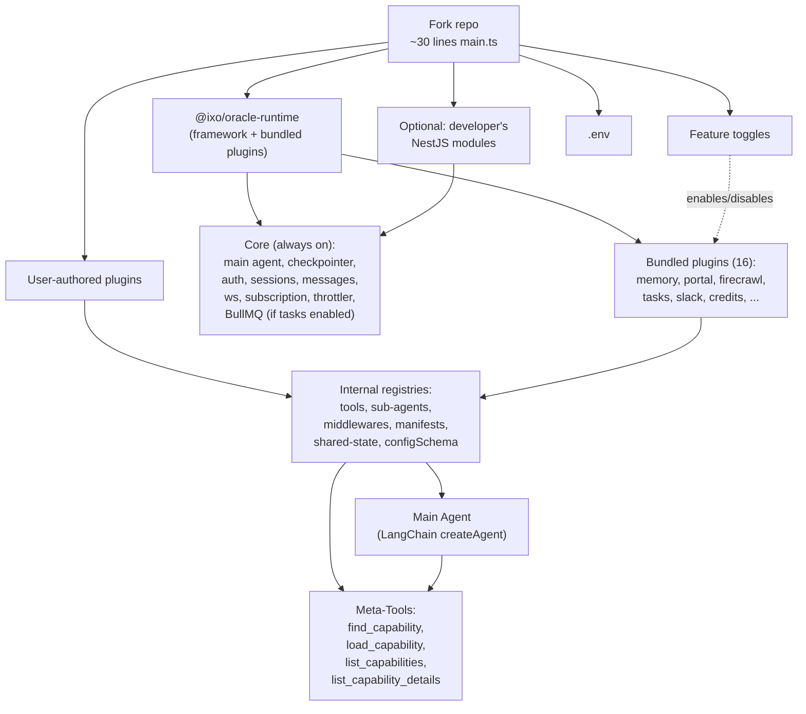

# QiForge Plugin-Based Runtime — Technical Specification

**Ticket:** ORA-219
**Branch:** `feature/ora-219-qiforge-transform-how-we-use-qi-forge-to-be-plugin-based`
**Author:** Yousef / QiForge
**Revision:** v3 — 2026-05-06 (full rewrite from v2 of the same date)
**Stack:** NestJS · LangGraph/LangChain 1.x · Matrix · Zod · TypeScript · Vitest
**Supersedes:** v2 (overengineered) and v1 (had gaps)
**Status:** Spec-ready — single-phase transformation

---

## What changed in v3

v2 was over-engineered. v3 cuts the plugin API down to the smallest thing that actually solves the three problems the team has: easy version updates, plug/unplug freely, dynamic loading without context bloat. The framework's internals (graph state, checkpointer, BullMQ, NestJS controllers, Matrix wiring) stay where they are. Plugins contribute the only three things they actually need to contribute: tools, sub-agents, middlewares — plus an optional shared-state read accessor and an optional config schema.

| What v2 had that v3 drops | Reason |
|---|---|
| `contextSchema` on the plugin | State + context schemas live at mainAgent level, not per-plugin |
| `stateAnnotations` on the plugin | Same — plugins read/write state via middlewares, not by redefining the schema |
| `workers` (BullMQ) on the plugin | BullMQ is internal: agent schedules tasks, agent invokes them. Toggled via `features.tasks` |
| `enrichRequestContext` | Middleware can do this; redundant |
| `nestModules`, `controllers` on the plugin | Out of scope. Developers write their own NestJS modules and pass them at app config level |
| `setup`, `teardown`, `healthCheck`, `failureMode` | Removed — plugins are stateless contributors. If a plugin's `getTools()` throws, runtime logs and skips (matches today's `Promise.allSettled` default for sub-agents) |
| `WorkerContext` | No plugin workers → no need |
| `ctx.storage` abstraction | Don't touch the checkpointer; landmine. Internal services keep using `UserMatrixSqliteSyncService` directly |
| State-field rename + migration shim | Don't change `apps/app/src/graph/state.ts` keys — internal logic, not part of plugin spec |
| Recorded LLM fixtures, plug-matrix property tests, contract auto-tests, coverage gates, cross-version CI | Heavy. Basic `createTestRuntime` only |
| Stability tiers per export, codemods, structured changelog format | Defer to a separate versioning ticket |
| Boot manifest, structured boot-error event taxonomy, full `qiforge inspect` JSON schema | Overkill. Keep `qiforge inspect` as a basic listing |
| Fluent `plugin().chain().build()` builder | Class-based pattern (or POJO via `defineOraclePlugin`) |

| What v3 keeps from v2 | Why |
|---|---|
| Plugin manifests (title, summary, whenToUse, examples, visibility, category, tags) | Goal D — agent-side discovery |
| Three visibility tiers (always / on-demand / silent) | Same |
| Soft deps + `availablePlugins` | Goal C — plug/unplug |
| Shared-state read accessors | You confirmed: include this |
| `configSchema` on the plugin (env vars only) | Plugin-owned env vars merge into the runtime's Zod schema at boot |
| `createOracleApp` entry point | You confirmed: keep it |

| What v3 adds (new from v2) | Why |
|---|---|
| Class-based `OraclePlugin` (with POJO option) | You said "no .chain pattern; class is best" |
| Dynamic plugin loading via `find_capability` + `load_capability` meta-tools, persisted in a new `loadedPlugins` state field | You confirmed: dynamic loading via a tool, saved to state. Prevents context explosion |
| `nestModules` accepted at `createOracleApp` config (NOT per-plugin) + `app.getNestApp()` for direct NestJS access | You confirmed: developers add their own NestJS modules at app level |

The plugin shape is now seven fields. That's the whole API.

---

## Table of Contents

### Part I — Foundations
1. [Executive Summary](#1-executive-summary)
2. [Goals and Non-Goals](#2-goals-and-non-goals)
3. [Mental Model](#3-mental-model)

### Part II — Plugin API
4. [The Plugin Class](#4-the-plugin-class)
5. [The Plugin Manifest](#5-the-plugin-manifest)
6. [The Two Contexts](#6-the-two-contexts)
7. [Soft Deps and Shared State](#7-soft-deps-and-shared-state)
8. [Config Schema](#8-config-schema)

### Part III — Dynamic Plugin Loading
9. [Visibility Tiers and Token Budget](#9-visibility-tiers-and-token-budget)
10. [Meta-Tools](#10-meta-tools)
11. [The `loadedPlugins` State Field](#11-the-loadedplugins-state-field)

### Part IV — Runtime Integration
12. [Internal Registries](#12-internal-registries)
13. [LangGraph Composition](#13-langgraph-composition)
14. [Boot Sequence](#14-boot-sequence)
15. [`createOracleApp` and NestJS Access](#15-createoracleapp-and-nestjs-access)

### Part V — Bundled Plugins
16. [Bundled Plugins Catalog](#16-bundled-plugins-catalog)
17. [Environment Variables by Plugin](#17-environment-variables-by-plugin)

### Part VI — DX
18. [The Starter App](#18-the-starter-app)
19. [Worked Examples](#19-worked-examples)
20. [Testing Harness](#20-testing-harness)
21. [Package Layout](#21-package-layout)

### Part VII — Implementation
22. [Implementation Checklist](#22-implementation-checklist)
23. [Open Decisions](#23-open-decisions)

### Part VIII — Reference
24. [Glossary](#24-glossary)
25. [Appendix — Code grounding (current repo facts)](#25-appendix-code-grounding)

---

# Part I — Foundations

## 1. Executive Summary

QiForge becomes a **plugin-based runtime**. The framework — bootstrap, graph engine, checkpointer, Matrix wiring, sessions, messages, ws, auth, subscription, throttler — stays packaged as **`@ixo/oracle-runtime`**. A fork's `apps/app/` becomes a ~30-line starter that calls `createOracleApp({ identity, features, plugins, nestModules })`.

A **plugin** is the only extension surface. A plugin contributes some combination of:

- **Tools** — what the main agent can call.
- **Sub-agents** — specialized inner agents (memory, portal, firecrawl, editor, etc.) wrapped as tools.
- **Middlewares** — LangChain `AgentMiddleware` instances inserted into the graph.
- **Shared state read accessors** — typed read accessors for state another plugin owns.
- **Config schema** — Zod schema for the plugin's env vars.

That's it. No setup hooks, no health checks, no BullMQ workers, no NestJS modules. If you need those, you wire them outside the plugin — NestJS modules go at `createOracleApp` config; BullMQ is internal and toggled via `features.tasks`.

**Three things matter:**

1. **Modules-as-plugins.** Composio, Memory Engine, Firecrawl, Slack, Tasks, etc. — each becomes a plugin that's enabled/disabled via `features`. Forks add their own plugins via `plugins: [new ClimatePlugin()]`.
2. **Dynamic loading.** Plugins declared `visibility: 'on-demand'` aren't bound to the agent at boot. The agent calls `find_capability(query)` to search, then `load_capability(name)` to load tools for the rest of the thread. Prevents tool-list bloat for forks with many plugins.
3. **No internal-API churn.** `apps/app/src/graph/state.ts` keeps its existing keys. The checkpointer is untouched. Today's `main-agent.ts` (1,052 lines) becomes ~250 lines by replacing inlined sub-agent + tool arrays with registry collects. The transformation respects existing patterns (`Promise.allSettled` for sub-agents, lazy SQLite open, background Matrix init).

The Matrix-backed SQLite checkpointer remains the default and is not pluggable. Storage scaling is tracked separately in `specs/matrix-storage-architecture-review.md`.

## 2. Goals and Non-Goals

### 2.1 Goals

**Goal A — Easy for plugin authors.** A developer writes a class extending `OraclePlugin`, populates a manifest and `getTools()`, and ships. Under 30 minutes from scaffold to working tool. Class-based — same pattern NestJS developers already know.

**Goal B — Easy version updates.** A fork bumps `@ixo/oracle-runtime` and runs. Stable surface (`OraclePlugin`, `PluginManifest`, `RuntimeContext` core fields, `createOracleApp`) does not break across 1.x. Internal-only changes (graph state shape, checkpointer impl, BullMQ wiring) don't affect plugins.

**Goal C — Plug/unplug freely.** Bundled plugins toggle via `features`. User plugins are arrays. Soft deps + `availablePlugins` set let plugins coexist with any subset. Dynamic loading via `find_capability` + `load_capability` keeps token cost bounded as the plugin set grows.

**Goal D — Easy for AI agents.** Structured manifests instead of free-form prompt blobs. Three-tier discovery (Tier-1 always-on, Tier-2 dynamic load, Tier-3 tool descriptions). The agent learns about plugins it didn't know it had via search.

**Goal E — Behavior parity.** Every feature in `apps/app/` today (Memory, Portal, Firecrawl, Domain Indexer, Composio, Sandbox, Skills, Editor, AG-UI, Slack, Tasks, Credits, Claim Processing, Langfuse, Calls, User Preferences) becomes a bundled plugin. Today's `Promise.allSettled` for sub-agent init, background Matrix init, per-user lazy SQLite open — all preserved.

### 2.2 Non-Goals

The plugin API does **not**:

1. **Swap the main agent.** Forks needing a radically different agent build their own app.
2. **Swap the checkpointer.** `UserMatrixSqliteSyncService` + `SqliteSaver` is the contract. Plugins read history via `ctx.history`; they do not persist their own state externally through the framework.
3. **Swap the LLM executor.** LangChain 1.x `createAgent`. Not raw `StateGraph`, not LCEL.
4. **Modify `apps/app/src/graph/state.ts` keys.** Keep `messages`, `config`, `client`, `userContext`, `editorRoomId`, `agActions`, `browserTools`, `mcpUcanContext`, `userPreferences`, `spaceId`, `currentEntityDid` exactly as they are. The only addition is `loadedPlugins`.
5. **Replace primary auth.** DID + Matrix OpenID + UCAN delegation chain stays.
6. **Disable core modules.** Sessions, Messages, WebSocket, Auth, Subscription middleware, Throttler — always on.
7. **Let plugins ship NestJS modules or controllers.** Out of scope. If a developer needs HTTP endpoints, they author a NestJS module separately and pass it via `createOracleApp({ nestModules: [...] })`.
8. **Let plugins define BullMQ workers.** BullMQ is internal — toggled via `features.tasks`.
9. **Define plugin lifecycle hooks** (`setup`, `teardown`, `healthCheck`). Plugins are stateless contributors. If a plugin's `getTools()` throws, the runtime logs and skips it (matching today's `Promise.allSettled` for sub-agents in `main-agent.ts:621`).
10. **Hot-load / hot-unload plugins at runtime.** Plugins resolve at boot. Dynamic *loading into the agent's tool list* via `load_capability` is per-thread state, not plugin install/uninstall.

## 3. Mental Model

### 3.1 Three levers

| Lever | Owner | Purpose | Shape |
|---|---|---|---|
| **Feature toggle** | Fork operator | Turn bundled framework features on/off per deployment | `features: { slack: true, composio: false }` |
| **Plugin** | Fork developer | Add new behavior on top of the framework | `plugins: [new ClimatePlugin()]` |
| **Config** | Fork operator | 12-factor env vars, merged from framework + plugin schemas | `.env`, validated via Zod at boot |

A fork turning Slack on does not require writing a plugin. A fork adding a custom tool does not require flipping a feature. A plugin that ships a new MCP server adds a config schema entry that the fork populates in `.env`.

### 3.2 Two contexts (not three)

| Context | Lifecycle | Has user? |
|---|---|---|
| **`PluginContext`** | Boot-time, lives once | No |
| **`RuntimeContext`** | Per HTTP/WS request | Yes (authenticated) |

The `PluginContext` is what plugin builder methods (`getTools`, `getSubAgents`, `getMiddlewares`) receive. The `RuntimeContext` is what tool handlers, middleware hooks, and sub-agent handlers receive at execution time. There is no `WorkerContext` because plugins don't define BullMQ workers.

### 3.3 The big-picture diagram



---

# Part II — Plugin API

## 4. The Plugin Class

### 4.1 The class

```ts
import type { z } from 'zod';
import type { AgentMiddleware } from 'langchain';
import type { PluginManifest, PluginContext, PluginTool, PluginSubAgent } from '@ixo/oracle-runtime';

export abstract class OraclePlugin {
  abstract readonly name: string;
  abstract readonly version: string;
  abstract readonly manifest: PluginManifest;

  /** Hard dependencies — boot fails if any is missing */
  readonly dependsOn?: string[];

  /** Soft dependencies — plugin loads either way; branches on availability */
  readonly softDependsOn?: string[];

  /** Plugin-owned env vars. Merged into the runtime's Zod schema at boot. */
  readonly configSchema?: z.ZodObject<any>;

  /** Tools the main agent can call. Called once at boot. */
  getTools?(ctx: PluginContext): PluginTool[] | Promise<PluginTool[]>;

  /** Sub-agents the runtime auto-wraps as tools (matching createSubagentAsTool). */
  getSubAgents?(ctx: PluginContext): PluginSubAgent[];

  /** LangChain middlewares inserted into the agent's middleware chain. */
  getMiddlewares?(ctx: PluginContext): AgentMiddleware[];

  /**
   * Read-only accessors this plugin exposes to other plugins via ctx.shared.
   * Pattern: this plugin computes/owns some derived value from state; others read it.
   * Each entry is a function that reads the current graph state and returns a value.
   */
  getSharedState?(): Record<string, (state: any, runCtx: RuntimeContext) => unknown>;
}
```

### 4.2 POJO form (for stateless plugins)

```ts
import { defineOraclePlugin } from '@ixo/oracle-runtime';

export default defineOraclePlugin({
  name: 'hello',
  version: '0.1.0',
  manifest: {
    title: 'Hello',
    summary: 'A trivial demo plugin.',
    whenToUse: ['User says hello'],
  },
  getTools(ctx) {
    return [/* ... */];
  },
});
```

`defineOraclePlugin(spec)` is an identity function that gives the developer type checking on the plugin shape. Both forms (class or POJO) produce the same internal representation.

### 4.3 What the runtime does with each method

- `getTools(ctx)` — called once per request build (the main agent rebuilds per request, matching today's pattern). Returned tools are wrapped to receive `RuntimeContext` instead of raw `runConfig`.
- `getSubAgents(ctx)` — called once per request build. Each `PluginSubAgent` is auto-wrapped via `createSubagentAsTool` (today's helper at `apps/app/src/graph/agents/subagent-as-tool.ts`).
- `getMiddlewares(ctx)` — called once per request build. Inserted after the four always-on middlewares (tool-validation, retry, page-context, safety-guardrail).
- `getSharedState()` — called once at boot. The runtime wires accessors into `RuntimeContext.shared`.

If any of these throws, the runtime logs an error with the plugin name and skips that plugin's contribution (matching `main-agent.ts:621` `Promise.allSettled` semantics for the current 8 sub-agents). The app keeps booting.

### 4.4 Plugin tool and sub-agent shapes

```ts
export interface PluginTool {
  name: string;
  description: string;
  schema: z.ZodType;
  handler: (args: any, ctx: RuntimeContext) => Promise<unknown>;
  /** Override visibility — by default inherits from the plugin's manifest.visibility */
  visibility?: 'always' | 'on-demand' | 'silent';
}

export interface PluginSubAgent {
  /** Tool name the agent will see (e.g. 'call_memory_agent') */
  name: string;
  description: string;
  systemPrompt: string | ((ctx: PluginContext) => string);
  tools: PluginTool[] | ((ctx: PluginContext) => PluginTool[]);
  /** LLM role; default 'subagent' */
  model?: ModelRole;
  /** Sub-agent-scoped middleware (e.g. summarization for long conversations) */
  middlewares?: AgentMiddleware[];
  /** Forward parent's tool calls into this sub-agent's tool list (e.g. portal pattern) */
  forwardTools?: boolean;
  /** Called after sub-agent completes; can emit follow-up events */
  onComplete?: (result: string, ctx: RuntimeContext) => Promise<void>;
}
```

### 4.5 Why class-based (not fluent builder)

A class is what NestJS developers already write. It supports:

- **Constructor parameters** (a plugin factory: `new ClimatePlugin({ rateLimit: 100 })`)
- **Internal state** (caching, MCP client refs, etc.)
- **Inheritance** (one plugin extending another for variations)
- **Test mocking** (subclass with overrides)

The fluent `.tool().describe().schema().handle()` builder forced everything into a single nested call site and made testing harder. Classes are familiar, debuggable, and obvious.

POJOs cover the stateless case where a class is overhead.

## 5. The Plugin Manifest

The manifest is the agent's interface to the plugin. Structured, machine-readable, used to compose the system prompt and to power dynamic loading.

### 5.1 Schema

```ts
export interface PluginManifest {
  /** Human-readable name */
  title: string;

  /** One-line description shown in Tier-1 prompt for 'always' plugins */
  summary: string;

  /** Triggers — when the agent should consider this plugin */
  whenToUse: string[];

  /** Anti-patterns — when the agent should NOT use this plugin */
  whenNotToUse?: string[];

  /** Few-shot examples teaching the agent how to invoke the plugin */
  examples?: ManifestExample[];

  /** Categorization for grouping and filtering */
  tags?: string[];
  category?:
    | 'data' | 'communication' | 'automation' | 'memory'
    | 'integration' | 'ui' | 'auth' | 'observability' | 'core';

  /**
   * Discovery and loading mode:
   *  - 'always'    → tools bound to agent at boot; listed in Tier-1 prompt
   *  - 'on-demand' → tools NOT bound; manifest indexed for find_capability;
   *                  agent calls load_capability(name) to load
   *  - 'silent'    → invisible to agent; runs as middleware-only
   *
   * Default: 'on-demand'. Be deliberate about 'always' — it costs tokens.
   */
  visibility?: 'always' | 'on-demand' | 'silent';

  /** Stability hint for the agent: 'experimental' plugins get a warning footnote */
  stability?: 'stable' | 'beta' | 'experimental';
}

export interface ManifestExample {
  user: string;       // representative user message
  thought?: string;   // optional reasoning
  tool: string;       // tool the agent should call
  args?: Record<string, unknown>;
}
```

### 5.2 Validation (boot-time)

The runtime validates each manifest at boot:

- `summary` is non-empty
- `whenToUse` ≥ 1 entry if `visibility !== 'silent'`
- All `examples[].tool` reference a tool actually registered by this plugin
- `tags`, if present, are lowercase

Soft constraints (warned, not errored): `summary` ≤ 120 chars; `whenToUse` ≤ 8 bullets ≤ 100 chars each.

Violation of a hard constraint = boot warning + plugin loads in degraded discovery mode (won't be matched by `find_capability`). Boot does not fail — matches today's tolerance for missing fields.

### 5.3 Manifest example

```ts
const climateManifest: PluginManifest = {
  title: 'Climate Data',
  summary: 'Facility emissions and carbon footprint analysis.',
  whenToUse: [
    'User asks about CO2 emissions for a facility',
    'User mentions carbon footprint or greenhouse gases',
    'User wants to compare emissions across facilities',
  ],
  whenNotToUse: ['General weather questions'],
  examples: [
    { user: 'Emissions for Plant 42 in Q1', tool: 'get_emissions',
      args: { facilityId: 'plant-42', period: 'Q1-2026' } },
  ],
  tags: ['climate', 'emissions', 'sustainability'],
  category: 'data',
  visibility: 'always',
  stability: 'stable',
};
```

## 6. The Two Contexts

### 6.1 PluginContext — boot-time

Passed to plugin methods called at request build time (`getTools`, `getSubAgents`, `getMiddlewares`). Lives once per request build.

```ts
export interface PluginContext<TConfig = MergedConfig> {
  /** Merged Zod-validated env vars (core + all loaded plugins' configSchemas) */
  config: TConfig;

  /** Identity of this oracle (set by the fork at createOracleApp) */
  identity: { name: string; org: string; description: string; entityDid: string };

  /** Set of plugin names currently loaded — drives soft-dep branching */
  availablePlugins: ReadonlySet<string>;

  /** Plugin-scoped logger (auto-prefixed with the plugin's name) */
  logger: Logger;
}
```

No user, no session, no live socket, no request data.

### 6.2 RuntimeContext — per-request

Passed to tool handlers, sub-agent handlers, and to plugin middlewares' hook functions. Built fresh per graph invocation.

```ts
export interface RuntimeContext<TConfig = MergedConfig> {
  /** Authenticated user identity (validated by core auth middleware) */
  user: {
    did: string;
    matrixUserId: string;            // e.g. '@did-ixo-ixo1abc:ixo.world'
    matrixOpenIdToken?: string;
    homeServer: string;
    ucanDelegation?: UcanDelegation;
    timezone?: string;
    currentTime?: string;
  };

  /** Session info from SessionsService */
  session: {
    id: string;                       // = thread_id; thread root eventId
    client: 'portal' | 'matrix' | 'slack';
    wsId?: string;
    requestId: string;
    roomId?: string;
  };

  /** Read-only view over the graph state's history */
  history: {
    messages: readonly BaseMessage[];
    recent: (n: number) => BaseMessage[];
    userContext: UserContextData;     // memory enrichment from existing state.userContext
    state: ReadonlyState;             // typed view over Annotation.Root
  };

  /** Same merged Zod-validated env */
  config: TConfig;

  /** Set of plugin names currently loaded (boot-fixed) */
  availablePlugins: ReadonlySet<string>;

  /** Plugins the agent has loaded for THIS thread via load_capability */
  loadedPlugins: ReadonlySet<string>;

  /** Per-room secrets (JWE-encrypted, 24h cache, today's SecretsService) */
  secrets: {
    getIndex: () => Promise<SecretIndex>;
    getValues: (keys: string[]) => Promise<Record<string, string>>;
  };

  /** Matrix client, scoped operations only */
  matrix: {
    postToRoom: (roomId: string, content: unknown) => Promise<string>;
    getRoomState: (roomId: string) => Promise<RoomStateSnapshot>;
    getEventById: (roomId: string, eventId: string) => Promise<MatrixEvent>;
  };

  /** UCAN authorization helpers */
  ucan: {
    requireCapability: (resource: string, action: string) => void;
    hasCapability: (resource: string, action: string) => boolean;
    mintInvocation: (target: { did: string; capability: string }) => Promise<string>;
  };

  /** LLM provider */
  llm: {
    get: (role: ModelRole, params?: ChatOpenAIFields) => BaseChatModel;
  };

  /** Typed event emitter (today's @ixo/events 7 event types) */
  emit: {
    toolCall: (payload: ToolCallEventPayload) => void;
    actionCall: (payload: ActionCallEventPayload) => void;
    renderComponent: (payload: RenderComponentEventPayload) => void;
    reasoning: (payload: ReasoningEventPayload) => void;
    browserToolCall: (payload: BrowserToolCallEventPayload) => void;
    router: (payload: RouterEventPayload) => void;
    messageCacheInvalidation: (payload: MessageCacheInvalidationPayload) => void;
  };

  /** Plugin-scoped logger */
  logger: Logger;

  /** Propagates from the HTTP request / graph invocation */
  abortSignal: AbortSignal;

  /** Read accessors for state owned by other plugins (see §7.3) */
  shared: SharedAccessors;
}
```

### 6.3 Mapping today's singleton reaches

| Today | Tomorrow |
|---|---|
| `SecretsService.getInstance().getSecretIndex(roomId)` | `ctx.secrets.getIndex()` |
| `SecretsService.getInstance().loadSecretValues(roomId, idx)` | `ctx.secrets.getValues(keys)` |
| `MatrixManager.getInstance().getClient()` | `ctx.matrix.*` (scoped methods only) |
| `getProviderChatModel('main', {})` | `ctx.llm.get('main')` |
| `new Logger('MyTool')` | `ctx.logger` |
| `rootEventEmitter.emit('tool_call', ...)` | `ctx.emit.toolCall(...)` |
| `getConfig().get('X')` | `ctx.config.X` (typed via merged Zod schema) |
| `req.authData.did` | `ctx.user.did` |
| `state.userContext` | `ctx.history.userContext` |
| `state.messages` | `ctx.history.messages` |

Internal services (`UserMatrixSqliteSyncService`, `UserSkillsService`, `UserPreferencesService`) are **not** exposed via `RuntimeContext`. They're consumed internally by their respective bundled plugins.

## 7. Soft Deps and Shared State

### 7.1 The two dependency kinds

```ts
class ClaimProcessingPlugin extends OraclePlugin {
  readonly name = 'claim-processing';
  readonly dependsOn = ['credits'];      // hard: boot fails if missing
  readonly softDependsOn = ['memory'];   // soft: optional
}
```

- **Hard deps (`dependsOn`):** plugin literally cannot function. Topological sort errors at boot if missing or cyclic.
- **Soft deps (`softDependsOn`):** plugin works either way; runtime checks `availablePlugins.has(...)` to enrich behavior.

### 7.2 The `availablePlugins` set

Both `PluginContext` and `RuntimeContext` expose `availablePlugins: ReadonlySet<string>`. Plugins branch on it:

```ts
class TasksPlugin extends OraclePlugin {
  readonly softDependsOn = ['memory'];

  getTools(ctx: PluginContext) {
    const tools = [createTaskTool, listTasksTool, cancelTaskTool];
    if (ctx.availablePlugins.has('memory')) {
      tools.push(rememberTaskContextTool);
    }
    return tools;
  }
}
```

Inside a tool handler:

```ts
async (args, ctx: RuntimeContext) => {
  if (ctx.availablePlugins.has('memory')) {
    const profile = ctx.shared.userProfile;  // typed via memory plugin's sharedState
    // use enriched profile
  }
  // do the work either way
}
```

### 7.3 Shared state — read-only accessors

Plugins don't own state schema (state lives at mainAgent level). But many plugins compute or read derived values that other plugins need to read. The `getSharedState()` method exposes typed read accessors:

```ts
class MemoryPlugin extends OraclePlugin {
  readonly name = 'memory';

  getSharedState() {
    return {
      // Other plugins read this as ctx.shared.userProfile
      userProfile: (state: any, runCtx: RuntimeContext) => state.userContext,
    };
  }
}

class PortalPlugin extends OraclePlugin {
  readonly name = 'portal';
  readonly softDependsOn = ['memory'];

  getTools(ctx: PluginContext) {
    return [
      tool(
        async (args, runCtx: RuntimeContext) => {
          const profile = runCtx.shared.userProfile;  // undefined if memory not loaded
          // ...
        },
        { /* ... */ }
      ),
    ];
  }
}
```

The runtime's `SharedStateRegistry` collects all `getSharedState()` returns at boot and builds the `SharedAccessors` type. If `memory` isn't loaded, `runCtx.shared.userProfile` is `undefined` (TypeScript narrows correctly via the `availablePlugins` set).

**Read-only by design.** A plugin can expose a getter; it cannot expose a setter. Mutating shared state happens via the owning plugin's own middleware writing to its underlying field — same way today's middleware writes to graph state.

### 7.4 Build-time validation

The plugin loader runs:

1. **Topo sort** by `dependsOn` — error on cycles or missing.
2. **Soft-dep logging** — single line per soft dep that is *not* present.
3. **Tool name collision** — error (flat namespace; auto-prefixing hurts prompt clarity).
4. **Sub-agent name collision** — error.
5. **Shared-state key collision** — error if two plugins expose `ctx.shared.<key>` with the same key.
6. **Manifest validation** — see §5.2.
7. **Config schema collision** — Zod `.extend()` merges; collision = later definition wins, with a warning. Convention: each plugin prefixes its env vars (`CLIMATE_*`, `SLACK_*`).

## 8. Config Schema

A plugin declares its own env vars via `configSchema`. The runtime merges all schemas at boot into a single Zod object, validates `process.env` against it, and exposes the typed result on `ctx.config`.

```ts
class ClimatePlugin extends OraclePlugin {
  readonly configSchema = z.object({
    CLIMATE_API_KEY: z.string(),
    CLIMATE_API_BASE_URL: z.url().default('https://api.climatesvc.example'),
  });

  getTools(ctx: PluginContext) {
    return [
      tool(
        async ({ facilityId }, runCtx) => {
          // ctx.config.CLIMATE_API_KEY is typed as `string`
          const url = `${ctx.config.CLIMATE_API_BASE_URL}/facilities/${facilityId}`;
          // ...
        },
        { /* ... */ }
      ),
    ];
  }
}
```

If the env var is missing, boot fails with a structured error naming the plugin and the missing var:

```
[boot-error] Plugin 'climate' requires CLIMATE_API_KEY env var.
```

Disabling the plugin (via `features` for bundled plugins, or by removing it from `plugins: [...]` for user plugins) removes its config requirements automatically.

The CLI `qiforge env` prints all required env vars across currently-installed plugins, so an operator never has to grep across files.

---

# Part III — Dynamic Plugin Loading

## 9. Visibility Tiers and Token Budget

The agent has a finite system-prompt + tool-list token budget. Three visibility tiers manage that budget.

| Visibility | Tools bound at boot? | Listed in Tier-1 prompt? | Discoverable via `find_capability`? |
|---|---|---|---|
| `'always'` | Yes | Yes | Yes |
| `'on-demand'` | **No** — until `load_capability(name)` is called | No | Yes |
| `'silent'` | Yes | No | No |

**Default visibility: `'on-demand'`.** Be deliberate about marking a plugin `'always'`. Each `'always'` plugin costs ~80 tokens in the Tier-1 block and ~100-300 tokens for its tool schemas in the bound tool list.

**Recommended distribution for the bundled set:**

- `'always'` (≈7 plugins, ~600 tokens Tier-1): memory, skills, firecrawl, domain-indexer, editor, agui, tasks
- `'on-demand'` (≈4 plugins): portal, slack, calls, composio
- `'silent'` (≈5 plugins): credits, claim-processing, langfuse, sandbox, userPreferences

User plugins default to `'on-demand'`. Forks override per plugin.

### 9.1 Tier-1 prompt block

Composed at request build time from all currently-`'always'` plugins:

```
## Available Capabilities

- memory: Long-term memory of user facts, preferences, past conversations.
- tasks: Schedule background work or recurring jobs.
- skills: Run specialized workflows from the skills registry.
- firecrawl: Web scraping and search.
- domain-indexer: Domain analysis and entity lookup.
- editor: Edit collaborative documents (BlockNote).
- agui: AG-UI copilot for Portal.

For more capabilities, call `find_capability(query)` to search by intent,
then `load_capability(name)` to make its tools available.
```

Format: `- {name}: {summary}`. ~80 tokens per plugin.

### 9.2 Tier-2 — dynamic loading via meta-tools

See §10.

### 9.3 Tier-3 — tool-level descriptions

Standard LangChain tool descriptions and schemas. Each tool's description is auto-prefixed with the plugin's title for grounding:

```
[Climate Data] Fetch emissions for a facility by ID and period.
```

Prefix is added by the runtime, not the author.

## 10. Meta-Tools

Four built-in tools the agent always has, regardless of plugins loaded:

```ts
// ─── 1. find_capability ─────────────────────────────────────
{
  name: 'find_capability',
  description:
    'Search for a capability by user intent or topic. ' +
    'Returns ranked plugin matches you can then load with load_capability.',
  schema: z.object({
    query: z.string(),
    limit: z.number().int().default(5),
  }),
  // returns: Array<{ name, score, summary, matchReason }>
  //
  // Searches manifests of plugins with visibility 'always' or 'on-demand'
  // (silent plugins are excluded). Today: TF-IDF over whenToUse + tags + summary.
  // Tomorrow: optional embeddings (open decision §23).
}

// ─── 2. load_capability ─────────────────────────────────────
{
  name: 'load_capability',
  description:
    'Load a capability for the rest of this conversation. ' +
    "After loading, the capability's tools are usable.",
  schema: z.object({ name: z.string() }),
  // side effect: appends `name` to state.loadedPlugins (deduplicated).
  // The next turn's graph build includes the plugin's tools.
  // returns: { loaded: true, tools: Array<{ name, description }> }
  //
  // If `name` is already loaded or 'always', returns { alreadyAvailable: true }.
  // If `name` is 'silent' or doesn't exist, throws (caller should call find_capability first).
}

// ─── 3. list_capabilities ───────────────────────────────────
{
  name: 'list_capabilities',
  description: 'List all available capabilities and their summaries.',
  schema: z.object({
    includeOnDemand: z.boolean().default(true),
    includeSilent: z.boolean().default(false),
  }),
  // returns: Array<{ name, summary, visibility, loaded, category, tags }>
}

// ─── 4. list_capability_details ─────────────────────────────
{
  name: 'list_capability_details',
  description: 'Get full details on a specific capability, including examples and tool list.',
  schema: z.object({ name: z.string() }),
  // returns: PluginManifest & { tools: Array<{ name, description, schemaSummary }> }
}
```

These four are registered by the runtime, not by any plugin. They are part of the core contract.

## 11. The `loadedPlugins` State Field

This is the **only** addition to `apps/app/src/graph/state.ts`. No renames, no other new fields.

```ts
// apps/app/src/graph/state.ts (existing fields preserved; one new field added)
import { Annotation, MessagesAnnotation } from '@langchain/langgraph';

export const MainAgentGraphState = Annotation.Root({
  messages: MessagesAnnotation.spec.messages,
  config: Annotation<{ wsId?: string; did: string }>({ /* unchanged */ }),
  client: Annotation<'portal' | 'matrix' | 'slack'>({ /* unchanged */ }),
  editorRoomId: Annotation<string | undefined>({ /* unchanged */ }),
  spaceId: Annotation<string | undefined>({ /* unchanged */ }),
  currentEntityDid: Annotation<string | undefined>({ /* unchanged */ }),
  browserTools: Annotation<BrowserToolCallDto[] | undefined>({ /* unchanged */ }),
  agActions: Annotation<AgActionDto[] | undefined>({ /* unchanged */ }),
  userContext: Annotation<UserContextData>({ /* unchanged */ }),
  mcpUcanContext: Annotation<{ invocations: Record<string, string> } | undefined>({ /* unchanged */ }),
  userPreferences: Annotation<UserPreferences | undefined>({ /* unchanged */ }),

  // ── NEW: dynamically loaded plugin names for this thread ──
  loadedPlugins: Annotation<string[]>({
    reducer: (current, update) => Array.from(new Set([...(current ?? []), ...(update ?? [])])),
    default: () => [],
  }),
});
```

**Lifetime:** per thread. Cleared on new thread. If the agent loaded `composio` in thread A, that loading does not affect thread B. Fresh discovery each conversation. (Open decision §23 — could be configurable per-fork.)

**Reducer:** union via Set. `load_capability` calls only ever add, never remove. The loaded set grows monotonically over a conversation.

### 11.1 The graph rebuild loop

Today's `apps/app/src/graph/agents/main-agent.ts:977-1023` rebuilds the agent per request. With dynamic loading, the rebuild reads `state.loadedPlugins` and includes those plugins' tools:

```ts
const eagerTools = await collectToolsByVisibility(registries, 'always', buildCtx);
const loadedLazyTools = await collectToolsForLoaded(
  registries,
  state.loadedPlugins ?? [],
  buildCtx,
);
const tools = [
  ...buildMetaTools(registries.manifests),
  ...eagerTools,
  ...loadedLazyTools,
  ...subAgentTools,
];
```

Cost per turn: O(eager + loaded). If a fork has 50 lazy plugins but only 3 are loaded for the current thread, the agent sees 3 sets of tool schemas, not 50.

### 11.2 Why state, not runtime context

Putting `loadedPlugins` in `runtime.context` (LangGraph's per-run channel) would reset it every invocation — the agent would re-load every turn. State persists across turns within a thread, which is what we want. The checkpointer (Matrix-backed SQLite) saves it for free.

---

# Part IV — Runtime Integration

## 12. Internal Registries

Six registries replace the inlined arrays in today's `main-agent.ts:817-1011`.

| Registry | Collects from | Consumed by |
|---|---|---|
| `ToolRegistry` | `plugin.getTools(buildCtx)` | `createAgent({ tools })`, filtered by visibility + loadedPlugins |
| `SubAgentRegistry` | `plugin.getSubAgents(buildCtx)` | wrapped via `createSubagentAsTool`, fed to `createAgent({ tools })` |
| `MiddlewareRegistry` | `plugin.getMiddlewares(buildCtx)` | `createAgent({ middleware })` |
| `ManifestRegistry` | `plugin.manifest` | Tier-1 prompt block, all 4 meta-tools |
| `ConfigSchemaRegistry` | `plugin.configSchema` | Merged into env Zod schema at boot |
| `SharedStateRegistry` | `plugin.getSharedState()` | Builds `runtimeCtx.shared` accessors |

That's it. No nest module registry, no worker registry, no enricher registry, no health registry, no lifecycle registry.

### 12.1 Collision rules

- **Tools:** flat namespace; collision = boot error.
- **Sub-agents:** same as tools (since they wrap into tools).
- **Shared-state keys:** collision = boot error.
- **Manifest titles:** can collide (display only); authors warned but not blocked.
- **Middlewares:** no names, order-based; ordering follows topo sort.
- **Env schema (configSchema):** Zod `.extend()` merges; collision = later wins, with warning. Convention: prefix per plugin.

### 12.2 Order rules

- Topo sort by `dependsOn` defines a deterministic order.
- Tools are emitted in topo order (matters for prompt determinism, helps LLM caching).
- Middlewares run in topo order (matters for behavior — `beforeModel` from earlier-registered plugins fires first).
- Tier-1 prompt block lists plugins alphabetically (predictable for the LLM).

## 13. LangGraph Composition

Today's `main-agent.ts` is 1,052 lines. With plugins it shrinks to **~250 lines** by replacing the inlined sub-agent + tool + middleware lists with registry collects. The MCP setup, UCAN minting, secrets loading, prompt template, and per-request glue stay — that's not duplication, it's the actual work.

### 13.1 The new `createMainAgent`

```ts
// @ixo/oracle-runtime/src/graph/main-agent.ts
import { createAgent } from 'langchain';
import { Annotation } from '@langchain/langgraph';

export async function createMainAgent({
  registries,
  identity,
  config,
  requestCtx,
  ambient,
  state,
  availablePlugins,
}: MainAgentArgs): Promise<CompiledAgent> {
  const buildCtx: PluginContext = {
    config,
    identity,
    availablePlugins,
    logger: ambient.logger.child({ component: 'main-agent' }),
  };

  // ── Existing per-request setup (preserved from today's code) ──
  const userMatrixId = await deriveMatrixUserId(requestCtx.user.did);
  const memoryHeaders = await mintMemoryHeaders(requestCtx, ambient);
  const sandboxHeaders = await mintSandboxHeaders(requestCtx, ambient);
  const composioHeaders = await mintComposioHeaders(requestCtx, ambient);
  const secrets = await loadUserSecrets(requestCtx, ambient);

  // ── Tools: meta-tools + eager + dynamically-loaded + sub-agents ──
  const eagerTools = await collectToolsByVisibility(registries, 'always', buildCtx);
  const loadedLazyTools = await collectToolsForLoaded(
    registries,
    state.loadedPlugins ?? [],
    buildCtx,
  );
  const subAgentTools = await collectSubAgentsWithFallback(
    registries.subAgents,
    buildCtx,
    requestCtx,
    ambient,
  );
  const silentTools = await collectToolsByVisibility(registries, 'silent', buildCtx);

  const tools = [
    ...buildMetaTools(registries.manifests),  // find_capability, load_capability, etc.
    ...eagerTools,
    ...loadedLazyTools,
    ...silentTools,
    ...subAgentTools,
  ].map((t) => wrapPluginTool(t, ambient));

  // ── Middlewares: 4 always-on + plugin-contributed (in topo order) ──
  const middleware = [
    createToolValidationMiddleware(),       // existing
    toolRetryMiddleware(),                   // LangChain built-in
    createPageContextMiddleware(),           // existing
    createSafetyGuardrailMiddleware(),       // existing
    ...(await registries.middlewares.collect(buildCtx)),
  ];

  // ── Prompt: Tier-1 block + base + existing context fields ──
  const prompt = await composePrompt({
    base: AI_ASSISTANT_PROMPT,
    oracleContext: buildOracleContext(identity),
    operationalMode: resolveOperationalMode(requestCtx),
    capabilityBlock: registries.manifests.renderTier1(eagerPluginNames),
    loadedSection: registries.manifests.renderLoadedSection(state.loadedPlugins ?? []),
    userContext: requestCtx.history.userContext,
    timeContext: formatTimeContext(requestCtx.user.timezone, requestCtx.user.currentTime),
    userPreferences: state.userPreferences,
    editorContext: state.editorRoomId ? buildEditorContext(state) : null,
    slackFormatting: requestCtx.session.client === 'slack',
    userSecretsContext: renderSecretsContext(secrets),
    composioContext: availablePlugins.has('composio')
      ? renderComposioContext(composioHeaders)
      : null,
  });

  return createAgent({
    stateSchema: MainAgentGraphState,    // existing schema + loadedPlugins
    tools,
    middleware,
    prompt,
    model: ambient.llm.get('main', resolveModelOverride(identity)),
    checkpointer: await ambient.checkpointerFactory.forUser(requestCtx.user.did),
  });
}
```

### 13.2 Sub-agent fallback

Preserves today's `Promise.allSettled` semantics:

```ts
async function collectSubAgentsWithFallback(
  subAgents: SubAgentRegistry,
  buildCtx: PluginContext,
  requestCtx: RequestContext,
  ambient: AmbientServices,
): Promise<PluginTool[]> {
  const all = subAgents.collectWithMeta(buildCtx);
  const results = await Promise.allSettled(
    all.map(async ({ pluginName, subAgent }) => {
      try {
        return wrapSubagentAsTool(subAgent, requestCtx, ambient);
      } catch (err) {
        ambient.logger.error({ pluginName, err }, 'sub-agent init failed; skipping');
        return null;
      }
    }),
  );
  return results
    .filter((r): r is PromiseFulfilledResult<PluginTool | null> => r.status === 'fulfilled')
    .map((r) => r.value)
    .filter((v): v is PluginTool => v !== null);
}
```

If a sub-agent's init throws, log and skip. Same as `main-agent.ts:621` today.

### 13.3 Tool wrapping

Every plugin tool is wrapped to receive `RuntimeContext` instead of raw `runConfig`:

```ts
function wrapPluginTool(toolDef: PluginToolDef, ambient: AmbientServices) {
  return tool(
    async (args, runConfig) => {
      const ctx = buildRuntimeContext(runConfig, ambient);
      return await toolDef.handler(args, ctx);
    },
    {
      name: toolDef.name,
      description: prefixWithPluginTitle(toolDef.description, toolDef.pluginTitle),
      schema: toolDef.schema,
    },
  );
}
```

`buildRuntimeContext` synthesizes the per-request context from LangGraph's `runtime.context`, the current `state`, and the captured `ambient` services.

### 13.4 LangChain primitive mapping

| Plugin capability | LangChain primitive | How it plugs in |
|---|---|---|
| `plugin.getTools` | `StructuredTool[]` | `createAgent({ tools })` (filtered by visibility + loaded) |
| `plugin.getSubAgents` | `StructuredTool[]` (via `createSubagentAsTool`) | Same array as tools |
| `plugin.getMiddlewares` | `AgentMiddleware[]` | `createAgent({ middleware })` |
| `plugin.manifest` | Composed into prompt | `createAgent({ prompt })` |
| `plugin.configSchema` | Zod object | Merged into env Zod schema at boot |
| `plugin.getSharedState` | Read accessors | Wired into `RuntimeContext.shared` |
| Built-in meta-tools | `StructuredTool[]` | Always added by runtime |
| Checkpointer | `BaseCheckpointSaver` | Always Matrix-backed SQLite — not exposed |

## 14. Boot Sequence

Deterministic and observable. Preserves today's background Matrix init pattern.

### 14.1 Phase order

1. **Plugin resolution** — feature toggles + bundled plugins + user plugins → final list. Auto-detect from env vars where applicable.
2. **Topological sort** — by `dependsOn`. Errors on cycles or unmet hard deps.
3. **Soft-dep logging** — single line per soft dep that is not present.
4. **Schema merge** — fold every plugin's `configSchema` into a single Zod object.
5. **Env validation** — parse `process.env` against the merged schema. Errors list the plugin owning each missing var.
6. **Manifest validation** — see §5.2.
7. **Registry population** — each plugin registers into the 6 registries.
8. **NestJS bootstrap** — `AppModule` imports core modules + developer's `nestModules` (passed at config). Controllers register. DI resolves.
9. **Matrix init** — non-blocking; HTTP listen does not wait. Existing pattern preserved (`main.ts:121`).
10. **HTTP listen** — server starts accepting requests.

Steps 1-7 are blocking. Step 9 (Matrix init) and step 8 (NestJS DI graph) overlap.

### 14.2 Boot errors

Every boot error names the offending plugin and a remediation hint:

```
[boot-error] Plugin 'tasks' requires REDIS_URL env var.
            Set REDIS_URL or disable: features: { tasks: false }

[boot-error] Plugin 'claim-processing' depends on 'credits', which is not loaded.
            Add credits to features, or remove claim-processing.

[boot-error] Tool name collision: 'send_message' is registered by both 'slack' and 'matrix'.
            Rename one of them.
```

Pretty output to stderr. Optionally a single JSON line per error if `LOG_FORMAT=json` (for log aggregators).

### 14.3 `qiforge inspect`

A CLI command (and HTTP endpoint at `GET /health/plugins`) that prints the resolved registry:

```
$ qiforge inspect
Runtime: 1.0.0
Identity: ClimateOracle (Carbon DAO, did:ixo:...)

Plugins (8):
  ✓ memory          v1.0.0  always       (sub-agent, middleware)
  ✓ tasks           v1.0.0  always       (sub-agent, 0 BullMQ queues — feature off)
  ✓ skills          v1.0.0  always       (depends on sandbox)
  ✓ firecrawl       v1.0.0  always       (sub-agent)
  ✓ editor          v1.0.0  always       (sub-agent)
  ✓ langfuse        v1.0.0  silent       (middleware)
  ✓ climate         v1.0.0  always       (custom; tools: get_emissions)
  ✓ webhook         v1.0.0  on-demand    (custom; tools: list_recent_webhooks)

Disabled (2): slack (no SLACK_BOT_OAUTH_TOKEN), composio (no COMPOSIO_API_KEY)
Cascaded off (1): claim-processing (depends on credits which is off)

Tier-1 prompt: 547 tokens
Soft-dep gaps: tasks: memory (loaded ✓), portal: editor (loaded ✓)
Collisions: none
Warnings: none
```

`qiforge inspect --json` emits the same as JSON for tooling.

`qiforge env` prints a `.env` template across all currently-installed plugins.

## 15. `createOracleApp` and NestJS Access

The fork's `main.ts` calls `createOracleApp` to bootstrap the runtime. Two ways to add NestJS-side things: pass modules at config, or grab the running app and customize directly.

### 15.1 The signature

```ts
import type { Type, INestApplication } from '@nestjs/common';

export interface CreateOracleAppOptions {
  identity: { name: string; org: string; description: string; entityDid: string };
  features?: Partial<Record<BundledFeatureName, boolean | 'auto'>>;
  plugins?: OraclePlugin[];
  /** Developer's own NestJS modules. Spread into AppModule.imports. */
  nestModules?: Type[];
}

export interface OracleApp {
  /** The underlying INestApplication. Use for direct customization. */
  getNestApp(): INestApplication;

  /** Plugin status snapshot (per-plugin loaded state) */
  plugins: { status(): PluginStatusReport };

  /** Pre-listen hook (before HTTP starts accepting) */
  beforeListen(fn: (nestApp: INestApplication) => Promise<void> | void): void;

  /** Subscribe to plugin status changes (load/unload events) */
  onPluginStatusChange(handler: (event: { plugin: string; from: string; to: string }) => void): void;

  /** Start the HTTP server */
  listen(port: number): Promise<void>;
}

export function createOracleApp(opts: CreateOracleAppOptions): Promise<OracleApp>;
```

### 15.2 Two patterns side by side

```ts
// Pattern A — pass modules at config
const app = await createOracleApp({
  identity: { /* ... */ },
  features: { slack: false },
  plugins: [new ClimatePlugin(), webhookPlugin],
  nestModules: [
    MyCustomModule,        // your own NestJS module
    AnotherModule,
  ],
});

// Pattern B — grab the running NestApp for direct customization
const nestApp = app.getNestApp();
nestApp.use(myExpressMiddleware);
nestApp.useGlobalFilters(new MyExceptionFilter());

await app.listen(3000);
```

Both patterns are supported. Most forks only need Pattern A. Pattern B is the escape hatch for advanced cases.

### 15.3 What's automatically wired into `AppModule`

```ts
@Module({
  imports: [
    SessionsModule,         // always
    MessagesModule,         // always
    WsModule,               // always
    SecretsModule,          // always
    UcanModule,             // always
    AuthModule,             // always
    SubscriptionModule,     // always
    ThrottlerModule,        // always
    ...bundledPluginModules,  // from features (e.g. TasksModule if features.tasks)
    ...userNestModules,     // from createOracleApp({ nestModules })
  ],
  // ...
})
class RuntimeAppModule {}
```

Bundled plugin NestJS modules (Tasks, Slack, Calls, etc.) come from inside the runtime package — not user-authored. The user only contributes `nestModules` for their own modules.

---

# Part V — Bundled Plugins

## 16. Bundled Plugins Catalog

Every feature shipping today becomes a bundled plugin.

| Plugin | Default | Toggle | Visibility | Notes |
|---|---|---|---|---|
| `memoryPlugin` | ON | `features.memory: false` | `always` | Memory sub-agent + userContext enrichment + Memory Engine MCP |
| `portalPlugin` | ON | `features.portal: false` | `on-demand` | Portal sub-agent (browser tools forwarded) |
| `firecrawlPlugin` | ON | `features.firecrawl: false` | `always` | Firecrawl sub-agent + tools + MCP |
| `domainIndexerPlugin` | ON | `features.domainIndexer: false` | `always` | Domain indexer sub-agent |
| `composioPlugin` | auto (`COMPOSIO_API_KEY`) | `features.composio: false` | `on-demand` | Composio tool catalog |
| `sandboxPlugin` | ON | `features.sandbox: false` | `silent` | Sandbox MCP tools (used internally by skills) |
| `skillsPlugin` | ON | `features.skills: false`; `dependsOn: ['sandbox']` | `always` | Skills registry + UCAN-authenticated calls |
| `editorPlugin` | ON | `features.editor: false` | `always` | BlockNote editor sub-agent + tools |
| `aguiPlugin` | ON | `features.agui: false` | `always` | AG-UI agent (Portal copilot) |
| `slackPlugin` | auto (`SLACK_BOT_OAUTH_TOKEN`) | `features.slack: false` | `on-demand` | Slack transport + formatting prompt |
| `tasksPlugin` | auto (`REDIS_URL`) | `features.tasks: false` | `always` | TasksModule + 4 BullMQ queues + task-manager sub-agent |
| `creditsPlugin` | ON unless `DISABLE_CREDITS=true` | `features.credits: false` | `silent` | Subscription middleware + token limiter |
| `claimProcessingPlugin` | follows credits | `dependsOn: ['credits']` | `silent` | Claim signing + BullMQ claim worker |
| `langfusePlugin` | auto (3 env vars) | `features.langfuse: false` | `silent` | Tracing/observability |
| `callsPlugin` | ON | `features.calls: false` | `on-demand` | LiveKit call state + endpoints |
| `userPreferencesPlugin` | ON | `features.userPreferences: false` | `silent` | User-preferences enrichment (added in PR #189) |

**Total Tier-1 token cost when all 'always' plugins are loaded:** ≈ 600 tokens for the Tier-1 block + ≈ 1,500-2,500 tokens for the bound tool schemas. This is well within budget for current models.

A fork with 50 user plugins (`'on-demand'` by default) doesn't pay the cost of those plugins until the agent loads them. With 5 plugins typically loaded per thread, total budget stays bounded.

### 16.1 Bundled plugin example (memory)

```ts
// packages/oracle-runtime/src/plugins/memory/memory.plugin.ts
import { OraclePlugin, type PluginContext, type RuntimeContext, tool } from '../../plugin-api';
import { MemoryAgent } from './memory-agent';

export class MemoryPlugin extends OraclePlugin {
  readonly name = 'memory';
  readonly version = '1.0.0';
  readonly configSchema = z.object({
    MEMORY_MCP_URL: z.string(),
    MEMORY_ENGINE_URL: z.string(),
  });
  readonly manifest: PluginManifest = {
    title: 'Memory',
    summary: 'Long-term memory of user facts, preferences, past conversations.',
    whenToUse: [
      'Recall relevant facts about the user before responding',
      'When user references a past conversation',
      'After learning something noteworthy about the user',
    ],
    examples: [
      { user: 'Remember I like dark mode', tool: 'remember_fact',
        args: { fact: 'User prefers dark mode' } },
    ],
    tags: ['memory', 'personalization'],
    category: 'memory',
    visibility: 'always',
    stability: 'stable',
  };

  getSubAgents(ctx: PluginContext) {
    return [{
      name: 'call_memory_agent',
      description: 'Recall user memory deeply (facts, relationships, history).',
      systemPrompt: MEMORY_AGENT_PROMPT,
      tools: getMemoryAgentTools(ctx),
      model: 'subagent',
      middlewares: [createSummarizationMiddleware()],
    }];
  }

  getMiddlewares() {
    return [createMemoryEnrichmentMiddleware()];  // populates state.userContext
  }

  getSharedState() {
    return {
      // Other plugins read user profile via ctx.shared.userProfile
      userProfile: (state: any) => state.userContext,
    };
  }
}

export const memoryPlugin = new MemoryPlugin();
```

## 17. Environment Variables by Plugin

Every env var in today's `apps/app/src/config.ts` is owned by exactly one plugin. The runtime's core schema shrinks to Tier-0; each bundled plugin ships its own `configSchema`.

### 17.1 Tier-0 (core) — always required

```
NODE_ENV, PORT, ORACLE_NAME, CORS_ORIGIN, NETWORK,
MATRIX_BASE_URL, MATRIX_BOT_USER_ID, MATRIX_BOT_PASSWORD, MATRIX_RECOVERY_PHRASE,
SQLITE_DATABASE_PATH, MATRIX_STORE_PATH,
BLOCKSYNC_GRAPHQL_URL, MATRIX_ACCOUNT_ROOM_ID, MATRIX_VALUE_PIN,
ORACLE_ENTITY_DID, ORACLE_SECRETS, SECP_MNEMONIC, RPC_URL,
LLM_PROVIDER, OPENAI_API_KEY, OPEN_ROUTER_API_KEY, NEBIUS_API_KEY,
LIVE_AGENT_AUTH_API_KEY
```

### 17.2 Plugin-owned

| Plugin | Env vars |
|---|---|
| `composioPlugin` | `COMPOSIO_BASE_URL`, `COMPOSIO_API_KEY` |
| `langfusePlugin` | `LANGFUSE_SECRET_KEY`, `LANGFUSE_PUBLIC_KEY`, `LANGFUSE_HOST` |
| `slackPlugin` | `SLACK_BOT_OAUTH_TOKEN`, `SLACK_APP_TOKEN`, `SLACK_USE_SOCKET_MODE`, `SLACK_MAX_RECONNECT_ATTEMPTS`, `SLACK_RECONNECT_DELAY_MS` |
| `memoryPlugin` | `MEMORY_MCP_URL`, `MEMORY_ENGINE_URL` |
| `firecrawlPlugin` | `FIRECRAWL_MCP_URL` |
| `domainIndexerPlugin` | `DOMAIN_INDEXER_URL` |
| `sandboxPlugin` | `SANDBOX_MCP_URL`, `SKIP_LOGGING_CHAT_HISTORY_TO_MATRIX` |
| `skillsPlugin` | `SKILLS_CAPSULES_BASE_URL` |
| `creditsPlugin` | `DISABLE_CREDITS`, `SUBSCRIPTION_URL`, `SUBSCRIPTION_ORACLE_MCP_URL` |
| `tasksPlugin` (also used by `creditsPlugin` for token limiter) | `REDIS_URL` |

`qiforge env` prints all required vars from currently-installed plugins.

---

# Part VI — DX

## 18. The Starter App

What a fork's `apps/app/` looks like.

### 18.1 Directory structure

```
my-climate-oracle/
├── src/
│   ├── main.ts                   # ~30 lines
│   ├── plugins/
│   │   ├── climate.plugin.ts
│   │   └── webhook.plugin.ts
│   └── modules/                  # optional NestJS modules
│       └── my-custom.module.ts
├── .env
├── package.json                  # depends on @ixo/oracle-runtime + plugin deps
└── README.md
```

### 18.2 `main.ts` in full

```ts
import { createOracleApp } from '@ixo/oracle-runtime';
import { ClimatePlugin } from './plugins/climate.plugin';
import webhookPlugin from './plugins/webhook.plugin';
import { MyCustomModule } from './modules/my-custom.module';

async function bootstrap() {
  const app = await createOracleApp({
    identity: {
      name: 'ClimateOracle',
      org: 'Carbon DAO',
      description: 'Oracle that analyzes facility emissions and helps manage carbon credits.',
      entityDid: process.env.ORACLE_ENTITY_DID!,
    },
    features: {
      slack: false,
      composio: false,
      domainIndexer: false,
    },
    plugins: [
      new ClimatePlugin(),
      webhookPlugin,
    ],
    nestModules: [MyCustomModule],
  });

  // Optional: customize the Nest app directly
  // const nestApp = app.getNestApp();
  // nestApp.useGlobalFilters(new MyExceptionFilter());

  await app.listen(parseInt(process.env.PORT ?? '3000', 10));
}

bootstrap().catch((err) => {
  console.error('Failed to start oracle:', err);
  process.exit(1);
});
```

### 18.3 What the fork never touches

- Agent construction
- Graph state shape (existing fields)
- System prompt skeleton
- Checkpointer config
- Matrix wiring (sync, secrets, room state)
- Auth, sessions, messages, ws, subscription, throttler middleware
- Bundled sub-agents (memory, portal, firecrawl, etc. — except via plugins they author)

## 19. Worked Examples

### 19.1 Climate plugin — class form

```ts
// my-fork/src/plugins/climate.plugin.ts
import { OraclePlugin, tool, type PluginContext, type RuntimeContext } from '@ixo/oracle-runtime';
import { z } from 'zod';

export class ClimatePlugin extends OraclePlugin {
  readonly name = 'climate';
  readonly version = '1.0.0';
  readonly softDependsOn = ['memory'];

  readonly configSchema = z.object({
    CLIMATE_API_KEY: z.string(),
    CLIMATE_API_BASE_URL: z.url().default('https://api.climatesvc.example'),
  });

  readonly manifest = {
    title: 'Climate Data',
    summary: 'Facility emissions and carbon footprint analysis.',
    whenToUse: [
      'User asks about CO2 emissions for a facility',
      'User mentions carbon footprint or greenhouse gases',
    ],
    examples: [
      { user: 'Emissions for Plant 42 in Q1', tool: 'get_emissions',
        args: { facilityId: 'plant-42', period: 'Q1-2026' } },
    ],
    category: 'data' as const,
    tags: ['climate', 'emissions'],
    visibility: 'always' as const,
  };

  getTools(ctx: PluginContext) {
    return [
      tool(
        async ({ facilityId, period }, runCtx: RuntimeContext) => {
          runCtx.logger.info({ facilityId, period }, 'fetching emissions');
          const res = await fetch(
            `${ctx.config.CLIMATE_API_BASE_URL}/facilities/${facilityId}/emissions?period=${period}`,
            { headers: { Authorization: `Bearer ${ctx.config.CLIMATE_API_KEY}` } },
          );
          if (!res.ok) throw new Error(`Climate API error ${res.status}`);
          return res.json();
        },
        {
          name: 'get_emissions',
          description: 'Fetch emissions for a facility by ID and period.',
          schema: z.object({
            facilityId: z.string(),
            period: z.string().describe('e.g. Q1-2026, 2025'),
          }),
        }
      ),
      tool(
        async ({ facilityIds }, runCtx) => {
          // ...
          return { comparison: [] };
        },
        {
          name: 'compare_facilities',
          description: 'Compare emissions across multiple facilities.',
          schema: z.object({ facilityIds: z.array(z.string()).min(2).max(10) }),
        }
      ),
    ];
  }
}
```

### 19.2 Hello-world — POJO form

```ts
// my-fork/src/plugins/hello.plugin.ts
import { defineOraclePlugin, tool } from '@ixo/oracle-runtime';
import { z } from 'zod';

export default defineOraclePlugin({
  name: 'hello',
  version: '0.1.0',
  manifest: {
    title: 'Hello',
    summary: 'A trivial demo plugin.',
    whenToUse: ['User says hello', 'User asks for a greeting'],
  },
  getTools() {
    return [
      tool(
        async ({ name }, ctx) => `Hi ${name ?? ctx.user.did}, from the hello plugin.`,
        {
          name: 'say_hello',
          description: 'Returns a friendly greeting.',
          schema: z.object({ name: z.string().optional() }),
        }
      ),
    ];
  },
});
```

### 19.3 Soft-dep + sub-agent example (tasks, bundled)

```ts
// packages/oracle-runtime/src/plugins/tasks/tasks.plugin.ts
import { OraclePlugin, type PluginContext } from '../../plugin-api';
import { z } from 'zod';

export class TasksPlugin extends OraclePlugin {
  readonly name = 'tasks';
  readonly version = '1.0.0';
  readonly softDependsOn = ['memory'];
  readonly configSchema = z.object({ REDIS_URL: z.string() });

  readonly manifest = {
    title: 'Tasks',
    summary: 'Schedule background work or recurring jobs.',
    whenToUse: [
      'User asks to remind them later',
      'User wants a recurring job',
    ],
    category: 'automation' as const,
    visibility: 'always' as const,
  };

  getSubAgents(ctx: PluginContext) {
    return [{
      name: 'call_task_manager_agent',
      description: 'Manages tasks: create, list, cancel, schedule.',
      systemPrompt: buildTaskManagerPrompt({
        memoryAvailable: ctx.availablePlugins.has('memory'),
      }),
      tools: ctx.availablePlugins.has('memory')
        ? [createTaskTool, listTasksTool, cancelTaskTool, rememberTaskContextTool]
        : [createTaskTool, listTasksTool, cancelTaskTool],
      model: 'subagent',
    }];
  }
}

export const tasksPlugin = new TasksPlugin();
```

Note: the `TasksModule` (NestJS module with BullMQ queues, workers, scheduler) is wired separately as a Tier-0 module — toggled via `features.tasks`. The plugin only contributes the sub-agent that the agent calls.

### 19.4 Agent-side flow

User says: *"Compare emissions between Plant 42 and Plant 51 and remind me to follow up next week."*

```
1. Agent reads Tier-1 system prompt:
   - climate: Facility emissions and carbon footprint analysis.
   - memory: Long-term memory of user facts and preferences.
   - tasks: Schedule background work or recurring jobs.
   - skills, firecrawl, domain-indexer, editor, agui (also always-on)

2. Agent recognizes two intents: emissions comparison + scheduling.

3. Agent calls compare_facilities (climate plugin tool, already bound).
   → returns comparison data.

4. Agent calls call_task_manager_agent("schedule a follow-up next week...").
   → sub-agent creates the task via createTask tool.

5. Agent composes a reply combining both results.
```

User says: *"Send me a quick recap on Slack."*

```
1. Slack is on-demand (not in Tier-1 prompt; tools not bound at boot).

2. Agent calls find_capability("send to Slack").
   → returns: [ { name: 'slack', score: 0.91, summary: 'Send messages to Slack channels' } ]

3. Agent calls load_capability('slack').
   → state.loadedPlugins now includes 'slack'.
   → next-turn graph build adds slack tools to the bound list.

4. Agent calls slack_send_message tool with channel + content.
   → returns confirmation.
```

The agent adapts because it can search and load on demand. Tier-1 stays small; the long tail of plugins is reachable via two tool calls.

## 20. Testing Harness

A public testing entrypoint so plugin authors verify behavior without booting the full app. Lightweight — not the elaborate v2 6-layer plan.

### 20.1 The API

```ts
import { createTestRuntime } from '@ixo/oracle-runtime/testing';
import { ClimatePlugin } from './climate.plugin';

describe('climate plugin', () => {
  it('fetches emissions for a facility', async () => {
    const rt = await createTestRuntime({
      plugins: [new ClimatePlugin()],
      config: { CLIMATE_API_KEY: 'fake', CLIMATE_API_BASE_URL: 'http://mock.climate' },
      user: { did: 'did:ixo:test', matrixUserId: '@did-ixo-test:matrix.org' },
      mocks: {
        fetch: (url) =>
          url.includes('plant-42') && mockResponse({ co2: 1234, period: 'Q1-2026' }),
      },
    });

    const result = await rt.invokeTool('get_emissions', {
      facilityId: 'plant-42',
      period: 'Q1-2026',
    });

    expect(result.co2).toBe(1234);

    await rt.close();
  });

  it('soft-dep branch — extra tool when memory loaded', async () => {
    const withoutMemory = await createTestRuntime({ plugins: [new TasksPlugin()] });
    expect(withoutMemory.listTools('tasks').map(t => t.name))
      .not.toContain('rememberTaskContext');

    const withMemory = await createTestRuntime({
      plugins: [new MemoryPlugin(), new TasksPlugin()],
    });
    expect(withMemory.listTools('tasks').map(t => t.name))
      .toContain('rememberTaskContext');
  });
});
```

### 20.2 What `createTestRuntime` provides

| Helper | Purpose |
|---|---|
| `rt.invokeTool(name, args)` | Run a single tool with a stub `RuntimeContext` |
| `rt.invokeMiddleware(name, state, runtime)` | Run a single middleware in isolation |
| `rt.invokeSubAgent(name, task)` | Run a sub-agent with a stub task |
| `rt.listTools(plugin?)` | List tools (filtered by plugin or all) |
| `rt.getManifest(plugin)` | Read a plugin's manifest |
| `rt.listCapabilities()` | Same shape as the agent's `list_capabilities` tool |
| `rt.findCapability(query)` | Same as agent's `find_capability` |
| `rt.loadCapability(name)` | Add to test runtime's loadedPlugins |
| `rt.assertNoCollisions()` | Throws if any registry has a collision |
| `rt.assertManifestValid()` | Throws on invalid manifests |
| `rt.mocks.matrix(...)` | Mock Matrix client |
| `rt.mocks.fetch(...)` | Intercept HTTP requests |
| `rt.close()` | Cleanup |

### 20.3 What it does NOT provide (deferred)

- Recorded LLM fixtures
- Plug-matrix property tests (single-plugin, pairwise, random subsets)
- Coverage gates
- Cross-runtime-version CI
- Auto-contract tests

These are valuable but defer to a follow-up ticket. v1 ships with the basics above. Plugin authors can write good unit tests with what's there.

### 20.4 CLI scaffolding

`qiforge plugin new climate` generates:

```
src/plugins/climate.plugin.ts        # class skeleton with manifest + 1 sample tool
src/plugins/climate.plugin.test.ts   # createTestRuntime example
```

Author starts with a working tool and a passing test.

## 21. Package Layout

### 21.1 `@ixo/oracle-runtime` directory

```
packages/oracle-runtime/
├── src/
│   ├── index.ts                 # public exports
│   ├── testing/
│   │   ├── index.ts             # createTestRuntime
│   │   └── mocks.ts
│   ├── bootstrap/
│   │   ├── create-oracle-app.ts
│   │   ├── plugin-loader.ts
│   │   ├── schema-composer.ts
│   │   └── inspect.ts
│   ├── runtime-context/
│   │   ├── types.ts             # PluginContext, RuntimeContext
│   │   ├── build-runtime.ts
│   │   ├── build-plugin.ts
│   │   └── ambient.ts
│   ├── graph/
│   │   ├── main-agent.ts        # ~250 lines, reduce over registries
│   │   ├── subagent-as-tool.ts  # from current code
│   │   ├── prompt-composer.ts
│   │   ├── state.ts             # MainAgentGraphState (existing + loadedPlugins)
│   │   └── middlewares/         # always-on: validation, retry, page-context, safety
│   ├── meta-tools/
│   │   ├── find-capability.ts
│   │   ├── load-capability.ts
│   │   ├── list-capabilities.ts
│   │   └── list-capability-details.ts
│   ├── manifest/
│   │   ├── schema.ts
│   │   ├── validator.ts
│   │   ├── tier1-renderer.ts
│   │   └── search.ts            # TF-IDF for find_capability
│   ├── registries/
│   │   ├── tool-registry.ts
│   │   ├── subagent-registry.ts
│   │   ├── middleware-registry.ts
│   │   ├── manifest-registry.ts
│   │   ├── config-schema-registry.ts
│   │   └── shared-state-registry.ts
│   ├── plugin-api/
│   │   ├── oracle-plugin.ts     # abstract class
│   │   ├── define-plugin.ts     # POJO helper
│   │   ├── tool-helper.ts       # tool() helper
│   │   └── types.ts             # all public types
│   ├── plugins/                 # bundled plugins
│   │   ├── memory/
│   │   ├── portal/
│   │   ├── firecrawl/
│   │   ├── domain-indexer/
│   │   ├── composio/
│   │   ├── sandbox/
│   │   ├── skills/
│   │   ├── editor/
│   │   ├── agui/
│   │   ├── slack/
│   │   ├── tasks/
│   │   ├── credits/
│   │   ├── claim-processing/
│   │   ├── langfuse/
│   │   ├── calls/
│   │   └── user-preferences/
│   ├── modules/                 # Tier-0 NestJS modules
│   │   ├── sessions/
│   │   ├── messages/
│   │   ├── ws/
│   │   ├── secrets/
│   │   ├── ucan/
│   │   ├── auth/
│   │   ├── subscription/
│   │   └── throttler/
│   ├── matrix/
│   │   └── checkpointer.ts      # UserMatrixSqliteSyncService wiring (untouched)
│   ├── events/
│   │   └── scoped-emitter.ts    # bridges rootEventEmitter to ctx.emit
│   └── config/
│       └── base-env-schema.ts
├── package.json
├── tsconfig.json
└── README.md
```

### 21.2 Public exports

```ts
// Main entry
export { createOracleApp, type OracleApp, type CreateOracleAppOptions } from './bootstrap';

// Plugin authoring
export { OraclePlugin } from './plugin-api/oracle-plugin';
export { defineOraclePlugin } from './plugin-api/define-plugin';
export { tool } from './plugin-api/tool-helper';
export type {
  PluginManifest,
  ManifestExample,
  PluginContext,
  RuntimeContext,
  PluginTool,
  PluginSubAgent,
} from './plugin-api/types';

// Re-exports for convenience
export { z } from 'zod';
export type { AgentMiddleware } from 'langchain';

// Bundled plugins (named, for advanced composition)
export {
  memoryPlugin, portalPlugin, firecrawlPlugin, domainIndexerPlugin,
  composioPlugin, sandboxPlugin, skillsPlugin, editorPlugin,
  aguiPlugin, slackPlugin, tasksPlugin, creditsPlugin,
  claimProcessingPlugin, langfusePlugin, callsPlugin, userPreferencesPlugin,
} from './plugins';
```

### 21.3 Testing entrypoint

```ts
// @ixo/oracle-runtime/testing
export { createTestRuntime, type TestRuntime } from './create-test-runtime';
export { mockResponse, mockStream } from './mock-helpers';
```

---

# Part VII — Implementation

## 22. Implementation Checklist

A single-phase transformation. Estimates assume one engineer; halve them with two engineers (Step 8 parallelizes once the API surface is stable).

### 22.1 Step 1 — Runtime package skeleton

- [ ] Create `packages/oracle-runtime/` with directory structure from §21.1.
- [ ] Add to root `pnpm-workspace.yaml`.
- [ ] `package.json`, `tsconfig.json` matching other `@ixo/*` packages.
- [ ] Public exports per §21.2 (most stubs initially).
- [ ] **~2 days**

### 22.2 Step 2 — Plugin API and types

- [ ] `plugin-api/oracle-plugin.ts` — abstract class.
- [ ] `plugin-api/define-plugin.ts` — POJO helper.
- [ ] `plugin-api/tool-helper.ts` — `tool()` helper that produces a `PluginTool`.
- [ ] `plugin-api/types.ts` — all interfaces from §4-6.
- [ ] `manifest/schema.ts` — Zod schema + validator.
- [ ] **~2 days**

### 22.3 Step 3 — Six registries

- [ ] One file per registry under `registries/`.
- [ ] Each: `register(plugin, contribution)`, `collect(buildCtx)`, `assertNoCollisions()`.
- [ ] Topo sort + soft-dep logging.
- [ ] **~2 days**

### 22.4 Step 4 — Plugin loader, schema composer, bootstrap

- [ ] `bootstrap/plugin-loader.ts` — feature toggles + topo-sort + auto-detect.
- [ ] `bootstrap/schema-composer.ts` — merge configSchemas, validate env.
- [ ] `bootstrap/create-oracle-app.ts` — factory; `OracleApp` with `getNestApp`, `beforeListen`, `onPluginStatusChange`, `listen`.
- [ ] `bootstrap/inspect.ts` — `qiforge inspect` output.
- [ ] **~3 days**

### 22.5 Step 5 — Contexts and ambient services

- [ ] `runtime-context/build-plugin.ts` — `PluginContext` synthesis.
- [ ] `runtime-context/build-runtime.ts` — `RuntimeContext` synthesis from LangGraph runtime + state + ambient.
- [ ] `runtime-context/ambient.ts` — DI-backed adapters for secrets, matrix, llm, emit, logger, ucan.
- [ ] `events/scoped-emitter.ts` — bridge `rootEventEmitter` to `ctx.emit`.
- [ ] **~3 days**

### 22.6 Step 6 — Manifest system + 4 meta-tools

- [ ] `manifest/tier1-renderer.ts` — Tier-1 prompt block from `'always'` plugins.
- [ ] `manifest/search.ts` — TF-IDF index + ranker for `find_capability`.
- [ ] `meta-tools/find-capability.ts`
- [ ] `meta-tools/load-capability.ts` — appends to `state.loadedPlugins`.
- [ ] `meta-tools/list-capabilities.ts`
- [ ] `meta-tools/list-capability-details.ts`
- [ ] **~3 days**

### 22.7 Step 7 — Rewrite `createMainAgent`

- [ ] Move `apps/app/src/graph/agents/main-agent.ts` (1052 lines) into `packages/oracle-runtime/src/graph/main-agent.ts`.
- [ ] Reduce to ~250 lines per §13.1.
- [ ] Implement `collectSubAgentsWithFallback` preserving today's `Promise.allSettled`.
- [ ] Implement tool collection by visibility + loadedPlugins filter (§13.1).
- [ ] Move `createSubagentAsTool` into the runtime package.
- [ ] Add 4 always-on middlewares.
- [ ] Add `loadedPlugins` field to graph state.
- [ ] **~5 days**

### 22.8 Step 8 — Move Tier-0 modules into runtime

- [ ] `modules/sessions/` (from `apps/app/src/sessions/`)
- [ ] `modules/messages/`
- [ ] `modules/ws/`
- [ ] `modules/secrets/`
- [ ] `modules/ucan/`
- [ ] `modules/auth/`
- [ ] `modules/subscription/`
- [ ] `modules/throttler/`
- [ ] `matrix/checkpointer.ts` (untouched logic; just relocated).
- [ ] `config/base-env-schema.ts` (Tier-0 only).
- [ ] **~3 days**

### 22.9 Step 9 — Convert each bundled feature into a plugin

For each of the 16 bundled plugins (§16):

- [ ] Create `packages/oracle-runtime/src/plugins/<name>/` directory.
- [ ] `<name>.plugin.ts` extending `OraclePlugin` (or POJO).
- [ ] Migrate existing code into `getTools`, `getSubAgents`, `getMiddlewares`, `getSharedState` (memory only).
- [ ] Author the manifest with chosen visibility.
- [ ] Add `configSchema` for plugin-owned env vars.
- [ ] Add `softDependsOn` / `dependsOn` per §16.1.
- [ ] Per-plugin tests using `createTestRuntime`.

Conversion order (simplest → most coupled):

1. langfusePlugin (silent, simplest)
2. userPreferencesPlugin (silent, simple)
3. callsPlugin
4. composioPlugin
5. firecrawlPlugin
6. domainIndexerPlugin
7. sandboxPlugin
8. skillsPlugin (depends on sandbox)
9. editorPlugin
10. aguiPlugin
11. portalPlugin
12. memoryPlugin (owns userContext, exposes sharedState.userProfile)
13. slackPlugin
14. creditsPlugin
15. claimProcessingPlugin (depends on credits)
16. tasksPlugin (most coupled — TasksModule + 4 BullMQ queues)

**~3 weeks**

### 22.10 Step 10 — Testing harness

- [ ] `testing/create-test-runtime.ts` per §20.
- [ ] `testing/mocks.ts` — Matrix, fetch, secrets, LLM stubs.
- [ ] Publish under subpath export `@ixo/oracle-runtime/testing`.
- [ ] **~3 days**

### 22.11 Step 11 — Replace `apps/app/` with starter

- [ ] Delete `apps/app/src/` (everything).
- [ ] Create new `apps/app/src/main.ts` per §18.2.
- [ ] Update `apps/app/package.json` to depend on `@ixo/oracle-runtime`.
- [ ] **~1 day**

### 22.12 Step 12 — CLI updates

- [ ] `qiforge plugin new <name>` — scaffold class-based plugin + test.
- [ ] `qiforge env` — print `.env` template.
- [ ] `qiforge inspect` — print resolved registry.
- [ ] **~2 days**

### 22.13 Step 13 — Documentation

- [ ] `packages/oracle-runtime/README.md` — getting started + full API ref.
- [ ] Update `docs/playbook/01-quickstart.md`.
- [ ] Add `docs/playbook/plugins.md`.
- [ ] Update `CLAUDE.md`.
- [ ] **~2 days**

### 22.14 Total estimated effort

| Phase | Effort |
|---|---|
| Steps 1–6 (skeleton, types, registries, loader, contexts, manifests, meta-tools) | ~3 weeks |
| Step 7 (createMainAgent rewrite) | ~1 week |
| Step 8 (Tier-0 modules relocate) | ~0.5 weeks |
| Step 9 (16 bundled plugins, parallelizable) | ~3 weeks |
| Steps 10–13 (testing, starter, CLI, docs) | ~1.5 weeks |
| **Total** | **~9 weeks** for one engineer; **~5 weeks** with two |

## 23. Open Decisions

Defaults are picked but worth confirming.

### 23.1 `find_capability` ranking algorithm

**Default:** TF-IDF over `whenToUse + tags + summary` (zero deps, in-process).
**Alternative:** OpenAI text-embedding-3-small at boot, cached.

TF-IDF is simple and works well for the manifest text we have. Embeddings would require an extra API call (or local model) and add latency. Default to TF-IDF; embeddings can swap in later as an opt-in via `findCapability: { ranker: 'embeddings' }` config.

### 23.2 `loadedPlugins` lifetime

**Default:** Per-thread (cleared on new thread).
**Alternative:** Per-user (persisted across threads).

Per-thread keeps things predictable — fresh discovery each conversation. Forks could opt into per-user persistence later if usage patterns warrant.

### 23.3 Manifest token-budget enforcement

**Default:** Soft — log warning if Tier-1 block exceeds 1500 tokens; auto-demote `'always'` plugins with the lowest invocation count to `'on-demand'`.
**Alternative:** Hard — boot error on exceeding budget.

Soft to avoid breaking forks with many plugins. Operators see the auto-demote in `qiforge inspect`.

### 23.4 Bundled plugins importable as named exports?

**Default:** Yes — see §21.2. A fork can `import { memoryPlugin }` for advanced composition.
**Alternative:** No — only `features` toggle controls them.

Named exports give power users an escape hatch without polluting the common path.

### 23.5 Plugin `requiresRuntime` field

**Default:** Not included in v1. Plugin authors track compat themselves.
**Alternative:** Add `requiresRuntime?: string` (semver range) with boot-time check.

v1 starts simple. If compat issues bite, add later as an opt-in field.

### 23.6 CLI scaffolding location

**Default:** Lives in `qiforge-cli` (separate repo).
**Alternative:** Lives in `@ixo/oracle-runtime` as a `bin` script.

Stick with `qiforge-cli` since it already exists.

---

# Part VIII — Reference

## 24. Glossary

| Term | Meaning |
|---|---|
| **Plugin** | Unit of behavior added to the oracle: tools, sub-agents, middlewares, optional shared state, optional config schema. Defined as a class extending `OraclePlugin`, or a POJO via `defineOraclePlugin`. |
| **Bundled plugin** | A plugin shipped inside `@ixo/oracle-runtime`. Toggled via `features`. |
| **User plugin** | A plugin authored by a fork, listed in `plugins: [...]`. |
| **Manifest** | Structured agent-facing description of a plugin: title, summary, whenToUse, examples, tags, visibility. |
| **Visibility** | Manifest field controlling discovery: `'always'` / `'on-demand'` / `'silent'`. |
| **Tier-1 / Tier-2 / Tier-3** | Layers of agent-visible plugin info: always-on summary, dynamic load via meta-tools, tool-level descriptions. |
| **`PluginContext`** | Boot-time context passed to plugin builder methods. No user, no session. |
| **`RuntimeContext`** | Per-request context passed to tool handlers, sub-agent handlers, middleware hooks. |
| **`availablePlugins`** | `ReadonlySet<string>` of currently-loaded plugin names (boot-fixed). |
| **`loadedPlugins`** | `ReadonlySet<string>` of plugins the agent has loaded for the current thread via `load_capability`. |
| **Hard dep (`dependsOn`)** | Plugin literally cannot run without another. Boot fails if missing. |
| **Soft dep (`softDependsOn`)** | Plugin works either way; uses the other if present. |
| **Shared state** | Pattern where one plugin owns a state field and exposes typed read accessors via `getSharedState()`, accessed by other plugins as `ctx.shared.<key>`. |
| **Meta-tool** | Built-in tool the runtime always provides: `find_capability`, `load_capability`, `list_capabilities`, `list_capability_details`. |
| **Sub-agent** | A specialized inner agent with its own state and prompt, contributed by a plugin via `getSubAgents()`. Auto-wrapped as a tool. |
| **Feature toggle** | `features.<name>: boolean | 'auto'` controlling whether a bundled plugin loads. |
| **Tier-0 (core)** | Always-on framework: bootstrap, sessions, messages, ws, auth, matrix, checkpointer, base prompt, subscription, throttler. |
| **Tier-1 (bundled)** | Bundled plugins. Toggleable via `features`. |
| **Tier-2 (user)** | Fork-authored plugins. Always on if listed. |

## 25. Appendix — Code Grounding

Numbers in this spec are grounded in the actual repo on commit `0ee7106`.

| Spec claim | Code reference |
|---|---|
| `main-agent.ts` is 1,052 lines | `apps/app/src/graph/agents/main-agent.ts` (`wc -l`) |
| 8 sub-agents init via `Promise.allSettled` | `apps/app/src/graph/agents/main-agent.ts:621` |
| Sub-agents include conditional TaskManager | `apps/app/src/graph/agents/main-agent.ts:651` |
| 11 prompt template variables | `apps/app/src/graph/agents/main-agent.ts:698-730` |
| 4 always-on middlewares (validation, retry, page-context, safety) | `apps/app/src/graph/middlewares/*.ts` |
| 11 state fields | `apps/app/src/graph/state.ts` |
| 4 BullMQ queues (`task_simple`, `task_work`, `task_deliver`, `task_approval`) | `apps/app/src/tasks/scheduler/task-queues.ts:14-19` |
| 7 event types in `@ixo/events` | `packages/events/src/events/*.ts` |
| Matrix init runs in background | `apps/app/src/main.ts:121` |
| HTTP listen does not wait for Matrix | `apps/app/src/main.ts:185` |
| Vitest 3.x with `@ixo/vitest-config` | `packages/vitest-config/` |
| 13 packages in workspace | root `pnpm-workspace.yaml` |
| Subscription middleware throws 402 if not active/trial or credits ≤ 10 | `apps/app/src/middleware/subscription.middleware.ts:52-65` |
| Global throttler: 10 req / 60s | `apps/app/src/app.module.ts:53-57` |
| Per-user SQLite at `<SQLITE_DATABASE_PATH>/user_dbs/<did>/<key>.db` | `apps/app/src/user-matrix-sqlite-sync-service/user-matrix-sqlite-sync-service.service.ts` |

---

**End of spec.**

The combined effect:

- **Plugin authors** write a class, fill in a manifest and `getTools()`, ship in 30 minutes.
- **Operators** add features via `features: { ... }`, write their own NestJS modules and pass them at `createOracleApp({ nestModules })`, get direct access via `app.getNestApp()`.
- **The agent** discovers plugins via structured manifests, loads on demand via `find_capability` + `load_capability`, adapts to what's currently loaded.
- **The framework** keeps its existing graph state, checkpointer, BullMQ wiring, NestJS modules, and Matrix internals untouched. The only addition to `state.ts` is the `loadedPlugins` field.
- **Behavior parity** with today: `Promise.allSettled` for sub-agent init preserved, background Matrix init preserved, per-user lazy SQLite preserved, all 16 features become bundled plugins.
