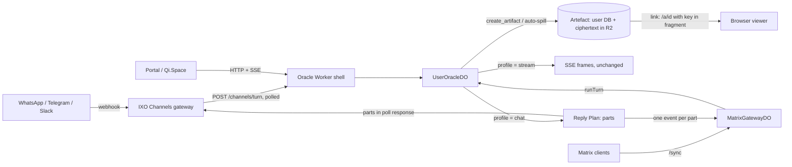
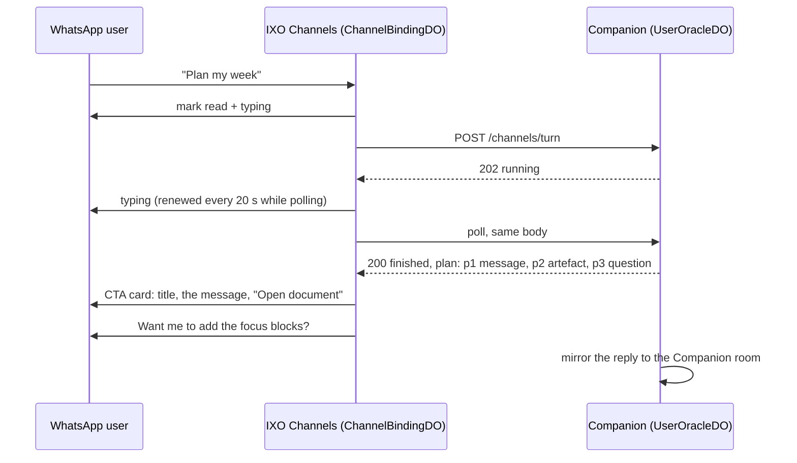

# Chat-native delivery: concise replies, multi-message turns and browser artefacts

**Status:** Accepted; phases 1 and 2 implemented · **Date:** 2026-09-25
**Scope:** `packages/oracle-runtime-workers`, `ixoworld/ixo-channel-gateway`, `ixoworld/ixo-portal` (the shared viewer), `ixoworld/companion` (configuration only)
**Builds on:** `packages/oracle-runtime-workers/docs/channels.md`, `docs/plans/durable-runs.md`, the gateway's `docs/engineering-spec.txt`

**Decisions taken on the proposal:**

| Question                          | Decision                                                                                                                                    |
| --------------------------------- | ------------------------------------------------------------------------------------------------------------------------------------------- |
| WhatsApp eligibility              | Provider rendering stays behind the gateway adapter, so Telegram, Slack and Matrix never depend on it.                                      |
| Who can open an artefact link     | Anyone with the link, until it expires (30 days by default). The repository README records the decision and recommends reviewing it.        |
| Where the viewer lives            | A shared Qi.Space page (`ARTIFACT_VIEWER_URL`). The runtime's built-in page at `/a/:id` works without it.                                   |
| Progress lines                    | None. The typing indicator is the liveness signal.                                                                                          |
| Matrix rooms                      | Chat style by default. Third-party oracles are used through Matrix rooms in the Portal. `OracleConfig.delivery.matrixChat: false` opts out. |
| Empty channel replies (finding 9) | Fixed separately, outside this work.                                                                                                        |

---

## Summary

The Companion replies on WhatsApp, Matrix and (later) Telegram and Slack the same way it replies in the Portal: one long Markdown document, sent only after the whole run has finished. The Portal renders that well, because it streams tokens into a rich view. Chat apps do not render it well.

This spec makes chat a **delivery profile**, chosen per turn, inside the same runtime. It has four pieces:

1. **A surface section in the prompt.** On chat surfaces the model is told it is texting: lead with the answer, write 1–3 short messages, and don't use headings or tables.
2. **Reply Plans.** A run on a chat surface finishes as an ordered list of **parts**: short text messages and artefact links. Every part has a stable ID and is delivered exactly once, extending the idempotency that channel runs already have.
3. **Artefacts.** Long output (plans, reports, tables, drafts) becomes a document the user opens in a browser. The model creates one with `create_artifact`, and a deterministic shaper creates one automatically when the model writes too much anyway. The user's own database holds the canonical copy. The link serves only ciphertext, and the key sits in the URL fragment, so link unfurlers never see the content.
4. **Rendering stays at the edge.** QiForge decides what the parts are. IXO Channels decides how each provider renders and paces them. The Matrix gateway does the same for Matrix rooms. The Portal is unchanged.

**Recommendation: do not run a separate instance of the Workers runtime for chat.** Everything chat needs is a per-turn decision the runtime can already key on (`TurnRequest.client`, `channel.provider`). A second instance would either create a second Companion, which breaks the one-identity invariant of IXO Channels, or put two writers on each user's owner file. See [§9](#9-recommendation-one-companion-no-separate-runtime-instance).

---

## 1. What happens today

| #   | Finding                                                                                                                                                                                                                                                                                           | Where                                                                                                                |
| --- | ------------------------------------------------------------------------------------------------------------------------------------------------------------------------------------------------------------------------------------------------------------------------------------------------- | -------------------------------------------------------------------------------------------------------------------- |
| 1   | WhatsApp receives the raw model Markdown (`##`, `**bold**`, table pipes) as a single message, and the gateway **silently cuts it at 4,096 code points**.                                                                                                                                          | gateway `packages/whatsapp/provider.ts`: `body: Array.from(text).slice(0, 4096).join('')`                            |
| 2   | There is exactly one provider message per inbound message: `outbound_delivery.request_id` is `UNIQUE` and the ID is `del_<remote_id>`.                                                                                                                                                            | gateway `src/binding-do.ts` (`queueDelivery`)                                                                        |
| 3   | There is no liveness signal. The gateway polls every 2 s and sends nothing (no read receipt, no typing indicator) until the run finishes, so the user sees silence for the whole agentic run.                                                                                                     | gateway `src/binding-do.ts` (`next_attempt_at = now + 2`)                                                            |
| 4   | Headless turns deliver **only the last AI message**. Text the model writes before a tool call never reaches WhatsApp or Matrix, and that includes substantive content, not only narration.                                                                                                        | `user-oracle-do.ts` `runAttempt`: `text = completed ? lastAiText(capture) : outcome.fullText`                        |
| 5   | No prompt knows the surface. `client: 'channel'` reaches the graph, but nothing branches on it. The only style rule is "Be concise". Node's Slack formatting fragment never fires, because the Slack path never sets `clientType`.                                                                | `core/prompt-composer.ts:408`; Node `graph/main-agent.ts:590-593` versus `modules/messages/agent-builder.ts:204-205` |
| 6   | Matrix room replies are sent without `formattedBody`, so Element shows raw Markdown. Node rendered them with `formatMsg`. Portal and channel _mirrors_ do render, through `formatReplay`. A reply over Matrix's 64 KiB event limit fails outright.                                                | `matrix/gateway-do.ts:598-607`; `matrix/replay-format.ts`                                                            |
| 7   | Nothing in either repository splits a reply into several chat messages, or converts Markdown to WhatsApp or Telegram syntax.                                                                                                                                                                      | repo-wide                                                                                                            |
| 8   | No browser-openable artefact exists for a chat user. `vfs_share` makes a file public with no expiry. The sandbox's `artifact_get_presigned_url` only covers sandbox files. `present_files` exists only as documentation (the SDK's `components/index.ts` re-exports a missing `ArtifactPreview`). | `plugins/vfs/vfs-tools.ts`; `plugins/sandbox`; `packages/oracles-client-sdk/src/components/index.ts`                 |
| 9   | **Bug, separate from this design:** a finished channel run returns empty `text`. `toRecord` reads `client = 'channel'` back as `'portal'`, so `finalize` never stores the answer. The WhatsApp gateway then sends nothing, and the Matrix mirror is skipped.                                      | `do/run-store.ts:258` → `do/run-coordinator.ts:355-359` → `channels/turns.ts`                                        |

Finding 9 blocks any live channel acceptance run and should be fixed first. The tests miss it because they run on `MemoryRunStore`.

---

## 2. Principles

1. **One Companion, many surfaces.** The conversation, memory, runs and transcript are canonical and shared. A surface is a rendering. This is the invariant of IXO Channels: "WhatsApp never becomes their identity, their agent, or their source of truth".
2. **Write for the surface, then enforce it deterministically.** The model is told where it is speaking. A cheap, deterministic shaper guarantees the contract whatever the model does. By default, no extra LLM call is made to shape a reply.
3. **Semantics in QiForge, syntax at the edge.** QiForge decides the messages and the artefacts. The gateway decides provider syntax, UI primitives, pacing and whether a send is allowed at all. The policy kernel stays in the gateway, per its spec §14: "The Companion must never decide whether a channel operation is legally or operationally permitted."
4. **Exactly-once per part.** The `(userDid, bindingId, requestId)` idempotency extends to `(…, partId)`. It is still better to lose a message than to send a duplicate.
5. **Private by default.** Artefact links are safe against link unfurlers. No plaintext is stored on operator infrastructure. The canonical copy belongs to the user.
6. **The Portal's streaming is untouched.** Its SSE streaming, frames and tools do not change. The Portal gains only the shared artefact viewer.

---

## 3. Design overview



A turn resolves a **delivery profile** from its surface. The profile feeds four consumers:

| Consumer         | What the profile changes                                                                                        |
| ---------------- | --------------------------------------------------------------------------------------------------------------- |
| Prompt composer  | Adds the `surface` section ([§5](#5-writing-for-the-surface))                                                   |
| Tool surface     | Binds `create_artifact` on chat surfaces only ([§7](#7-artefacts))                                              |
| Run completion   | Projects the run into a Reply Plan, running the shaper per model step ([§6](#6-reply-plans))                    |
| Delivery drivers | The gateway renders and paces parts. The Matrix gateway posts one event per part ([§8](#8-delivery-by-surface)) |

---

## 4. Surfaces and delivery profiles

The runtime already knows the surface of every turn:

| Ingress               | `TurnRequest.client` | Extra                           | Profile                                                                              |
| --------------------- | -------------------- | ------------------------------- | ------------------------------------------------------------------------------------ |
| Portal HTTP           | `portal`             | none                            | `stream`: today's behaviour, no shaping                                              |
| `POST /channels/turn` | `channel`            | `channel.provider`              | `chat` with that provider's limits (`whatsapp`, `telegram`, `slack`), else `generic` |
| Matrix room message   | `matrix`             | `roomKind` (`direct` / `group`) | `chat` `matrix`; a group room gets at most 2 messages per step and 3 parts per reply |
| Scheduled task run    | `matrix`             | `task:` session                 | `chat` `matrix`; the task delivers the reply as one message (the plan's text)        |

```ts
// src/delivery/types.ts
export type DeliveryProfile =
  | { kind: 'stream' }
  | { kind: 'chat'; surface: string; label: string; limits: ChatLimits };

export interface ChatLimits {
  bubbleTarget: number; // soft size of one message, characters
  bubbleMax: number; // hard size before a sentence split
  minBubble: number; // shorter fragments merge into the next message
  maxBubbles: number; // per model step; more → spill to an artefact
  maxPartsPerRun: number; // across the whole reply
  spillChars: number; // a step's text longer than this → spill
  maxListItems: number; // a longer list → spill with a preview
  previewItems: number; // list items kept in the lead message
  maxCodeLines: number; // a longer code block → spill
  tables: boolean; // may a table stay inline?
}
```

These are the defaults. An oracle overrides them per surface in `OracleConfig.delivery.limits`; a count must be a whole number of at least 1, or the default stays. `OracleConfig.delivery.matrixChat: false` gives Matrix rooms the `stream` profile. Artefacts are available on every chat surface whenever artefact storage is configured.

| Field                    | `whatsapp`  | `telegram`  | `slack`       | `matrix`      | `generic`   |
| ------------------------ | ----------- | ----------- | ------------- | ------------- | ----------- |
| bubbleTarget / bubbleMax | 600 / 1,500 | 800 / 2,000 | 1,200 / 3,000 | 1,200 / 4,000 | 600 / 1,500 |
| maxBubbles / per run     | 4 / 6       | 4 / 6       | 3 / 5         | 3 / 5         | 3 / 5       |
| spillChars               | 1,800       | 2,400       | 3,500         | 4,000         | 1,800       |
| tables inline            | no          | no          | no            | no            | no          |

The runtime targets are deliberately far below the provider hard limits in the [appendix](#appendix-provider-limits-that-shape-the-design). The gateway enforces those limits a second time.

The profile also appears on `RuntimeContext` as `ctx.session.surface`: `{ kind: 'stream' }` or `{ kind: 'chat', surface, label }`. Plugins can then adapt their output, for example a tasks plugin returning a compact list on chat. This is a public API addition, so it needs a matching update to the public docs.

---

## 5. Writing for the surface

This is a new framework-owned slot in `core/prompt-composer.ts`, after `COMMUNICATION_STYLE`. `renderSurfaceSection` (`src/delivery/prompt.ts`) fills it only on chat turns.

```text
## Where this conversation is happening

You are replying in {label}. The user reads your reply as chat messages, not as a document.

- Lead with the answer. Write like a sharp person texting: short sentences, no preamble, no sign-off.
- Aim for one to three short messages. A blank line starts a new message; keep each under about {bubbleTarget} characters.
- No headings, tables or horizontal rules. Short lists (up to {maxListItems} items) and **bold** for the key fact are fine.
- Anything longer, such as a plan, report, comparison, draft, table or code, goes in `create_artifact`: the full Markdown as the document, a one-line message, and at most one follow-up question. The user gets the message, a link that opens the document in their browser, then the question.
- The user sees a typing indicator while you work. Do not narrate your steps or announce tool calls.
- End with at most one question.
```

Without artefact storage, the `create_artifact` line reads instead: "When something is too long for chat, send the short version and offer the rest."

Why a composer slot rather than a plugin middleware: the surface belongs to the framework, like Node's Slack slot, not to any plugin. The Companion's own `communicationStyle` ("Match energy: one-liners back when terse…") is consistent with the slot and needs no change.

---

## 6. Reply Plans

### 6.1 Parts

```ts
// Shared by the runtime, the channel contract and the gateway.
export type ReplyPart =
  | { partId: string; kind: 'text'; text: string }
  | { partId: string; kind: 'artifact'; artifact: ArtifactRef };

export interface ReplyPlan {
  v: 1;
  parts: ReplyPart[];
}

export interface ArtifactRef {
  artifactId: string;
  title: string; // ≤ 120 characters; a gateway shortens it where it must (a WhatsApp CTA header takes 60)
  url: string; // viewer URL, including the #k= fragment
  mime: 'text/markdown';
  bytes: number;
  expiresAt: string; // ISO 8601
}
```

`text` carries **chat Markdown**, a CommonMark subset: `**bold**`, `_italic_`, `~~strike~~`, inline code, fenced code, `-` and `1.` lists, `>` quotes, and links. The shaper produces nothing outside this subset. Each gateway maps it to provider syntax.

A `choices` part (tappable options: WhatsApp reply buttons, Telegram inline keyboards, Slack buttons) is a later phase.

### 6.2 From a run to a plan

The plan is built **once, when the run finishes** (`src/delivery/plan.ts`). There are no progress lines to release early: the typing indicator is the liveness signal. So one plan per run is the simplest thing that is also idempotent. Streaming a message while it is written stays possible later without changing the contract.

1. The turn's **model steps** are its AI messages after the last human message. Each step can write text and call tools.
2. Text of 200 characters or less that precedes a tool call, in one paragraph with no list or code, is **narration** and is dropped. Once the answer arrives, "Checking your calendar" adds nothing.
3. Any other step text is **content**. It goes through the shaper ([§6.3](#63-the-shaper)). This fixes finding 4: a plan the model writes before calling tools is no longer lost.
4. A `create_artifact` call adds three parts in order: its `message` as a text part, its `artifact` part, then its optional `followUp` question. This is the same lead → artefact → question shape as an automatic spill.
5. The reply is capped at `maxPartsPerRun` by merging the shortest adjacent pair of text parts, as long as the result fits `bubbleMax`. If that is not enough, a spill's lead and closing question go, because its artefact holds both. Text found nowhere else is never dropped, so a reply with several documents, or a long reply without artefact storage, can stay over the cap.
6. A resumed run puts back the text it had streamed before the reset, minus the steps the checkpoint kept, in front of the first step after them.

The model's checkpointed messages are **never rewritten**. The model remembers what it actually wrote, and the plan is a projection of it for one surface.

### 6.3 The shaper

This is a pure function, `shape(markdown, profile) → ReplyPart[]`. It uses the `marked` lexer, already a runtime dependency, and `Intl.Segmenter` for sentence boundaries.

1. **Lex** the step text into blocks: paragraph, list, code, table, heading, quote, rule.
2. **Decide whether to spill.** A step spills if its rendered length is over `spillChars`, if it contains a table (unless `tables`) or a code block over `maxCodeLines`, if it has a list over `maxListItems`, or if packing would need more than `maxBubbles`.
3. **Pack**, when not spilling:
   - A heading becomes a bold line attached to the block that follows it.
   - A paragraph ending in `:` stays with the list or code block after it.
   - A fragment shorter than `minBubble` merges into the next one.
   - Anything over `bubbleMax` is split at sentence boundaries, then at word boundaries.
   - Each resulting unit is one bubble.
4. **Spill**, when needed. The output is **lead → artefact → closing question**:
   - The lead is the first content block, cut to `bubbleTarget` at a sentence boundary. A lead-in that ends in `:` keeps its list's first `previewItems` items plus "…and N more".
   - The artefact is the whole step text, titled by its first heading or else its first sentence.
   - If the step ends with a question, that question is kept as a final bubble, because chat depends on it.
5. **Normalise** to chat Markdown. Headings become bold, rules and raw HTML are dropped, and tables go to an artefact. Without artefact storage, a table becomes a list instead.

The rules above were checked on a scratch prototype with typical Companion output. Example: "plan my week", 789 characters with a table and a 5-step list, is what the model writes for the Portal today.

| Today on WhatsApp (one message)                                                                                                          | With this design (three parts)                                                                                               |
| ---------------------------------------------------------------------------------------------------------------------------------------- | ---------------------------------------------------------------------------------------------------------------------------- |
| `## Your week at a glance` ↵ `You have **14 meetings**…` ↵ `### Deadlines` ↵ `\| Item \| Due \| Status \|` ↵ `\|---\|---\|---\|` … (raw) | 💬 You have **14 meetings** this week, with Tuesday and Wednesday the heaviest (5 each). Three deadlines land before Friday. |
|                                                                                                                                          | 🔗 **Your week at a glance** · _Open_ (artefact card: the full plan, table included)                                         |
|                                                                                                                                          | 💬 Want me to add the focus blocks and move the 1:1 with Sam?                                                                |

Two more prototype results:

- A 190-character flight answer stayed as 2 bubbles, with no spill.
- A 10-item restaurant list became the lead-in, the first 3 items and "…and 7 more", then the artefact, then "Should I book one of these?".

With the §5 prompt the model should usually write the short form itself. The shaper is the safety net.

### 6.4 Durability and idempotency

- **Stable IDs.** Parts are `p1` … `pn` in delivery order. The plan is stored with the run, so a re-poll, a replayed Matrix event and a recovered run all read the same plan.
- **Persistence.** `turn_run_plans(run_id, plan)` holds the plan. It is pruned with the run after the seven-day retention, and the channel tombstone rules (410 after pruning) are unchanged.
- **Artefact IDs are deterministic.** An ID is the first 128 bits of a SHA-256 over `(runId, source)`. The source is the `create_artifact` call's tool call ID, or the step key of an automatic spill. Creation is idempotent per ID. So the tool is declared read-only for recovery, and a recovered run converges on the same artefact rather than being answered "outcome unknown" by `ToolMarksMiddleware`.
- **Channel contract.** A finished response carries the plan next to the existing fields. `text` becomes the plan rendered as one Markdown message, with artefacts as links, so gateways that predate plans keep working:

  ```ts
  interface ChannelTurnResponse {
    // …existing fields: requestId, runId, sessionId, status, messageId?, text?
    plan?: ReplyPlan; // finished turns of chat runs
  }
  ```

  Polling still repeats the exact request body. Artefact content never travels in the plan, only its link.

---

## 7. Artefacts

### 7.1 `create_artifact`

The runtime binds this tool on chat turns when artefact storage is configured (`src/artifacts/tool.ts`). It is a turn tool of the runtime, not a plugin tool: whether it exists depends on the delivery profile, which the runtime owns.

```ts
create_artifact({
  title: string,        // ≤ 120 characters
  content: string,      // full Markdown, ≤ 200,000 characters
  message: string,      // the one-line chat message sent before the link, ≤ 600
  followUp?: string,    // at most one question, sent after the link, ≤ 300
}) → { ok: true, artifactId, title, url, mime, bytes, expiresAt }
```

- **Return-direct.** It ends the run without another model call, which saves a full-context round trip for every artefact.
  - LangChain 1.4's `createAgent` exits only when the **last** tool result of a step comes from a return-direct tool. So the tool description asks for `create_artifact` as the final call, on its own.
  - When the model calls it alongside other tools anyway, an `afterModel` hook in the core (`middlewares/return-direct-first.ts`) moves it to the front of that step's tool calls. The loop then continues, and the model sees every result.
- **Read access.** A second tool, `read_artifact`, would let the model quote from or update an earlier artefact. Later.

### 7.2 Storage

| Copy          | Where                                                                                                                         | Why                                                                                                                                      |
| ------------- | ----------------------------------------------------------------------------------------------------------------------------- | ---------------------------------------------------------------------------------------------------------------------------------------- |
| **Canonical** | `artifacts` table in the user's SQLite                                                                                        | It is exported with the rest of the working copy to `/.oracles/<oracleDid>/state.db.gz`, so **the user owns it** and needs no new grant. |
| **Share**     | R2 object `art/<artifactId>` in `ARTIFACT_BUCKET`: AES-256-GCM ciphertext of `{v, title, mime, content, createdAt}`, IV first | Serves the browser link without waking the user object. The operator bucket never holds plaintext. Custom metadata: `expiresAt` only.    |
| Library copy  | `/Qi/Artefacts/<date> <title>.md` in the user's VFS                                                                           | Later: visible in Qi.Space's Library when the user has granted the vfs plugin library access.                                            |

The share copy needs one R2 binding, `ARTIFACT_BUCKET` (its own binding, separate from the page tier's `TIER_BUCKET`), a public origin (`ORACLE_PUBLIC_URL`) and a lifecycle rule on `art/`. Without them, artefacts are off: long replies are split into messages, and `create_artifact` is not offered.

### 7.3 Links and the viewer

```
https://<oracle>/a/<artifactId>#k=<key>                                   built-in page
https://<viewer>#a=<encoded https://<oracle>/a/<artifactId>>&k=<key>      ARTIFACT_VIEWER_URL (Qi.Space)
        artifactId: 128 bits · key: 256-bit AES-GCM key, base64url
```

- **`GET /a/:artifactId`** serves a static viewer page, identical for every artefact. It is mounted ahead of CORS and auth.
  - Headers: `X-Robots-Tag: noindex, nofollow`, `Referrer-Policy: no-referrer`, `nosniff`.
  - CSP: `default-src 'none'`; only the page's own hashed script and style; `connect-src 'self'`; `frame-ancestors 'none'`.
  - In the browser, the page reads the key from `location.hash` and decrypts with WebCrypto. It renders the Markdown through DOM APIs only: no `innerHTML`, only `http(s)` and `mailto` links, and images as links. It offers Copy and Download `.md`.
- **`GET /a/:artifactId/data`** returns the ciphertext.
  - It answers any origin (`Access-Control-Allow-Origin: *`), because the shared viewer fetches it from another host.
  - `Cache-Control: private, max-age=60`, so a revocation takes effect within a minute.
  - It is rate-limited per client IP.
  - An expired object answers `410` and is deleted.
- **The shared viewer** is the Portal's `/artifact` page, set as `ARTIFACT_VIEWER_URL`.
  - It fetches only `/a/<id>` paths over https, on hosts in `NEXT_PUBLIC_ARTIFACT_SOURCE_HOSTS` (default `ixo.earth`).
  - It decrypts in the browser, renders with the Portal's Markdown component with images as links, and states that an agent wrote the document.
  - The Portal's product analytics and error reporting remove the fragment from every URL they record, so the key never reaches either.
- **Expiry and revocation.**
  - Links default to 30 days (`ARTIFACT_LINK_TTL_DAYS`). No setting makes a link live longer than 365 days.
  - `DELETE /artifacts/:id` (the owner, authenticated) deletes the share copy. The canonical copy stays, and asking Qi again mints a fresh link with a new key.
  - `GET /artifacts/:id` returns the canonical copy, with `url` only while the link works.
  - Deleting a session deletes its artefacts, share copies first.
  - Revoking a channel binding does not yet revoke the links created through it. Later.
- **Origin.** The built-in page runs on the oracle's API origin. That origin holds no cookies or stored credentials (auth is a UCAN header per request), and the page runs only its own hashed script. A dedicated hostname on the same Worker script remains an option.

### 7.4 Security properties

| Threat                                                                     | Outcome                                                                                                                                                                                                          |
| -------------------------------------------------------------------------- | ---------------------------------------------------------------------------------------------------------------------------------------------------------------------------------------------------------------- |
| Link unfurlers: WhatsApp and Telegram clients or servers, Slack's unfurler | They fetch the path, never the fragment, and get only the generic page. On top of this, the WhatsApp gateway sends artefacts as buttons and turns link previews off.                                             |
| Server, proxy and CDN logs                                                 | The path holds a random ID. The key is in the fragment and is never sent.                                                                                                                                        |
| An operator or bucket leak                                                 | The bucket holds AES-GCM ciphertext only. Keys live in the user's own database and in the link.                                                                                                                  |
| The shared viewer's telemetry                                              | PostHog events and Sentry reports from the Portal have the viewer's fragment removed before they are sent.                                                                                                       |
| A forwarded message                                                        | Bearer-link semantics, by decision: anyone holding the link can read the document until it expires or is revoked. The repository README records the decision and recommends reviewing it.                        |
| A document used for phishing                                               | Anyone can have an agent write a document and share its link. The shared viewer fetches only from allowlisted oracle hosts, and says that an agent wrote the document.                                           |
| Prompt injection leaking data through an artefact                          | No new channel: the link goes only to the user who asked. Both viewers render images as links, so opening a document fetches nothing on its own. Sending it elsewhere still needs a tool with its own authority. |

---

## 8. Delivery by surface

### 8.1 IXO Channels (WhatsApp now; Telegram and Slack later)

These are changes in `ixoworld/ixo-channel-gateway`. The authority model, admission and polling do not change.



| Area                          | Change                                                                                                                                                                                                                                                                                                                                                                                                                                     |
| ----------------------------- | ------------------------------------------------------------------------------------------------------------------------------------------------------------------------------------------------------------------------------------------------------------------------------------------------------------------------------------------------------------------------------------------------------------------------------------------ |
| `src/qiforge.ts`              | Parses `plan` next to `text`. A plan that does not parse is dropped (counted as `qiforge_plan_invalid_total`), and `text` is sent instead.                                                                                                                                                                                                                                                                                                 |
| `outbound_delivery`           | One row per part: `part_id`, `UNIQUE(request_id, part_id)`. The ID is `del_` + HMAC(`delivery \0 requestId \0 partId`): still 64 hex characters, so the receipt regex and `biz_opaque_callback_data` reconciliation still work. Existing objects rebuild the table in place.                                                                                                                                                               |
| Ordering and pacing           | Parts go out strictly in order, about a second apart. After an ambiguous (`unknown`) send, the rest of the reply waits ten seconds so the receipt can land first. Graph API pacing errors (pair rate limit 131056; throughput 4, 80007, 130429) are retried without spending the part's attempts.                                                                                                                                          |
| Ambiguous sends               | A part in `unknown` is never resent. This keeps the gateway spec's rule: "prefer one missing response over multiple user-visible duplicate replies".                                                                                                                                                                                                                                                                                       |
| Policy                        | The binding check and `channelPolicy` run again before **every** part. A binding revoked in the middle of a reply suppresses the rest. The 24-hour window is checked per part. A document link is allowed only as an outbound reply.                                                                                                                                                                                                       |
| Liveness                      | While the turn runs, the message is marked read and the typing indicator is shown, renewed every 20 seconds while polling. The raw inbound message ID this needs is sealed in the pending payload and removed with it.                                                                                                                                                                                                                     |
| `packages/whatsapp/render.ts` | Maps chat Markdown to WhatsApp syntax: `*bold*`, `_italic_`, `~strike~`, monospace, lists, quotes; `label (url)` for links. An artefact becomes a **CTA URL** card: the title as its header (≤ 60), the message before it as its body when that fits (≤ 1,024), "Open document" as its button, and the expiry as its footer. Anything over 4,096 characters is split at paragraph, line, sentence and word boundaries. **Never truncate.** |

Later adapters use the same parts:

- **Telegram:** HTML parse mode, URL inline keyboards for artefacts, `sendChatAction` for typing.
- **Slack:** the `markdown` block and a URL button.
- **Streaming:** both now support native streaming (Telegram's `sendMessageDraft`, Slack's `chat.startStream`). A later phase can stream the message currently being written, without any change to the plan contract.

### 8.2 Matrix rooms

Matrix rooms get the chat profile by default. This is how third-party oracles are used from the Portal.

- `MatrixGatewayDO` posts one `m.text` per part in the thread.
  - Each is rendered to HTML with `formatReplay`, which fixes finding 6.
  - An artefact part is its title and an "Open document" link.
  - Transaction IDs are `reply-<eventId>-<partId>`, so the homeserver still deduplicates a replay.
- There are no progress parts. The typing notification and the `work_status` card show liveness.
- `MatrixTurnLedger` stores the plan with the reply, so a replayed turn re-delivers the same parts.
- A `stream` reply (with `matrixChat: false`) is one message, now with `formattedBody` too.
- Task deliveries post the plan's text as one message. A long digest becomes its lead, the artefact link and its question.
- An `org.ixo.qi.artifact` content key, which would let Qi.Space render a card, is later.

### 8.3 Portal / Qi.Space

- The `stream` profile leaves SSE, frames, browser tools and AG-UI as they are, and `create_artifact` is not bound.
- The shared viewer is the `/artifact` page ([§7.3](#73-links-and-the-viewer)). It is public: the person may not be signed in on that device.
- History from chat surfaces shows the canonical message. A reply that ended in `create_artifact` lists as the message, the link and the question the user received.
- An artefact card that opens the canonical copy through the authenticated `GET /artifacts/:id` is later. It would replace the dead `present_files` / `ArtifactPreview` remnants in the SDK.

### 8.4 Canonical transcript and the Companion room

- The model's checkpointed messages are unchanged ([§6.2](#62-from-a-run-to-a-plan)).
- The channel mirror still posts **one** event per run into the canonical encrypted room. It holds the plan's text: the delivered content joined in order, with artefact links. So Qi.Space and Element show what the user actually received.
- An `org.ixo.qi.delivery` key recording how the reply was split, next to the existing `org.ixo.qi.origin`, is later.

---

## 9. Recommendation: one Companion, no separate runtime instance

**We should not run a separate instance of the QiForge Workers runtime for chat.** A separate instance could mean any of three deployments:

| Option                                                                                                                     | Consequence                                                                                                                                                                                                                                                                                                                                                                                                                                                                                                                           | Verdict                                                 |
| -------------------------------------------------------------------------------------------------------------------------- | ------------------------------------------------------------------------------------------------------------------------------------------------------------------------------------------------------------------------------------------------------------------------------------------------------------------------------------------------------------------------------------------------------------------------------------------------------------------------------------------------------------------------------------- | ------------------------------------------------------- |
| **A. A second oracle for chat** (new `ORACLE_DID`)                                                                         | This creates a second Companion.<br><br>- Its user objects, sessions, checkpoints, tasks and preferences are separate.<br>- The Rooms Appservice keys the room on (user DID, oracle DID), so it gets a separate room, which breaks Qi.Space continuity.<br>- It needs a second delegation from every user.<br>- Auth Hub grants bind `oracleDid` in their caveats, so it needs a second consent.<br><br>This contradicts the IXO Channels invariant: "one authenticated route to the same DID, Matrix identity, Companion, memories". | ✗                                                       |
| **B. Same `ORACLE_DID`, a second deployment with its own `UserOracleDO` class**                                            | - Each user gets **two working copies** of one database, both exporting to the same owner file (`/.oracles/<oracleDid>/state.db.gz`). The last writer wins over the user's system of record.<br>- The per-user object is the serialisation point for turns. Two of them lose the ordering between a WhatsApp message and a Portal message.<br>- A second Matrix gateway on the same bot account means a second device and sync loop for one identity.                                                                                 | ✗                                                       |
| **C. A thin ingress-only script** bound across scripts to the Companion's existing `UserOracleDO` (like the gateway split) | This is safe: one user object, one owner file. But turns still run in the same user objects, so chat load, prompts and tools are not isolated. It separates only a stateless handler that already has its own UCAN policy, rate-limit hook and off switch (`CHANNEL_SERVICE_DID` empty). The cost is a third script per network, with its own deploy order and secrets.                                                                                                                                                               | Not now; this is the fallback if a trigger below is hit |
| **D. Chosen:** the same deployment, with chat as a delivery profile                                                        | Every chat difference is a per-turn decision (table below). Isolation that matters already exists in IXO Channels and in the Matrix gateway script.                                                                                                                                                                                                                                                                                                                                                                                   | ✓                                                       |

| Chat needs                           | Where it lives, without a new instance                                                                                                              |
| ------------------------------------ | --------------------------------------------------------------------------------------------------------------------------------------------------- |
| A concise, chat register             | The surface prompt section, per turn                                                                                                                |
| Different tools                      | `create_artifact` bound on chat surfaces only; browser tools already fail headless and can be unbound there                                         |
| Output shaping and artefacts         | Reply Plan and the shaper, per run                                                                                                                  |
| A faster or cheaper model (optional) | A profile `model` hint that feeds `TurnRequest.model` (already resolved and allow-listed in `prepareTurn`); BYO users keep their own                |
| Separate rate limiting               | A route-scoped limiter key (`channel:<did>`) instead of the shared per-DID bucket; channel polling uses about 30 of its 100 requests a minute today |
| An off switch                        | `CHANNEL_SERVICE_DID` (exists); `OracleConfig.delivery` flags                                                                                       |
| Provider secrets, webhooks, policy   | The IXO Channels gateway, already a separate Worker with its own Durable Objects                                                                    |
| Protecting the Matrix bot            | The gateway script split, which already exists                                                                                                      |

**What would change this:**

1. Measured contention on the oracle script's shell caused by channel traffic → move to option C, not A or B. This is unlikely, because the shell is stateless and user objects scale per user.
2. A provider's terms admit only a narrow-purpose bot → that is a **different product and oracle** with its own scope, not a copy of the Companion.
3. Channel ingress needs a release cadence independent of the Companion → option C.

---

## 10. Rollout

| Phase                         | Scope                                                                                                                                                                                                                                                                         | Status                                                                            |
| ----------------------------- | ----------------------------------------------------------------------------------------------------------------------------------------------------------------------------------------------------------------------------------------------------------------------------- | --------------------------------------------------------------------------------- |
| **0. Prerequisite**           | Fix finding 9, with a SQLite-store test.                                                                                                                                                                                                                                      | Being fixed separately                                                            |
| **1. Chat replies**           | Runtime: profiles, the surface section, the shaper, Reply Plans, `plan` on `/channels/turn`, plan delivery and HTML replies in `MatrixGatewayDO`. Gateway: per-part rows, ordering and pacing, per-part policy, the Markdown→WhatsApp renderer, no truncation, read + typing. | Done                                                                              |
| **2. Artefacts**              | Runtime: `create_artifact`, auto-spill, the `artifacts` table, share copies, the built-in viewer, owner routes. Gateway: CTA URL cards. Portal: the shared `/artifact` viewer. Companion: an artefact bucket and `ORACLE_PUBLIC_URL`.                                         | Done; the Companion's buckets and lifecycle rules must be created before a deploy |
| **3. Interaction and polish** | `choices` with interactive inbound replies, a verbosity preference, `read_artifact`, CSV and HTML artefacts, Telegram and Slack adapters, native streaming, `org.ixo.qi.artifact` / `org.ixo.qi.delivery` keys, revoking links with a binding, the Portal's artefact card.    | Later                                                                             |

---

## 11. Testing and measures

**Tests** (following `docs/testing/` conventions; no test-side retries that mask failures):

- **Shaper:** pure unit tests with golden fixtures: short answer, list with a lead-in, table, long list, code, a closing question, CJK and emoji segmentation. Every output part is checked for byte and character limits, and for staying inside the chat Markdown subset.
- **Plans:** workerd tests for the plan a finished channel turn returns, the same plan on re-poll, idempotent artefact creation, and pruning that removes the plan with the run but keeps the tombstone.
- **Gateway:** exactly one provider send per part under duplicate polls and restarts, `unknown` never resent, revocation in the middle of a reply suppressing the rest, pacing errors retried without spending attempts, the outbox migration, and never truncating.
- **Viewer:** the page never renders content without the fragment; CSP and noindex headers are present; decryption round-trips; expired and revoked links return a clear page.
- **Evaluations** (per `specs/agent-evaluations.md`): about 30 chat-surface prompts (quick facts, plans, research, lists, drafts). Deterministic checks cover bubble count and length, and headings and tables. An LLM judge scores "reads like a message", "answer first" and "long content in an artefact".

**Measures:**

- Time to first message on chat surfaces
- Messages per turn
- Spill rate, split into model-authored and automatic
- Artefact open rate (viewer data fetches per artefact)
- WhatsApp pair-rate errors (131056)
- Deliveries left in `unknown`
- Share of replies over 4,096 characters (should fall to 0% truncated)
- Median length of the user's next reply, a proxy for conversational feel

---

## 12. Risks and open questions

1. **WhatsApp eligibility.** Meta's Business terms barred general-purpose AI assistants from 15 January 2026. A March 2026 revision re-admitted them for a fee. The European Commission's interim measures of June 2026 require free access in the EEA while its investigation runs. The gateway spec already treats provider eligibility as a release gate. _Decided:_ rendering stays behind the adapter seam, so Telegram, Slack and Matrix do not depend on that outcome.
2. **Model compliance varies by model** (Companion users can pick models or bring their own). The shaper makes the contract independent of the model, and evaluations track the gap.
3. **Bearer links.** _Decided:_ "anyone with the link" with expiry is the default. The README recommends reviewing it before chat channels leave pilot: a signed-in mode through Qi.Space for sensitive content, the 30-day default, and a per-user choice.
4. **Viewer hostname.** _Decided:_ a shared Qi.Space viewer, with the runtime's built-in page as the default that needs nothing else.
5. **Progress lines.** _Decided:_ none. The typing indicator is enough.
6. **Summary quality on auto-spill.** The lead is extractive, and with the §5 prompt the model normally writes the summary itself. If measurement shows poor leads, an optional bounded Decision can pick the best lead paragraph without generating free text.
7. **Pacing under WhatsApp's pair limit.** A reply of four parts is a burst that borrows from the next 24 seconds of quota. A quick follow-up can then hit error 131056, which the gateway waits out. If that proves common, merge adjacent text parts when the quota is short.

---

## Appendix: provider limits that shape the design

| Provider       | Hard limits                                                                      | Pacing                                                                                             | Liveness                                         | Native streaming                                   |
| -------------- | -------------------------------------------------------------------------------- | -------------------------------------------------------------------------------------------------- | ------------------------------------------------ | -------------------------------------------------- |
| WhatsApp Cloud | Text 4,096 characters; CTA URL body 1,024, header and footer 60, button label 20 | 1 message per 6 s to the same user; bursts up to 45 in 6 s borrow from future quota (error 131056) | Typing indicator, cleared after 25 s or on reply | none                                               |
| Telegram Bot   | Text 4,096 characters after entities parsing                                     | About 1 message per second per chat                                                                | `sendChatAction`                                 | `sendMessageDraft` (Bot API 9.3+)                  |
| Slack          | `markdown` block 12,000 characters per message; section text 3,000               | About 1 message per second per channel                                                             | `assistant.threads.setStatus`                    | `chat.startStream` / `appendStream` / `stopStream` |
| Matrix         | 65,536 bytes per event (after encryption)                                        | Homeserver `rc_message` (devnet: 3 per second, burst 40)                                           | Typing notifications; `work_status` card         | Edits (`m.replace`), not used                      |
