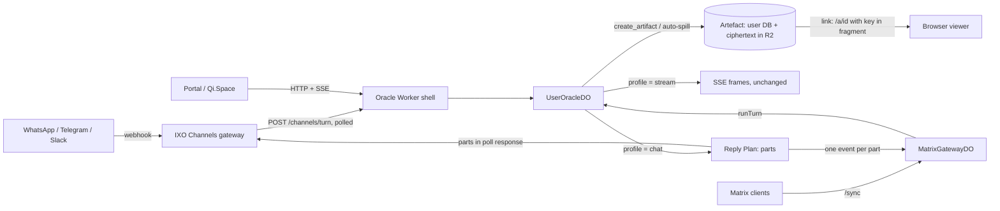
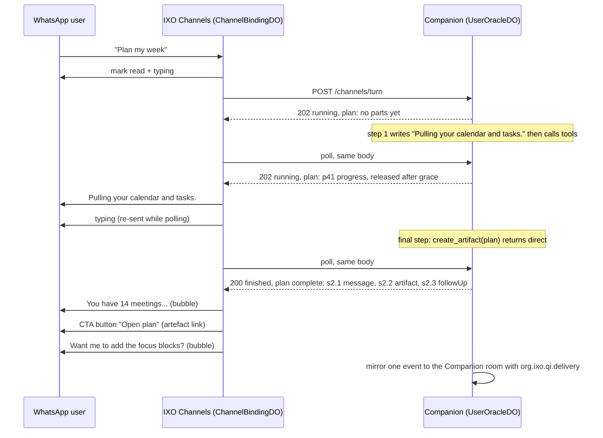

# Chat-native delivery: concise replies, multi-message turns and browser artefacts

**Status:** Proposed · **Date:** 2026-09-25
**Scope:** `packages/oracle-runtime-workers`, `ixoworld/ixo-channel-gateway`, `ixoworld/companion` (configuration only)
**Builds on:** `packages/oracle-runtime-workers/docs/channels.md`, `docs/plans/durable-runs.md`, the gateway's `docs/engineering-spec.txt`

---

## Summary

The Companion replies on WhatsApp, Matrix and (later) Telegram and Slack the same way it replies in the Portal: one long Markdown document, sent only after the whole run has finished. The Portal renders that well, because it streams tokens into a rich view. Chat apps do not render it well.

This spec makes chat a **delivery profile**, chosen per turn, inside the same runtime. It has four pieces:

1. **A surface section in the prompt.** On chat surfaces the model is told it is texting: lead with the answer, write 1–3 short messages, and don't use headings or tables.
2. **Reply Plans.** A run on a chat surface produces an ordered list of **parts**: short text bubbles, an optional progress line, and artefact cards. Every part has a stable ID and is delivered exactly once, extending the idempotency that channel runs already have.
3. **Artefacts.** Long output (plans, reports, tables, drafts) becomes a document the user opens in a browser. The model creates one with `create_artifact`, and a deterministic shaper creates one automatically when the model writes too much anyway. The user's own database holds the canonical copy. The link serves only ciphertext, and the key sits in the URL fragment, so link unfurlers never see the content.
4. **Rendering stays at the edge.** QiForge decides what the parts are. IXO Channels decides how each provider renders and paces them. The Matrix gateway does the same for Matrix rooms. The Portal is unchanged.

**Recommendation: do not run a separate instance of the Workers runtime for chat.** Everything chat needs is a per-turn decision the runtime can already key on (`TurnRequest.client`, `channel.provider`). A second instance would either create a second Companion, which breaks the one-identity invariant of IXO Channels, or put two writers on each user's owner file. See [§9](#9-recommendation-one-companion-no-separate-runtime-instance).

---

## 1. What happens today

| #   | Finding                                                                                                                                                                                                                                                                                           | Where                                                                                                                |
| --- | ------------------------------------------------------------------------------------------------------------------------------------------------------------------------------------------------------------------------------------------------------------------------------------------------- | -------------------------------------------------------------------------------------------------------------------- |
| 1   | WhatsApp receives the raw model Markdown (`##`, `**bold**`, table pipes) as a single message, and the gateway **silently cuts it at 4,096 code points**.                                                                                                                                          | gateway `packages/whatsapp/provider.ts`: `body: Array.from(text).slice(0, 4096).join('')`                            |
| 2   | There is exactly one provider message per inbound message: `outbound_delivery.request_id` is `UNIQUE` and the ID is `del_<remote_id>`.                                                                                                                                                            | gateway `src/binding-do.ts` (`queueDelivery`)                                                                        |
| 3   | There is no liveness signal. The gateway polls every 2 s and sends nothing (no read receipt, no typing indicator) until the run finishes, so the user sees silence for the whole agentic run.                                                                                                     | gateway `src/binding-do.ts` (`next_attempt_at = now + 2`)                                                            |
| 4   | Headless turns deliver **only the last AI message**. Text the model writes before a tool call never reaches WhatsApp or Matrix, and that includes substantive content, not only narration.                                                                                                        | `user-oracle-do.ts` `runAttempt`: `text = completed ? lastAiText(capture) : outcome.fullText`                        |
| 5   | No prompt knows the surface. `client: 'channel'` reaches the graph, but nothing branches on it. The only style rule is "Be concise". Node's Slack formatting fragment never fires, because the Slack path never sets `clientType`.                                                                | `core/prompt-composer.ts:408`; Node `graph/main-agent.ts:590-593` versus `modules/messages/agent-builder.ts:204-205` |
| 6   | Matrix room replies are sent without `formattedBody`, so Element shows raw Markdown. Node rendered them with `formatMsg`. Portal and channel _mirrors_ do render, through `formatReplay`. A reply over Matrix's 64 KiB event limit fails outright.                                                | `matrix/gateway-do.ts:598-607`; `matrix/replay-format.ts`                                                            |
| 7   | Nothing in either repository splits a reply into several chat messages, or converts Markdown to WhatsApp or Telegram syntax.                                                                                                                                                                      | repo-wide                                                                                                            |
| 8   | No browser-openable artefact exists for a chat user. `vfs_share` makes a file public with no expiry. The sandbox's `artifact_get_presigned_url` only covers sandbox files. `present_files` exists only as documentation (the SDK's `components/index.ts` re-exports a missing `ArtifactPreview`). | `plugins/vfs/vfs-tools.ts`; `plugins/sandbox`; `packages/oracles-client-sdk/src/components/index.ts`                 |
| 9   | **Bug, separate from this design:** a finished channel run returns empty `text`. `toRecord` reads `client = 'channel'` back as `'portal'`, so `finalize` never stores the answer. The WhatsApp gateway then sends nothing, and the Matrix mirror is skipped.                                      | `do/run-store.ts:258` → `do/run-coordinator.ts:355-359` → `channels/turns.ts`                                        |

Finding 9 blocks any live channel acceptance run and should be fixed first. The tests miss it because they run on `MemoryRunStore`.

---

## 2. Principles

1. **One Companion, many surfaces.** The conversation, memory, runs and transcript are canonical and shared. A surface is a rendering. This is the invariant of IXO Channels: "WhatsApp never becomes their identity, their agent, or their source of truth".
2. **Write for the surface, then enforce it deterministically.** The model is told where it is speaking. A cheap, deterministic shaper guarantees the contract whatever the model does. By default, no extra LLM call is made to shape a reply.
3. **Semantics in QiForge, syntax at the edge.** QiForge decides the bubbles, the progress lines and the artefacts. The gateway decides provider syntax, UI primitives, pacing and whether a send is allowed at all. The policy kernel stays in the gateway, per its spec §14: "The Companion must never decide whether a channel operation is legally or operationally permitted."
4. **Exactly-once per part.** The `(userDid, bindingId, requestId)` idempotency extends to `(…, partId)`. It is still better to lose a message than to send a duplicate.
5. **Private by default.** Artefact links are safe against link unfurlers. No plaintext is stored on operator infrastructure. The canonical copy belongs to the user.
6. **The Portal is untouched.** Its SSE streaming, frames and tools do not change.

---

## 3. Design overview



A turn resolves a **delivery profile** from its surface. The profile feeds four consumers:

| Consumer         | What the profile changes                                                                                        |
| ---------------- | --------------------------------------------------------------------------------------------------------------- |
| Prompt composer  | Adds the `surface` section ([§5](#5-writing-for-the-surface))                                                   |
| Tool surface     | Binds `create_artifact` on chat surfaces only ([§7](#7-artefacts))                                              |
| Run completion   | Projects the run into a Reply Plan, running the shaper per model step ([§6](#6-reply-plans))                    |
| Delivery drivers | The gateway renders and paces parts. The Matrix gateway posts one event per part ([§8](#8-delivery-by-surface)) |

---

## 4. Surfaces and delivery profiles

The runtime already knows the surface of every turn:

| Ingress               | `TurnRequest.client` | Extra                                 | Profile                                         |
| --------------------- | -------------------- | ------------------------------------- | ----------------------------------------------- |
| Portal HTTP           | `portal`             | none                                  | `stream`: today's behaviour, no shaping         |
| `POST /channels/turn` | `channel`            | `channel.provider` (`whatsapp` today) | `chat:<provider>`, else `chat:generic`          |
| Matrix room message   | `matrix`             | `roomKind` (`direct` / `group`)       | `chat:matrix` (group: 1–2 bubbles, no progress) |
| Scheduled task run    | `matrix`             | `task:` session                       | `chat:matrix` (final answer only)               |

```ts
// src/delivery/profile.ts
export interface DeliveryProfile {
  kind: 'stream' | 'chat';
  /** Human name the prompt uses: "WhatsApp", "Matrix", "a chat app". */
  label: string;
  bubbleTarget: number; // soft size of one message, characters
  bubbleMax: number; // hard size before a sentence split
  minBubble: number; // shorter fragments merge into the next message
  maxBubbles: number; // per model step; more → spill to an artefact
  maxPartsPerRun: number; // across the whole run, progress included
  spillChars: number; // a step's text longer than this → spill
  maxListItems: number; // a longer list → spill with a preview
  previewItems: number; // list items kept in the lead bubble
  maxCodeLines: number; // a longer code block → spill
  tables: boolean; // may a table stay inline?
  progress: { graceMs: number; max: number; minGapMs: number } | null;
  artifacts: boolean; // bind create_artifact and allow auto-spill
}
```

These are the defaults. An oracle overrides them in `OracleConfig.delivery.profiles`, and a later phase adds a per-user verbosity preference.

| Field                    | `chat:whatsapp`            | `chat:telegram` | `chat:slack`  | `chat:matrix`                                       | `chat:generic`   |
| ------------------------ | -------------------------- | --------------- | ------------- | --------------------------------------------------- | ---------------- |
| bubbleTarget / bubbleMax | 600 / 1,500                | 800 / 2,000     | 1,200 / 3,000 | 1,200 / 4,000                                       | 600 / 1,500      |
| maxBubbles / per run     | 4 / 6                      | 4 / 6           | 3 / 5         | 3 / 5                                               | 3 / 5            |
| spillChars               | 1,800                      | 2,400           | 3,500         | 4,000                                               | 1,800            |
| tables inline            | no                         | no              | no            | no                                                  | no               |
| progress                 | 6 s grace, ≤ 2, 20 s apart | same            | same          | none: the `work_status` card already shows liveness | same as WhatsApp |

The runtime targets are deliberately far below the provider hard limits in the [appendix](#appendix-provider-limits-that-shape-the-design). The gateway enforces those limits a second time.

The profile also appears on `RuntimeContext` as `ctx.session.surface` (`{ kind, label, provider? }`). Plugins can then adapt their output, for example a tasks plugin returning a compact list on chat. This is a public API addition, so it needs a matching update to the public docs.

---

## 5. Writing for the surface

This is a new framework-owned slot in `core/prompt-composer.ts`, after `COMMUNICATION_STYLE`. It renders only when `profile.kind === 'chat'`. It adds about 180 tokens.

```text
## Where this conversation is happening

You are replying in {label}. The user reads your reply as chat messages on their phone, not as a document.

- Lead with the answer. Write like a sharp person texting: short sentences, no preamble, no sign-off.
- Aim for 1–3 short messages. A blank line starts a new message; keep each under about {bubbleTarget} characters.
- No headings, tables or horizontal rules. Short lists (up to {maxListItems} items) and **bold** for the key fact are fine.
- For anything longer, such as a plan, report, comparison, draft, table or code, call create_artifact with the full Markdown, a one-line message and, if needed, one follow-up question. The user gets the message, a link that opens the document in their browser, and then the question.
- Before a long piece of tool work you may send one brief heads-up ("Checking your calendar and inbox."). Don't narrate each step.
- End with at most one question.
```

Why a composer slot rather than a plugin middleware: the surface belongs to the framework, like Node's Slack slot, not to any plugin. A slot is also visible in the prompt snapshot test (`core/__snapshots__/prompt-composer.test.ts.snap`). The Companion's own `communicationStyle` ("Match energy: one-liners back when terse…") is consistent with the slot and needs no change.

---

## 6. Reply Plans

### 6.1 Parts

```ts
// Shared by the runtime, the channel contract and the gateway.
export type ReplyPart =
  | { partId: string; seq: number; kind: 'progress'; text: string }
  | { partId: string; seq: number; kind: 'text'; text: string }
  | { partId: string; seq: number; kind: 'artifact'; artifact: ArtifactRef }
  | {
      partId: string;
      seq: number;
      kind: 'choices';
      prompt?: string;
      options: { id: string; label: string }[];
    };

export interface ArtifactRef {
  artifactId: string;
  title: string; // ≤ 60 characters (fits a WhatsApp CTA header)
  summary?: string; // ≤ 200 characters
  url: string; // viewer URL, including the #k= fragment
  mime: 'text/markdown' | 'text/csv' | 'text/html';
  bytes: number;
  expiresAt: string; // ISO 8601
}
```

`text` and `progress` carry **chat Markdown**, a CommonMark subset: `**bold**`, `_italic_`, `~~strike~~`, inline code, fenced code, `-` and `1.` lists, `>` quotes, and links. The shaper produces nothing outside this subset. Each gateway maps it to provider syntax.

`choices` arrives in phase 3. It lets a reply end in tappable options (WhatsApp reply buttons, Telegram inline keyboards, Slack buttons), as in the gateway spec's "[Review Topic] [Keep chatting]" example.

### 6.2 From a run to a plan

A run is a sequence of **model steps**. Each step can write text and can call tools. The plan is built step by step, so the user sees content as soon as it exists:

1. A step's text becomes eligible for delivery **when the step ends**: when its first tool call starts, or when the run ends.
2. A step ending in a tool call whose text is short narration (≤ 200 characters, one paragraph) is a **`progress` candidate**. It is released only if the run is still going `graceMs` later, at most `max` per run and at least `minGapMs` apart. Candidates that are never released are dropped: once the answer arrives, "Checking your calendar" adds nothing.
3. Any other step text is **content**. It goes through the shaper ([§6.3](#63-the-shaper)) and is released immediately. This fixes finding 4: a plan the model writes before calling tools is no longer lost.
4. A `create_artifact` call adds three parts in order: its `message` as a text part, its `artifact` part, then its optional `followUp` question. This is the same lead → artefact → question shape as an automatic spill.
5. The run as a whole may not exceed `maxPartsPerRun`. Anything beyond that spills into one artefact.

Live steps come from the run buffer that SSE already uses: text deltas, then a `tool_call` frame with `status: 'isRunning'`. The final step comes from the completed graph state (`capture`), the same source `lastAiText` reads today. The model's checkpointed messages are **never rewritten**. The model remembers what it actually wrote, and the plan is a projection of it for one surface.

### 6.3 The shaper

This is a pure function, `shape(markdown, profile) → ReplyPart[]`. It uses the `marked` lexer, already a runtime dependency, and `Intl.Segmenter` for sentence boundaries.

1. **Lex** the step text into blocks: paragraph, list, code, table, heading, quote, rule.
2. **Decide whether to spill.** A step spills if its rendered length is over `spillChars`, if it contains a table (unless `tables`) or a code block over `maxCodeLines`, if it has a list over `maxListItems`, or if packing would need more than `maxBubbles`.
3. **Pack**, when not spilling:
   - A heading becomes a bold line attached to the block that follows it.
   - A paragraph ending in `:` stays with the list or code block after it.
   - A fragment shorter than `minBubble` merges into the next one.
   - Anything over `bubbleMax` is split at sentence boundaries, then at word boundaries.
   - Each resulting unit is one bubble.
4. **Spill**, when needed. The output is **lead → artefact → closing question**:
   - The lead is the first content block, cut to `bubbleTarget` at a sentence boundary. A lead-in that ends in `:` keeps its list's first `previewItems` items plus "…and N more".
   - The artefact is the whole step text, titled by its first heading or else its first sentence.
   - If the step ends with a question, that question is kept as a final bubble, because chat depends on it.
5. **Normalise** to chat Markdown. Headings become bold, rules and raw HTML are dropped, and tables go to an artefact.

The rules above were checked on a scratch prototype with typical Companion output. Example: "plan my week", 789 characters with a table and a 5-step list, is what the model writes for the Portal today.

| Today on WhatsApp (one message)                                                                                                          | With this design (three parts)                                                                                               |
| ---------------------------------------------------------------------------------------------------------------------------------------- | ---------------------------------------------------------------------------------------------------------------------------- |
| `## Your week at a glance` ↵ `You have **14 meetings**…` ↵ `### Deadlines` ↵ `\| Item \| Due \| Status \|` ↵ `\|---\|---\|---\|` … (raw) | 💬 You have **14 meetings** this week, with Tuesday and Wednesday the heaviest (5 each). Three deadlines land before Friday. |
|                                                                                                                                          | 🔗 **Your week at a glance** · _Open_ (artefact card: the full plan, table included)                                         |
|                                                                                                                                          | 💬 Want me to add the focus blocks and move the 1:1 with Sam?                                                                |

Two more prototype results:

- A 190-character flight answer stayed as 2 bubbles, with no spill.
- A 10-item restaurant list became the lead-in, the first 3 items and "…and 7 more", then the artefact, then "Should I book one of these?".

With the §5 prompt the model should usually write the short form itself. The shaper is the safety net.

### 6.4 Durability and idempotency

- **Stable IDs.**
  - Progress parts are `p<seq>`, where `seq` is the sequence number of the `tool_call` frame that closed the step.
  - Content parts are `s<step>.<n>`.
  - Frame sequence numbers survive recovery (`attemptSeqBase`), so a re-poll, a recovered run or a replay produces the same IDs.
- **Persistence.** Released parts are written to `turn_run_parts(run_id, part_id, seq, kind, body, released_at)` with `INSERT OR IGNORE`. The final step's parts go in the same transaction as the run's terminal status. Parts hold text, so they are pruned with the run's payload, and the existing channel tombstone rules (410 after pruning) are unchanged.
- **Artefact IDs are deterministic.**
  - A `create_artifact` call's ID is derived from `(runId, toolCallId)`, so the tool is declared idempotent and a recovered run converges on the same artefact rather than being answered "outcome unknown" by `ToolMarksMiddleware`.
  - An auto-spill artefact's ID is derived from `(runId, 'spill', step)`.
- **Channel contract.** The response gains a plan alongside the existing fields. `text` stays the canonical final text, so current gateways keep working:

  ```ts
  interface ChannelTurnResponse {
    // …existing fields: requestId, runId, sessionId, status, messageId?, text?
    plan?: { v: 1; complete: boolean; parts: ReplyPart[] }; // parts released so far
  }
  ```

  Polling still repeats the exact request body. The gateway remembers which `partId`s it has queued, so no cursor is needed in the body. Artefact content never travels in the plan, only its link.

---

## 7. Artefacts

### 7.1 `create_artifact`

This tool is in a bundled `artifacts` plugin. `getRequestTools` binds it only when `ctx.session.surface.kind === 'chat'`.

```ts
create_artifact({
  title: string,        // ≤ 60 chars
  content: string,      // full Markdown (v1); CSV and HTML in phase 3
  message: string,      // the one-line chat message sent before the link
  followUp?: string,    // at most one question, sent after the link
}) → { artifactId, url, expiresAt }
```

- **Return-direct.** It ends the run without another model call, which saves a full-context round trip for every artefact. LangChain 1.4's `createAgent` exits when the **last** tool result of a step comes from a return-direct tool. So the tool description asks for `create_artifact` as the final call, on its own. When the model calls it alongside other tools anyway, a small `afterModel` hook in the plugin moves it to the front of that step's tool calls. The loop then continues, and the model sees every result.
- **Read-only access.** A second tool, `read_artifact`, lets the model quote from or update an earlier artefact. Phase 3.

### 7.2 Storage

| Copy                             | Where                                                                                                                | Why                                                                                                                                      |
| -------------------------------- | -------------------------------------------------------------------------------------------------------------------- | ---------------------------------------------------------------------------------------------------------------------------------------- |
| **Canonical**                    | `artifacts` table in the user's SQLite (gzipped blob, like other rows)                                               | It is exported with the rest of the working copy to `/.oracles/<oracleDid>/state.db.gz`, so **the user owns it** and needs no new grant. |
| Library copy (optional, phase 3) | `/Qi/Artefacts/<date> <title>.md` in the user's VFS                                                                  | Makes it visible in Qi.Space's Library, when the user has granted the vfs plugin library access.                                         |
| **Share copy**                   | R2 object `art/<artifactId>`: AES-256-GCM ciphertext of `{v, title, mime, content}`, with custom metadata `exp` only | Serves the browser link without waking the user object. The operator bucket never holds plaintext.                                       |

The share copy needs one R2 binding, `ARTIFACT_BUCKET`, plus a lifecycle rule on `art/`. The Companion binds no R2 bucket today, so adding one also turns on the existing `ResultStore` spill for tool results over about 1.5 MB, which currently are "not saved".

### 7.3 Links and the viewer

```
https://<oracle host>/a/<artifactId>#k=<key>
        artifactId: 128-bit random, base64url · key: 256-bit AES-GCM key, base64url
```

- **`GET /a/:artifactId`** serves a static viewer shell, identical for every artefact. It is a plugin route (`getRoutes()`) that the plugin also lists in `getAuthExcludedRoutes()`.
  - Its Open Graph tags are generic ("Qi artefact").
  - Headers: `X-Robots-Tag: noindex`, `Referrer-Policy: no-referrer`, and a strict CSP (`default-src 'none'`; scripts, styles and connections to `'self'` only; `frame-ancestors 'none'`).
- **`GET /a/:artifactId/data`** returns the ciphertext with `Cache-Control: private, max-age=60`, so revocation takes effect quickly. It is rate-limited per IP.
- **In the browser**, the viewer reads the key from `location.hash`, decrypts with WebCrypto, and renders the Markdown to sanitised HTML. It offers Copy, Download `.md` and, when `PORTAL_URL` is configured, **Open in Qi.Space**.
  - HTML artefacts (phase 3) render in a sandboxed `srcdoc` iframe without `allow-same-origin`.
- **Expiry and revocation.**
  - Links default to 30 days (`ARTIFACT_LINK_TTL_DAYS`).
  - Revoking deletes the R2 object. The canonical copy stays, and asking Qi again mints a fresh link with a new key.
  - Revoking a channel binding can revoke the links created in that binding's session.
- **Origin isolation.** A dedicated hostname on the **same** Worker script (for example `view.companion.<env>.ixo.earth`) is recommended, so user-generated content never shares an origin with the API.

### 7.4 Security properties

| Threat                                                                     | Outcome                                                                                                                                                                                |
| -------------------------------------------------------------------------- | -------------------------------------------------------------------------------------------------------------------------------------------------------------------------------------- |
| Link unfurlers: WhatsApp and Telegram clients or servers, Slack's unfurler | They fetch the path, never the fragment, and get only the generic shell. On top of this, the gateways send artefacts as buttons and disable previews.                                  |
| Server, proxy and CDN logs                                                 | The path holds a random ID. The key is in the fragment and is never sent.                                                                                                              |
| An operator or bucket leak                                                 | The bucket holds AES-GCM ciphertext only. Keys live in the user's own database and in the link.                                                                                        |
| A forwarded message                                                        | This is bearer-link semantics, like `vfs_share`, but the link expires and can be revoked. A later user preference, `artefactLinks: 'signed-in'`, can require a Qi.Space login instead. |
| Prompt injection leaking data through an artefact                          | No new channel. The link goes only to the user who asked. Sending it elsewhere still needs a tool with its own authority.                                                              |

---

## 8. Delivery by surface

### 8.1 IXO Channels (WhatsApp now; Telegram and Slack later)

These are changes in `ixoworld/ixo-channel-gateway`. The authority model, admission and polling do not change.



| Area                          | Change                                                                                                                                                                                                                                                                                                                                                                                 |
| ----------------------------- | -------------------------------------------------------------------------------------------------------------------------------------------------------------------------------------------------------------------------------------------------------------------------------------------------------------------------------------------------------------------------------------- |
| `src/qiforge.ts`              | Parse `plan` (zod) next to `text`. A 202 response can now carry released parts.                                                                                                                                                                                                                                                                                                        |
| `outbound_delivery`           | Add `part_id` and `seq`, and replace `UNIQUE(request_id)` with `UNIQUE(request_id, part_id)`. The ID becomes `del_` + HMAC(`requestId \0 partId`): still 64 hex characters, so the receipt regex and `biz_opaque_callback_data` reconciliation still work. Mark the inbound row `answered` only when `plan.complete` is true and every part is queued.                                 |
| Ordering and pacing           | Deliver parts strictly in `seq` order, with a short gap (1–2 s) and a typing indicator between bubbles. Keep a per-recipient token bucket that mirrors WhatsApp's pair limit (1 message per 6 s; bursts borrow from future quota), running below Meta's 45-message burst. When the bucket cannot cover the remaining parts, **merge adjacent text parts** instead of delaying them.    |
| Ambiguous sends               | A part in `unknown` is never resent. Wait up to 10 s for its status webhook before sending the next part, then continue. This keeps the gateway spec's rule: "prefer one missing response over multiple user-visible duplicate replies".                                                                                                                                               |
| Policy                        | Run the binding re-check and `channelPolicy` before **every** part. A binding revoked in the middle of a reply suppresses the rest. The 24-hour window is checked per part.                                                                                                                                                                                                            |
| Liveness                      | On admission, mark the message read and show the typing indicator. WhatsApp clears it after 25 s, so re-send it while the run is still being polled (confirm on the live API that a re-send extends it). This needs the raw inbound message ID, kept sealed in the pending payload until the turn ends.                                                                                |
| `packages/channel-core`       | Implement spec §9.1's `send(destination, output: ChannelOutput)` with `ChannelOutput = text \| link \| choices`, plus provider `capabilities` and `typing()`.                                                                                                                                                                                                                          |
| `packages/whatsapp/render.ts` | Map chat Markdown to WhatsApp syntax: `*bold*`, `_italic_`, `~strike~`, code, lists, quotes. A link with a label becomes `label: url`. An artefact becomes an `interactive` **CTA URL** message: body ≤ 1,024 characters, header ≤ 60, a button such as "Open plan" ≤ 20. Anything still over 4,096 characters is split at paragraph and then sentence boundaries. **Never truncate.** |
| Inbound                       | Normalise `interactive.button_reply` and `list_reply` to text, so a tapped choice becomes the next user message. Phase 3.                                                                                                                                                                                                                                                              |

Later adapters use the same parts:

- **Telegram:** HTML parse mode, URL inline keyboards for artefacts, `sendChatAction` for typing.
- **Slack:** the `markdown` block and a URL button.
- **Streaming:** both now support native streaming (Telegram's `sendMessageDraft`, Slack's `chat.startStream`). A later phase can stream the bubble currently being written, without any change to the plan contract.

### 8.2 Matrix rooms

- The `MatrixGatewayDO` delivers the same plan, with one `m.text` per text part in the thread.
  - Each is rendered to HTML with the same `marked` path as `formatReplay`, which fixes finding 6.
  - Transaction IDs are `reply-<eventId>-<partId>`, so the homeserver still de-duplicates.
- Artefact parts post a link plus an `org.ixo.qi.artifact` content key, so Qi.Space can render a card.
- Progress parts are not posted. The `work_status` card already shows liveness in Matrix.
- `MatrixTurnLedger` stores the plan rather than a single string, so a replayed turn re-delivers the same parts.
- Task deliveries go through the shaper too. A long daily digest becomes a three-line summary plus the full digest as an artefact.

### 8.3 Portal / Qi.Space

- The `stream` profile leaves SSE, frames, browser tools and AG-UI as they are, and `create_artifact` is not bound.
- History from chat surfaces shows the canonical message. Artefacts render as a card: the owner opens the canonical copy through an authenticated `GET /artifacts/:id`, with no bearer link involved.
- The dead `present_files` / `ArtifactPreview` remnants in the SDK should be replaced by this card.

### 8.4 Canonical transcript and the Companion room

- The model's checkpointed messages are unchanged (§6.2).
- The channel mirror still posts **one** event per run into the canonical encrypted room. It holds the delivered content joined in order, with artefact links, so Qi.Space and Element show what the user actually received.
- `org.ixo.qi.delivery: { v: 1, parts: [{ partId, kind, artifactId? }] }` records how the reply was rendered, next to the existing `org.ixo.qi.origin`. Progress parts are transient and are not mirrored.

---

## 9. Recommendation: one Companion, no separate runtime instance

**We should not run a separate instance of the QiForge Workers runtime for chat.** A separate instance could mean any of three deployments:

| Option                                                                                                                     | Consequence                                                                                                                                                                                                                                                                                                                                                                                                                                                                                                                           | Verdict                                                 |
| -------------------------------------------------------------------------------------------------------------------------- | ------------------------------------------------------------------------------------------------------------------------------------------------------------------------------------------------------------------------------------------------------------------------------------------------------------------------------------------------------------------------------------------------------------------------------------------------------------------------------------------------------------------------------------- | ------------------------------------------------------- |
| **A. A second oracle for chat** (new `ORACLE_DID`)                                                                         | This creates a second Companion.<br><br>- Its user objects, sessions, checkpoints, tasks and preferences are separate.<br>- The Rooms Appservice keys the room on (user DID, oracle DID), so it gets a separate room, which breaks Qi.Space continuity.<br>- It needs a second delegation from every user.<br>- Auth Hub grants bind `oracleDid` in their caveats, so it needs a second consent.<br><br>This contradicts the IXO Channels invariant: "one authenticated route to the same DID, Matrix identity, Companion, memories". | ✗                                                       |
| **B. Same `ORACLE_DID`, a second deployment with its own `UserOracleDO` class**                                            | - Each user gets **two working copies** of one database, both exporting to the same owner file (`/.oracles/<oracleDid>/state.db.gz`). The last writer wins over the user's system of record.<br>- The per-user object is the serialisation point for turns. Two of them lose the ordering between a WhatsApp message and a Portal message.<br>- A second Matrix gateway on the same bot account means a second device and sync loop for one identity.                                                                                 | ✗                                                       |
| **C. A thin ingress-only script** bound across scripts to the Companion's existing `UserOracleDO` (like the gateway split) | This is safe: one user object, one owner file. But turns still run in the same user objects, so chat load, prompts and tools are not isolated. It separates only a stateless handler that already has its own UCAN policy, rate-limit hook and off switch (`CHANNEL_SERVICE_DID` empty). The cost is a third script per network, with its own deploy order and secrets.                                                                                                                                                               | Not now; this is the fallback if a trigger below is hit |
| **D. Chosen:** the same deployment, with chat as a delivery profile                                                        | Every chat difference is a per-turn decision (table below). Isolation that matters already exists in IXO Channels and in the Matrix gateway script.                                                                                                                                                                                                                                                                                                                                                                                   | ✓                                                       |

| Chat needs                           | Where it lives, without a new instance                                                                                                              |
| ------------------------------------ | --------------------------------------------------------------------------------------------------------------------------------------------------- |
| A concise, chat register             | The surface prompt section, per turn                                                                                                                |
| Different tools                      | `create_artifact` bound on chat surfaces only; browser tools already fail headless and can be unbound there                                         |
| Output shaping and artefacts         | Reply Plan and the shaper, per run                                                                                                                  |
| A faster or cheaper model (optional) | A profile `model` hint that feeds `TurnRequest.model` (already resolved and allow-listed in `prepareTurn`); BYO users keep their own                |
| Separate rate limiting               | A route-scoped limiter key (`channel:<did>`) instead of the shared per-DID bucket; channel polling uses about 30 of its 100 requests a minute today |
| An off switch                        | `CHANNEL_SERVICE_DID` (exists); `OracleConfig.delivery` flags                                                                                       |
| Provider secrets, webhooks, policy   | The IXO Channels gateway, already a separate Worker with its own Durable Objects                                                                    |
| Protecting the Matrix bot            | The gateway script split, which already exists                                                                                                      |

**What would change this:**

1. Measured contention on the oracle script's shell caused by channel traffic → move to option C, not A or B. This is unlikely, because the shell is stateless and user objects scale per user.
2. A provider's terms admit only a narrow-purpose bot → that is a **different product and oracle** with its own scope, not a copy of the Companion.
3. Channel ingress needs a release cadence independent of the Companion → option C.

---

## 10. Rollout

Effort legend: 🟢 small · 🟡 medium · 🔴 large.

| Phase                              | Scope                                                                                                                                                                                                                                                                                                                                             | Effort |
| ---------------------------------- | ------------------------------------------------------------------------------------------------------------------------------------------------------------------------------------------------------------------------------------------------------------------------------------------------------------------------------------------------- | ------ |
| **0. Prerequisite and quick wins** | - Fix finding 9, with a SQLite-store test.<br>- Gateway: stop truncating (split at paragraph and sentence boundaries up to 4,096), add the Markdown→WhatsApp renderer, mark as read and show typing.<br>- Runtime: the surface prompt slot for `channel` and `matrix` turns, and HTML-rendered Matrix replies.<br>These need no contract changes. | 🟢     |
| **1. Reply Plans**                 | - Runtime: profiles, shaper with golden tests, step projection, `turn_run_parts`, `plan` in `/channels/turn`, and plan delivery in `MatrixGatewayDO`.<br>- Gateway: per-part rows, ordering, pacing and merging, per-part policy.                                                                                                                 | 🟡     |
| **2. Artefacts**                   | - Runtime: the `artifacts` plugin (`create_artifact`, auto-spill, the `artifacts` table, share copies, viewer routes and static viewer), and the `ARTIFACT_BUCKET` env.<br>- Gateway: CTA URL rendering.<br>- Companion: an R2 binding and the viewer hostname.<br>- Qi.Space: the artefact card.                                                 | 🟡     |
| **3. Liveness and interaction**    | - Progress parts, `choices` with interactive inbound replies, a verbosity preference, `read_artifact`, and CSV and HTML artefacts.<br>- Telegram and Slack adapters, and native streaming where providers support it.                                                                                                                             | 🔴     |

Phase 0 alone removes the worst of today's experience: truncation, raw Markdown and silence. Phases 1–2 deliver the chat-native experience this spec describes.

---

## 11. Testing and measures

**Tests** (following `docs/testing/` conventions; no test-side retries that mask failures):

- **Shaper:** pure unit tests with golden fixtures: short answer, list with a lead-in, table, long list, code, a closing question, CJK and emoji segmentation. Every output part is checked for byte and character limits, and for staying inside the chat Markdown subset.
- **Plans:** workerd tests for stable part IDs across re-poll, object abort and recovery, and for idempotent `create_artifact` after a reset. Also: `plan.complete` only after the terminal status, and pruning removes parts but keeps the tombstone.
- **Gateway:** exactly one provider send per part under duplicate polls and restarts, `unknown` never resent, revocation in the middle of a reply suppressing the rest, token-bucket merging, and never truncating.
- **Viewer:** the page never renders content without the fragment; CSP and noindex headers are present; decryption round-trips; expired and revoked links return a clear page.
- **Evaluations** (per `specs/agent-evaluations.md`): about 30 chat-surface prompts (quick facts, plans, research, lists, drafts). Deterministic checks cover bubble count and length, and headings and tables. An LLM judge scores "reads like a message", "answer first" and "long content in an artefact".

**Measures:**

- Time to first message on chat surfaces
- Messages per turn
- Spill rate, split into model-authored and automatic
- Artefact open rate (viewer data fetches per artefact)
- WhatsApp pair-rate errors (131056)
- Deliveries left in `unknown`
- Share of replies over 4,096 characters (should fall to 0% truncated)
- Median length of the user's next reply, a proxy for conversational feel

---

## 12. Risks and open questions

1. **WhatsApp eligibility.** Meta's Business terms barred general-purpose AI assistants from 15 January 2026. A March 2026 revision re-admitted them for a fee. The European Commission's interim measures of June 2026 require free access in the EEA while its investigation runs. The gateway spec already treats provider eligibility as a release gate. This design keeps rendering behind the adapter seam, so Telegram, Slack and Matrix do not depend on that outcome.
2. **Model compliance varies by model** (Companion users can pick models or bring their own). The shaper makes the contract independent of the model, and evaluations track the gap.
3. **Bearer links.** Open question: should `link` (the default, which expires) or `signed-in` be the default for everyone?
4. **Viewer hostname.** Open question: a per-oracle subdomain, or a shared Qi.Space viewer that uses the same URL grammar and fetches ciphertext from the oracle? The runtime default must work without Qi.Space.
5. **Progress lines.** Are they worth it beyond typing indicators? Ship them in phase 3 behind the profile, and compare time to first message and user sentiment.
6. **Summary quality on auto-spill.** The lead is extractive, and with the §5 prompt the model normally writes the summary itself. If measurement shows poor leads, an optional bounded Decision can pick the best lead paragraph without generating free text.

---

## Appendix: provider limits that shape the design

| Provider       | Hard limits                                                                      | Pacing                                                                                             | Liveness                                         | Native streaming                                   |
| -------------- | -------------------------------------------------------------------------------- | -------------------------------------------------------------------------------------------------- | ------------------------------------------------ | -------------------------------------------------- |
| WhatsApp Cloud | Text 4,096 characters; CTA URL body 1,024, header and footer 60, button label 20 | 1 message per 6 s to the same user; bursts up to 45 in 6 s borrow from future quota (error 131056) | Typing indicator, cleared after 25 s or on reply | none                                               |
| Telegram Bot   | Text 4,096 characters after entities parsing                                     | About 1 message per second per chat                                                                | `sendChatAction`                                 | `sendMessageDraft` (Bot API 9.3+)                  |
| Slack          | `markdown` block 12,000 characters per message; section text 3,000               | About 1 message per second per channel                                                             | `assistant.threads.setStatus`                    | `chat.startStream` / `appendStream` / `stopStream` |
| Matrix         | 65,536 bytes per event (after encryption)                                        | Homeserver `rc_message` (devnet: 3 per second, burst 40)                                           | Typing notifications; `work_status` card         | Edits (`m.replace`), not used                      |
