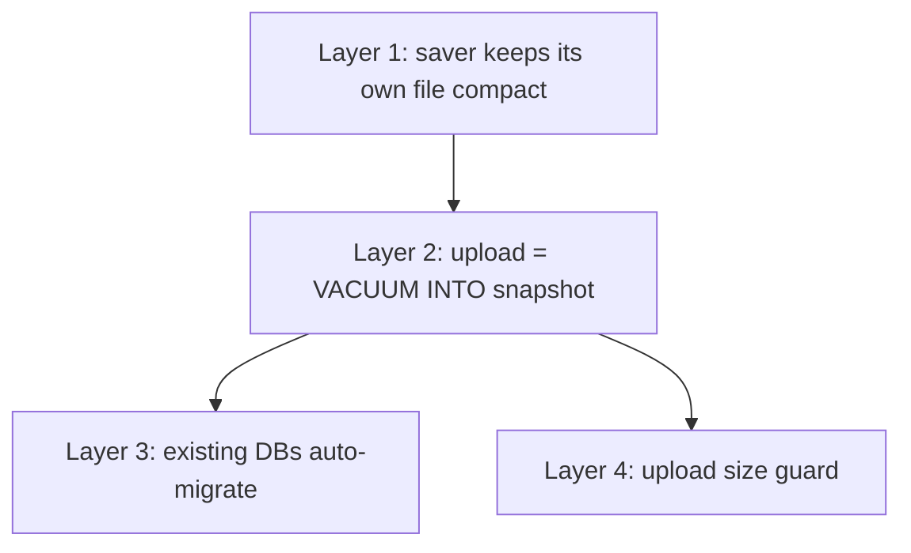

# Checkpoint Storage Hardening

Bound the size of per-user checkpoint SQLite files, make the Matrix backup pipeline
safe for existing bloated DBs (auto-migration, no operator action), and remove the
failure mode where an oversized upload retries forever and OOMs the pod.

## Incident that motivated this

Companion (legacy `apps/app` deployment) OOMKilled every ~2.5h. One user's checkpoint
DB (`did:ixo:ixo1ndrmqeulahuf2aaj3qxl5c29dqmmegtd5k50ly`) reached 667 MB — 601 MB of
which was SQLite freelist (90% dead space, 66 MB live data). Timeline:

1. Saver versions ≤ 1.0.55 never pruned checkpoints. Each LangGraph super-step
   stores the full serialized state, so long threads with large tool outputs grow
   O(N²). Months of use → ~660 MB of live data for the heaviest user.
2. Once gzip(file) crossed the homeserver's 100 MB upload cap, the 10-minute upload
   cron started 413ing deterministically. The compressed buffer (~190 MiB) was
   retained per failed attempt → heap climbed ~190 MiB/tick → OOMKill at the
   container limit.
3. Saver 1.1.0 (2026-08-17) added pruning, which mass-deleted the backlog — live
   data collapsed to 66 MB, but with `auto_vacuum=0` and no `VACUUM` the pages went
   to the freelist and the file stayed 667 MB. Uploads kept failing.

Verified: `VACUUM` takes the file 667 MB → 66 MB, which gzips to 17 MB — well under
the cap.

## Review findings (current runtime code)

| #   | Finding                                                                                                                                                                                   | Where                                                              |
| --- | ----------------------------------------------------------------------------------------------------------------------------------------------------------------------------------------- | ------------------------------------------------------------------ |
| 1   | No page reclamation: `auto_vacuum=0`, no VACUUM anywhere, so pruned pages stay in the file forever and get uploaded as dead weight                                                        | `sqlite-saver` `setup()`, sync service `configureSqliteConnection` |
| 2   | Write amplification: every `put()` rewrites the full checkpoint blob and `INSERT OR REPLACE`s every message in the thread                                                                 | `sqlite-saver` `put()`                                             |
| 3   | No size guard vs the homeserver upload cap → deterministic 413 retry loop, ~25s gzip CPU per tick on an unchanged file                                                                    | `uploadCheckpointToMatrixStorage`                                  |
| 4   | Two full compressed copies in heap per upload (`fs.readFile(gz)` + `crypto.encryptMedia(bytes)`); retained buffer on the 413 error path is the OOM driver                                 | sync service + `matrix-upload-utils`                               |
| 5   | Torn-snapshot race: file is checksummed then gzipped in two passes with no lock — a request writing mid-gzip can produce a corrupt uploaded backup whose stored checksum doesn't match it | `uploadCheckpointToMatrixStorage`                                  |
| 6   | `await fs.stat()` inside the cron's catch block: if the file is gone, the throw escapes the catch and aborts uploads for all remaining users that tick                                    | `uploadCheckpointToMatrixStorageTask`                              |
| 7   | `deleteUserStorageFromMatrix` doesn't clear `syncedUsers`, so the next request routes through corruption recovery (false `[CORRUPTION DETECTED]` logs)                                    | sync service                                                       |

Out of scope for this pass (tracked as follow-ups at the end): the heap-snapshot
hunt for the retained buffer inside matrix-bot-sdk, streaming/chunked uploads,
capping giant tool outputs in graph state, `messages` table retention.

## Design

Four independent layers. Each is safe alone; together they make the file size
bounded, the backup consistent, and the failure mode non-fatal.



### Layer 1 — saver reclaims pages as it prunes (`@ixo/sqlite-saver`)

In `setup()`, before any table creation:

```ts
const mode = this.db.pragma('auto_vacuum', { simple: true });
if (mode !== 2) this.db.pragma('auto_vacuum = INCREMENTAL');
```

On a new/empty DB the pragma binds immediately (it is set before the first page is
allocated). On an existing DB it has no effect until a full `VACUUM` rebuilds the
file — that migration is Layer 3's job, never the request path's.

After `pruneThread()`'s delete transaction commits:

```ts
this.db.pragma('incremental_vacuum');
```

Returns all freelist pages to the filesystem. On a not-yet-migrated DB
(file-level `auto_vacuum` still 0) this is a harmless no-op.

No `VACUUM` ever runs inside `setup()`/`put()` — a multi-hundred-MB migration
VACUUM inside a user request is a timeout risk.

### Layer 2 — upload becomes a compact, consistent snapshot (sync service)

`uploadCheckpointToMatrixStorage` today: checksum live file → gzip live file →
upload. Replace the copy step:

1. Keep the existing live-file checksum as the cheap change detector (unchanged →
   skip, as today). A torn checksum read is harmless — worst case one redundant
   upload; the uploaded bytes never come from the live file anymore.
2. `VACUUM INTO '<checkpointPath>.snapshot.tmp'` via a short-lived read connection
   (delete the target first — `VACUUM INTO` refuses to overwrite).
3. Stream-gzip the snapshot to `.gz.tmp` (existing pipeline code), buffer only the
   gzip output, upload, then delete both temp files in `finally`.

What this buys:

- The uploaded backup is transactionally consistent (fixes finding 5) — `VACUUM
INTO` takes a proper SQLite snapshot regardless of concurrent writers.
- The uploaded backup never contains freelist pages (caps finding 1's blast
  radius even before local migration runs).
- Cost: one rewrite of live data per changed user per tick — ~1 MB typical,
  sub-second; 66 MB pathological, a few seconds, on the cron and not the request
  path. Unchanged users skip before the snapshot via the checksum.

### Layer 3 — existing bloated DBs migrate themselves

Two mechanisms, no operator action, no new env vars:

1. **Idle users self-heal via the existing cleanup.** The hourly cleanup already
   uploads then deletes local files for users idle > 1h. With Layer 2 the next
   request re-downloads the compact snapshot — bloated local files vanish on
   their own.
2. **Active users migrate in the upload cron.** In
   `uploadCheckpointToMatrixStorage`, immediately after the point where the
   cached connection has been closed and the user confirmed inactive, add a
   compaction check:

   ```
   freelistBytes = freelist_count * page_size
   if freelistBytes > 10 MB and freelist_count / page_count > 0.2:
       re-check isUserActive (shrink the race window)
       PRAGMA auto_vacuum = INCREMENTAL; VACUUM;   // one-time; flips file mode too
       log before/after sizes
   ```

   After this runs once, Layer 1's `incremental_vacuum` keeps the file compact
   forever and the check never fires again. Concurrency: a request arriving
   mid-VACUUM waits on `busy_timeout` (5s both sides) exactly like today's
   close-then-gzip window; worst case one `SQLITE_BUSY` retry.

### Layer 4 — never attempt a doomed upload

- Resolve the homeserver cap once per process:
  `mxClient.doRequest('GET', '/_matrix/client/v1/media/config')`, falling back to
  `/_matrix/media/v3/config`, falling back to a 100 MB constant. Cached in the
  sync service. (E2E encryption is AES-CTR — no size overhead, so the gzip size
  is the wire size.)
- After gzipping the snapshot: if it exceeds the cap, log one loud, actionable
  error (sizes, cap, user DID, "checkpoint exceeds homeserver upload limit —
  backup skipped"), memoize the live-file checksum in an `oversizedChecksum` map,
  and return. Subsequent ticks skip before the snapshot/gzip work until the file
  actually changes. No upload attempt → no 413, no buffer on the error path, no
  CPU burn.
- Two one-line robustness fixes: `fs.stat(...).catch(() => undefined)` in the
  cron's error logger (finding 6); clear `syncedUsers` in
  `deleteUserStorageFromMatrix` (finding 7).

## Memory budget after the change

| Path                     | Peak heap                      | Notes                                     |
| ------------------------ | ------------------------------ | ----------------------------------------- |
| Upload, typical user     | ~2 × 1 MB                      | gzip buffer + encrypt copy                |
| Upload, worst legitimate | ~2 × cap (≤ 200 MB, transient) | only for a genuinely under-cap large file |
| Upload, oversized file   | ~0                             | skipped before any buffer is allocated    |
| Download                 | ~2 × compressed size           | unchanged; gunzip already streams to disk |

## Testing

Unit tests only (real `better-sqlite3` against temp files — no mocks of SQLite,
no Matrix dependency):

- **Saver** (`packages/sqlite-saver/src/tests/`): new DB reports `auto_vacuum=2`;
  after pruning fires, `freelist_count=0` and the file is smaller than its peak;
  a legacy `auto_vacuum=0` DB opens without a VACUUM (request path stays fast)
  and `incremental_vacuum` no-ops; existing pruning tests keep passing.
- **Sync service**: extract the compaction decision + execution into a testable
  unit; test that a bloated file (big inserts then deletes) gets compacted and
  mode-flipped, a compact file is left alone, and an active user is never
  compacted. Guard logic: oversized snapshot → skip + memo; changed file clears
  the memo.
- Integration tests are not auto-run (repo rule); the existing integration
  surface covers the upload/download round-trip.

## Prod remediation (immediate, independent of this change)

Do **not** upload the locally-repaired copy — the local file is an Aug 18
snapshot and prod has newer conversations. Fix in place on the pod (Node with
`node:sqlite` is available there):

```bash
# pod name rotates on every OOM restart — look it up first
POD=$(kubectl -n core get pods -o name | grep ixo-companion)
# the affected DB (storage key 4004c09892c389966 from the pod logs):
DB="/app/apps/app/matrix-storage/db/user_dbs/did:ixo:ixo1ndrmqeulahuf2aaj3qxl5c29dqmmegtd5k50ly/4004c09892c389966.db"
kubectl -n core exec -it "$POD" -- node -e "
const { DatabaseSync } = require('node:sqlite');
const db = new DatabaseSync('$DB');
db.exec('PRAGMA busy_timeout=60000');
db.exec('PRAGMA auto_vacuum=INCREMENTAL');
db.exec('VACUUM');
db.close();"
```

Preconditions: ~700 MB free disk on the volume; ideally run while that user is
not mid-conversation. Expected result: file drops to ~66 MB, next cron tick
uploads ~17 MB, the OOM loop ends. The legacy pod stays manually fixed until
Companion moves to the runtime, where this design makes it self-healing.

## Follow-ups (not in this pass)

- Heap-snapshot the retained ~190 MiB buffer on a failed upload (matrix-bot-sdk
  error object / Rust crypto NAPI are the candidates).
- Streaming or chunked uploads for legitimately-huge checkpoints.
- Cap giant tool outputs before they enter graph state (the growth driver).
- Retention policy for the `messages` transcript table.
