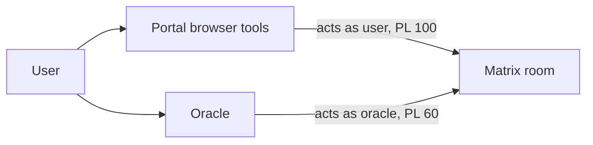

# Editor Plugin Rewrite — Content Assistant

Status: implemented (wave 1). Corrections from implementation folded in below.
Date: 2026-08-24
Repos in scope: `ixo-oracles-boilerplate` (oracle runtime), `impacts-x-web` (Portal)

## Goal

An oracle acting as a personal assistant that can **read and edit the content of the
user's editor documents** — the page they have open, or one it finds by name.

Explicitly **not** in scope: building flows, configuring action blocks, executing
blocks, filling forms, minting UCAN invocations, or touching run state.

## Why the current plugin is broken

Verified against `@ixo/editor` 6.32 (Portal) vs 6.0.1 (runtime):

1. **Runtime state moved.** Per-block state lives in `runs.<runId>.actions.<blockId>`,
   not the flat `doc.getMap('runtime')`. `readActionState` (`flowEngine/runs.ts:1037`)
   consults the flat map only when `usesLegacyRuntimeCompatibility(yDoc)`. Documents
   created by the current Portal are stamped `MULTI_RUN_STORAGE_VERSION` at birth, so
   our reads return empty and our writes are invisible.
2. **Our writes can corrupt classification.** `getRunStorageVersion` (`runs.ts:665`)
   falls back to `hasLegacyRuntimeHistory()`. One flat-`runtime` write latches a
   document to legacy v1 permanently — CRDT history is immutable.
3. **`docType: 'page'` was removed.** `DocType = 'template' | 'flow'`. Mode is derived
   from the room alias (`BaseEditorViewer.tsx:139`), not the CRDT.
4. **`create_page` builds the wrong room.** Canonical shape is
   `createBlocknoteCollaborativeRoom` (`matrix/client/actions/room.ts:371`):
   `joinRule: restricted`, `events_default: 50`, `users_default: 0`, `ParentAlias`,
   `creationContent.parent_space_id`. Ours uses `Preset.PrivateChat`, invite-only, and
   makes the oracle admin the owner instead of the user.
5. **Silent write failures.** `events_default: 50` with `users_default: 0` means the
   oracle can only write where granted PL >= 50. `provider.ts` never checks
   `provider.canWrite`, and matrix-crdt's `retryIfForbiddenInterval` retries forever —
   so tools report success on writes that never land.
6. **The assistant surface is wired shut.** `HomeChat.tsx:189` passes only
   `{ sessionId, matrixClient }` and `HomeChat.tsx:327` sends no `editorRoomId`/`spaceId`,
   so the editor plugin contributes zero tools and `list_workspace_pages` is never
   constructed. `SidebarAiChat.tsx:211` gates `editorRoomId` on `isPageEditorOpen`, an
   AgUI-canvas flag that is false when a template is open in the normal editor.

## Architecture — two lanes

Each lane does only what its identity permits.



**Browser tools (act as the user)** own access and addressing:

| Tool                     | Status               |
| ------------------------ | -------------------- |
| `list_workspace_pages`   | exists, needs wiring |
| `create_template_room`   | exists, needs wiring |
| `create_page_room`       | NEW                  |
| `grant_assistant_access` | NEW                  |

**Server plugin (acts as the oracle)** owns document content only.

## Oracle plugin

### Deleted

| File / tool                                                                                              | Reason                                                    |
| -------------------------------------------------------------------------------------------------------- | --------------------------------------------------------- |
| `mint-invocation-tool.ts` (`mint_invocation`)                                                            | no execution                                              |
| `execute_action` (in `blocknote-tools.ts`)                                                               | no execution                                              |
| `apply-sandbox-output.ts`                                                                                | out of scope; wrote arbitrary props to any block          |
| `page-functions.ts#createPage`, `page-tools.ts#create_page`                                              | wrong shape + identity; replaced by browser tools         |
| `survey-helpers.ts`, `read_survey`, `fill_survey_answers`, `validate_survey_answers`                     | form answers are run state; Portal has `fill_open_survey` |
| `read_permissions`, `read_block_history`                                                                 | unused surface                                            |
| `readRuntimeState`, `updateRuntimeState`, `readInvocations`, `readDelegations`, `readAuditTrailForBlock` | run state — never touched again                           |
| `read_flow_status`, `read_flow_context`                                                                  | depended on run state                                     |

### Tool surface (9)

Read: `read_document`, `read_block`, `search_document`.
Write: `insert_content`, `edit_block` (batch), `delete_block`, `move_block`, `replace_text`.
Plus the `call_editor_agent` sub-agent wrapper.

`prompts.ts` shrinks to match nine content tools.

### The write path

Every write goes through one `applyDocumentEdit`:

1. Refuse if the room alias is `#flow-*` → `read_only_flow`.
2. Refuse if `provider.canWrite === false` → `needs_access`.
3. Refuse if the oracle's power level is below the room's write threshold → `needs_access`.
4. Apply the prop allowlist.
5. Mutate inside one `doc.transact()`.
6. `await provider.waitForFlush()` (bounded) **before** reporting success.
7. Re-check `canWrite` after the flush → `needs_access`.

Steps 3 and 7 exist because **`provider.canWrite` initialises to `true`** and only flips
after a write is rejected with `M_FORBIDDEN`. Step 2 alone can therefore never catch a
missing grant on the first write of a session. Step 3 (power levels vs
`events['matrix-crdt.doc_update'] ?? events_default`, fail-open) catches it up front;
step 7 (fail-closed) is what makes "flush before reporting success" actually honest.

### Prop allowlist

- Prose blocks (`defaultBlockSpecs`): content and props freely.
- The 24 IXO blocks (`mantine/blocks/index.ts` `blockSpecs`): `title` and `description` only.
  (An earlier draft said 26, from a stale table in `architecture-overview.md`.)
- `secrets`, `skills`: no writes ever. `secrets` props redacted on read.

Behavioural props (`conditions`, `authorisedActors`, action `type`, inputs, delegation
config) are never writable.

### Never touched

`doc.getMap('runtime')`, `runs`, `runsTerminal`, `invocations`, `delegations`.
No run state, ever. This makes defect (2) above unreachable by construction.

### Typed failures

`needs_access`, `read_only_flow`, `prop_not_editable` (names the prop),
`block_not_found`, `not_a_member`. Returned as values, not thrown strings, so the agent
can act on them.

### Availability

`getRequestTools` / `getRequestSubAgents` continue to key off `state.editorRoomId` and
`state.spaceId`, and keep the existing `isUserInRoom` membership guard — the oracle acts
with the admin identity, so "the user's documents" is always computed from the user's
membership, never from what the admin can see.

`@ixo/editor` stays at 6.0.1, but its fragment primitives are **NOT usable** here — an
earlier draft of this spec wrongly said to prefer them. Two independent reasons, both
verified:

1. **Dual yjs instances.** `@ixo/editor@6.0.1` resolves yjs **13.6.27**; oracle-runtime
   resolves **13.6.32**. Every `instanceof Y.XmlElement` inside those primitives is
   therefore false, and they fail _silently_: `readBlocksFromFragment` returns `[]`,
   `setBlockProps`/`removeBlockFromFragment` return `false`,
   `writeCompiledBlocksToFragment` throws. The editor's own `core/lib/yjsTypes.ts`
   documents this hazard (it ships `isYMapLike` precisely because `instanceof` is
   unreliable across package instances).
2. **Attr-only by design.** `setBlockProps` → `replaceBlockInFragment` deletes and
   rebuilds the block container, destroying prose inline content. `readFlowDocument`
   additionally reads `doc.getMap('runtime')` and returns `null` for non-flow documents.

Use `@blocknote/server-util` instead — already a dependency, and verified to resolve the
**same** yjs 13.6.32 as the runtime — for all new block structure, plus direct yjs for
surgical edits. Never round-trip a whole document through `yXmlFragmentToBlocks`: it
silently drops custom IXO blocks.

## Portal changes

1. **`editorRoomId` source.** Replace `isPageEditorOpen && selectedRoomId`
   (`SidebarAiChat.tsx:211`) with `useActiveFlowEditorStore((s) => s.roomId)`, set by
   `BaseEditorViewer` (line 163) for any mounted collaborative editor. Add the same to
   `HomeChat.tsx`.
2. **HomeChat spaces.** `HomeChat.tsx:189` must pass `personalPagesSpaceId`,
   `personalFlowsSpaceId`, `currentSpaceId`, `domainFlowsSpaceId` — resolved the way
   `SidebarAiChat.tsx:117-128` already does.
3. **HomeChat metadata.** Include `spaceId` (personal Pages space) in `sendMessage`.
4. **`create_page_room`.** Sibling of `create_template_room`, targeting
   `personalPagesSpaceId`, alias `createAlias("page", …)`, same
   `createBlocknoteCollaborativeRoom` call, same atomic oracle invite at PL 60.
5. **`grant_assistant_access({ roomId?, oracleUserId })`.**
   - `roomId` defaults to the active editor room.
   - **Idempotent first**: if the oracle is already joined with PL >= 50, return success
     and never open the modal. The gate fires once per room, not once per turn.
   - Check the user's own PL before acting. Matrix requires PL >= the level being
     granted, so granting 60 needs the user at >= 60. Otherwise return a clear reason.
   - Open a new `GRANT_ASSISTANT_ROOM_ACCESS` modal (config payload
     `{ roomId, roomName, oracleUserId }`), following the `GRANT_ORACLE` pattern in
     `redux/user/grantOracleModal.ts`, and await the decision.
   - On confirm: `invite` then `setPowerLevel(…, 60)`. The oracle joins on its next
     connect (`provider.ts#ensureRoomAvailable` already calls `joinRoom`).
   - On decline: `{ granted: false }`.

## User journeys

1. **Template open.** Portal sends `editorRoomId` → sub-agent connects → `canWrite`
   false → `grant_assistant_access` → confirm → read → edit → edits appear live in the
   open editor via matrix-crdt.
2. **Nothing open.** "Make me a page" → `create_page_room` → `insert_content` → link.
3. **By name.** `list_workspace_pages` → read → append. No room id from the user.
4. **A live flow.** Read and describe; edits refused with `read_only_flow`.
5. **No access possible.** Reported plainly instead of silently failing.

## Testing

- **Unit** (plain `Y.Doc`, no Matrix): prop allowlist, write guard ordering, block-tree
  mapping, typed failures, `secrets` redaction.
- **Integration** (`*.int.test.ts`): real Nest boot, real Matrix room. Must throw at file
  load on missing env, never skip. Share one session across the describe. Not run
  automatically.

## Conventions (binding)

- No type assertions (`as any`, `as unknown as X`) to silence the compiler.
- No task/spec metadata in source comments.
- No co-author or "Generated with Claude" lines in commits or PRs.
- No loosening assertions to make tests pass.
- Run `pnpm lint` and `pnpm format` before reporting done.

---

## Wave 2 — create-then-write, domain placement, open-on-create

Status: approved 2026-08-24. Findings from live use of wave 1.

### What broke in use

1. "Created the page but couldn't add content — the editor is open on a different
   document." Two paths bound the same tool name `call_editor_agent`; with a document
   open, the room-bound sub-agent won and it accepted no `room_id`, so a page created
   mid-turn had no tool that could write into it.
2. `create_page_room` always targeted the personal Pages space. In a domain, pages must
   land in that domain.
3. The new page was not opened.

### Verified Portal behaviour (mirror it exactly — do not invent)

- **Workspace "Create Page"** (`hooks/useWorkspaceRoomCategories.tsx`): calls
  `useBlocknoteActions().createTemplate(name, undefined, personalFlowsSpaceId)` → a
  **template-alias** room (`createAlias("template", entityDid)`) in the personal
  **flows** space, then `setSelectedRoom(roomId)` and
  `router.push({ pathname: EWorkspacePageRoutes.Pages, query: { roomId } }, undefined,
{ shallow: true })`. It never uses the personal Pages space.
- **Domain pages** live in the domain's Pages subspace (`useMatrixSourceSpaces().domainPages`),
  a first-class route `pages/domain/[entityDid]/[spaceId]/index.tsx`. Its "New page"
  (`handleCreateTemplateInSpace`) calls `createTemplate(name, undefined, routeSpaceId)`,
  then `setSelectedRoom(roomId)` and
  `router.push({ pathname: `/domain/${entityDid}/${routeSpaceId}`, query: { roomId } })`.
- **Who may create in a domain**: the Library gates its "New template" on
  `canPin && canCreateRoomsInFlows` (`components/Pages/Library/LibraryCanvas.tsx:180`),
  where `canCreateRooms` comes from `useMatrixPermissionsByRoomId(subspaceId, …)` and
  `canPin` is the entity-controller check. Reuse that predicate against the **Pages**
  subspace. Do not reimplement it.
- A room is listed/opened only after `useRoomListStore.getState().incrementMetadataVersion()`.
- Visibility is not a per-page choice: every BlockNote room is `restricted`, i.e. visible
  to members of the parent (domain) space. Nothing to ask the user.

### Runtime (oracle) — `packages/oracle-runtime/src/plugins/editor/`

Already applied in the working tree (verify, don't redo): one `call_editor_agent` tool,
always bound, `room_id` optional and defaulting to `state.editorRoomId`; the sub-agent
path (`createEditorSubAgent`) is deleted; new typed failure `no_document`.

Remaining:

- Fix `failures.ts`: the `/** Anything unexpected … */` doc comment must sit above
  `editorError`, not above `noDocument`.
- Re-point `editor.plugin.test.ts` to the single-tool contract (no `getRequestSubAgents`),
  and add: default-to-open-document, explicit `room_id` overrides the open document,
  `no_document` when nothing is open and none is given, `room_id` optional in the schema.
- Prompts: after `create_page_room`, delegate immediately with `room_id` set to the returned
  id — never ask the user to open the page first (partly applied; verify both overlays).
  When `create_page_room` returns `placedIn: "personal"` with
  `fallbackReason: "not_domain_controller"`, the assistant must tell the user plainly:
  they do not have access to add pages in this domain, so the page was created in their
  personal space. Then continue with the content.
- Public export `createEditorSubAgent` is gone from `index.ts`. Docs update is a later wave.

### Portal — `impacts-x-web`

**`create_page_room`** (`lib/companion-tools/createPageRoomTool.ts`):

- Inputs to the factory (resolved with hooks in the component that calls `getTools`, passed
  as plain values): `personalFlowsSpaceId`, `domainPagesSpaceId`, `entityDid`,
  `canCreateDomainPages: boolean` (the Library predicate evaluated against the Pages
  subspace), and whatever is needed to navigate.
- Target resolution: in a domain and allowed → the domain Pages subspace. In a domain and
  **not** allowed → the personal flows space (what the workspace button does), and the
  result says so. Not in a domain → personal.
- Alias: `createAlias("template", entityDid)` — what the Portal's own buttons produce.
  The tool name stays `create_page_room`; a "page" in the Portal IS a template-alias room.
- Keep: `createBlocknoteCollaborativeRoom`, oracle invited at PL 60 atomically via the
  `daoMemberAddresses` path.
- After create: `setSelectedRoom(roomId)`, `incrementMetadataVersion()`, then navigate the
  way the matching UI button does (domain route with `?roomId`, or
  `EWorkspacePageRoutes.Pages` with `?roomId`).
- Result shape (the runtime prompt depends on it):
  ```
  { success: true, roomId, placedIn: "domain" | "personal", entityDid?,
    fallbackReason?: "not_domain_controller" | "no_domain_pages_space", opened: boolean }
  ```
  Failure: `{ success: false, error }`.

**`list_workspace_pages`**: when in a domain, also list the domain's Pages and Flows
subspaces; add `scope: "personal" | "domain"` per row.

**Wiring**: `SidebarAiChat` computes and passes `domainPagesSpaceId`, `entityDid`,
`canCreateDomainPages`; `HomeChat` stays workspace-only. `grant_assistant_access` unchanged.

**Tests**: domain placement, fallback with reason, no-domain path, navigation call, result
shape, and the domain rows in `list_workspace_pages`.
