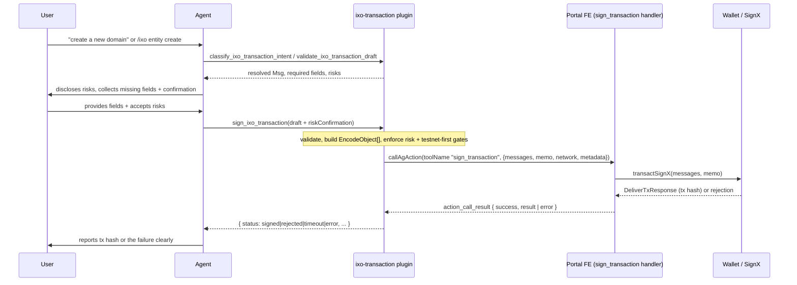

# IXO Transaction Signing Plugin — v1 Spec

Status: Approved (v1 subset). Supersedes the wallet-signing intent of PR #211,
which is retained only as a prototype of the catalog/validation layer.

## 1. Problem

Oracle agents can reason about IXO transactions but cannot get them signed. The
user's keys live in their Portal wallet on the frontend (SignX). We need a
plugin that lets an agent turn a conversation into a validated IXO transaction
and hand it to the user's wallet to sign — without the oracle ever holding keys,
signing, or broadcasting.

## 2. Goal

> understand intent → collect missing fields → validate strictly → disclose risk
> and get explicit confirmation → dispatch a `sign_transaction` action to the
> Portal frontend → the user signs in their own wallet → the result (tx hash,
> rejection, timeout, or error) comes back into the chat.

## 3. Non-goals (v1)

- No server-side signing, broadcasting, or key custody. The wallet owns that.
- No chain queries (balances, state). Write-path only.
- No automatic execution — a human always signs in their wallet.
- Modules deferred to a follow-on milestone: `bonds`, `liquidstake`, `names`,
  and broad generic Cosmos authz (`MsgGrant`/`MsgExec`). Deferred until proto
  support and wallet execution paths are confirmed. (`names` has no codegen in
  `@ixo/impactxclient-sdk@2.4.1`, so it cannot be supported yet.)

## 4. v1 transaction coverage

Included modules (validated against `@ixo/impactxclient-sdk` protobufs):

- `entity` — create, update, update-verified, transfer, create-account, and the
  concrete entity-account authz routes (grant/revoke).
- `iid` — IID/DID document lifecycle (controllers, verifications, services,
  linked resources/claims/entities, accorded rights, contexts, deactivate).
- `claims` — collection + claim lifecycle (create-collection, submit, evaluate,
  dispute, payments, collection policy updates, claim authorization).
- `token` — impact-credit lifecycle (create, mint, transfer, transfer-credit,
  retire, cancel, pause, stop).
- `smart-account` — authenticator lifecycle (add/remove authenticator,
  set-active-state).

Any message that cannot be confirmed against the SDK proto set is dropped from
the v1 catalog rather than guessed. Two messages from the PR #211 prototype were
dropped for this reason: the entire `names` module and `MsgUpdateCollectionQuota`
do not exist in `@ixo/impactxclient-sdk@2.4.1`.

## 5. Architecture

The load-bearing primitive already exists: `callAgAction` (`@ixo/common`) emits
an `action_call` event to the frontend and awaits the matching
`action_call_result`. This is the exact mechanism the bundled `agui` plugin
uses. The transaction plugin reuses it directly — validated transaction data is
carried in the action args and is never round-tripped through the LLM.



## 6. Frontend contract

The Portal frontend registers an AG-UI action handler named `sign_transaction`:

```ts
registerAgAction(
  {
    name: 'sign_transaction',
    description: '…',
    schema: SignTransactionArgsSchema,
  },
  async ({ messages, memo }) => {
    const res = await transactSignX(messages, memo); // EncodeObject[] -> DeliverTxResponse
    return {
      transactionHash: res?.transactionHash,
      height: res?.height,
      code: res?.code,
    };
  },
);
```

Action args dispatched by the plugin:

```ts
{
  messages: Array<{ typeUrl: string; value: Record<string, unknown> }>; // EncodeObject[]
  memo?: string;
  network: 'devnet' | 'testnet' | 'mainnet';
  metadata: { messageName: string; typeUrl: string; riskLevel: string; risks: string[] };
}
```

`messages` is `EncodeObject[]` — exactly what `transactSignX` / `signAndBroadcast`
consume today. Encoding happens on the frontend via the existing chain-client
registry (the same path every Portal transaction uses).

Result contract (`action_call_result.result`): `{ success: boolean, error?, ... }`.
`callAgAction` rejects when `success === false`, when an `error` is present, or on
timeout; the plugin catches and maps to a structured status.

## 7. Plugin design

| Aspect       | Decision                                                                                     |
| ------------ | -------------------------------------------------------------------------------------------- |
| Location     | Bundled plugin: `packages/oracle-runtime/src/plugins/ixo-transaction/`                       |
| Name         | `ixo-transaction`                                                                            |
| Visibility   | `on-demand` — bundled but deliberately loaded via `load_capability`, never always-on         |
| Category     | `integration`                                                                                |
| Dependencies | None hard. Uses `callAgAction` directly; requires the FE to register `sign_transaction`      |
| Config       | `IXO_TRANSACTION_SIGN_TIMEOUT_MS` (optional, default 120000) — wallet signing is human-paced |

### Tools

| Tool                              | Effect                                     | Output                                          |
| --------------------------------- | ------------------------------------------ | ----------------------------------------------- |
| `list_ixo_transaction_routes`     | none (read-only)                           | supported routes, fields, risk levels           |
| `classify_ixo_transaction_intent` | none (read-only)                           | resolved route + confidence + ambiguities       |
| `validate_ixo_transaction_draft`  | none (read-only)                           | canonical `{typeUrl,value}`, risks, gate status |
| `sign_ixo_transaction`            | dispatches `sign_transaction` to FE wallet | `{ status, transactionHash?, error? }`          |

Only `sign_ixo_transaction` touches the wallet.

## 8. `sign_ixo_transaction` behaviour

1. Parse draft (one of: `input` / `command` / `messageType`+`action` / `typeUrl`,
   plus `value`, `network`, `memo`, `riskConfirmation`, `testnetReceipt`,
   `overrideMainnet`+`overrideReason`).
2. Resolve intent → `MessageSpec`; build + strictly validate `value`
   (reject unknown/missing/malformed: DID, `ixo1` address, integer micro-units,
   timestamps).
3. Risk gate: if the message is risky and `riskConfirmation.confirmed !== true`,
   refuse and return the risks for the agent to surface.
4. Mainnet gate: `network === 'mainnet'` requires a successful `testnetReceipt`
   or explicit `overrideMainnet` + `overrideReason`.
5. Require `ctx.session.id` (wallet signing is Portal-only); otherwise return a
   clear error instead of dispatching.
6. `callAgAction({ sessionId, toolCallId, toolName: 'sign_transaction',
args: { messages, memo, network, metadata }, timeout })`.
7. Map the outcome to `{ status: 'signed' | 'rejected' | 'timeout' | 'error', … }`.
   Never report success on a rejection or timeout.

## 9. Risk model

- Agent proposes; the human signs in their own wallet. The oracle cannot move
  funds unilaterally.
- Explicit, itemised risk acceptance required before: ownership transfer,
  funds/credit movement, authority grants, claim evaluation/payment changes,
  account/authenticator changes, and any mainnet transaction.
- Testnet-first: default `testnet`; mainnet requires a testnet receipt or a
  recorded explicit override.
- `sign_ixo_transaction` is `on-demand`, kept out of the default toolset.

## 10. Testing (against the real runtime — no stubs)

- Unit: intent routing (slash/NL/typeUrl/aliases), validation (happy + each
  rejection), risk + mainnet gates.
- Manifest: instantiate the real `OraclePlugin`; assert `validateManifest`
  passes and the four tools register.
- Round-trip: drive `sign_ixo_transaction` against the real `rootEventEmitter`
  — assert it emits `action_call` with `toolName: 'sign_transaction'` and a
  correct `EncodeObject[]`, then resolve `action_call_result` and assert the
  mapped status. Assert refusal on missing risk confirmation,
  mainnet-without-receipt, and missing session; assert timeout and rejection
  mapping.

## 11. Reused vs replaced (from PR #211)

Reused (ported, validated): message catalog, intent routing, alias/typo
handling, validation + risk + testnet gating, Zod field primitives.

Replaced: invented `signxTransaction` / `ixo.portal.iframe.v1` output, the
mocked-runtime tests and fabricated `@ixo/oracle-runtime` type stub, and the
"return JSON to the LLM" flow — with a real `action_call` round-trip carrying
`EncodeObject[]` to the frontend `sign_transaction` handler, plus integration
tests against real runtime behaviour.

## 12. Follow-on milestones

- Add `bonds`, `liquidstake`, and generic authz once proto + wallet execution
  paths are confirmed.
- Optional server-side message normalisation via `@ixo/impactxclient-sdk`
  `fromPartial` if frontend-registry encoding proves insufficient.
