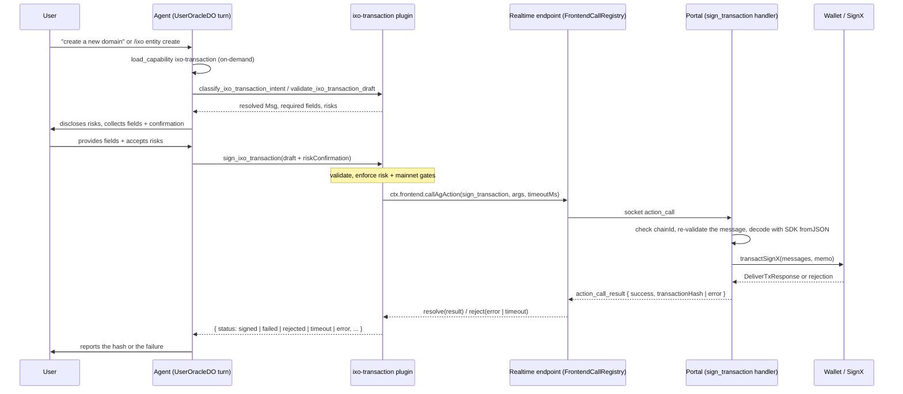

# IXO Transaction Signing Plugin — Workers runtime

Status: v1 on the Workers runtime. Ports pull request 212 (the rebuild) onto
`@ixo/oracle-runtime-workers`, with the parts of pull request 211 listed in
§11. The Node runtime (`@ixo/oracle-runtime`) is deprecated and gets no copy of
this plugin.

## 1. Problem

Oracle agents can reason about IXO transactions but cannot get them signed. The
user's keys live in their Portal wallet (SignX). We need a plugin that lets an
agent turn a conversation into a validated IXO transaction and hand it to the
user's wallet to sign — without the oracle ever holding keys, signing, or
broadcasting.

## 2. Goal

> understand intent → collect missing fields → validate strictly → disclose risk
> and get explicit confirmation → dispatch a `sign_transaction` AG-UI action to
> the Portal → the user signs in their own wallet → the result (tx hash,
> rejection, timeout, or error) comes back into the chat.

## 3. Non-goals (v1)

- No server-side signing, broadcasting, or key custody. The wallet owns that.
- No chain queries (balances, state). Write path only.
- No automatic execution — a human always signs in their wallet.
- Modules deferred: `bonds`, `liquidstake`, `names` and generic Cosmos authz
  (`MsgGrant`/`MsgExec`). `names` has codegen in `@ixo/impactxclient-sdk@3.0.0`
  (it had none in 2.4.1) but its wallet path has not been exercised; it stays
  deferred until it has.

## 4. v1 transaction coverage

Verified against `@ixo/impactxclient-sdk@3.0.0`, the version in the lockfile.
`packages/ixo-transaction/tests/catalog-sdk.test.ts` asserts, for every catalog
entry, that the Msg exists in the SDK, that the catalog's field names are
exactly the SDK message's fields, and that a sample built from the catalog's
field kinds encodes to protobuf bytes through the SDK codec.

- `entity` — create, update, update-verified, transfer, create-account,
  grant-account-authz, revoke-account-authz.
- `iid` — the IID document lifecycle (20 messages).
- `claims` — create-collection, submit, evaluate, dispute, claim-intent,
  create-claim-authorization, and the collection updates (state, dates,
  payments, intents, quota).
- `token` — create, mint, transfer, transfer-credit, retire, cancel, pause,
  stop.
- `smart-account` — add/remove authenticator, set-active-state.

SDK 3.0.0 adds fields to six claims messages (CW1155 payments, `memberAddress`,
dispute deposits and adjudicators, `targetRole`) and adds
`MsgUpdateCollectionQuota` back; the catalog carries them. The other claims
messages new in 3.0.0 (performance deposits, adjudication, collection members,
`MsgWithdrawPayment`) are not in v1.

## 5. Mapping onto the Workers runtime

| PR 212 (Node)                                                                    | Workers port                                                                                                                                                                                                                                                                            |
| -------------------------------------------------------------------------------- | --------------------------------------------------------------------------------------------------------------------------------------------------------------------------------------------------------------------------------------------------------------------------------------- |
| `ixo-transaction` package, root export                                           | `@ixo/ixo-transaction`, root export: catalog, intent routing, schemas, validation, action args, outcome classification. Depends on `zod` only — no SDK, no runtime, no Node built-ins.                                                                                                  |
| `ixo-transaction/qiforge` (`OraclePlugin` from `@ixo/oracle-runtime/plugin-api`) | Removed. The plugin lives in the runtime: `packages/oracle-runtime-workers/src/plugins/ixo-transaction/`, written against `src/plugin-api` (`OraclePlugin`, `tool()`, manifest, `configSchema`). No Node plugin-api subpath.                                                            |
| `callAgAction` from `@ixo/common` (root event emitter)                           | `ctx.frontend.callAgAction({ sessionId, toolCallId, toolName, args, timeoutMs })` — the realtime endpoint (`src/realtime/realtime-endpoint.ts`) emits `action_call` on the session's sockets and parks the call in `FrontendCallRegistry` until `action_call_result` or the timeout.    |
| `ctx.session.id` check                                                           | Same, plus `ctx.frontend` present and `ctx.frontend.hasClient(sessionId)` — as the bundled `agui` and `portal` plugins do. Otherwise `unavailable`.                                                                                                                                     |
| `randomUUID` from `node:crypto`                                                  | `crypto.randomUUID()` (Web Crypto, available in workerd).                                                                                                                                                                                                                               |
| `IXO_TRANSACTION_SIGN_TIMEOUT_MS` (first commit of 212)                          | Kept, in the plugin's `configSchema`; default 120 000 ms, at most 300 000 ms.                                                                                                                                                                                                           |
| Testnet-first gate (receipt or override)                                         | Receipt only, verified: a signed testnet result is recorded in the user's `ctx.blobStore` (hash + message digest, 24 h); a mainnet draft must cite that record for the same message. No override. On top, `IXO_TRANSACTION_ALLOW_MAINNET` (default `'false'`) refuses mainnet outright. |
| Status mapping (first commit of 212)                                             | Kept: `signed`, `rejected`, `timeout`, `error`, `validation_error`, `unavailable`; added `failed` (included in a block with a non-zero code, hash and code kept). A timeout is an unknown outcome (§8).                                                                                 |
| `useIxoTransactionSigningAction()`                                               | `useIxoTransactionSigningAction({ chainId })` in `@ixo/ixo-transaction/react`. Every request names its chain id (`IXO_TRANSACTION_CHAIN_ID_*`, defaults verified against each network's RPC); the Portal passes its wallet's chain id and the handler refuses any other.                |
| `zod3` alias for the client SDK                                                  | Dropped: `@ixo/oracles-client-sdk` is on Zod 4 now.                                                                                                                                                                                                                                     |
| SDK `exposeToAgent` + `registeredAgActions`                                      | Ported to `@ixo/oracles-client-sdk`; `agActions` is derived from the registered list instead of kept as a second state.                                                                                                                                                                 |
| `cli.ts`, `scripts/*` (skill layout)                                             | Dropped: Node-only, no consumer once the skill layout is gone.                                                                                                                                                                                                                          |

The plugin is shipped with the runtime and exported from `src/plugins/index.ts`
but is **not** part of `BUNDLED_WORKERS_PLUGINS`: an oracle opts in with
`plugins: [...BUNDLED_WORKERS_PLUGINS, new IxoTransactionPlugin()]`, as PR 212's
final revision intended. Bundling it in the runtime (rather than shipping the
plugin from the package) keeps the package free of the runtime: the runtime is
published as TypeScript source and type-checks only under its own Workers
compiler settings. The runtime's new dependency is the package's root export,
which has no `@ixo/impactxclient-sdk` in it; the SDK is an optional peer of the
`/react` subpath only. (The runtime already reaches `@ixo/impactxclient-sdk`
transitively through `@ixo/common`; this port adds no direct dependency.)

## 6. Architecture


```mermaid
sequenceDiagram
    participant U as User
    participant A as Agent (UserOracleDO turn)
    participant P as ixo-transaction plugin
    participant R as Realtime endpoint (FrontendCallRegistry)
    participant FE as Portal (sign_transaction handler)
    participant W as Wallet / SignX
    U->>A: "create a new domain" or /ixo entity create
    A->>A: load_capability ixo-transaction (on-demand)
    A->>P: classify_ixo_transaction_intent / validate_ixo_transaction_draft
    P-->>A: resolved Msg, required fields, risks
    A->>U: discloses risks, collects fields + confirmation
    U->>A: provides fields + accepts risks
    A->>P: sign_ixo_transaction(draft + riskConfirmation)
    Note over P: validate, enforce risk + mainnet gates
    P->>R: ctx.frontend.callAgAction(sign_transaction, args, timeoutMs)
    R->>FE: socket action_call
    FE->>FE: check chainId, re-validate the message, decode with SDK fromJSON
    FE->>W: transactSignX(messages, memo)
    W-->>FE: DeliverTxResponse or rejection
    FE-->>R: action_call_result { success, transactionHash | error }
    R-->>P: resolve(result) / reject(error | timeout)
    P-->>A: { status: signed | failed | rejected | timeout | error, ... }
    A->>U: reports the hash or the failure
```

## 7. Portal contract

The Portal mounts one hook inside its `OraclesProvider`:

```tsx
import { useIxoTransactionSigningAction } from '@ixo/ixo-transaction/react';

function OraclePortalChat({ walletChainId }: { walletChainId: string }) {
  // From the Portal's own wallet configuration: OraclesProvider's wallet
  // props carry no chain id.
  useIxoTransactionSigningAction({ chainId: walletChainId });
  return <Chat />;
}
```

It registers a `sign_transaction` AG-UI action with `exposeToAgent: false`: the
action is executable over the socket but is never sent to the oracle in
`agActions`, so the agent cannot call the raw wallet action — only the validated
`sign_ixo_transaction` tool reaches it.

Action args (proto-JSON on the wire): `{ action: 'sign_transaction', network,
chainId, messages: [{ typeUrl, value }] (exactly one), memo?, intent, risks,
riskLevel, requiresConfirmation, riskConfirmation?, testnetReceipt? }`.

The handler re-validates the args and the message against the catalog (known
typeUrl, exact fields, every nested schema), refuses (`success: false`) a
`chainId` other than the one the hook was given, decodes the message with the
SDK's generated `fromJSON` (bytes from base64, `Long`, `Timestamp`; an
allowlisted authorization encoded into the grant's `Any`), calls
`transactSignX(messages, memo)` and returns `{ success: true, transactionHash,
code, height }`, `{ success: true, delivered: { code, transactionHash, height },
error }` for a transaction included with a non-zero code, or `{ success: false,
error }` when the wallet threw, refused or returned nothing.

## 8. `sign_ixo_transaction` behaviour

1. Parse the draft (`input` / `command` / `messageType`+`action` / `typeUrl`,
   `value`, `network` (default `testnet`), `memo`, `riskConfirmation`,
   `testnetReceipt`).
2. Resolve intent → `MessageSpec`; strictly validate `value` (unknown, missing
   or malformed fields refused: DID, `ixo1` address, integer micro-units,
   timestamps, base64 bytes, strict nested messages, allowlisted
   authorizations).
3. Risk gate: `riskConfirmation.confirmed === true` and `acceptedRisks`
   containing every string of the route's `risks`, word for word.
4. Mainnet gate: refused unless `IXO_TRANSACTION_ALLOW_MAINNET=true`, and then
   only when `testnetReceipt` names a receipt this plugin recorded for this
   user, for the same hash, on the testnet chain id, with the same message
   digest. A store that cannot be read refuses.
5. Any of 1–4 failing → `{ status: 'validation_error', error }`; nothing is
   dispatched.
6. No session, no realtime channel, or no browser connected to the session →
   `{ status: 'unavailable', error }`.
7. `ctx.frontend.callAgAction` with `toolName: 'sign_transaction'`.
8. Map the outcome:

| Bridge outcome                                                                  | Status        | Known outcome?                                                              |
| ------------------------------------------------------------------------------- | ------------- | --------------------------------------------------------------------------- |
| resolved, `success` not false                                                   | `signed`      | yes                                                                         |
| resolved with `delivered` (included, non-zero code)                             | `failed`      | yes (hash and code reported)                                                |
| rejected, Portal has no `sign_transaction` handler                              | `unavailable` | yes (nothing reached a wallet)                                              |
| rejected (no code, no hash), text says rejected / denied / declined / cancelled | `rejected`    | yes                                                                         |
| rejected with any other error (chain mismatch, refused message)                 | `error`       | as the text says                                                            |
| no answer within the timeout                                                    | `timeout`     | **no** — the user may still sign; the result says so (`outcome: 'unknown'`) |

The tool is a write (`effect` left at its default). Its timeout result says the
call "timed out", which the runtime's tool-execution middleware reads as an
unknown outcome: the write claim stays in the run ledger, so an identical
`sign_ixo_transaction` in a later turn is not dispatched again — the model is
told to verify first. Within the turn the repetition guard already refuses the
repeat, and a resumed turn never repeats it either (tool marks).

A signed testnet result also carries `testnetReceipt: { transactionHash,
receiptId, expiresInHours: 24 }`, recorded in the user's blob store under
`ixo-transaction/receipt:<hash>` with the message's SHA-256 digest; that store
keeps entries at most 24 hours.

A result from a socket of another session never settles the call
(`FrontendCallRegistry.settle` compares the socket's session); the call keeps
waiting and times out.

Every settled wallet outcome is logged to the turn's room as an
`ixo.action.log` event (`logActionToMatrix`), as the `agui` plugin does.

## 9. Risk model

- The agent proposes; the human signs in their own wallet. The oracle cannot
  move funds: the plugin has no signing dependency and no key material in its
  configuration (both asserted by tests).
- Itemised, word-for-word risk acceptance before ownership transfer, funds/credit movement,
  authority grants, claim evaluation/payment changes, account/authenticator
  changes, and any mainnet transaction.
- Testnet first: default `testnet`; mainnet off per oracle by default, and per
  draft needs the oracle's own record of the same message signed on testnet.
- Chain-bound: every request names its chain id; the Portal refuses another.
- On-demand: the tools are hidden until `load_capability` (or the capability
  router) admits the plugin.

## 10. Testing

- Package (`pnpm --filter @ixo/ixo-transaction test`): intent routing, strict
  validation and every gate, action args, catalog vs SDK 3.0.0 (field names,
  every nested schema's keys, nested samples surviving an encode/decode round
  trip, allowlisted authorizations encoded into `Any`), the Portal handler
  (chain check, message re-validation, one-message cap, proto decoding, wallet
  result normalisation including `delivered`), ambiguous intents, deferred
  typeUrls, and a dependency guard (root export: `zod` only; static,
  side-effect, dynamic and `require` imports scanned).
- Runtime, inside workerd (`src/plugins/ixo-transaction/*.test.ts`): manifest
  and config, tool binding and the capability gate through `createMainAgent`,
  each tool's happy path and failures, the signing round trip against a fake
  bridge built on the real `FrontendCallRegistry` (every status, a
  wrong-session result ignored, the timeout keeping the write claim, an
  included-but-failed transaction reported as `failed`), the chain id of every
  request, the mainnet receipt (fabricated, another user's, another plugin's
  blob, another hash or another message refused; the recorded one accepted;
  an unreadable store refused), word-for-word risk acceptance, mainnet off by
  default, no fetch during a signing round trip.
- SDK: `exposeToAgent` registration and the exposed/registered split.

## 11. Taken from PR 211

- The npm publish workflow entry (under the new package name).
- `MsgUpdateCollectionQuota` (dropped by 212 only because SDK 2.4.1 lacked it).
- The risk categories and the failure modes to report (`references/risk-policy.md`)
  and the alias table (`references/intent-routing.md`), folded into
  `packages/oracle-runtime-workers/docs/ixo-transaction.md`.

Not taken: `SKILL.md` and `agents/openai.yaml` (a Codex skill layout the
runtime does not load), `references/ixo-message-catalog.json` (a second copy of
the catalog that would drift; `list_ixo_transaction_routes` serves the
catalog), and the bonds / liquidstake / names catalog entries (deferred, §3).

## 12. Follow-on

- `names`, `bonds`, `liquidstake`, generic authz, and the remaining claims
  messages of SDK 3.0.0, once their wallet paths are confirmed.
- A structured rejection signal from SignX: today `rejected` is recognised from
  the wallet's error text.
