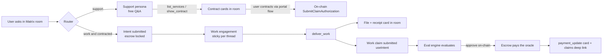
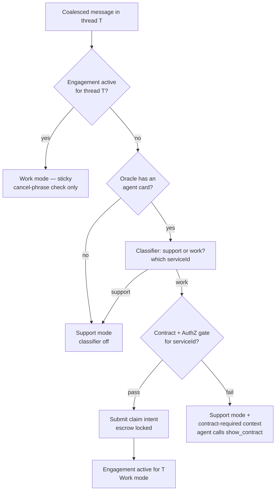
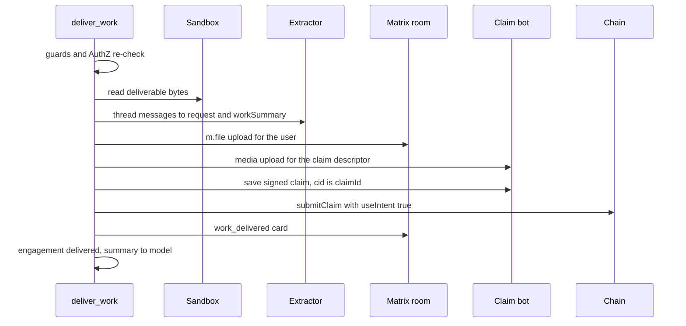

# Matrix Agent Commerce — Spec

**Status:** Draft v2 (decisions folded in) · **Date:** 2026-07-22
**Builds on:** `specs/matrix-primary-chat.md` (the Matrix-primary ingress + event protocol) and `/Users/yousef/eval-engine/docs/agent-contracts-spec.md` (the agent-work claim lane).
**Repos touched:** `ixo-oracles-boilerplate` (oracle-runtime), `impacts-x-web` (portal), `eval-engine` (**two changes, owner-committed:** intent support in the agent-work lane + an oracle-facing contract lookup).

---

## 1. What this is

Two features that close one product loop — an oracle that a user can **discover, contract, and pay over Matrix chat**:

- **Part A — Dual-role routing.** Every oracle plays two roles in its Matrix DM room: a free **support** persona (answers "what can you do?", "how much?", "what's the status?") and the **work** persona (the actual contracted service, e.g. a tax-report oracle). A small, cheap classifier routes each incoming message; once a work engagement starts in a thread, routing is sticky for that thread until the work is delivered. Work only starts if the user has contracted the agent; otherwise the oracle posts an interactive **contract card** into the room instead.
- **Part B — Contracting + work claims.** Interactive Matrix component events (`list_services`, `show_contract`) drive service discovery and contracting from inside the chat, reusing the portal's existing agent-contract flow. A new **`deliver_work`** tool hands the finished work to the user in the room _and_ submits the eval-engine work claim (§C.1 body) that gets the oracle paid — escrow-backed by an intent submitted at work start.



### Non-goals (v1)

- No Matrix-side rubric review/dispute UX (that's the engine's portal surface, and its Matrix bot spec is ON HOLD).
- Slack stays out of scope (same limitation as matrix-primary-chat).
- HTTP chat is untouched. Everything here is Matrix-ingress behavior.

---

## 2. Building blocks (what already exists)

| Block                                         | Where                                                                                                                                                                                                                                                          | State                                                                                               |
| --------------------------------------------- | -------------------------------------------------------------------------------------------------------------------------------------------------------------------------------------------------------------------------------------------------------------- | --------------------------------------------------------------------------------------------------- |
| Matrix ingress (`flush()` → `deliverHandler`) | `packages/oracle-runtime/src/modules/messages/matrix-listener-bridge.ts:314`                                                                                                                                                                                   | Live. No pre-graph gates on Matrix; the classifier hooks here.                                      |
| Attachment pipeline                           | Bridge coalesces `m.file/m.image/m.video/m.audio` into `attachments[]`; `messages.service.ts:350` routes each by model capability — native base64 multimodal blocks vs helper-model extraction (`modules/messages/attachments/`)                               | Live on the Matrix lane already. Needs prompt awareness + one gap (see 3.6).                        |
| Custom timeline events                        | `packages/matrix/src/matrix-manager.ts:481` `sendMatrixEvent(roomId, type, content)`                                                                                                                                                                           | Live. `ctx.matrix.postToRoom` hardcodes `m.room.message` — needs a small extension.                 |
| `ixo.oracle.component` event                  | `specs/matrix-primary-chat.md` F7                                                                                                                                                                                                                              | **Specced, unimplemented.** This feature ships its first producers + the portal renderer.           |
| Cheap models                                  | `llm-provider.ts` roles: `routing` (gpt-oss-20b), `guard` (llama-3.1-8b), `custom_low` (gpt-oss-120b); `ctx.llm.get(role, {model})`                                                                                                                            | Live.                                                                                               |
| Claim + intent submission                     | `claimsClient.sendClaimIntent` / `saveSignedClaimToMatrix` / `submitClaim({useIntent})` (`@ixo/oracles-chain-client`), signing mnemonic cached at boot via `UcanService.getSigningMnemonic()`; credits' `claim-processing.service.ts` is the working reference | Live (usage-billing lane already uses intents).                                                     |
| Claim-bot media upload                        | `createUcanTokenProvider` + `MATRIX_BOT_RESOURCES.claimBot` + `getDefaultClaimBotUrl()` → `POST /media/upload` (see `eval-engine/scripts/submit-test-claim.ts`)                                                                                                | Live.                                                                                               |
| AuthZ primitives                              | `packages/oracles-chain-client/src/client/authz/authz.ts` (`Authz.granteeGrants`); portal's `isOracleSA` (`helpers/signX.ts:571`) shows the exact check                                                                                                        | Live in chain client; **no runtime helper yet**.                                                    |
| Abort plumbing                                | `RuntimeContext.abortSignal` exists; Matrix turns run through `BatchInvoker`                                                                                                                                                                                   | Signal plumbed for HTTP; Matrix turns need a per-turn `AbortController` (see 3.5).                  |
| Agent card                                    | `#acard` LinkedResource on the oracle entity; portal `fetchAgentCard` (`lib/evalEngine/agentContracts.ts:73`); engine resolves the same way (schema-validate, no hash check, 300 s cache)                                                                      | Live. Runtime needs its own resolver.                                                               |
| Contract flow (portal)                        | `OracleAuthZPriceModal` agent lane → `AgentContractFlow` 3 steps → `contractOracle({useAuthz:true})` grant → `registerAgentContract` POST to engine                                                                                                            | Live on `/connect` + `/workspace`. Not mounted on the Matrix chat surface; no service preselection. |
| Portal Matrix timeline renderer               | `matrix/components/RoomTimeline.tsx:1189` `typeToRenderer` map via `useMatrixEventRenderer`; E2EE-decrypt precedent in `ClientNonUIFeatures.tsx:314` (`ixo.oracle.delegation_required` listener)                                                               | Live. New event types fall through to a hidden "unknown event" line today.                          |
| Room state                                    | `MatrixStateManager` under `ixo.room.state` + stateKey (delegation store pattern, `modules/ucan/delegation-store.ts`)                                                                                                                                          | Live.                                                                                               |

**Dependency on matrix-primary-chat:** **F11** (event-id dedup, per-session queue, typing keepalive, replay age-guard) is the prerequisite — routing, engagements, and the abort lane all assume a turn can't be double-delivered. **F4 (room-default sessions) is explicitly NOT applied to commerce oracles**: this spec leans the other way — thread-per-request is the model (3.3), and the prompt + portal nudge users into threads. Today's always-threaded reply behavior is exactly what we build on.

---

## 3. Part A — Dual-role routing

### 3.1 The two roles

One agent, one checkpointer thread per session, two **modes**. We do not build two separate agents — that would split memory and double infra. The mode changes three things per turn:

|                        | Support mode (default)                                                                            | Work mode (active engagement in this thread)                                                     |
| ---------------------- | ------------------------------------------------------------------------------------------------- | ------------------------------------------------------------------------------------------------ |
| Prompt overlay         | "You are the front desk: explain services, prices, status. Never perform the contracted service." | "You are performing service `<serviceId>` under an active contract. Finish with `deliver_work`." |
| Commerce tools exposed | `list_services`, `show_contract`, `get_contract_status`                                           | `deliver_work` (+ the fork's work tools)                                                         |
| Contract gate          | n/a                                                                                               | Live contract + AuthZ (3.4); intent already escrowed at engagement start (5.1)                   |

Both overlays also carry: **attachment awareness** ("you can see images and files the user shares in this room — they arrive with the message; reference them directly") and the **threads nudge** ("each piece of work lives in its own thread; ask the user to continue this work inside this thread and to start new requests as new messages").

Fork work-tools gating (open decision O3, plain version): a fork's own tools (e.g. `generate_tax_report`) can optionally be marked `billing: 'contracted'` so the runtime hides them from the model until an engagement is active — a hard code gate instead of trusting the prompt overlay alone. v1 ships the flag + filter; forks opt in per tool.

### 3.2 The router

**Where:** `MessageRouterService`, called from the bridge's `flush()` immediately before `deliverHandler` (`matrix-listener-bridge.ts:314`) — the same seam matrix-primary F16 earmarked for the subscription gate. Matrix-only; HTTP turns never route.

**Decision procedure per flushed turn (session = the message's thread):**



- **Classifier:** one structured-output call on `getProviderChatModel('routing')` (OpenRouter `openai/gpt-oss-20b`; override via `ORACLE_PAYMENTS_ROUTER_MODEL`). Input: the coalesced message, the last ~6 messages of the same thread, and the card's service list (`id`, `name`, `description`, `tags`, `examples`). Output: `{ intent: 'support' | 'work', serviceId?: string, confidence: number }`. Below `0.6` confidence → support (fail-open to the free persona, never accidentally into billable work). Embeddings were considered and rejected: per-oracle service sets are tiny and dynamic, so few-shot LLM classification is simpler, needs no index maintenance, and the routing model is already the cheapest tier.
- **Sticky per thread — no transport-level cancel detection (decided):** while thread T's engagement is `active`, the classifier is skipped entirely and EVERY message in T goes to the work agent. Regex/keyword cancel scanning was considered and REJECTED: false positives are catastrophic here (a double-text aborts the in-flight run, then "now edit the report" must simply continue the work, and "cancel the meeting row in the sheet" is an instruction, not a cancellation). Cancellation is an AGENT decision: the work overlay instructs the model — when the user wants to abandon the work, call `cancel_work` (3.2.1). The router never cancels.
- **Latency:** the routing call adds ~300–800 ms before the graph; the status card (3.5) is what makes this and the rest of the turn feel alive.
- **How the mode reaches the agent:** the router result is passed through `deliverHandler` → `sendMessage` metadata → `RuntimeContext` as `ctx.commerce = { mode, engagement? }` (new field, populated by the request preparer from the router's per-turn output — _not_ by a graph middleware; binding rule: middlewares must not mutate state). The prompt composer reads it for the overlay; the plugin's `getRequestTools` reads it to expose the right tool set.

#### 3.2.1 `cancel_work` (work mode only)

The one sanctioned way an engagement ends early. Exposed only while the thread's engagement is `active`; args `{ reason?: string }`.

**Cancelling submits a release claim (decided).** The claims module has no cancel-intent message, so the only way to hand an escrowed reservation back is to claim against it — honestly. `cancel_work` files a claim that reports the work was not completed. Two chain facts make this the right mechanism rather than a workaround:

1. **`MsgSubmitClaim` marks the intent `FULFILLED` and removes it from the store** (`x/claims/keeper/msg_server.go:261-263`). `GetActiveIntent` then finds nothing, so a new intent can be minted **immediately** — the user is unblocked at submit time, not at evaluation time.
2. **The engine's baseline gate B1 requires `deliverables` to be answered and to resolve to real bytes.** A claim with no `deliverables` is a deterministic `onFail: reject`, and rejection reverts the escrow to the user (~1 min, engine cron). `resultStatus: 'unable'` with no deliverable is exactly what happened.

Pipeline (`WorkClaimService.release`, the same signing/submission plumbing as `deliver_work`, 5.2):

1. **Guards.** No active engagement for this thread → `{ cancelled: false }`, nothing else happens. A claim already on-chain for this engagement (`claim.txHash` present) → the reservation is already settled: close the engagement and return, never submit twice. No `intent` on the engagement → nothing was reserved: close it and say so. `intent.expiresAt` already past → the reservation lapsed on its own and the chain no longer holds it: close the engagement without a claim, because claiming against a dead intent would only be rejected and would leave the job blocking a user nothing is blocking.
2. **Stamp the cancellation, keep the engagement `active`.** `cancelledAt` (+ `cancelReason`) is written before anything can fail, and the status does NOT move yet — the reservation is still held until the release claim lands, so the job must keep blocking new work (3.3).
3. **Claim body** — the platform work-claim form, written deterministically from the engagement and the `reason` arg. The trusted extractor (5.3) is **not** called: there is no delivered work to summarize and a model call could only invent one.
   ```jsonc
   {
     "service": "<engagement.serviceId>",
     "request": "<engagement service + start time + \"cancelled before any work was delivered\">",
     "workSummary": "<no work completed, when it was cancelled, the user's reason>",
     "resultStatus": "unable",
     // no "deliverables" key at all — the unanswered question is what makes B1 reject
     "proofs": "Cancelled by the user. Reason given: <reason>",
   } // omitted when no reason
   ```
4. **Sign + submit.** `saveSignedClaimToMatrix` → `cid` persisted on the engagement **before** the chain call (same idempotency discipline as delivery: a repeat call resumes at submit and never signs twice), then `submitClaim` with `useIntent: true` and the same `priceToCoin` amount the intent reserved, so it settles against this engagement's reservation.
5. **Close out.** Engagement → `closed` (best-effort, after the tx). The thread routes as support from the next message.
6. **Return** `{ cancelled: true, serviceId, serviceName, claimId, txHash, note }`. The note tells the model the truth: the reservation is released, the reserved amount comes back once the claim is evaluated, and the user can start a new paid job **right now**. The old "funds stay locked until `<expiry>`; you cannot start another job until then" wording is gone — it is false on this path.

**Quota cost.** A release claim consumes one `agentQuota` slot: the authorization decrements quota on submit regardless of the claim's later outcome (`x/claims/types/authz.go:123-124`). Accepted: when quota reaches 0 the existing gate returns `quota_exhausted` and the user re-contracts. Cancelling is not free, and the model should not encourage it casually.

**Failure path.** Chain failure is unlikely but never silent. Both chain writes run under a bounded exponential backoff (the plugin's `retry` helper — 3 attempts, 500 ms doubling). If the release ultimately fails (signing throws, submit throws, or the tx returns a non-zero code), the tool raises a clear error and the engagement stays `active` **with `cancelledAt` set** — it still blocks new work, because the reservation genuinely is still held, and a later `cancel_work` completes the release from the persisted cid. There is never a state where the gate passes but the chain would reject.

The work overlay carries the instruction: "If the user asks to cancel/abandon this work, call `cancel_work` — never silently stop."

### 3.3 Engagements — thread-keyed, one active at a time

**Decided:** engagements are **keyed by thread, but only one may be active per user at a time.** The thread root event id is simultaneously the `sessionId`, the checkpointer `thread_id`, and the engagement key. This is why the prompt and the portal both push users into threads: thread = one piece of work = one session = one engagement = (eventually) one claim. What a thread does _not_ buy is concurrency: starting a second paid job while one is still `active` is refused.

**Why one:** the chain enforces it. `x/claims/keeper/msg_server.go`'s `ClaimIntent` handler rejects a `MsgClaimIntent` when the agent already holds an active intent for the collection — one active intent per (agent, collection). Each user has exactly one claim collection for an oracle, and escrow is unconditional (5.1), so a second concurrent engagement could never reserve its payment: its `sendClaimIntent` always fails. The runtime aligns with that instead of discovering it a chain round-trip later.

**Where it is enforced:** `ContractGateService.check` — ahead of the contract lookup and ahead of any chain write. It asks `EngagementService.findActive(roomId, requestingThreadId)` for the room's live engagement in any other thread and, when there is one, returns gate failure `engagement_in_progress` carrying the running job's service and thread. The router surfaces it exactly like any other gate failure (support mode + overlay instruction: name the running job, offer wait-or-`cancel_work`, never `show_contract`, never "try again shortly"). The requesting thread is excluded so the delivery lane's own re-check (`deliver_work` → `check`) does not read as a conflict with itself.

**Cancelled jobs do not block.** A successful `cancel_work` releases the reservation with a claim and leaves the engagement `closed`, so it stops blocking immediately (3.2.1); `delivered` never blocked either. The one cancelled engagement the gate still sees is a **failed release** — `active` with `cancelledAt` set, meaning the reservation really is still held. The gate flags it as `inProgress.releaseFailed` so the overlay says the truthful thing: nobody is working on that job, the earlier cancellation did not complete, and calling `cancel_work` again in that thread is what frees them (not waiting for it to finish, and not `show_contract`).

**Scope of the check:** room-scoped, which is user-scoped by construction — an oracle room's alias is `<userDid>_<oracleEntityDid>` (`MatrixManager.getOracleRoomIdWithHomeServer`), so a room is one user's channel with one oracle, matching the chain's per-(agent, collection) rule.

```jsonc
{
  "status": "active" | "delivered" | "closed",
  "serviceId": "tax-report",
  "serviceName": "Tax report",
  "priceUsd": 20,
  "collectionId": "…",          // from the contract record (3.4)
  "adminAddress": "ixo1…",
  "startedAt": "2026-07-22T…",
  "intent": { "txHash": "…", "submittedAt": "…" },          // set at engagement start (5.1)
  "claim": { "cid": "…", "txHash": "…", "submittedAt": "…" } // set by deliver_work
}
```

**Store:** Matrix room state — `ixo.room.state`, stateKey **`work_engagement.<threadRootEventId>`** (one state event per engagement, so threads never race a shared map), via `MatrixStateManager.setState`. Durable across restarts, portal-readable ("Working…" chip per thread), zero new infra. A per-process in-memory cache in front avoids a state read per message; invalidated on write.

**Finding the live one:** a second state event, **`work_engagement.active`**, indexes the thread that holds the room's active engagement — written before the engagement at start, cleared when it leaves `active`. `listStateEvents` is not the enumeration seam: it paginates the entire room timeline and returns decoded payloads _without their state keys_, so it can neither be cheap nor say which thread an engagement belongs to. `findActive` therefore answers from the in-process cache when the room's live job has already been seen, and otherwise from one cached read of the index. A pointer left behind by a crashed write resolves to a non-active engagement and reads as "none", so the index self-heals; it is an optimisation over the chain's own refusal, never the authority.

### 3.4 The contract gate — engine lookup + chain AuthZ

Two sources, two jobs. The engine (being modified anyway) gains a small **oracle-facing contract lookup**; the chain stays the **enforcement** truth:

1. **One engine endpoint returns everything.** `GET /v1/agents/contracts/for-oracle?subscriberDid=<sender DID>` — authenticated with an **oracle-signed UCAN invocation** (audience = engine did:web, resource `ixo:eval-engine`; the engine verifies the invoker is the oracle entity's authorized account, the same verification lane as `POST /v1/dev/link` §G.3). Returns the contract row **plus the live AuthZ snapshot** (the engine queries the public chain itself and caches): `{ collectionId, adminAddress, serviceIds, rubricId, cardProof, status, authz: { granted, agentQuotaRemaining, maxAmount: { amount, denom }, intentDurationNs } }`, or 404. One call tells the oracle all it needs; cached per sender ~5 min. The chain grant alone can't map a Matrix sender to a collection or reveal contracted serviceIds — and now the oracle doesn't need its own chain query for the gate either.
2. **No separate chain read (decided).** The engine's `authz` snapshot is the only pre-flight check. A runtime-side chain query was built and REMOVED as dead code: it cannot substitute for the engine (the chain knows nothing about `collectionId` or `serviceIds`, so it cannot map a Matrix sender to a contract), and a pre-intent re-verify is redundant because `sendClaimIntent` / `submitClaim` are themselves atomic chain checks — a revoked grant or spent quota fails the tx, which the tool surfaces. Submission-time truth is the chain; discovery-time truth is the engine.
3. **Service check.** The classified `serviceId` must be in the contracted `serviceIds` (the engine's gate B6 will reject the claim otherwise; fail early in chat instead).

Gate results cached ~60 s per (room, sender). Gate failure never errors the turn — the turn proceeds in support mode with injected context: _"The user asked for `<service>` but holds no usable contract (reason: `<not_contracted | quota_exhausted | max_amount_too_low | service_not_contracted>`). Explain, then call `show_contract` for `<serviceId>`."_

Two failure reasons are **not** contracting problems and get their own instruction, without a contract card: `engagement_in_progress` (the user already has a job running — wait or `cancel_work` from that thread, or, when `inProgress.releaseFailed` says an earlier cancellation never reached the chain, retry `cancel_work` there; 3.3) and `intent_failed` (the contract is fine, the on-chain reservation failed).

**Push freshness:** the portal still posts `ixo.oracle.contracted` into the room right after registration (4.4) — but it is now just a **cache-buster**: on receipt the oracle re-queries the engine endpoint, so "contract in the modal → immediately say 'go'" works without waiting out a cache TTL. No chain-verify-the-hint dance is needed anymore; the engine lookup is the authority.

### 3.5 Liveness: the status card + double-texting abort

**The status card.** Routing + real work means long turns; a typing indicator alone reads as "frozen". Per turn the runtime posts one `ixo.oracle.component` with `component: "work_status"`, anchored to the message it answers:

```jsonc
"component": "work_status",
"props": {
  "forEventId": "<the user's message event id>",   // the anchor — one live card per user message
  "phase": "routing" | "working" | "delivering" | "done" | "superseded",
  "label": "Reading your receipts…",                // short human words; tool-derived or model-generated
  "updatedAt": "…"
}
```

- The **first** status event for a `forEventId` is the anchor; every subsequent update carries `"m.relates_to": { "rel_type": "m.replace", "event_id": "<anchor event id>" }` with the full new content — standard Matrix edit semantics, so well-behaved clients collapse to the latest. The portal additionally dedupes by `props.forEventId` (render only the newest) as a belt-and-braces rule, and hides the card when `phase: "done"` arrives with the reply.
- **Producers:** the router posts `routing` immediately on flush; the tool-wrapping layer posts `working` with a label on each tool start (same interceptor seam matrix-primary F6 will use for `ixo.oracle.tool` — build them as one wrapper, two emissions); `deliver_work` posts `delivering`; the bridge posts `done` right before the final reply. Labels are short and human — tool-name-derived by default, optionally model-flavored.
- Typing indicator stays on as the native fallback for Element.

**Double-texting = abort + restart.** If the user sends a new message into a thread whose turn is still in flight, the in-flight turn is killed and a fresh one starts with the combined context:

- New `InFlightTurnRegistry` in the bridge: a plain in-process `Map<sessionId, { requestId, controller, userText }>` — one entry per in-flight turn, and the `AbortController` is a live object that must stay in process memory anyway. The Matrix sync loop is single-instance per oracle, so no Redis mirror (decided: keep it simple).
- On flush for session S with an in-flight entry: `controller.abort()` → the signal reaches the graph via `BatchInvoker` → `RuntimeContext.abortSignal` (already plumbed; Matrix turns must now construct a per-turn `AbortController` instead of a dummy signal). Wait for the aborted turn to settle (bounded drain), then dispatch the new turn with the **unanswered text prepended** to the new message so nothing the user said is dropped — LangGraph resumes from the last durable checkpoint, and the combined text re-establishes anything the aborted turn hadn't persisted.
- The superseded turn's status card flips to `phase: "superseded"` ("Got your new message — restarting"); the new turn anchors a fresh card on the new event id.
- Aborts never fire mid-`deliver_work` chain submission: the tool wraps steps 5–6 (sign + submit) in an abort-deferred critical section — the abort takes effect after the claim reaches a safe state (idempotency lane in 5.2 covers the rest).

### 3.6 Seeing images and attachments

Mostly already true, now made explicit and owned:

- **Ingress works today:** the bridge coalesces `m.image`/`m.file`/`m.video`/`m.audio` into the turn's `attachments[]`, and `messages.service` routes each attachment by the selected model's capability — images to vision-capable models as native base64 content blocks, documents through the helper-model extraction lane. The Matrix path and HTTP path share this pipeline. **Work item: integration-verify the Matrix lane end-to-end (image in room → model sees it) and keep it covered by a test.**
- **Awareness:** both prompt overlays state the capability (3.1) so the agent references shared files instead of asking the user to describe them.
- **Nothing needs fetching — the runtime already archived it.** Every attachment on either lane is auto-archived into the user's sandbox at `/workspace/output/<sanitized filename>`: the native/vision lane through `FileProcessingService.archiveAttachmentInBackground`, the extraction lane inline (plus an `-analysis.md` companion). Matrix uploads run the same code. So a file shared earlier in the thread is already on disk; re-downloading it from Matrix would be pure duplication.
- **What the archive cannot answer is "which of these files belong to THIS conversation".** It is per-user: one directory accumulating every thread, every past job, and anything other tools wrote there. Listing it would hand the agent an undifferentiated pile. **The thread scoping is the point of the tool.**
- **The tool — `get_thread_attachment`** (oracle-payments plugin, both modes, no arguments): lists the media events of the **current thread only** (`listThreadAttachments` → `filterThreadAttachments` over the recent room timeline; an attachment from elsewhere in the room, or at room level, is never surfaced) and maps each to where the runtime archived it. Per file: `fileName`, `mimetype` (inferred from the name — the timeline read carries the msgtype, not `info.mimetype`), `eventId`, `sharedAt`, `sandboxPath`. The agent reads it from that path with the sandbox tools. It downloads nothing and writes nothing.
- **The path comes from the archive's own naming, not a hand-rolled copy.** `sanitizeAttachmentFilename` + `SANDBOX_OUTPUT_PREFIX` were lifted out of `FileProcessingService` into `modules/messages/attachment-archive.ts`, which both the archiver and this tool now import — so the reported path cannot drift from the written one.
- **The listing is honest about being best-effort.** Archival is fire-and-forget, so every non-empty result carries a note saying a listed file may not be present and to ask the user to resend if the path will not read; the tool description says the same. Empty and failure cases are non-throwing and never claim the user sent nothing: no room, an unreadable timeline, and an empty thread each return an empty list plus a note the model can relay.

---

## 4. Part B.1 — Contracting over Matrix

### 4.1 The component event (shared protocol)

This feature ships the first producers of matrix-primary F7's event, with a fixed envelope:

```jsonc
{
  "type": "ixo.oracle.component",
  "content": {
    "component": "list_services" | "show_contract" | "work_status" | "work_delivered" | "payment_update",
    "props": { /* per-component */ },
    "body": "…",                    // plain-text fallback (Element shows this)
    "sessionId": "…", "requestId": "…", "toolCallId": "…",
    "m.relates_to": { "rel_type": "m.thread", "event_id": "<sessionId>" }  // in-thread when the turn is threaded
  }
}
```

Runtime plumbing: extend the `ctx.matrix` adapter with `postEvent(roomId, type, content)` (today `postToRoom` hardcodes `m.room.message`; `MatrixManager.sendMatrixEvent` already does the real work). The commerce tools and the status producer post through it.

### 4.2 The tools (support mode)

**`list_services`** — args `{}`.

1. Read the cached agent card (4.5). No card → tell the model there are no published services.
2. Post `ixo.oracle.component` with:
   ```jsonc
   "component": "list_services",
   "props": {
     "oracleEntityDid": "did:ixo:entity:…",
     "services": [ { "id", "name", "description", "price": { "amount", "currency" }, "deliverables", "tags?", "examples?" } ]
   },
   "body": "Services: Tax report ($20), …"
   ```
3. Return the service list to the model so its accompanying text answer is grounded.

Portal behavior on click: send a **normal `m.room.message`** — `"Tell me more about <service name>"`. The next turn routes to support, the model answers from the card (`description`, `deliverables`, `doneMeans`), and can escalate to `show_contract`.

**`show_contract`** — args `{ serviceId: string }`.

1. Validate `serviceId` against the card; error the tool call with the valid ids otherwise.
2. Post:
   ```jsonc
   "component": "show_contract",
   "props": {
     "oracleEntityDid": "…", "oracleAddress": "ixo1…",
     "service": { "id", "name", "description", "price": { "amount", "currency" }, "deliverables", "doneMeans" },
     "reason": "not_contracted" | "quota_exhausted" | "max_amount_too_low" | "service_not_contracted" | "user_asked"
   },
   "body": "To start this work, contract the agent: Tax report — 20 USDC."
   ```
3. Return `{ posted: true }`; the model wraps up in prose ("I've sent you the contract card — once you approve it I can start").

**`get_contract_status`** — args `{}`. Read-only: engine contract record + live gate result, so support mode can answer "am I contracted? how many runs left?" truthfully. (Quota remaining comes from the same `granteeGrants` decode.)

### 4.3 Portal: rendering + the contract journey

1. **Timeline renderer.** Add `"ixo.oracle.component"` to the `typeToRenderer` map (`RoomTimeline.tsx:1189`) → one `MatrixOracleComponent` dispatcher that switches on `content.component` over a new registry `matrix/components/oracle-components/` (`ListServicesCard`, `ShowContractCard`, `WorkStatusCard`, `WorkDeliveredCard`, `PaymentUpdateCard`). Wrap in `<Event>` following the `IxoCallRecording` precedent; handle the E2EE `Decrypted` re-render the way `OracleDelegationRequiredListener` does; honor `m.replace` for `work_status`. Unknown `component` values render the `body` text — forward-compatible.
2. **`ListServicesCard`** — service rows with name/price/description; click sends the plain `m.room.message` above via the room's composer send path.
3. **`ShowContractCard`** — price + description + `doneMeans` bullets, CTA **"Contract this agent"**. The CTA runs **exactly the `/connect` journey**: it opens the same `OracleAuthZPriceModal` → `AgentContractFlow` (grant → engine registration → eval-grants backfill), with two pieces of new plumbing (both confirmed missing):
   - A config-payload variant of the modal opener: `setOpenModalType({ type: ESodaActionType.GRANT_ORACLE, oracleDid, serviceIds: [serviceId] })` (mirror the existing `PinModalConfig` pattern in `redux/user/types.ts:128`). The payload's `serviceIds` are threaded into `AgentContractFlow` as the preselection — **Step 1 (choose services) is skipped, or rendered read-only/disabled with the chosen service locked in**, so the user lands directly on review-checks → confirm.
   - **Mount the modal host on the Matrix chat surface** (it currently only mounts on `/connect` and `/workspace`): the Matrix room view gets the same `OracleAuthZPriceModal` + `useManualContractOracle` wiring, gated on the room's resolved oracle DID.
4. **Threads must feel like normal chat.** Since the whole model is thread-per-work-request, the Matrix surface's thread UX is a first-class deliverable, not a nice-to-have: opening a thread, composing inside it, seeing component cards rendered inside the thread panel, and status-card `m.replace` updates inside threads must all work like the main timeline. Verify and fix as part of this feature; add a UI affordance nudging "new request → new message, follow-ups → in-thread" to match the prompt-side nudge.
5. **Completion signal back to the oracle** — see 4.4.
6. Optional polish: "Contracted ✓" chip from the engine record; "Working…" chip per thread from `work_engagement.*` state keys.

### 4.4 How the oracle learns "you're contracted"

The engine's new lookup endpoint (3.4) is the authority; discovery is lazy (first work-classified message from a sender → query by sender DID). Matrix adds the instant push:

- **`ixo.oracle.contracted`** timeline event, posted by the portal after `registerAgentContract` succeeds — from **both** entry points (the `ShowContractCard` journey _and_ the `/connect` page lane), carrying `{ collectionId, oracleEntityDid, serviceIds, rubricId, cardProof }`.
- Oracle-side listener (oracle-payments Nest module): on this event from the room's user, invalidate the contract cache and re-query the engine. The event itself is never trusted as a contract record.

### 4.5 Agent card resolution (runtime) + manifest self-description

Two sources, layered:

1. **Local file (new): `AGENT_CARD_PATH`** — optional env pointing at the oracle's own agent-card JSON (the same file published via the CLI `agent-card` command). Read + schema-validated at boot. When present it does two things:
   - **Seeds the card cache** so discovery works with zero Blocksync dependency (dev-friendly: works before the card is anchored on-chain).
   - **Self-describes the plugin manifest**: the `oracle-payments` manifest (`summary`, `whenToUse`, `examples`) is derived from the card's name, description, and services — so the model knows its own services, prices, and `doneMeans` without a tool call, and both the router and the prompt overlays draw from the same source. Better first-turn answers, better routing.
   - Load-order note for the implementer: plugin manifests are validated **before** the composed env schema runs, so the path is read from raw `process.env.AGENT_CARD_PATH` at manifest resolution — verify the exact seam in the loader and keep the read lazy + cached.
2. **On-chain (`#acard`)** — `AgentCardService` still resolves the anchored card (Blocksync entity query → LinkedResource `type === 'agentCard' && id.endsWith('#acard')` → fetch `serviceEndpoint` → validate → cache TTL 300 s, matching the engine's own resolver). This remains the **contracting truth** — it is what the engine resolves and what `cardProof` versions.

**Manifest mechanics (decided — local file only, no dynamic refresh):** the manifest registry snapshots a merged COPY of `plugin.manifest` at boot (`manifest-registry.ts:42`, registered at `create-oracle-app.ts:306`), so async (on-chain) card data can never reach the manifest — and a `ManifestRegistry.refresh()` lane was considered and REJECTED (perf/simplicity). The one lane that works: `AGENT_CARD_PATH` is read **synchronously** at manifest resolution (lazy getter, cached), so the card-derived manifest is in the boot snapshot from the first request. No `AGENT_CARD_PATH` ⇒ the static manifest, unchanged for the process lifetime. An explicitly set but unreadable/invalid path fails boot loudly — a misconfigured card is a config error, not a silent fallback.

**Precedence + drift guard:** with both present, the on-chain card wins for anything contract-facing once resolved; the local file is the boot seed and the manifest source. If the two disagree (`credentialSubject` deep-inequality), log a loud warning on every TTL refresh — a stale local file means the manifest is describing services users can't actually contract. No card anywhere ⇒ classifier permanently off, oracle behaves exactly as today.

---

## 5. Part B.2 — Work claims

### 5.1 Engagement start: intent = escrow (decided)

**Intents are unconditional.** Every engagement is escrow-backed — there is no flag and no unreserved path. The eval-engine owner is amending the agent-work lane to support `useIntent: true` (superseding the §C.5 "must be false" footgun note and design-decision 4's no-escrow stance); that engine support is a **deployment prerequisite**, not an option the runtime toggles around. When the gate passes and an engagement starts:

1. `claimsClient.sendClaimIntent({ amount: [<service price in collection denom>], userClaimCollection: collectionId })` — `MsgClaimIntent` locks the escrow on-chain at the moment work begins. Record `intent.txHash` in the engagement state **before** proceeding; an intent failure aborts the engagement start (the agent explains and does not work unpaid).
2. Write `work_engagement.<threadRoot>` state (3.3); the turn proceeds in work mode.

Constraints to respect:

- **`intentDurationNs`** on the `SubmitClaimAuthorization` grant bounds the window between intent and claim: the claim must be submitted with `useIntent: true` inside it, and an engagement that is neither delivered nor cancelled has its escrow auto-release at expiry. Expiry is the **passive** cleanup only. There is no cancel-intent message, but there is an active cleanup: submitting any claim against the intent settles it and removes it from the chain's store — that is what `deliver_work` does when the work lands and what `cancel_work`'s release claim does when the user gives up (3.2.1). **The window is a lockout only for a silently abandoned job.** Because the chain allows one active intent per (agent, collection) (3.3), an abandoned reservation blocks the user from starting _any_ new paid job with this oracle until it expires — so the duration must be long enough for realistic work and no longer. A cancelled job does not wait: its release claim frees the user the moment it lands. It is set once, at contracting time, as `SubmitClaimConstraints.IntentDurationNs` on the authz grant the portal mints (consumed at `x/claims/keeper/msg_server.go:1113`); **the runtime cannot set or shorten it**, it only reads the value back from the engine's AuthZ snapshot and stamps the derived deadline on the engagement. The runtime warns when an active engagement approaches expiry.
- **Engine-side change (owner-committed, prerequisite):** the pull/evaluate pipeline must accept intent-backed claims; approval (`MsgEvaluateClaim` status 1) releases the escrow to the oracle, rejection releases it back to the collection — chain mechanics the engine merely triggers. An oracle pointed at an engine that rejects `useIntent: true` agent-work claims will lock escrow it can never settle.
- **No opt-out.** The reservation at start and the `useIntent: true` submit at delivery are two halves of one thing and are meaningless apart — a flag between them could be flipped mid-engagement, stranding an escrow (locked at start, then settled as if unreserved). Deploy against a collection and an engine that support intents, or do not run the work lane.

### 5.2 The `deliver_work` tool (work mode only)

Args — note what the agent is and is not trusted with:

```ts
{
  description: string,                       // 1–2 sentences shown in the room next to the deliverable
  resultStatus: 'completed' | 'partial' | 'unable',   // recorded verbatim in the claim (§B.3)
  deliverable: {
    kind: 'text' | 'file',
    text?: string,                            // kind=text: full deliverable content (markdown)
    sandboxPath?: string,                     // kind=file: absolute path, /workspace/data/output/…
    fileName?: string,                        // kind=file default: basename(sandboxPath)
    mediaType?: string                        // kind=file default: sniffed from extension
  },
  proofs?: string                             // free-text evidence: links, tx hashes, log excerpts
}
```

The claim's `request` and `workSummary` are **never** taken from these args — the agent grading its own homework is the exact trust gap the engine's evaluator exists to close (§C.1 trust caveat). See 5.3.

Pipeline:



1. **Guards.** No active engagement for this thread → tool error ("no work in progress — never call this outside a contracted engagement"). Re-run the AuthZ gate (quota may have drained since start) and check the intent window hasn't expired. Engagement already carries `claim.cid` → idempotent short-circuit (see failure handling). Steps 5–6 run in the abort-deferred critical section (3.5).
2. **Materialize the file.** The engine's gate B1 **rejects any claim whose `deliverables` don't resolve to real bytes** — so a text deliverable is materialized, not pasted: `kind:'text'` → bytes of `text` as `<slug>.md`, `text/markdown`. `kind:'file'` → read from the sandbox via the existing bridge (`getSandboxTools(ctx, …).run` with base64 for binary — the `sandbox_to_vfs` pattern in `plugins/vfs/vfs-sandbox-tools.ts:442`); path must be under `/workspace/data/`. Enforce a size ceiling (`ORACLE_PAYMENTS_MAX_DELIVERABLE_MB`, default 25).
3. **Extract `request` + `workSummary`** (5.3).
4. **Two uploads.**
   a. **User's copy:** native Matrix `m.file` (mxc upload) into the originating thread — the user gets the work in-chat regardless of any claim machinery.
   b. **Claim copy:** claim-bot media lane, exactly as `submit-test-claim.ts` does — UCAN from `createUcanTokenProvider({ mnemonic: signingMnemonic, did: ORACLE_DID })` with `MATRIX_BOT_RESOURCES.claimBot`, `POST {claimBotUrl}/media/upload` (form: `collection`, `file`) → `cid` → the `deliverables` file-answer entry:
   ```jsonc
   {
     "name": "tax-report-2025.pdf",
     "type": "application/pdf",
     "content": "{\"id\":\"{id}#<cid>\",\"type\":\"mediaAttachment\",\"proof\":\"<cid>\",\"encrypted\":true,\"mediaType\":\"application/pdf\",\"description\":\"\",\"serviceEndpoint\":\"<claimBot>/media/collections/<collectionId>/<cid>\"}",
   }
   ```
5. **Claim body** — the platform work-claim form, nothing else (§C.1; §C.4 explicitly forbids transcripts/chat pointers):
   ```jsonc
   { "service": "<engagement.serviceId>",        // must be in contracted serviceIds (gate B6)
     "request": "<extracted>",
     "workSummary": "<extracted>",
     "resultStatus": "<arg, verbatim>",
     "deliverables": [ <file entry> ],
     "proofs": "<arg, optional>" }
   ```
6. **Sign + submit.** `claimsClient.saveSignedClaimToMatrix({ claim: { body, amount }, collectionId, decryptedSigningMnemonic: ucanService.getSigningMnemonic(), … })` → returned `cid` **is** the `claimId`. Persist `claim.cid` into the engagement state **before** the chain call. Then `claimsClient.submitClaim({ claimId, collectionId, useIntent: true, amount })` — settling against the escrow locked at 5.1. `amount = [{ denom, amount: String(round(priceUsd * 1e6)) }]` with the network denom (USDC-IBC on mainnet, `uixo` otherwise — the portal's own conversion, and by construction ≤ the grant's `maxAmount`). Force-init the wallet client first (the known `walletClient.address` empty-string bug from `submit-test-claim.ts:86`).
7. **The receipt card.**
   ```jsonc
   "component": "work_delivered",
   "props": {
     "service": { "id", "name", "price": { "amount", "currency" } },   // the cost display
     "description": "<arg>", "resultStatus": "<arg>",
     "deliverable": { "fileName", "mediaType", "matrixEventId": "<the m.file event>" },
     "claimId": "<cid>", "txHash": "<tx>",
     "workSummary": "<extracted>",
     "claimUrl": "<portal>/workspace/claims?claimId=<cid>"             // deep link
   },
   "body": "Delivered: Tax report 2025 (20 USDC) — claim <cid>."
   ```
   The portal's `WorkDeliveredCard` shows the deliverable link, the summary, the price ("This work is billed against your contract — 20 USDC"), and the **deep link to the claim at `workspace/claims`**.
8. **Close out.** Engagement → `delivered` (the thread returns to support). Tool returns `{ claimId, txHash, delivered: true }` so the model's closing message is grounded.

**Failure handling.** Steps 2–4 fail → tool error, engagement stays `active`, the agent may retry. Step 6 fails _after_ step 5 → the engagement holds `claim.cid` with no `txHash`; the next `deliver_work` call skips straight to `submitClaim` with the stored cid (never re-sign, never double-upload). Chain tx code ≠ 0 → surface `rawLog` as the tool error. Everything after a successful step 6 is best-effort: a failed card post never un-submits a claim — log + still return the claimId.

### 5.3 The trusted extractor

Small dedicated model call — `getProviderChatModel('custom_low')` (`openai/gpt-oss-120b`; override `ORACLE_PAYMENTS_EXTRACTOR_MODEL` — a Gemini-Flash-class model is fine) with structured output:

- **Input:** the engagement thread's messages, read through the **messages service / checkpointer** for the session (`sessionId` _is_ the thread-root Matrix event id — no MatrixManager fetch needed; if a Matrix-side read is ever used, pull the thread only, never the room timeline). Truncated to a token budget.
- **Output:** `{ request: string, workSummary: string }` — `request` = what the user actually asked for, in their terms; `workSummary` = what was actually done per the visible tool activity and replies. Prompt pins both to _observed_ content and forbids inventing outcomes.
- **Why:** these two fields steer the engine's request-fit (B4) and honesty (B3) checks. Extracting them from the thread with a model the _work agent doesn't control_ keeps the claim honest even when the agent would flatter itself.

### 5.4 Payment feedback (v1)

The loop closes visibly in-chat. `ClaimStatusWatcher` (oracle-payments Nest module, cron every 2 min) walks the engagements whose claim reached the chain and reads each claim's evaluation off Blocksync (`claimsClient.getClaim` → `ClaimById.evaluationByClaimId.status`). Zero engine API involved — pure chain reads, no UCAN, no wallet.

**Status mapping** — from `EvaluationStatus` in the chain's `ixo/claims/v1beta1` codegen (`@ixo/impactxclient-sdk`), the authority: `0 PENDING`, `1 APPROVED`, `2 REJECTED`, `3 DISPUTED`, `4 INVALIDATED`, `5 FLAGGED`.

| Chain status    | Card `outcome` | Terminal?                                                                                                         |
| --------------- | -------------- | ----------------------------------------------------------------------------------------------------------------- |
| `0 PENDING`     | —              | no card, keep polling                                                                                             |
| `1 APPROVED`    | `approved`     | yes — escrow released to the oracle                                                                               |
| `2 REJECTED`    | `rejected`     | yes — escrow returned                                                                                             |
| `3 DISPUTED`    | `disputed`     | yes                                                                                                               |
| `4 INVALIDATED` | `rejected`     | yes — no payment fires, escrow returned                                                                           |
| `5 FLAGGED`     | `under_review` | **no** — the chain documents it as re-evaluable; card posts once, polling continues until a terminal status lands |

**The card:**

```jsonc
"component": "payment_update",
"props": {
  "claimId": "…",
  "outcome": "approved" | "rejected" | "under_review" | "disputed",
  "lane": "delivery" | "cancellation",
  "service": { "id", "name", "price": { "amount", "currency" } },
  "claimUrl": "<portal>/workspace/claims?claimId=<cid>"   // omitted when PORTAL_URL is unset
},
"body": "Payment settled: Tax report — 20 USDC (claim …)."
```

posted into the engagement's thread, after which the engagement transitions to `closed`.

**The two lanes are worded differently, and that is the point.** Both `deliver_work` and `cancel_work` settle through a claim, so both get evaluated — but a rejected DELIVERY means the work was judged not to meet the contract (the user keeps their money), whereas a rejected CANCELLATION release claim is the expected, normal outcome: it _is_ the refund completing (3.2.1). The engagement carries `cancelledAt` when it was cancelled, and `props.lane` + the `body` are derived from it, so a cancellation never renders as "your work was rejected". Approved-after-cancellation should be impossible; it is handled rather than crashed on.

**Enumeration + idempotency.** A cron has no room to start from, so `EngagementService` keeps a cross-room index of claims awaiting evaluation (`ixo.room.state` / `work_engagement.pending_claims`, written in the oracle's own `MATRIX_ACCOUNT_ROOM_ID`). A thread enters it only once its claim carries a tx hash — a cid persisted before a failed submit is never polled. The outcome already reported is persisted on the engagement (`paymentOutcome: { status, outcome, reportedAt }`), so a restart never re-posts a card and a re-evaluated flagged claim posts exactly one more. Terminal outcome ⇒ transition + drop from the index; a claim left unevaluated for 14 days is dropped too, so the index cannot grow without bound.

**Failure handling.** Nothing throws out of the cron: a chain read is retried in-tick and then left indexed for the next one, a missing claim or a missing engagement drops the stale index entry, and a failed card post is logged. An engagement is never lost to a bad tick.

---

## 6. New protocol surface (extends matrix-primary Part 3)

| Event                                               | Kind     | Producer                         | Purpose                                                                                      |
| --------------------------------------------------- | -------- | -------------------------------- | -------------------------------------------------------------------------------------------- |
| `ixo.oracle.component` · `list_services`            | timeline | oracle (`list_services` tool)    | Service catalog card                                                                         |
| `ixo.oracle.component` · `show_contract`            | timeline | oracle (`show_contract` tool)    | Contract proposal card → opens portal flow (service preselected)                             |
| `ixo.oracle.component` · `work_status`              | timeline | oracle (router + tool wrapper)   | Live progress card per user message; updated via `m.replace` (3.5)                           |
| `ixo.oracle.component` · `work_delivered`           | timeline | oracle (`deliver_work` tool)     | Delivery receipt: file + summary + cost + claimId + claims deep link                         |
| `ixo.oracle.component` · `payment_update`           | timeline | oracle (`ClaimStatusWatcher`)    | Evaluation/payment outcome per lane + claims deep link (5.4)                                 |
| `ixo.oracle.contracted`                             | timeline | **portal** (both contract lanes) | Cache-buster: contract registered — oracle re-queries the engine (4.4)                       |
| `ixo.room.state` / `work_engagement.<thread>`       | state    | oracle                           | Per-thread engagement: status, serviceId, intent tx, claim cid/tx (3.3)                      |
| `ixo.room.state` / `work_engagement.active`         | state    | oracle                           | `{ threadId }` of the room's one active engagement; empty when idle (3.3)                    |
| `ixo.room.state` / `work_engagement.pending_claims` | state    | oracle                           | Cross-room index of submitted claims awaiting evaluation, in the oracle's account room (5.4) |

Element fallback: component events show `content.body`; state events are invisible. Timeline events post in-thread when the turn is threaded.

---

## 7. Runtime packaging

One new bundled plugin — **`oracle-payments`** (`OraclePaymentsPlugin`) — plus core touches.

**Core (not plugin-ownable):**

- `MessageRouterService` + the `flush()` call site in the bridge, the `InFlightTurnRegistry` + per-turn `AbortController` (3.5), and the `ctx.commerce` field threading (request preparer → `RuntimeContext`). The router consults the plugin's services via the shared-state registry; with the plugin disabled it is inert.
- `ctx.matrix.postEvent(roomId, type, content)` on the ambient adapter.
- The tool-wrapper emission seam shared by `work_status` and matrix-primary F6.
- The `PluginTool.billing?: 'contracted'` flag + filter at the tool-wrapping layer.

**`oracle-payments` plugin (`packages/oracle-runtime/src/plugins/oracle-payments/`):**

- Manifest: `title: 'Oracle Payments'`, `visibility: 'always'` for the support tools; `category: 'ui'`.
- `getRequestTools(ctx)`: support mode → `list_services`, `show_contract`, `get_contract_status`, `get_thread_attachment`; work mode → `deliver_work`, `cancel_work`, `get_thread_attachment`. (Request-time because they need `ctx.session.roomId`, `ctx.user.did`, `ctx.commerce`.)
- Nest module: `AgentCardService` (4.5), `ContractRecordService` with the engine lookup + `ixo.oracle.contracted` cache-bust listener (3.4/4.4), `ContractGateService` (3.4), `EngagementService` (3.3), `WorkIntentService` (5.1 — escrow-first engagement start), `WorkClaimService` (5.1/5.2 — reuses `Claims`/`Payments`/`Client` + `UcanService.getSigningMnemonic()` exactly like the credits cron; **no new signing plumbing**), `ThreadAttachmentService` (3.6 — thread-scoped listing mapped to archive paths, no downloads), `ClaimStatusWatcher` (5.4 — `@Cron('*/2 * * * *')`, Blocksync reads only, no new config var).
- `getSharedState()`: `oraclePayments.engagement(roomId, threadId)`, `oraclePayments.services()` — read accessors for the router and other plugins.
- `autoDetect`: enabled when `ORACLE_ENTITY_DID` is set (always true today); runtime behavior is a no-op until a card resolves. `ORACLE_PAYMENTS_DISABLED=true` opts out.
- Boundaries: no overlap with **credits** (LLM-token metering + subscription 402 + usage-claim cron — a different claim lane); this plugin owns only agent-work claims. **Note: token metering IS the credits plugin — if credits is disabled there is no metering at all**, so commerce oracles should run with credits enabled (support chat is then metered as normal LLM usage; "free" support means "no work claim", not "free LLM").

**Config schema (composed into env):**

| Var                                  | Default                    | Meaning                                                                          |
| ------------------------------------ | -------------------------- | -------------------------------------------------------------------------------- |
| `ORACLE_PAYMENTS_DISABLED`           | `false`                    | Kill switch                                                                      |
| `AGENT_CARD_PATH`                    | unset                      | Path to the local agent-card JSON — cache seed + manifest self-description (4.5) |
| `ORACLE_PAYMENTS_ROUTER_MODEL`       | provider `routing` role    | Classifier override                                                              |
| `ORACLE_PAYMENTS_EXTRACTOR_MODEL`    | provider `custom_low` role | request/workSummary extractor                                                    |
| `ORACLE_PAYMENTS_MAX_DELIVERABLE_MB` | `25`                       | Deliverable size ceiling                                                         |

Everything else (ORACLE_DID, ORACLE_ENTITY_DID, SECP_MNEMONIC, MATRIX_ACCOUNT_ROOM_ID, MATRIX_VALUE_PIN, NETWORK, BLOCKSYNC_GRAPHQL_URL) already exists in the base schema.

---

## 8. Portal work summary (impacts-x-web)

1. `ixo.oracle.component` renderer in `RoomTimeline.tsx` + the five cards (4.3.1, 5.4). E2EE decrypt handling per the existing listener precedent; `m.replace` handling for `work_status`.
2. `GRANT_ORACLE` config-payload variant + `initial.serviceIds` preselection (Step 1 skipped/read-only) + mounting the contract modal host on the Matrix chat surface (4.3.3).
3. Post `ixo.oracle.contracted` after successful `registerAgentContract` — in `AgentContractFlow.handleConfirm`'s success path and `AgentContractPanel.handleReApprove` (4.4).
4. **Thread UX parity** — threads must work like normal chat end-to-end (open, compose, cards, status updates inside the thread panel) + the "new request → new message" nudge (4.3.4).
5. `workspace/claims` deep-link target accepts `?claimId=` focus.
6. Optional polish: "Contracted ✓" / per-thread "Working…" chips.

---

## 9. Eval-engine work summary (owner-committed)

1. **Intent support in the agent-work lane** — accept `useIntent: true` submissions end-to-end (supersedes §C.5's `useIntent: false` note and design-decision 4's no-escrow stance for this lane); verify approval releases escrow to the oracle and rejection returns it, on devnet.
2. **Oracle-facing contract lookup** — `GET /v1/agents/contracts/for-oracle?subscriberDid=…`, oracle-signed UCAN (the `/v1/dev/link` §G.3 verification lane), returning the contract row **plus the AuthZ snapshot** (engine queries the public chain and caches): `{ collectionId, adminAddress, serviceIds, rubricId, cardProof, status, authz: { granted, agentQuotaRemaining, maxAmount, intentDurationNs } }` for (invoking oracle, subscriber). Read-only, cacheable.
3. Contracting flow sets `intentDurationNs` on the grant to a work-friendly window (suggest 7 days).

---

## 10. Trust model

| Surface                       | Trust               | Enforcement                                                                                                                                                                                |
| ----------------------------- | ------------------- | ------------------------------------------------------------------------------------------------------------------------------------------------------------------------------------------ |
| Classifier output             | Advisory            | Wrong "work" routing still hits the contract gate + intent; wrong "support" routing costs one clarifying turn. Low confidence → support.                                                   |
| Engine contract record        | Trusted (authed)    | Oracle-signed UCAN lookup; keyed by (oracle, subscriber DID) server-side — a sender can only ever resolve their own contract.                                                              |
| `ixo.oracle.contracted` event | **Untrusted**       | Pure cache-buster from the room's user; never persisted as a record.                                                                                                                       |
| Agent's `deliver_work` args   | Partially trusted   | `request`/`workSummary` never taken from the agent (extractor, 5.3); `resultStatus` recorded verbatim by engine mandate — dishonesty is the evaluator's job (B3).                          |
| Room state                    | Oracle-written only | The oracle admin writes `work_engagement.*`; user-written state is never read as authority.                                                                                                |
| Claim spend                   | Chain-capped        | `SubmitClaimAuthorization` quota + per-claim `maxAmount` + intent escrow are enforced by the chain regardless of any oracle bug.                                                           |
| Delegation                    | Unchanged           | Matrix-primary F15: downstream UCAN plugins (sandbox, memory…) still need the stored delegation; the contract card journey should nudge the Matrix-authorize step the flow already offers. |

---

## 11. Build order

Prereq: matrix-primary **F11** (dedup + per-session queue + typing keepalive). The eval-engine track (§9) runs in parallel and gates only step 6 (intents) and the engine-lookup half of step 2.

1. **Runtime protocol floor** — `ctx.matrix.postEvent`, `ixo.oracle.component` envelope helper, per-turn `AbortController` on Matrix turns. Unlocks portal work in parallel.
2. **oracle-payments: read side** — `AgentCardService`, `ContractRecordService` (engine lookup; §9.2), `list_services` / `show_contract` / `get_contract_status`, prompt overlays (incl. attachments awareness + threads nudge). _Demoable: discovery + contracting loop end-to-end, no routing yet._
3. **Portal** — renderer + cards; `GRANT_ORACLE` payload + preselection + modal host on Matrix surface; `ixo.oracle.contracted`; thread UX parity pass. (Parallel with 2 after 1.)
4. **Router + liveness** — `MessageRouterService`, thread-scoped engagement state, sticky + cancel, `ctx.commerce` threading, `work_status` producer on the shared tool-wrapper seam, `InFlightTurnRegistry` abort-on-double-text, `billing: 'contracted'` filter, `get_thread_attachment`, Matrix attachment-lane verification test.
5. **`deliver_work`** — `WorkClaimService` (sandbox read → dual upload → extractor → §C.1 body → sign → submit), `work_delivered` card, failure/idempotency lanes, abort-deferred critical section. Submits `useIntent: true` — §9.1 is a hard prerequisite for running this against a live engine.
6. **Intents on** — engagement-start `sendClaimIntent`, `useIntent: true` submit, expiry warnings; devnet end-to-end with the engine: contract via portal → ask for work → intent locks → deliver → engine approves → escrow pays → `payment_update` card.
7. **`ClaimStatusWatcher`** + `payment_update` (5.4).

Docs: public `build-an-oracle/` page for the oracle-payments plugin + env vars; internal `docs/architecture/` page for the router, engagement model, and event protocol.

Testing per house rules: unit-test router/gate/extractor/abort with `fakeModel` + `createTestRuntime`; integration tests boot real services, throw on missing env, and are not auto-run.

---

## 12. Decisions

**Decided:**

- ✅ **Intents unconditional** (was O1). Escrow locks at engagement start and settles on evaluation, always — no flag. A toggle between the two halves is itself the failure mode (escrow locked, claim settled as unreserved). Engine support for `useIntent: true` agent-work claims is a deployment prerequisite, and the engine owner is amending the agent-work lane accordingly.
- ✅ **Engagements are thread-keyed, one active per user at a time** (was O2, revised). Thread = session = engagement = claim, and the prompt + portal still push users into threads — but a room holds at most one `active` engagement, because the chain permits one active claim intent per (agent, collection) and a user has one collection per oracle. A work request while another job is running is refused at the gate with `engagement_in_progress` rather than failing its escrow (3.3). Consequence to design around: a **silently abandoned** reservation locks the user out of new paid work until `intentDurationNs` elapses (5.1) — a cancelled one does not, because `cancel_work` releases it with a claim on the spot (3.2.1).
- ✅ **Contract source = one engine endpoint returning contract + AuthZ snapshot** — the engine reads the public chain itself and caches; the runtime keeps a thin chain check only as backstop (engine down / pre-intent re-verify) (3.4).
- ✅ **Fork work-tool gating ships** (was O3): `PluginTool.billing: 'contracted'` flag + runtime filter; forks opt in per tool.
- ✅ **Payment feedback in v1** (was O4): `ClaimStatusWatcher` → `payment_update` card + `workspace/claims` deep link.
- ✅ **Support chat is metered** (was O5) — by the credits plugin's existing middleware. **Credits off ⇒ no metering exists at all**; documented as a deployment expectation for commerce oracles.

**Still open:** none — all decisions resolved as of Draft v2.
