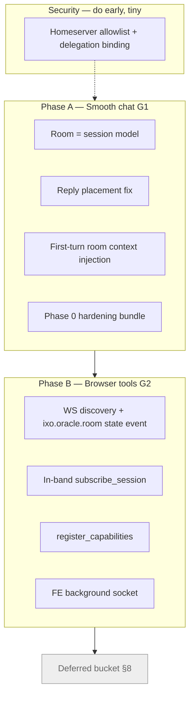
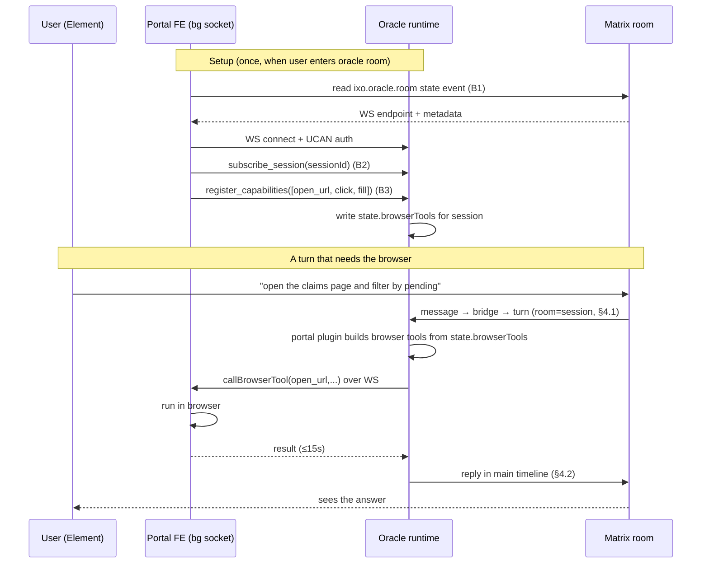

# Matrix Chat Parity — Simplified Build Plan

> Companion to the full spec ([`specs/matrix-chat-parity.md`](matrix-chat-parity.md)).
> The spec is the "why + every option". **This file is the "what we actually build, in order".**
> If the two ever disagree, this plan wins — it's the trimmed, decided version.

---

## 1. What we're building (and what we're not)

We have **two real goals**. Everything in this plan serves one of them.

| #      | Goal                                          | Plain-English test of "done"                                                                                                                                                            |
| ------ | --------------------------------------------- | --------------------------------------------------------------------------------------------------------------------------------------------------------------------------------------- |
| **G1** | **Smooth chat in Matrix**                     | A user DMs the oracle in Element and it feels like the HTTP chat: replies land in the right place, errors are visible, "typing…" never freezes, and the bot remembers the conversation. |
| **G2** | **Browser tools + plugin parity over Matrix** | A Matrix turn can call a _frontend_ browser tool (open URL, click, fill) and any plugin tool, exactly like an HTTP turn — no feature is "HTTP only".                                    |

**What we are explicitly NOT building now** (deferred — see §8):

- The `GraphStreamTranslator` / `MatrixTurnRunner` streaming refactor.
- Live tool-status cards and durable component events in the Matrix timeline.
- Token-by-token streaming into Matrix.
- Subscription / billing metering of Matrix turns.
- Media offload for large tool outputs.

The single most important insight from the review: **neither goal depends on the big streaming refactor.** The spec put that refactor (its Phase 2) in the critical path. We're pulling it out. Browser tools work today under `BatchInvoker` — the round-trip happens _inside tool execution_, so it doesn't care whether the turn streams or not.

---

## 2. The big picture

Phase A and Phase B are independent enough to run in parallel, but A is the smaller lift and unblocks the demo, so **do A first**.

---

## 3. How things work TODAY (so the plan makes sense)

Read this once; every later section refers back to it.

### 3.1 A Matrix turn, start to finish

1. User sends a message in a Matrix room the oracle is in.
2. The **Matrix listener bridge** ([`matrix-listener-bridge.ts`](../packages/oracle-runtime/src/modules/messages/matrix-listener-bridge.ts)) picks up the event and turns it into a runtime turn.
3. It resolves a **session id** (the checkpointer thread key). Today, a _bare_ message (no quote-reply) starts a **brand-new session** — a new "New Conversation Started" anchor event, a new checkpointer thread. Quote-replies reuse the thread they're in.
4. The turn runs through the graph under `BatchInvoker` (non-streaming path for Matrix).
5. The reply is sent back with [`sendMessage`](../packages/matrix/src/utils/create-simple-matrix-client.ts:159). If a `threadId` is passed, it's posted as `rel_type: 'm.thread'` (inside a thread panel). If not, it lands in the **main timeline**.

### 3.2 Browser tools today (HTTP only)

- The **portal plugin** ([`portal.plugin.ts`](../packages/oracle-runtime/src/plugins/portal/portal.plugin.ts)) builds one LangChain tool per browser tool the frontend declared.
- The declarations live in graph state as `state.browserTools` ([`state.ts:77`](../packages/oracle-runtime/src/graph/state.ts:77)) and are carried across requests in a turn ([`main-agent.ts:131`](../packages/oracle-runtime/src/graph/main-agent.ts:131)).
- When the model calls one, `callBrowserTool` does a **WebSocket round-trip to the user's browser** and waits (15s timeout, [`portal.plugin.ts:39`](../packages/oracle-runtime/src/plugins/portal/portal.plugin.ts:39)) for the result.
- This works over HTTP because the browser opened a WS with the `sessionId` at handshake, and the FE injected `state.browserTools` in the HTTP request body.

### 3.3 The WebSocket channel today

- Gateway: [`ws.gateway.ts:50`](../packages/oracle-runtime/src/modules/ws/ws.gateway.ts:50). The browser connects with **exactly one `sessionId`** in the handshake query, plus a UCAN invocation/delegation for auth. No `sessionId` → immediate disconnect.
- One socket = one session. There is no "subscribe to another session later" message. This is the core limitation for Matrix (a Matrix user never did an HTTP handshake for that session).

### 3.4 Room-context tooling that ALREADY EXISTS (reuse, don't rebuild)

- [`MatrixManager.getRecentRoomMessages(roomId, { limit })`](../packages/matrix/src/matrix-manager.ts:691) — fetches the last N room messages, decrypts E2EE, skips internal bookkeeping, returns oldest-first.
- [`ChannelMemoryService.buildSessionContext(roomId)`](../packages/oracle-runtime/src/plugins/matrix-group-chats/channel-memory.service.ts:640) — assembles roster + pinned facts + summaries + last K verbatim messages into a prompt block. **It has no caller.** Someone built the "inject recent room context" feature and never wired it in. We reuse it.
- [`setRoomSessionResolver`](../packages/oracle-runtime/src/modules/messages/matrix-listener-bridge.ts:109) — lets a plugin say "messages in room X map to session Y". The **tasks plugin already uses it** ([`tasks.module.ts:123`](../packages/oracle-runtime/src/plugins/tasks/internal/tasks.module.ts:123)). This is the mechanism for "room = session".

---

## 4. Phase A — Smooth chat (G1)

Four pieces. Each is small. Together they make Matrix chat feel like HTTP chat.

### 4.1 Room = session for DM oracle rooms

**Problem:** today every bare message starts a new session → new checkpointer thread → the bot has amnesia between messages, and the portal's session list fills with junk.

**Fix:** in a 1:1 (DM) oracle room, all bare messages map to **one rolling "room-default" session**.

**How:**

- Generalize the existing `setRoomSessionResolver` pattern (the tasks plugin already proves it works).
- On first bare message in a DM oracle room: create the room-default session **once** via the normal `createSession` path (which posts the anchor event, so the invariant "sessionId is a real Matrix event id" holds for free).
- Every later bare message in that room resolves to the same session id.
- **Explicit threads stay as-is:** if a user quote-replies, that thread is its own session. Correct behavior — don't touch it.

**Why this beats "just inject the last 20 messages":** the checkpointer already stores the full conversation for a thread. If the room maps to one thread, the agent gets full memory for **zero extra tokens** every turn. Injecting 20 messages every turn pays the token cost repeatedly, caps memory at the window, and still spams new sessions. Room=session is strictly better; context injection (§4.3) is the complement for _history the checkpointer doesn't have yet_, not a replacement.

**Prerequisite it creates:** once a whole room shares one thread, two messages arriving close together would run the same thread concurrently. So the **per-session queue (§4.4)** becomes mandatory, not optional.

### 4.2 Reply placement fix

**Problem (spec misses this — it's the #1 "not smooth" bug):** every bot reply is sent threaded to the session id ([`create-simple-matrix-client.ts:180`](../packages/matrix/src/utils/create-simple-matrix-client.ts:180), `rel_type: 'm.thread'`). If a DM room is pinned to one rolling session (§4.1), **every reply lands inside a thread panel** hanging off the "New Conversation Started" anchor. In Element the user's messages sit in the main timeline and the bot's answers hide in a thread the user never opened. That's the opposite of smooth.

**Fix:** decouple **"session id" (checkpointer thread)** from **"where the reply is posted"**.

- For a **room-default session** (§4.1): reply in the **main timeline** — call `sendMessage` **without** `threadId`, or as a plain `m.in_reply_to` reply to the triggering message (not a thread relation).
- For an **explicit user thread**: keep today's behavior (reply threaded into that thread).

**Concretely:** the bridge decides the reply mode based on whether the session is room-default or an explicit thread, and passes `threadId` only in the explicit-thread case. `sendMessage` already does the right thing when `threadId` is omitted — no change needed in the matrix client, only in the caller.

### 4.3 First-turn room context injection

**Problem:** room=session gives memory _going forward_, but on the very first turn of a fresh room-default session the agent knows nothing about pre-existing room history, messages in other threads, or anything said while the oracle was down.

**Fix:** on the **first turn of a session only**, inject a context block built from recent room messages.

- Reuse [`buildSessionContext(roomId)`](../packages/oracle-runtime/src/plugins/matrix-group-chats/channel-memory.service.ts:640) (or, if you want the minimal version, just `getRecentRoomMessages(roomId, { limit: 20 })`).
- Fetch it in the bridge / request-preparer, hand it to the **prompt composer** as a context block, render it in the system prompt.
- **Prompt-side injection ONLY.** Never return it as `messages` from a middleware — that's the checkpointer-thread-breaking pattern we already hit (see memory: `feedback_no_state_mutations_from_middlewares`).
- First turn only — after that the checkpointer carries the conversation, so injecting again would just burn tokens and duplicate.

### 4.4 Phase 0 hardening bundle

Small, independent, all directly "smooth". Do them together.

| Item                   | What it does                                                                                                                     | Note                                              |
| ---------------------- | -------------------------------------------------------------------------------------------------------------------------------- | ------------------------------------------------- |
| **Dedup**              | Ignore duplicate/echoed Matrix events so the bot doesn't answer twice.                                                           | Matrix re-delivers on sync.                       |
| **Per-session queue**  | Serialize turns for the same session so two fast messages don't run the same thread concurrently and corrupt checkpointer state. | **Hard prerequisite** for §4.1.                   |
| **Visible errors**     | On failure, post a real error message in the room instead of silently dying.                                                     | Biggest "feels broken" fix.                       |
| **Typing keepalive**   | Refresh the "typing…" indicator on a timer during long turns so it never freezes/expires mid-thought.                            | Matrix typing notifications expire (~30s).        |
| **Tool/turn timeouts** | Bound how long a turn or tool can hang.                                                                                          | `callBrowserTool` already has 15s — don't re-add. |
| **Age guard**          | Ignore very old events on startup so a restart doesn't replay ancient history.                                                   |                                                   |
| **Matrix init retry**  | Retry Matrix connection on boot instead of giving up.                                                                            |                                                   |

---

## 5. Phase B — Browser tools over Matrix (G2) — the detailed one

This is the part you care about most, so here's the whole thing end to end.

### 5.1 The core problem in one sentence

Browser tools need a **live WebSocket to the user's browser**, but a Matrix user **never did the HTTP handshake** that opens that socket for the session — and even if they opened a socket, the gateway only lets one socket bind **one** `sessionId` chosen at handshake time (§3.3), while Matrix session ids are created server-side per room/thread and the FE doesn't know them in advance.

So we need three things:

1. The FE must be able to **find** the oracle's WS and **which session** a Matrix turn is using.
2. The FE must be able to **subscribe to a session in-band** (after handshake), because it learns the session id late.
3. The turn must know **which browser tools this user's FE can run**, since Matrix messages don't carry `state.browserTools` in a request body.

### 5.2 What already works (don't touch)

- **`callBrowserTool` itself** — the WS round-trip inside tool execution is transport-agnostic. It works identically under `BatchInvoker` (Matrix) and `SseStreamRunner` (HTTP). Already has the 15s timeout.
- **The portal plugin** building tools from `state.browserTools`.
- **`state.browserTools` persistence** across requests in graph state.

**Implication:** the _execution_ half of browser tools is done. We only need to build the _plumbing_ that gets (a) a socket open and subscribed, and (b) the tool descriptors into `state.browserTools` for a Matrix turn.

### 5.3 The four pieces to build

#### B1 — Discovery + `ixo.oracle.room` room-state event

- Write a small **room-state event** (proposed type `ixo.oracle.room`) into each oracle room that publishes the oracle's **WS endpoint** (and any handshake metadata the FE needs).
- The FE reads this state event to learn _where to connect_. This is the "discovery" step from spec §4.6.1.
- Room-state (not a timeline message) so it's a single authoritative record, not spam.

#### B2 — In-band `subscribe_session`

- Add a `subscribe_session` WS message so a socket that's already connected can start listening to a session id it learned **after** handshake.
- Today the gateway binds exactly one `sessionId` at handshake ([`ws.gateway.ts:51`](../packages/oracle-runtime/src/modules/ws/ws.gateway.ts:51)); the FE for a Matrix turn doesn't know the id at connect time.
- Auth: reuse the **same UCAN check** the handshake already does — the invoker DID must be allowed to subscribe to that session's room. No new auth model.

#### B3 — `register_capabilities`

- Add a WS message where the FE **declares which browser tools it can run** for a session (the tool descriptors that HTTP normally puts in `state.browserTools`).
- The runtime writes them into `state.browserTools` for that session so the portal plugin builds the tools on the next turn.
- Because `state.browserTools` persists in graph state, registration just **refreshes** it per session — the model picks the tools up on the following turn automatically.
- This is spec §4.6.4. **Note:** the spec says to add a `callFrontendTool` timeout "if missing" — it already exists (15s). Don't duplicate.

#### B4 — FE background socket

- The frontend opens a **background WebSocket** to the oracle (endpoint from B1's room-state event) whenever the user is in an oracle room, even without an active HTTP chat.
- On connect: authenticate (UCAN), then for each active session `subscribe_session` (B2) + `register_capabilities` (B3).
- This socket is what `callBrowserTool` reaches during a Matrix turn.

### 5.4 Full sequence — a Matrix turn that calls a browser tool

### 5.5 Why WebSocket, not Matrix events, for tool traffic

Decided — the spec already got this right, keeping it here so nobody reopens it:

- The WS channel already exists, is UCAN-authenticated, and is fast.
- Matrix events would add **federation latency**, **E2EE complexity**, and would **write tool arguments into the permanent room record**. No.

### 5.6 What Phase B does NOT need

- **Not** the `GraphStreamTranslator` refactor.
- **Not** durable component events, token streaming, or media offload.
- Just B1–B4 (which is spec tasks 3.1 + 3.2 + the room-state event + an FE hook).

---

## 6. Security — do it early, it's tiny

### 6.1 Homeserver allowlist + delegation binding

- ~20 lines. Closes a real cross-federation spoofing hole (a message from an unexpected homeserver impersonating a user).
- Bind the turn to the validated UCAN delegation, and only accept turns from allowlisted homeservers.
- **Keep the escape hatch:** `MATRIX_ALLOW_UNDELEGATED_TURNS=true` so existing UX doesn't change while we roll out. Flip it off later.

This is spec §4.1. Do it alongside Phase A — it doesn't block anything and it's cheap.

---

## 7. Reuse vs build — the honest inventory

| Capability                                | Status                               | Where                                                                                                            |
| ----------------------------------------- | ------------------------------------ | ---------------------------------------------------------------------------------------------------------------- |
| Fetch last N room messages                | ✅ **exists**                        | [`getRecentRoomMessages`](../packages/matrix/src/matrix-manager.ts:691)                                          |
| Build room-context prompt block           | ✅ **exists, unused**                | [`buildSessionContext`](../packages/oracle-runtime/src/plugins/matrix-group-chats/channel-memory.service.ts:640) |
| Map a room to a fixed session             | ✅ **exists** (tasks plugin uses it) | [`setRoomSessionResolver`](../packages/oracle-runtime/src/modules/messages/matrix-listener-bridge.ts:109)        |
| Browser-tool execution over WS            | ✅ **exists** (transport-agnostic)   | [`callBrowserTool` in portal.plugin](../packages/oracle-runtime/src/plugins/portal/portal.plugin.ts:84)          |
| `state.browserTools` persistence          | ✅ **exists**                        | [`state.ts:77`](../packages/oracle-runtime/src/graph/state.ts:77)                                                |
| 15s frontend-tool timeout                 | ✅ **exists** — do NOT re-add        | [`portal.plugin.ts:39`](../packages/oracle-runtime/src/plugins/portal/portal.plugin.ts:39)                       |
| Room=session for DM rooms                 | 🔨 build (generalize resolver)       | §4.1                                                                                                             |
| Reply-placement decoupling                | 🔨 build (caller only)               | §4.2                                                                                                             |
| First-turn context injection wiring       | 🔨 build (wire the unused builder)   | §4.3                                                                                                             |
| Phase 0 hardening bundle                  | 🔨 build                             | §4.4                                                                                                             |
| `subscribe_session` in-band               | 🔨 build                             | §5.3 B2                                                                                                          |
| `register_capabilities`                   | 🔨 build                             | §5.3 B3                                                                                                          |
| `ixo.oracle.room` state event + discovery | 🔨 build                             | §5.3 B1                                                                                                          |
| FE background socket                      | 🔨 build (frontend)                  | §5.3 B4                                                                                                          |
| Homeserver allowlist                      | 🔨 build (~20 lines)                 | §6                                                                                                               |

**Roughly half the spec is already written code that just needs wiring.**

---

## 8. Deferred bucket (later / optional — not in the critical path)

Everything here is polish or a separate business decision. None of it blocks G1 or G2.

| Deferred item                                          | Spec ref | Why deferred                                                                                               |
| ------------------------------------------------------ | -------- | ---------------------------------------------------------------------------------------------------------- |
| `GraphStreamTranslator` + `MatrixTurnRunner` refactor  | §4.4     | Biggest engineering item; buys only live tool-status/streaming. Not needed for text chat or browser tools. |
| Durable component events + `uiComponent` manifest flag | §4.5     | Timeline component cards — polish.                                                                         |
| Token-by-token streaming into Matrix                   | §4.6.5   | Typing keepalive covers the "it's working" signal.                                                         |
| Subscription / billing metering of Matrix turns        | §4.2     | Business decision, not a smoothness one.                                                                   |
| Media offload for large tool outputs                   | §4.5     | Only matters at scale.                                                                                     |
| Snapshot tests for the translator                      | §4.4     | Follows the deferred refactor.                                                                             |

---

## 9. Build order (checklist)

**Phase A — smooth chat (do first, unblocks the demo):**

- [ ] A4a — Per-session queue (prerequisite for A1)
- [ ] A4b — Dedup + age guard + init retry
- [ ] A4c — Visible errors + typing keepalive + turn/tool timeouts
- [ ] A1 — Room = session for DM oracle rooms (generalize `setRoomSessionResolver`)
- [ ] A2 — Reply placement: main timeline for room-default sessions
- [ ] A3 — First-turn room context injection (wire `buildSessionContext`)
- [ ] S1 — Homeserver allowlist + delegation binding (flag-gated)

**Phase B — browser tools (parallelizable with A):**

- [ ] B1 — `ixo.oracle.room` state event + FE discovery
- [ ] B2 — In-band `subscribe_session` (reuse handshake UCAN check)
- [ ] B3 — `register_capabilities` → `state.browserTools`
- [ ] B4 — FE background socket (connect → subscribe → register)

**Definition of done:**

- **G1:** DM the oracle in Element with three bare messages in a row → coherent, remembered conversation; replies in the main timeline; an induced error shows a real message; typing never freezes.
- **G2:** From a Matrix turn, ask for a frontend action (e.g. "open the claims page") → the browser executes it and the oracle replies with the result, within the 15s budget.

---

## 10. Two corrections to fold back into the full spec

Regardless of which plan we follow, fix these in [`specs/matrix-chat-parity.md`](matrix-chat-parity.md):

1. **§4.6.4** says add a `callFrontendTool` timeout "if missing" — it exists (15s, [`portal.plugin.ts:39`](../packages/oracle-runtime/src/plugins/portal/portal.plugin.ts:39)). Remove the "if missing".
2. The spec **never mentions** [`buildSessionContext`](../packages/oracle-runtime/src/plugins/matrix-group-chats/channel-memory.service.ts:640) / [`getRecentRoomMessages`](../packages/matrix/src/matrix-manager.ts:691) — name them as the reuse targets for room-context injection so nobody rebuilds them.
3. The spec **misses reply placement (§4.2 here)** entirely — add it; it's the biggest single "not smooth" bug.
