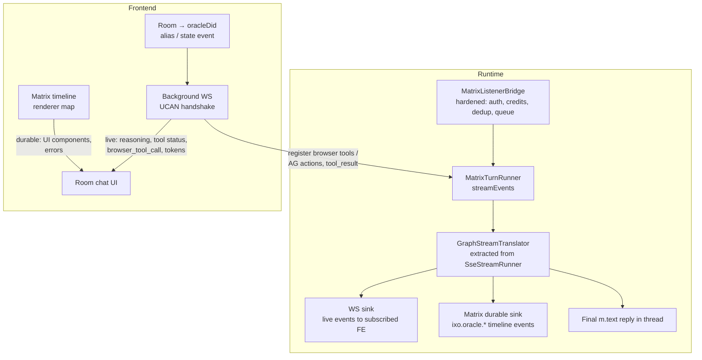

# Matrix Chat Parity — Spec & Plan

**Status:** Draft for review
**Date:** 2026-07-02
**Scope:** `packages/oracle-runtime`, `packages/matrix`, `packages/events`, `packages/oracles-client-sdk`, and the `impacts-x-web` frontend.

---

## 1. Goal

Make oracle chat inside Matrix rooms as capable and as stable as the HTTP + WebSocket path:

- **Rich content parity** — tool-call cards, UI components (charts, tables, task cards), and errors visible in the Matrix room UI, not just a single final text blob.
- **Interactive parity** — frontend tool calls (browser tools, AG-UI actions) work for Matrix-originated turns when the IXO web app is open.
- **Stability parity** — auth, subscription/credit enforcement, rate limiting, dedup, error reporting, and concurrency safety equal to the HTTP path.
- **Graceful degradation** — a plain Matrix client (Element, mobile) still gets a correct, usable text conversation. Rich features light up only in our frontend.

### Non-goals

- Token-level streaming **into the Matrix timeline**. Matrix has no ephemeral message-edit stream suitable for this; the timeline gets the final message. (Live token streaming to _our_ FE is still possible over the WS side-channel — see §4.6.5 — but it is optional, not a parity requirement.)
- Replacing the HTTP path. HTTP/SSE remains the primary transport for the portal chat.
- A server-driven generic component descriptor language. We keep the existing model: the FE registers React components by name; the server sends `{componentName, props}`.

---

## 2. Current state

### 2.1 How Matrix chat works today

The Matrix path is **not a separate agent path**. `MatrixListenerBridge` (`packages/oracle-runtime/src/modules/messages/matrix-listener-bridge.ts`) receives `m.room.message` events from `@ixo/matrix-bot-sdk` (via `MatrixManager.onMessage`), and:

1. Filters: drops own messages, drops `INTERNAL` content, accepts only `m.text` + file msgtypes.
2. Resolves the session: walks the reply chain to the thread-root event id — **`sessionId` = thread-root Matrix event id = LangGraph checkpointer `thread_id`**. A room hosts many sessions. The tasks plugin can pin a whole room to one session via `setRoomSessionResolver`.
3. Debounces 500 ms per thread (coalesces text + file bursts).
4. Calls the shared `MessagesService.sendMessage({ clientType: 'matrix', msgFromMatrixRoom: true, ... })` — same `RequestPreparer → AgentBuilder → createMainAgent` core as HTTP.
5. Because there is no `res`, the turn always goes through **`BatchInvoker`** — no `streamEvents`, so **no tool-call / reasoning events are ever produced** on Matrix turns.
6. Replies with a single markdown→HTML `m.text` in the thread, wrapped in a typing indicator.

Auth: none at ingress — the DID is derived from the Matrix sender's localpart. The UCAN delegation is read from durable room state (`ixo.room.state` via the delegation store); when missing, the runtime emits a throttled `ixo.oracle.delegation_required` timeline event (the FE already listens for this and opens the authorize modal).

### 2.2 Feature comparison

| Concern                       | HTTP + WS                                                                                             | Matrix room                                                         |
| ----------------------------- | ----------------------------------------------------------------------------------------------------- | ------------------------------------------------------------------- |
| Authentication                | UCAN invocation (Bearer) or delegation fallback, validated vs Blocksync (`auth-header.middleware.ts`) | None — trusts Matrix sender id                                      |
| Subscription / credits (402)  | `SubscriptionMiddleware` (Express)                                                                    | Skipped entirely                                                    |
| Rate limiting                 | `ThrottlerGuard` 10 req/60 s                                                                          | 500 ms debounce only                                                |
| DTO validation                | Global `ValidationPipe`                                                                               | n/a (constructed in code)                                           |
| Token streaming               | SSE `message` events                                                                                  | No (final message only)                                             |
| Reasoning / "thinking"        | SSE `reasoning` events                                                                                | No                                                                  |
| Tool-call visibility          | SSE + WS `tool_call` (name, args, status, output)                                                     | No                                                                  |
| UI components                 | Client `uiComponents` map keyed by tool/action name; `render_component` event plumbed (unused)        | No                                                                  |
| Browser tools / AG-UI actions | WS `browser_tool_call` / `action_call` + `tool_result` round-trip                                     | No                                                                  |
| Error surfaced to user        | SSE `error` event                                                                                     | **No — errors are swallowed**, turn dies silently                   |
| Duplicate delivery guard      | n/a (request/response)                                                                                | None — no event-id dedup                                            |
| Concurrency per session       | One in-flight stream per session                                                                      | **None — overlapping turns can write the same checkpointer thread** |
| Missed messages on downtime   | n/a                                                                                                   | Sync-token only; token loss ⇒ silent gap or replay                  |
| Progress UX                   | Streaming                                                                                             | Typing indicator (not refreshed; times out ~30 s)                   |

### 2.3 What already exists that we build on

- **Runtime:** `MatrixManager.sendMatrixEvent(roomId, type, content)` and `sendStateEvent` primitives; the `ixo.oracle.delegation_required` custom-event precedent; `matrix-upload-utils.ts` (media upload/dedup) for large payloads; the WS gateway with UCAN handshake auth and per-`sessionId` socket.io rooms; `callFrontendTool` + WS `tool_result`/`action_call_result` round-trip; `SseStreamRunner`'s LangGraph `streamEvents` → domain-event translation.
- **Events:** full catalog in `@ixo/events` (`tool_call`, `action_call`, `render_component`, `browser_tool_call`, `reasoning`, `message_cache_invalidation`), all stamped with `sessionId` + `requestId`, fanned out to the socket.io room named `sessionId`.
- **FE (impacts-x-web, Cinny fork on matrix-js-sdk 41):**
  - Extensible timeline renderer: `useMatrixEventRenderer` is an `eventType → component` map in `RoomTimeline.tsx`, with a working custom-event precedent (`ixo.room.call.recording`) and a custom-event listener precedent (`ixo.oracle.delegation_required` in `ClientNonUIFeatures.tsx`, E2EE-aware).
  - Oracle-room detection: `useOracleRooms` / `useOracleRoomIdentity` via the canonical alias `#<userDidEnc>_<oracleDidEnc>:<hs>` and oracle bot membership.
  - The full rich-chat component set already exists for HTTP chat (`SidebarAiChatMessages.tsx` `uiComponents` registry, `HomeChatToolProcess.tsx`, AG-UI artifact renderers).
  - Auth wiring exists: `OraclesProvider` in `pages/_layout.tsx` with UCAN delegation/invocation creators and SignX.

---

## 3. Design overview

Three pillars plus one enabling refactor:



- **Pillar A — Stability hardening (§4.1–4.3).** Bring the ingress to production quality: identity binding, subscription/credit and rate-limit enforcement, event dedup, per-session turn serialization, visible errors, typing keepalive, federation timeouts.
- **Pillar B — Durable UI events (§4.4–4.5).** Replace `BatchInvoker` on Matrix turns with a streaming runner that translates graph events. Only two things are ever _persisted_ to the room beyond the final reply: **UI components** (things that must render as an element in chat) and **errors**. Tool activity is deliberately ephemeral — live over WS for our FE, invisible to plain Matrix clients beyond the typing indicator. This is the "UI components in Matrix chat" answer: the component payload lives in the room, E2EE-encrypted, replayable on any device — no live connection needed to see history.
- **Pillar C — Live WS side-channel (§4.6).** The FE detects the oracle in a room, resolves its API URL, and opens a background WS connection (existing gateway, existing UCAN auth). This carries the ephemeral/interactive traffic: reasoning, live tool status, `browser_tool_call` / `action_call` round-trips, and (optionally) token streaming. **Yes — the "detect oracle → connect WS in the background" idea is the right architecture**, with the specifics pinned down in §4.6.

Division of labor between the two channels:

| Content                                                    | Channel                                                      | Why                                                                                           |
| ---------------------------------------------------------- | ------------------------------------------------------------ | --------------------------------------------------------------------------------------------- |
| User message                                               | Matrix (native send)                                         | Works from any client, E2EE, attributed to the user                                           |
| Final AI reply                                             | Matrix `m.text` in thread                                    | Durable, renders everywhere                                                                   |
| UI component                                               | Matrix `m.room.message` + `ixo.oracle.component` content key | Durable; text fallback in Element                                                             |
| Error                                                      | Matrix `m.notice` + `ixo.oracle.error` content key           | User must see failures everywhere                                                             |
| Tool calls (all states, args, output), reasoning, progress | WS only                                                      | Ephemeral; no timeline value, would spam the room. Nothing tool-shaped is persisted to Matrix |
| `browser_tool_call`, `action_call` (full args) + results   | WS only                                                      | Requires a live client by definition                                                          |
| Token stream (optional)                                    | WS only                                                      | Matrix can't do it; FE-only nicety                                                            |

Sends stay **native Matrix** in room chat (the user's own client posts the message). We considered the alternative — FE intercepts sends in oracle rooms and posts via HTTP, with the runtime mirroring to the room — and rejected it: it creates a user-message attribution problem (the bot would post on the user's behalf, or we need echo-suppression markers and dedup races), it forks the FE send path in two, and the native path still has to be hardened anyway for Element/mobile users. One send path, one hardened ingress.

---

## 4. Detailed design

### 4.1 Identity & auth at Matrix ingress

Model (aligned with the invocation-auth decision): for Matrix sends, **authentication is Matrix-native** — the homeserver authenticated the user and (in E2EE rooms) the sender is cryptographically bound. What we must add is a trustworthy **Matrix-sender → DID binding** and the existing **delegation as authorization**.

Rules, applied in `MatrixListenerBridge` before delivery:

1. Derive candidate DID from the sender localpart (existing `normalizeDid`).
2. **Homeserver check**: the sender's server name must be in `MATRIX_TRUSTED_HOMESERVERS` (new env var, comma-separated; defaults to the oracle's own configured homeserver). This closes the cross-federation localpart-spoofing hole (`@did-ixo-<addr>:evil.example` impersonating `@did-ixo-<addr>:matrix.ixo.earth`). A later iteration can replace the static list with a DID-document lookup (verify the sender's homeserver matches the `matrix` service endpoint in the DID doc).
3. **Delegation as the DID binding**: load the stored UCAN delegation from room state for that DID (existing `delegation-store.ts` read-through) and validate it cryptographically (existing validation path). A valid delegation can only have been issued by the holder of the DID's keys, so a validated delegation ⇒ the DID binding is genuine, regardless of homeserver.

   The provisioning loop for this **already exists end-to-end and needs no new work**: the runtime's `POST /delegation` route (`delegation.controller.ts`) stores the user→oracle UCAN into Matrix room state via the delegation store; the FE's `useAuthorizeOracleForMatrix` hook already calls GET/POST/DELETE `/delegation` from the authorize modal, which is opened by the existing `ixo.oracle.delegation_required` timeline event. Matrix auth = "validate what `/delegation` stored"; this spec only adds the enforcement rules around it.

4. **No delegation** ⇒ keep today's behavior (emit `ixo.oracle.delegation_required`, proceed with `raw: ''`) **only if** `MATRIX_ALLOW_UNDELEGATED_TURNS=true` (default `true` during migration, flip to `false` at cutover). When `false`, post a notice in-thread telling the user to authorize the oracle (deep link), and do not invoke the agent.

We do **not** require a per-message UCAN invocation embedded in Matrix events — that would break native clients and defeat the point of Matrix chat.

### 4.2 Subscription, credits, throttling — transport-agnostic

The 402 gate and the throttler are Express-only today, so Matrix turns are free and unmetered. Fix by extraction, not duplication:

- **`SubscriptionGuardService`**: extract the check/charge logic out of `SubscriptionMiddleware` into an injectable service with a single method (`assertCanSpend(userDid, oracleDid) → { ok } | { ok: false, reason, paymentUrl }`). The Express middleware becomes a thin adapter; `MatrixListenerBridge.flush()` calls the same service before invoking the agent (only when the credits plugin is loaded, mirroring the HTTP conditional wiring). On failure: post an `m.notice` in-thread with the payment/subscribe deep link, skip the turn. Charging happens against the **sender's** DID (matters in group rooms).
- **Per-DID rate limit**: sliding-window limiter in the bridge (default matching HTTP: 10 turns/60 s per DID, env-configurable `MATRIX_TURNS_PER_MINUTE`). On limit: react to the message with ⚠️ (cheap, no timeline spam) and drop; post at most one rate-limit notice per window.

### 4.3 Reliability & concurrency

1. **Event dedup.** New `processed_matrix_events` table in the oracle's local SQLite (event_id PK, processed_at). Insert-or-ignore before scheduling; skip if already present. Prune rows older than 30 days. This makes sync-token loss/rewind and bot-sdk redelivery idempotent instead of double-answering.
2. **Per-session turn serialization.** An in-process async queue keyed by `sessionId`: a new flush for a session waits for the in-flight turn to finish. Queue cap 3; overflow drops the oldest queued burst and posts one notice. This fixes overlapping writes to the same checkpointer `thread_id`.
3. **Visible errors.** `flush()` currently logs and dies silently. Change: on agent error or send failure, post in-thread `m.notice` ("Something went wrong — please try again") with content key `ixo.oracle.error: { code, requestId }` so the FE can render a proper error card (same `Error` component the HTTP chat uses). Never leak internal error strings; map to coarse codes.
4. **Typing keepalive.** Refresh `setTyping(roomId, true)` every 20 s while a turn is in flight (Matrix typing expires ~30 s). Always cleared in `finally` (exists).
5. **Federation timeouts.** Wrap `getEventById` thread-root walks in a 5 s timeout with one retry; on failure, treat the message as its own root (degraded: new session) and log loudly. A slow homeserver must not stall the pipeline.
6. **Replay age guard.** Ignore events with `origin_server_ts` older than `MATRIX_MAX_EVENT_AGE_HOURS` (default 24 h). Genuine downtime backfill within the window is answered (dedup prevents double-answering); necro-replies to ancient history after a token reset are not.
7. **Init resilience.** If `matrixManager.init()` fails in `onModuleInit`, retry with backoff instead of logging once and never registering the listener; surface state via the health module.

### 4.4 Turn-runner refactor: `GraphStreamTranslator`

`SseStreamRunner` owns the only LangGraph `streamEvents` → domain-events translation (tool start/end, action status, reasoning deltas, token chunks, orphaned-tool-call flush). Matrix needs the same translation without an HTTP `res`.

- Extract the translation core into **`GraphStreamTranslator`**: consumes the `streamEvents` v2 envelope, calls a sink interface — `onToken`, `onReasoning`, `onToolStart`, `onToolEnd`, `onActionStatus`, `onError`, `onDone`. Pure logic, no transport.
- `SseStreamRunner` becomes translator + SSE sink. Behavior-identical — locked by snapshot tests on the SSE frame sequence before refactoring.
- New **`MatrixTurnRunner`** replaces `BatchInvoker` for `clientType: 'matrix'`: translator + three sinks:
  1. **WS sink** — re-emits the same event classes (`ToolCallEvent`, `ReasoningEvent`, …) via `rootEventEmitter`, so any WS client subscribed to the `sessionId` gets exactly the HTTP-path live events. Zero new event types.
  2. **Matrix durable sink** — posts the durable events per the §3 table (UI components and errors only — never tool calls). Batches nothing; posts as they complete.
  3. **Final-message collector** — accumulates the AI reply and posts the threaded `m.text` (today's egress, unchanged).
- HTTP `stream: false` keeps `BatchInvoker`. HTTP `stream: true` keeps `SseStreamRunner`.

This one refactor is what makes Pillars B and C real: Matrix turns start producing the same event stream HTTP turns do.

### 4.5 Durable Matrix event schema

Principle: **nothing goes to the Matrix timeline unless it renders as a UI element in chat** (plus errors and the final reply). Tool calls — args, status, output — are never persisted; they exist only on the WS live channel. Plain Matrix clients see typing + final answer, full stop.

All chat-scoped events are thread-related to the session root (`m.relates_to: { rel_type: 'm.thread', event_id: <sessionId> }`) and carry `sessionId` + `requestId`. In E2EE rooms they are encrypted like any other event (bot has Rust crypto; FE already handles the encrypted→decrypted case for custom events).

**UI components** — posted as a regular message with an extension content key, so every client shows _something_:

```jsonc
{
  "type": "m.room.message",
  "content": {
    "msgtype": "m.text",
    "body": "📊 Revenue by month — open in IXO Portal to view: <link>",
    "sessionId": "…",
    "requestId": "…",
    "ixo.oracle.component": {
      "componentName": "create_bar_chart", // key into the FE uiComponents map
      "props": {
        /* … */
      },
      "eventId": "…",
    },
    "m.relates_to": { "rel_type": "m.thread", "event_id": "<sessionId>" },
  },
}
```

Our FE checks for the `ixo.oracle.component` key before falling through to the plain-text renderer; Element shows the fallback `body`.

**How the runtime knows something is a UI element** — two producers, both landing in the WS sink (live) and the durable sink (persisted):

1. **Explicit emit**: `ctx.emit.renderComponent({ componentName, args })` — already fully plumbed in the plugin API, event class, and SDK resolver; it just has no producer today. This becomes the primary way a plugin says "render this".
2. **Manifest-flagged tools**: since today's FE renders components keyed by _tool name_ (`uiComponents[toolName]`), a plugin can mark a tool in its manifest (e.g. `uiComponent: true` or `uiComponent: '<componentName>'`). The durable sink auto-converts that tool's **terminal** call into a component event with `props: { args, output, status }` — same shape `resolveUIComponent` feeds the component on the HTTP path. No plugin code changes for existing tools like the task cards or AG-UI charts.

Unflagged tools produce nothing durable — WS-only, by design.

**Errors** — `m.room.message` with `msgtype: m.notice`, `body` = user-safe message, plus `ixo.oracle.error: { code, requestId }`.

**Room identification** — new state event, written by the runtime when it joins a room (and by the tasks/editor plugins when they create rooms):

```jsonc
{
  "type": "ixo.oracle.room",
  "state_key": "<oracleDid>",
  "content": {
    "oracleDid": "…",
    "oracleEntityDid": "…",
    "apiUrl": "https://…",
  },
}
```

Today the FE detects oracle rooms only by alias convention — which fails for runtime-created task/editor rooms that have no oracle alias. The state event makes detection uniform and gives the FE the API URL with zero extra lookups (alias detection stays as fallback for old rooms).

**Size policy.** Matrix caps events at 64 KiB. Truncate `output`/`props` at 32 KiB; larger payloads go through the existing checkpointer media-upload utils (`matrix-upload-utils.ts` — upload, sha256 dedup, `m.ixo.media_upload` pattern) and the event carries a `mediaRef` instead. Reuse those utils; do not roll new upload code.

### 4.6 Live WS side-channel

#### 4.6.1 Discovery (FE)

1. Room → oracle: `ixo.oracle.room` state event (new, primary) or alias convention via existing `useOracleRoomIdentity` (fallback).
2. Oracle → API URL: from the state event's `apiUrl`, else the oracle entity's DID-document service endpoint (same source the portal chat uses via `useOraclesConfig`; the CLI's `update-oracle-api-url` maintains it).

#### 4.6.2 Connection & auth

Existing socket.io gateway, existing handshake: `auth.invocation` (primary) / `auth.ucanDelegation` (fallback), validated server-side; authenticated DID stashed on the socket. The FE already has everything needed to mint these (`OraclesProvider` → `createDelegation` / `createInvocation`). One socket per oracle backend, opened lazily when the user views an oracle room, kept in the background.

#### 4.6.3 Multi-session subscribe

The gateway currently requires exactly one `sessionId` at handshake. A Matrix room hosts many sessions (threads), and a user may look at several oracle rooms. Extend the gateway with in-band subscription messages:

- `subscribe_session { sessionId }` / `unsubscribe_session { sessionId }` — the server validates that the authenticated DID owns the session (session-manager lookup) and joins/leaves the socket.io room. Handshake `sessionId` remains supported (auto-subscribe) for backward compatibility.
- WS events for a session are only delivered to the session owner. Group-room members see the durable timeline events (like they see the text reply) but not the live channel of someone else's session.

#### 4.6.4 Frontend tool calls on Matrix-originated turns

On HTTP, browser tools and AG actions arrive per-request in the `SendMessageDto`. Matrix-originated turns have no request body, so the live client must **register capabilities** on the socket:

- New WS message `register_capabilities { sessionId, browserTools: BrowserToolCallDto[], agActions: AgActionDto[] }` (re-sent on reconnect; replaces previous registration for that socket). `WsService` keeps a per-session registry keyed by socket id, dropped on disconnect.
- `RequestPreparer` on Matrix turns merges the live registry's capabilities into the prepared request — after this point the existing machinery takes over unchanged: `frontend-tool-caller.ts` emits `browser_tool_call` / `action_call` over WS, the FE executes and replies with `tool_result` / `action_call_result`.
- If the client disconnects mid-call, `callFrontendTool` must resolve with a graceful tool-error after a timeout (add one if missing) so the agent can answer "I couldn't reach your browser" instead of hanging.
- In group rooms, tool-call payloads carry the initiator DID; only the initiator's client executes (server already routes per-session, which is per-owner — this is belt-and-braces on the FE).

#### 4.6.5 Optional: live token streaming to the FE

Since `MatrixTurnRunner` streams anyway, forwarding `onToken` chunks to the WS sink as the existing `message` SSE-shaped event is nearly free. The FE room UI can then render the reply streaming live, and reconcile when the final Matrix `m.text` arrives (match on `requestId`, replace the optimistic streamed bubble with the timeline event). Behind a per-subscription flag (`subscribe_session { sessionId, streamTokens: true }`). Ship after the core; it's a nicety, not parity.

### 4.7 Sessions & threading UX in rooms

Today: session = reply-chain thread root. A bare (non-reply) message starts a **new session with no memory** — correct for the portal (which always threads via `createSession`) but hostile in Element, where nobody thread-replies and every message would be a cold start.

Recommended resolution order for the bridge (feature flag `MATRIX_SESSION_MODE=hybrid|thread`, default `hybrid`):

1. Room pinned by a plugin resolver (tasks rooms) → that session. _(exists)_
2. Message is a thread/reply → its root's session. _(exists)_
3. Bare message in a DM oracle room → the room's **default rolling session** (created on first bare message, stored in room account-data/state; the "New Conversation Started" anchor keeps `sessionId` = a real event id, preserving the invariant). A "new conversation" is started by the existing `createSession` flow or an explicit command/button.
4. Bare message in a **group** room → unchanged (mention/reply-gated by the group-chat middleware anyway).

`thread` mode preserves today's exact behavior for anyone depending on it.

FE composer in oracle rooms: send messages as thread replies to the active session root (keeps FE-originated sessions clean and lists them properly in the portal's session list, since sessions are the same objects on both transports).

### 4.8 Frontend plan (impacts-x-web)

1. **Timeline renderers.** In `RenderMessageContent.tsx`, check the `ixo.oracle.component` / `ixo.oracle.error` content keys before the plain-text renderer and dispatch to the component registry. Reuse the existing component set — extract the `uiComponents` registry from `SidebarAiChatMessages.tsx` into a shared module consumed by both the HTTP chat and the Matrix renderers (they must never drift). No custom timeline event types needed for chat content; tool-call cards are live-only (WS), rendered in the tool-process strip, and vanish on reload — by design.
2. **Live channel hook.** `useOracleRoomLiveChannel(roomId)`: composes room→oracle detection (`useOracleRoomIdentity` + `ixo.oracle.room` state), API-URL resolution, background WS connect (SDK, §4.9), `subscribe_session` for the visible/active threads, and `register_capabilities` with the app's browser tools + AG actions. Renders live reasoning/tool-progress in a `HomeChatToolProcess`-style strip above the composer; durable events remain the source of truth for history.
3. **Composer.** Auto-thread to the active session root; "New conversation" affordance in oracle rooms.
4. **Delegation flow.** Already exists (`ixo.oracle.delegation_required` listener → `AuthorizeOracleForMatrix`); extend the same listener pattern to the new event types if any need modal handling.
5. **Degradation.** No WS (offline backend, no delegation yet): the room still shows user text, final replies, durable tool cards and components from the timeline. Live-only extras simply don't appear.

### 4.9 SDK plan (@ixo/oracles-client-sdk)

- Extend `useWebSocketEvents` (or a thin wrapper `useOracleLiveChannel`) with: connect-without-initial-session, `subscribeSession(sessionId, { streamTokens })`, `registerCapabilities({ browserTools, agActions })`, and typed handlers for the same event set `useChat` consumes today.
- History: a `matrixEventsToMessages` transformer that maps `ixo.oracle.component` / `ixo.oracle.error` content into the SDK's `IComponentMetadata` message-content shape, so `renderMessageContent(content, uiComponents)` works identically on Matrix-sourced history. (The FE may render directly from the timeline instead; ship the transformer for SDK consumers that want the unified message list.)
- No breaking changes to `useChat`.

### 4.10 Security notes

- **Localpart spoofing across federation** → trusted-homeservers list (§4.1.2), later DID-doc verification.
- **Delegation = DID binding** — only a validated UCAN proves the sender controls the DID; undelegated turns are migration-only and gated by env flag.
- **Timeline exposure**: tool args/outputs are never persisted to Matrix (WS-only), which removes most of the leakage surface. What _is_ persisted — component props — is visible to all room members in group rooms, same as the text reply; a plugin flagging a tool with `uiComponent` is opting its terminal args/output into the room record and must not do so for secret-bearing tools.
- **WS session access**: subscribe validated against session ownership; never trust client-supplied `userDid` (gateway already stashes the authenticated DID).
- **Credits**: charged to the sender's DID; group-room members can't spend each other's credits.

---

## 5. Rollout plan

Phases are independently shippable; each ends with a review checkpoint before the next starts.

### Phase 0 — Stability hardening (runtime only, no protocol change)

| #   | Task                                                          | Where            |
| --- | ------------------------------------------------------------- | ---------------- |
| 0.1 | `processed_matrix_events` dedup table + prune                 | bridge + sqlite  |
| 0.2 | Per-session turn queue (cap 3, overflow notice)               | bridge           |
| 0.3 | Error replies in-thread (`m.notice` + `ixo.oracle.error` key) | bridge           |
| 0.4 | Typing keepalive (20 s refresh)                               | bridge           |
| 0.5 | Federation timeout + retry on thread-root walk                | bridge           |
| 0.6 | Replay age guard (`MATRIX_MAX_EVENT_AGE_HOURS`)               | bridge           |
| 0.7 | Per-DID rate limit (`MATRIX_TURNS_PER_MINUTE`)                | bridge           |
| 0.8 | `matrixManager.init()` retry/backoff + health surfacing       | bootstrap/health |

_Acceptance:_ unit tests for dedup/queue/age-guard; simulated duplicate delivery, concurrent bursts to one thread, agent throw, and slow homeserver all behave (no double answers, no interleaved checkpoints, visible error, no stall).

### Phase 1 — Auth & billing parity

| #   | Task                                                                                                              |
| --- | ----------------------------------------------------------------------------------------------------------------- |
| 1.1 | Extract `SubscriptionGuardService`; Express middleware becomes adapter (HTTP behavior unchanged, locked by tests) |
| 1.2 | Bridge enforcement + payment notice; `MATRIX_ALLOW_UNDELEGATED_TURNS` flag                                        |
| 1.3 | Sender→DID binding rules + `MATRIX_TRUSTED_HOMESERVERS`                                                           |
| 1.4 | Env schema additions (base-env-schema) + docs                                                                     |

### Phase 2 — Turn runner refactor + durable events

| #   | Task                                                                                                                                                         |
| --- | ------------------------------------------------------------------------------------------------------------------------------------------------------------ |
| 2.1 | Snapshot-test current SSE frame sequences; extract `GraphStreamTranslator`; `SseStreamRunner` = translator + SSE sink (behavior-identical)                   |
| 2.2 | `MatrixTurnRunner` (translator + WS sink + final-message collector) replaces `BatchInvoker` for `clientType: 'matrix'`                                       |
| 2.3 | Matrix durable sink: component-in-message + error events only; 32 KiB truncation + media offload via existing upload utils                                   |
| 2.4 | `ixo.oracle.room` state event on join + task/editor room creation                                                                                            |
| 2.5 | Wire `ctx.emit.renderComponent` → durable sink (first real producer for the plumbed event); manifest `uiComponent` flag + terminal-tool-call auto-conversion |

_Acceptance:_ SSE snapshots unchanged; a Matrix turn with tool calls produces live WS events and **zero** tool events in the timeline; a `renderComponent` emit / `uiComponent`-flagged tool produces one durable component message in-thread; oversized props land as media ref.

### Phase 3 — Live side-channel + FE + SDK

| #   | Task                                                                                                                                                       |
| --- | ---------------------------------------------------------------------------------------------------------------------------------------------------------- |
| 3.1 | WS gateway: `subscribe_session`/`unsubscribe_session` with ownership validation (handshake path kept)                                                      |
| 3.2 | `register_capabilities` registry in `WsService`; `RequestPreparer` merges live capabilities into Matrix turns; `callFrontendTool` disconnect timeout       |
| 3.3 | SDK: live-channel hook extensions + `matrixEventsToMessages` transformer                                                                                   |
| 3.4 | FE: shared `uiComponents` registry module; timeline renderers for the new events; `useOracleRoomLiveChannel`; composer auto-threading + "new conversation" |
| 3.5 | Optional: `streamTokens` WS token streaming + FE reconcile-on-final                                                                                        |

### Phase 4 — Session UX, docs, integration tests

| #   | Task                                                                                                                                                                                                      |
| --- | --------------------------------------------------------------------------------------------------------------------------------------------------------------------------------------------------------- |
| 4.1 | Hybrid session resolution (`MATRIX_SESSION_MODE`, default `hybrid`)                                                                                                                                       |
| 4.2 | Public docs: "Chat over Matrix" page in `build-an-oracle/` (event schema, env vars, FE integration); internal `docs/architecture/` page for the bridge/turn-runner (currently undocumented)               |
| 4.3 | Integration tests (`*.int.test.ts`): Matrix turn end-to-end — send in room → durable events + reply; delegation-missing path; credit-exhausted path. Written + type-checked; run manually per repo policy |

Dependencies: 0 → 1 → 2 → 3 → 4 is the natural order; 1 is independent of 0; 3.1/3.2 only need the WS gateway and can start alongside 2.

---

## 6. Open questions (decide before the relevant phase)

1. **Default session mode** (Phase 4): is `hybrid` (DM rooms get a rolling default session) the right default, or keep `thread` and rely on the FE composer to thread? Recommendation: `hybrid` — Element/mobile users get conversational memory without knowing about threads.
2. **Undelegated turns at cutover** (Phase 1): when does `MATRIX_ALLOW_UNDELEGATED_TURNS` flip to `false` — tied to the invocation-auth cutover epic?
3. **Trusted homeservers vs DID-doc verification** (Phase 1): is a static allowlist acceptable for v1? Recommendation: yes; DID-doc lookup as a follow-up.
4. **Token streaming over WS in the room UI** (Phase 3.5): ship in v1 or defer?

## Resolved decisions

- **No tool events in the Matrix timeline** (2026-07-02): only UI components (things that must render as an element in chat), errors, and the final reply are persisted. All tool activity is WS-only. Plain Matrix clients see typing + final answer.
- **Delegation via the existing `/delegation` route** (2026-07-02): Matrix auth builds on the already-shipped loop — `ixo.oracle.delegation_required` event → FE `useAuthorizeOracleForMatrix` → `POST /delegation` → delegation store in room state → validated per turn. No new provisioning mechanism.
