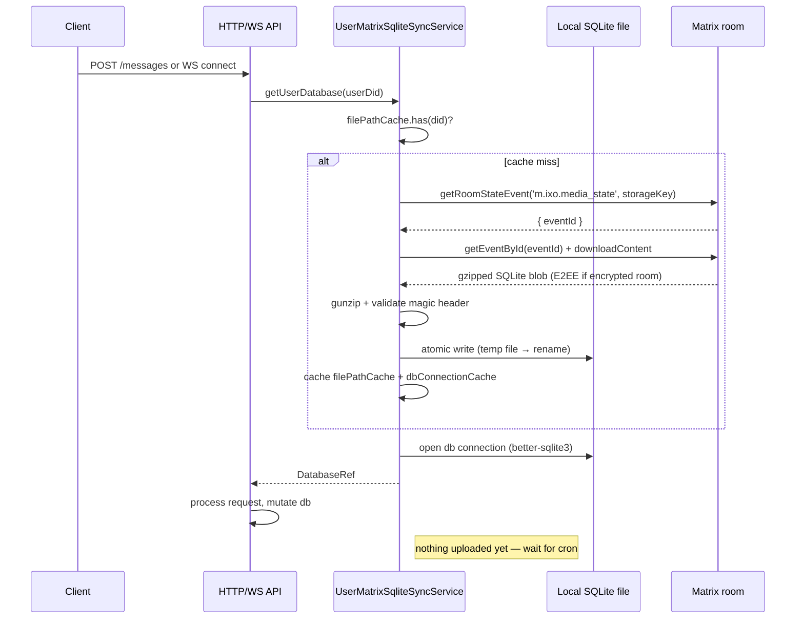
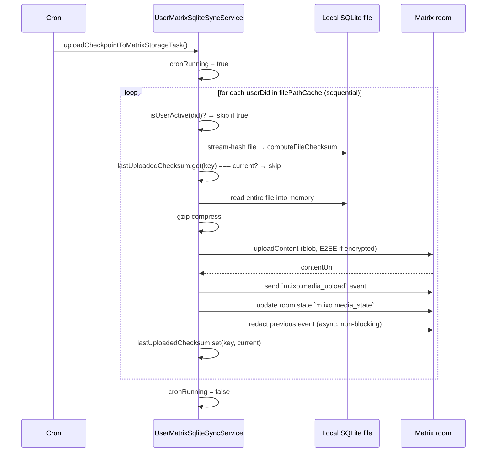

# Matrix & Storage Architecture Review

**Status:** Review / proposal
**Author:** Yousef / QiForge
**Date:** 2026-05-06
**Stack:** matrix-bot-sdk · matrix-js-sdk (RustSdkCryptoStorageProvider) · NestJS · BullMQ · `better-sqlite3`
**Related:** [ORA-219 Plugin-Based Runtime](./ORA-219-plugin-based-runtime.md), Appendix B
**Scope:** How QiForge currently uses Matrix as transport + storage, why server boot/load time grows with user count, and what to do about it.

---

## TL;DR

QiForge uses Matrix as both the **message bus** and the **storage backend** (per-user SQLite checkpoints uploaded as media events; secrets stored as room state events). This dual role is the source of the scaling problem the team is feeling: as user count grows, boot/load time grows linearly because the Matrix `/sync` loop fetches every user-oracle room, and the every-10-minute checkpoint upload cron iterates users sequentially with a 1-10s upload each.

There are **two strategies**, not mutually exclusive:

1. **Quick wins (1 week, low risk):** parallelize the upload cron, add a timestamped lock instead of a boolean flag, cache `getRoomState` lookups for secrets, add a max-concurrent-users guard, add a `/health/matrix` endpoint, mtime-precheck before checksum. Buys ~5x boot/sync headroom. **Recommended ship-this-week.**
2. **Storage migration (3-4 weeks, medium risk):** move per-user SQLite checkpoints to S3/GCS object storage, keep Matrix for transport (chat messages, action logs) and identity (room state for secrets). Keeps E2E architecture intact, removes the worst scaling bottleneck. **Recommended next-quarter.**

A more ambitious option — **selective sync** (only sync rooms with active sessions) — is documented but not recommended yet because it requires forking matrix-bot-sdk's sync loop.

The plugin-based runtime spec ([ORA-219](./ORA-219-plugin-based-runtime.md)) introduces `ctx.storage` as an abstraction over today's `UserMatrixSqliteSyncService`. That abstraction is what makes the storage migration possible without breaking plugin code. So this work and the plugin work compose cleanly.

This document is the technical review. A separate Linear ticket should be created to track the work; suggested estimate at the end.

---

## Table of Contents

1. [Current Architecture — How Matrix Is Used](#1-current-architecture)
2. [Bootstrap Order and What Blocks HTTP Listen](#2-bootstrap-order)
3. [The Two Cron Loops in `UserMatrixSqliteSyncService`](#3-the-two-cron-loops)
4. [Per-User SQLite Lifecycle](#4-per-user-sqlite-lifecycle)
5. [Reference-Counting Model (`markUserActive`/`markUserInactive`)](#5-reference-counting)
6. [Bottleneck Inventory](#6-bottleneck-inventory)
7. [Quick-Win Patches (1-week, low risk)](#7-quick-win-patches)
8. [Architecture Redesign Options](#8-architecture-redesign-options)
9. [Recommended Path Forward](#9-recommended-path-forward)
10. [Implementation Checklist](#10-implementation-checklist)
11. [Open Questions](#11-open-questions)
12. [Appendix — Code References](#12-appendix-code-references)

---

## 1. Current Architecture

### 1.1 The dual role of Matrix

QiForge uses Matrix for two distinct purposes that have very different scaling characteristics:

| Use | What's stored | Scaling model |
|---|---|---|
| **Message bus** | Chat messages, agent action logs, Matrix events for per-user rooms | Append-only, scales with message volume |
| **Storage backend** | Per-user SQLite blobs (gzipped, optionally E2EE) as media events; secrets as room state events; checkpoint pointers as room state | Last-write-wins (no versioning), scales with user count × checkpoint size |

The transport role is what Matrix is designed for and is fine. The storage role is where the scaling pressure lives.

### 1.2 What lives where

**Per-user SQLite (on disk, at `${SQLITE_DATABASE_PATH}/user_dbs/${userDid}/${storageKey}.db`):**

- LangGraph checkpoints (thread_id, checkpoint_id, channel_values, messages — the entire agent state)
- Sessions table (call_id, session_id, created_at metadata)
- Calls table

**Matrix (per-user oracle-owned room, e.g. `#${userDid}_${oracleEntityDid}:homeserver`):**

- **Timeline events:** `m.room.message` (chat), `ixo.action.log` (agent action logs)
- **Room state events:** `ixo.room.secret.index` (one state event per secret), `m.ixo.media_state` (pointers to checkpoint media events)
- **Media events:** `m.ixo.media_upload` containing gzipped SQLite blobs

**Shared crypto store (on disk, at `${MATRIX_STORE_PATH}/encrypted-sqlite`):**

- OLM sessions, device lists, room keys (managed by `RustSdkCryptoStorageProvider`)

### 1.3 The data flow per user request



Critical observations:

- **First request per user blocks on a Matrix download** (1-10s for large checkpoints).
- **Subsequent requests hit the local FS and the in-memory `dbConnectionCache`** (fast).
- **Uploads are deferred to the every-10-minute cron**, not request-time.

### 1.4 The data flow on the every-10-minute cron



Critical observations:

- **Sequential — 100 users × 5s each = 8 minutes total**, longer than the cron interval, causing the next run to silently skip.
- **No retry logic on individual upload failures** — they're logged and skipped, leaving stale Matrix state.
- **No backpressure** — if the cron is taking too long, it doesn't tell the operator; it just falls behind.

---

## 2. Bootstrap Order

The current bootstrap (`apps/app/src/main.ts:23-185`) is intentionally non-blocking on Matrix init, which is the right design for HTTP availability. But there's no health gate — early requests can hit an uninitialized Matrix and either fail confusingly or block.

```
Line 26:    NestFactory.create(AppModule)               [BLOCKING — DI graph build]
Line 31-57: Security/CORS/validation/Swagger            [BLOCKING — middleware setup]
Line 102:   MatrixManager.getInstance()                 [BLOCKING — singleton creation only]
Line 104:   registerGracefulShutdown()                  [BLOCKING — signal handler register]
Line 108-110: SecretsService + UserPreferencesService   [BLOCKING — set cache manager]
Line 113:   initModelPricingCache()                     [FIRE-AND-FORGET]
Line 121:   matrixManager.init().catch(...)             [FIRE-AND-FORGET — full /sync starts]
Line 125-131: EditorMatrixClient.init()                 [FIRE-AND-FORGET]
Line 133-147: setupClaimSigningMnemonics()              [BLOCKING — Matrix room reads]
Line 158-179: load encryption key                       [BLOCKING]
Line 185:   await app.listen(port, '0.0.0.0')           [HTTP starts accepting]
```

The full Matrix `/sync` (kicked off at line 121) fires and forgets. The HTTP server starts at line 185 without waiting. Matrix `/sync` typically completes 30-120 seconds later, depending on user count.

**Issue:** there's no `/health/matrix` endpoint to tell a load balancer to return 503 until Matrix is ready. So early requests (in the first ~60 seconds after deploy) can hit the API and fail confusingly.

**SIGTERM handling** (`main.ts:206-295`) is good — it explicitly uploads pending checkpoints, closes Nest, shuts MatrixManager, and destroys the EditorMatrixClient. No changes recommended here.

---

## 3. The Two Cron Loops

Both loops live in `apps/app/src/user-matrix-sqlite-sync-service/user-matrix-sqlite-sync-service.service.ts`. Both share a single `cronRunning` boolean flag.

### 3.1 `uploadCheckpointToMatrixStorageTask` — every 10 minutes

```ts
@Cron('0 10,20,30,40,50 * * * *')
async uploadCheckpointToMatrixStorageTask(): Promise<void> {
  if (this.cronRunning) return;
  this.cronRunning = true;
  try {
    Logger.log(`Uploading checkpoint to Matrix storage task started`);
    for (const userDid of this.filePathCache.keys()) {
      try {
        await this.uploadCheckpointToMatrixStorage({ userDid });
      } catch (error) {
        Logger.error(`Failed for ${userDid}: ${error.message}`);
      }
    }
  } finally {
    this.cronRunning = false;
  }
}
```

- **Sequential.** No `Promise.all`, no concurrency limit.
- **Per-user cost:** stream-hash file (~100-500ms for typical sizes), check cached checksum, gzip compress (~500ms-5s), upload to Matrix (~1-5s).
- **Total time:** 1-10s per user × N users.
- **At 100 users:** ~100-1000 seconds = 1.7-16 minutes (next cron interval is 10 minutes — uploads can fall behind).
- **At 1000 users:** ~17-170 minutes (uploads run continuously, never finish before the next cron).

### 3.2 `localStorageCacheCleanUpTask` — every hour

```ts
@Cron(CronExpression.EVERY_HOUR)
public async localStorageCacheCleanUpTask(): Promise<void> {
  // ...
  for (const [userDid, { db, lastAccessedAt }] of this.dbConnectionCache.entries()) {
    if (now - lastAccessedAt > hours(1)) {
      await this.uploadCheckpointToMatrixStorage({ userDid });
      db.close();
      this.dbConnectionCache.delete(userDid);
    }
  }
  for (const [userDid, { lastAccessedAt }] of this.filePathCache.entries()) {
    if (now - lastAccessedAt > hours(1)) {
      await this.uploadCheckpointToMatrixStorage({ userDid });
      // delete local folder + caches
    }
  }
}
```

- **Two nested sequential loops** over the same data structures.
- **Calls `uploadCheckpointToMatrixStorage` again** even though the 10-minute cron just ran (redundant when nothing has changed).
- **Hard-coded 1-hour idle threshold** — a quiet user gets evicted and pays a download cost on next request.

### 3.3 The shared `cronRunning` lock

A boolean. No timestamp. If a cron crashes or hangs, `cronRunning` stays `true` indefinitely and **all subsequent crons are silently skipped**. There is no alert.

Real-world failure mode:

```
T+0:    cron starts, cronRunning = true, gets stuck in upload loop
T+10m:  next cron fires, sees cronRunning = true, returns silently
T+20m:  next cron fires, sees cronRunning = true, returns silently
T+1h:   hourly cleanup fires, sees cronRunning = true, returns silently
T+24h:  ops on-call notices checkpoints haven't been backed up
```

The fix is a timestamped lock with a timeout (see §7.3).

---

## 4. Per-User SQLite Lifecycle

### 4.1 Creation

A user's SQLite file is created on first call to `getUserDatabase(userDid)`:

1. `syncLocalStorageFromMatrixStorage()` runs.
2. If Matrix has a checkpoint event, download + decompress + validate, atomic write to FS.
3. If Matrix has no checkpoint, create a fresh empty DB on FS.
4. Open `better-sqlite3` connection, run `PRAGMA integrity_check`.
5. Cache in `filePathCache` (path → metadata) and `dbConnectionCache` (did → open connection).

### 4.2 Access

`getUserDatabase(userDid)` returns the cached connection if present (fast). Otherwise it goes through the creation path.

`markUserActive(userDid)` ref-counts to prevent the cleanup cron from closing the DB mid-transaction.

### 4.3 Eviction

The hourly cleanup cron evicts users idle for >1 hour: uploads the checkpoint, closes the DB, deletes the local file path cache entry. Next access pays the full download cost.

### 4.4 Concurrency

**No max-concurrent-users guard.** If 10,000 users hit the API simultaneously (extreme but possible during a campaign), 10,000 DB handles open in memory. Each `better-sqlite3` handle plus its WAL buffer is on the order of 10-100 MB depending on DB size. **Worst case: ~1 TB of resident memory.** SQLite itself caps open databases per process at ~2000.

Practical reality: most deploys never hit this, but there's no backpressure mechanism. The first time the limit is hit the process will OOM or fail to open a handle, with no graceful degradation.

---

## 5. Reference-Counting Model

```ts
private readonly activeUsers = new Map<string, number>();

markUserActive(userDid: string): void {
  const count = this.activeUsers.get(userDid) ?? 0;
  this.activeUsers.set(userDid, count + 1);
}

markUserInactive(userDid: string): void {
  const count = this.activeUsers.get(userDid) ?? 0;
  if (count <= 1) this.activeUsers.delete(userDid);
  else this.activeUsers.set(userDid, count - 1);
}
```

Used by:
- `calls.service.ts:115, 143` (wraps `syncCall` and `listCalls`)
- `sessions.service.ts:46, 62, 70, 77` (wraps session creation and history processing)
- `tasks/processors/*.ts` (wraps job handlers)

**Not used by `messages.service.ts`** — there's no markUserActive guard around message processing. **This is a real bug.** If the cleanup cron runs while the agent graph is mid-transaction (writing checkpoints), the DB can be closed and the transaction lost or the file corrupted. Race window is small but non-zero.

**Failure modes of the ref-counting model:**

1. **Crash leaks ref count.** If a code path calls `markUserActive` and then throws before `markUserInactive`, the user is stuck "active" forever. Cleanup cron skips them indefinitely. They never get backed up to Matrix.
2. **No timeout.** Ref counts have no TTL. Once leaked, they require process restart to clear.
3. **No telemetry.** Operators have no visibility into stuck ref counts.

A `try/finally` wrapper or a Symbol.dispose-based scope is the right pattern. Already partially present in some call sites; missing in others.

---

## 6. Bottleneck Inventory

Ranked by severity. Each entry includes file:line, scaling factor, and remediation hint. Bottlenecks marked **CRITICAL** are the ones causing user-visible pain today.

### B1. Sequential checkpoint upload loop **(CRITICAL)**

- **File:** `apps/app/src/user-matrix-sqlite-sync-service/user-matrix-sqlite-sync-service.service.ts:914-950`
- **Symptom:** As user count grows, the every-10-minute upload cron takes longer than 10 minutes. Subsequent crons are silently skipped via the `cronRunning` boolean. Checkpoints fall behind, increasing data-loss risk if the process crashes.
- **Scales with:** user count × checkpoint size.
- **Remediation:** Parallelize with `Promise.all` + concurrency limit (e.g., 5). 5x speedup. See §7.1.

### B2. Initial Matrix /sync blocks startup work **(CRITICAL)**

- **File:** `packages/matrix/src/utils/create-simple-matrix-client.ts:122-147` (where `await this.mxClient.start()` triggers the matrix-js-sdk sync loop).
- **Symptom:** Matrix init takes 30-120 seconds for accounts with many rooms. HTTP listen starts before sync completes (good), but operations that need an initialized Matrix (e.g., `setupClaimSigningMnemonics` at `main.ts:133`) still block.
- **Scales with:** number of rooms (1 per active user-oracle pair).
- **Remediation:** Two stacked options:
  - **Short-term:** Add a `/health/matrix` endpoint so load balancers return 503 until init completes. Stops early-request confusion. See §7.7.
  - **Medium-term:** Persist the sync token across restarts so re-sync is incremental (matrix-bot-sdk supports this; needs verification of the configuration).
  - **Long-term:** Selective sync (only sync rooms with active sessions). Requires forking the sync loop. Not recommended yet.

### B3. `getRoomState(roomId)` fetches full state every call **(HIGH)**

- **File:** `apps/app/src/secrets/secrets.service.ts:48-78`
- **Symptom:** Every secret lookup fetches the entire room state event list, then filters client-side for `ixo.room.secret.index` events. If a room has 10,000 state events, 10,000 are fetched.
- **Scales with:** room state size, secret-lookup frequency.
- **Remediation:** Add an in-memory cache with 5-minute TTL keyed by `roomId`. Cache hit rate will be >95% in practice. See §7.4.

### B4. No max-concurrent-users guard **(HIGH)**

- **File:** `apps/app/src/user-matrix-sqlite-sync-service/user-matrix-sqlite-sync-service.service.ts:241-293`
- **Symptom:** No upper bound on `dbConnectionCache.size`. A traffic spike opens an unbounded number of DB handles. Eventually OOM or `EMFILE` (too many open files).
- **Scales with:** concurrent user count.
- **Remediation:** Add LRU eviction with max cache size (e.g., 1000) + 429 (Too Many Requests) backpressure when over. See §7.2.

### B5. Boolean cron lock with no timeout **(HIGH)**

- **File:** `apps/app/src/user-matrix-sqlite-sync-service/user-matrix-sqlite-sync-service.service.ts:476-478, 916`
- **Symptom:** If a cron crashes or hangs, the `cronRunning` boolean stays `true` and all subsequent crons are silently skipped. Operators have no signal until checkpoint lag is noticed by ops or a user.
- **Scales with:** any user count, any failure mode.
- **Remediation:** Replace with a timestamped lock: track `cronLastStart`; if `now - cronLastStart > timeout` (e.g., 5 min), force-unset and log a warning. See §7.3.

### B6. No `markUserActive` guard around message processing **(HIGH)**

- **File:** `apps/app/src/messages/messages.service.ts` (the `sendMessage` flow)
- **Symptom:** Cleanup cron can race with mid-transaction agent graph execution. Closing the DB while a checkpoint write is in progress can corrupt the file.
- **Scales with:** message volume, cron overlap probability.
- **Remediation:** Wrap message processing in `markUserActive`/`markUserInactive` with try/finally. See §7.6.

### B7. Per-user lazy DB download is a 1-10s first-request penalty **(MEDIUM)**

- **File:** `apps/app/src/user-matrix-sqlite-sync-service/user-matrix-sqlite-sync-service.service.ts:241-293`
- **Symptom:** First request from a user (or first request after eviction) blocks on Matrix media download + gunzip + validate. 1-10 seconds depending on checkpoint size. Visible as p99 latency for "cold" users.
- **Scales with:** checkpoint size, eviction rate.
- **Remediation:**
  - Pre-warm top-N users at boot (configurable).
  - Streaming gunzip + validate-as-you-go (validate magic header before decompressing the rest).
  - In a storage-migration future, move blobs to a CDN-backed object store.

### B8. OLM crypto session setup is per-room and lazy **(MEDIUM)**

- **File:** `packages/matrix/src/utils/create-simple-matrix-client.ts:87-95`
- **Symptom:** First message in any encrypted room takes 2-5 seconds (Rust FFI call into OLM, key agreement, session setup). Visible as latency spike for first-encrypted-message scenarios.
- **Scales with:** number of encrypted rooms touched.
- **Remediation:** Pre-initialize OLM for the oracle's most-used rooms at boot. Lazy init for the rest. Confirm OLM v3.2+ is in use (better perf).

### B9. Checksum computed on every upload, even for unchanged files **(MEDIUM)**

- **File:** `apps/app/src/user-matrix-sqlite-sync-service/user-matrix-sqlite-sync-service.service.ts:849`
- **Symptom:** Every 10 minutes, every cached user's DB gets a streaming SHA-256 read from disk (~100-500ms each). Most files haven't changed since the last cron.
- **Scales with:** user count × checkpoint size.
- **Remediation:** Cache file `mtime` per user. If `mtime` is unchanged since last upload, skip checksum entirely. ~80% reduction in cron CPU. See §7.5.

### B10. Atomic write leaves orphan `.tmp` files on failure **(LOW)**

- **File:** `apps/app/src/user-matrix-sqlite-sync-service/user-matrix-sqlite-sync-service.service.ts:768-780`
- **Symptom:** If the rename step of an atomic write fails, the temp file is left on disk. Cleanup logic catches some cases but not all. Minor disk-space leak.
- **Scales with:** download failure rate.
- **Remediation:** Add a periodic cleanup task that removes `*.tmp`, `*-journal`, `*.wal` files older than 24 hours.

### Severity summary

| # | Bottleneck | Severity | Effort |
|---|---|---|---|
| B1 | Sequential upload loop | CRITICAL | 1 hour |
| B2 | Initial Matrix /sync blocks | CRITICAL | 1 day (health endpoint); 1 week (sync token persistence) |
| B3 | getRoomState fetches full state | HIGH | 2 hours |
| B4 | No max-concurrent guard | HIGH | 2 hours |
| B5 | Boolean cron lock | HIGH | 1 hour |
| B6 | Missing markUserActive in messages | HIGH | 30 min |
| B7 | Cold-start download penalty | MEDIUM | 1 day |
| B8 | OLM per-room lazy init | MEDIUM | 1 day |
| B9 | Checksum on every cron | MEDIUM | 1 hour |
| B10 | Orphan .tmp files | LOW | 1 hour |

---

## 7. Quick-Win Patches (1-week, low risk)

These are concrete code changes that ship without re-architecting. Each is small, testable, low-risk, and addresses one bottleneck. Order is recommended deployment order (smallest blast radius first).

### 7.1 Parallelize checkpoint uploads (B1)

**File:** `apps/app/src/user-matrix-sqlite-sync-service/user-matrix-sqlite-sync-service.service.ts:914-950`

```ts
@Cron('0 10,20,30,40,50 * * * *')
async uploadCheckpointToMatrixStorageTask(): Promise<void> {
  if (this.cronRunning) return;
  this.cronRunning = true;
  const startTime = Date.now();
  let successCount = 0;
  let failCount = 0;

  try {
    const concurrency = 5;
    const userDids = Array.from(this.filePathCache.keys());
    Logger.log(`Checkpoint upload task started (${userDids.length} users, concurrency=${concurrency})`);

    for (let i = 0; i < userDids.length; i += concurrency) {
      const batch = userDids.slice(i, i + concurrency);
      const results = await Promise.allSettled(
        batch.map((did) => this.uploadCheckpointToMatrixStorage({ userDid: did })),
      );
      successCount += results.filter((r) => r.status === 'fulfilled').length;
      failCount += results.filter((r) => r.status === 'rejected').length;
    }

    const elapsedSec = ((Date.now() - startTime) / 1000).toFixed(1);
    Logger.log(`Checkpoint upload task done: ${successCount} ok, ${failCount} failed, ${elapsedSec}s`);
  } finally {
    this.cronRunning = false;
  }
}
```

**Expected impact:** 5x speedup. 100 users in ~20-100s instead of 100-500s.

**Risk:** very low. Each upload is independent. Matrix server can handle concurrent uploads. Only consideration is rate-limiting on the Matrix server side; if the homeserver complains, lower concurrency to 3.

**Test:** unit-test the loop with a stubbed `uploadCheckpointToMatrixStorage`. Integration-test with 20 fake users locally.

### 7.2 Add max-concurrent-users guard (B4)

**File:** same service.

```ts
private readonly MAX_DB_CONNECTIONS = 1000;

public async getUserDatabase(userDid: string): Promise<DatabaseType> {
  if (
    !this.dbConnectionCache.has(userDid) &&
    this.dbConnectionCache.size >= this.MAX_DB_CONNECTIONS
  ) {
    Logger.warn(
      `Max concurrent user DBs (${this.MAX_DB_CONNECTIONS}) reached; ` +
      `evicting LRU before opening ${userDid}`,
    );
    await this.evictLeastRecentlyUsed();
  }

  // ... existing creation/cache-hit path
}

private async evictLeastRecentlyUsed(): Promise<void> {
  // Find LRU entry where isUserActive is false (don't evict in-use)
  let oldestDid: string | null = null;
  let oldestTs = Infinity;
  for (const [did, { lastAccessedAt }] of this.dbConnectionCache.entries()) {
    if (this.isUserActive(did)) continue;
    if (lastAccessedAt < oldestTs) {
      oldestTs = lastAccessedAt;
      oldestDid = did;
    }
  }
  if (!oldestDid) {
    throw new ServiceUnavailableException('All DB slots are in use; try again');
  }
  await this.uploadCheckpointToMatrixStorage({ userDid: oldestDid });
  this.dbConnectionCache.get(oldestDid)?.db.close();
  this.dbConnectionCache.delete(oldestDid);
}
```

**Expected impact:** prevents OOM under traffic spikes. Provides backpressure.

**Risk:** low. The eviction path only triggers when the cap is hit. If all slots are in use (rare), returns 503 — better than crashing.

**Test:** unit-test eviction with a mocked cache exceeding the cap.

### 7.3 Timestamped cron lock (B5)

**File:** same service.

```ts
private cronLastStart = 0;
private readonly CRON_TIMEOUT_MS = 5 * 60 * 1000; // 5 minutes

private acquireCronLock(): boolean {
  const now = Date.now();
  if (this.cronRunning) {
    if (now - this.cronLastStart > this.CRON_TIMEOUT_MS) {
      Logger.warn(
        `Previous cron started ${((now - this.cronLastStart) / 1000).toFixed(0)}s ago — ` +
        `force-resetting lock`,
      );
      this.cronRunning = false;
    } else {
      return false;
    }
  }
  this.cronRunning = true;
  this.cronLastStart = now;
  return true;
}

@Cron(CronExpression.EVERY_HOUR)
public async localStorageCacheCleanUpTask(): Promise<void> {
  if (!this.acquireCronLock()) {
    Logger.debug('cleanup task skipped — another cron is running');
    return;
  }
  try {
    // ... existing logic
  } finally {
    this.cronRunning = false;
  }
}

// Apply to uploadCheckpointToMatrixStorageTask similarly.
```

**Expected impact:** no more silent skipping. Stuck crons recover automatically.

**Risk:** very low. Only behavior change is that a stuck cron eventually unblocks.

**Test:** unit-test with a mocked clock that advances past the timeout.

### 7.4 Cache `getRoomState` lookup for secrets (B3)

**File:** `apps/app/src/secrets/secrets.service.ts:44-86`

```ts
private secretIndexCache = new Map<string, { index: SecretIndexEntry[]; ts: number }>();
private readonly SECRET_INDEX_TTL_MS = 5 * 60 * 1000;

async getSecretIndex(roomId: string): Promise<SecretIndexEntry[]> {
  const cached = this.secretIndexCache.get(roomId);
  if (cached && Date.now() - cached.ts < this.SECRET_INDEX_TTL_MS) {
    return cached.index;
  }
  // ... existing fetch logic
  this.secretIndexCache.set(roomId, { index, ts: Date.now() });
  return index;
}

/** Called from a Matrix event listener when secret index changes. */
public invalidateSecretIndex(roomId: string): void {
  this.secretIndexCache.delete(roomId);
}
```

**Expected impact:** secret lookups drop from 100-1000ms (Matrix round trip) to <1ms (memory). Cache hit rate >95% in normal operation.

**Risk:** stale-cache risk if a secret is added or removed and the cache isn't invalidated. Mitigation: hook the existing Matrix event listener to call `invalidateSecretIndex(roomId)` when an `ixo.room.secret.index` state event fires. Worst case: 5-minute staleness on changes — acceptable.

**Test:** unit-test cache hit + miss + invalidation paths.

### 7.5 Use `mtime` as a checksum precheck (B9)

**File:** `apps/app/src/user-matrix-sqlite-sync-service/user-matrix-sqlite-sync-service.service.ts:847-857`

```ts
private lastUploadedMtime = new Map<string, number>();

async uploadCheckpointToMatrixStorage(params: BaseSyncArgs): Promise<void> {
  const { userDid } = params;
  const storageKey = UserMatrixSqliteSyncService.createUserStorageKey(userDid);
  const path = UserMatrixSqliteSyncService.getUserCheckpointDbPath(userDid);

  const stats = await fs.stat(path).catch(() => null);
  if (!stats) {
    Logger.warn(`Checkpoint missing for ${userDid}`);
    return;
  }

  const lastMtime = this.lastUploadedMtime.get(storageKey);
  const currentMtime = stats.mtimeMs;
  if (lastMtime !== undefined && lastMtime === currentMtime) {
    Logger.debug(`Skipping ${userDid} — file unchanged (mtime)`);
    return;
  }

  // expensive: stream-hash the file
  const checksum = await computeFileChecksum(path);
  if (this.lastUploadedChecksum.get(storageKey) === checksum) {
    Logger.debug(`Skipping ${userDid} — checksum unchanged`);
    this.lastUploadedMtime.set(storageKey, currentMtime); // remember we already checked
    return;
  }

  // ... existing upload logic
  this.lastUploadedChecksum.set(storageKey, checksum);
  this.lastUploadedMtime.set(storageKey, currentMtime);
}
```

**Expected impact:** skip checksum on ~80% of users per cron. CPU savings.

**Risk:** mtime can theoretically lie (e.g., if the FS has imprecise mtime). On Linux ext4 / APFS this isn't an issue. On exotic FSes, the checksum still runs as a fallback (the `mtime` cache only short-circuits when both match).

**Test:** unit-test with stubbed `fs.stat` returning various mtimes.

### 7.6 Add `markUserActive` guard in MessagesService (B6)

**File:** `apps/app/src/messages/messages.service.ts` (`sendMessage` and any other DB-touching methods)

```ts
async sendMessage(payload: SendMessagePayload, res?: Response): Promise<void> {
  const userDid = normalizeDid(payload.userDid);
  this.checkpointStorageSyncService.markUserActive(userDid);
  try {
    // ... existing message processing
  } finally {
    this.checkpointStorageSyncService.markUserInactive(userDid);
  }
}
```

**Expected impact:** closes the race-condition window between message processing and cleanup cron. No more risk of mid-transaction DB close.

**Risk:** none — it's strictly additive protection.

**Test:** existing message-flow tests should still pass; add one that verifies `isUserActive` returns true during `sendMessage`.

### 7.7 Add `/health/matrix` endpoint (B2 short-term)

**File:** new `apps/app/src/health/health-matrix.controller.ts` (or extend an existing health controller).

```ts
import { Controller, Get } from '@nestjs/common';
import { MatrixManager } from '@ixo/matrix';

@Controller('health')
export class HealthMatrixController {
  @Get('matrix')
  matrix() {
    const mm = MatrixManager.getInstance();
    const initialized = mm.isInitialized();
    return {
      initialized,
      ...(initialized ? {} : { reason: 'matrix sync in progress' }),
    };
  }
}
```

Then in your load balancer / k8s readiness probe, gate on `initialized: true`. The HTTP server stays up (so `/health/live` returns 200) but is marked "not ready" (so traffic is held off) until Matrix init completes.

**Expected impact:** no early-request failures during the 30-120 second Matrix init window.

**Risk:** very low. Only behavior change is that the LB stops sending traffic to fresh pods until they're ready.

**Test:** integration test that hits `/health/matrix` before and after `MatrixManager.init()` resolves.

### 7.8 Cleanup orphan `.tmp` files (B10)

**File:** `apps/app/src/user-matrix-sqlite-sync-service/user-matrix-sqlite-sync-service.service.ts`

```ts
@Cron(CronExpression.EVERY_DAY_AT_3AM)
async orphanFileCleanupTask(): Promise<void> {
  const baseDir = path.join(this.config.SQLITE_DATABASE_PATH, 'user_dbs');
  const ONE_DAY = 24 * 60 * 60 * 1000;
  const now = Date.now();

  const userDirs = await fs.readdir(baseDir).catch(() => []);
  let deleted = 0;
  for (const userDir of userDirs) {
    const fullPath = path.join(baseDir, userDir);
    const files = await fs.readdir(fullPath).catch(() => []);
    for (const file of files) {
      if (!/\.(tmp|wal|journal)$/.test(file)) continue;
      const stat = await fs.stat(path.join(fullPath, file)).catch(() => null);
      if (!stat || now - stat.mtimeMs < ONE_DAY) continue;
      await fs.unlink(path.join(fullPath, file)).catch(() => undefined);
      deleted++;
    }
  }
  if (deleted > 0) Logger.log(`orphan cleanup deleted ${deleted} stale files`);
}
```

**Expected impact:** disk space stays bounded.

**Risk:** very low. Only deletes files older than 24h matching well-known patterns.

**Test:** unit test with a mock FS.

### 7.9 Quick-win bundle deployment plan

These nine patches form a coherent batch:

| Order | Patch | Reason for ordering |
|---|---|---|
| 1 | 7.6 (markUserActive in MessagesService) | Smallest blast radius, fixes a real correctness bug |
| 2 | 7.3 (timestamped cron lock) | Foundational; needed before parallelization to recover from any future stuck cron |
| 3 | 7.5 (mtime precheck) | CPU savings, reduces likelihood of cron lasting >5min |
| 4 | 7.1 (parallelize uploads) | Biggest perf win; lock improvements from #2 give safety net |
| 5 | 7.4 (secret index cache) | Per-request latency improvement, independent |
| 6 | 7.2 (max-concurrent guard) | Safety against unbounded growth |
| 7 | 7.7 (/health/matrix) | LB integration; deploy alongside infra change |
| 8 | 7.8 (orphan cleanup) | Hygiene |

Total estimated effort: **3-5 engineer-days** for all eight patches plus tests. Suggested as a single PR or stacked series, deployed behind the existing release process.

---

## 8. Architecture Redesign Options

The quick wins buy headroom but don't change the fundamental scaling model. For a more durable fix, two architectural options. Recommended path is Option A.

### 8.1 Option A — Move checkpoints to S3, keep Matrix for transport (RECOMMENDED)

**What changes:**

- Per-user SQLite checkpoint blobs move from Matrix media events to S3/GCS object storage.
- Checkpoint *metadata* (object key, size, last-modified, ETag) lives in a Matrix room state event (`ixo.checkpoint.metadata`) so the existing event-listener pattern still works.
- Matrix continues to store: chat messages (`m.room.message`), action logs (`ixo.action.log`), secrets (`ixo.room.secret.index`).
- OLM crypto store stays in Matrix (or moves to a dedicated KMS, optional separate work).

**What stays the same:**

- Matrix as message bus.
- Matrix room state as KV for secrets (with caching from §7.4).
- Per-room event listeners.
- The plugin `ctx.storage.getUserDb()` API — its implementation changes, plugins don't.

**Why this is the right choice:**

| Property | Matrix today | S3 |
|---|---|---|
| PUT cost | ~1-5s (sync round-trip + E2EE encrypt + media upload) | ~50-200ms |
| GET cost | ~1-5s (sync + download + decrypt + gunzip) | ~100-500ms (with CDN, ~50ms) |
| Concurrency | Sequential cron, ~5 parallel safe | Effectively unlimited |
| Versioning | Last-write-wins, no rollback | Built-in, free |
| Cost / GB / month | Matrix homeserver disk + bandwidth | $0.023 (S3 standard) |
| Operational visibility | Matrix admin tools (limited) | CloudWatch / GCP Monitoring (rich) |

**Migration path (zero-downtime):**

1. **Add S3 client** to the runtime. Adapter interface so the underlying store is pluggable.
2. **Dual-write phase (1 release):** every checkpoint upload writes to BOTH S3 and Matrix. Reads prefer S3, fall back to Matrix.
3. **Backfill phase (background):** a one-shot migration job copies historical Matrix checkpoints to S3.
4. **Validation phase:** monitor read paths to confirm S3 is preferred and Matrix fallback is rare. Compare checksums on critical users to confirm correctness.
5. **Cutover:** stop writing to Matrix. Reads still fall back to Matrix for a release.
6. **Cleanup:** stop reading from Matrix entirely. Optionally redact old Matrix media events to reclaim homeserver storage.

**Cost example:**

- 10,000 users with 100 MB checkpoints each → 1 TB S3 standard storage → **~$23/month**.
- 10,000 users × 6 uploads/hour (every 10 min) = 60k PUTs/hour → 43.2M PUTs/month → **~$216/month** (PUT @ $0.005/1k).
- Total: **~$239/month** for 10k users. Negligible relative to LLM costs, vastly cheaper than the engineering hours spent debugging cron lag.

**Effort:** 3-4 weeks for one engineer. Most of the work is the S3 adapter, the dual-write logic, and the backfill job. The `ctx.storage` abstraction in ORA-219 makes plugin code immune to this change.

**Risk:** medium. S3 is well-tested. The dual-write phase de-risks the cutover. Main risk is a bug in the migration job that miscopies checkpoints — mitigated by checksumming.

### 8.2 Option B — Per-user sharded oracle processes (NOT RECOMMENDED YET)

**What changes:**

- Instead of one oracle process handling all users, spawn N child processes (e.g., 10), each owning ~1/N of users.
- Routing: `userDid % N` → which child handles the request.
- Each child has its own MatrixManager, OLM store, DB cache.
- Parent process is a thin reverse proxy.

**Benefits:**

- Cron loops parallelize across processes (10 children × 5 concurrency = 50x).
- Failure isolation (one child OOMs, others survive).
- Scales horizontally (add more children).

**Costs:**

- 10x Matrix crypto stores (memory + disk).
- 10x sync loops (more Matrix server load).
- Inter-process coordination is non-trivial (graceful shutdown, health checks, job routing).
- Debugging across processes is painful.

**Why not now:** Option A solves the immediate scaling pain at much lower complexity. Sharding is a sledgehammer; we need a scalpel first. Revisit only if Option A doesn't get us past 100k users.

### 8.3 Option C — Selective sync (DOCUMENTED, NOT RECOMMENDED YET)

**What changes:**

- Don't sync all rooms at startup. Sync only rooms with active sessions.
- Use Matrix `/sync` filters to fetch only specific room IDs and event types.

**Benefits:**

- Boot in <5 seconds regardless of user count.
- Lower bandwidth.

**Costs:**

- Requires custom sync logic; matrix-bot-sdk's high-level API doesn't easily expose this.
- Risk of missing events in idle rooms (a user reconnects after a week, their action logs are gone from local cache).
- Complex state machine.

**Why not now:** the engineering complexity is high, and Option A reduces the per-user blast radius enough that selective sync becomes less urgent. Park as a follow-up if Matrix sync continues to be a bottleneck after Option A ships.

---

## 9. Recommended Path Forward

### 9.1 Now (next 1-2 weeks)

Ship the quick-win bundle (§7). 3-5 engineer-days. 5x sync headroom, eliminates 3 silent-failure modes (cron lock, race condition, OOM under spike). Low risk.

### 9.2 Next (next 1 quarter)

Ship Option A (S3 checkpoint migration). 3-4 engineer-weeks. Removes the worst scaling bottleneck. Sets up the storage abstraction the ORA-219 plugin runtime is already designed against.

### 9.3 Later (next 2 quarters)

Re-evaluate after Option A is in production. If 10k+ users and Matrix sync is still painful, consider Option C (selective sync). If a single process can't scale to the user count, consider Option B (sharding).

### 9.4 Ordering vs. ORA-219

The plugin runtime spec ([ORA-219](./ORA-219-plugin-based-runtime.md)) introduces `ctx.storage` as an abstraction over today's `UserMatrixSqliteSyncService`. The two work streams are independent but composable:

- **Quick wins (§7) are independent** of ORA-219. Ship them whenever.
- **ORA-219 ships before Option A.** ORA-219's `ctx.storage` is the contract that lets Option A swap implementations without changing plugin code.
- **Option A ships after ORA-219.** Once `ctx.storage` is the only way plugins touch storage, swapping the implementation is a single-package change.

If ORA-219 stalls, ship the quick wins anyway — they're not blocked.

---

## 10. Implementation Checklist

### 10.1 Quick wins (one PR or stacked series)

- [ ] `7.6` Add `markUserActive`/`markUserInactive` to `MessagesService.sendMessage` (and any other DB-touching methods)
- [ ] `7.3` Replace boolean `cronRunning` with timestamped lock (5-min timeout) in both crons
- [ ] `7.5` Add `mtime` precheck before checksum in `uploadCheckpointToMatrixStorage`
- [ ] `7.1` Parallelize the upload loop with concurrency=5
- [ ] `7.4` Cache `getSecretIndex` results with 5-minute TTL + invalidation hook
- [ ] `7.2` Add `MAX_DB_CONNECTIONS` cap with LRU eviction
- [ ] `7.7` Add `/health/matrix` endpoint and update LB readiness probe
- [ ] `7.8` Add daily orphan-file cleanup cron
- [ ] Add metrics: cron duration, success/fail count, DB cache size, secret cache hit rate
- [ ] Update `CLAUDE.md` to reference this review

### 10.2 Storage migration (separate PR series, after ORA-219)

- [ ] Define `StorageAdapter` interface (abstract over S3/GCS/Matrix)
- [ ] Implement `S3StorageAdapter` (or `GcsStorageAdapter` based on infra choice)
- [ ] Update `ctx.storage.getUserDb()` to use adapter via DI
- [ ] Add `STORAGE_BACKEND=matrix|s3|dual` env var with safe default (`matrix`)
- [ ] Implement dual-write logic in `uploadCheckpointToMatrixStorage`
- [ ] Implement read-prefer-S3 logic in `syncLocalStorageFromMatrixStorage`
- [ ] Write backfill job (one-shot CLI: `qiforge migrate-checkpoints --to s3`)
- [ ] Validation: checksum-compare 100 random users daily for 1 week
- [ ] Cutover: flip default to `STORAGE_BACKEND=s3`, keep Matrix fallback for 1 release
- [ ] Cleanup: remove dual-write code, remove Matrix fallback, optionally redact old Matrix media

### 10.3 Observability (alongside both)

- [ ] Per-cron metrics: duration, success/fail counts, sequence lag (time since last successful run)
- [ ] Per-user metrics: cache hits/misses, last-checkpoint-uploaded timestamp
- [ ] Per-storage-adapter metrics: PUT/GET latency p50/p95/p99
- [ ] Dashboard: aggregate of the above, alert thresholds for cron lag > 30 min, DB cache > 80% capacity, secret-cache miss rate > 50%

---

## 11. Open Questions

### 11.1 What's the actual user count today and projected in 6 months?

The severity of B1 and B2 depends on absolute numbers. If we're at 50 users today and projecting 200 in 6 months, Option A is overkill — quick wins suffice. If we're at 500 today and projecting 5,000, Option A is urgent.

### 11.2 What's the typical checkpoint size?

LangGraph checkpoints can grow with conversation length. If most users have <10 MB checkpoints, the cron is fast. If we have power users with 100+ MB checkpoints, B1 hurts disproportionately. A one-shot data-collection script reading `du -sh` on each user dir would inform the priority.

### 11.3 Do we want Matrix to remain part of the storage path at all long-term?

Argument for keeping it: Matrix gives us E2EE for free. Argument against: we're already using application-layer encryption (JWE for secrets), so Matrix's crypto isn't load-bearing. If we're willing to manage encryption ourselves (e.g., encrypt at the storage adapter), we could remove Matrix from the storage path entirely. This is a strategic call that affects Option A's design — full Matrix removal vs. transport-only Matrix.

### 11.4 Are we OK with some checkpoint loss on hard crash?

Today, checkpoints are uploaded every 10 minutes plus on SIGTERM. If the process hard-crashes (kernel panic, SIGKILL, OOM kill), the last <10 minutes of agent state are lost. Is that acceptable? If not, we need either (a) per-message uploads (expensive), (b) write-ahead-log to durable storage (complex), or (c) fast recovery from local SQLite without re-downloading from Matrix (already the case for the same node, not for replacement nodes).

### 11.5 Does selective sync break anything?

If we go down the Option C path eventually, are there event types we listen to in idle rooms (e.g., room state changes) that would break if we don't sync them? An audit of all `MatrixEventListeners` would be needed before committing to selective sync.

### 11.6 OLM crypto store — global or per-process?

If we ever ship Option B (sharding), each child needs its own OLM store, which is 10x the disk + memory. Or we could share one OLM store via a service. This is an option-B-only question; ignore for now.

---

## 12. Appendix — Code References

| Topic | File:line |
|---|---|
| Bootstrap & background Matrix init | `apps/app/src/main.ts:121, 185` |
| MatrixManager init | `packages/matrix/src/utils/create-simple-matrix-client.ts:122-147` |
| `uploadCheckpointToMatrixStorageTask` cron | `apps/app/src/user-matrix-sqlite-sync-service/user-matrix-sqlite-sync-service.service.ts:914-950` |
| `localStorageCacheCleanUpTask` cron | same file:476-563 |
| `markUserActive`/`markUserInactive` | same file:129-145 |
| `getUserDatabase` lazy load | same file:241-293 |
| `uploadCheckpointToMatrixStorage` per-user upload | same file:826-900 |
| `syncLocalStorageFromMatrixStorage` per-user download | same file:647-780 |
| `SecretsService.getSecretIndex` (full state fetch) | `apps/app/src/secrets/secrets.service.ts:48-78` |
| `SecretsService.loadSecretValues` (24h cache) | same file:97-160 |
| Subscription middleware (402 logic) | `apps/app/src/middleware/subscription.middleware.ts:52-65` |
| Global throttler (10 req/60s) | `apps/app/src/app.module.ts:53-57` |
| Graceful SIGTERM checkpoint upload | `apps/app/src/main.ts:206-295` |
| `MessagesService.sendMessage` (no markUserActive guard) | `apps/app/src/messages/messages.service.ts` |
| Calls service (uses markUserActive correctly) | `apps/app/src/calls/calls.service.ts:115, 143` |
| Sessions service (uses markUserActive correctly) | `apps/app/src/sessions/sessions.service.ts:46, 62, 70, 77` |

---

**End of review.**

Recommended next action: spin a Linear ticket "Storage scaling: quick wins" sized at 3-5 engineer-days, scoped to §7 only. Treat the storage migration (§8.1) as a separate next-quarter ticket gated on ORA-219 landing.
