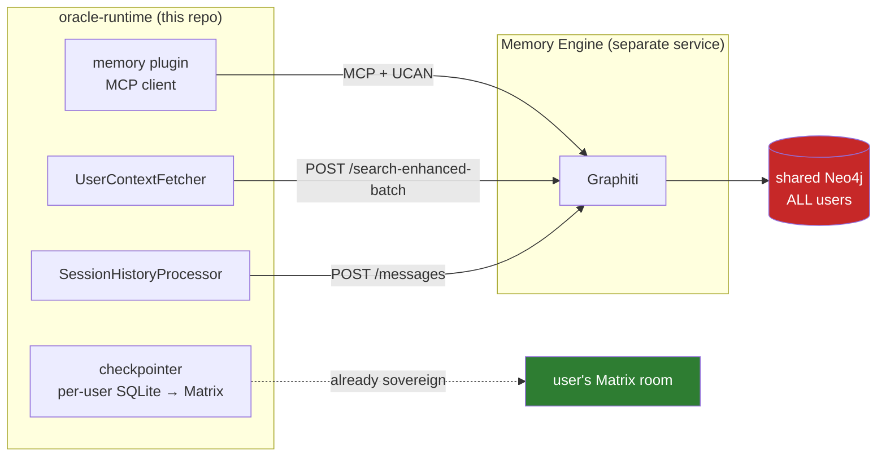
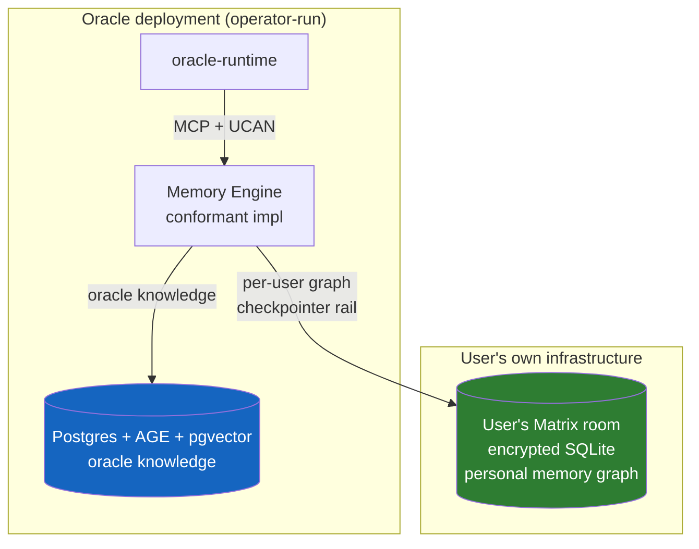

# Sovereign & Federated Memory — Architecture Recommendation

**Version:** 0.1 (proposal)
**Date:** 2026-07-25
**Status:** For review — no code changes proposed yet
**Scope:** The Memory Engine behind `MEMORY_MCP_URL` / `MEMORY_ENGINE_URL`. The `memory` plugin in this repo is a client and needs no changes.

---

## Table of Contents

1. [Executive summary](#1-executive-summary)
2. [What we actually have today](#2-what-we-actually-have-today)
3. [Problem statement — stated precisely](#3-problem-statement--stated-precisely)
4. [Design principles](#4-design-principles)
5. [Option analysis](#5-option-analysis)
6. [Recommended architecture](#6-recommended-architecture)
7. [Tier 2 storage design](#7-tier-2-storage-design)
8. [Where Cloudflare fits](#8-where-cloudflare-fits)
9. [Economics](#9-economics)
10. [Migration](#10-migration)
11. [Risks and open decisions](#11-risks-and-open-decisions)

---

## 1. Executive summary

**The seam is already in the right place.** The runtime talks to memory over MCP + REST with UCAN auth. Graphiti and Neo4j live entirely behind that boundary. Nothing in `packages/oracle-runtime/` imports a graph database, and the total contract is **six MCP tools and two REST endpoints**. This is a backend replacement, not a re-architecture.

**Recommendation — three tiers behind one frozen contract:**

| Tier  | What                                                                                               | Sovereignty                                         | When                                            |
| ----- | -------------------------------------------------------------------------------------------------- | --------------------------------------------------- | ----------------------------------------------- |
| **0** | Freeze the Memory Engine contract as a versioned `ixo:memory` spec + conformance suite             | Protocol-level federation — anyone can implement    | First. Unblocks everything else.                |
| **1** | Replace shared Neo4j with **Postgres + Apache AGE + pgvector**, one instance per oracle deployment | Self-hosted, Apache-2.0 top to bottom, no shared DB | Next. Kills the SPOF and the vendor dependency. |
| **2** | Per-user memory graph in **the user's own Matrix room**, riding the existing checkpointer rail     | The user holds their memory. Genuine sovereignty.   | The actual promise. Build on Tier 1.            |

**Do not adopt FalkorDB.** It is the best technical fit for multi-tenant graph density, but it is SSPLv1 — a license whose entire purpose is to constrain offering the software as a service, which is exactly what an oracle does. That relocates the vendor dependency rather than removing it.

**Keep Graphiti's data model, not necessarily Graphiti.** The bi-temporal model is sound and the ontology is a real asset. But Graphiti has deprecated the only embedded backend it supported (Kuzu, abandoned by its sponsor in October 2025), which leaves Neo4j, FalkorDB, or Neptune — all three wrong for us. Either write an Apache AGE driver for Graphiti or move to Cognee, which is backend-pluggable and Apache-2.0.

**The honest economic caveat up front:** the dominant memory cost is not the database. It is the LLM extraction call on every ingest batch. No storage architecture changes that. Section 9 addresses it separately, because a sovereignty win that quietly triples the LLM bill is not a win.

---

## 2. What we actually have today

Grounded in the code, not in assumptions.

### 2.1 The client side is already decoupled

`packages/oracle-runtime/src/plugins/memory/` is a thin MCP client. `MemoryPlugin.getRequestTools()` fetches the upstream tool list per request and passes tool names, descriptions, and schemas through **verbatim** (`memory-tools.ts` — this is deliberate; an earlier wrapper layer caused upstream schema rejections). No graph concepts leak into the runtime.

A repo-wide grep for `graphiti|neo4j` across `*.ts` returns exactly one source file: `modules/sessions/session-history-processor.service.ts`, and only in comments explaining why speaker labels must be real identities (Graphiti's extractor pins facts to the speaker entity, so `"user"`/`"assistant"` would pollute the graph).

### 2.2 The full contract

**MCP surface** (`MEMORY_MCP_URL`), six tools:

| Tool                   | Purpose                                                                                                                                   |
| ---------------------- | ----------------------------------------------------------------------------------------------------------------------------------------- |
| `search_memory_engine` | Hybrid search — 8 strategies, entity/edge type filters, bi-temporal date filters, optional `center_node_uuid` for graph-centred traversal |
| `add_memory`           | Write an episode                                                                                                                          |
| `add_oracle_knowledge` | Write to the oracle's shared knowledge space (`public` \| `private`)                                                                      |
| `delete_episode`       | Remove an episode                                                                                                                         |
| `delete_edge`          | Remove an edge                                                                                                                            |
| `clear`                | Wipe the memory space                                                                                                                     |

**REST surface** (`MEMORY_ENGINE_URL`), two endpoints:

| Endpoint                      | Caller                    | Purpose                                                                                                                                 |
| ----------------------------- | ------------------------- | --------------------------------------------------------------------------------------------------------------------------------------- |
| `POST /search-enhanced-batch` | `UserContextFetcher`      | Six parallel queries — identity, work, goals, interests, relationships, recent — assembled into `userContext` before the agent is built |
| `POST /messages`              | `SessionHistoryProcessor` | Conversation-history ingest for extraction                                                                                              |

**Auth:** UCAN invocation as Bearer, `X-Auth-Type: ucan`, `x-room-id`. The service DID is resolved via `did:web` through the Tier-0 UCAN service; the invocation claims ability `memory/*` against capability `ixo:memory` (`memory-ucan.ts`). A legacy Matrix-OpenID token path still exists in `@ixo/common`'s `MemoryEngineService`.

**Partitioning:** Graphiti `group_id` per `(user, oracle)` pair.

### 2.3 Two corpora, not one

The tool surface distinguishes `knowledge_level: 'user' | 'oracle' | 'both'`, and `add_oracle_knowledge` writes to a separate space. So there are two logically distinct stores sharing one database:

- **User memory** — per user, per oracle. Never queried across users.
- **Oracle knowledge** — shared across the users of _one_ oracle. Owned by that oracle's operator.

Neither is global. The shared Neo4j is serving two workloads that are both naturally partitioned, and it is partitioned along exactly the axis we would need to shard on. That is a gift for migration (§10).

### 2.4 The sovereign storage pattern already exists in this repo

`packages/oracle-runtime/src/matrix/checkpointer/user-matrix-sqlite-sync-service.service.ts` — 1,177 lines, in production — implements: **per-user SQLite database → gzip → upload as encrypted media to the user's own Matrix room → download on demand → local disk cache with checksum guards, corruption recovery, and an hourly cleanup cron.**

This is the hard part of per-user sovereign storage, already solved, already debugged. Memory can ride the same rail.



The red box is the whole problem. The green box is the pattern that fixes it.

---

## 3. Problem statement — stated precisely

The sovereignty and availability problems are real, but they are narrower than "the memory engine is wrong":

1. **Shared-database sovereignty.** Every user's memory graph lives in one Neo4j instance operated by one party. A user cannot hold, verify, export, or revoke their own memory. If IXO disappears, so does every user's memory. This contradicts the per-user encrypted Matrix storage promise the rest of the stack already keeps.

2. **Single point of failure.** One Neo4j outage degrades every oracle and every user simultaneously. `UserContextFetcher` already treats this as expected — it has a 30 s soft deadline, a 60 s hard timeout, and negative caching so a degraded engine costs one attempt per window rather than one per turn. Degrading gracefully is good engineering; needing to is the architectural smell.

3. **Vendor dependency.** Neo4j Community is GPLv3 and, critically, supports **one database per instance** — so per-tenant isolation on Community is not available. Multi-database is an Enterprise feature. The architecture therefore either accepts weak isolation or commits to a commercial license.

**What is _not_ broken, and should be preserved:**

- The MCP + REST + UCAN seam. It is a clean, authenticated, already-federatable boundary.
- The bi-temporal model (`valid_at`, `invalid_at`, `created_at`, `expired_at`). Facts that expire rather than vanish is the right model for memory.
- The ontology — ~45 entity types and ~50 edge types, including the IXO/Qi additions (`SmartAccount`, `OutcomeUnit`, `Claim`, `Evaluation`, `VerifiableCredential`, `TRIGGERS_PAYMENT`, …). This is domain-specific work worth keeping.
- Verbatim upstream tool passthrough.

---

## 4. Design principles

1. **Sovereignty means the user can walk away with it.** Not "we encrypt it", not "we promise not to look" — the user's memory must be retrievable and usable without our infrastructure.
2. **Federation is a protocol property, not a database feature.** Federate by specifying a contract that many parties implement, not by clustering a database across parties.
3. **Licenses are architecture.** SSPL and commercial-only isolation features are vendor dependencies wearing an open-source costume. Apache-2.0 / MIT / PostgreSQL-licensed only, all the way down.
4. **Match the engine to the workload.** Per-user graphs are small and never joined across users. A clustered graph server is the wrong shape _and_ the expensive shape.
5. **Reuse the rail we already built.** The checkpointer's Matrix sync is production-tested. A second bespoke sync mechanism would be a liability.
6. **Degrade, never block.** Memory is enrichment. Every path must already tolerate its absence — and does.

---

## 5. Option analysis

### 5.1 Graph storage

| Option                      | License          | Per-tenant isolation                   | Health                                                                   | Verdict                                                                            |
| --------------------------- | ---------------- | -------------------------------------- | ------------------------------------------------------------------------ | ---------------------------------------------------------------------------------- |
| **Neo4j Community**         | GPLv3            | ✗ one DB per instance                  | Healthy                                                                  | **No** — isolation requires Enterprise                                             |
| **Neo4j Enterprise**        | Commercial       | ✓                                      | Healthy                                                                  | **No** — the vendor dependency itself                                              |
| **FalkorDB**                | **SSPLv1**       | ✓✓ 10k+ graphs/instance, low footprint | Healthy, active                                                          | **No** — SSPL triggers on offering-as-a-service; best tech, disqualifying licence  |
| **Kuzu**                    | MIT              | ✓✓ embedded, one file per tenant       | **Archived Oct 2025**; sponsor acquired by Apple; Graphiti deprecated it | **No** as a primary bet — forks (Vela Engineering, Kineviz `bighorn`) are unproven |
| **Apache AGE + pgvector**   | **Apache-2.0**   | ✓ schema/database per tenant           | Active (releases through Apr 2026)                                       | **Yes — Tier 1**                                                                   |
| **SQLite + FTS5 + vectors** | Public domain    | ✓✓✓ one file per user                  | Bedrock                                                                  | **Yes — Tier 2**                                                                   |
| **Oxigraph / RDF**          | Apache-2.0 / MIT | ✓✓ embedded                            | Active                                                                   | Interesting — fits IXO's JSON-LD/VC world, but no Graphiti path. Park it.          |

The Kuzu outcome is the load-bearing fact here. Twelve months ago the obvious answer would have been "embedded Kuzu per user, Graphiti on top". Its sponsor was acquired, the repo was archived, and Graphiti now marks it deprecated in favour of Neo4j or FalkorDB. Betting the sovereignty story on a community fork of an abandoned database would be trading one dependency risk for a worse one.

### 5.2 Memory framework

| Option                | License         | Backend flexibility                                                        | Verdict                                                   |
| --------------------- | --------------- | -------------------------------------------------------------------------- | --------------------------------------------------------- |
| **Graphiti**          | Apache-2.0      | Neo4j, FalkorDB, Neptune. Kuzu deprecated. Has a `GraphDriver` abstraction | **Keep the model.** Write an AGE driver, or move on       |
| **Cognee**            | Apache-2.0      | Pluggable graph + vector + relational, self-host, MCP native               | **Strong alternative** if the AGE driver proves expensive |
| **Mem0**              | Apache-2.0 core | Graph tier is a **paid** ($249/mo) feature                                 | **No** — same trap, new logo                              |
| **Letta / Zep Cloud** | Hosted          | —                                                                          | **No**                                                    |

Both viable paths are Apache-2.0. The choice between "write a Graphiti AGE driver" and "port to Cognee" should be made by spiking the driver — Graphiti's driver interface is narrow, and we would keep the ontology and the bi-temporal semantics we have already tuned.

---

## 6. Recommended architecture

### Tier 0 — freeze the contract (do this first)

Publish the Memory Engine interface as a versioned specification: the six MCP tools with their schemas, the two REST endpoints, the UCAN `ixo:memory` capability and `memory/*` ability, the `x-room-id` scoping, and the `group_id` partitioning rule. Ship a **conformance test suite** that any implementation can run.

This costs almost nothing — it is documentation of a contract that already exists — and it is the single highest-leverage move, because:

- It makes the backend swappable by environment variable, which it very nearly already is.
- It lets a third party run their own Memory Engine and point their oracle at it. **That is the federation primitive** — protocol federation, not database federation.
- It converts every subsequent tier from "a migration" into "another conformant implementation".

### Tier 1 — self-hosted per-oracle (kills the SPOF)

One **Postgres + Apache AGE + pgvector** instance per oracle deployment, co-located with the oracle. Apache-2.0 throughout. AGE stores nodes and edges with openCypher; pgvector stores embeddings; Postgres FTS covers the keyword leg of hybrid search — all three in one engine, inside one transaction boundary.

- **No shared database.** An outage is scoped to one oracle.
- **No vendor.** Postgres runs on a laptop, a Hetzner box, a k8s cluster, Fly, or any managed provider. Nobody can withdraw it.
- **Isolation** via schema-per-user or database-per-user, available in the free edition — unlike Neo4j.

Oracle knowledge (§2.3) lands here permanently: it is per-operator shared state and does not belong in a user's private store.

### Tier 2 — per-user sovereign store (the promise)

The user's memory graph lives as a SQLite file in **the user's own Matrix room**, using the existing checkpointer rail (§2.4): gzipped, encrypted, room-scoped media, checksum-guarded, locally cached, corruption-recovering.



Properties this buys:

- The user's memory survives the oracle. Delete the deployment; the memory is still in their room.
- Users on their own homeserver were never in anyone else's database.
- "Forget me" becomes a room operation, not a support ticket against a shared cluster.
- Blast radius of any single compromise is one user.
- Matrix federation does the federation. We do not build a sync protocol.

---

## 7. Tier 2 storage design

**The bet:** a per-user memory graph is small — a heavy user reaches tens of thousands of nodes and edges, not millions — and is never joined against another user's. At that size you do not need a graph engine. You need indexed tables and a traversal function.

Roughly:

```sql
CREATE TABLE nodes (
  uuid TEXT PRIMARY KEY,
  labels TEXT NOT NULL,            -- JSON array; the ~45 EntityTypes
  name TEXT NOT NULL,
  summary TEXT,
  attributes TEXT,                 -- JSON
  created_at INTEGER NOT NULL,
  expired_at INTEGER               -- bi-temporal: transaction time
);

CREATE TABLE edges (
  uuid TEXT PRIMARY KEY,
  source_uuid TEXT NOT NULL REFERENCES nodes(uuid),
  target_uuid TEXT NOT NULL REFERENCES nodes(uuid),
  type TEXT NOT NULL,              -- the ~50 EdgeTypes
  fact TEXT,
  created_at INTEGER NOT NULL,
  expired_at INTEGER,              -- transaction time
  valid_at INTEGER,                -- valid time
  invalid_at INTEGER
);

CREATE INDEX idx_edges_source ON edges(source_uuid);
CREATE INDEX idx_edges_target ON edges(target_uuid);
CREATE INDEX idx_edges_temporal ON edges(valid_at, invalid_at);

CREATE VIRTUAL TABLE nodes_fts USING fts5(name, summary, content=nodes);
```

Mapping to the existing capabilities:

| Requirement                                                                               | Implementation                                                       |
| ----------------------------------------------------------------------------------------- | -------------------------------------------------------------------- |
| Bi-temporal filters (`valid_at`/`invalid_at`/`created_at`/`expired_at`, AND-of-OR groups) | Indexed integer columns; the filter groups compile to SQL predicates |
| Keyword leg of hybrid search                                                              | **FTS5** — built into SQLite, no extension                           |
| Vector leg                                                                                | See caveat below                                                     |
| Graph leg / `center_node_uuid` traversal                                                  | Recursive CTE, or a bounded BFS in application code                  |
| `node_labels` / `edge_types` filters                                                      | Indexed columns                                                      |
| Episodes, `delete_episode`, `clear`                                                       | Rows and a `DELETE`; `clear` is deleting the room media              |

**Vector search caveat — flagging this honestly:** `sqlite-vec` is the natural choice but is still **alpha** (0.1.10-alpha as of March 2026). Do not put an alpha extension on the critical path of a sovereignty guarantee. Mitigation: store embeddings as `BLOB` and brute-force cosine similarity in application code. At 10k vectors × 1536 dims that is a few milliseconds — genuinely fine at per-user scale — and it keeps the file dependency-free, which is itself a sovereignty property (the user's memory file opens with stock SQLite). Adopt `sqlite-vec` later as an optimisation behind the same interface, if and when it stabilises.

**Where extraction runs.** Entity/edge extraction is an LLM call and stays server-side in the Memory Engine — it needs a model, not the user's file. The engine pulls the user's SQLite from their room, applies the extraction result, and writes it back. Writes are already serialized per user by the checkpointer's locking, and Graphiti's `group_id` partitioning means no cross-user write ever contends.

---

## 8. Where Cloudflare fits

You raised Cloudflare containers specifically. My read:

**Durable Objects: yes, as one adapter.** One DO per user is an unusually good fit — per-user isolation is the DO's native model, storage is SQLite-backed, the cap is **10 GB per object** with **unlimited objects** per account, and the single-threaded actor model serializes writes for free, which is the genuinely hard part of per-user databases. A DO-backed Memory Engine would be a clean Tier-2 implementation for operators who want a hosted option.

**Containers: no, not per user.** Container pricing is **$0.0000025 per GiB-second of memory** and **$0.00002 per vCPU-second**, billed on provisioned resources. A 1 GiB container kept warm for a month is ~$6.50 in memory alone _per user_ — at 10,000 users that is ~$65,000/month before CPU. Containers scale to zero, but a memory store that cold-starts on every turn is not a memory store. Containers are the right tool for **one shared extraction worker per oracle** (a Python process running Graphiti/Cognee), not for per-tenant storage.

**The caveat that matters:** Cloudflare is a vendor. A Cloudflare-only design swaps a Neo4j dependency for a Cloudflare dependency and calls it sovereignty. This is precisely why Tier 0 comes first — with a frozen contract, Cloudflare DO becomes _one conformant implementation_ alongside Matrix-native and Postgres, chosen per deployment. The Matrix-native path (Tier 2) remains the sovereign default because it depends on infrastructure the user can own.

---

## 9. Economics

### Storage and compute

Current: a Neo4j instance sized for the union of all users, always on, scaling with total corpus, plus Enterprise licensing if per-tenant isolation is ever taken seriously.

Proposed: per-user marginal storage cost is a few MB in a Matrix room **that already exists** for that user — the checkpointer is already storing a SQLite file there. Compute is incurred only when a user is active. Tier 1's per-oracle Postgres is a small instance (~$7–25/month managed, or zero on an existing box).

The structural win: cost scales with _active_ users rather than _total_ corpus, and no component is sized for the sum of all tenants.

### The cost that actually dominates

**The database is not the memory bill. The extraction LLM calls are.** Every `POST /messages` batch runs an LLM pass to extract entities and edges. No storage architecture changes that, and I want to be explicit rather than let a sovereignty win quietly hide a cost regression.

Two things follow:

1. **Federation makes this worse before better.** Today one engine can batch and cache extraction across the fleet. Per-oracle engines lose that sharing. Budget for it.
2. **The lever is extraction policy, not storage.** Batch more aggressively, skip low-salience turns, and run extraction on a small local model — extraction is a structured-output task, which is where small models are strongest. This is worth its own investigation and is _independent_ of everything else in this document; it can start now.

A per-user architecture also unlocks a genuinely cheaper option: users on their own infrastructure can run their own extraction, at zero cost to the operator.

---

## 10. Migration

The current design partitions by `group_id` per `(user, oracle)` — exactly the axis we need to shard on. Migration is therefore an export-per-partition, not a data model rewrite:

1. **Tier 0.** Write the contract spec + conformance suite. Run it against the _existing_ engine to prove the spec is faithful before anything else moves.
2. **Tier 1.** Stand up Postgres + AGE + pgvector. Build the AGE driver (or the Cognee port). Run it in shadow mode against production traffic and diff search results — memory is fuzzy, so compare relevance, not equality.
3. **Cut over per oracle.** `MEMORY_MCP_URL` / `MEMORY_ENGINE_URL` are per-deployment env vars, so this is one deployment at a time with a trivial rollback.
4. **Tier 2.** Export each `group_id` to a per-user SQLite file, seed it into the user's Matrix room, and switch that user's reads over. The checkpointer rail already handles upload, checksums, and recovery.
5. **Decommission** the shared Neo4j once every oracle has moved.

Nothing in `packages/oracle-runtime/` changes in steps 1–3. Step 4 reuses an existing service. The `memory` plugin is untouched throughout — which is the payoff for the seam already being in the right place.

---

## 11. Risks and open decisions

**Risks**

| Risk                                                    | Assessment                                                                                                                                                                                                                      |
| ------------------------------------------------------- | ------------------------------------------------------------------------------------------------------------------------------------------------------------------------------------------------------------------------------- |
| Graphiti AGE driver is more work than estimated         | Spike it before committing. Cognee is the fallback and is Apache-2.0 with pluggable backends.                                                                                                                                   |
| Search quality regresses vs Neo4j's tuned hybrid search | Shadow-mode diffing in step 2 is the gate. Do not cut over on green tests alone — compare relevance.                                                                                                                            |
| Per-user files fragment cross-session insight           | Real. Anything genuinely cross-user belongs in oracle knowledge (Tier 1) by design. Verify no current query depends on cross-_user_ reads — the tool surface suggests none do, but confirm against the engine's implementation. |
| Extraction cost rises under federation                  | Named in §9. Treat extraction policy as a parallel workstream, not a follow-up.                                                                                                                                                 |
| `sqlite-vec` alpha                                      | Mitigated by brute-force cosine as the default; extension optional.                                                                                                                                                             |
| Matrix media as a database substrate                    | Already in production for checkpoints, including corruption recovery. This is the least novel part of the proposal.                                                                                                             |

**Open decisions — need your call**

1. **Graphiti + AGE driver, or port to Cognee?** Recommend: timebox a driver spike first; keeping the tuned ontology and bi-temporal semantics is worth real effort.
2. **Tier 2 default, or Tier 2 opt-in?** Sovereign-by-default is the stronger promise but makes every user's memory dependent on their homeserver's availability. Opt-in is safer; default is the actual position.
3. **Is oracle knowledge ever cross-oracle?** If two oracles must share a knowledge space, Tier 1's per-oracle Postgres needs a federation story of its own. Nothing in the current tool surface suggests they do.
4. **Do we ship a Cloudflare DO adapter?** Only worth building if operators are asking for a hosted option. It is a clean fit; it is also not required by the sovereignty goal.
5. **Legacy Matrix-OpenID auth path** in `@ixo/common`'s `MemoryEngineService` — retire it as part of this work, or leave it? The conformance suite should specify UCAN only.

---

## Appendix — sources

Project health and licensing were verified rather than recalled, since several changed materially in the last year:

- Kuzu archived by its sponsor, October 2025 — [The Register](https://www.theregister.com/2025/10/14/kuzudb_abandoned/), [BigGo](https://biggo.com/news/202510130126_KuzuDB-embedded-graph-database-archived); forks: [Vela Engineering](https://github.com/Vela-Engineering/kuzu)
- Graphiti backends, Kuzu deprecated — [Zep docs](https://help.getzep.com/graphiti/configuration/kuzu-db-configuration), [getzep/graphiti](https://github.com/getzep/graphiti)
- FalkorDB SSPLv1 + multi-tenancy — [FalkorDB licence docs](https://docs.falkordb.com/References/license.html), [FalkorDB design docs](https://docs.falkordb.com/design/)
- Neo4j Community GPLv3, single-database limit — [Neo4j open-core FAQ](https://neo4j.com/open-core-and-neo4j/), [neo4j/neo4j#12920](https://github.com/neo4j/neo4j/issues/12920)
- Apache AGE + pgvector, active 2026 — [apache/age](https://github.com/apache/age), [Microsoft Community Hub](https://techcommunity.microsoft.com/blog/adforpostgresql/combining-pgvector-and-apache-age---knowledge-graph--semantic-intelligence-in-a-/4508781)
- Cloudflare DO limits (10 GB/object, unlimited objects) — [Cloudflare docs](https://developers.cloudflare.com/durable-objects/platform/limits/)
- Cloudflare Containers pricing — [Containers changelog](https://developers.cloudflare.com/changelog/product/containers/), [new CPU pricing](https://developers.cloudflare.com/changelog/2025-11-21-new-cpu-pricing/)
- Memory framework licences (Cognee / Mem0 / Graphiti all Apache-2.0; Mem0 graph tier paid) — [Cognee comparison](https://www.cognee.ai/blog/guides/best-open-source-ai-memory-tools-for-llm-agents-and-developers), [Mem0 alternatives](https://atlan.com/know/mem0-alternatives/)
- sqlite-vec status — [alexgarcia.xyz/sqlite-vec](https://alexgarcia.xyz/sqlite-vec/)
