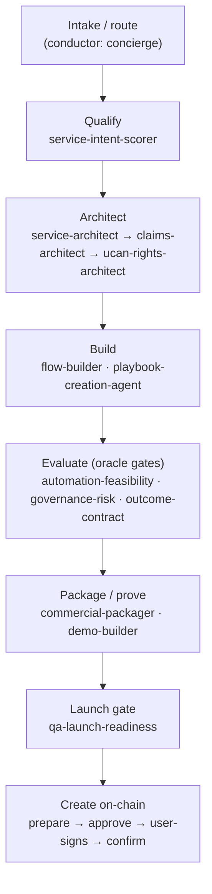
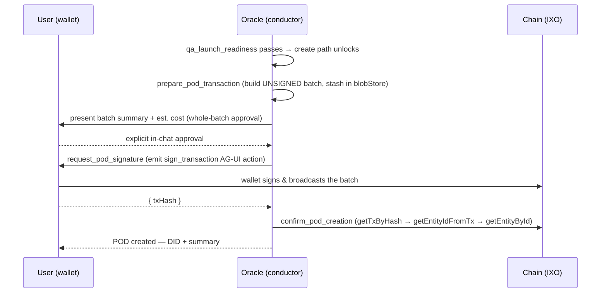

# QiForge POD‑Creator Plugin — Design & Implementation Plan

**Status:** Implemented — see `docs/architecture/pod-creator.md` for the as-built runtime doc
**Date:** 2026‑06‑12
**Stack:** NestJS · LangGraph/LangChain 1.x · Zod · `@ixo/oracles-chain-client` · Matrix · Vitest
**Skills source:** ai‑skills `design-pod-*` capsules — registry `capsules.skills.ixo.earth`
**Lands at:** `packages/oracle-runtime/src/plugins/pod-creator/`

---

## 1. Executive summary

A bundled `@ixo/oracle-runtime` plugin that runs the **full POD creation lifecycle** defined by the
ai‑skills `design-pod-*` orchestration: a **conductor** (the main agent, embodying the `concierge`
front‑door and the `orchestration` role) drives **12 specialist sub‑agents** to design a
Programmable Organisational Domain (POD), assembles a `service_pod_blueprint`, and — on explicit
human approval — **prepares an unsigned on‑chain transaction batch** that the **user's own wallet
signs and broadcasts**, after which the oracle confirms the created POD on‑chain.

A POD in IXO is a **Programmable Organisational Domain** — a sovereign cooperation space bundling
roles, workspaces, workflows, claims, and rights under a shared mandate. This plugin is the agentic
"forge" that designs one and brings it into existence on the IXO network.

The plugin is an Agentic Oracle that builds PODs — which themselves contain oracles. The recursion
is intentional.

## 2. Goals and non‑goals

**Goals**

- Execute the design‑pod lifecycle end‑to‑end: intake → qualify → architect → build → evaluate →
  package/prove → launch‑gate → **create on‑chain**.
- Realise each specialist design‑pod role as a first‑class `PluginSubAgent`, with the conductor
  orchestrating them in readiness order.
- Load each role's instructions from the **ai‑skills capsule registry at runtime** (not embedded).
- Produce a validated `service_pod_blueprint`, then a **user‑signed** on‑chain POD — the oracle never
  holds signing authority for creation.
- Reuse existing runtime capability (chain client, UCAN, AG‑UI handoff, Matrix persistence) rather
  than reinventing it.

**Non‑goals (v1)**

- The **operate / steward** phase (support states, escalation, case lifecycle from the
  _IXO Steward operational playbook_). Out of scope for v1; revisit as a follow‑up.
- Shipping a client‑side wallet/signer. The consuming app (Portal) provides that — see §10.
- A generic "create any entity" tool. Scope is POD creation specifically.

## 3. Decision record

Every design choice below was confirmed with the requester before this plan was written.

| #   | Decision                  | Choice                                                                                 | Rationale                                                                                     |
| --- | ------------------------- | -------------------------------------------------------------------------------------- | --------------------------------------------------------------------------------------------- |
| 1   | **Lifecycle scope**       | Design → **on‑chain create** (operate phase excluded)                                  | "Full POD creation lifecycle"; stop at a live POD, not ongoing stewardship                    |
| 2   | **Sub‑agent granularity** | **1:1** — 12 specialist sub‑agents; `concierge`+`orchestration` = main‑agent conductor | Fidelity to the specialised roles; conductor must call peers, so it lives at main‑agent level |
| 3   | **Creation authority**    | **Oracle prepares unsigned batch; user's wallet signs & broadcasts**                   | Most aligned with IXO self‑sovereignty; keeps the oracle out of the creation‑signing path     |
| 4   | **Approval gate**         | **Whole‑batch, in‑chat** approval before handoff                                       | One clear human checkpoint; the wallet signature is the cryptographic commit                  |
| 5   | **Skill source**          | **Registry‑loaded** from the capsules service at request time                          | Always current; accepted trade‑off: a registry outage stalls creation                         |
| 6   | **Sub‑agent gating**      | **Per‑stage** via async `getRequestSubAgents`                                          | Small toolset per step, enforced order, lower token cost                                      |

## 4. Mental model — a readiness‑gated pipeline

The conductor advances POD design stage by stage. Each stage is owned by one or more specialist
sub‑agents; a stage is "ready" when its blueprint section(s) exist and pass validation. The
`qa-launch-readiness` gate must pass before the create path unlocks.



Stage order follows the design‑pod `readiness-progression` dependency chain. The conductor derives
the current stage from which blueprint sections are complete — it does not hard‑code a linear march;
a specialist can be re‑invoked if a downstream gate rejects its section.

## 5. The conductor and the 12 specialist sub‑agents

**Conductor = the main agent.** Orchestration must call the specialist sub‑agent tools in sequence,
and sub‑agents are leaves (they cannot call peers), so the `orchestration` and `concierge` roles are
realised at the **main‑agent** level — through the plugin **manifest** (`whenToUse`, `examples`) plus
a set of **orchestration tools** (§7), not by rewriting the system prompt. A fork may additionally
frame its oracle via `OracleConfig.prompt` (`plugin-api/types.ts:165`).

**Specialists = 12 `PluginSubAgent`s**, each surfaced to the conductor as a `call_<role>` tool. The
runtime auto‑wraps a sub‑agent as a tool (`graph/subagent-as-tool.ts`); the conductor calls it,
records the returned blueprint section, and recomputes readiness.

| #   | Sub‑agent (`call_…`)            | Stage     | Produces (blueprint section)                   |
| --- | ------------------------------- | --------- | ---------------------------------------------- |
| 1   | `service_intent_scorer`         | Qualify   | Intent score / viability + fit                 |
| 2   | `service_architect`             | Architect | Service structure: roles, workspaces, services |
| 3   | `claims_architect`              | Architect | Claim schemas + UDID model                     |
| 4   | `ucan_rights_architect`         | Architect | Rights model: UCAN delegations, root docs      |
| 5   | `flow_builder`                  | Build     | Flow pages (the POD's executable workflow/UX)  |
| 6   | `playbook_creation_agent`       | Build     | Operating playbooks + rule cards               |
| 7   | `automation_feasibility_oracle` | Evaluate  | What can be automated vs. human‑in‑loop        |
| 8   | `governance_risk_oracle`        | Evaluate  | Governance + risk posture                      |
| 9   | `outcome_contract_oracle`       | Evaluate  | Outcome contract (what success pays for)       |
| 10  | `commercial_packager`           | Package   | Commercial offer + marketplace listing draft   |
| 11  | `demo_builder`                  | Package   | Runnable demo of the POD                       |
| 12  | `qa_launch_readiness_oracle`    | Gate      | Launch‑readiness verdict + blocker list        |

Each `PluginSubAgent` (`plugin-api/types.ts:402`) is configured:

- `name`: `call_<role>` — the tool name the conductor sees.
- `systemPrompt`: **the role's `SKILL.md`, fetched from the registry at request time** (§6).
- `tools`: a narrow, role‑specific set (mostly: read prior sections, emit this section, validate;
  a few need chain reads — e.g. `claims_architect` and `service_architect` may call `pod.read`‑style
  lookups via the `domain-indexer` soft‑dep).
- `model: 'subagent'` — materialised via `ctx.llm.get('subagent')`.
- `forwardTools`: surface the meaningful specialist tool‑calls into the main chat so the UI renders
  the design taking shape.

## 6. Skill/capsule loading (registry‑backed prompts)

The ai‑skills registry is the **capsules service** (`skills.plugin.ts:14`,
default `https://capsules.skills.ixo.earth`, overridable via `SKILLS_CAPSULES_BASE_URL`), UCAN‑authed
(`Authorization: Bearer <ixo:skills invocation>`, `X-IXO-Network` routing hint — `skills-tools.ts`).

The existing `skills` plugin does **discovery** (`list_skills` / `search_skills` → each capsule's
`cid` + metadata). Fetching a capsule's **`SKILL.md` content** goes through the capsule‑load path
(cid → sandbox `load_skill`), not the discovery tools.

**New shared piece: a `CapsuleContentClient`.** A small request‑time client that, given a design‑pod
role's capsule `cid`/name, resolves and returns its `SKILL.md` text. It reuses the skills plugin's
UCAN‑authed fetch pattern (`createDefaultSkillsUcanBuilder`, `buildRegistryHeaders`).

> **Open implementation detail (§12):** confirm whether capsule `SKILL.md` text is retrievable via a
> capsule content endpoint or only via the sandbox `load_skill` path. Either is workable; the client
> abstracts it.

**Composition with gating.** Because `getRequestSubAgents(rtCtx)` is **async**
(`oracle-plugin.ts:70`), one hook does both jobs: read the current stage from the blueprint, fetch
that stage's role capsule(s), and return only the relevant specialist sub‑agent(s) with the fetched
text as `systemPrompt`.

```ts
override async getRequestSubAgents(rt: RuntimeContext): Promise<PluginSubAgent[]> {
  const stage = deriveStage(rt);                  // from blueprint sections in the durable doc
  const roles = SPECIALISTS_FOR_STAGE[stage];     // per-stage gating
  return Promise.all(roles.map(async (role) => ({
    name: `call_${role.id}`,
    description: role.shortDescription,
    systemPrompt: await capsuleContent.get(role.capsule, rt), // registry-loaded + per-thread cache
    tools: role.tools,
    model: 'subagent',
    forwardTools: role.forwardTools,
  })));
}
```

Fetched skill text is **cached per thread** to avoid refetching every turn, with a clear failure
message and an optional cached‑last‑good fallback on registry outage.

## 7. Tools

**Orchestration tools (main agent / conductor):**

| Tool                       | Purpose                                                         |
| -------------------------- | --------------------------------------------------------------- |
| `start_pod_design`         | Open a POD design session; initialise the durable blueprint doc |
| `record_blueprint_section` | Persist a specialist's returned section into the blueprint      |
| `get_blueprint`            | Read the current blueprint (any stage)                          |
| `compute_readiness`        | Score readiness from completed sections; list blockers          |
| `assemble_blueprint`       | Produce the final `service_pod_blueprint` once the gate passes  |

**Create‑path tools (unlocked only after `qa_launch_readiness` passes):**

| Tool                      | Reuse vs. net‑new                          | Behaviour                                                                                                                                                                                                                                                      |
| ------------------------- | ------------------------------------------ | -------------------------------------------------------------------------------------------------------------------------------------------------------------------------------------------------------------------------------------------------------------- |
| `prepare_pod_transaction` | **net‑new builder** (reuses SDK msg types) | Compose the batch — `MsgCreateEntity` + claim‑collection creation + authz/UCAN grants — from the approved blueprint; encode to an **unsigned** `SignDoc`/`TxBody`; stash bytes in `ctx.blobStore`; return a human‑readable summary + estimated cost + `blobId` |
| `request_pod_signature`   | **reuses** AG‑UI handoff                   | Emit the `sign_transaction` AG‑UI action (`ctx.emit.actionCall`) referencing the `blobId`; block for the client's signed/broadcast result (the `callAgAction` / root‑event‑emitter wait pattern, `agui.plugin.ts`)                                             |
| `confirm_pod_creation`    | **reuses** chain reads                     | Poll `getTxByHash` → `getEntityIdFromTx` → `getEntityById` until the entity resolves; return the POD's DID + summary (`oracles-chain-client/.../entities/entity.ts`, `.../client.ts`)                                                                          |

**`ctx.blobStore`** (`plugin-api/types.ts:294`) holds the unsigned‑tx bytes so the LLM never echoes
raw transaction material — the tool returns a short `blobId`; the consuming tool resolves it
server‑side, scoped to the user DID.

## 8. The create path (sequence)



**Approval mechanics.** A **propose → approve → commit** tool sequence: the conductor presents the
batch, the user gives one explicit approval, and only then does `request_pod_signature` fire. No new
core LangGraph interrupt is required (the runtime has none today). The wallet signature is the final
cryptographic gate, so two layers protect every write.

## 9. State & persistence

**No new core graph state field.** `loadedPlugins` stays the only addition to graph state. The
evolving blueprint lives in a **durable per‑thread document** — the `editor` plugin's Y.Doc (soft‑dep)
or Matrix room state via `ctx.matrix.postToRoom` (`plugin-api/types.ts:317`). The conductor derives
stage and readiness by reading completed sections from that doc, keeping with the runtime's
"one state field" minimalism.

## 10. Config, env & integrations

**Reuses base env** (`config/base-env-schema.ts`): `NETWORK` (`mainnet|testnet|devnet`, default the
first rollout to testnet), `RPC_URL`, `BLOCKSYNC_GRAPHQL_URL`, `ORACLE_DID` / `SECP_MNEMONIC`
(oracle identity only — **not** used to sign creation), Matrix + UCAN vars.

**Plugin `configSchema`** (merged into the runtime Zod schema at boot):

- `SKILLS_CAPSULES_BASE_URL` — reused from the skills surface (registry endpoint).
- A marketplace endpoint for `commercial_packager`'s listing draft.
- Per‑stage feature toggles and a `mainnet` opt‑in safety flag.

**Dependencies:** `dependsOn: ['agui']` (the sign handoff carrier); `softDependsOn: ['editor',
'domain-indexer', 'memory']` (durable blueprint doc; on‑chain reads; recall of prior design intent).

**External dependency — Portal `sign_transaction` handler.** The create path's final step needs the
consuming app to register a `useAgAction('sign_transaction', …)` handler that signs with a real
wallet (Keplr/Leap) and broadcasts. The runtime/SDK ships **no** signer. Until the Portal implements
it, the path is exercised on testnet with a provided test signer.

## 11. Capability map — assumed verbs vs. runtime reality

From the design‑pod skills' assumed platform verbs, mapped to current runtime/package capability:

| Verb                                            | Status        | Notes                                                                                          |
| ----------------------------------------------- | ------------- | ---------------------------------------------------------------------------------------------- |
| `ucan.delegate` / `ucan.verify`                 | **Supported** | `modules/ucan` (`mintInvocation*`); verified in `AuthHeaderMiddleware`                         |
| `claim.evaluate`                                | **Supported** | `Claims`/`Payments` (`MsgEvaluateClaim`)                                                       |
| `claim.create` (submit to existing collection)  | **Partial**   | submit works; **collection creation is net‑new**                                               |
| `udid.issue` (entity create)                    | **Partial**   | `MsgCreateEntity` exists (`entities/entity.ts`); no high‑level builder — we add one (unsigned) |
| `flow.create` / `flow.update` / `flow.run_demo` | **Net‑new**   | orchestration exists; no on‑chain "Flow" entity abstraction                                    |
| `pod.read`                                      | **Net‑new**   | aggregate read over entity + collections + grants (Blocksync GraphQL primitives exist)         |
| `ucan.revoke`                                   | **Net‑new**   | only grant/delegate today                                                                      |
| `evidence.link` / `artifact.create`             | **Net‑new**   | sandbox artifacts are off‑chain today                                                          |
| `marketplace.draft_listing`                     | **Net‑new**   | listing draft for `commercial_packager`                                                        |
| `human_approval.request`                        | **Net‑new**   | realised by the propose→approve→commit gate (§8)                                               |

**Reusable on‑chain‑write skeleton:** the `credits` plugin
(`plugins/credits/claim-processing.service.ts`) is a proven `Client.signAndBroadcast` + LangGraph
`task`/retry pipeline — the create‑path tools model their structure on it (but for **prepare‑unsigned**,
not oracle‑signing).

## 12. Dependencies, risks & open items

1. **Capsule publishing** — _confirmed published._ The 14 design‑pod skills are live in
   `capsules.skills.ixo.earth`; registry‑loading works as designed.
2. **Capsule content‑fetch path** — confirm at build time whether `SKILL.md` text is served by a
   content endpoint or only via sandbox `load_skill`. The `CapsuleContentClient` abstracts it.
3. **Full skill text at build time** — to port each role's exact tools, handoff fields, and the
   `service_pod_blueprint` shape precisely, the build needs the `design-pod-orchestration` blueprint +
   `stage-routing` / `specialist-handoff` / `readiness-progression` references and
   `templates/orchestration-payloads.yaml`. Obtain via repo‑add (`ai-skills-private`) or paste.
4. **Portal wallet handler** — external (§10). Tracks the create path's end‑to‑end readiness.
5. **Net‑new chain message** — claim‑collection creation isn't in the chain client; add a message
   builder (unsigned).
6. **Registry availability** — registry‑loaded prompts mean an outage stalls creation; mitigated by
   per‑thread cache + cached‑last‑good fallback + a clear failure message.

## 13. Testing strategy

Adheres to repo rules: **no skip‑real‑services flags**; integration tests **throw on missing env**
(no silent `describe.skipIf`); **no type assertions** to satisfy the compiler; reuse standard tooling.

- **Unit (`createTestRuntime`, `testing/create-test-runtime.ts`):** per‑sub‑agent wiring; conductor
  stage progression + readiness gating; `getRequestSubAgents` returns only the current stage's
  specialists; the create tools with a **mocked chain client + AG‑UI action** — assert the unsigned
  batch shape, that the approval gate blocks an unapproved write, and that the confirm loop parses the
  entity DID.
- **Capsule loading:** `CapsuleContentClient` against a stubbed registry (UCAN header present;
  graceful public‑only degrade; cache hit on second call).
- **Integration (testnet, real services):** design → prepare → confirm with a test signer standing in
  for the Portal wallet handler.

## 14. Documentation

- **Public** (`build-an-oracle`): a bundled‑plugin catalogue page for `pod-creator` (what it does,
  env, the create‑path approval/signing UX, the Portal handler requirement).
- **Internal** (`docs/architecture`): the lifecycle state machine, the registry‑loaded sub‑agent
  pattern, and the prepare→approve→sign→confirm create path.
- **Plugin‑local:** a `POD-PLUGIN.md` walkthrough mirroring `apps/qiforge-example/WEATHER-PLUGIN.md`.

## 15. Implementation phases

Each phase is an independently verifiable slice with its own tests. Phases can be promoted to tracked
tasks in `specs/tasks/` if desired.

| Phase | Slice                           | Output                                                                                                                 |
| ----- | ------------------------------- | ---------------------------------------------------------------------------------------------------------------------- |
| P1    | **Skeleton + manifest**         | Plugin class, manifest, `configSchema`, registered in `BUNDLED_PLUGINS`; boots with no sub‑agents                      |
| P2    | **Capsule content client**      | UCAN‑authed `CapsuleContentClient` + per‑thread cache + tests                                                          |
| P3    | **Conductor + blueprint store** | Orchestration tools, durable blueprint doc, stage/readiness derivation                                                 |
| P4    | **Specialist sub‑agents**       | `getRequestSubAgents` per‑stage gating; 12 roles wired to registry prompts                                             |
| P5    | **Create path**                 | `prepare_pod_transaction` (unsigned builder + collection msg), `request_pod_signature` (AG‑UI), `confirm_pod_creation` |
| P6    | **Approval + safety**           | Propose→approve→commit gate; testnet default; mainnet opt‑in                                                           |
| P7    | **Docs + example wiring**       | Public/internal docs, `POD-PLUGIN.md`, optional example‑app wiring                                                     |

**Cadence (repo rule):** lift/reuse → check alignment with plugin contracts → if a reused piece
bypasses `ctx.llm`/`ctx.matrix`/`ctx.ucan`/`ctx.config`, **stop, surface it, propose the rewrite, get
sign‑off** before pressing on.

## 16. Out of scope (v1)

- The operate/steward phase (support states, escalation, case lifecycle).
- A bundled client‑side wallet/signer (Portal provides it).
- `ucan.revoke`, `evidence.link`, `artifact.create` beyond what POD creation strictly needs.
- Editing legacy `apps/app/`.

---

### Appendix A — Key runtime anchors

| What                                                                  | Path                                                                                     |
| --------------------------------------------------------------------- | ---------------------------------------------------------------------------------------- |
| `PluginSubAgent` / `PluginTool` / `PluginManifest` / `RuntimeContext` | `packages/oracle-runtime/src/plugin-api/types.ts` (`:402` / `:393` / `:104` / `:241`)    |
| `getSubAgents` / `getRequestSubAgents`                                | `packages/oracle-runtime/src/plugin-api/oracle-plugin.ts` (`:51` / `:70`)                |
| Skills registry client                                                | `packages/oracle-runtime/src/plugins/skills/` (`skills.plugin.ts:14`, `skills-tools.ts`) |
| AG‑UI action handoff                                                  | `packages/oracle-runtime/src/plugins/agui/`                                              |
| On‑chain write skeleton                                               | `packages/oracle-runtime/src/plugins/credits/claim-processing.service.ts`                |
| Entity create / confirm reads                                         | `packages/oracles-chain-client/src/client/entities/entity.ts`, `.../client.ts`           |
| Base env schema                                                       | `packages/oracle-runtime/src/config/base-env-schema.ts`                                  |
| Test harness                                                          | `packages/oracle-runtime/src/testing/create-test-runtime.ts`                             |
| Bundled plugin index                                                  | `packages/oracle-runtime/src/plugins/index.ts` (`BUNDLED_PLUGINS`)                       |
