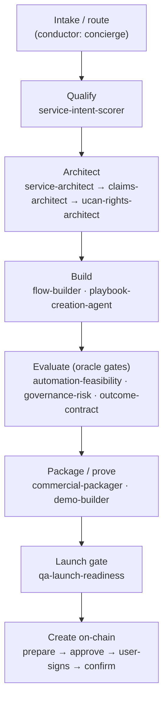
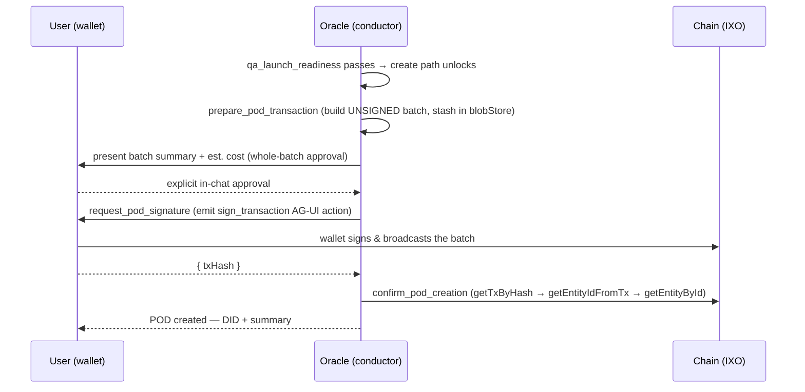

# QiForge POD‑Creator Plugin — Design & Implementation Plan

**Status:** Implemented on the Workers runtime — see `packages/oracle-runtime-workers/docs/pod-creator.md` for the as-built doc
**Date:** 2026‑06‑12 (design) · 2026‑10‑05 (ported to Workers)
**Stack:** Cloudflare Workers / Durable Objects · LangGraph/LangChain 1.x · Zod · Vitest (Node + workerd pools)
**Skills source:** ai‑skills `design-pod-*` capsules — registry `capsules.skills.ixo.earth`
**Lands at:** `packages/oracle-runtime-workers/src/plugins/pod-creator/`

> The design below was written for the Node runtime (pull request 210), which is
> deprecated. The Workers port keeps the behaviour; where the Workers model
> required a change, the section says so, and the as-built doc lists every
> difference.

---

## 1. Executive summary

A bundled `@ixo/oracle-runtime-workers` plugin that runs the **full POD creation lifecycle** defined by the
ai‑skills `design-pod-*` orchestration: a **conductor** (the main agent, embodying the `concierge`
front‑door and the `orchestration` role) drives **12 specialist sub‑agents** to design a
Programmable Organisational Domain (POD), assembles a `service_pod_blueprint`, and — on explicit
human approval — **prepares an unsigned on‑chain transaction batch** that the **user's own wallet
signs and broadcasts**, after which the oracle confirms the created POD on‑chain.

A POD in IXO is a **Programmable Organisational Domain** — a sovereign cooperation space bundling
roles, workspaces, workflows, claims, and rights under a shared mandate. This plugin is the agentic
"forge" that designs one and brings it into existence on the IXO network.

The plugin is an Agentic Oracle that builds PODs — which themselves contain oracles. The recursion
is intentional.

## 2. Goals and non‑goals

**Goals**

- Execute the design‑pod lifecycle end‑to‑end: intake → qualify → architect → build → evaluate →
  package/prove → launch‑gate → **create on‑chain**.
- Realise each specialist design‑pod role as a first‑class `PluginSubAgent`, with the conductor
  orchestrating them in readiness order.
- Load each role's instructions from the **ai‑skills capsule registry at runtime** (not embedded).
- Produce a validated `service_pod_blueprint`, then a **user‑signed** on‑chain POD — the oracle never
  holds signing authority for creation.
- Reuse existing runtime capability (chain client, UCAN, AG‑UI handoff, Matrix persistence) rather
  than reinventing it.

**Non‑goals (v1)**

- The **operate / steward** phase (support states, escalation, case lifecycle from the
  _IXO Steward operational playbook_). Out of scope for v1; revisit as a follow‑up.
- Shipping a client‑side wallet/signer. The consuming app (Portal) provides that — see §10.
- A generic "create any entity" tool. Scope is POD creation specifically.

## 3. Decision record

Every design choice below was confirmed with the requester before this plan was written.

| #   | Decision                  | Choice                                                                                 | Rationale                                                                                     |
| --- | ------------------------- | -------------------------------------------------------------------------------------- | --------------------------------------------------------------------------------------------- |
| 1   | **Lifecycle scope**       | Design → **on‑chain create** (operate phase excluded)                                  | "Full POD creation lifecycle"; stop at a live POD, not ongoing stewardship                    |
| 2   | **Sub‑agent granularity** | **1:1** — 12 specialist sub‑agents; `concierge`+`orchestration` = main‑agent conductor | Fidelity to the specialised roles; conductor must call peers, so it lives at main‑agent level |
| 3   | **Creation authority**    | **Oracle prepares unsigned batch; user's wallet signs & broadcasts**                   | Most aligned with IXO self‑sovereignty; keeps the oracle out of the creation‑signing path     |
| 4   | **Approval gate**         | **Whole‑batch, in‑chat** approval before handoff                                       | One clear human checkpoint; the wallet signature is the cryptographic commit                  |
| 5   | **Skill source**          | **Registry‑loaded** from the capsules service at request time                          | Always current; accepted trade‑off: a registry outage stalls creation                         |
| 6   | **Sub‑agent gating**      | **Per‑stage** via async `getRequestSubAgents`                                          | Small toolset per step, enforced order, lower token cost                                      |

## 4. Mental model — a readiness‑gated pipeline

The conductor advances POD design stage by stage. Each stage is owned by one or more specialist
sub‑agents; a stage is "ready" when its blueprint section(s) exist and pass validation. The
`qa-launch-readiness` gate must pass before the create path unlocks.


```mermaid
graph TD
  Intake["Intake / route<br/>(conductor: concierge)"] --> Qualify["Qualify<br/>service-intent-scorer"]
  Qualify --> Architect["Architect<br/>service-architect → claims-architect → ucan-rights-architect"]
  Architect --> Build["Build<br/>flow-builder · playbook-creation-agent"]
  Build --> Evaluate["Evaluate (oracle gates)<br/>automation-feasibility · governance-risk · outcome-contract"]
  Evaluate --> Package["Package / prove<br/>commercial-packager · demo-builder"]
  Package --> Gate["Launch gate<br/>qa-launch-readiness"]
  Gate --> Create["Create on-chain<br/>prepare → approve → user-signs → confirm"]
```

Stage order follows the design‑pod `readiness-progression` dependency chain. The conductor derives
the current stage from which blueprint sections are complete — it does not hard‑code a linear march;
a specialist can be re‑invoked if a downstream gate rejects its section.

## 5. The conductor and the 12 specialist sub‑agents

**Conductor = the main agent.** Orchestration must call the specialist sub‑agent tools in sequence,
and sub‑agents are leaves (they cannot call peers), so the `orchestration` and `concierge` roles are
realised at the **main‑agent** level — through the plugin **manifest** (`whenToUse`, `examples`) plus
a set of **orchestration tools** (§7), not by rewriting the system prompt. A fork may additionally
frame its oracle via `OracleConfig.prompt` (`plugin-api/types.ts:165`).

**Specialists = 12 `PluginSubAgent`s**, each surfaced to the conductor as a `call_<role>_agent`
tool. The runtime auto‑wraps a sub‑agent as a tool (`src/core/subagent-as-tool.ts`); the specialist
records its own section with `submit_section`, and the conductor recomputes readiness.

| #   | Sub‑agent (`call_…`)            | Stage     | Produces (blueprint section)                   |
| --- | ------------------------------- | --------- | ---------------------------------------------- |
| 1   | `service_intent_scorer`         | Qualify   | Intent score / viability + fit                 |
| 2   | `service_architect`             | Architect | Service structure: roles, workspaces, services |
| 3   | `claims_architect`              | Architect | Claim schemas + UDID model                     |
| 4   | `ucan_rights_architect`         | Architect | Rights model: UCAN delegations, root docs      |
| 5   | `flow_builder`                  | Build     | Flow pages (the POD's executable workflow/UX)  |
| 6   | `playbook_creation_agent`       | Build     | Operating playbooks + rule cards               |
| 7   | `automation_feasibility_oracle` | Evaluate  | What can be automated vs. human‑in‑loop        |
| 8   | `governance_risk_oracle`        | Evaluate  | Governance + risk posture                      |
| 9   | `outcome_contract_oracle`       | Evaluate  | Outcome contract (what success pays for)       |
| 10  | `commercial_packager`           | Package   | Commercial offer + marketplace listing draft   |
| 11  | `demo_builder`                  | Package   | Runnable demo of the POD                       |
| 12  | `qa_launch_readiness_oracle`    | Gate      | Launch‑readiness verdict + blocker list        |

Each `PluginSubAgent` (`src/plugin-api/types.ts`) is configured:

- `name`: the role id; the runtime exposes it as `call_<role>_agent`.
- `systemPrompt`: **the role's `SKILL.md`, fetched from the registry at request time** (§6).
- `tools`: a narrow set — `read_blueprint` (prior sections; full content on request) and
  `submit_section` (record this role's section, with a verdict for gate roles). Chain reads for
  `claims_architect` / `service_architect` via the `domain-indexer` soft‑dep remain a follow‑up.
- `model: 'subagent'` — materialised via `ctx.llm.get('subagent')`.
- `forwardTools`: surface the meaningful specialist tool‑calls into the main chat so the UI renders
  the design taking shape.

## 6. Skill/capsule loading (registry‑backed prompts)

The ai‑skills registry is the **capsules service** (`src/core/plugins/skills/skills.plugin.ts`,
default `https://capsules.skills.ixo.earth`, overridable via `SKILLS_CAPSULES_BASE_URL`), UCAN‑authed
(`Authorization: Bearer <ixo:skills invocation>` claiming `skills/*`, `X-IXO-Network` routing hint —
`skills-tools.ts`).

The existing `skills` plugin does **discovery** (`list_skills` / `search_skills` → each capsule's
`cid` + metadata). Fetching a capsule's **`SKILL.md` content** goes through the capsule‑load path
(cid → sandbox `load_skill`), not the discovery tools.

**New shared piece: a `CapsuleContentClient`.** A small request‑time client that, given a design‑pod
role's capsule `cid`/name, resolves and returns its `SKILL.md` text. It reuses the skills plugin's
UCAN‑authed fetch pattern (`createDefaultSkillsUcanBuilder`, `buildRegistryHeaders`).

> **Resolved (2026‑10‑05):** the registry serves `GET /skills/{name}/instructions` — the `SKILL.md`
> body (frontmatter stripped) of the latest **public mainnet** version. `createRegistryInstructionsFetcher()`
> wraps it (10 s deadline + the turn's abort signal, 64 KB body cap) and is opt‑in; the bundled
> default keeps the built‑in prompts. None of the twelve `design-pod-*` names is published there
> yet (all 404) — they are unclaimed, so whoever publishes under them would control the specialist
> prompts, gate roles included. The fetcher stays opt‑in until IXO owns the names.

**Composition with gating.** Because `getRequestSubAgents(rtCtx)` is **async**
(`src/plugin-api/oracle-plugin.ts`), one hook does both jobs: read the current stage from the blueprint, fetch
that stage's role capsule(s), and return only the relevant specialist sub‑agent(s) with the fetched
text as `systemPrompt`.

```ts
// sub-agents.ts (simplified): the store is resolved from the request context (ctx.kv)
const bp = await storeFor(rt).get(rt.session.id);
const stage = bp ? deriveStage(bp) : 'qualify'; // derived, never stored
const roles = DESIGN_POD_ROLES.filter((r) => r.stage === stage); // per-stage gating
return Promise.all(
  roles.map(async (role) => ({
    name: role.id, // exposed as call_<id>_agent
    description: role.description,
    systemPrompt: await resolvePrompt(role, rt, capsules), // registry text or built-in fallback
    tools: roleTools(role, storeFor), // read_blueprint + submit_section
    model: 'subagent',
    forwardTools: true,
  })),
);
```

Fetched skill text is **cached by capsule name** on the plugin instance (the endpoint serves public
content only, so the text is the same for every user). A fetch failure is remembered for 5 minutes and
logged once per capsule per window; the specialist runs on its built‑in prompt meanwhile. Without a
fetcher nothing is fetched, minted or logged. Because the hook runs on every turn of every user, it
returns no specialists at all until `start_pod_design` has opened a blueprint in the thread.

## 7. Tools

**Orchestration tools (main agent / conductor):**

| Tool                 | Purpose                                                         |
| -------------------- | --------------------------------------------------------------- |
| `start_pod_design`   | Open a POD design session; initialise the durable blueprint doc |
| `get_blueprint`      | Read the current blueprint (any stage)                          |
| `compute_readiness`  | Score readiness from completed sections; list blockers          |
| `assemble_blueprint` | Produce the final `service_pod_blueprint` once the gate passes  |

There is deliberately **no** `record_blueprint_section`: sections are written only by the
specialists' `submit_section`, so the conductor cannot self‑certify `pass` verdicts.

**Create‑path tools (unlocked only after `qa_launch_readiness` passes):**

| Tool                      | Reuse vs. net‑new                          | Behaviour                                                                                                                                                                                                                                                      |
| ------------------------- | ------------------------------------------ | -------------------------------------------------------------------------------------------------------------------------------------------------------------------------------------------------------------------------------------------------------------- |
| `prepare_pod_transaction` | **net‑new builder** (reuses SDK msg types) | Compose the batch — `MsgCreateEntity` + claim‑collection creation + authz/UCAN grants — from the approved blueprint; encode to an **unsigned** `SignDoc`/`TxBody`; stash bytes in `ctx.blobStore`; return a human‑readable summary + estimated cost + `blobId` |
| `request_pod_signature`   | **reuses** AG‑UI handoff                   | Send the `sign_transaction` AG‑UI action over the realtime channel (`ctx.frontend.callAgAction`, the agui plugin's bridge) with the unsigned bytes; block (120 s) for the client's signed/broadcast `{ txHash }`                                               |
| `confirm_pod_creation`    | **reuses** chain reads                     | Poll `getTxByHash` → `getEntityIdFromTx` → `getEntityById` until the entity resolves; return the POD's DID + summary (`oracles-chain-client/.../entities/entity.ts`, `.../client.ts`)                                                                          |

Two further create‑path tools implement the approval gate: `approve_pod_transaction` binds the user's
explicit go‑ahead to the exact prepared `blobId`, and `request_pod_signature` spends it. The chain
encoding sits behind an injected `ChainGateway`; the bundled default reports creation as unavailable.

**`ctx.blobStore`** (`src/plugin-api/types.ts`) holds the unsigned‑tx bytes so the LLM never echoes
raw transaction material — the tool returns a short `blobId`; the consuming tool resolves it
server‑side, scoped to the user DID.

## 8. The create path (sequence)


```mermaid
sequenceDiagram
  participant U as User (wallet)
  participant O as Oracle (conductor)
  participant C as Chain (IXO)
  O->>O: qa_launch_readiness passes → create path unlocks
  O->>O: prepare_pod_transaction (build UNSIGNED batch, stash in blobStore)
  O->>U: present batch summary + est. cost (whole-batch approval)
  U-->>O: explicit in-chat approval
  O->>U: request_pod_signature (emit sign_transaction AG-UI action)
  U->>C: wallet signs & broadcasts the batch
  U-->>O: { txHash }
  O->>C: confirm_pod_creation (getTxByHash → getEntityIdFromTx → getEntityById)
  O-->>U: POD created — DID + summary
```

**Approval mechanics.** A **propose → approve → commit** tool sequence: the conductor presents the
batch, the user approves, and only then does `request_pod_signature` fire. Approval is a tool the
model calls, so it is not proof of a human act; what the runtime enforces is that it happens in a
**later request** than the one that prepared the batch (the user had to send another message), that
it binds to the exact batch, and that it is spent by one signature request. `request_pod_signature`
re‑checks the launch gate first, and restarting the design clears any prepared batch. No new core
LangGraph interrupt is required (the runtime has none today). The real human gate is the user
reviewing and signing in their own wallet.

## 9. State & persistence

**No new core graph state field.** `loadedPlugins` stays the only addition to graph state. The
evolving blueprint is a **durable per‑thread document** in the user's own SQLite file, written through
the host's `ctx.kv` surface (namespaced JSON rows in `user_kv`, bounded by idle TTL + per‑namespace
LRU, atomic read‑modify‑write). It travels with the owner copy, so it survives the user's Durable
Object being evicted and restored. The create sessions (propose → approve state) live there too. The
conductor derives stage and readiness from the stored sections; neither is stored.

The Node implementation kept both stores in process memory on the plugin instance; on Workers that
memory is per isolate and does not survive eviction, which is why the runtime gained `ctx.kv`.

## 10. Config, env & integrations

**Reuses base env** (`src/core/env.ts`): `NETWORK` (`mainnet|testnet|devnet`; the Workers schema
defaults it to `mainnet`, so the mainnet opt‑in below is what keeps an unconfigured oracle from
preparing a mainnet batch), `ORACLE_DID` (oracle identity only — **not** used to sign creation), Matrix

- UCAN vars.

**Plugin `configSchema`** (folded into the env schema at boot): `POD_CREATOR_ALLOW_MAINNET`
(default `false`; `'true'` from a Worker var). `SKILLS_CAPSULES_BASE_URL` and `NETWORK` are read as
siblings, not redeclared. A marketplace endpoint and per‑stage toggles are not implemented.

**Dependencies:** `softDependsOn: ['agui', 'editor', 'domain-indexer', 'memory']`. The sign handoff
uses `ctx.frontend` directly, so `agui` is not a hard dependency.

**External dependency — Portal `sign_transaction` handler.** The create path's final step needs the
consuming app to register a `useAgAction('sign_transaction', …)` handler that signs with a real
wallet (Keplr/Leap) and broadcasts. The runtime/SDK ships **no** signer. Until the Portal implements
it, the path is exercised on testnet with a provided test signer.

## 11. Capability map — assumed verbs vs. runtime reality

From the design‑pod skills' assumed platform verbs, mapped to current runtime/package capability:

| Verb                                            | Status        | Notes                                                                                          |
| ----------------------------------------------- | ------------- | ---------------------------------------------------------------------------------------------- |
| `ucan.delegate` / `ucan.verify`                 | **Supported** | `ctx.ucan` (`mintInvocation*`); verified by the shell's UCAN auth (`src/shell/auth.ts`)        |
| `claim.evaluate`                                | **Supported** | `Claims`/`Payments` (`MsgEvaluateClaim`)                                                       |
| `claim.create` (submit to existing collection)  | **Partial**   | submit works; **collection creation is net‑new**                                               |
| `udid.issue` (entity create)                    | **Partial**   | `MsgCreateEntity` exists (`entities/entity.ts`); no high‑level builder — we add one (unsigned) |
| `flow.create` / `flow.update` / `flow.run_demo` | **Net‑new**   | orchestration exists; no on‑chain "Flow" entity abstraction                                    |
| `pod.read`                                      | **Net‑new**   | aggregate read over entity + collections + grants (Blocksync GraphQL primitives exist)         |
| `ucan.revoke`                                   | **Net‑new**   | only grant/delegate today                                                                      |
| `evidence.link` / `artifact.create`             | **Net‑new**   | sandbox artifacts are off‑chain today                                                          |
| `marketplace.draft_listing`                     | **Net‑new**   | listing draft for `commercial_packager`                                                        |
| `human_approval.request`                        | **Net‑new**   | realised by the propose→approve→commit gate (§8)                                               |

**Chain dependency:** the plugin carries none. The `ChainGateway` seam builds the unsigned batch; a
gateway that needs `@ixo/oracles-chain-client` or cosmjs should import it lazily inside its methods so
the published runtime bundle does not grow.

## 12. Dependencies, risks & open items

1. **Capsule publishing** — _confirmed published._ The 14 design‑pod skills are live in
   `capsules.skills.ixo.earth`; registry‑loading works as designed.
2. **Capsule content‑fetch path** — confirmed: `GET /skills/{name}/instructions` (public mainnet
   versions only). The `design-pod-*` capsules are not published there (404 for all twelve on
   2026‑10‑05), so §12.1 below no longer holds for the public endpoint.
3. **Full skill text at build time** — to port each role's exact tools, handoff fields, and the
   `service_pod_blueprint` shape precisely, the build needs the `design-pod-orchestration` blueprint +
   `stage-routing` / `specialist-handoff` / `readiness-progression` references and
   `templates/orchestration-payloads.yaml`. Obtain via repo‑add (`ai-skills-private`) or paste.
4. **Portal wallet handler** — external (§10). Tracks the create path's end‑to‑end readiness.
5. **Net‑new chain message** — claim‑collection creation isn't in the chain client; add a message
   builder (unsigned).
6. **Registry availability** — an outage or an unpublished capsule falls back to the built‑in prompt
   (failure remembered 5 minutes, logged once), so it degrades prompts rather than stalling creation.
7. **Registry name ownership** — the `design-pod-*` names are unclaimed today; see §6.

## 13. Testing strategy

Adheres to repo rules: **no skip‑real‑services flags**; integration tests **throw on missing env**
(no silent `describe.skipIf`); **no type assertions** to satisfy the compiler; reuse standard tooling.

- **Unit (`pnpm test:core`, plus `createRuntimeCore` for the boot check):** per‑sub‑agent wiring;
  conductor stage progression + readiness gating; `getRequestSubAgents` returns only the current
  stage's specialists; the create tools with a **mocked chain gateway + realtime AG‑UI bridge** —
  the approval gate blocks an unapproved write, approvals are single‑use, the oracle never signs.
- **workerd (`pnpm test`):** `ctx.kv` over real Durable Object SQLite, and the plugin driven through
  its own tools across an eviction and an owner‑copy round trip.
- **Capsule loading:** `CapsuleContentClient` against a stubbed registry (UCAN header present;
  graceful public‑only degrade; cache hit on second call).
- **Harness drill (`pnpm test:e2e:pod`, real model):** capability load → design → qualify specialist
  → blueprint after resets → launch gate refusing `prepare_pod_transaction`.
- **Integration (testnet, real services):** design → prepare → confirm with a test signer standing in
  for the Portal wallet handler — still open (needs a real `ChainGateway`).

## 14. Documentation

- **Public** (`build-an-oracle`): a bundled‑plugin catalogue page for `pod-creator` (what it does,
  env, the create‑path approval/signing UX, the Portal handler requirement).
- **Internal** (`packages/oracle-runtime-workers/docs/pod-creator.md`): the lifecycle state machine,
  the registry‑loaded sub‑agent pattern, the prepare→approve→sign→confirm create path, and the
  differences from the Node implementation.

## 15. Implementation phases

Each phase is an independently verifiable slice with its own tests. Phases can be promoted to tracked
tasks in `specs/tasks/` if desired.

| Phase | Slice                           | Output                                                                                                                 |
| ----- | ------------------------------- | ---------------------------------------------------------------------------------------------------------------------- |
| P1    | **Skeleton + manifest**         | Plugin class, manifest, `configSchema`, registered in `BUNDLED_WORKERS_PLUGINS`; boots with no sub‑agents              |
| P2    | **Capsule content client**      | UCAN‑authed `CapsuleContentClient` + per‑thread cache + tests                                                          |
| P3    | **Conductor + blueprint store** | Orchestration tools, durable blueprint doc, stage/readiness derivation                                                 |
| P4    | **Specialist sub‑agents**       | `getRequestSubAgents` per‑stage gating; 12 roles wired to registry prompts                                             |
| P5    | **Create path**                 | `prepare_pod_transaction` (unsigned builder + collection msg), `request_pod_signature` (AG‑UI), `confirm_pod_creation` |
| P6    | **Approval + safety**           | Propose→approve→commit gate; testnet default; mainnet opt‑in                                                           |
| P7    | **Docs + example wiring**       | Public/internal docs, `POD-PLUGIN.md`, optional example‑app wiring                                                     |

**Cadence (repo rule):** lift/reuse → check alignment with plugin contracts → if a reused piece
bypasses `ctx.llm`/`ctx.matrix`/`ctx.ucan`/`ctx.config`, **stop, surface it, propose the rewrite, get
sign‑off** before pressing on.

## 16. Out of scope (v1)

- The operate/steward phase (support states, escalation, case lifecycle).
- A bundled client‑side wallet/signer (Portal provides it).
- `ucan.revoke`, `evidence.link`, `artifact.create` beyond what POD creation strictly needs.
- Editing legacy `apps/app/`.

---

### Appendix A — Key runtime anchors

| What                                                                  | Path (`packages/oracle-runtime-workers/`)                          |
| --------------------------------------------------------------------- | ------------------------------------------------------------------ |
| The plugin                                                            | `src/plugins/pod-creator/`                                         |
| `PluginSubAgent` / `PluginTool` / `PluginManifest` / `RuntimeContext` | `src/plugin-api/types.ts`                                          |
| `getSubAgents` / `getRequestSubAgents`                                | `src/plugin-api/oracle-plugin.ts`                                  |
| `ctx.kv` (per-user durable rows)                                      | `src/sqlite/user-kv-store.ts`, `src/core/user-kv.ts`               |
| Skills registry client                                                | `src/core/plugins/skills/` (`skills.plugin.ts`, `skills-tools.ts`) |
| AG‑UI action handoff                                                  | `src/plugins/agui/`, `ctx.frontend` (`src/realtime/`)              |
| Entity create / confirm reads (for a future `ChainGateway`)           | `packages/oracles-chain-client/src/client/entities/entity.ts`      |
| Base env schema                                                       | `src/core/env.ts`                                                  |
| Runtime boot used by the plugin test                                  | `src/core/index.ts` (`createRuntimeCore`)                          |
| Bundled plugin index                                                  | `src/plugins/index.ts` (`BUNDLED_WORKERS_PLUGINS`)                 |
