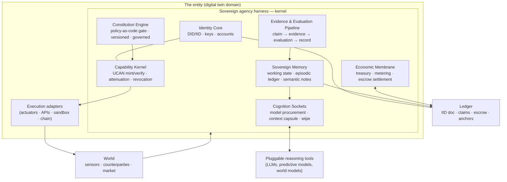
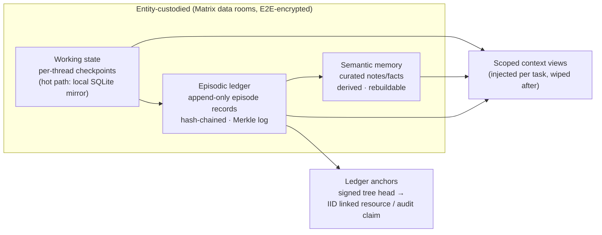
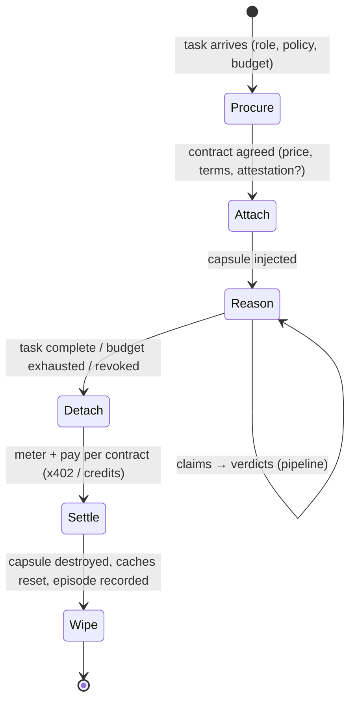
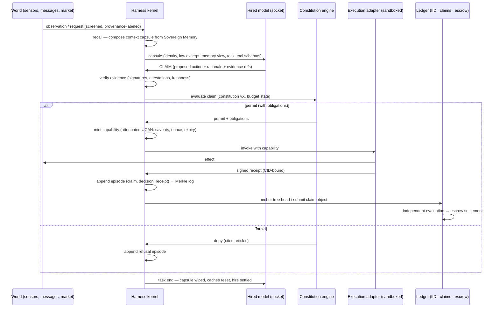
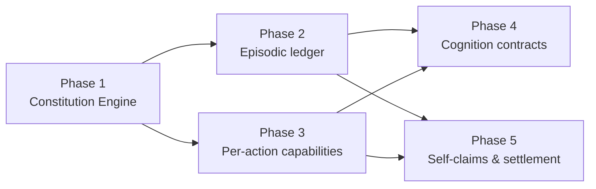

# The Sovereign Agency Harness — Research and Architecture

**Status:** Research spec — patterns established, architecture proposed, implementation phased
**Revision:** v1 — 2026-08-01
**Branch:** `claude/sovereign-agency-harness-09u8j6`
**Builds on:** `specs/ORA-219-plugin-based-runtime.md` (the plugin runtime this design extends)
**Stack context:** `@ixo/oracle-runtime` · IXO Impact Hub (IID / Entity / Claims modules) · Matrix · UCAN · LangGraph

---

## What this document is

A systematic study of how the industry's agent harnesses actually work — LangChain Deep Agents, qm, Claude Code / the Claude Agent SDK, the OpenAI Agents SDK, LangGraph, Letta (MemGPT), OpenHands, smolagents, MCP — followed by a first-principles derivation of the **Sovereign Agency Harness**: an architectural inversion in which the harness stops being extrinsic middleware owned by an app developer and becomes a **constitutive part of the entity itself**, with AI models reduced to pluggable, temporary reasoning tools the entity hires, uses, and discards.

Part I reports what the established harnesses teach. Part II derives the principles. Part III specifies the sovereign architecture. Part IV maps it onto QiForge and phases the work.

### Table of contents

- **Part I — The research**
  - [1. Method](#1-method)
  - [2. Deep Agents: depth is a property of the harness](#2-deep-agents-depth-is-a-property-of-the-harness)
  - [3. qm: the durable core and the transient hire](#3-qm-the-durable-core-and-the-transient-hire)
  - [4. The wider ecosystem](#4-the-wider-ecosystem)
  - [5. The common anatomy of a harness](#5-the-common-anatomy-of-a-harness)
  - [6. The ownership audit](#6-the-ownership-audit)
- **Part II — First principles**
  - [7. What a harness is](#7-what-a-harness-is)
  - [8. The five separations](#8-the-five-separations)
  - [9. Behavioral vs structural constraint](#9-behavioral-vs-structural-constraint)
  - [10. The relocation theorem](#10-the-relocation-theorem)
- **Part III — The Sovereign Agency Harness**
  - [11. Architecture overview](#11-architecture-overview)
  - [12. Identity Core](#12-identity-core)
  - [13. Sovereign Memory](#13-sovereign-memory)
  - [14. Constitution Engine](#14-constitution-engine)
  - [15. Capability Kernel](#15-capability-kernel)
  - [16. Cognition Sockets](#16-cognition-sockets)
  - [17. Evidence & Evaluation Pipeline](#17-evidence--evaluation-pipeline)
  - [18. Economic Membrane](#18-economic-membrane)
  - [19. The sovereign loop, end to end](#19-the-sovereign-loop-end-to-end)
  - [20. Design invariants](#20-design-invariants)
- **Part IV — Application to QiForge**
  - [21. What already exists](#21-what-already-exists)
  - [22. Gap analysis](#22-gap-analysis)
  - [23. Phased roadmap](#23-phased-roadmap)
  - [24. Open questions](#24-open-questions)
- [25. References](#25-references)

---

# Part I — The research

## 1. Method

Two named starting points — [Deep Agents](https://www.langchain.com/deep-agents) and [yc-software/qm](https://github.com/yc-software/qm) — were studied from primary sources: product pages, design blog posts, documentation, and source code (the full qm repository was cloned and read; Deep Agents' `graph.py`, middleware, and backend sources were read from the repo). The survey was then widened to the systems that define current harness practice: Claude Code and the Claude Agent SDK (plus Anthropic's engineering essays on context engineering, effective agents, and their multi-agent research system), the OpenAI Agents SDK, the LangGraph runtime, Letta/MemGPT (docs, blogs, and the MemGPT paper), OpenHands (docs and paper 2407.16741), Hugging Face smolagents, and the MCP 2025-06-18 specification.

In parallel, the sovereign-infrastructure primitives were studied the same way: the UCAN v1 spec and this repo's actual UCAN code, the object-capability literature, W3C DIDs/VCs, the IXO Impact Hub modules (`x/iid`, `x/entity`, `x/claims`), ERC-8004, x402, Google AP2, the agent-economy precedents (Olas, Fetch.ai, Virtuals), policy-as-code engines (OPA/Rego, Cedar), and tamper-evident log constructions (RFC 6962 transparency logs, Trillian/Rekor, C2PA).

Three questions were held against every system:

1. **What is the anatomy?** What components recur, and what problem does each solve?
2. **Who owns what?** Where do identity, memory, keys, and authority actually live?
3. **How swappable is the model?** Is the reasoning engine already treated as transient?

## 2. Deep Agents: depth is a property of the harness

LangChain's Deep Agents package is the distillation of an observation about Claude Code, Deep Research, and Manus: agents that succeed at long-horizon work run **the same tool-calling loop as everyone else**. What separates "deep" from "shallow" is not the loop and not the model — it is the harness around them. Deep Agents names four pillars:

1. **A detailed system prompt.** Long, few-shot, dense with tool-use policy. "Prompting matters still" — the prompt is treated as load-bearing infrastructure and composed explicitly (user instructions + harness defaults + per-provider profile text).
2. **A planning tool that does nothing.** `write_todos` is a no-op: it writes a todo list into state and has no other effect. Its entire function is attentional — the act of writing and re-reading the plan keeps the model on track across a long trajectory. A tool call can exist purely to shape the model's context.
3. **Sub-agents as context quarantine.** A child agent starts with _only_ a task description (no parent conversation), burns its own context window on the detail work, and returns a single distilled message. Parent state is copied _except_ messages and todos — the filesystem carries over as shared workspace; conversational context does not. The coordinator stays at orchestration altitude.
4. **A filesystem as universal memory.** One fixed seven-tool surface (`ls`, `read_file`, `write_file`, `edit_file`, `delete`, `glob`, `grep`) over pluggable **backends**: thread-scoped state, real disk, cross-thread stores, sandboxes — and a `CompositeBackend` that routes by path prefix (e.g. everything under `/memories/` goes to a durable store while the rest stays ephemeral). Scratch notes, long-term memory, offloaded tool results, archived conversation history, and skills all live behind the same interface.

The engineering around those pillars is a composable **middleware stack** (planning, filesystem, sub-agents, summarization at 85% of the model's window, tool-call repair, human-in-the-loop interrupts, prompt caching), each hook able to rewrite the model request, inject instructions, and contribute state fields. Models are provider-prefixed strings, swappable per sub-agent, with the harness adapting to the model (summarization thresholds derived from the model's context size; provider profiles adding caching or excluding tools) rather than the reverse.

**Ownership finding.** Everything durable is supplied by the app developer: the checkpointer, the store, the thread IDs, the namespace scoping, the API keys, the permission rules. The model owns nothing; the _harness_ owns nothing either — it orchestrates resources the application provides. Deep Agents is the cleanest specimen of the extrinsic pattern: "the agent" is harness + app configuration, and the LLM is a rented component inside it.

## 3. qm: the durable core and the transient hire

qm (built inside Y Combinator, open-sourced at `yc-software/qm`) is the most important precedent found, because it has already executed one half of the sovereign inversion — in production, for organizations. Its headline property: _"Pick your own harness and model and switch between them — Pi, OpenCode, Codex, and Claude Code all drive the same core, so a deployment isn't tied to any single vendor."_

qm's **headless core** owns every durable noun: identity and principals, the session transcript, memory, the credential keychain, command policy and security postures, the scheduler (crons/watches), the run queue, per-scope sandboxes and files, skills, audit. **Entire agent harnesses** — not just models — are reduced to adapters behind one interface:

```ts
// qm src/harness/harness.ts (abridged)
interface Harness {
  profile: HarnessAdapterProfile; // transports + capability set (abort, steer, images, ...)
  turns: { runTurn(input: HarnessTurnInput): Promise<HarnessTurnResult> };
  models: HarnessModelUtilities; // aux duties core MAY delegate: judge, compact, screen...
  tools: HarnessToolPresentation; // core tool names, per-harness presentation
}
```

`runTurn` receives everything from the core — the composed system prompt, the neutral history, the core-owned tool surface, and callbacks (`emit` to persist every event, audit hooks for every model call, security screening hooks, an approval gate). The harness supplies intelligence for one turn and keeps nothing.

Five mechanisms make the swap real, and all five matter for the sovereign design:

1. **The neutral log is the only truth; native transcripts are caches.** Every session is stored twice: a harness-independent `SessionEntry[]` event log (canonical), and a per-harness "tape" of native messages tagged with the harness id. On a harness switch, the tape is skipped (`foreign-harness`), `resetSession` is invoked on both adapters, and the new harness deterministically rebuilds its native context from the neutral log. Switching Pi ↔ Claude Code mid-session costs one cache rebuild and nothing else.
2. **The core composes the prompt; the hire receives it.** Personality ("souls"), memory, security posture, environment facts — all core-assembled, identical across harnesses. A harness never has standing instructions of its own.
3. **One tool surface, many presentations — and policy lives inside the tools.** Tool definitions and execution are core code; adapters merely re-transport them (in-process, MCP, JSON-RPC, plugin). qm deliberately **disables Claude Code's own permission machinery** (`bypassPermissions`) because command policy, approvals, ACLs, and audit are enforced inside the core-owned tool implementations — one locus of authority instead of stacked vendor gates. Its security doctrine is explicit: _"The agent and software it runs in a sandbox are not trusted to make authorization decisions."_
4. **Credentials are granted, materialized per turn, and audited — never held by the hire.** The keychain encrypts credentials at rest; owners grant them to scopes (`once`/`standing`, with purpose and revocation); the orchestrator materializes exactly the granted set into the sandbox environment per turn and logs every materialization.
5. **Scoped sovereignty with a floor that only tightens.** Every person and room is a scope with its own memory notebook, durable sandbox, keychain view, policy, crons, and apps. Org-level security posture and command policy compose _floor-first_: narrower scopes can raise strictness, never lower it. Background agency is honest about persistence: each cron fire is a fresh thread told exactly what persists ("your workspace disk and the stored task below"), with authorization re-checked per fire.

**Ownership finding.** qm proves the durable-entity/transient-hire split is buildable and operable today. But its durable core belongs to the _organization's deployment_ — identity is org identity, keys are org keys, Postgres is the operator's database. It inverts vendor lock-in, not custody. The sovereign harness must take qm's mechanics and relocate their ownership one more level — from the operator to the entity itself.

## 4. The wider ecosystem

Condensed findings per system (the load-bearing points only):

| System                      | Loop                                                                        | Memory/state                                                                                                                                                          | Authority                                                                                                                                                        | Model swappability                                      | Key ideas taken                                                                                                                                              |
| --------------------------- | --------------------------------------------------------------------------- | --------------------------------------------------------------------------------------------------------------------------------------------------------------------- | ---------------------------------------------------------------------------------------------------------------------------------------------------------------- | ------------------------------------------------------- | ------------------------------------------------------------------------------------------------------------------------------------------------------------ |
| **Claude Code / Agent SDK** | gather context → act → **verify** → repeat; evaluator-gated stop conditions | CLAUDE.md hierarchy (advisory) + agent-written auto memory + just-in-time agentic search; steerable compaction                                                        | Two-tier by doctrine: prompts advise, **hooks and managed settings enforce** ("regardless of what Claude decides"); optional classifier model as permission gate | Single-vendor by design; per-subagent model pinning     | "Give the agent a computer"; evidence over assertion; advisory/enforced split                                                                                |
| **OpenAI Agents SDK**       | runner loop: final output / handoff / tool call                             | Sessions (developer DB) **or platform-held** conversation state                                                                                                       | Guardrails as typed tripwires; tool-approval config                                                                                                              | Broad via LiteLLM, with documented capability asymmetry | Handoffs (control transfer); platform gravity pulls state to the vendor                                                                                      |
| **LangGraph**               | graph runtime, not a fixed loop; durable execution                          | Checkpointer (thread-scoped) vs Store (cross-thread) — a crisp split; time travel                                                                                     | Structural only — developer-authored nodes and interrupts                                                                                                        | Fully agnostic                                          | Durability as a dial (exit/async/sync); determinism contract; replay                                                                                         |
| **Letta / MemGPT**          | server-resident loop; heartbeats; interrupts                                | **The agent is the persistent entity**: memory blocks (in-context, self-edited via tools), recall, archival; sleep-time agent reorganizes memory off the request path | Capability-shaped: which tools and which writable blocks an agent has                                                                                            | Model-agnostic; different models per role               | "RAG is a tool for agent memory, not memory"; agent as unit of identity; `.af` file serializes an agent                                                      |
| **OpenHands**               | event stream; agent = `step(state) → action`                                | The append-only event stream is state, memory, trace, and audit in one                                                                                                | Boundary-based: per-session sandbox with an action-execution server                                                                                              | Pluggable                                               | Everything-is-an-event; action server behind a REST boundary                                                                                                 |
| **smolagents**              | the ReAct loop, small enough to print                                       | Memory = the step log, re-rendered per call                                                                                                                           | Interpreter restriction (whitelisted imports) or schema validation                                                                                               | Broadest surveyed                                       | Code-as-action; agency as a spectrum; radical legibility                                                                                                     |
| **MCP**                     | protocol, not loop: host ↔ clients ↔ servers                                | Conversation stays with the host                                                                                                                                      | **Consent named as the user's**; servers cannot see the conversation, each other, or the keys; sampling routes model access through the host                     | Agnostic by construction                                | Trust boundaries drawn in architecture; capability negotiation; authority inversion via sampling — but "MCP itself cannot enforce these security principles" |

## 5. The common anatomy of a harness

Across all systems the same organs recur. This is the invariant anatomy the sovereign harness must also possess — the inversion changes _ownership_, not physiology.

| #   | Organ                                        | Problem it solves                                                                           | Observed variations                                                                                                                                                              |
| --- | -------------------------------------------- | ------------------------------------------------------------------------------------------- | -------------------------------------------------------------------------------------------------------------------------------------------------------------------------------- |
| 1   | **Context assembler**                        | The model is stateless; something must decide, every call, which tokens represent the world | Layered instruction files (Claude Code); pinned structured blocks (Letta); log re-rendering (smolagents, OpenHands); developer projection (LangGraph); core-composed prompt (qm) |
| 2   | **Execution loop**                           | One completion is not an agent                                                              | while-loop; graph executor; event loop; server-resident loop with heartbeats; per-turn `runTurn` function (qm)                                                                   |
| 3   | **Tool mediator (agent-computer interface)** | Intent must become effect, correctly described                                              | JSON schemas; code-as-action; MCP; one core surface with per-harness presentations (qm); "the tool description is the real API"                                                  |
| 4   | **Durable state store**                      | Progress must outlive the process                                                           | Step-granular checkpoints (LangGraph); server DB where the agent is the object (Letta); event log (OpenHands); neutral log + native cache (qm)                                   |
| 5   | **Permission gate**                          | An autonomous actor wields someone's authority                                              | Per-action approval; allowlists; classifier gate; deterministic hooks; typed guardrails; policy-inside-tools (qm); container boundaries                                          |
| 6   | **Context reduction / recovery**             | Long-horizon work outgrows the window; "context rot" degrades before limits hit             | Threshold summarization; self-directed paging (MemGPT); sleep-time reorganization (Letta); offload-to-files (Deep Agents)                                                        |
| 7   | **Sub-agent spawner**                        | Breadth and depth can't share one window                                                    | Call-and-return with compressed summaries; handoffs; sub-agents-as-tools; delegation as recorded event                                                                           |
| 8   | **Long-term memory**                         | Learning must survive the session                                                           | Human-authored instruction memory; agent-authored notes; tiered self-edited hierarchies; cross-thread stores                                                                     |
| 9   | **Verification loop**                        | "Looks done" is not done                                                                    | Runnable checks; stop hooks; answer validators; fresh-context adversarial review                                                                                                 |
| 10  | **Observability / audit**                    | Nondeterministic loops fail nonreproducibly                                                 | Tracing; the event stream as the trace; cost accounting; mandatory model-call reporting (qm)                                                                                     |
| 11  | **Model abstraction**                        | The engine is replaceable but engines differ                                                | Provider strings; LiteLLM; role-scoped models; whole-harness adapters (qm); capability profiles                                                                                  |
| 12  | **Execution environment**                    | Effects need somewhere real yet contained                                                   | User machine + permissions; per-session containers; action servers; per-scope durable sandboxes (qm)                                                                             |

Two cross-cutting regularities:

- **The model is already transient everywhere.** Provider-prefixed strings, per-subagent overrides, per-turn model choice, LiteLLM adapters, whole-harness routing (qm). The industry has conceded model transience. Entity persistence is the unclaimed half.
- **Enforcement that works is always structural.** Every system that takes safety seriously ends at the same place: prompts advise, but the deterministic layer decides (Claude Code hooks and managed settings; qm policy-inside-tools; smolagents interpreter restriction; OpenHands container boundary; MCP host-mediated isolation).

## 6. The ownership audit

For every system: who owns the keys, the identity, the memory?

| System                  | Model keys                             | Agent identity                                                | Memory/state                            | Effective owner                                    |
| ----------------------- | -------------------------------------- | ------------------------------------------------------------- | --------------------------------------- | -------------------------------------------------- |
| Claude Code             | User's account (org can override)      | None — the operator's account is the principal                | User's disk, machine-local              | End user (because operator = user); org above them |
| Claude Agent SDK        | Developer                              | None                                                          | Developer's choice                      | Developer                                          |
| OpenAI Agents SDK       | Developer                              | None                                                          | Developer DB or OpenAI-hosted           | Developer, with platform gravity                   |
| Deep Agents / LangGraph | Developer                              | `thread_id` — an app-defined string                           | Developer-operated checkpointer + store | Developer, entirely                                |
| Letta                   | Server operator                        | **The agent** — persistent, addressable, serializable (`.af`) | Server DB, self-edited content          | Operator — but the agent is the unit of identity   |
| OpenHands               | Operator                               | None                                                          | Deployment-held event stream            | Operator                                           |
| smolagents              | Developer (literal `api_key=` in code) | None                                                          | In-process, gone at exit                | Developer, maximally                               |
| qm                      | Org deployment                         | Org principals; scopes                                        | Operator's Postgres; per-scope          | Organization/operator                              |
| MCP                     | Host application                       | None (the _user_ is the named consent authority)              | Host                                    | Host developer in practice; user in normative text |

**Verdict.** The extrinsic-middleware claim substantially holds: every surveyed harness is instantiated by developer code, runs on operator infrastructure, authenticates with operator credentials, and stores memory in operator-controlled stores. The entities agents act for appear only as row keys, message content, click-through consent, or normative language without protocol teeth. Nothing in any schema names the asset or principal as an _authority-bearing party_; no system represents delegated authority as an inspectable, scoped, revocable artifact that survives the session.

Two genuine cracks point at the answer:

- **Letta** shows the agent can be the durable, serializable unit of identity and the author of its own memory.
- **MCP** shows trust boundaries and consent can be drawn architecturally between the principal and the integrations.

No surveyed system combines them. **An agent that is a durable entity _and_ carries verifiable, principal-granted, scoped authority of its own does not yet exist in the mainstream ecosystem.** That is precisely the sovereign agency harness.

---

# Part II — First principles

## 7. What a harness is

Strip any agent system to its studs and two parts remain:

- **The model** — a stateless function: `f(context) → tokens`. It holds nothing between calls: no memory, no identity, no authority, no bank account. Everything it appears to "know" or "be able to do" during a turn was injected into its context or wired around its output by something else. This is not a design choice; it is the physics of stateless inference.
- **The harness** — everything else. The loop that calls the model; the assembler that decides what enters the window; the store that survives the call; the mediator that turns emitted intentions into effects; the credentials that make effects land; the policy that bounds them; the recovery that survives failure.

**Corollary: an agent's continuity, authority, and accountability live entirely in the harness.** The model contributes reasoning per call and nothing else. Ask "who is the agent?" and the answer is never the model — it is whoever owns the harness. Today that is an app developer or a platform. The sovereign inversion is a change of owner, not a change of physics:

> **Asset identity ≠ model version.** The harness is the enduring subject; the model is a component of its currently-active cognition, replaced without ceremony — the way a company hires a new management team without changing what the company is.

## 8. The five separations

The sovereign harness is defined by five separations. Each collapses in today's extrinsic harnesses; each has at least one proven precedent for the sovereign form.

| #   | Separation                             | Extrinsic collapse                                                                                                    | Sovereign form                                                                                                                                              | Proven precedent                                                                                                                                       |
| --- | -------------------------------------- | --------------------------------------------------------------------------------------------------------------------- | ----------------------------------------------------------------------------------------------------------------------------------------------------------- | ------------------------------------------------------------------------------------------------------------------------------------------------------ |
| 1   | **Identity ≠ model**                   | "The agent" is a deployment behind an operator's API key; retire the deployment and the agent is gone                 | The entity's DID persists across every model, harness, operator, and hosting change                                                                         | DIDs persist across key _and controller_ rotation; qm sessions survive whole-harness swaps; Letta agents outlive model choices                         |
| 2   | **Memory ≠ context window**            | History lives in a vendor DB keyed by the operator's account; context is assembled by code the entity doesn't control | Episodic memory is entity-custodied, tamper-evident, ledger-anchored; each model gets a scoped, revocable _view_                                            | qm's neutral log vs native tape; Letta's self-edited blocks; the Matrix checkpointer already in this repo                                              |
| 3   | **Authority ≠ ability to emit tokens** | The model's tool call inherits the harness's ambient credentials — the god-key problem                                | Authority exists only as explicit, attenuated, time-boxed capability tokens minted per task; the model holds no keys, ever                                  | UCAN attenuation-only chains; qm's per-turn keychain materialization; MCP sampling                                                                     |
| 4   | **Claim ≠ fact**                       | Model output is treated as decision; the model is its own evaluator, so errors cascade unchecked                      | Model output is a _claim_; evidence verification and constitutional evaluation stand between claim and effect; generation and evaluation are separate roles | IXO claims module (submit → evaluate → dispute → adjudicate); Claude Code's fresh-context adversarial review; qm screening before the model sees input |
| 5   | **Value ≠ operator billing**           | The operator pays the API bill; economics are invisible to "the agent"                                                | The entity meters its own cognition spend from its own treasury and is paid via escrowed settlement on independently verified outcomes                      | IXO entity accounts + claims escrow; x402 per-call payments with no standing credentials; AP2 mandate envelopes                                        |

## 9. Behavioral vs structural constraint

A recurring finding, stated once and used everywhere: **there are two ways to constrain an agent, and only one of them is load-bearing.**

- **Behavioral constraint** shapes what the model _proposes_: system prompts, Constitutional AI, RLHF/RLAIF, fine-tuning. Valuable — it improves the proposal distribution and generalizes to unforeseen cases — but statistical. A trained disposition is a probability, not an invariant; jailbreaks and injection attacks operate entirely within this layer. It is also the _wrong locus_ for an entity's commitments: a trained constitution is a property of the model checkpoint — global to every deployment, invisible, non-amendable by the entity, and it leaves when the model is swapped. You cannot cite a weight matrix in a dispute.
- **Structural constraint** bounds what any proposal can _do_: policy engines evaluated before execution, capability tokens that are the only path to effect, sandbox boundaries, deterministic hooks. Cedar's semantics are the canonical shape: **default deny; `forbid` overrides `permit`; errors fail closed** — and its use as the authorization gate for agent tool calls is already a shipping pattern (Amazon Bedrock AgentCore). qm states the doctrine plainly: the agent and its sandbox "are not trusted to make authorization decisions."

The object-capability tradition supplies the theory for the structural layer:

- **No ambient authority.** Nothing is actionable merely by being reachable; the model's context contains no keys, no admin sessions — only the harness holds references, and every effect requires presenting a specific capability the harness chose to mint. This is the structural answer to prompt injection: an attacker with full control of the model's output still only ever gets what the harness signs.
- **Least authority (POLA).** Grant per task, not per role: one proposal → one narrow, expiring token.
- **Attenuation.** From any capability, only weaker ones can be derived — enforced by the authorization algebra itself (UCAN chains are attenuation-only), independent of any bug in the model.
- **Revocable membranes.** Wrap all handles minted for an episode behind one membrane; end the episode (or trip an alarm) and everything dies at once.
- **The powerbox.** Rights only combine at one explicit, auditable join point. The harness _is_ the powerbox — the single place where root authority, the constitution, and a model's proposal meet, and a narrow token comes out.

Defense in depth uses both layers — an aligned model proposes better; a structural gate bounds worse — but they fail differently, and **the structural layer is the root of trust**.

## 10. The relocation theorem

The central synthesis of the research: **the extrinsic patterns are not discarded — they are relocated.** Every organ from §5 is correct mechanics of agency. The sovereign move is to change what each organ is _anchored to_: from the operator's app to the entity's own identity, storage, policy, and treasury.

| Extrinsic organ (owner: developer/operator) | Sovereign relocation (owner: the entity)                                                                                                     |
| ------------------------------------------- | -------------------------------------------------------------------------------------------------------------------------------------------- |
| Context assembler in app code               | Harness kernel composes the **context capsule** from the entity's memory, under the entity's disclosure policy                               |
| Execution loop in the app process           | The entity's resident kernel loop; cognition attaches per task                                                                               |
| Tool mediator with vendor permission UIs    | One entity-owned tool surface; policy enforced _inside_ the tools (qm), gated by the Constitution Engine                                     |
| Checkpointer/store in operator DB           | Working state + episodic ledger in the entity's own encrypted rooms, hash-chained and ledger-anchored                                        |
| Permission gate as session UI clicks        | Machine-readable constitution + capability tokens: inspectable, scoped, revocable artifacts that survive the session                         |
| Compaction/summarization defaults           | Entity-owned memory strategy; "sleep-time" reorganization as entity self-maintenance                                                         |
| Sub-agent spawner                           | Same mechanics; every child is bound by the same constitution and receives attenuated capabilities (tighten-only, like qm scope composition) |
| Long-term memory in vendor store            | Entity-custodied memory the _entity's_ processes edit; models receive scoped views, wiped after use                                          |
| Verification loop as developer tests        | Evidence requirements + independent evaluation as first-class protocol objects (claims module)                                               |
| Observability traces to vendor              | The episodic ledger _is_ the trace; every model call recorded to the entity's own audit log                                                  |
| Model abstraction (provider strings)        | **Cognition sockets with procurement**: models hired under contract (role, price cap, data terms), used, discarded                           |
| Sandbox owned by operator                   | Execution adapters holding entity-minted capabilities; sandbox is where effects happen, never where authority lives                          |

$$\text{Extrinsic: } \; \text{App} \supset \text{Harness} \supset \{\text{Model}, \text{Asset-as-data}\} \qquad \Longrightarrow \qquad \text{Sovereign: } \; \text{Entity} \supset \text{Harness} \supset \text{Model-as-hire}$$

---

# Part III — The Sovereign Agency Harness

## 11. Architecture overview

The harness has seven organs. Four are custodial (they _are_ the entity): Identity Core, Sovereign Memory, Constitution Engine, Economic Membrane. Three are operational (they let the entity act): Capability Kernel, Cognition Sockets, Evidence & Evaluation Pipeline.



The model sits **outside** the trust boundary. It is connected through exactly two channels: a context capsule in (composed by the harness from Sovereign Memory), and claims out (structured proposals into the pipeline). It never holds keys, never talks to actuators, never writes memory directly, and never evaluates its own claims.

## 12. Identity Core

**What it is.** The unforgeable referent everything else hangs off: the entity's DID/IID, its verification methods, its controllers, its on-chain accounts, and its service endpoints.

**Design (grounded in `x/iid` + `x/entity`):**

- The entity is an **IID document + entity NFT**. The IID document carries verification methods partitioned by the five W3C verification relationships — `authentication`, `assertionMethod`, `keyAgreement`, and critically **`capabilityInvocation`** / **`capabilityDelegation`**, the DID-native hooks for the Capability Kernel. Services point at the entity's data rooms and API endpoints; linked resources point at its constitution and memory anchors.
- **The entity owns its accounts** (`MsgCreateEntityAccount`); operators — including the host running the harness — act through **revocable authz grants** (`MsgGrantEntityAccountAuthz`). The operator is a grantee, never an owner. This is the exact inversion that Olas, Fetch.ai, and Virtuals all lack: those systems put the agent _on_ the ledger (registry entry, wallet, token) while keys and state stay with the operator or platform.
- **Identity survives everything.** Keys rotate (`MsgAddVerification`/`MsgRevokeVerification`), controllers change, the entity NFT can transfer the entire domain — identity, history, accounts — as one object. Deactivation preserves history. The sovereignty test: swap the model vendor, rotate every key, replace the operator — the entity's DID, accounts, memory commitments, and constitution all survive, because none of them were the model's, the vendor's, or the operator's to begin with.
- **Interop identities are bridges, not homes.** An ERC-8004 registration (identity/reputation/validation registries) whose registration file points at the entity's DID makes the entity discoverable to EVM-side counterparties, mirroring IXO-native evaluations outward. The DID remains canonical.

## 13. Sovereign Memory

**What it is.** The entity's remembered life, in three tiers, custodied in the entity's own encrypted Matrix data rooms — with the property that no operator, no compromised harness, and not even the entity itself can silently rewrite the past.



**Tier 1 — Working state.** Per-conversation/per-task graph state, checkpointed. This repo's pattern already: local SQLite as hot path, mirrored to the entity's Matrix rooms. The qm lesson applies verbatim: working state kept in a **harness-neutral schema** is what makes cognition swappable — any model- or harness-native transcript is a rebuildable cache, invalidated on swap, never the source of truth.

**Tier 2 — Episodic ledger.** The tamper-evident record of the entity's life. One episode per completed decision loop:

```
Episode {
  seq, prev_hash,                          // hash chain
  observation_refs,                        // what was perceived (room events, sensor CIDs, C2PA manifests)
  claim,                                   // what the model proposed (structured), + model id/contract ref
  evidence_refs,                           // what the claim cited; verification results
  decision { constitution_version_hash,    // what the entity decided, and under which law
             outcome: permit|deny, reasons, obligations },
  capability_cid?,                         // the token minted (if permitted)
  execution { invocation_cid, receipt_cid, // what actually happened (executor-signed receipt)
              outcome },
  settlement_ref?                          // economic consequence, if any
}
```

Episodes are leaves of a per-entity **Merkle log** (the RFC 6962 / Certificate Transparency construction: inclusion proofs show an episode is in the log; consistency proofs show the log only ever grew). Periodically — per epoch, per N episodes, or per high-stakes action — the harness **anchors** the signed tree head on-chain: as a linked resource on the entity's IID document (the identity document points at its own memory commitment), and/or as a claim into an audit collection (making the memory commitment itself evaluable and disputable). Plaintext never leaves the encrypted rooms; anchors and proofs reveal nothing about content, yet any authorized auditor can later demand inclusion and consistency proofs, and any rewrite of history is cryptographically visible against the anchors.

**Tier 3 — Semantic memory.** Curated, compact, provenance-tagged notes derived from episodes — the Letta lesson (memory as an owned artifact the agent's own processes edit with tools, not context residue) plus the qm lesson (small per-scope notebooks with explicit cross-context provenance tags). Maintained off the request path, sleep-time style: an entity-hired maintenance model periodically transforms raw episodes into learned context. Semantic memory is always rebuildable from the episodic ledger; only the ledger is sacred.

**Scoped views, injected and wiped.** Models never query memory directly. The harness composes a **context capsule** per task — identity summary, constitution excerpt relevant to the task, semantic memory selection, task-relevant episode extracts, tool schemas — under the entity's disclosure policy (per-counterparty, per-model-contract). When the task ends, the capsule is gone: nothing the model saw persists anywhere the model's vendor controls, and nothing the model _wrote_ persists except through the pipeline (§17). Context wipe is a contractual and architectural property of the socket (§16).

## 14. Constitution Engine

**What it is.** The machine-readable law of the entity: its purpose, absolute invariants, prohibited actions, spending limits, escalation rules. Enforced structurally, between claim and effect, on every proposed action — regardless of which model proposed it or how confident it was.

**Form.**

- A **versioned, content-addressed policy bundle** (policy-as-code: Cedar or OPA/Rego semantics — see §9), referenced as a linked resource from the entity's IID document. The constitution's hash is part of the entity's public identity; every decision records the version hash it was evaluated under.
- **Default deny. `forbid` overrides `permit`. Errors fail closed.** Inviolable clauses are `forbid` rules no permissive rule can override: _never exceed the thermal threshold; never transfer more than X per epoch; never act outside jurisdiction Y; never sign without evidence of Z._
- **Obligations, not just verdicts.** A permit can carry obligations: human-in-the-loop for defined classes (the AP2 cart-mandate move), extra evidence requirements, tighter caveats on the minted capability, mandatory disclosure in the episode record.
- **Amendment is governance, not configuration.** The constitution changes only by controller-signed update of the linked resource — through the entity's governance procedure, on the record. Operators cannot hot-edit the law. (Amendment procedure itself is a constitutional article: quorum, delay, scope limits on what may be amended.)
- **Layered, tighten-only.** Like qm's postures: a protocol/jurisdiction floor, then the entity's own articles, then per-task tightening. Narrower layers can only raise strictness.

**Evaluation.** Every claim (§17) is normalized into an authorization request — `principal` = this entity acting via model contract M in session S; `action` = the tool command; `resource` = the target URI (the same URI namespace as UCAN `with`); `context` = arguments, budget state, evidence-verification results, time — and evaluated deterministically. Same request + same constitution version ⇒ same decision, replayable in audit and disputes. Denials are episodes too: refusals are recorded with cited articles.

The contrast to model-level alignment is deliberate and permanent: the constitution is a property of the _entity_ — it persists when the model is swapped, is amendable only by the entity's governance, and produces evidence-grade decision records. Whatever alignment the hired model carries is welcome, and irrelevant to enforcement.

## 15. Capability Kernel

**What it is.** The powerbox: the only place authority enters or leaves the entity. Delegations flow in (from the entity's controllers, from counterparties, from users); attenuated invocations flow out (to execution adapters, per approved action). The model is never in this path.

**Design (grounded in the UCAN v1 spec + this repo's `@ixo/ucan`):**

- **Capability shape.** `{ can: 'domain/action', with: 'protocol:resource-uri' (wildcards), nb: typed caveats, derives(claimed, delegated) }` — the shape already implemented by `defineCapability` in `packages/ucan/src/capabilities/capability.ts`, where `derives` enforces resource coverage and caveat monotonicity (a claimed limit must not exceed the delegated limit).
- **Attenuation-only chains.** Every delegation restates or narrows its parent; the algebra forbids widening, independent of any bug in the model or the harness code that assembles requests.
- **Per-action minting.** One permitted claim → one invocation: expiry minutes away, unique nonce (replay protection — the invocation store pattern already in `modules/ucan`), caveats set to exactly the approved parameters (spend ceiling, resource path, count). Blast radius ≈ one action. The vague-to-precise translation is the kernel's job: _"manage this solar farm's energy trading"_ (standing delegation from the entity's controller) becomes, per approved claim, _"may execute `energy/contract.buy` on `ixo:entity/…/market/day-ahead` with `nb: { maxSpend: 500 USD, expires: 17:00Z }`."_
- **Episode membranes.** All capabilities minted for one task session derive from one episode-scoped delegation; revoking it kills every derivative at once, mid-flight if needed — the ocap membrane realized in tokens.
- **Receipts close the loop.** Executors sign receipts content-addressed to the invocation CID; receipts are the `execution` field of the episode record and the evidence input to settlement.
- **Both directions.** Inbound, the kernel validates counterparties' delegation chains (the oracle-runtime's auth module already splits this correctly: self-signed root invocation for authentication, TTL-clamped server-side; delegation chain for authorization). Outbound, the kernel is the only signer. Tool adapters verify capabilities **at the tool boundary** (the qm lesson: policy inside the tools, one locus of authority — vendor-side permission systems on hired harnesses are noise to be disabled, not defense to be stacked).

## 16. Cognition Sockets

**What it is.** The attachment point for transient reasoning — where the entity hires, uses, and discards models. The industry has already built most of this organ (it is the best-developed part of extrinsic harnesses); the sovereign additions are _procurement_, _contracts_, and _wipe_.

**The socket contract** (synthesis of qm's `Harness` adapter — proven across Pi/OpenCode/Codex/Claude Code — with the sovereign boundary):

```ts
interface CognitionDriver {
  profile: {
    id: string;                          // model or harness identity
    capabilities: ReadonlySet<'tools' | 'vision' | 'streaming' | 'thinking' | ...>;
    attestation?: AttestationRef;        // TEE quote for attested inference, if offered
  };
  /** One task-turn. Receives everything; keeps nothing. */
  runTurn(input: {
    capsule: ContextCapsule;             // harness-composed: identity, law, memory view, task
    tools: ToolSchema[];                 // schemas only — execution stays behind the kernel
    emitClaim(claim: Claim): Promise<Verdict>;  // the ONLY effect channel
    record(event: CognitionEvent): void;        // every model call audited to entity's log
    abort: AbortSignal;
  }): Promise<TurnResult>;
  /** Invalidate any native cache (swap, taint, policy change). */
  resetSession?(sessionId: string): Promise<void>;
}
```

Properties:

- **Model contracts.** A hire is a recorded agreement: role (main / evaluator / maintenance / vision), price ceiling, latency class, data-handling terms (may the capsule contain PII? may the provider retain logs? is attestation required?), and the settlement rail (metered credits, or x402 per-call payment — no standing credentials at the provider). The entity's model policy — which providers are approvable for which data classes and spend — is itself a constitutional article.
- **Procurement, not configuration.** Which model serves a task is the entity's decision under policy: by role, by price/performance from a catalog, by counterparty requirement, by attestation availability. The BYO-LLM pattern already in this repo (per-turn provider adapter swap, credentials materialized per turn, secrets never entering graph state) is the mechanism, generalized: today the _user_ brings a model; in the sovereign harness the _entity_ procures one.
- **Delegate functions, never authority** (qm). Auxiliary duties — summarize, judge, screen, title — are functions the harness invokes at its own discretion on hired cognition. The output returns to the harness; what happens next is never the model's call.
- **Context injection and wipe.** The capsule is composed per task and destroyed after; the driver contract requires statelessness, `resetSession` invalidates native caches, and the neutral working state (§13) means a mid-task model swap costs one cache rebuild. Sensitive tasks require attested inference (TEE) or local/open-weight models under the entity's own compute — a procurement decision under the constitution.
- **Sub-agents inherit the boundary.** A hired model may propose spawning helpers (context quarantine is good mechanics); every child socket is bound by the same constitution, receives an attenuated capability envelope (tighten-only), and reports into the same episodic ledger.



## 17. Evidence & Evaluation Pipeline

**What it is.** The separation of epistemic roles, made structural. A model's output is a **claim** — a proposal with cited evidence — never a decision. The pipeline between claim and effect:

1. **Claim generation** (hired model). Structured: proposed action, rationale, cited evidence refs. _"Inverter #3 requires shutdown due to degraded performance"_ — with the telemetry CIDs that support it.
2. **Evidence verification** (harness). Do the cited artifacts exist, verify, and support the claim class? Signatures on sensor telemetry; C2PA manifests on media; VC signatures on third-party attestations; freshness windows. No verifiable evidence ⇒ the claim is rejected as speculation before any policy question arises. (Inbound-content screening — the qm posture pattern — runs even earlier: untrusted external data is provenance-labeled and screened _before_ it reaches the model's capsule.)
3. **Constitutional evaluation** (§14). Deterministic verdict + obligations, recorded with the constitution version hash.
4. **Authorization & execution** (§15). Permit ⇒ mint the narrow capability ⇒ sandboxed adapter executes ⇒ executor-signed receipt.
5. **Recording** (§13). The full episode — claim, evidence, decision, execution, receipt — appends to the ledger; anchors follow.
6. **Independent evaluation & settlement** (§18). For actions with counterparties or payment, the episode becomes an on-chain **claim object** in a collection; an _independent_ evaluator (another oracle entity — never the generating model, and not this harness grading itself) evaluates; disputes and adjudication are first-class; settlement releases on approval.

This maps one-to-one onto the IXO claims module, which already implements the lifecycle as chain state: collections (with quotas, windows, and per-stage payment config), `MsgClaimIntent` → `MsgSubmitClaim` (committing the data hash of a VC whose plaintext stays in the entity's encrypted rooms) → `MsgEvaluateClaim` (approve/reject/dispute) → `MsgDisputeClaim` → `MsgAdjudicateDispute`, under granular authz constraints. The oracle stack in this repo already _plays the evaluator role for others' claims_; the sovereign harness closes the loop by making the entity's **own actions** claims of the same standing.

## 18. Economic Membrane

**What it is.** The entity's economic boundary: everything of value that crosses it is metered, authorized, and settled on its own account.

- **Treasury = entity accounts.** On-chain accounts owned by the entity (`MsgCreateEntityAccount`), operated under revocable grants. Spending limits per epoch/counterparty/action class are constitutional articles enforced at the gate and encoded as caveats on minted capabilities.
- **Cognition is an operating expense.** Every model call is metered against the hire's contract (the credits/TokenLimiter pattern in this repo, pointed at the entity's treasury instead of operator revenue). Providers are paid per call via x402 where possible — machine-native HTTP 402 payments with **no standing credentials to leak** — or by metered credits.
- **Income is escrowed settlement.** Work the entity performs for counterparties settles through the claims-module escrow: payment configs per lifecycle stage, funds released on independent evaluation — _conditional settlement on verified performance_, protocol-native.
- **Human-authorized envelopes.** Where a human principal authorizes classes of spend, the AP2 mandate pattern applies verbatim: a signed intent mandate (bounded envelope), per-transaction cart mandates for defined classes (the constitutional obligation hook), a non-repudiable audit trail — all VCs, which the stack already speaks.

## 19. The sovereign loop, end to end



## 20. Design invariants

The harness, in any implementation, MUST hold these. They are the spec's contract; everything else is engineering freedom.

1. **The model never holds keys, credentials, or standing authority.** No key material, wallet, or reusable token ever enters a model's context. (§9, §15)
2. **Every effect passes claim → evidence → constitution → capability → sandboxed execution.** No bypass path exists, including for "trivial" actions; triviality is a policy judgment, so it belongs to the policy engine. (§17)
3. **The constitution is default-deny, forbid-overrides-permit, fail-closed, versioned, and amendable only via governance.** Every decision records the version hash it was made under. (§14)
4. **Working state is harness-neutral; anything model- or vendor-native is a rebuildable cache**, invalidated on swap, taint, or policy change. (§13, §16)
5. **The episodic ledger is append-only and anchored.** Episodes are hash-chained into a Merkle log; tree heads anchor to the entity's on-chain identity; refusals are episodes too. (§13)
6. **Memory reaches models only as scoped, composed views, wiped after the task.** Models never query stores directly; nothing a model saw or wrote persists except through the pipeline. (§13, §16)
7. **Generation and evaluation are never the same principal.** The entity's own actions are claims evaluated by independent evaluators; the harness never grades itself for settlement purposes. (§17)
8. **All authority is attenuation-only and expiring.** Inbound and outbound alike; per-action tokens carry nonce, expiry, and caveats equal to exactly the approved parameters; episode membranes make revocation total. (§15)
9. **Every model call is metered, recorded, and paid from the entity's treasury under a recorded contract.** (§16, §18)
10. **Identity outlives everything.** Model swap, harness swap, key rotation, controller change, operator replacement, NFT transfer — the DID, accounts, constitution, and memory commitments survive them all. (§12)
11. **Delegated duties are functions, never authority.** Aux-model outputs return to the harness; what happens next is the harness's decision. (§16)
12. **Layers only tighten.** Jurisdiction floor → constitution → task scope → sub-agent envelope: each layer can raise strictness, never lower it. (§14, §16)

---

# Part IV — Application to QiForge

## 21. What already exists

QiForge + the IXO stack already possess more of the sovereign substrate than any surveyed system. The honest inventory:

| Sovereign organ                        | Exists today                                                                                                                                                                                                                                                                                           | Where                                                                                                                                    |
| -------------------------------------- | ------------------------------------------------------------------------------------------------------------------------------------------------------------------------------------------------------------------------------------------------------------------------------------------------------ | ---------------------------------------------------------------------------------------------------------------------------------------- |
| **Identity Core**                      | Oracle _is_ an on-chain entity: `ORACLE_DID` + `ORACLE_ENTITY_DID`; signing mnemonic and P-256 encryption key custodied in the oracle's **own Matrix account room**, loaded post-init — not in operator env, not in a vendor vault                                                                     | `packages/oracle-runtime/src/config/base-env-schema.ts`; `docs/architecture/matrix-and-checkpointer.md` (`wireSigningAndEncryptionKeys`) |
| **Capability Kernel (half)**           | UCAN as the _only_ auth mechanism: inbound delegation validation (authN root-invocation with server-side TTL clamp / authZ delegation chain split), downstream invocation minting, CID replay protection, DID resolution via the IID indexer; typed capability shape with `derives` attenuation checks | `packages/oracle-runtime/src/modules/ucan/`, `modules/auth/`; `packages/ucan/src/capabilities/capability.ts`                             |
| **Sovereign Memory (tier 1)**          | Per-user working state in SQLite mirrored to Matrix rooms (E2E-encryptable); JWE per-room secrets; harness-neutral LangGraph state schema                                                                                                                                                              | `packages/oracle-runtime/src/matrix/checkpointer/`; `modules/secrets/`                                                                   |
| **Cognition Sockets (proto)**          | Agent rebuilt per request; role-based model map; per-turn user model choice behind an allow-listed catalog with price tiers; **BYO-LLM swaps the entire provider adapter per turn, credentials materialized per turn from room secrets, secrets never enter graph state**; per-DID selective tracing   | `src/llm/`; `modules/byo-llm/`; `docs/architecture/model-selection.md`, `byo-llm.md`                                                     |
| **Evidence Pipeline (evaluator side)** | Full claims client: wrap claim body in a VC, sign with the oracle's DID key, store to the entity's Matrix data room → CID, submit data hash on-chain under authz grant; the claims module's evaluate/dispute/adjudicate lifecycle with escrowed per-stage payments                                     | `packages/oracles-chain-client/src/client/claims/`                                                                                       |
| **Structural-constraint precedents**   | Always-on middlewares (tool-validation, safety guardrail); flows plugin doctrine: _"the agent never executes, signs, or holds a key — it only writes flow documents"_; subscription/credits gates as enforcement middleware                                                                            | `src/graph/middlewares/`; `src/plugins/flows/flows.plugin.ts`                                                                            |
| **Economic Membrane (metering half)**  | Credits plugin TokenLimiter deducting real per-response cost; model price catalog                                                                                                                                                                                                                      | `src/plugins/credits/`                                                                                                                   |
| **Capability discovery**               | Manifest-driven plugin surface with visibility tiers and dynamic loading (`load_capability`, monotonic `loadedPlugins`) — progressive disclosure of the entity's own capability surface                                                                                                                | `src/meta-tools/`; `specs/ORA-219-plugin-based-runtime.md`                                                                               |

## 22. Gap analysis

What separates today's runtime from the sovereign harness, organ by organ:

1. **Orientation: user-centric → entity-centric.** The runtime is an oracle _service for users_ (per-user memory, per-user checkpoints, user UCANs inbound). The sovereign harness is the _entity's own agency_: the primary subject of memory, policy, and economics is the entity; users and counterparties are principals it interacts with. Both views coexist — the service surface stays; an entity-scoped spine is added beneath it.
2. **No Constitution Engine.** Guardrails today are behavioral (prompt middleware) plus scattered gates (credits, subscription). There is no machine-readable, versioned constitution; no default-deny policy evaluation between tool call and effect; no decision records with policy version hashes.
3. **Capabilities gate the door, not each action.** UCAN authenticates requests and authorizes service calls, but tool executions inside a turn run on ambient runtime authority. Per-claim minting with caveats-equal-to-approved-parameters, episode membranes, and receipt capture don't exist yet.
4. **Memory is state, not testimony.** Checkpoints persist conversations; nothing produces episode records (claim/decision/receipt), nothing hash-chains them, nothing anchors tree heads to the entity's IID document. Refusals leave no trace.
5. **Models are configured, not procured.** Role maps and BYO-LLM prove per-turn swappability, but there are no model contracts (price/data-terms/attestation), no entity-owned model policy, no per-hire settlement, no wipe guarantees.
6. **The oracle evaluates others; nobody evaluates the oracle.** The claims client submits and evaluates counterparty claims; the entity's own actions never become claims subject to independent evaluation and escrowed settlement.
7. **Economics are operator-shaped.** Credits meter _user_ spend for the operator; the entity has no treasury policy, no cognition-opex accounting, no escrowed income path of its own.

## 23. Phased roadmap

Each phase is independently shippable inside the existing plugin/module architecture (per ORA-219: new capability = bundled plugin or always-on module; state additions follow the `loadedPlugins` precedent of single, reducer-defined fields).



**Phase 1 — Constitution Engine (structural gate).**
An always-on middleware wrapping every tool execution (and a policy service behind it): normalize `(principal, action, resource, context)` → evaluate against a policy bundle → permit/deny/obligations. Constitution as a content-addressed document linked from the entity's IID doc; version hash on every decision; refusal events emitted. Start with Cedar-style semantics (default deny, forbid-overrides-permit, fail-closed) over the runtime's existing tool metadata. _Acceptance:_ no tool executes without a recorded decision; a forbid rule blocks a permitted-looking action regardless of model output; constitution updates require a controller-signed resource update.

**Phase 2 — Sovereign episodic ledger.**
Episode records (schema of §13) written per decision loop into an entity-scoped Matrix room; hash chain + Merkle log; periodic anchor of the signed tree head as an IID linked-resource update (option: additionally as a claim into an audit collection). Inclusion/consistency proof endpoints for auditors. _Acceptance:_ any episode is provable-included against an on-chain anchor; tampering with a stored episode is detectable; refusals appear as episodes.

**Phase 3 — Per-action capability minting.**
Extend `rtCtx.ucan` and the tool wrapper: a permitted claim mints a one-shot, caveated, expiring invocation; execution adapters verify at the boundary; executor receipts captured into the episode. Episode-scoped delegation as the revocation membrane. Sandbox/skills invocations move from per-session headers to per-action tokens. _Acceptance:_ a tool invoked outside a valid capability fails closed; replay fails; revoking the episode delegation kills in-flight authority; every effect has a receipt CID in its episode.

**Phase 4 — Cognition sockets and contracts.**
Formalize the `CognitionDriver` seam over the existing LLM adapter (the BYO-LLM per-turn adapter swap is the mechanism); add model contracts (role, price cap, data terms, attestation requirement) as entity policy; meter per-hire spend against the entity treasury; record every model call in the episode; implement capsule wipe + `resetSession` cache invalidation; optional attested-inference procurement for sensitive data classes. _Acceptance:_ mid-task model swap loses nothing but a native cache; a model exceeding its contract budget is detached; the ledger shows which model (and contract) proposed every claim.

**Phase 5 — Self-claims and conditional settlement.**
The entity's outcome-bearing actions become claim objects in collections it participates in; independent oracle entities evaluate; disputes flow through the module; escrowed payments release on approval; x402 rail for per-call cognition payments where providers support it. _Acceptance:_ an end-to-end run where the entity performs work, its claim is independently evaluated, and settlement releases from escrow — with the full episode chain anchoring the story.

**Non-goals (this spec).** Swapping the checkpointer implementation (the Matrix custody model is the point, not a limitation); replacing the plugin API (organs arrive as modules/middlewares/plugins per ORA-219); hot-swapping constitutions at runtime (amendment is governance, deliberately slow); multi-entity federation protocols (a later spec — this one makes a single entity sovereign first).

## 24. Open questions

1. **Policy language.** Cedar (typed, verified semantics, forbid-overrides-permit native) vs OPA/Rego (CNCF ecosystem, arbitrary JSON, richer data joins) vs a minimal in-house evaluator over Zod-typed requests for Phase 1 with a migration path. Leaning: start minimal with Cedar-shaped semantics; adopt an engine when policy volume justifies it.
2. **Anchor cadence and cost.** Per-episode anchoring is strongest and most expensive; per-epoch cheapest. Likely constitutional: anchor cadence per action class (high-stakes actions anchor synchronously before settlement).
3. **Evaluator market.** Who evaluates the entity's self-claims in early deployments — a designated peer oracle, a rotating panel, stake-weighted selection? The claims module supports all three; the choice is governance, but a default is needed.
4. **Attestation floor.** When is TEE-attested inference _required_ vs preferred? Proposal: constitutional data-classification articles (PII/financial ⇒ attested or entity-local models only).
5. **Human principals in the loop.** Where AP2-style mandates meet the constitution: which action classes always require a fresh human mandate regardless of standing delegations?
6. **Legacy coexistence.** How long do per-user service flows and entity-spine flows run side by side, and does the user-facing oracle surface eventually become "the entity's communication capability" rather than the runtime's primary frame?

---

## 25. References

**Named starting points**

- LangChain Deep Agents — product page, "Deep Agents" blog post, deepagents 0.2 release notes, docs (overview/subagents/backends/middleware/long-term memory/human-in-the-loop), and repo source (`graph.py`, middleware, `libs/ARCHITECTURE.md`). https://www.langchain.com/deep-agents · https://github.com/langchain-ai/deepagents
- qm — "a multiplayer agent harness for work"; full source studied: `src/harness/` (adapter contract, tape-fold, replay), `src/core/orchestrator.ts`, `src/credentials/keychain.ts`, `src/policy/`, `src/security/`, `src/cron/`, `src/memory/`, `AGENTS.md`, `SECURITY.md`. https://github.com/yc-software/qm

**Harness ecosystem**

- Anthropic engineering: _Claude Code best practices_; _Building agents with the Claude Agent SDK_; _Effective context engineering for AI agents_; _Building effective agents_; _How we built our multi-agent research system_. Claude Code docs (memory, best practices).
- OpenAI Agents SDK docs (running agents, models). LangGraph docs (persistence, durable execution).
- Letta/MemGPT: docs (MemGPT concepts, memory blocks), _Sleep-time compute_ and _Agent memory_ blog posts, MemGPT paper (arXiv:2310.08560), Agent File (`.af`).
- OpenHands: architecture docs and paper (arXiv:2407.16741). Hugging Face smolagents docs. Model Context Protocol spec 2025-06-18 (architecture, security principles).

**Sovereign primitives**

- UCAN v1 spec (delegation, invocation, revocation, receipts) — github.com/ucan-wg/spec; this repo's `packages/ucan` (capability shape, `derives`) and `oracle-runtime/src/modules/{ucan,auth}`.
- Object-capability model: no ambient authority, POLA, attenuation, revocable membranes (Miller, _Robust Composition_; ocap lineage KeyKOS→E→Cap'n Proto).
- W3C DID Core & Verifiable Credentials; IXO Impact Hub modules: `x/iid` (IIDs, verification relationships, linked resources), `x/entity` (entity NFTs, `MsgCreateEntityAccount`, `MsgGrantEntityAccountAuthz`, `MsgTransferEntity`), `x/claims` (collections, intents, submission, evaluation, disputes, adjudication, escrowed per-stage payments) — github.com/ixofoundation/ixo-blockchain; this repo's `packages/oracles-chain-client` claims client.
- ERC-8004 _Trustless Agents_ (identity/reputation/validation registries). x402 payment protocol. Google AP2 (intent/cart/payment mandates as VCs).
- Agent-economy precedents: Olas/Autonolas, Fetch.ai uAgents/Almanac, Virtuals Protocol — studied for the custody question (operator/platform-owned in all three).
- Policy-as-code: OPA/Rego; AWS Cedar (default deny, forbid-overrides-permit, Lean-verified semantics; Bedrock AgentCore precedent as an agent tool-call gate). Anthropic Constitutional AI as the behavioral contrast.
- Tamper-evident logs: RFC 6962 Certificate Transparency (Merkle inclusion/consistency proofs), Trillian, Sigstore Rekor; C2PA Content Credentials; NVIDIA confidential computing for attested inference.
