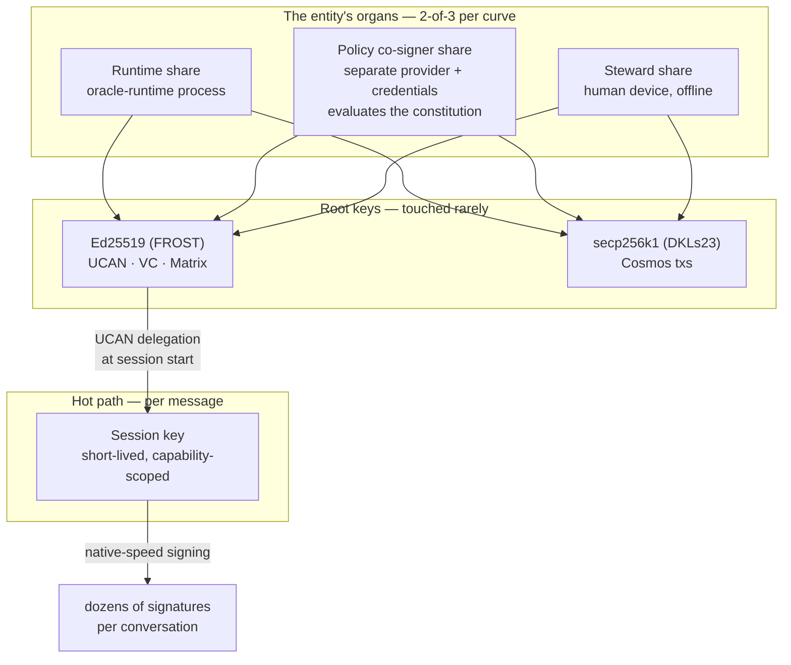
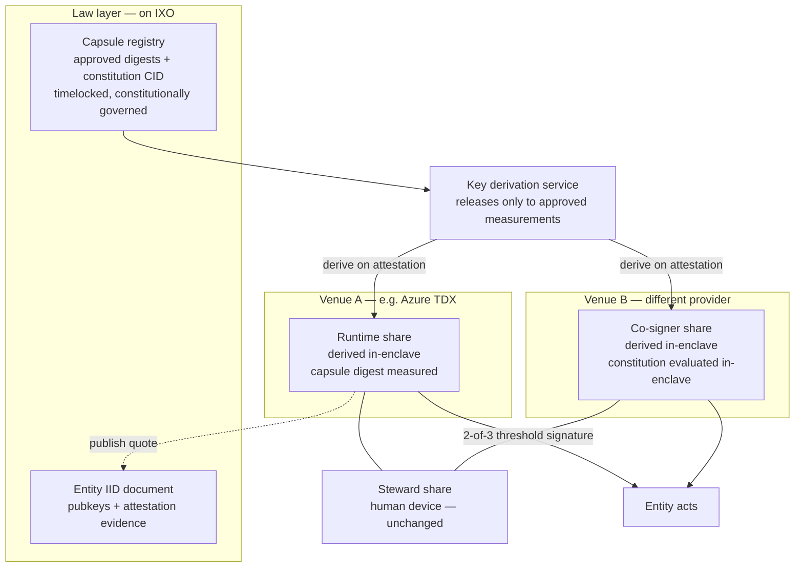

# Sovereign Key Custody — Research Spike

**Status:** Research spike — findings and a recommended direction, not an approved plan
**Revision:** v1.2 — 2026-08-03 (v1: findings and recommendation; v1.1 adds §8, the TEE upgrade for the roadmap; v1.2 adds §9, the x402 sense-check)
**Branch:** `claude/sovereign-agency-harness-09u8j6`
**Relates to:** `specs/sovereign-agency-harness.md` (§12 Identity Core, §15 Capability Kernel, Phase 3)

---

## The question

An entity is only as sovereign as its keys. `specs/sovereign-agency-harness.md` asserts that the entity's identity, authority and memory belong to it rather than to an operator — but an autonomous entity has no hands. Somebody's hardware executes every signature, and today that somebody is the operator.

This spike asks: **can a sovereign domain hold and use its own signing keys without an external party first delegating authority to it, and without depending on that party's continued goodwill?**

Scoping decisions taken during the spike:

| Question            | Decision                                                                                                                                                                                |
| ------------------- | --------------------------------------------------------------------------------------------------------------------------------------------------------------------------------------- |
| Trust envelope      | **Domain-governed only** — infrastructure the entity's own constitution governs, plus its own constitutional organs. Third-party signing networks excluded except as optional recovery. |
| Hosting             | **Commodity only this cycle** — must work on today's hosting with no TEE. TEE is the deferred hardening tier.                                                                           |
| Key surfaces        | **All three** — off-chain operational, on-chain root, encryption.                                                                                                                       |
| Chain evolution     | **In scope at module level** as roadmap items.                                                                                                                                          |
| Second trust domain | **Tiered by action class** — see [§5](#5-the-recommendation-tiered-quorum-by-action-class).                                                                                             |

---

## 1. The finding that shouldn't wait

Independent of any architecture decision, the current at-rest protection for the entity's keys is not sound. Verified directly in `packages/oracles-chain-client/src/matrix-bot/setup-claim-signing-mnemonics.ts:14-32`:

```ts
const iv = randomBytes(16);
const cipher = createCipheriv(
  'aes-256-cbc',
  Buffer.from(password.padEnd(32)),
  iv,
);
```

`password` is `MATRIX_VALUE_PIN`. It is space-padded to 32 bytes and used **directly as the AES-256 key**:

- **No KDF, no salt.** A short operator PIN becomes the key material verbatim. `"1234"` + 28 spaces is the AES key. Offline brute force against a captured ciphertext is trivial.
- **CBC without authentication.** Unauthenticated ciphertext is malleable; there is no integrity check on decryption.
- **Same routine protects both** the Ed25519 signing mnemonic (`encrypted_mnemonic_ed_signing`) and the P-256 secrets key.

So the "keys live in the entity's own encrypted Matrix room" custody story currently reduces to: _anyone holding the Matrix admin token and a low-entropy PIN recovers the entity's signing identity and its ability to read every user secret._

**Recommended immediately, independent of this spike:** a real KDF (Argon2id or scrypt, per-secret salt) and an AEAD (AES-256-GCM), with a migration that re-wraps existing material. This is a small, self-contained change and should not be bundled with the architecture work below.

---

## 2. The as-is custody map

Reported by code inspection across `oracle-runtime` and `oracles-chain-client`.

| Key / credential         | Type                                       | At rest                               | Unlocked by              | Live in                                 | Signs / unlocks                                                 |
| ------------------------ | ------------------------------------------ | ------------------------------------- | ------------------------ | --------------------------------------- | --------------------------------------------------------------- |
| Ed25519 signing mnemonic | Ed25519 (seed = `SHA256(mnemonic)[0..32]`) | Matrix state event, AES-CBC(PIN)      | admin token + PIN        | `UcanService` (plaintext, process life) | UCAN invocations, VC/claim proofs; is the IID `assertionMethod` |
| P-256 encryption key     | EC P-256 JWK                               | Matrix state + timeline, AES-CBC(PIN) | admin token + PIN        | `SecretsService` singleton              | JWE decrypt of all user secrets                                 |
| Cosmos wallet            | secp256k1, `m/44'/118'/0'/0/0`             | **`SECP_MNEMONIC` env, plaintext**    | —                        | `Client.wallet` singleton               | every on-chain tx; pays gas                                     |
| Matrix admin token       | opaque bearer                              | **env, plaintext**                    | —                        | ConfigService                           | read/write _all_ room state — including the vault above         |
| Matrix E2E device keys   | Olm/Megolm                                 | on-disk SQLite                        | `MATRIX_RECOVERY_PHRASE` | crypto store                            | device identity, E2E                                            |

**Everything collapses to process env plus process memory.** The encrypted-at-rest layer is defeated by the two env vars that sit beside it. Custody at rest ≠ custody in use: the entity owns the vault, the operator owns the room the vault is in and the hands that open it.

This is the honest baseline. Not a criticism of the design — it is the normal starting point, and it is exactly what the sovereign harness sets out to invert.

---

## 3. What the three key surfaces actually need

The single phrase "the entity's keys" hides three problems with three different answers.

| Surface                   | Examples                                       | Best available answer                                                                                                                    |
| ------------------------- | ---------------------------------------------- | ---------------------------------------------------------------------------------------------------------------------------------------- |
| **On-chain root control** | entity NFT ownership, IID controller, treasury | **Keyless.** Authority becomes on-chain logic; no key to custody. Available today.                                                       |
| **Off-chain operational** | UCAN invocations, VC proofs, Matrix events     | **Threshold + session keys.** Cannot be eliminated; can be split so no single party holds it.                                            |
| **Encryption**            | P-256 secrets JWK, Matrix E2E                  | **Hardest residual.** Threshold _decryption_ is far less mature than threshold signing; partially addressable by blast-radius reduction. |

### 3a. On-chain root: keyless, today

IXO already ships the primitives, live on mainnet:

- **`x/smart-account`** — the Osmosis authenticator framework (`SignatureVerification`, `AnyOf`, `AllOf`, `MessageFilter`, `CosmwasmAuthenticatorV1`), extended by IXO with WebAuthn. Activated in the v4 upgrade.
- **Entity accounts are keyless and module-owned.** `MsgCreateEntityAccount` creates an account with no user-held key; `MsgGrantEntityAccountAuthz` issues a standard Cosmos authz grant so a grantee acts _as_ the entity for exactly the granted message types — revocably, by message type, without ever holding the entity's key.
- **`x/authz`, `x/feegrant`, CosmWasm, and ICA (host + controller)** are all wired.

That is the sovereign inversion already available: the oracle's chain authority stops being "a wallet the operator provisioned" and becomes "a bounded, revocable grant from a keyless entity account, authorized by IID controllers." Ownership can sit with a CosmWasm DAO or a smart-account composite rather than a lone keypair.

Two claims to verify before relying on them: whether CosmWasm code upload is permissionless on mainnet, and whether the entity/IID handlers accept a contract or ICA address as controller (the type system permits it; the keeper checks were not read). Note `x/group` is **not** wired — use a CosmWasm DAO or smart-account composite instead of an SDK group policy.

### 3b. Off-chain operational: the irreducible hot path

Chain-side control can _gate and attest around_ these, never _hold_ them:

1. UCAN invocation signing (Ed25519), minted per request
2. VC / JSON-LD proofs (Ed25519)
3. Matrix event signing and E2E device keys
4. HTTP bearer auth (opaque secrets, not signatures)
5. P-256 JWE decryption

Even a maximally chain-native design still needs one Ed25519 signer, one P-256 decryptor and Matrix device keys live in-process. **The target is therefore keyless on-chain authority plus a hardened off-chain signer — not "fully keyless," which is not achievable.**

---

## 4. Options evaluated, against the constraints

### Ruled out by "domain-governed only"

**Third-party signing networks** (Lit, NEAR Chain Signatures, Ika, Turnkey, Privy). Beyond the constraint, the evidence independently discourages betting on them:

- **Lit Protocol is mid-pivot away from threshold MPC.** The MPC network (Naga) is being sunset roughly 30 days after the successor ("Chipotle") reaches production; the replacement is _single-enclave_ execution on Phala dstack with on-chain key release. The property that made Lit attractive — a quorum of independent parties evaluating policy before any share exists — is being retired. Recovery/migration procedures are undocumented.
- **NEAR Chain Signatures** is technically strong (both curves; policy can be a contract, so evaluation inherits L1 consensus) but every signature is an on-chain transaction: ~2–3 s and a public record per signature. Unusable as a hot path, and it places the entity's constitution on a different L1.
- **Turnkey and Privy** reduce to one company plus AWS. Privy reconstructs the full key inside an enclave at every signature.
- **Entropy** has the most philosophically aligned design (immutable WASM policy programs evaluated by the signer set before threshold-signing) but is testnet-stage and ECDSA-only. Worth tracking as the blueprint for an IXO-native module.

### Deferred by "commodity only"

**TEE-anchored derivation** — the strongest available answer, deferred rather than rejected. The shape: derive the entity's keys from a _governed identity_ inside attested hardware, release them only to approved capsule digests, sign locally at native speed, and let an on-chain registry own the upgrade path. dstack's `compose-hash → AppAuth contract → deterministic derived key` is structurally the closest existing implementation of "key bound to capsule digest + constitution CID." Oasis ROFL offers native `KeyKind.ED25519`/`SECP256K1` derivation with an on-chain policy. Both ship today.

Three facts that shape when and how to adopt it:

1. **Commodity PaaS has nothing TEE-shaped.** No confidential-computing product on Fly.io, Render or Railway. TEE anchoring forces hyperscaler confidential VMs, bare metal, or crypto-native TEE clouds — a hosting change, which is precisely why it is deferred.
2. **Physical attacks now break attestation itself.** TEE.fail (Oct 2025) demonstrated sub-$1,000 DDR5 interposer attacks extracting attestation keys from SGX, TDX _and_ SEV-SNP on fully-patched platforms; Battering RAM and WireTap did the same for DDR4. Vendors classify physical interposers as out of threat model. Against a _remote_ adversary patched TDX/SEV-SNP remain strong; against someone with DIMM access, assume the whole story — including forged attestation — is breakable. Hosting in audited datacenters is a real mitigation; the residual does not vanish.
3. **Governance capture is the quiet backdoor.** In every derivation-based system, whoever can approve a new measurement can approve a malicious build that re-derives and exfiltrates the key. dstack makes this explicit (AppAuth), ROFL makes it the app admin, AWS makes it whoever holds `kms:PutKeyPolicy`. **"The code owns the key" is really "the upgrade-approval process owns the key."** This is where binding approvals to the constitution CID earns its keep — and it is a design decision to make _now_, because it shapes the registry schema whether or not we deploy on a TEE this cycle.

### What survives: self-hosted threshold signing

No external network delivers all four of {both curves, protocol-grade policy evaluation, non-party liveness, sub-300 ms at zero marginal cost}. Self-hosted threshold signing across the entity's own organs delivers all of them, on commodity hardware, with audited open-source components:

- **FROST** (RFC 9591) for Ed25519 — ZF FROST is NCC-audited and feature-complete, with 2-round DKG, proactive share refresh and a Repairable Threshold Scheme for recovering a lost share without regenerating the key. `@noble/curves` now ships RFC 9591 ciphersuites, making a pure-TypeScript participant plausible.
- **DKLs23** for secp256k1 ECDSA — Trail of Bits audited, production at BitGo/MetaMask scale.

Two hard constraints found:

- **FROST(secp256k1) emits Schnorr, not ECDSA.** Cosmos transactions require ECDSA. This is two schemes and two DKG ceremonies, not one.
- **Never GG18/GG20.** Axelar removed it from their codebase and retreated to weighted multisig; THORChain reportedly lost $10.7M in May 2026 to that bug class.

---

## 5. The recommendation: tiered quorum by action class

Self-hosted 2-of-3 across the entity's **own organs**, with the quorum requirement varying by what the action does.



**The tiering.** The constitution declares which quorum each action class requires — reusing the vocabulary the gate already implements:

| Action class                                                     | Quorum                       | Consequence                                             |
| ---------------------------------------------------------------- | ---------------------------- | ------------------------------------------------------- |
| `read`, `propose`                                                | none — session key alone     | Full autonomy, no root signature                        |
| `write`, `evaluate`, `execute`                                   | runtime + policy co-signer   | Autonomy preserved; co-signer enforces the constitution |
| `pay`, `issue`, `mint`, `transfer`, `govern`, `delete`, `revoke` | runtime + **steward device** | **Cannot happen unattended, by construction**           |

**Why the tiering is the whole point.** A share held by an unattended runtime on a commodity host is effectively hot whenever the entity acts alone — which would quietly collapse the threshold back toward operator custody. The tiering resolves this honestly: the routine tier accepts that the co-signer raises cost and creates an audit trail rather than making compromise impossible, while the value-bearing tier is genuinely unforgeable without a second human-held device. The entity trades away the ability to move value unattended, and gets in exchange a guarantee that no operator compromise can move value at all.

**The session-key tier is not optional.** Every architecture surveyed forces it: nothing delivers per-message signing at conversational latency with strong custody. UCAN already expresses exactly this — a root DID delegating a time-boxed, capability-attenuated session key. The root is touched about once per session; the session key does the chatty work. Residual risk is bounded by how narrowly that session capability is scoped and how short its TTL is.

### Two convergences worth naming

**The constitution gate becomes the co-signer.** The policy co-signer is not a new concept — it is the `authorize()` evaluator from `specs/sovereign-agency-harness.md` Phase 1, moved into a separate trust domain and given a key share. The constitution stops being only a structural check in middleware (which an operator with host access could bypass) and becomes a **cryptographic precondition**: without the gate's agreement no signature exists at all. Separation of powers implemented in key material.

**Human review and threshold co-signature unify.** Phase 1's `manual_review_required` currently produces an escalation and waits for a signed approval proof. Under this architecture the steward's approval _is_ their signing round: the approval proof and the signature share become the same artifact, still bound to the request digest. This should shape the Phase-1 human-review design now, before it is built.

### What this costs

|                  |                                                                                                                                                         |
| ---------------- | ------------------------------------------------------------------------------------------------------------------------------------------------------- |
| Latency          | ~10–300 ms per root signature; session-key signatures are local and free                                                                                |
| Marginal cost    | zero                                                                                                                                                    |
| Ops              | two DKG ceremonies (Ed25519 + secp256k1), a second daemon on separate infrastructure, scheduled proactive share refresh, a documented recovery ceremony |
| New failure mode | losing two shares requires the recovery ceremony; refresh discipline becomes a real operational obligation                                              |
| Honest limit     | one operator holding both credential sets defeats the routine tier — hence the steward tier for anything that matters                                   |

---

## 6. Phasing

**Now, standalone:** fix the at-rest crypto (§1). Independent of everything else.

**Near term, no chain work:**

- Move on-chain authority to entity account + authz grants; replace bare signature authentication with `AllOf(SignatureVerification, MessageFilter, …)`; entity ownership to a DAO or smart-account composite; gas via feegrant.
- Design the session-key delegation tier into the UCAN module — required under every architecture, and already Phase 3 of the harness spec.
- Design the human-review artifact as a co-signature from the start.

**Then:** the 2-of-3 organs. FROST-Ed25519 + DKLs23-secp256k1, policy co-signer daemon on separate infrastructure, steward device for the value tier, recovery share encrypted to governance.

**Roadmap, chain work:** a `CosmwasmAuthenticatorV1` encoding threshold or attestation policy — the bridge that lets the chain accept the entity's transactions only under a quorum or a verified TEE quote. Further out, a keychain-registry module in the Warden/Zenrock shape (on-chain constitution evaluation authorizing a bonded signer set) would make "authorized by on-chain entity governance" verifiable to outside parties for _every_ IXO entity.

**Deferred, hosting-dependent:** TEE anchoring — specified for the roadmap in [§8](#8-the-tee-upgrade--roadmap-specification). Design the registry schema now — approved capsule digests plus constitution CID, with constitution changes on the strictest approval path and a timelock so dependents can exit before a new capsule activates — so re-anchoring later is a governance event rather than an identity change.

---

## 7. What I would verify next

1. CosmWasm mainnet `code_upload_access` (genesis params) — gates every custom-authenticator plan, including the on-chain quote verifier in [§8.5 T4](#85-phased-delivery).
2. Whether `x/entity` / `x/iid` handlers accept a contract or ICA address as owner/controller — load-bearing for "entity owned by a DAO."
3. `@noble/curves` FROST module audit scope — decides pure-TS participant vs Rust sidecar.
4. Whether threshold _decryption_ for the P-256 secrets key is practical, or whether blast-radius reduction (per-room derived keys rather than one global JWK) is the realistic near-term answer.
5. Matrix E2E device keys under a threshold model — likely irreducible; needs an explicit statement of what sovereignty means for them.
6. Whether the oracle-runtime container can be made byte-reproducible ([§8.5](#85-phased-delivery) T1) — the prerequisite for any measurement, and worth answering while still on commodity hosting.
7. Gas and latency of on-chain DCAP quote verification on IXO, which decides whether T4 is per-transaction or amortised via a periodic attestation-freshness record.

---

## 8. The TEE upgrade — roadmap specification

Deferred by the commodity-hosting constraint, specified here so it can be scheduled. It lands naturally with **Phase 4** of `specs/sovereign-agency-harness.md` (Oracle Capsule packaging), because the capsule digest is the measurement this design binds keys to.

### 8.1 The decision that shapes everything: TEE hardens the organs, it does not replace them

The tempting design is to drop the threshold and put one key in one enclave. Reject it. A lone enclave reintroduces all three weaknesses the threshold exists to prevent:

| Weakness           | Lone enclave                                                                                                           | Threshold organs in enclaves                                                 |
| ------------------ | ---------------------------------------------------------------------------------------------------------------------- | ---------------------------------------------------------------------------- |
| Governance capture | Whoever approves a new measurement approves a build that re-derives and exfiltrates the key. Total loss, one approval. | An attacker must capture the approval process **and** obtain a second share. |
| Physical attack    | A sub-$1,000 DDR5 interposer extracts keys and forges attestation. One machine, total loss.                            | Two machines on different platforms and providers must both be attacked.     |
| Liveness           | The host pulls the plug; the entity stops.                                                                             | Any two organs suffice; venues are interchangeable.                          |

So the upgrade is: **each online share moves into its own TEE, on deliberately different platforms.** The steward share stays on a human device and is unaffected. The result composes rather than substitutes — an attacker needs an enclave break _and_ a second share, and the operator is demoted to a landlord who can evict but cannot impersonate.



### 8.2 What is bound to what

The whole value of the upgrade is that the key becomes a function of **code plus law** rather than of an operator. Concretely, one attestation must bind all of:

```
TDX/SEV-SNP quote
  ├─ hardware + firmware + OS measurement   (platform)
  ├─ capsule digest                          (the code — Phase 4 capsule release)
  ├─ constitution CID                        (the law — in measured config, not just runtime input)
  └─ report_data = H(entity DID ‖ constitution CID ‖ derived pubkey)
```

The constitution CID must be part of the **measured configuration**, not merely something the process reads at startup. If it is only read at runtime, a host can swap the law without changing the measurement, and the binding is theatre.

Keys are **derived, never sealed to one machine.** Derivation from a governed identity — not hardware sealing — is what lets keys survive upgrades, host loss and venue migration. Sealed-to-measurement keys die on every upgrade; that is the classic TEE trap.

### 8.3 The registry contract is where sovereignty actually lives

In every derivation-based system the upgrade-approval process is the de facto key owner. That makes the registry the most security-critical artifact in this design, and it is where the entity's constitution must bite:

- **Holds:** the set of approved capsule digests, the constitution CID currently in force, and the approval rule.
- **Approval requires** the constitutional quorum for a `govern`-class action — i.e. the same steward-tier requirement as §5, so no unattended process can approve a new measurement.
- **Every approval references the constitution CID** it was made under, so the audit trail answers "which law authorized this code?"
- **Constitution changes take the strictest path** — a change of law, not of code, and never bundled with a routine capsule bump.
- **Timelock between approval and activation**, so dependents can observe a pending change and exit before it takes effect.
- **Revocation** removes a digest; running instances keep cached keys until restart, so revocation must be paired with an eviction procedure rather than assumed instant.

### 8.4 Platform choice

Three routes, ascending sovereignty and effort. Start at (a) or (b) with the schema designed so (c) is a later governance event rather than an identity change.

| Route                              | Shape                                                                                                                                                          | Cost                                                                   |
| ---------------------------------- | -------------------------------------------------------------------------------------------------------------------------------------------------------------- | ---------------------------------------------------------------------- |
| **(a) Rent the layer**             | Phala Cloud + dstack, AppAuth contract owned by the entity's governance, capsule digest + constitution CID inside                                              | Near-zero build; external framework and anchor chain in the trust path |
| **(b) Rent hardware, own the law** | Self-hosted dstack on hyperscaler CVMs or bare metal, or Oasis ROFL with admin = a governance contract; registry written to require constitution-CID reference | Moderate; removes the vendor's governance from the path                |
| **(c) IXO-native**                 | DCAP quote verification on IXO (portable Rust `dcap-qvl` → CosmWasm authenticator; Automata's Solidity verifier proves feasibility) + self-run KMS quorum      | Serious build and ops; full sovereignty; justified at scale            |

**Hosting gate:** this requires hyperscaler confidential VMs (Azure DCe/ECe TDX, GCP C3 TDX or Confidential Space, AWS Nitro Enclaves), bare metal (OVHcloud, OpenMetal, Hydra Host), or crypto-native TEE clouds (Phala, Oasis marketplace). Commodity PaaS — Fly.io, Render, Railway — has nothing TEE-shaped, so this is a deployment-model change, not a library swap. Note AWS Nitro is attractive operationally but has **no cross-cloud portability** (proprietary attestation, AWS-only KMS binding) and its account administrator can strip the attestation conditions — acceptable for one organ, never for both.

### 8.5 Phased delivery

**T1 — Reproducible capsule identity.** Make the capsule build byte-reproducible so the digest is a stable measurement.
_Acceptance:_ two independent builders produce an identical digest; the digest is published as a linked resource on the entity's IID document.

**T2 — One organ attested.** Move the **co-signer** into a CVM first (it is the smaller, more isolable service, and the higher-value target since it enforces the constitution). Its share is derived in-enclave and never leaves.
_Acceptance:_ the quote verifies against vendor roots; the share cannot be retrieved through any API; the co-signer still refuses actions the constitution forbids; and a forced failover to a second venue re-derives the same share and resumes signing.

**T3 — Registry and governance.** Stand up the registry per §8.3, with constitution-CID-referencing approvals and a timelock.
_Acceptance:_ an unapproved digest receives no key; each approval records the constitution CID; a pending activation is externally observable for the full timelock; revocation plus eviction is exercised end to end.

**T4 — Both online organs attested, IXO-native verification.** Runtime share into a CVM on a _different_ platform from the co-signer; DCAP verification moves on-chain as a CosmWasm authenticator so the chain accepts the entity's transactions only under a verified quote.
_Acceptance:_ the two organs run on different vendors' silicon; a transaction with no valid quote is rejected on-chain; and re-anchoring from route (a)/(b) to (c) leaves the entity's DID and public keys unchanged.

### 8.6 Residual trust after the upgrade

Stated plainly, because the upgrade is often oversold:

1. **Silicon vendors** (Intel/AMD) remain in the root of trust — attestation roots, TCB recovery cadence, microcode. Irreducible.
2. **Physical access still wins.** Interposer attacks defeat confidentiality _and forge attestation_; vendors treat them as out of threat model. Mitigate with audited datacenters, machine allowlists (PPID pinning) and Proof-of-Cloud-style checks. Running the two organs on different providers means one physical compromise is not enough — this is the main reason the threshold survives the upgrade.
3. **Governance capture is relocated, not removed.** It now requires the constitutional quorum plus a second share — much harder, still the primary attack path.
4. **Liveness is unchanged.** TEEs give safety, never availability. The host can always evict. Continuity comes from key re-derivability on new hardware, encrypted state replication outside the enclave, and ≥2 eligible venues.
5. **Anti-rollback needs external anchoring.** Enclaves have no trustworthy wall clock and hosts can replay old disk state; counters must be chain-anchored. Persistent volumes also survive upgrades, so a future approved build can read everything prior builds wrote — a reason to keep the timelock and to treat state encryption keys as capsule-scoped.
6. **Framework longevity.** dstack (Linux Foundation-donated, audited, multi-cloud) is currently the safest bet; NEAR's Shade Agents showed agent-TEE tooling can be sunset within ~18 months. Content-addressed capsules plus derivation-by-identity make re-anchoring a governance event rather than an identity death.

### 8.7 What would make this land sooner

Two things could pull the upgrade forward independently of the hosting decision: the **T1 reproducible build** is valuable on its own (it is what makes any measurement meaningful, and it is a prerequisite for the capsule format regardless), and the **registry schema** in §8.3 costs little to design now and prevents an expensive migration later. Both are worth doing while still on commodity hosting.

---

## 9. Sense-check against x402 (Base agent payments)

Compared because x402 solves the adjacent half of our problem — bounded machine authority over value — from an entirely different lineage. Verified against the specification repo and Coinbase's own documentation; four premises in the brief that prompted this turned out to be stale or wrong, and they are corrected inline.

### 9.1 Four corrections before the comparison

1. **x402 is no longer Coinbase's.** It was contributed to the **Linux Foundation**; the x402 Foundation reached operational launch **14 July 2026** with ~40 members (Premier includes AWS, Google, Stripe, Visa, Mastercard, Circle, Cloudflare, Shopify, Coinbase). The canonical repo is `x402-foundation/x402`; `coinbase/x402` paths 404. This matters for our trust envelope: a neutrally-governed standard is a different proposition from a vendor protocol.
2. **There are two live wire formats.** v1 uses `X-PAYMENT` / `X-PAYMENT-RESPONSE` with requirements in the response body. **v2** (dated 2025-12-09) moves everything into headers — `PAYMENT-REQUIRED`, `PAYMENT-SIGNATURE`, `PAYMENT-RESPONSE` — drops the `X-` prefixes per RFC 6648, switches to **CAIP-2** network ids (`eip155:8453` = Base mainnet), and renames `maxAmountRequired` → `amount`. Any implementation must pin a version.
3. **`upto`, `auth-capture` and `batch-settlement` schemes exist** alongside `exact`. `upto` is metered/usage-based settlement — directly relevant to per-call cognition billing.
4. **AP2 changed.** v0.2 replaced intent/cart/payment mandates with **open/closed checkout mandates** as **SD-JWT** verifiable digital credentials, not W3C VCs — and its core spec does not reference x402 at all. The two are joined by a separate artifact (the A2A x402 extension, v0.1), so "x402 is the settlement rail under AP2" overstates the coupling. Our own spec references were stale and have been corrected.

### 9.2 The convergence: an EIP-3009 authorization _is_ a capability token

The `exact` scheme on EVM signs an **EIP-3009 `transferWithAuthorization`** as EIP-712 typed data. The signed struct maps field-for-field onto what our capability kernel mints:

| EIP-3009 field                     | Our equivalent                                       |
| ---------------------------------- | ---------------------------------------------------- |
| `from`                             | principal (entity DID → account)                     |
| `to`                               | `object` — the payee                                 |
| `value`                            | `value: {amount, denom}`, exact-denomination ceiling |
| `validAfter` / `validBefore`       | `not_before` / `expiry` grant conditions             |
| `nonce` (random 32-byte, one-shot) | invocation nonce, replay-protected                   |
| EIP-712 domain `verifyingContract` | the resource the capability is scoped to             |

The properties are confirmed, not inferred: it is **a specific transfer, not an allowance** — ERC-3009 avoids `approve` entirely; the on-chain `_authorizationStates[authorizer][nonce]` mapping makes each authorization **one-shot**; and the spec states plainly that _"the Facilitator cannot modify the amount or destination."_ The blast radius of a leaked signature is exactly one payment, of a known amount, to a known recipient, inside a known time window.

That is categorically stronger than an allowance or a capped session key, and it is the same instrument our Phase-3 per-permit minting is designed to produce. **The generalization worth taking:** the capability kernel should treat permit _encoding_ as pluggable — UCAN invocations for our own services, EIP-3009 authorizations for x402 rails, Cosmos authz grants for chain transactions — while the authority model stays single.

### 9.3 The gap x402 leaves, which is exactly our thesis

x402 specifies **how to express a bounded payment instrument**. It says nothing about **who decided to issue one**. The buyer's runtime parses the challenge, picks a requirement, and signs. There is no policy evaluation between decision and signature.

That gap is the whole reason the constitution gate exists. A prompt-injected agent holding valid credentials signs a valid payment; the protocol will faithfully honour it, because everything about the instrument is correct. Coinbase's **Policy Engine** is the closest mitigation — destination allowlists, amount limits, KYT, contract/method constraints, deterministic first-match evaluation — but it is gated by _possession of CDP credentials_, not by an entity's constitution, and the documentation does not say whether it evaluates inside the enclave or in front of it, which determines whether a CDP-side compromise bypasses it.

|                                          | x402 / CDP                                | Sovereign harness                         |
| ---------------------------------------- | ----------------------------------------- | ----------------------------------------- |
| Instrument scoping                       | Excellent — one-shot, bound, expiring     | Same model, our encoding                  |
| Who authorized the _decision_            | Buyer runtime; not addressed              | Constitution gate + independent co-signer |
| Who authorized the agent to spend at all | Not addressed (AP2's job, separate layer) | Human-review tier / steward co-signature  |
| Payer identity                           | An address                                | A DID that survives key rotation          |
| Policy locus                             | Operator-hosted, credential-gated         | Entity-governed, constitutionally amended |

### 9.4 The custody verdict

The crux question — does "signs without raw private keys" mean non-custodial? — resolves as **genuinely mixed**, and both simplifications are wrong.

**Non-custodial in key ownership.** CDP Server Wallets run in AWS Nitro Enclaves; Coinbase documents that plaintext keys never leave the enclave and are inaccessible _"to CDP, AWS, or other infrastructure components."_ Decisively, **the developer can export the raw private key** via `cdp.evm.exportAccount()` given the `Export` API scope, end-to-end encrypted from enclave to SDK. A provider that hands you the key on demand is not exercising custody in the usual sense. So "the agent doesn't hold a raw private key" is a **deployment default, not a cryptographic constraint** — there is no lock-in at the key layer.

**Custodial in availability and operational trust.** Coinbase operates the enclave, its image and attestation, the authentication service, and the policy engine, and holds the encrypted key at rest in its database. If CDP is down, suspended, or terminates the account, signing stops. And the guarantee is **operator-asserted rather than user-verifiable**: no public third-party audit and no developer-facing remote-attestation procedure was found that would let us confirm which enclave image is running. That is a materially weaker assurance than the on-chain-governed measurement registries in §8, where approval of the running code is itself a public, governed act.

**Against our test:** CDP fails _domain-governed only_ — not because it is insecure, but because enforcement and availability depend on a party whose behaviour we cannot verify. **The protocol passes.** x402 is LF-governed, facilitators are pluggable and self-hostable (`x402-rs`, Hono, Faremeter, Cloudflare and others operate independent ones), and the buyer signs with _any_ signer. Facilitator trust reduces to **liveness and delivery-fairness, not custody**: a facilitator can decline to settle, delay to the edge of the window, or settle while the seller withholds the resource — but cannot alter, reuse, or exceed the authorization, and never sees a key.

**So: adopt the rail, keep our own custody.** Our threshold signer becomes the x402 buyer signer; no CDP wallet in the sovereign path.

### 9.5 What we should take from it

- **x402 as the `pay`-class executor, behind the gate — never beside it.** One locus of authority; do not stack a second policy engine whose rules could conflict with the constitution.
- **Gasless is a real operational win.** The facilitator broadcasts and pays gas, so the entity needs only the stablecoin — no native-token balance management, gas estimation or stuck-nonce handling. Worth having regardless of custody choices.
- **The `upto` scheme** fits metered cognition billing better than `exact`, and matches the Economic Membrane's per-call model.
- **We are already a 402 server.** `subscription.middleware.ts` gates every request on subscription/credits _after_ UCAN auth, so the payer's DID is already known at the point of refusal. Emitting a `PAYMENT-REQUIRED` challenge and verifying a `PAYMENT-SIGNATURE` would make the oracle sellable to other agents — additive rather than architectural, and the most direct route to entities earning their own operating costs. Specified as **Phase 5b** in `specs/sovereign-agency-harness.md` §23.

### 9.6 The Cosmos gap — and why a naive fix would be wrong

There is **no Cosmos scheme**. Fifteen chain families implement `exact` (EVM, Solana, Sui, NEAR, Aptos, Algorand, Cardano, Casper, Concordium, Hedera, Keeta, StarkNet, Stellar, TON, XRPL); Cosmos is absent. `cosmos:<chain-id>` is a valid CAIP-2 namespace, so nothing in the identifier model blocks it — nobody has written `scheme_exact_cosmos.md`.

The trap: the obvious Cosmos primitives — `authz` grants and `feegrant` — are **allowance-shaped, not one-shot-transfer-shaped**. Mapping x402 onto them naively would silently discard the property that makes the scheme good (§9.2) and reintroduce standing authority. A correct Cosmos scheme needs a one-shot, nonce-protected, recipient-and-amount-bound signed transfer authorization. That is a design problem, not a protocol blocker — and, given IXO's entity-account and smart-account primitives, a plausible contribution to a standard now under neutral governance.

### 9.7 What I could not verify

1. Whether Coinbase can technically sign without a developer request. No public audit or developer-facing attestation-verification procedure found — the highest-value open question, and the reason CDP fails our test rather than passing it conditionally.
2. Whether CDP policy evaluation runs inside the enclave or in front of it.
3. Whether key export remains available after account suspension — determines whether the availability risk is genuinely mitigable by exporting in advance.
4. Whether any Cosmos scheme is proposed; the repo's issues were unreachable from this container.

---

## 10. References

**Verified locally:** `packages/oracles-chain-client/src/matrix-bot/setup-claim-signing-mnemonics.ts` (at-rest routine), `setup-encryption-key.ts`, `packages/oracle-runtime/src/bootstrap/create-oracle-app.ts` (`wireSigningAndEncryptionKeys`), `packages/oracle-runtime/src/modules/ucan/ucan.service.ts`.

**Threshold:** RFC 9591 (FROST); ZF FROST (`frost.zfnd.org`, NCC audit); Silence Laboratories DKLs23 (Trail of Bits, 2023); LFDT-Lockness cggmp21; `@noble/curves`. Cautionary: Axelar `tofn` GG20 removal; THORChain May 2026 incident; TSSHOCK / CVE-2023-33241.

**Chain-native:** `ixofoundation/ixo-blockchain` (`x/smart-account`, `app/keepers/keepers.go`, v4 upgrade constants); Osmosis `x/smart-account`; ICS-027; Warden Protocol `x/warden`; Zenrock zrChain.

**TEE:** dstack (arXiv 2509.11555; `docs.phala.com/dstack`); Oasis ROFL (`docs.oasis.io/build/rofl`); NEAR Shade Agents (pattern; standalone tooling sunset April 2026); AWS Nitro Enclaves + KMS attestation conditions; Automata on-chain DCAP verification. Attacks: TEE.fail (Intel advisory INTEL-2025-10-28-001), Battering RAM, WireTap, BadRAM, CacheWarp.

**Signing networks:** Lit Protocol (Naga → Chipotle migration); NEAR Chain Signatures (`near/mpc`); Ika; Entropy; Turnkey; Privy; Web3Auth MPC Core Kit.
