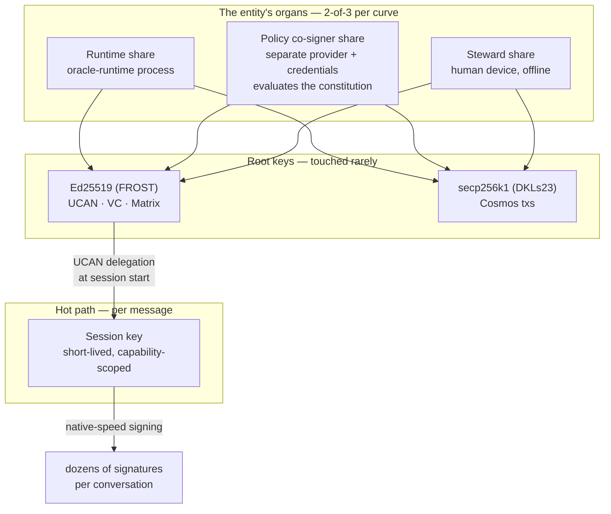

# Sovereign Key Custody — Research Spike

**Status:** Research spike — findings and a recommended direction, not an approved plan
**Revision:** v1 — 2026-08-02
**Branch:** `claude/sovereign-agency-harness-09u8j6`
**Relates to:** `specs/sovereign-agency-harness.md` (§12 Identity Core, §15 Capability Kernel, Phase 3)

---

## The question

An entity is only as sovereign as its keys. `specs/sovereign-agency-harness.md` asserts that the entity's identity, authority and memory belong to it rather than to an operator — but an autonomous entity has no hands. Somebody's hardware executes every signature, and today that somebody is the operator.

This spike asks: **can a sovereign domain hold and use its own signing keys without an external party first delegating authority to it, and without depending on that party's continued goodwill?**

Scoping decisions taken during the spike:

| Question            | Decision                                                                                                                                                                                |
| ------------------- | --------------------------------------------------------------------------------------------------------------------------------------------------------------------------------------- |
| Trust envelope      | **Domain-governed only** — infrastructure the entity's own constitution governs, plus its own constitutional organs. Third-party signing networks excluded except as optional recovery. |
| Hosting             | **Commodity only this cycle** — must work on today's hosting with no TEE. TEE is the deferred hardening tier.                                                                           |
| Key surfaces        | **All three** — off-chain operational, on-chain root, encryption.                                                                                                                       |
| Chain evolution     | **In scope at module level** as roadmap items.                                                                                                                                          |
| Second trust domain | **Tiered by action class** — see [§5](#5-the-recommendation-tiered-quorum-by-action-class).                                                                                             |

---

## 1. The finding that shouldn't wait

Independent of any architecture decision, the current at-rest protection for the entity's keys is not sound. Verified directly in `packages/oracles-chain-client/src/matrix-bot/setup-claim-signing-mnemonics.ts:14-32`:

```ts
const iv = randomBytes(16);
const cipher = createCipheriv(
  'aes-256-cbc',
  Buffer.from(password.padEnd(32)),
  iv,
);
```

`password` is `MATRIX_VALUE_PIN`. It is space-padded to 32 bytes and used **directly as the AES-256 key**:

- **No KDF, no salt.** A short operator PIN becomes the key material verbatim. `"1234"` + 28 spaces is the AES key. Offline brute force against a captured ciphertext is trivial.
- **CBC without authentication.** Unauthenticated ciphertext is malleable; there is no integrity check on decryption.
- **Same routine protects both** the Ed25519 signing mnemonic (`encrypted_mnemonic_ed_signing`) and the P-256 secrets key.

So the "keys live in the entity's own encrypted Matrix room" custody story currently reduces to: _anyone holding the Matrix admin token and a low-entropy PIN recovers the entity's signing identity and its ability to read every user secret._

**Recommended immediately, independent of this spike:** a real KDF (Argon2id or scrypt, per-secret salt) and an AEAD (AES-256-GCM), with a migration that re-wraps existing material. This is a small, self-contained change and should not be bundled with the architecture work below.

---

## 2. The as-is custody map

Reported by code inspection across `oracle-runtime` and `oracles-chain-client`.

| Key / credential         | Type                                       | At rest                               | Unlocked by              | Live in                                 | Signs / unlocks                                                 |
| ------------------------ | ------------------------------------------ | ------------------------------------- | ------------------------ | --------------------------------------- | --------------------------------------------------------------- |
| Ed25519 signing mnemonic | Ed25519 (seed = `SHA256(mnemonic)[0..32]`) | Matrix state event, AES-CBC(PIN)      | admin token + PIN        | `UcanService` (plaintext, process life) | UCAN invocations, VC/claim proofs; is the IID `assertionMethod` |
| P-256 encryption key     | EC P-256 JWK                               | Matrix state + timeline, AES-CBC(PIN) | admin token + PIN        | `SecretsService` singleton              | JWE decrypt of all user secrets                                 |
| Cosmos wallet            | secp256k1, `m/44'/118'/0'/0/0`             | **`SECP_MNEMONIC` env, plaintext**    | —                        | `Client.wallet` singleton               | every on-chain tx; pays gas                                     |
| Matrix admin token       | opaque bearer                              | **env, plaintext**                    | —                        | ConfigService                           | read/write _all_ room state — including the vault above         |
| Matrix E2E device keys   | Olm/Megolm                                 | on-disk SQLite                        | `MATRIX_RECOVERY_PHRASE` | crypto store                            | device identity, E2E                                            |

**Everything collapses to process env plus process memory.** The encrypted-at-rest layer is defeated by the two env vars that sit beside it. Custody at rest ≠ custody in use: the entity owns the vault, the operator owns the room the vault is in and the hands that open it.

This is the honest baseline. Not a criticism of the design — it is the normal starting point, and it is exactly what the sovereign harness sets out to invert.

---

## 3. What the three key surfaces actually need

The single phrase "the entity's keys" hides three problems with three different answers.

| Surface                   | Examples                                       | Best available answer                                                                                                                    |
| ------------------------- | ---------------------------------------------- | ---------------------------------------------------------------------------------------------------------------------------------------- |
| **On-chain root control** | entity NFT ownership, IID controller, treasury | **Keyless.** Authority becomes on-chain logic; no key to custody. Available today.                                                       |
| **Off-chain operational** | UCAN invocations, VC proofs, Matrix events     | **Threshold + session keys.** Cannot be eliminated; can be split so no single party holds it.                                            |
| **Encryption**            | P-256 secrets JWK, Matrix E2E                  | **Hardest residual.** Threshold _decryption_ is far less mature than threshold signing; partially addressable by blast-radius reduction. |

### 3a. On-chain root: keyless, today

IXO already ships the primitives, live on mainnet:

- **`x/smart-account`** — the Osmosis authenticator framework (`SignatureVerification`, `AnyOf`, `AllOf`, `MessageFilter`, `CosmwasmAuthenticatorV1`), extended by IXO with WebAuthn. Activated in the v4 upgrade.
- **Entity accounts are keyless and module-owned.** `MsgCreateEntityAccount` creates an account with no user-held key; `MsgGrantEntityAccountAuthz` issues a standard Cosmos authz grant so a grantee acts _as_ the entity for exactly the granted message types — revocably, by message type, without ever holding the entity's key.
- **`x/authz`, `x/feegrant`, CosmWasm, and ICA (host + controller)** are all wired.

That is the sovereign inversion already available: the oracle's chain authority stops being "a wallet the operator provisioned" and becomes "a bounded, revocable grant from a keyless entity account, authorized by IID controllers." Ownership can sit with a CosmWasm DAO or a smart-account composite rather than a lone keypair.

Two claims to verify before relying on them: whether CosmWasm code upload is permissionless on mainnet, and whether the entity/IID handlers accept a contract or ICA address as controller (the type system permits it; the keeper checks were not read). Note `x/group` is **not** wired — use a CosmWasm DAO or smart-account composite instead of an SDK group policy.

### 3b. Off-chain operational: the irreducible hot path

Chain-side control can _gate and attest around_ these, never _hold_ them:

1. UCAN invocation signing (Ed25519), minted per request
2. VC / JSON-LD proofs (Ed25519)
3. Matrix event signing and E2E device keys
4. HTTP bearer auth (opaque secrets, not signatures)
5. P-256 JWE decryption

Even a maximally chain-native design still needs one Ed25519 signer, one P-256 decryptor and Matrix device keys live in-process. **The target is therefore keyless on-chain authority plus a hardened off-chain signer — not "fully keyless," which is not achievable.**

---

## 4. Options evaluated, against the constraints

### Ruled out by "domain-governed only"

**Third-party signing networks** (Lit, NEAR Chain Signatures, Ika, Turnkey, Privy). Beyond the constraint, the evidence independently discourages betting on them:

- **Lit Protocol is mid-pivot away from threshold MPC.** The MPC network (Naga) is being sunset roughly 30 days after the successor ("Chipotle") reaches production; the replacement is _single-enclave_ execution on Phala dstack with on-chain key release. The property that made Lit attractive — a quorum of independent parties evaluating policy before any share exists — is being retired. Recovery/migration procedures are undocumented.
- **NEAR Chain Signatures** is technically strong (both curves; policy can be a contract, so evaluation inherits L1 consensus) but every signature is an on-chain transaction: ~2–3 s and a public record per signature. Unusable as a hot path, and it places the entity's constitution on a different L1.
- **Turnkey and Privy** reduce to one company plus AWS. Privy reconstructs the full key inside an enclave at every signature.
- **Entropy** has the most philosophically aligned design (immutable WASM policy programs evaluated by the signer set before threshold-signing) but is testnet-stage and ECDSA-only. Worth tracking as the blueprint for an IXO-native module.

### Deferred by "commodity only"

**TEE-anchored derivation** — the strongest available answer, deferred rather than rejected. The shape: derive the entity's keys from a _governed identity_ inside attested hardware, release them only to approved capsule digests, sign locally at native speed, and let an on-chain registry own the upgrade path. dstack's `compose-hash → AppAuth contract → deterministic derived key` is structurally the closest existing implementation of "key bound to capsule digest + constitution CID." Oasis ROFL offers native `KeyKind.ED25519`/`SECP256K1` derivation with an on-chain policy. Both ship today.

Three facts that shape when and how to adopt it:

1. **Commodity PaaS has nothing TEE-shaped.** No confidential-computing product on Fly.io, Render or Railway. TEE anchoring forces hyperscaler confidential VMs, bare metal, or crypto-native TEE clouds — a hosting change, which is precisely why it is deferred.
2. **Physical attacks now break attestation itself.** TEE.fail (Oct 2025) demonstrated sub-$1,000 DDR5 interposer attacks extracting attestation keys from SGX, TDX _and_ SEV-SNP on fully-patched platforms; Battering RAM and WireTap did the same for DDR4. Vendors classify physical interposers as out of threat model. Against a _remote_ adversary patched TDX/SEV-SNP remain strong; against someone with DIMM access, assume the whole story — including forged attestation — is breakable. Hosting in audited datacenters is a real mitigation; the residual does not vanish.
3. **Governance capture is the quiet backdoor.** In every derivation-based system, whoever can approve a new measurement can approve a malicious build that re-derives and exfiltrates the key. dstack makes this explicit (AppAuth), ROFL makes it the app admin, AWS makes it whoever holds `kms:PutKeyPolicy`. **"The code owns the key" is really "the upgrade-approval process owns the key."** This is where binding approvals to the constitution CID earns its keep — and it is a design decision to make _now_, because it shapes the registry schema whether or not we deploy on a TEE this cycle.

### What survives: self-hosted threshold signing

No external network delivers all four of {both curves, protocol-grade policy evaluation, non-party liveness, sub-300 ms at zero marginal cost}. Self-hosted threshold signing across the entity's own organs delivers all of them, on commodity hardware, with audited open-source components:

- **FROST** (RFC 9591) for Ed25519 — ZF FROST is NCC-audited and feature-complete, with 2-round DKG, proactive share refresh and a Repairable Threshold Scheme for recovering a lost share without regenerating the key. `@noble/curves` now ships RFC 9591 ciphersuites, making a pure-TypeScript participant plausible.
- **DKLs23** for secp256k1 ECDSA — Trail of Bits audited, production at BitGo/MetaMask scale.

Two hard constraints found:

- **FROST(secp256k1) emits Schnorr, not ECDSA.** Cosmos transactions require ECDSA. This is two schemes and two DKG ceremonies, not one.
- **Never GG18/GG20.** Axelar removed it from their codebase and retreated to weighted multisig; THORChain reportedly lost $10.7M in May 2026 to that bug class.

---

## 5. The recommendation: tiered quorum by action class

Self-hosted 2-of-3 across the entity's **own organs**, with the quorum requirement varying by what the action does.



**The tiering.** The constitution declares which quorum each action class requires — reusing the vocabulary the gate already implements:

| Action class                                                     | Quorum                       | Consequence                                             |
| ---------------------------------------------------------------- | ---------------------------- | ------------------------------------------------------- |
| `read`, `propose`                                                | none — session key alone     | Full autonomy, no root signature                        |
| `write`, `evaluate`, `execute`                                   | runtime + policy co-signer   | Autonomy preserved; co-signer enforces the constitution |
| `pay`, `issue`, `mint`, `transfer`, `govern`, `delete`, `revoke` | runtime + **steward device** | **Cannot happen unattended, by construction**           |

**Why the tiering is the whole point.** A share held by an unattended runtime on a commodity host is effectively hot whenever the entity acts alone — which would quietly collapse the threshold back toward operator custody. The tiering resolves this honestly: the routine tier accepts that the co-signer raises cost and creates an audit trail rather than making compromise impossible, while the value-bearing tier is genuinely unforgeable without a second human-held device. The entity trades away the ability to move value unattended, and gets in exchange a guarantee that no operator compromise can move value at all.

**The session-key tier is not optional.** Every architecture surveyed forces it: nothing delivers per-message signing at conversational latency with strong custody. UCAN already expresses exactly this — a root DID delegating a time-boxed, capability-attenuated session key. The root is touched about once per session; the session key does the chatty work. Residual risk is bounded by how narrowly that session capability is scoped and how short its TTL is.

### Two convergences worth naming

**The constitution gate becomes the co-signer.** The policy co-signer is not a new concept — it is the `authorize()` evaluator from `specs/sovereign-agency-harness.md` Phase 1, moved into a separate trust domain and given a key share. The constitution stops being only a structural check in middleware (which an operator with host access could bypass) and becomes a **cryptographic precondition**: without the gate's agreement no signature exists at all. Separation of powers implemented in key material.

**Human review and threshold co-signature unify.** Phase 1's `manual_review_required` currently produces an escalation and waits for a signed approval proof. Under this architecture the steward's approval _is_ their signing round: the approval proof and the signature share become the same artifact, still bound to the request digest. This should shape the Phase-1 human-review design now, before it is built.

### What this costs

|                  |                                                                                                                                                         |
| ---------------- | ------------------------------------------------------------------------------------------------------------------------------------------------------- |
| Latency          | ~10–300 ms per root signature; session-key signatures are local and free                                                                                |
| Marginal cost    | zero                                                                                                                                                    |
| Ops              | two DKG ceremonies (Ed25519 + secp256k1), a second daemon on separate infrastructure, scheduled proactive share refresh, a documented recovery ceremony |
| New failure mode | losing two shares requires the recovery ceremony; refresh discipline becomes a real operational obligation                                              |
| Honest limit     | one operator holding both credential sets defeats the routine tier — hence the steward tier for anything that matters                                   |

---

## 6. Phasing

**Now, standalone:** fix the at-rest crypto (§1). Independent of everything else.

**Near term, no chain work:**

- Move on-chain authority to entity account + authz grants; replace bare signature authentication with `AllOf(SignatureVerification, MessageFilter, …)`; entity ownership to a DAO or smart-account composite; gas via feegrant.
- Design the session-key delegation tier into the UCAN module — required under every architecture, and already Phase 3 of the harness spec.
- Design the human-review artifact as a co-signature from the start.

**Then:** the 2-of-3 organs. FROST-Ed25519 + DKLs23-secp256k1, policy co-signer daemon on separate infrastructure, steward device for the value tier, recovery share encrypted to governance.

**Roadmap, chain work:** a `CosmwasmAuthenticatorV1` encoding threshold or attestation policy — the bridge that lets the chain accept the entity's transactions only under a quorum or a verified TEE quote. Further out, a keychain-registry module in the Warden/Zenrock shape (on-chain constitution evaluation authorizing a bonded signer set) would make "authorized by on-chain entity governance" verifiable to outside parties for _every_ IXO entity.

**Deferred, hosting-dependent:** TEE anchoring. Design the registry schema now — approved capsule digests plus constitution CID, with constitution changes on the strictest approval path and a timelock so dependents can exit before a new capsule activates — so re-anchoring later is a governance event rather than an identity change.

---

## 7. What I would verify next

1. CosmWasm mainnet `code_upload_access` (genesis params) — gates every custom-authenticator plan.
2. Whether `x/entity` / `x/iid` handlers accept a contract or ICA address as owner/controller — load-bearing for "entity owned by a DAO."
3. `@noble/curves` FROST module audit scope — decides pure-TS participant vs Rust sidecar.
4. Whether threshold _decryption_ for the P-256 secrets key is practical, or whether blast-radius reduction (per-room derived keys rather than one global JWK) is the realistic near-term answer.
5. Matrix E2E device keys under a threshold model — likely irreducible; needs an explicit statement of what sovereignty means for them.

---

## 8. References

**Verified locally:** `packages/oracles-chain-client/src/matrix-bot/setup-claim-signing-mnemonics.ts` (at-rest routine), `setup-encryption-key.ts`, `packages/oracle-runtime/src/bootstrap/create-oracle-app.ts` (`wireSigningAndEncryptionKeys`), `packages/oracle-runtime/src/modules/ucan/ucan.service.ts`.

**Threshold:** RFC 9591 (FROST); ZF FROST (`frost.zfnd.org`, NCC audit); Silence Laboratories DKLs23 (Trail of Bits, 2023); LFDT-Lockness cggmp21; `@noble/curves`. Cautionary: Axelar `tofn` GG20 removal; THORChain May 2026 incident; TSSHOCK / CVE-2023-33241.

**Chain-native:** `ixofoundation/ixo-blockchain` (`x/smart-account`, `app/keepers/keepers.go`, v4 upgrade constants); Osmosis `x/smart-account`; ICS-027; Warden Protocol `x/warden`; Zenrock zrChain.

**TEE:** dstack (arXiv 2509.11555; `docs.phala.com/dstack`); Oasis ROFL (`docs.oasis.io/build/rofl`); NEAR Shade Agents (pattern; standalone tooling sunset April 2026); AWS Nitro Enclaves + KMS attestation conditions; Automata on-chain DCAP verification. Attacks: TEE.fail (Intel advisory INTEL-2025-10-28-001), Battering RAM, WireTap, BadRAM, CacheWarp.

**Signing networks:** Lit Protocol (Naga → Chipotle migration); NEAR Chain Signatures (`near/mpc`); Ika; Entropy; Turnkey; Privy; Web3Auth MPC Core Kit.
