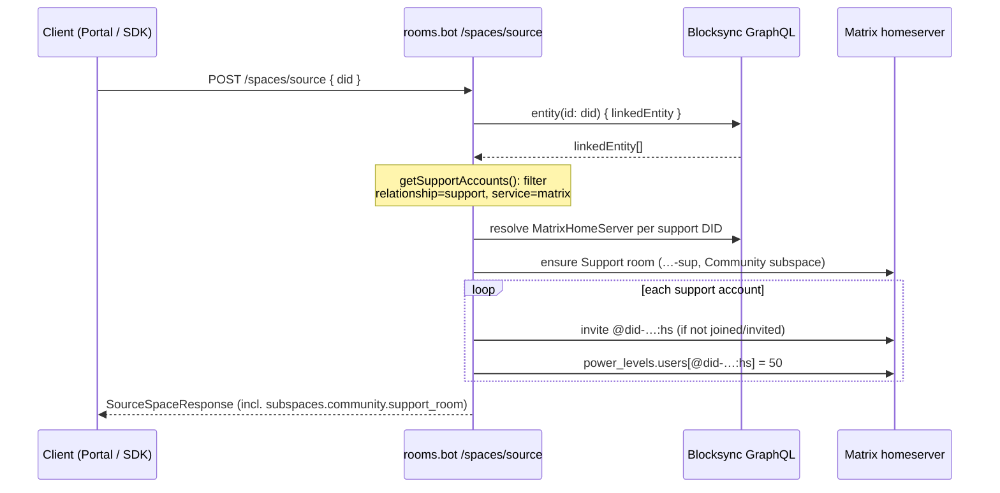

# `/spaces/source`: provision Support-room membership from the entity DID document

**Target service:** the rooms bot (`rooms.bot.<homeserver-domain>`, repo `ixofoundation/ixo-matrix-appservice-rooms`) — NOT this repo. QiForge ships the shared resolver and the client contract; this spec is the handoff for the rooms-bot change. It is written to be implementable without re-deriving context.

## Why

Oracles now escalate customer-support conversations by posting an intentional-mention notification into the entity's **Support room** (`did-ixo-entity-<addr>-sup`, under the Community subspace) — see the concierge plugin in `packages/oracle-runtime/src/plugins/concierge/escalation-tool.ts`. For those mentions to notify anyone, the humans designated as support for the entity must actually be members of that room, with enough power to moderate it. The entity's **DID document is the source of truth** for who those humans are.

## Support-account convention (authoritative)

A support account is a `linkedEntity` entry on the entity's DID document with:

| Field          | Value                      |
| -------------- | -------------------------- |
| `service`      | `"matrix"`                 |
| `relationship` | `"support"`                |
| `id`           | the support **user's DID** |

Entries with any other `relationship`/`service`, or with a non-DID `id`, are not support accounts. Malformed entries must be skipped, never fatal.

## Required behaviour

When the scaffold runs from chain data via `POST /spaces/source` for an entity DID:

1. **Resolve support accounts** from the entity DID document. Use the shared resolver instead of re-implementing the convention:

   ```ts
   import {
     getSupportAccounts,
     getSupportRoomAlias,
   } from '@ixo/oracles-chain-client';

   const accounts = await getSupportAccounts(entityDid);
   // → [{ did, relationship: 'support', service: 'matrix' }, …]
   ```

   `getSupportAccounts` queries blocksync for `entity.linkedEntity`, filters by the convention above, tolerates malformed entries, and caches briefly. `getSupportRoomAlias(entityDid, homeserverName)` derives `#<entity DID with ':' → '-'>-sup:<homeserver>`.

2. **Resolve each support DID to a Matrix user ID.** Per-DID homeserver via the DID document's `MatrixHomeServer` service (`getMatrixHomeServerCroppedForDid` from the same package), then `@<did with ':' → '-'>:<homeserver>`. A DID whose homeserver cannot be resolved is skipped with a warning (do not fail the scaffold).

3. **Add them to the Support room ONLY** — the room with alias localpart `<hyphenated entity DID>-sup` under the **Community** subspace:
   - Invite each resolved support user that is not already joined/invited.
   - Set their power level to **50 (moderation)** in the Support room's `m.room.power_levels` (`users[<matrix id>] = 50`). Re-assert 50 on every run, including for already-joined members whose PL drifted below 50.
   - Include the Support room in the response payload (see contract below) so clients can surface it.

4. **Scope guard:** this support-role application is **specific to the Support room**. Every other sourced room and subspace keeps its existing controller/admin membership rules unchanged. Support accounts get no additional membership or power anywhere else by this mechanism.

5. **Idempotence:** `/spaces/source` re-runs must converge, not error or duplicate:
   - Already-invited/joined support users are left as-is (PL re-asserted).
   - A support entry **removed** from the DID document does NOT auto-kick or demote the user — flag it in the service logs for operator review instead (removal may be temporary or an operator mistake; ejection is a human decision).

6. **Failure modes** (all non-fatal to the scaffold as a whole; log with the entity DID + support DID):
   - Blocksync query fails → skip support provisioning this run, log, continue scaffolding.
   - A support DID has no resolvable Matrix homeserver → skip that account.
   - Invite rejected by federation / user server → skip that account, log.
   - Support room missing (older space scaffolded before the Community subspace existed) → create it under the Community subspace using the standard room-creation path, then proceed.

## Response contract

Extend the `/spaces/source` response's `subspaces` with the Community subspace and its Support room. The client-side type (already shipped, optional/backwards-compatible) is `SourceSpaceResponse` in `@ixo/oracles-client-sdk` (`packages/oracles-client-sdk/src/matrix/types.ts`):

```jsonc
{
  "subspaces": {
    "oracles": {
      /* unchanged */
    },
    "community": {
      "space_id": "!…",
      "space_alias": "#…",
      "privacy": {
        "encrypted": true,
        "join_rule": "…",
        "history_visibility": "…",
      },
      "rooms": [
        /* … */
      ],
      "support_room": {
        "room_id": "!…",
        "room_alias": "#did-ixo-entity-<addr>-sup:<homeserver>",
      },
    },
  },
}
```

## Sequence



## How the oracle consumes this (context, already shipped in QiForge)

- The concierge's `escalate_to_support` joins the Support room by its alias and posts a message with `m.mentions.user_ids` set to the resolved support Matrix IDs — Matrix's intentional-mentions rules then push-notify exactly the members this scaffold provisioned.
- If the rooms-bot change is not yet deployed, escalation still posts the message with mention pills and a conversation permalink; support members are simply notified only once they join the room. Nothing breaks — this spec closes the loop.

## Acceptance checks

1. Seed a devnet entity DID doc with two `linkedEntity` support entries (one valid, one with `service: "email"`); run `/spaces/source`; the valid account is invited to `…-sup` with PL 50, the other is ignored.
2. Re-run `/spaces/source` twice — no duplicate invites, no errors, PL still 50.
3. Lower the support member's PL to 0 manually; re-run — PL restored to 50.
4. Remove the support entry from the DID doc; re-run — member NOT kicked; log line flags the divergence.
5. Response body contains `subspaces.community.support_room` and parses with `SourceSpaceResponse` from `@ixo/oracles-client-sdk`.
6. Other sourced rooms' membership/PLs are byte-identical before and after the change (regression check).
