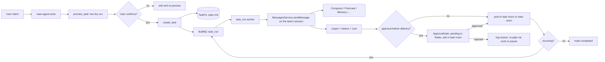

# Tasks Plugin — Async Tasks System — Technical Specification

**Status:** Spec-ready
**Author:** Yousef / QiForge
**Revision:** v1 — 2026-06-08
**Stack:** NestJS · BullMQ (Redis) · LangGraph/LangChain 1.x · Matrix · Zod · TypeScript · Vitest
**Supersedes:** `specs/ORA-165-tasks-module.md` (v3.0) and `specs/tasks/TASK-31-tasks-plugin.md` (port-as-is plan). Both are retired by this spec.

---

## What this is

A clean-sheet design for the bundled `tasks` plugin in `@ixo/oracle-runtime`. The product is one sentence: **run the agent on a schedule (or on a trigger), deliver the result.**

The previous attempt — `ORA-165` — designed an elaborate system around six task types, a Y.Doc + BlockNote "task page", chunked Matrix state-event indexes, a 700-line task-manager sub-agent prompt, and approval plumbing buried inside `MessagesService`. It worked, but creating a task felt like filing a tax return and editing the agent's behaviour required editing a wall of prose.

This rebuild collapses tasks down to a single primitive expressed in plain markdown, runs them out of one BullMQ queue, exposes a small set of tools directly on the main agent (no sub-agent), and stores the user-readable artifact (`spec.md`) behind a 4-method filesystem port (`TaskFs`). Today the port is Redis-backed; when the runtime grows a UCAN per-user filesystem (same auth model as `sandbox`), we swap one DI binding. Workers do **not** rebuild a `RuntimeContext` — each task owns a real session and workers call `MessagesService.sendMessage` on it, inheriting credits, auth, and checkpointer plumbing for free (plus per-task memory across runs).

## Goals

| #   | Goal                                                                                                                                                                                                                                  |
| --- | ------------------------------------------------------------------------------------------------------------------------------------------------------------------------------------------------------------------------------------- |
| G1  | Schedule the main agent to run at a time or on a trigger, with the same toolset the agent has at request time.                                                                                                                        |
| G2  | Make task creation **safe by default** — no task is saved until a live dry-run has been shown to the user and confirmed.                                                                                                              |
| G3  | Make the storage layer swappable. Redis today, file-system API tomorrow, no rewrite.                                                                                                                                                  |
| G4  | Re-implement the approval gate that was deleted in TASK-32b, entirely inside the plugin (zero edits to `MessagesService`).                                                                                                            |
| G5  | Give complex / high-frequency tasks their own Matrix room. Don't flood the main chat.                                                                                                                                                 |
| G6  | Self-heal: when a task fails repeatedly, propose a spec edit instead of looping silently.                                                                                                                                             |
| G7  | **Minimum plumbing.** Inherit every existing piece of agent infrastructure (auth, credits, checkpointer, capability gating). No parallel RuntimeContext builder, no shadow agent path. The worker is one call into `MessagesService`. |

## Non-goals

| #   | Non-goal                                                     | Why                                                                                                                                                   |
| --- | ------------------------------------------------------------ | ----------------------------------------------------------------------------------------------------------------------------------------------------- |
| N1  | A new sub-agent for task management.                         | The main agent gets thin tools; no extra hop, no extra prompt to maintain.                                                                            |
| N2  | A 6-axis task-type taxonomy.                                 | Replaced by one primitive (`TaskSpec`). Behaviour comes from the spec body and the trigger, not from a `taskType` field.                              |
| N3  | Y.Doc / BlockNote / Matrix state events as task storage.     | All replaced by Redis behind a port.                                                                                                                  |
| N4  | A bespoke web-search tool inside the plugin.                 | The work job inherits the main agent's toolset — Composio's search toolkits and Firecrawl cover this without a tasks-side dependency.                 |
| N5  | Token encryption (`apps/app/src/tasks/token-encryption.ts`). | UCAN handles per-call auth via `SecretsService`. The encryption shim is deleted.                                                                      |
| N6  | Chunked task-index Matrix state events.                      | A single Redis hash per user is the index. Browsable via `list_my_tasks`.                                                                             |
| N7  | Migrating live production tasks.                             | If any survive on `apps/app`, the team will recreate them post-cutover. No migration tooling.                                                         |
| N8  | Building a parallel "background `RuntimeContext`" path.      | The worker calls `MessagesService.sendMessage` on the task's own session. Whatever exists for `/messages` exists for tasks. §10.                      |
| N9  | Webhook / chain triggers in this rebuild.                    | Deferred to FOLLOWUP-2. Cron + one-shot cover the actual MVP demand.                                                                                  |
| N10 | A bespoke `TaskSpecStore` god-object with 15 methods.        | The port is a 4-method filesystem (`TaskFs`). Ephemeral state (locks, pending approvals) lives directly on Redis and never goes through the port. §6. |

---

## Table of contents

### Part I — Concept

1. [Mental model](#1-mental-model)
2. [The four axes](#2-the-four-axes)
3. [The TaskSpec format](#3-the-taskspec-format)

### Part II — Architecture

4. [The plugin shape](#4-the-plugin-shape)
5. [Folder layout](#5-folder-layout)
6. [Storage — the `TaskFs` port](#6-storage--the-taskfs-port)
7. [Triggers](#7-triggers)
8. [Dedicated task rooms](#8-dedicated-task-rooms)
9. [The approval gate](#9-the-approval-gate)
10. [Invoking the main agent — via `MessagesService`](#10-invoking-the-main-agent--via-messagesservice)
11. [The worker pipeline](#11-the-worker-pipeline)
12. [Credits, Composio, Firecrawl — what we inherit](#12-credits-composio-firecrawl--what-we-inherit)

### Part III — Surface

13. [Main-agent tools](#13-main-agent-tools)
14. [Shared state](#14-shared-state)

### Part IV — Operations

15. [Failure handling and self-healing](#15-failure-handling-and-self-healing)
16. [Testing strategy](#16-testing-strategy)

### Part V — Delivery

17. [Build phases](#17-build-phases)
18. [Cutover and cleanup](#18-cutover-and-cleanup)
19. [Open follow-ups](#19-open-follow-ups)
20. [Glossary](#20-glossary)

---

# Part I — Concept

## 1. Mental model

A task is **"run my agent with this intent, at this time/trigger, deliver here."** Nothing else. One mental model:



That is the entire system. Every section below is a refinement of a single arrow.

## 2. The four axes

A task is `(trigger, intent, approval, delivery)`. Every behaviour falls out of those four axes.

| Axis         | Values                                                                                                  | Notes                                                                        |
| ------------ | ------------------------------------------------------------------------------------------------------- | ---------------------------------------------------------------------------- |
| **Trigger**  | `time.once` · `time.cron` · `webhook` · `chain.after`                                                   | Phase 1 ships `time.*`. `webhook` + `chain.after` ship Phase 2.              |
| **Intent**   | Free-form markdown body of `spec.md` (sections `## What to do` / `## How to report` / `## Constraints`) | The agent reads this as a system instruction when the work job runs. No DSL. |
| **Approval** | `never` · `before-delivery`                                                                             | Phase 1 ships both. A future expansion (L1–L4 autonomy ladder) is V2 only.   |
| **Delivery** | `{ roomId, format }` where `roomId` is either `'main'` or a dedicated task room ID                      | The agent decides at create time whether to create a dedicated room (§8).    |

There is no `taskType`. The job is always the same: invoke the main agent against the spec body, with the trigger context attached.

## 3. The TaskSpec format

`TaskSpec` is one markdown blob, YAML frontmatter + markdown body. This is what gets stored, what the user reads, what the agent edits. There is no parallel object format — the markdown **is** the spec.

```markdown
---
id: task_a1b2c3d4e5f6
owner: did:ixo:abc...
title: Morning Crypto Brief
trigger:
  type: time.cron
  pattern: '0 7 * * *'
  tz: Africa/Cairo
delivery:
  roomId: '!XYZ:matrix.ixo.earth' # dedicated task room (or "main")
approval: never # or "before-delivery"
status: active # active | paused | failed-pending-review | completed | cancelled
sessionId: '$threadRoot:ixo.world' # the task's persistent agent session
stats:
  nextRunAt: '2026-06-09T05:00:00Z' # the only run bookkeeping kept on disk
---

## What to do

Summarize BTC, ETH, SOL price action over the last 24h.
Highlight any moves > 5%. Pull from CoinGecko.

## How to report

Concise paragraph + bullet list of movers. Link sources.

## Constraints

- Under 300 words.
- No trade recommendations.
```

**Frontmatter schema:**

```ts
const TaskFrontmatterSchema = z.object({
  id: z.string().regex(/^task_[a-f0-9]{12}$/),
  owner: z.string(), // user DID
  title: z.string().min(1).max(120),
  trigger: TriggerSchema, // discriminated union — §7
  delivery: z.object({
    roomId: z.union([z.literal('main'), z.string()]),
  }),
  approval: z.enum(['never', 'before-delivery']).default('never'),
  status: z
    .enum([
      'active',
      'paused',
      'failed-pending-review',
      'completed',
      'cancelled',
    ])
    .default('active'),
  // The task's persistent agent session (LangGraph thread). Created once at
  // create_task; every run continues this thread, so the task keeps memory
  // across runs ("compare to what you reported yesterday").
  sessionId: z.string(),
  stats: z.object({ nextRunAt: z.string().datetime().nullable() }),
});
```

Deliberately absent: `modelTier` (the `MessagesService` path has no per-call model override, so storing one would be a lie — model selection is a follow-up) and `delivery.format` (the `## How to report` body section is the format contract).

**Body shape:** three optional `##` sections, free markdown. The worker passes the body verbatim into the user-message slot of the agent invocation; the frontmatter never reaches the LLM.

**Why YAML frontmatter and not JSON next to a markdown body?** The user reads `spec.md` directly; YAML is friendlier to skim. The agent edits it via `update_task`, which round-trips through the Zod schema.

---

# Part II — Architecture

## 4. The plugin shape

```ts
// packages/oracle-runtime/src/plugins/tasks/tasks.plugin.ts
export class TasksPlugin extends OraclePlugin {
  name = 'tasks';

  manifest: PluginManifest = {
    title: 'Scheduled Tasks',
    summary: 'Schedule the agent to run at specific times or on triggers.',
    whenToUse: [
      'User asks to remind / schedule / set up a recurring report',
      "User says 'every morning', 'tomorrow at 5pm', 'when X happens'",
      'User wants the agent to watch something and report changes',
    ],
    whenNotToUse: [
      'One-shot action the user wants done right now — just do it',
    ],
    examples: [
      /* curated few-shot — see §13 */
    ],
    category: 'automation',
    visibility: 'always',
    stability: 'beta',
  };

  configSchema = z.object({
    REDIS_URL: z.string(),
    TASKS_MAX_PER_USER: z.coerce.number().int().positive().default(50),
    TASKS_RUN_LOCK_TTL_SEC: z.coerce.number().int().positive().default(600),
  });

  autoDetect = (env: NodeJS.ProcessEnv) => Boolean(env.REDIS_URL);
  autoDetectHint = 'REDIS_URL';

  softDependsOn = ['memory']; // memory enriches but is not required

  // The module's services only exist once Nest initialises, but tools and
  // the middleware are created at boot. `TasksModule.register({ onReady })`
  // hands the wired service bundle back; everything reads it lazily.
  private runtime: TasksRuntime | undefined;

  getTools(): PluginTool[] {
    return createTaskTools(() => this.runtime); // the 10 tools — §13
  }

  getMiddlewares(ctx: PluginContext): AgentMiddleware[] {
    return [
      createApprovalGateMiddleware({
        getRuntime: () => this.runtime,
        logger: ctx.logger,
      }),
    ];
  }

  getNestModules(): DynamicModule[] {
    return [TasksModule.register({ onReady: (rt) => (this.runtime = rt) })];
  }
}
```

The whole plugin surface is: 10 tools, 1 middleware, 1 Nest module. No sub-agent, no service locator, no plugin-owned Redis connections — the module owns the wiring and hands it back through `onReady`.

## 5. Folder layout

Flat — one file per concern, no nested sub-trees:

```
packages/oracle-runtime/src/plugins/tasks/
├── tasks.plugin.ts          # plugin class; owns the lazy TasksRuntime ref
├── manifest.ts              # PluginManifest + few-shot examples
├── index.ts                 # TasksPlugin, tasksManifest, APPROVAL_GATE_PORT
├── tasks.plugin.test.ts
└── internal/
    ├── spec.ts              # Trigger + TaskSpec Zod, markdown ↔ object, paths, hash
    ├── task-fs.ts           # TaskFs port (4 methods) + RedisTaskFs adapter
    ├── task-store.ts        # spec CRUD on top of TaskFs (load/save/list/setStatus)
    ├── redis-state.ts       # locks, failure counters, preview tokens, pending approvals
    ├── scheduler.ts         # queue defs + nextRunAtFor() + SchedulerService
    ├── delivery.ts          # room heuristic + Matrix posting + dedicated rooms
    ├── approval.ts          # ApprovalService + APPROVAL_GATE_PORT
    ├── invoker.ts           # AgentInvoker — sessions + MessagesService calls
    ├── middleware.ts        # approval gate (wrapModelCall) + classifyReplyFast()
    ├── run.worker.ts        # task_run processor
    ├── timeout.worker.ts    # task_approval processor (reminder + expiry)
    ├── runtime.ts           # TasksRuntime bundle type + config token + constants
    ├── tasks.module.ts      # DynamicModule: BullMQ root + queues + providers
    └── templates/           # Sample spec.md the agent can copy + fill
        ├── morning-brief.md
        ├── url-monitor.md
        └── weekly-report.md
```

## 6. Storage — the `TaskFs` port

Two kinds of state, two locations. **Don't conflate them.**

| Kind                                             | What                                              | Where today                                   | Where tomorrow                                                                                           |
| ------------------------------------------------ | ------------------------------------------------- | --------------------------------------------- | -------------------------------------------------------------------------------------------------------- |
| **Files** (per-task, user-owned, human-readable) | `spec.md` (and one day `runs.jsonl` — FOLLOWUP-3) | Redis adapter behind a 4-method `TaskFs` port | UCAN-authed per-user filesystem (same auth model as sandbox) via a `UcanFsAdapter` — drop-in replacement |
| **Ephemeral coordination state**                 | BullMQ jobs, run locks, pending-approval payloads | Direct Redis (BullMQ is already there)        | Direct Redis (this never becomes "files")                                                                |

Files go through the port. Locks and pending approvals do not — those are operational state, not artifacts, and forcing them through a filesystem abstraction would be cosplay.

### 6.1 The port

Four methods. Filesystem semantics, nothing more.

```ts
// packages/oracle-runtime/src/plugins/tasks/internal/store/task-fs.ts
export const TASK_FS = Symbol('TASK_FS');

export interface TaskFs {
  read(path: string): Promise<string | null>;
  write(path: string, content: string): Promise<void>;
  delete(path: string): Promise<void>;
  list(prefix: string): Promise<string[]>; // returns absolute paths under prefix
}
```

That's it. The port is intentionally small because the future replacement (a UCAN filesystem) will be small too.

### 6.2 Path scheme

```
/users/<userDid>/tasks/<taskId>/spec.md         # canonical TaskSpec (YAML + markdown body)
```

`list('/users/<userDid>/tasks/')` returns the user's task IDs (one prefix scan). The owner is encoded in the path so we never need a separate `resolveOwner` lookup. The future UCAN filesystem uses the same per-user-rooted layout.

A separate `runs.jsonl` for queryable run history is a follow-up (FOLLOWUP-3). In MVP the **Matrix room is the run log** — every delivery is a message, the user scrolls back.

### 6.3 Phase-1 implementation: `RedisTaskFs`

Trivial. Paths map to Redis STRING keys:

| Path pattern   | Redis op                                       |
| -------------- | ---------------------------------------------- |
| `read(p)`      | `GET tasks:fs:<p>`                             |
| `write(p, c)`  | `SET tasks:fs:<p> c`                           |
| `delete(p)`    | `DEL tasks:fs:<p>`                             |
| `list(prefix)` | `SCAN MATCH tasks:fs:<prefix>*` → strip prefix |

`spec.md` is the only file the port currently stores.

### 6.4 Ephemeral state — direct Redis, not files

Six Redis keys outside the port, owned by individual services:

| Owner              | Key                                | Type                                        | Purpose                                                          |
| ------------------ | ---------------------------------- | ------------------------------------------- | ---------------------------------------------------------------- |
| `ApprovalService`  | `tasks:approval:<taskId>`          | STRING (JSON), TTL 49h                      | Cached output awaiting decision                                  |
| `ApprovalService`  | `tasks:approval-room:<roomId>`     | STRING (taskId), TTL 49h                    | Room → pending taskId lookup for the middleware                  |
| `ApprovalService`  | `tasks:approval-resolved:<taskId>` | STRING (SETNX), short TTL                   | Idempotency on duplicate replies                                 |
| `TaskRunWorker`    | `tasks:lock:<taskId>`              | STRING (SETNX EX), `runLockTtlSec`          | Concurrent-run prevention                                        |
| `TaskRunWorker`    | `tasks:failures:<taskId>`          | HASH (`{ count, lastError, lastFailedAt }`) | Consecutive-failure tracking for self-healing — reset on success |
| `SchedulerService` | (BullMQ-managed)                   | various                                     | Job queue state                                                  |

These don't need a port. They're never "user-readable artifacts" — they're how the plugin coordinates with itself.

### 6.5 Future swap

When the runtime gains a UCAN per-user filesystem (same auth model as `sandbox`):

1. Implement `UcanFsAdapter` against the new filesystem MCP.
2. Replace the DI binding `TASK_FS → RedisTaskFs` with `TASK_FS → UcanFsAdapter` in `TasksModule`.
3. Done. No worker, tool, or middleware code changes. Tasks become genuinely browsable: the user can `ls /workspace/users/<me>/tasks/` and see their tasks as folders.

The ephemeral state in §6.4 stays on direct Redis — UCAN-fs would be the wrong tool for sub-50ms lock acquires.

## 7. Triggers

```ts
type Trigger =
  | { type: 'time.once'; runAtIso: string; tz: string }
  | { type: 'time.cron'; pattern: string; tz: string }
  | { type: 'webhook'; secret: string } // Phase 2
  | { type: 'chain.after'; afterTaskId: string; on: 'success' | 'any' }; // Phase 2
```

**`time.once`** — Scheduler enqueues a `task_run` job with `delay = msUntil(runAtIso)`. After delivery, status → `completed`.

**`time.cron`** — Scheduler enqueues the first run with the same delay logic. The worker, after delivery, computes the next cron occurrence and enqueues the next `task_run` job. We do **not** use BullMQ's `repeat` option because cron-recompute-per-run is easier to test, easier to pause/resume, and immune to BullMQ repeat-key edge cases observed in the legacy system.

**`webhook`** (FOLLOWUP-6) — `POST /tasks/webhook/:taskId` with an `X-Task-Secret` header. The controller validates HMAC against the spec's `trigger.secret`, then directly enqueues a `task_run` for that taskId.

**`chain.after`** (FOLLOWUP-6) — The worker, after a successful run of task A, queries for tasks with `trigger.type === 'chain.after' && trigger.afterTaskId === A`, and enqueues one `task_run` per match. The chained job receives the parent run's output in its context so the child agent can reference it.

The discriminated union means triggers can grow without touching the rest of the system.

## 8. Dedicated task rooms

Not every task gets a room. The default is to deliver into the user's main room. A dedicated room only gets created when:

1. The trigger fires more often than once per day (cron interval `< 24h`), OR
2. The trigger is `webhook` or `chain.after` (unknown frequency), OR
3. The user explicitly asks for one, OR
4. The intent body crosses a length threshold or mentions "track", "monitor", "ongoing".

The `create_task` tool accepts `dedicatedRoom: 'auto' | 'yes' | 'no'` (default `'auto'`). When `'auto'` triggers a room, the agent **asks the user first**:

> "This will run every 30 minutes — want a dedicated room so it doesn't flood your main chat? [yes / no]"

When a dedicated room is created:

- Name: `[Task] <title>`
- The plugin creates the room via `MatrixService`, invites the user.
- The first message in the room is the `spec.md` rendered as Matrix HTML (so the user can scroll back and see what they signed up for).
- All future deliveries, run summaries, and approval requests post into this room.
- The spec's `delivery.roomId` is set to the room's Matrix ID. Workers don't need to re-decide per run.

When `dedicatedRoom: 'no'`, `delivery.roomId = 'main'` and the room resolver looks up the user's main session room at delivery time.

## 9. The approval gate

This re-implements the plumbing deleted in TASK-32b — and it lives entirely inside the plugin. `MessagesService` does not learn about tasks.

### 9.1 Where the gate plugs in

The plugin registers `createApprovalGateMiddleware` via `getMiddlewares()`. It's a single `wrapModelCall` hook — it wraps every model invocation in the main agent's graph and can either skip the model entirely (fast path) or call it with extra context (ambiguous path).

### 9.2 Flow

1. **Pre-check.** `GET tasks:approval-room:<roomId>` (1 Redis op — ephemeral state, not a file; §6.4). No pending approval for this room → pass the model call through untouched.
2. **Fast classification (keywords, no LLM).** Normalize the last user message and match against approve (`yes`, `y`, `ok`, `approve`, `do it`, `go`, `ship`, `send`, …) and reject (`no`, `n`, `cancel`, `reject`, `stop`, `don't`, …) sets, including short two-word prefixes ("yes please", "ok do it").
3. **Approved** → `ApprovalService.approve(taskId)`: claim the resolution (SETNX), clear pending keys, cancel the timeout jobs, post the cached output to the room, reset the failure counter. The middleware returns a short acknowledgement `AIMessage` directly — **the model is never called**.
4. **Rejected** → `ApprovalService.reject(taskId)`: same claim/clear/cancel, post a "discarded" notice, record the rejection on the failure counter (§6.4). Threshold (3) reached → status `failed-pending-review` + a "suggest a fix" prompt in the room.
5. **Ambiguous** ("send it but include volume next time") → the model IS called, with a system-prompt hint appended for this call only: _"a task result is pending approval here; if the reply addresses it, call `resolve_pending_approval`."_ The main agent resolves the nuance itself through that tool — approving, rejecting with a reason, or doing both an approval and a follow-up `update_task`. **There is no bespoke LLM classifier** — the agent that's already running is the classifier.

### 9.3 Idempotency

`ApprovalService` claims each resolution with a one-shot Redis SETNX (`tasks:approval-resolved:<taskId>`) before acting. Late duplicates — double ingress, a fast-path race with the `resolve_pending_approval` tool, BullMQ redelivery of the expiry job — lose the claim and no-op.

### 9.4 Approval request location

Approval requests post to the spec's `delivery.roomId`. For tasks with a dedicated room, the ask lives there — consistent with where the user expects task activity. The `task_approval` queue schedules a reminder at 24h (re-post in the same room) and an expiry at 48h (mark `failed-pending-review`, clear pending).

### 9.5 Cross-plugin reuse

The plugin exports `APPROVAL_GATE_PORT` as a public Nest DI token so other plugins that want an approval gate (e.g. credits gating a large purchase) can call into the same Redis-backed gate without re-implementing it. The shape:

```ts
interface ApprovalGatePort {
  request(args: {
    taskId: string;
    owner: string;
    roomId: string;
    output: string;
  }): Promise<void>;
}
```

This is the only public Nest export the plugin exposes.

## 10. Invoking the main agent — via `MessagesService`

The worker does not rebuild `RuntimeContext`, does not call `createMainAgent` directly, does not invoke the LangGraph compile path. **It calls `MessagesService`** like any other in-process caller. Credits middleware, capability gating, checkpointer, auth, streaming, tool wrapping, and all the existing plumbing are inherited for free.

### 10.1 Two equivalent entry points

| Option                 | Shape                                                                                    | When to use                                                                                    |
| ---------------------- | ---------------------------------------------------------------------------------------- | ---------------------------------------------------------------------------------------------- |
| **A. In-process call** | Tasks `NestModule` injects `MessagesService` and calls a method on it directly.          | **Default.** No HTTP overhead, no auth handshake, same process.                                |
| **B. Loopback HTTP**   | Tasks worker `POST`s to `http://127.0.0.1:${PORT}/messages` with a service-trust header. | Only if the runtime ever splits the agent process from the worker process. Out of scope today. |

We ship Option A. The Tasks plugin's worker injects `MessagesService` and that's the whole "background invocation" story.

### 10.2 The entry point — `sendMessage` as-is, with real sessions

It turned out the runtime needs **zero new surface**. `MessagesService.sendMessage` already accepts a non-HTTP shape — the Matrix listener path uses it (`msgFromMatrixRoom: true`, which also suppresses the Matrix replay of input and output, exactly what Tasks wants since it owns delivery). The only hard requirement is that `sessionId` refers to a **real session**: `RequestPreparer.prepare()` throws `NotFoundException` for unknown ids.

So `AgentInvoker` (the plugin's thin wrapper) does:

- **`createSession(did, roomId?)`** — `SessionManagerService.createSession({ did, roomId, ... })`. The session anchors in the task's dedicated room when there is one, otherwise the user's main oracle room (resolved inside `createSession`). Called **once per task** at `create_task`; the id is stored in the spec's `sessionId` frontmatter field.
- **`run({ did, sessionId, message })`** — `messages.sendMessage({ did, sessionId, message, stream: false, msgFromMatrixRoom: true, clientType: 'matrix' })`, returning the assistant's text.

Because every run continues the same LangGraph thread, **a task has memory across runs** — the url-monitor template's "compare to what you reported last time" works out of the box via the checkpointer, no extra storage.

`preview_task` uses the same path with a throwaway session (created, run once, deleted), so previews exercise the real agent with the real toolset.

### 10.3 What this kills

- ❌ `BackgroundContextBuilder` — gone.
- ❌ Manual `buildRuntimeContext(runConfig, ambient, {...})` from the plugin — gone.
- ❌ Plugin-side DI of `UcanService`, `SecretsService`, `LlmAdapter`, `AMBIENT` — gone.
- ❌ A new `invokeForAutomation` method on `MessagesService` — not needed; `sendMessage` + real sessions already cover it.
- ❌ Concerns about which adapters are `@Global()` — gone.

Outside its own services, the Tasks module injects only `MessagesService`, `SessionManagerService`, and `ConfigService`. Matrix posting goes through the `MatrixManager` singleton, same as every other off-request consumer.

## 11. The worker pipeline

`run.worker.ts` — the hot path. One handler, ~80 LOC. The worker is deliberately dumb: it loads the spec, calls `AgentInvoker.run` (= `MessagesService.sendMessage` on the task's session), handles the result. All agent plumbing lives where it always lived.

```ts
@Processor(RUN_QUEUE, { concurrency: 5 })
export class TaskRunWorker extends WorkerHost {
  // store (spec CRUD), state (locks + failure counter), scheduler,
  // delivery (rooms + posting), approval, invoker (§10) — all via Nest DI.

  async process(job: Job<RunJobData>) {
    const { taskId, owner } = job.data;

    const spec = await this.store.load(owner, taskId);
    if (!spec || spec.frontmatter.status !== 'active') return; // skip silently

    if (!(await this.state.acquireRunLock(taskId, this.config.runLockTtlSec)))
      return; // duplicate delivery — already running

    try {
      // The whole "invoke the main agent" call — on the task's own session.
      const output = await this.invoker.run({
        did: owner,
        sessionId: spec.frontmatter.sessionId,
        message: spec.body,
      });

      const roomId = await this.delivery.resolveRoom(spec);
      if (!roomId) throw new Error('Could not resolve a delivery room');

      if (spec.frontmatter.approval === 'before-delivery') {
        await this.approval.request({ taskId, owner, roomId, output });
      } else {
        await this.delivery.post(roomId, output);
      }

      await this.state.resetFailures(taskId);
      await this.finishRun(spec); // once → completed; cron → persist + enqueue next
    } finally {
      await this.state.releaseRunLock(taskId);
    }
    // Errors are NOT caught here — they propagate so BullMQ retries with
    // backoff. Failure bookkeeping lives in onJobFailed (below).
  }

  @OnWorkerEvent('failed')
  onJobFailed(job, error) {
    if (job.attemptsMade < job.opts.attempts) return; // BullMQ will retry — not final
    // Final attempt exhausted: record ONE failure for the whole run,
    // reschedule the next cron occurrence (a transient failure must not kill
    // the task), and at the threshold flip to failed-pending-review + notify.
  }
}
```

Things to note:

1. **No `createMainAgent`, no `buildRuntimeContext`, no AMBIENT injection.** One call into `AgentInvoker.run`, which is one call into `MessagesService.sendMessage` (§10.2).
2. **Failure counting is per-run, not per-attempt.** `process()` throws; BullMQ retries up to 3 times with backoff; only when the final attempt fails does `onJobFailed` increment the consecutive-failure counter. One flaky morning can't burn the whole threshold.
3. **No run history written to disk.** Matrix is the run log — every delivery is a message in the task's room. Queryable `runs.jsonl` storage is FOLLOWUP-3.
4. **`TaskStore` owns every parse/render/path concern** — the worker never touches raw markdown; `RedisState` owns every ephemeral key — the worker never touches raw Redis.

Two queues, one worker each:

| Queue           | Concurrency | Retries                               | Notes                                                                              |
| --------------- | ----------- | ------------------------------------- | ---------------------------------------------------------------------------------- |
| `task_run`      | 5           | 3 attempts, exponential backoff (30s) | Run lock + per-fire-time job ids (`taskId:runAtIso`) make redeliveries no-ops.     |
| `task_approval` | 10          | 3 attempts, fixed 10s                 | Carries reminder + expiry jobs only — resolution happens inline (middleware/tool). |

## 12. Credits, Composio, Firecrawl — what we inherit

**Credits.** Already confirmed: the credits plugin installs a LangGraph middleware on the compiled main agent. The worker calls `MessagesService.sendMessage`, which compiles and invokes the same main agent the HTTP path does, so the middleware applies unchanged. `beforeModel` aborts if `remaining ≤ 0`; `afterModel` deducts via `TokenLimiter.limit()`. **Nothing for the Tasks plugin to do.** A preview run is also a normal agent invocation, so it's metered just like any other LLM call.

**Composio.** The Composio plugin is `visibility: 'on-demand'`. When the work job's agent decides to send a Gmail or create a Linear issue, it calls `load_capability('composio')` and the toolkit becomes available for the rest of that invocation. Crucially, **the user's UCAN delegation must be cached** at run time for Composio to mint per-call invocations — same as for sandbox. If it isn't, Composio tools degrade gracefully (zero tools exposed).

**Firecrawl + Composio search.** Web search is handled via whichever the user has loaded. Firecrawl covers "scrape this URL"; Composio's search toolkits cover "find me X on the web". The Tasks plugin does not need its own search tool.

---

# Part III — Surface

## 13. Main-agent tools

All ten tools are registered via `getTools()` and inherit the manifest's `visibility: 'always'`. There is no sub-agent. The agent sees them in its Tier-1 prompt.

### 13.1 `preview_task` — the safety rail

**Purpose:** run a candidate spec once, dry, before any persistence. Shows the user the real output the task would produce.

**Schema:**

```ts
input: z.object({
  title: z.string().min(1).max(120),
  intent: z.object({
    whatToDo: z.string().min(1),
    howToReport: z.string().optional(),
    constraints: z.array(z.string()).optional(),
  }),
});
output: z.object({
  previewToken: z.string(), // returned to create_task to prove a preview happened
  output: z.string(), // the actual agent output
});
```

**Behaviour:**

1. Render the intent body. Create a **throwaway session** (`AgentInvoker.createSession`), run one real agent turn on it — full toolset, credits metered — then delete the session row.
2. Store a short-lived single-use `previewToken` in Redis (`tasks:preview:<token>` → `{ owner, hash(title, body) }`, TTL 10m). Return the token + the output to the agent.

**Why a token?** `create_task` requires a previewToken from a preview whose `specHash(title, body)` matches what's being committed. This makes "preview then immediately schedule something completely different" impossible. If the user edits the spec after preview, the hash changes, and `create_task` rejects with `"please re-preview"`.

### 13.2 `create_task` — only after preview

**Schema:** `{ previewToken, title, trigger, intent, approval?, dedicatedRoom?: 'auto' | 'yes' | 'no' }` → `{ taskId, title, trigger, nextRunAt, roomId, approval }`.

**Behaviour:**

1. Consume the `previewToken` (single-use) — verify owner + spec hash.
2. Enforce `TASKS_MAX_PER_USER` against the user's live (non-cancelled, non-completed) tasks.
3. Compute `nextRunAt`; reject triggers with no future fire time.
4. Resolve `dedicatedRoom` policy (§8); create the `[Task]` room (spec posted as opening message) when it applies.
5. Create the task's persistent session, anchored in the dedicated room when there is one (§10.2).
6. `TaskStore.save(spec)` + `SchedulerService.enqueueRun(taskId, owner, nextRunAt)`.

### 13.3 `list_my_tasks`

`{ status?: TaskStatus[] }` → compact rows (id, title, status, trigger summary, nextRunAt), sorted by next run.

### 13.4 `get_task`

`{ taskId }` → full frontmatter + body + `lastError` (message, failedAt, consecutiveCount) when the task has been failing. Past-run output lives in the task's Matrix room. (Queryable per-run history is FOLLOWUP-3.)

### 13.5 `update_task`

`{ taskId, title?, trigger?, body?, approval? }`. Changing `trigger` cancels pending runs and re-enqueues from the new schedule.

### 13.6 `pause_task` / `resume_task` / `cancel_task`

One shared status-transition helper, three thin tools. Cancelled tasks can't be resumed; resuming recomputes `nextRunAt` from the trigger and resets the failure counter.

### 13.7 `suggest_spec_fix`

Returns `{ currentBody, lastError, consecutiveFailures }` plus an instruction telling the agent to propose a revised body, explain it, and only apply via `update_task` after the user confirms. **The agent does the diffing** — no extra LLM call inside the tool. The user is always in the loop; no auto-apply.

### 13.8 `resolve_pending_approval`

`{ decision: 'approve' | 'reject', reason? }`. The agent's half of the approval gate (§9.2 step 5): when a user's reply to a pending approval is nuanced, the gate hints the model and the model calls this. Looks up the pending task by the session's room, resolves through the same `ApprovalService` path as the fast keywords.

### 13.9 Few-shot examples in the manifest

The manifest ships worked examples (preview → create flow, list, pause, a nuanced approval reply). These do the prompt-engineering work that the legacy 700-line task-manager-prompt used to do.

## 14. Shared state

**Deferred (FOLLOWUP-9).** Earlier drafts exposed `myTasks` / `pendingApprovals` accessors via `getSharedState()`, but nothing consumes them today — shipping unused surface is how plugins rot. The data is one `list_my_tasks` call away for the agent and one `TaskStore.list` away for any future plugin via `APPROVAL_GATE_PORT`-style wiring. Add accessors when a real consumer exists.

---

# Part IV — Operations

## 15. Failure handling and self-healing

| Class                         | Detection                                                            | Response                                                                                                                                                                                                         |
| ----------------------------- | -------------------------------------------------------------------- | ---------------------------------------------------------------------------------------------------------------------------------------------------------------------------------------------------------------- |
| Transient LLM error           | Worker catches                                                       | BullMQ retries (3, exponential). On final fail, increment `tasks:failures:<taskId>.count`, store `lastError`.                                                                                                    |
| User UCAN expired             | Worker observes empty Composio/sandbox toolset                       | Best-effort — run with what's available. If output is empty, treat as a failure (store hint in `lastError`).                                                                                                     |
| Spec validation broken        | Edit / migration broke the frontmatter                               | Task auto-paused; agent surfaces the broken row on next `list_my_tasks` with a `🔧` hint.                                                                                                                        |
| Repeated rejection (approval) | Approval `reject()` increments the same Redis counter                | Same threshold path → `failed-pending-review`.                                                                                                                                                                   |
| Threshold reached             | `tasks:failures:<taskId>.count ≥ maxConsecutiveFailures` (default 3) | Status → `failed-pending-review` (written back to `spec.md`). Agent posts in the task room: _"This task has failed 3 times. Want me to propose a fix?"_ `suggest_spec_fix` reads `lastError` to inform the diff. |

A successful run clears `tasks:failures:<taskId>` entirely. The counter never persists past a green run.

## 16. Testing strategy

Three layers. Vitest throughout.

### 16.1 Unit

- `spec.ts` — round-trip markdown ↔ object, malformed frontmatter rejection, canonical ids/paths, hash determinism.
- `task-store.ts` — CRUD + status transitions against an in-memory `TaskFs` fake; unparseable specs skipped on list.
- `scheduler.ts` — `nextRunAtFor` truth table (future one-shot, past one-shot, cron, bad pattern).
- `middleware.ts` — `classifyReplyFast` keyword table covered exhaustively.
- `delivery.ts` — `shouldCreateDedicatedRoom` heuristic truth table.

### 16.2 Plugin-level

- Plugin loads when `REDIS_URL` is set; absent when not.
- `getTools` returns the 10 documented tools.
- Tool handlers fail soft (clear error) before the Nest module attaches the runtime.
- `getNestModules` returns the dynamic `TasksModule`.

### 16.3 Integration

Single end-to-end test with `createTestRuntime`:

1. Preview a spec → assert output streamed, token returned.
2. `create_task` with the previewToken → assert spec stored, BullMQ job enqueued (with mock queue), task posted to room.
3. Run-time-trigger the worker manually (call the handler with the job) → assert the main agent was invoked + a delivery posted.
4. Inject a user "yes" reply → assert the approval gate intercepted, pending cleared, delivery posted.
5. Simulate 3 consecutive errors → assert status → `failed-pending-review` and `suggest_spec_fix` posts a diff.

We do **not** spin up real Redis or real BullMQ in unit tests; we use the test-runtime mocks. Integration tests that exercise real Redis run only in `--mode int` and are gated on `REDIS_URL` (throwing if missing, per the project's "no silent skips" rule).

---

# Part V — Delivery

## 17. Build phases

| Phase                    | Scope                                                                                                                                                                                                                                                                                                                                                                                                                                                                                                                                                                                                                                                          | Effort | Acceptance highlights                                                                                                                                                                                                                |
| ------------------------ | -------------------------------------------------------------------------------------------------------------------------------------------------------------------------------------------------------------------------------------------------------------------------------------------------------------------------------------------------------------------------------------------------------------------------------------------------------------------------------------------------------------------------------------------------------------------------------------------------------------------------------------------------------------- | ------ | ------------------------------------------------------------------------------------------------------------------------------------------------------------------------------------------------------------------------------------ |
| **0. Scaffold**          | Plugin folder, manifest, empty Nest module, config schema, auto-detect on `REDIS_URL`, smoke test.                                                                                                                                                                                                                                                                                                                                                                                                                                                                                                                                                             | 0.5d   | `tasks.plugin.test.ts` passes; plugin shows up in `app.plugins.status()` when `REDIS_URL` set.                                                                                                                                       |
| **1. MVP**               | Spec format + Zod; `TaskFs` port + `RedisTaskFs` for `spec.md` only (§6); `task_run` + `task_approval` queues + workers; `AgentInvoker` over the existing `MessagesService.sendMessage` with real per-task sessions (§10 — no new runtime surface); `time.once` + `time.cron` only; 10 main-agent tools including `preview_task` (real dry-run) and `create_task` (preview-token gated); conditional dedicated room creation; approval gate as a `wrapModelCall` middleware + `ApprovalService` + `APPROVAL_GATE_PORT` + `resolve_pending_approval`; delivery to main or dedicated room; Redis-backed per-run failure counter feeding `failed-pending-review`. | **4d** | End-to-end: "every day at 7am summarize crypto" → preview → confirm → scheduled → fires → delivers. "Yes/no" replies handled without an LLM call; nuanced replies handled by the agent. Three failed runs → `failed-pending-review`. |
| **2. Self-healing**      | `suggest_spec_fix` — returns the current body + `tasks:failures:<id>.lastError` so the main agent proposes the diff itself, posts it, and awaits user approval.                                                                                                                                                                                                                                                                                                                                                                                                                                                                                                | 0.5d   | After 3 errors, agent volunteers a fix and applies on user "yes".                                                                                                                                                                    |
| **3. Templates**         | `templates/*.md` shipped; few-shot in manifest so agent picks + fills automatically.                                                                                                                                                                                                                                                                                                                                                                                                                                                                                                                                                                           | 0.5d   | "Set up my morning brief" → one-turn template → preview → schedule.                                                                                                                                                                  |
| **4. Cleanup + cutover** | Delete `apps/app/src/tasks/`; delete `token-encryption.ts`; remove stale references; carry forward any tests that still apply (most won't); update `specs/tasks/TASK-31-tasks-plugin.md` to point at this spec.                                                                                                                                                                                                                                                                                                                                                                                                                                                | 0.5d   | `pnpm lint`, `pnpm format:check`, `pnpm test` green across packages.                                                                                                                                                                 |

**Total: ~5.5 days.** All wow features (preview, approval, conditional rooms) ship in Phase 1. Webhook + chain triggers, cost meter, per-task budget, queryable run history, REST surface — all deferred to follow-ups (§19).

## 18. Cutover and cleanup

- **Delete** `apps/app/src/tasks/` in its entirety. No `git mv`. The new plugin shares almost no code with the legacy folder; carrying it forward would muddy diffs.
- **Delete** `apps/app/src/tasks/token-encryption.ts`. UCAN is in. The shim is dead.
- **Delete** any references in `apps/app` to `TasksService`, `ApprovalService`, `TasksScheduler`. (TASK-32b already cut most of these; this pass finishes them.)
- **Update** `specs/tasks/TASK-31-tasks-plugin.md` with a header pointing at `specs/tasks-async-system.md` and a note that the port-as-is plan is retired.
- **Update** `specs/ORA-165-tasks-module.md` with a `Superseded by: specs/tasks-async-system.md` header. Keep the file for historical context; do not delete.
- **Add** to `apps/qiforge-example` an opt-in example: a tiny `tasks/sample-spec.md` so a fork developer can see one. No code change needed in `main.ts` — the plugin is bundled and auto-detects on `REDIS_URL`.

No live-task migration. If production has running tasks on the legacy system at cutover time, the team will recreate them post-deployment using the new tools. (Confirmed scope decision.)

## 19. Open follow-ups

These are deliberately **not** in scope. Filed here so they aren't lost. Most are "good to have" — the system works without them, they sharpen specific edges.

| ID          | Item                                                                                                                                                                            | Why deferred                                                                                                                                                                       |
| ----------- | ------------------------------------------------------------------------------------------------------------------------------------------------------------------------------- | ---------------------------------------------------------------------------------------------------------------------------------------------------------------------------------- |
| FOLLOWUP-1  | `UcanFsAdapter` — implement `TaskFs` (§6) against the runtime's eventual UCAN per-user filesystem (same auth model as `sandbox`).                                               | The FS API doesn't exist yet. Swap is one DI binding when it does.                                                                                                                 |
| FOLLOWUP-2  | **Per-run cost & token meter.** Surface `tokens` and `costUsd` from the `sendMessage` reply so the worker can store them in the run history or use them for budget enforcement. | The credits middleware already deducts via `afterModel`, but exposing the numbers from the return is implementation work that hasn't been verified. Confirm feasibility, then add. |
| FOLLOWUP-3  | **Queryable run history** — `runs.jsonl` per task on `TaskFs`, last N retained, plus a `list_runs(taskId)` tool.                                                                | Matrix is the natural log for MVP. Add the file-backed history when there's a real use case for queries beyond scrolling. Depends partially on FOLLOWUP-2 for tokens/cost.         |
| FOLLOWUP-4  | **Per-task monthly budget** — `budget.monthlyUsd` in the spec, enforced by the worker before each run.                                                                          | Depends on FOLLOWUP-2 (need a reliable per-run cost number).                                                                                                                       |
| FOLLOWUP-5  | **REST surface** for tasks (list/get/patch/pause/resume/cancel).                                                                                                                | Tasks are agent-managed by design; external HTTP isn't needed today. Add only when a non-agent consumer (admin tool, mobile UI) actually wants it.                                 |
| FOLLOWUP-6  | `webhook` and `chain.after` triggers.                                                                                                                                           | Needs concrete external consumers driving HMAC distribution + chain context shape.                                                                                                 |
| FOLLOWUP-7  | Composio triggers as a first-class `Trigger` type.                                                                                                                              | Composio plugin doesn't expose its trigger model yet. When it does, add `{ type: 'composio'; triggerId: string }`.                                                                 |
| FOLLOWUP-8  | L1–L4 autonomy ladder replacing the binary `approval` field.                                                                                                                    | MVP keeps `'never' \| 'before-delivery'`. The spectrum (silent / notify / approval / collab) is a UX enhancement once the gate is proven.                                          |
| FOLLOWUP-9  | `getSharedState()` accessors (`myTasks`, `pendingApprovals`).                                                                                                                   | No consumer exists today (§14). Add when one does.                                                                                                                                 |
| FOLLOWUP-10 | **Per-task model selection** (`modelTier` in the spec frontmatter).                                                                                                             | `MessagesService.sendMessage` has no per-call model override, so the field would be decorative. Needs a runtime hook first.                                                        |
| FOLLOWUP-11 | Replies-in-task-room as edit suggestions.                                                                                                                                       | When a user replies in a dedicated task room with "next time include sources", the agent should propose a `spec.md` diff.                                                          |
| FOLLOWUP-12 | Cross-user task sharing (`export_template`, `import_template`).                                                                                                                 | Library/marketplace shape.                                                                                                                                                         |
| FOLLOWUP-13 | Quiet hours / DND windows in `delivery`.                                                                                                                                        | Trivial to add but requires UX decisions on what "DND" means (delay vs. drop).                                                                                                     |

## 20. Glossary

| Term                | Meaning                                                                                                                                                              |
| ------------------- | -------------------------------------------------------------------------------------------------------------------------------------------------------------------- |
| **TaskSpec**        | The whole task expressed as YAML frontmatter + markdown body. Stored as one string.                                                                                  |
| **`spec.md`**       | The on-disk filename for a TaskSpec at `/users/<did>/tasks/<id>/spec.md`. Today backed by Redis; tomorrow by the UCAN per-user filesystem.                           |
| **`TaskFs`**        | The 4-method filesystem port (`read/write/delete/list`) that decouples the plugin from its storage backend. §6.                                                      |
| **Dedicated room**  | A Matrix room created per-task for tasks whose frequency or complexity warrants isolation. §8.                                                                       |
| **Approval gate**   | A `wrapModelCall` middleware that intercepts user replies when a pending approval exists for the room. Replaces deleted `tryHandleApprovalResponse`. §9.             |
| **`AgentInvoker`**  | The plugin's thin wrapper over `MessagesService.sendMessage` + real per-task sessions — how workers run the agent off-request with zero new runtime surface. §10.    |
| **Task session**    | The persistent LangGraph thread (stored as `sessionId` in the frontmatter) every run of a task continues — tasks have memory across runs. §10.2.                     |
| **Preview token**   | A short-lived single-use Redis key proving a `preview_task` ran against a specific spec hash. Required by `create_task`. §13.1.                                      |
| **Run lock**        | Redis SETNX on `tasks:lock:<taskId>` preventing concurrent execution of the same task. §11.                                                                          |
| **Failure counter** | Redis hash `tasks:failures:<taskId>` holding `{ count, lastError, lastFailedAt }`. Drives the `failed-pending-review` transition and feeds `suggest_spec_fix`. §6.4. |

---

## Appendix A — Sample interaction

```
User:  Every morning at 7, give me a crypto brief.
Agent: Here's a sample run so you can see what you'd get every day:
       (calls preview_task → streams output)
       """
       BTC was up 2.3% over the last 24h on news of …
       — BTC: 64,210 (+2.3%)
       — ETH: 3,420 (+1.1%)
       — SOL: 156.7 (-0.8%)
       Sources: coingecko, …
       """
       Schedule daily at 7am Africa/Cairo? [yes / edit / cancel]

User:  yes

Agent: (calls create_task with the preview token)
       Scheduled "Morning Crypto Brief" — runs daily 7:00 Africa/Cairo.
       Next run: tomorrow at 07:00. Approval: none.
       Use `list_my_tasks` to manage.
```

## Appendix B — Sample `spec.md` (the same task above)

```markdown
---
id: task_a1b2c3d4e5f6
owner: did:ixo:abc...
title: Morning Crypto Brief
trigger:
  type: time.cron
  pattern: '0 7 * * *'
  tz: Africa/Cairo
delivery:
  roomId: main
approval: never
status: active
sessionId: '$abc123:ixo.world'
stats:
  nextRunAt: '2026-06-09T05:00:00Z'
---

## What to do

Summarize BTC, ETH, SOL price action over the last 24h.
Highlight any moves > 5%. Pull from CoinGecko.

## How to report

Concise paragraph + bullet list of movers. Link sources.

## Constraints

- Under 300 words.
- No trade recommendations.
```
